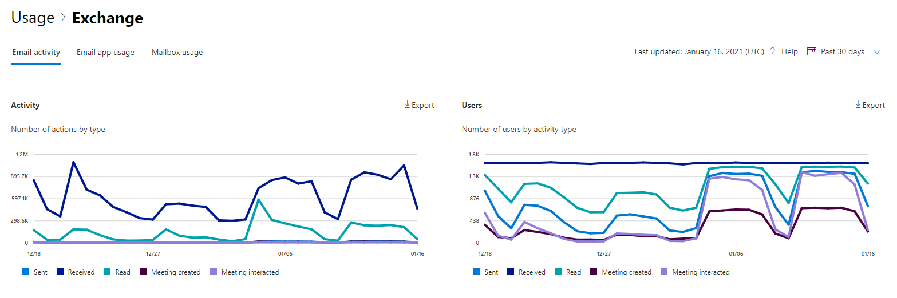

# Microsoft 365 관리 센터의 보고서 - 전자 메일 활동

Microsoft 365 **보고서** 대시보드에는 조직의 제품 전체에 대한 활동 개요가 표시됩니다. 보고서 대시보드를 통해 개별 제품 수준 보고서의 하위 수준을 표시하여 각 제품 내의 활동에 대한 더 세부화된 정보를 확인할 수 있습니다. [보고서 개요 항목](activity-reports.md)을 확인하세요.
  
예를 들어 보고서 페이지에서 조직 내의 전자 메일 트래픽을 개략적으로 본 다음, 조직 내 전자 메일 활동의 추세와 사용자 수준별 세부 정보를 이해하기 위해 전자 메일 활동 위젯을 표시할 수 있습니다.
  
> [!NOTE]
> 보고서를 표시하려면 Microsoft 365, Exchange, SharePoint, Teams 서비스, Teams Communications 또는 비즈니스용 Skype 관리자의 전역 관리자, 전역 읽기 권한자 또는 보고서 읽기 권한자 비즈니스용 Skype 있어야 합니다. 

## 전자 메일 활동 보고서에 액세스하는 방법

1. 관리 센터에서 **보고서** \> <a href="https://go.microsoft.com/fwlink/p/?linkid=2074756" target="_blank">사용 현황</a> 페이지를 참조하세요.
2. 전자 **메일 활동에서 더** **보기를 선택합니다.** 
3. 전자 **메일 활동 드롭다운** 목록에서 전자 **메일 Exchange** \> **선택합니다.**
  
## 전자 메일 활동 보고서 해석

**활동** 및 **사용자** 차트를 확인하여 사용자의 전자 메일 활동을 볼 수 있습니다. 
  

  
|항목|설명|
|:-----|:-----|
|1.    |**전자 메일 활동** 보고서에서 지난 7일, 30일, 90일 또는 180일간의 추세를 볼 수 있습니다. 그러나 보고서에서 특정 날짜를 선택하면 표(7)에 현재 날짜로부터 최대 28일간의 데이터가 표시됩니다(보고서가 생성된 날짜가 아 아지 않습니다).    |
|2.    |각 보고서의 데이터는 일반적으로 최근 24시간에서 48시간까지 처리됩니다.    |
|3.    |**활동** 차트를 사용하면 조직에서 수행되는 전자 메일 활동이 어느 정도인지 추세를 파악할 수 있습니다. 전자 메일 보내기, 전자 메일 읽기, 받은 전자 메일, 만든 모임 또는 모임 상호 작용 활동의 분할을 이해할 수 있습니다.    |
|4.    |**사용자** 차트를 사용하면 전자 메일 활동을 생성 중인 고유한 사용자 수의 추세를 파악할 수 있습니다. 전자 메일 보내기, 전자 메일 읽기, 전자 메일 수신, 모임 만들기 또는 모임 상호 작용 활동을 수행하는 사용자의 추세를 볼 수 있습니다.    |
|5.    | 활동 **차트에서** Y축은 보낸 전자 메일, 받은 전자 메일, 전자 메일 읽기, 만든 모임 및 상호 작용한 모임 유형의 활동 수입니다.     사용자 **활동** 차트에서 Y축은 보낸 전자 메일, 받은 전자 메일, 전자 메일 읽기, 모임 생성 또는 상호 작용된 모임 유형의 사용자의 수행 활동입니다.     두 차트의 X축은 모두 이 특정 보고서에 대해 선택된 날짜 범위입니다.    |
|6.    |범례에서 항목을 선택하여 차트에 있는 계열을 필터링할 수 있습니다.    |
|7.    | 이 표에서는 사용자 수준별 전자 메일 활동 분석 결과를 보여줍니다. Exchange 제품이 할당된 모든 사용자와 해당 전자 메일 활동을 보여줍니다.     **사용자 이름** 은 사용자의 전자 메일 주소입니다.    **표시 이름은** 사용자가 전체 이름인 경우입니다.    **삭제됨** 은 현재 상태는 삭제됨이지만 보고서의 보고 기간 중 일정 기간 활성이었던 사용자를 나타냅니다.    **삭제 날짜** 는 사용자가 삭제된 날짜입니다.    **마지막 활동 날짜** 는 사용자가 마지막으로 전자 메일 읽기 또는 보내기 활동을 수행한 시간을 나타냅니다.    **보내기 동작** 은 사용자에 대한 전자 메일 보내기 동작이 기록된 횟수입니다.    **받기 동작** 은 사용자에 대한 전자 메일 받기 동작이 기록된 횟수입니다.    **읽기 동작** 은 사용자에 대한 전자 메일 읽기 동작이 기록된 횟수입니다.    **모임 생성 작업은** 사용자에 대해 모임 요청 보내기 작업이 기록된 횟수입니다.    **모임 상호** 작용 작업은 모임 요청이 사용자에 대해 수락, 미정, 거절 또는 취소 작업을 기록한 횟수입니다.    **할당된** 제품은 이 사용자에게 할당된 제품입니다.     조직의 정책으로 인해 사용자 정보를 식별할 수 있는 보고서를 볼 수 없는 경우 이러한 모든 보고서의 개인 정보 설정을 변경할 수 있습니다. 작업 **보고서의** 사용자 수준 세부 정보를 숨기는 방법 섹션을 [Microsoft 365 관리 센터.](activity-reports.md)    |
|8.    |열 **선택을 선택하여** 보고서에서 열을 추가하거나 제거합니다.    |
|9.    |내보내기 링크를 선택하여 보고서 데이터를 Excel .csv 내보낼 **수** 있습니다. 그러면 모든 사용자의 데이터를 내보내고 향후 분석을 위해 간단하게 정렬 및 필터링을 수행할 수 있습니다. 사용자가 2,000명 미만인 경우 보고서 자체의 표에서 정렬 및 필터링할 수 있습니다. 사용자가 2,000명 이상인 경우 필터링 및 정렬하려면 데이터를 내보내야 합니다.    |
|||
   
> [!NOTE]
> 전자 메일 활동 보고서는 라이선스가 있는 사용자와 연결된 사서함에만 사용할 수 있습니다.
