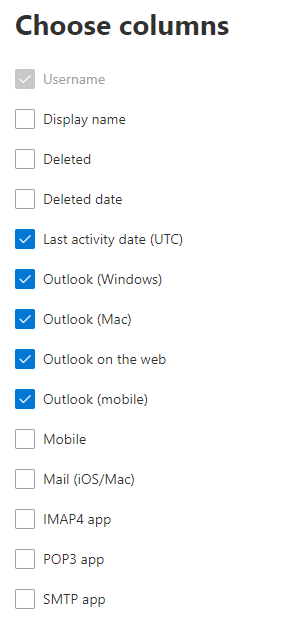

# Microsoft 365 관리 센터의 보고서 - 전자 메일 앱 사용 현황

Microsoft 365 **보고서** 대시보드에는 조직의 제품 전체에 대한 활동 개요가 표시됩니다. 보고서 대시보드를 통해 개별 제품 수준 보고서의 하위 수준을 표시하여 각 제품 내의 활동에 대한 더 세부화된 정보를 확인할 수 있습니다. [보고서 개요 항목](activity-reports.md)을 확인하세요. 전자 메일 앱 사용 현황 보고서에서 앱에 연결되는 전자 메일 앱의 수를 Exchange Online. 사용자가 사용하는 Outlook 앱의 버전 정보도 표시되며 이 정보를 확인하여 지원되지 않는 버전을 사용하는 사용자가 지원되는 버전의 Outlook을 설치할 수 있도록 조치할 수 있습니다.
  
> [!NOTE]
> 보고서를 표시하려면 Microsoft 365, Exchange, SharePoint, Teams 서비스, Teams Communications 또는 비즈니스용 Skype 관리자의 전역 관리자, 전역 읽기 권한자 또는 보고서 읽기 권한자 비즈니스용 Skype 있어야 합니다.  
 
## 전자 메일 앱 보고서에 액세스하는 방법

1. 관리 센터에서 **보고서** \> <a href="https://go.microsoft.com/fwlink/p/?linkid=2074756" target="_blank">사용 현황</a> 페이지를 참조하세요.
2. 전자 **메일 활동에서 더** **보기를 선택합니다.** 
3. 전자 **메일 활동 드롭다운** 목록에서 전자 **메일 Exchange** \> **사용 을 선택합니다.**
  
## 전자 메일 앱 보고서 해석

사용자 및 클라이언트 차트를 확인하여 전자 메일 앱 활동을 **볼** **수** 있습니다. 
  

  
|항목|설명|
|:-----|:-----|
|1.    |전자 **메일 앱 사용 현황** 보고서에서 지난 7일, 30일, 90일 또는 180일간의 추세를 볼 수 있습니다. 그러나 보고서에서 특정 날짜를 선택하면 표(7)에 현재 날짜로부터 최대 28일간의 데이터가 표시됩니다(보고서가 생성된 날짜가 아 아지 않습니다).    |
|2.    |각 보고서의 데이터는 일반적으로 최근 24시간에서 48시간까지 처리됩니다.    |
|3.    |**사용자** 보기에는 전자 메일 앱을 사용하여 Exchange Online에 연결한 고유 사용자 수가 표시됩니다.    |
|4.    |**앱** 보기에는 선택한 기간 동안 앱별 고유 사용자 수가 표시됩니다.    |
|5.    |버전 **보기에는** 각 버전의 각 버전에 대한 고유 사용자 수가 Outlook 수 Windows.    |
|6.    | **사용자** 차트에서 Y축은 보고 기간 중 임의의 날짜에 앱에 연결한 총 고유 사용자 수입니다.     **사용자** 차트에서 Y축은 보고 기간 동안 앱을 사용한 고유 사용자 수입니다.     **앱** 차트에서 Y축은 보고 기간 동안 특정 앱을 사용한 총 고유 사용자 수입니다.     **앱** 차트에서 X축은 조직의 앱 목록입니다.     **버전** 차트에서 Y축은 Outlook 데스크톱의 특정 버전을 사용하는 총 고유 사용자 수입니다. 보고서에서 보고서의 버전 번호를 확인하지 Outlook 수량은 확정되지 않은 **으로 표시 됩니다.**     **버전** 차트에서 X축은 조직의 앱 목록입니다.    |
|7.    |범례에서 항목을 선택하여 차트에 있는 계열을 필터링할 수 있습니다.    |
|8.    | 항목을 추가할 때까지 아래 목록의 열에 일부 항목이 표시되지 않을 수 있습니다.  **사용자** 이름은 전자 메일 앱 소유자의 이름입니다.    **마지막 활동 날짜는** 사용자가 전자 메일 메시지를 읽거나 보낸 마지막 날짜입니다.    **Mac Mail**, **Mac Outlook** 및 **Outlook**, **Outlook 모바일** 및 **웹용 Outlook** 은 조직에서 보유하고 있을 수 있는 전자 메일 앱의 예입니다.     조직의 정책으로 인해 사용자 정보를 식별할 수 있는 보고서를 볼 수 없는 경우 이러한 모든 보고서의 개인 정보 설정을 변경할 수 있습니다. 작업 **보고서의** 사용자 수준 세부 정보를 숨기는 방법 섹션을 [Microsoft 365 관리 센터.](activity-reports.md)    |
|9.    |열 **선택을 선택하여** 보고서에서 열을 추가하거나 제거합니다.    |
|10.    |내보내기 링크를 선택하여 보고서 데이터를 Excel .csv 내보낼 **수** 있습니다. 그러면 모든 사용자의 데이터를 내보내고 향후 분석을 위해 간단하게 정렬 및 필터링을 수행할 수 있습니다. 사용자가 2,000명 미만인 경우 보고서 자체의 표에서 정렬 및 필터링할 수 있습니다. 사용자가 2,000명 이상인 경우 필터링 및 정렬하려면 데이터를 내보내야 합니다.    |
|||
   
