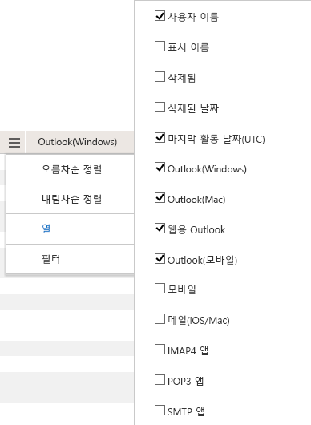

# 관리 센터의 Microsoft 365 보고서-전자 메일 앱 사용 현황

Microsoft 365 **보고서** 대시보드에는 조직의 제품 전체에 대 한 활동 개요가 표시 됩니다. 보고서 대시보드를 통해 개별 제품 수준 보고서의 하위 수준을 표시하여 각 제품 내의 활동에 대한 더 세부화된 정보를 확인할 수 있습니다. [보고서 개요 항목](activity-reports.md)을 확인하세요. 전자 메일 앱 사용 보고서에서 Exchange Online에 연결 된 전자 메일 앱 수를 확인할 수 있습니다. 사용자가 사용하는 Outlook 앱의 버전 정보도 표시되며 이 정보를 확인하여 지원되지 않는 버전을 사용하는 사용자가 지원되는 버전의 Outlook을 설치할 수 있도록 조치할 수 있습니다.
  
> [!NOTE]
> 보고서를 보려면 Microsoft 365 또는 Exchange, SharePoint, 팀 서비스, 팀 통신 또는 비즈니스용 Skype 관리자의 전역 관리자, 전역 독자 또는 보고서 독자 여야 합니다.  
 
## 전자 메일 앱 보고서에 액세스 하는 방법

1. 관리 센터에서 **보고서** \> <a href="https://go.microsoft.com/fwlink/p/?linkid=2074756" target="_blank">사용 현황</a> 페이지를 참조하세요.

    
2. **보고서 선택** 드롭다운에서 **Exchange** \> **전자 메일 앱 사용**을 선택 합니다.
  
## 전자 메일 앱 보고서 해석

**사용자** 및 **클라이언트** 차트를 확인 하 여 전자 메일 앱 활동을 볼 수 있습니다. 
  

  
|항목|설명|
|:-----|:-----|
|1.    |**전자 메일 앱 사용 현황** 보고서는 지난 7 일, 30 일, 90 일 또는 180 일 동안의 추세를 볼 수 있습니다. 그러나 보고서에서 특정 날짜를 선택 하는 경우 테이블 (7)은 현재 날짜 로부터 최대 28 일 동안의 데이터를 표시 합니다 (보고서가 생성 된 날짜 아님).    |
|2.    |각 보고서의 데이터는 대개 최근 24 ~ 48 시간까지 포함 됩니다.    |
|3.    |**사용자** 보기에는 전자 메일 앱을 사용하여 Exchange Online에 연결한 고유 사용자 수가 표시됩니다.    |
|4.    |**앱** 보기에는 선택한 기간 동안 앱별 고유 사용자 수가 표시됩니다.    |
|5.    |**버전** 보기에는 Windows의 각 Outlook 버전에 대 한 고유 사용자 수가 표시 됩니다.    |
|6.    | **사용자** 차트에서 Y축은 보고 기간 중 임의의 날짜에 앱에 연결한 총 고유 사용자 수입니다.     **사용자** 차트에서 Y축은 보고 기간 동안 앱을 사용한 고유 사용자 수입니다.     **앱** 차트에서 Y축은 보고 기간 동안 특정 앱을 사용한 총 고유 사용자 수입니다.     **앱** 차트에서 X축은 조직의 앱 목록입니다.     **버전** 차트에서 Y축은 Outlook 데스크톱의 특정 버전을 사용하는 총 고유 사용자 수입니다. 보고서에서 Outlook 버전 번호를 확인할 수 없는 경우 수량이 **결정**되지 않은 것으로 표시 됩니다.     **버전** 차트에서 X축은 조직의 앱 목록입니다.    |
|7.    |범례에서 항목을 선택 하 여 차트에 표시 되는 계열을 필터링 할 수 있습니다. 예를 들어 **사용자** 차트에서 전자 메일 클라이언트의 **Mac 메일** 또는 **Outlook**  각 항목에 관련 된 정보만 표시 합니다. 이 선택 항목을 변경해도 눈금 표에 있는 정보가 변경되지는 않습니다. Mac 메일, Mac 용 Outlook, Outlook 모바일, Outlook desktop 및 웹용 Outlook은 조직에 있을 수 있는 전자 메일 앱의 예입니다.    |
|8.    | 항목을 추가할 때까지 아래 목록의 열에 일부 항목이 표시되지 않을 수 있습니다.  **Username** 은 전자 메일 응용 프로그램 소유자의 이름입니다.    **마지막 활동 날짜** 는 사용자가 전자 메일 메시지를 읽거나 보낸 최근 날짜입니다.    **Mac Mail**, **Mac Outlook** 및 **Outlook**, **Outlook 모바일** 및 **웹용 Outlook**은 조직에서 보유하고 있을 수 있는 전자 메일 앱의 예입니다.     조직의 정책으로 인해 사용자 정보를 식별할 수 있는 보고서를 볼 수 없는 경우 이러한 모든 보고서의 개인 정보 설정을 변경할 수 있습니다. [Microsoft 365 관리 센터의 활동 보고서](activity-reports.md)에서 **사용자 수준의 세부 정보를 숨기는 방법** 섹션을 확인 하세요.    |
|9.    |**열 관리** 를 선택 하 여 보고서에서 열을 추가 하거나 제거 합니다.    |
|10.    |**내보내기** 링크를 선택 하 여 Excel .csv 파일에 보고서 데이터를 내보낼 수도 있습니다. 그러면 모든 사용자의 데이터를 내보내고 향후 분석을 위해 간단하게 정렬 및 필터링을 수행할 수 있습니다. 사용자가 2,000명 미만인 경우 보고서 자체의 표에서 정렬 및 필터링할 수 있습니다. 사용자가 2,000명 이상인 경우 필터링 및 정렬하려면 데이터를 내보내야 합니다.    |
|||
   
