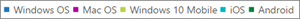

# 관리 센터의 microsoft 365 보고서-Microsoft Office 정품 인증Microsoft 365 Reports in the admin center - Microsoft Office activations

Microsoft 365 **보고서** 대시보드에는 조직의 제품 전체에 대 한 활동 개요가 표시 됩니다.The Microsoft 365 **Reports** dashboard shows you the activity overview across the products in your organization. 보고서 대시보드를 통해 개별 제품 수준 보고서의 하위 수준을 표시하여 각 제품 내의 활동에 대한 더 세부화된 정보를 확인할 수 있습니다.It enables you to drill in to individual product level reports to give you more granular insight about the activities within each product. [보고서 개요 항목](activity-reports.md)을 확인하세요.Check out [the Reports overview topic](activity-reports.md).
  
Office 정품 인증 보고서는 하나 이상의 장치에서 Office 구독을 정품 인증한 사용자의 보기를 제공합니다. 이 보고서는 데스크톱 및 장치에서의 정품 인증 분석 결과뿐만 아니라 Office 365 ProPlus, Project 및 Visio Pro for Office 365 구독 정품 인증의 분석 결과를 제공합니다. 이 보고서는 Office 구독 정품 인증에 대한 추가 도움말 및 지원이 필요할 수 있는 사용자를 식별하는 데 유용할 수 있습니다.The Office Activation report gives you a view of which users have activated their Office subscription on at least one device. It provides a breakdown of the Office 365 Proplus, Project, and Visio Pro for Office 365 subscription activations, as well as the breakdown of activations across desktop and devices. This report could be useful in helping you identify users that might need additional help and support to activate their Office subscription.
  
> [!NOTE]
> 보고서를 보려면 Microsoft 365 또는 Exchange, SharePoint, 팀 서비스, 팀 통신 또는 비즈니스용 Skype 관리자의 전역 관리자, 전역 독자 또는 보고서 독자 여야 합니다.You must be a global administrator, global reader or reports reader in Microsoft 365 or an Exchange, SharePoint, Teams Service, Teams Communications, or Skype for Business administrator to see reports.  
  
## Office 정품 인증 보고서에 액세스하는 방법How to get to the Office activations report

1. 관리 센터에서 **보고서** \> <a href="https://go.microsoft.com/fwlink/p/?linkid=2074756" target="_blank">사용 현황</a> 페이지를 참조하세요.In the admin center, go to the **Reports** \> <a href="https://go.microsoft.com/fwlink/p/?linkid=2074756" target="_blank">Usage</a> page.

    
2. **보고서 선택** 드롭다운에서 **Office 365** \> **정품 인증**을 선택 합니다.From the **Select a report** drop-down, select **Office 365** \> **Activations**. 
  
## Office 정품 인증 보고서 해석Interpret the Office activations report

**정품 인증** 및 **사용자** 차트를 확인하여 조직의 Office 정품 인증을 파악할 수 있습니다.You can get a view into your organization's Office activations by looking at the **Activations** and **Users** charts. 
  

  
|||
|:-----|:-----|
|1 1    |Office 정품 인증 보고서에는 Office 라이선스 정품 인증 데이터의 현재 상태가 보고서 날짜를 기준으로 차트의 오른쪽 위에 표시됩니다.The Office Activations report presents the current state of the office license activations data [as of the date of the report presented on the top right of the chart].    |
|2 2    |각 보고서의 데이터는 대개 최근 24 ~ 48 시간까지 포함 됩니다.The data in each report usually covers up to the last 24 to 48 hours.    |
|3 3    |**정품 인증** 차트에는 데스크톱 및 장치의 Office 정품 인증 수가 표시됩니다.The **Activations** chart shows you the count of Office activations on desktops and devices.    |
|4 4    |**사용자** 차트에는 데스크톱 또는 장치에서 Office 구독을 사용하도록 설정하고 정품 인증을 수행한 사용자의 수가 표시됩니다.The **Users** chart shows you the count of users that are enabled, and users that have activated the Office subscription on desktop or devices..    |
|5 5    | **정품 인증** 차트의 Y축은 Office 정품 인증 수입니다.On the **Activations** chart, the Y axis is the count of Office activations.     **사용자** 차트의 Y축은 사용자의 Office 정품 인증 활동 수행입니다.On the **Users** chart, the Y axis is the user's performing activity of activating Office.     두 차트의 X축은 모두 이 특정 보고서에 대해 선택된 날짜 범위입니다.The X axis on both charts is the selected date range for this specific report.    |
|6 6    |범례에서 항목을 선택 하 여 표시 되는 차트를 필터링 할 수 있습니다.You can filter charts you see by selecting an item in the legend. 예를 들어 **정품 인증** 차트에서 **windows OS**, **Mac OS**, **windows 10 mobile**, **iOS** 또는 **Android** 를 선택 하 여 각 항목에 관련 된 정보만 표시 합니다.For example, on the **Activations** chart, select **Windows OS**, **Mac OS**, **Windows 10 mobile**, **iOS** or **Android** to see only the info related to each one. 이 선택 항목을 변경해도 눈금 표에 있는 정보가 변경되지는 않습니다.Changing this selection doesn't change the info in the grid table.       |
|7 7    | 이 표는 사용자 수준의 Office 정품 인증 분석 결과를 보여 줍니다. 이 표는 Office 제품이 할당된 모든 사용자의 목록입니다. 표에 열을 더 추가할 수 있습니다.  The table shows you a breakdown of Office activations at the user level. This is the list of all user's with the Office product assigned to them. You can add the additional columns to the table.      **사용자 이름**은 사용자의 전자 메일 주소입니다.**Username** is the email address of the user.    **표시 이름은** 사용자의 전체 이름입니다.**Display name** is the full name if the user.    **제품 라이선스** 는이 사용자에 게 할당 된 제품입니다.**Product licenses** is the products that are assigned to this user.    **마지막으로 활성화된 날짜**는 사용자가 데스크톱 또는 장치에서 Office를 정품 인증한 날짜를 의미합니다.**Last activated date** refers to the date the user activated Office on a desktop or a device.    **사용 된 공유** 컴퓨터 활성화는 사용자가 공유 컴퓨터를 통해 Office를 사용한 경우 true입니다.**Used Shared Computer Activation** is true if the user used Office through shared computer activation.   **Windows** 는 사용자가 Office를 정품 인증 한 windows 데스크톱 수를 나타냅니다.**Windows** refers to the number of Windows desktops a user activated Office on.    **Mac** 은 사용자가 Office를 정품 인증 한 mac 데스크톱 수를 나타냅니다.**Mac** refers to the number of Mac desktops a user activated Office on.    **Windows 10 mobile** 은 사용자가 Office를 정품 인증 한 windows 10 모바일 장치 수를 나타냅니다.**Windows 10 mobile** refers to the number of Windows 10 mobile devices a user activated Office on.    **iOS** 는 사용자가 Office를 정품 인증 한 ios 장치 수를 나타냅니다.**iOS** refers to the number of iOS devices a user activated Office on.    **Android** 는 사용자가 Office를 정품 인증 한 android 장치의 수를 나타냅니다.**Android** refers to the number of Android devices a user activated Office on.     조직의 정책으로 인해 사용자 정보를 식별할 수 있는 보고서를 볼 수 없는 경우 이러한 모든 보고서의 개인 정보 설정을 변경할 수 있습니다.If your organization's policies prevents you from viewing reports where user information is identifiable, you can change the privacy setting for all these reports. [Microsoft 365 관리 센터에서 활동 보고서](activity-reports.md)의 **보고서 섹션에서 사용자 세부 정보 숨기기** 항목을 확인 합니다.Check out the **Hide user details in the reports** section in the [Activity Reports in the Microsoft 365 admin center](activity-reports.md).    |
|||
   

