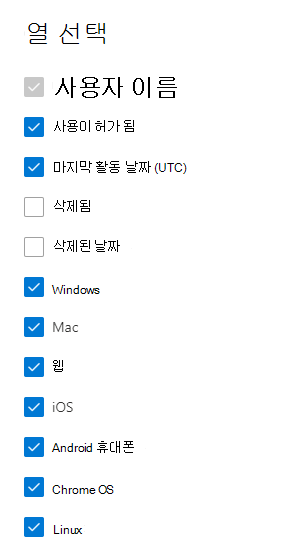

# Microsoft 365 관리 센터의 보고서 - Microsoft Teams 사용 현황

Microsoft 365 보고서 대시보드에는 조직의 제품 전체에 대한 활동 개요가 표시됩니다. 보고서 대시보드를 통해 개별 제품 수준 보고서의 하위 수준을 표시하여 각 제품 내의 활동에 대한 더 세부화된 정보를 확인할 수 있습니다. [보고서 개요 항목](activity-reports.md)을 확인하세요. Microsoft Teams 앱 사용 보고서에서는 조직에서 사용되는 Microsoft Teams 앱에 대한 정보를 확인할 수 있습니다.
  
## Microsoft Teams 앱 사용 보고서에 액세스하는 방법

1. 관리 센터에서 **보고서** \> <a href="https://go.microsoft.com/fwlink/p/?linkid=2074756" target="_blank">사용 현황</a> 페이지를 참조하세요. 
2. 대시보드 홈페이지의 대시보드 활동 카드에서 더 보기 단추를 Microsoft Teams 클릭합니다. 
  
## Microsoft Teams 앱 사용 보고서 해석

장치 사용 탭을 선택하여 Teams 보고서에서 장치 사용을 볼 **수** 있습니다. 

열 **선택을 선택하여** 보고서에서 열을 추가하거나 제거합니다.    

내보내기 링크를 선택하여 보고서 데이터를 Excel .csv 내보낼 **수** 있습니다. 그러면 모든 사용자의 데이터를 내보내고 향후 분석을 위해 간단하게 정렬 및 필터링을 수행할 수 있습니다. 사용자가 2,000명 미만인 경우 보고서 자체의 표에서 정렬 및 필터링할 수 있습니다. 사용자가 2,000명 이상인 경우 필터링 및 정렬하려면 데이터를 내보내야 합니다. 

**Microsoft Teams 장치 사용** 보고서에서 지난 7일, 30일, 90일 또는 180일간의 추세를 볼 수 있습니다. 그러나 보고서에서 특정 날짜를 선택하면 보고서가 생성된 날짜가 아니라 현재 날짜로부터 최대 28일간의 데이터가 표에 표시됩니다.
  
|항목|설명|
|:-----|:-----|
|**메트릭**|**정의**|
|사용자 이름    |사용자의 표시 이름입니다.    |
|Windows    |사용자가 Teams 기반 컴퓨터의 Teams 클라이언트에서 활성 상태인 경우 Windows 선택됩니다.    |
|Mac    |사용자가 macOS 컴퓨터의 Teams 클라이언트에서 활성 상태인 경우 선택됩니다.    |
|iOS    |사용자가 iOS용 모바일 Teams 활성 상태인 경우 선택됩니다.    |
|Android 휴대폰    | Android용 모바일 클라이언트에서 Teams 활성화된 경우 선택됩니다.    |
|Chrome OS    |사용자가 ChromeOS 컴퓨터의 Teams 클라이언트에서 활성 상태인 경우 선택됩니다.|
|Linux    | 사용자가 Linux 컴퓨터의 Teams 클라이언트에서 활성 상태인 경우 선택됩니다.    |
|Web    |사용자가 디바이스의 웹 클라이언트에서 Teams 활성화된 경우 선택됩니다.|
|마지막 활동 날짜(UTC)    |사용자가 Teams(UTC)입니다.    |
|사용이 허가됩니다.|사용자에게 사용이 허가된 경우 선택된 Teams.|
|||