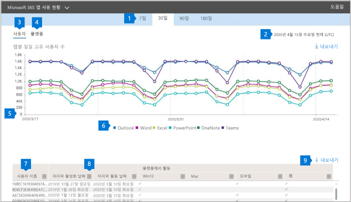

# 관리 센터의 Microsoft 365 보고서 - Microsoft 365 앱 사용 현황Microsoft 365 Reports in the admin center - Microsoft 365 Apps usage

Microsoft 365 **보고서** 대시보드에는 조직의 제품 전체에 대한 활동 개요가 표시됩니다.The Microsoft 365 **Reports** dashboard shows you the activity overview across the products in your organization. 보고서 대시보드를 통해 개별 제품 수준 보고서의 하위 수준을 표시하여 각 제품 내의 활동에 대한 더 세부화된 정보를 확인할 수 있습니다.It enables you to drill in to individual product level reports to give you more granular insight about the activities within each product. [보고서 개요 항목](activity-reports.md)을 확인하세요.Check out [the Reports overview topic](activity-reports.md).

 예를 들어 앱 전체의 활동과 플랫폼에서 앱 사용 방법을 보고 Microsoft 365 앱 앱을 사용하기 위해 라이선스가 부여된 각 사용자의 활동을 이해할 수 있습니다.For example, you can understand the activity of each user licensed to use Microsoft 365 Apps apps by looking at their activity across the apps and how they are utilized across platforms.

 > [!NOTE]
 > 보고서를 표시하려면 Microsoft 365의 전역 관리자, 전역 읽기 권한자 또는 보고서 읽기 권한자 또는 Exchange, SharePoint 또는 비즈니스용 Skype 관리자 되어야 합니다.You must be a global administrator, global reader or reports reader in Microsoft 365 or an Exchange, SharePoint, or Skype for Business administrator to see reports.

## Microsoft 365 앱 사용 현황 보고서에 액세스하는 방법How to get to the Microsoft 365 Apps usage report

1. 관리 센터에서 **보고서** \> <a href="https://go.microsoft.com/fwlink/p/?linkid=2074756" target="_blank">사용 현황</a> 페이지를 참조하세요.In the admin center, go to the **Reports** \> <a href="https://go.microsoft.com/fwlink/p/?linkid=2074756" target="_blank">Usage</a> page.

 2. 보고서 **선택 드롭다운에서** Office **365 Microsoft 365** 앱 사용   \>  **현황을 선택합니다.**From the **Select a report** drop-down, select **Office 365** \> **Microsoft 365 Apps usage** .

## Microsoft 365 앱 사용 현황 보고서 해석Interpret the Microsoft 365 Apps usage report

사용자 및 플랫폼 차트를 확인하여 사용자의 Microsoft 365  앱 활동을 볼 **수** 있습니다.You can get a view into your user's Microsoft 365 Apps activity by looking at the **Users** and **Platform** charts.

|항목Item|설명Description|
 |:-----|:-----|
 |1.1.   |**Microsoft 365** 앱 사용 현황 보고서에서 지난 7일, 30일, 90일 또는 180일간의 추세를 볼 수 있습니다.The **Microsoft 365 Apps usage** report can be viewed for trends over the last 7 days, 30 days, 90 days, or 180 days. 그러나 보고서에서 특정 날짜를 선택하면 표(7)에 현재 날짜로부터 최대 28일간의 데이터가 표시됩니다(보고서가 생성된 날짜가 아미지 않습니다).However, if you select a particular day in the report, the table (7) will show data for up to 28 days from the current date (not the date the report was generated).   |
 |2.2.   |각 보고서의 데이터는 일반적으로 최근 7일까지 처리됩니다.The data in each report usually covers up to the last seven days.   |
 |3.3.   |사용자 **보기에는** 각 앱의 활성 사용자 수(Outlook, Word, Excel, PowerPoint, OneNote 및 Teams)의 추세가 표시됩니다.The **Users** view shows the trend in the number of active users for each app – Outlook, Word, Excel, PowerPoint, OneNote, and Teams. "활성 사용자"는 이러한 앱 내에서 의도적인 작업을 수행하는 사용자입니다."Active users" are any who perform any intentional actions within these apps.   |
 |4.4.   |플랫폼 **보기는** 각 플랫폼(Windows, Mac, 웹 및 모바일)에 대한 모든 앱에 대한 활성 사용자의 추세를 보여줍니다.The **Platforms** view shows the trend of active users across all apps for each platform – Windows, Mac, Web, and Mobile.   |
 |5.5. |사용자 **차트에서** Y축은 각 앱의 고유 활성 사용자 수입니다.On the **Users** chart, the Y-axis is the number of unique active users for the respective app. 플랫폼 **차트에서** Y축은 각 플랫폼의 고유 사용자   수입니다.On the **Platforms** chart, the Y-axis is the number of unique users for the respective platform. 두 차트의 X축은 앱이 주어진 플랫폼에서 사용된 날짜입니다.The X-axis on both charts is the date on which an app was used on a given platform. |
 6.6. |범례에서 항목을 선택하여 차트에 표시하는 계열을 필터링할 수 있습니다.You can filter the series you see on the chart by selecting an item in the legend. 예를 들어 사용자  차트에서 Outlook, Word, Excel, PowerPoint, OneDrive 또는 Teams를 선택하여 각각에 관련된 정보만 볼 수 있습니다.For example, on the **Users** chart, select Outlook, Word, Excel, PowerPoint, OneDrive, or Teams to see only the info related to each one. 이 선택을 변경해도 아래 표의 정보는 변경되지 않습니다.Changing this selection doesn't change the info in the grid table below it.|
 |7.7. |이 표에서는 사용자 수준별 데이터 분석 결과를 보여 줍니다.The table shows you a breakdown of data at the per-user level. 표에서 열을 추가하거나 제거할 수 있습니다.You can add or remove columns from the table.   **사용자** 이름은 Microsoft Apps에서 활동을 수행한 사용자의 전자 메일 주소입니다.**Username** is the email address of the user who performed the activity on Microsoft Apps.  **마지막 활성화 날짜(UTC)는** 사용자가 Microsoft 365 앱 구독을 정품 인증한 마지막 날짜입니다.**Last activation date (UTC)** is the latest date on which the user activated their Microsoft 365 Apps subscription.  **마지막 활동 날짜(UTC)는** 사용자가 의도한 활동을 마지막으로 수행한 날짜입니다.**Last activity date (UTC)** is the latest date an intentional activity was performed by the user. 특정 날짜에 발생한 활동을 보려면 차트에서 직접 날짜를 선택합니다.To see activity that occurred on a specific date, select the date directly in the chart.  다음 열은 선택한 기간에 사용자가 해당 앱에서 활성화되어 있는 경우를 식별하는 각 앱에 해당합니다.The following columns correspond to each app that identifies if the user was active on that app in the period selected:   **Outlook****Outlook**  **Word****Word**  **Excel****Excel** **PowerPoint****PowerPoint**  **OneNote****OneNote**   다음 열은 사용자가 선택한 기간에 모든 앱(Microsoft 365 앱 내에서)에 대해 해당 플랫폼에서 활성 상태인지 식별하는 각 플랫폼에 해당합니다.The following columns correspond to each platform that identifies if the user was active on that platform for any app (within Microsoft 365 Apps) in the period selected:  **Outlook(Windows)****Outlook (Windows)** **Outlook(Mac)****Outlook (Mac)** **Outlook(웹)****Outlook (Web)**  **Outlook(모바일)****Outlook (Mobile)**  **Word(Windows)****Word (Windows)**  **Word(Mac)****Word (Mac)**  **Word(웹)****Word (Web)**  **Word(모바일)****Word (Mobile)**  **Excel(Windows)****Excel (Windows)**  **Excel(Mac)****Excel (Mac)**  **Excel(웹)****Excel (Web)**  **Excel(모바일)****Excel (Mobile)**  **PowerPoint(Windows)****PowerPoint (Windows)**  **PowerPoint(Mac)****PowerPoint (Mac)** **PowerPoint(웹)****PowerPoint (Web)**  **PowerPoint(모바일)****PowerPoint (Mobile)**  **OneNote(Windows)****OneNote (Windows)**  **OneNote(Mac)****OneNote (Mac)**  **OneNote(웹)****OneNote (Web)** **OneNote(모바일)****OneNote (Mobile)**  **Teams(Windows)****Teams (Windows)**  **Teams(Mac)****Teams (Mac)**  **Teams(웹)****Teams (Web)** **Teams(모바일)****Teams (Mobile)** |
 |8.8. |열 관리 **아이콘을** 선택하여 보고서에서 열을 추가하거나 제거합니다.Select the **Manage columns** icon to add or remove columns from the report.|
 |9.9. |내보내기 링크를 선택하여 보고서 데이터를 Excel .csv 파일로 내보낼 **수** 있습니다.You can also export the report data into an Excel .csv file by selecting the **Export** link. 이렇게 하면 모든 사용자에 대한 데이터를 내보내고 추가 분석을 위해 간단한 집계, 정렬 및 필터링을 할 수 있습니다.This exports data for all users and enables you to do simple aggregation, sorting, and filtering for further analysis. 사용자가 100명 미만인 경우 보고서 자체의 테이블 내에서 정렬 및 필터링할 수 있습니다.If you have less than 100 users, you can sort and filter within the table in the report itself. 사용자가 100명 이상인 경우 필터링 및 정렬하려면 데이터를 내보내야 합니다.If you have more than 100 users, in order to filter and sort, you will need to export the data.|
