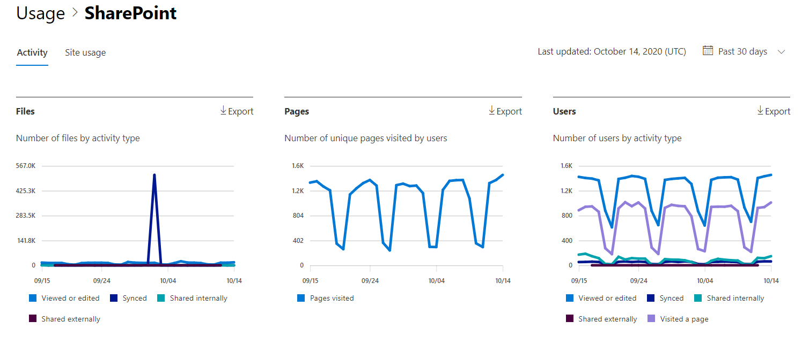
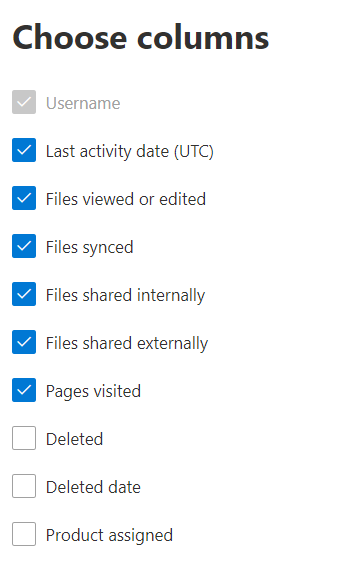

# Microsoft 365 관리 센터의 보고서 - SharePoint 활동Microsoft 365 Reports in the admin center - SharePoint activity

관리자의 Microsoft 365 보고서 대시보드에는  조직의 다양한 제품에 대한 활동 개요가 표시됩니다.As an Microsoft 365 admin, the **Reports** dashboard shows you the activity overview across various products in your organization. 각 제품의 고유한 활동에 대한 자세한 정보를 확인할 수 있습니다.It enables you to drill in to get more granular insight about the activities specific to each product. Microsoft 365 관리 센터에서 활동 [보고서를 확인할 수 있습니다.](activity-reports.md)Check out the [activity reports in the Microsoft 365 admin center](activity-reports.md).
  
예를 들어 파일과의 상호 작용을 확인하여 SharePoint를 사용하도록 라이선스가 부여된 모든 사용자의 활동을 파악할 수 있습니다. 또한 공유된 파일 수를 확인하여 진행 중인 공동 작업의 수준을 파악하는 데도 도움이 됩니다.For example, you can understand the activity of every user licensed to use SharePoint by looking at their interaction with files. It also helps you to understand the level of collaboration going on by looking at the number of files shared.
  
> [!NOTE]
> 보고서를 표시하려면 Microsoft 365, Exchange, SharePoint, Teams 서비스, Teams Communications 또는 비즈니스용 Skype 관리자의 전역 관리자, 전역 읽기 권한자 또는 보고서 읽기 권한자 비즈니스용 Skype 있어야 합니다.You must be a global administrator, global reader or reports reader in Microsoft 365 or an Exchange, SharePoint, Teams Service, Teams Communications, or Skype for Business administrator to see reports. 
 
## SharePoint 활동 보고서에 어떻게 액세스하나요?How do I get to the to the SharePoint activity report?

1. 관리 센터에서 **보고서** \> <a href="https://go.microsoft.com/fwlink/p/?linkid=2074756" target="_blank">사용 현황</a> 페이지를 참조하세요.In the admin center, go to the **Reports** \> <a href="https://go.microsoft.com/fwlink/p/?linkid=2074756" target="_blank">Usage</a> page. 
2. 대시보드 홈페이지의 대시보드 카드에서  더 보기 단추를 SharePoint 클릭합니다.From the dashboard homepage, click on the **View more** button on the SharePoint card.
  
## SharePoint 활동 보고서 해석Interpret the SharePoint activity report

활동 탭을 선택하여 보고서에서 SharePoint **볼 수** 있습니다.You can view the activities in the SharePoint report by choosing the **Activity** tab. 

열 **선택을 선택하여** 보고서에서 열을 추가하거나 제거합니다.Select **Choose columns** to add or remove columns from the report.    

내보내기 링크를 선택하여 보고서 데이터를 Excel .csv 내보낼 **수** 있습니다.You can also export the report data into an Excel .csv file by selecting the **Export** link. 그러면 모든 사용자의 데이터를 내보내고 향후 분석을 위해 간단하게 정렬 및 필터링을 수행할 수 있습니다.This exports data of all users and enables you to do simple sorting and filtering for further analysis. 사용자가 2,000명 미만인 경우 보고서 자체의 표에서 정렬 및 필터링할 수 있습니다.If you have less than 2000 users, you can sort and filter within the table in the report itself. 사용자가 2,000명 이상인 경우 필터링 및 정렬하려면 데이터를 내보내야 합니다.If you have more than 2000 users, in order to filter and sort, you will need to export the data. 
  
|항목Item|설명Description|
|:-----|:-----|
|**메트릭****Metric**|**정의****Definition**|
|사용자 이름Username    |사이트의 활동을 수행한 사용자의 전자 메일 SharePoint.The email address of the user who performed the activity on the SharePoint Site.    |
|마지막 활동 날짜(UTC)Last activity date (UTC)    |선택한 날짜 범위에 대해 파일 활동을 수행하거나 페이지를 방문한 최근 날짜입니다.The latest date a file activity was performed or a page was visited for the selected date range. 특정 날짜에 발생한 활동을 보려면 차트에서 직접 날짜를 선택합니다.To see activity that occurred on a specific date, select the date directly in the chart.    |
|보거나 편집한 파일Files viewed or edited    |사용자가 업로드, 다운로드, 수정 또는 본 파일 수입니다.The number of files that the user uploaded, downloaded, modified, or viewed.     |
|동기화된 파일Files synced    |사용자의 로컬 장치에서 사이트로 동기화된 파일 SharePoint 수입니다.The number of files that have been synced from a user's local device to the SharePoint site.   |
|내부적으로 공유되는 파일Files shared internally    | 조직 내의 사용자 또는 그룹 내의 사용자(외부 사용자를 포함할 수 있는 사용자)와 공유된 파일의 수입니다.The count of files that have been shared with users within the organization, or with users within groups (that might include external users).    |
|외부에서 공유되는 파일Files shared externally    |조직 외부의 사용자와 공유된 파일 수입니다.The number of files that have been shared with users outside of the organization.  |
|방문한 페이지Pages visited    |사용자가 고유한 페이지를 방문한 경우The visits to unique pages by the user.  |
|삭제됨Deleted    | 이는 사용자의 라이선스가 제거되었다는 것입니다.This indicates that the user's license was removed.     **참고:** 선택한 기간 동안 사용이 허가된 경우 삭제된 사용자에 대한 활동은 보고서에 계속 표시됩니다.**NOTE:** Activity for a deleted user will still display in the report as long as he or she was licensed at some time during the selected time period. 삭제된 열을 통해 사용자가 더 이상 활성이 아니지만 보고서의 데이터에 기여함을 알 수 있습니다.The Deleted column helps you to note that the user may no longer be active, but contributed to the data in the report.    |
|삭제된 날짜Deleted date    |사용자의 라이선스가 제거된 날짜입니다.The date on which the user's license was removed.  |
|할당된 제품Product assigned    |사용자에게 Microsoft 365 라이선스가 있는 제품입니다.The Microsoft 365 products that are licensed to the user.|
|||