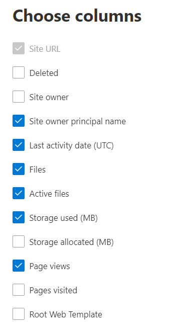

# 관리 센터의 Microsoft 365 보고서-SharePoint 사이트 사용 현황Microsoft 365 Reports in the admin center - SharePoint site usage

Microsoft 365 관리자 인 **보고서** 대시보드에는 조직의 다양 한 제품에 대 한 활동 개요가 표시 됩니다.As a Microsoft 365 admin, the **Reports** dashboard shows you the activity overview across various products in your organization. 각 제품의 고유한 활동에 대한 자세한 정보를 확인할 수 있습니다.It enables you to drill in to get more granular insight about the activities specific to each product. 예를 들어 사용자가 SharePoint 사이트에 저장한 총 파일 수, 현재 적극적으로 사용 중인 파일 수 및 모든 SharePoint 사이트에서 사용된 저장소와 관련하여 SharePoint에서 얻는 값을 대략적으로 볼 수 있습니다.For example, you can get a high level view of the value you are getting from SharePoint in terms of the total number of files that users store in SharePoint sites, how many files are actively being used, and the storage consumed across all these sites. 그런 다음 SharePoint 사이트 사용 보고서를 확인하여 추세와 모든 사이트에 대한 수준별 세부 정보를 파악할 수 있습니다.Then, you can drill into the SharePoint site usage report to understand the trends and per site level details for all sites. 
  
> [!NOTE]
> 보고서를 보려면 Microsoft 365 또는 Exchange, SharePoint, 팀 서비스, 팀 통신 또는 비즈니스용 Skype 관리자의 전역 관리자, 전역 독자 또는 보고서 독자 여야 합니다.You must be a global administrator, global reader or reports reader in Microsoft 365 or an Exchange, SharePoint, Teams Service, Teams Communications, or Skype for Business administrator to see reports.
관리 센터의 Microsoft 365 보고서는 GCC High 및 DoD 테 넌 트에 대해서는 지원 되지 않습니다.Microsoft 365 Reports in the admin center is not supported for GCC High and DoD tenants.
 
## SharePoint 사이트 사용 보고서에 액세스하는 방법How to get to the SharePoint site usage report

1. 관리 센터에서 **보고서** \> <a href="https://go.microsoft.com/fwlink/p/?linkid=2074756" target="_blank">사용 현황</a> 페이지를 참조하세요.In the admin center, go to the **Reports** \> <a href="https://go.microsoft.com/fwlink/p/?linkid=2074756" target="_blank">Usage</a> page. 
2. 대시보드 홈 페이지에서 SharePoint 카드의 **자세히 보기** 단추를 클릭 합니다.From the dashboard homepage, click on the **View more** button on the SharePoint card.
  
## SharePoint 사이트 사용 현황 보고서 해석Interpret the SharePoint site usage report

**사이트 사용** 탭을 선택 하 여 SharePoint 보고서에서 사이트 사용량을 볼 수 있습니다.You can view the site usage in the SharePoint report by choosing the **Site usage** tab. 

**열 선택을** 선택 하 여 보고서에서 열을 추가 하거나 제거 합니다.Select **Choose columns** to add or remove columns from the report.    

**내보내기** 링크를 선택 하 여 보고서 데이터를 Excel .csv 파일로 내보낼 수도 있습니다.You can also export the report data into an Excel .csv file by selecting the **Export** link. 그러면 모든 사용자의 데이터를 내보내고 향후 분석을 위해 간단하게 정렬 및 필터링을 수행할 수 있습니다.This exports data of all users and enables you to do simple sorting and filtering for further analysis. 사용자가 2,000명 미만인 경우 보고서 자체의 표에서 정렬 및 필터링할 수 있습니다.If you have less than 2000 users, you can sort and filter within the table in the report itself. 사용자가 2,000명 이상인 경우 필터링 및 정렬하려면 데이터를 내보내야 합니다.If you have more than 2000 users, in order to filter and sort, you will need to export the data. 
  
|항목Item|설명Description|
|:-----|:-----|
|**메트릭****Metric**|**정의****Definition**|
|사이트 URLSite URL    |사이트의 전체 URL입니다.The full URL of the site.   |
|삭제됨Deleted    |사이트의 삭제 상태입니다.The deletion status of the site. 사이트가 삭제됨으로 표시되려면 7일 이상이 소요됩니다.It takes at least 7 days for sites to be marked as deleted.    |
|사이트 소유자Site owner    |사이트의 주 소유자의 사용자 이름입니다.The username of the primary owner of the site.     |
|사이트 소유자의 사용자 이름Site owner principal name    |사이트 소유자의 전자 메일 주소입니다.The email address of the owner of the site.   |
|마지막 활동 날짜 (UTC)Last activity date (UTC)    | 마지막으로 파일 활동이 검색 되었거나 사이트에서 페이지를 본 날짜입니다.The date of the last time file activity was detected or a page was viewed on the site.    |
|파일Files    |사이트에 있는 파일의 수입니다.The number of files on the site.  |
|활성 파일Active files    | 사이트에 있는 활성 파일의 수입니다.The number of active files on the site.  참고: 보고서에 대해 지정 된 기간 동안 파일이 제거 된 경우 보고서에 표시 되는 활성 파일의 수는 사이트의 현재 파일 수 보다 클 수 있습니다.NOTE: If files were removed during the specified time period for the report, the number of active files shown in the report may be larger than the current number of files on the site.    |
|사용 되는 저장소 (MB)Storage used (MB)    |현재 사이트에서 사용 되 고 있는 저장소 크기입니다.The amount of storage currently being used on the site.   |
|할당 된 저장소 (MB)Storage allocated (MB)    |사이트에 할당 된 저장소의 최대 크기입니다.The maximum amount of storage allocated for the site.   |
|페이지 보기Page views    |사이트에서 페이지를 본 횟수입니다.The number of times pages were viewed on the site.   |
|열어본 페이지Pages visited    |사이트에서 열어본 고유 페이지 수입니다.The number of unique pages that were visited on the site.   |
|루트 웹 서식 파일Root Web Template    |사이트를 만드는 데 사용 되는 서식 파일입니다.The template used for creating the site.    참고: 다른 사이트 유형별로 데이터를 필터링 하려면 데이터를 내보내고 루트 웹 서식 파일 열을 사용 합니다.NOTE: If you want to filter the data by different site types, then export the data and use the Root Web Template column. |
|||