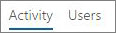

# 관리 센터의 Microsoft 365 보고서 - Yammer 활동 보고서

Microsoft 365 관리자는  보고서 대시보드에 조직 내의 제품 사용 현황에 대한 데이터가 표시됩니다. 관리 [센터에서 활동 보고서를 체크 아웃합니다.](activity-reports.md) **Yammer 활동 보고서** 를 사용하면 메시지를 게시하거나 좋아요를 클릭하거나 읽는 데 Yammer를 사용하는 고유한 사용자 수와 조직 전체에서 생성된 활동의 크기를 확인하여 조직의 Yammer 사용 수준을 이해할 수 있습니다. 
  
> [!NOTE]
> Microsoft 365의 전역 관리자, 전역 읽기 권한자 또는 보고서 읽기 권한자 또는 Exchange, SharePoint, Teams 서비스, Teams Communications 또는 비즈니스용 Skype 관리자인 경우 보고서를 볼 수 있어야 합니다. 
 
## Yammer 활동 보고서에 액세스하는 방법

1. 관리 센터에서 **보고서** \> <a href="https://go.microsoft.com/fwlink/p/?linkid=2074756" target="_blank">사용 현황</a> 페이지를 참조하세요.

    
2. 보고서 **선택 드롭다운에서** 활동 **Yammer** \> **선택합니다.**
  
## Yammer 활동 보고서 해석

활동 및 사용자 차트를 확인하여 사용자의 Yammer 활동을 볼 수 있습니다.
  

  
활동 보고서에는 다음 정보가 포함되어 있습니다.
  
- 일 탭을 사용하여 지난 7일, 30일, 90일 또는 180일간의 **Yammer 활동** 보고서 추세를 봅니다. 그러나 보고서에서 특정 날짜를 선택하면 보고서가 생성된 날짜가 아니라 현재 날짜로부터 최대 28일간의 데이터가 표에 표시됩니다. 
    
- 각 보고서에는 보고서가 생성된 날짜가 포함되어 있습니다. 일반적으로 보고서에는 활동 시간으로부터 24~48시간의 대기 시간이 반영됩니다.
    
- **활동** 차트를 통해 조직에서 수행되는 Yammer 활동이 어느 정도인지 추세를 파악할 수 있습니다. 게시하거나 읽거나 좋아요를 클릭한 메시지를 구분하여 파악할 수 있습니다. 
    
    
  
  - **활동** 차트에서 Y축은 메시지를 게시하거나 읽거나 좋아요를 클릭한 활동의 수입니다. 
    
- **사용자** 차트를 통해 Yammer 활동을 생성 중인 고유한 사용자 수의 추세를 파악할 수 있습니다. 사용자가 게시하거나 읽거나 좋아요를 클릭한 Yammer 메시지의 추세를 볼 수 있습니다. 
    
    
  
  - **사용자** 활동 차트에서 Y축은 사용자가 게시하거나 읽거나 좋아요를 클릭한 Yammer 메시지입니다. 
    
  - 두 차트의 X축은 모두 이 특정 보고서에 대해 선택된 날짜 범위입니다.
    
- 범례에서 항목을 선택하여 차트에 있는 계열을 필터링할 수 있습니다. 예를 들어 활동  차트에서 게시된  **정보,**  읽기 또는 '좋아'를 선택하여 각각에 관련된 정보만 볼 수 있습니다. 
    
    
  
    이 선택 항목을 변경해도 눈금 표에 있는 정보가 변경되지는 않습니다.
    
- 그래프 아래 표에서는 사용자 수준별 Yammer 활동 분석 결과를 보여 줍니다.
    
    메뉴를 사용하여 데이터를 필터링하고 정렬할 수 있습니다.
    
    
  
    열도 추가하고 제거할 수 있습니다. 사용 가능한 열은 다음과 같습니다.
    
  - **사용자 이름** 은 사용자의 전자 메일 주소입니다. 실제 전자 메일 주소를 표시하거나 이 필드를 익명으로 만들 수 있습니다. 
    
    이 표에는 Microsoft 365 계정을 사용하여 Yammer 로그인한 사용자 또는 Single Sign-On을 사용하여 네트워크에 로그인한 사용자가 표시됩니다.
    
  - **표시 이름** 은 사용자의 전체 이름입니다. 실제 전자 메일 주소를 표시하거나 이 필드를 익명으로 만들 수 있습니다. 
    
  - **사용자 상태** 의 값은 다음 세 개 중 하나입니다. 활성화됨, 삭제됨 또는 일시 중지됨입니다. 
    
    이러한 보고서에서는 활성, 일시 중지 및 삭제된 사용자의 데이터를 표시합니다. 보류 중인 사용자는 메시지를 게시하거나 읽거나 좋아요를 클릭할 수 없으므로 보류 중인 사용자는 반영하지 않습니다.
    
  - **상태 변경 날짜(UTC)** 는 Yammer에서 사용자의 상태가 변경된 날짜입니다. 
    
  - **마지막 활동 날짜(UTC)** 는 사용자가 메시지를 게시하거나 읽거나 좋아요를 클릭한 마지막 날짜를 나타냅니다. 
    
  - **게시됨** 은 지정된 기간 동안 사용자가 게시한 메시지 수입니다. 
    
  - **읽음** 은 지정된 기간 동안 사용자가 읽은 대화 수입니다. 
    
  - **좋아함** 은 지정된 기간 동안 사용자가 좋아요를 클릭한 메시지 수입니다. 
    
  - **할당된** 제품은 이 사용자에게 할당된 제품입니다. 
    
    조직의 정책으로 인해 사용자 정보를 식별할 수 있는 보고서를 볼 수 없는 경우 이러한 모든 보고서의 개인 정보 설정을 변경할 수 있습니다. Microsoft 365 관리 센터의 활동 보고서에서 사용자 수준 세부 정보를 숨기는 방법 [섹션을 참조하세요.](activity-reports.md) 
    
- 내보내기 링크를 선택하여 보고서 데이터를 Excel .csv 파일로 내보낼 **수** 있습니다. 그러면 모든 사용자의 데이터를 내보내고 향후 분석을 위해 간단하게 정렬 및 필터링을 수행할 수 있습니다. 사용자가 2,000명 미만인 경우 보고서 자체의 표에서 정렬 및 필터링할 수 있습니다. 사용자가 2,000명 이상인 경우 필터링 및 정렬하려면 데이터를 내보내야 합니다. 
    
## 이 보고서에는 어떤 데이터가 있나요?

- **모든 클라이언트** 이러한 보고서에서는 브라우저나 iOS 또는 Android 앱에서 Yammer 사용 등을 포함하는 모든 클라이언트의 데이터를 집계합니다. 
    
- **외부 네트워크 데이터가 없음** 외부 네트워크 데이터는 이 보고서에 포함되지 않습니다. 
    
- **정품 인증된 네트워크** 이러한 보고서에는 Microsoft 365 구독에 Yammer 네트워크의 데이터가 표시되어 있습니다. 이 차트는 Microsoft 365를 사용하는지 또는 로그인하는 데 Yammer 여부와는 무관하게 Yammer 로그인한 모든 사용자의 사용 현황을 Yammer 집계합니다. 
    

