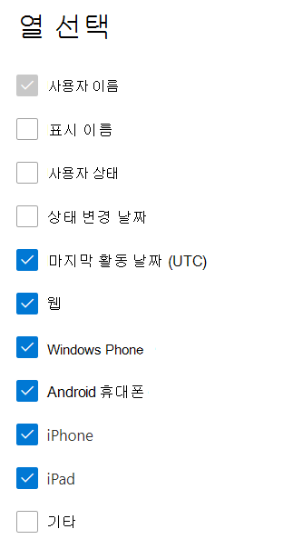

# Microsoft 365 관리 센터의 보고서 - Yammer 사용 현황 보고서

Microsoft 365 **보고서** 대시보드에는 조직의 제품 전체에 대한 활동 개요가 표시됩니다. 보고서 대시보드를 통해 개별 제품 수준 보고서의 하위 수준을 표시하여 각 제품 내의 활동에 대한 더 세부화된 정보를 확인할 수 있습니다. [보고서 개요 항목](activity-reports.md)을 확인하세요.
  
Yammer 장치 사용 현황 보고서는 사용자가 Yammer를 사용하는 장치에 대한 정보를 제공합니다. 장치 유형별로 일일 사용자 수 및 장치 유형별로 사용자 수를 볼 수 있습니다. 선택한 기간에 대해 이 두 정보를 모두 볼 수 있습니다. 사용자당 세부 정보도 볼 수 있습니다.
 
## Yammer 장치 사용 현황 보고서에 액세스하려면 어떻게 하나요?

1. 관리 센터에서 **보고서** \> <a href="https://go.microsoft.com/fwlink/p/?linkid=2074756" target="_blank">사용 현황</a> 페이지를 참조하세요. 
2. 대시보드 홈페이지의 대시보드 카드에서  더 보기 단추를 Yammer 클릭합니다.
  
## 장치 Yammer 보고서 해석

장치 사용 탭을 선택하여 OneDrive **보고서에서** 사용 현황을 볼 수 있습니다. 

열 **선택을 선택하여** 보고서에서 열을 추가하거나 제거합니다.    

내보내기 링크를 선택하여 보고서 데이터를 Excel .csv 내보낼 **수** 있습니다. 그러면 모든 사용자의 데이터를 내보내고 향후 분석을 위해 간단하게 정렬 및 필터링을 수행할 수 있습니다. 사용자가 2,000명 미만인 경우 보고서 자체의 표에서 정렬 및 필터링할 수 있습니다. 사용자가 2,000명 이상인 경우 필터링 및 정렬하려면 데이터를 내보내야 합니다. 

Yammer  장치 사용 현황 보고서에서 지난 7일, 30일, 90일 또는 180일간의 추세를 볼 수 있습니다. 그러나 보고서에서 특정 날짜를 선택하면 보고서가 생성된 날짜가 아니라 현재 날짜로부터 최대 28일간의 데이터가 표에 표시됩니다.
  
|항목|설명|
|:-----|:-----|
|**메트릭**|**정의**|
|사용자 이름    |사용자의 전자 메일 주소입니다. 실제 전자 메일 주소를 표시하거나 이 필드를 익명으로 만들 수 있습니다. 이 표에는 Yammer 계정을 사용하여 로그인한 Microsoft 365 로그인한 사용자 또는 Single Sign-On을 사용하여 네트워크에 로그인한 사용자가 표시됩니다.   |
|표시 이름    |사용자의 전체 이름입니다. 실제 전자 메일 주소를 표시하거나 이 필드를 익명으로 만들 수 있습니다.    |
|사용자 상태    |Active, Deleted 또는 Suspended 값 중 하나 이러한 보고서에서는 활성, 일시 중지 및 삭제된 사용자의 데이터를 표시합니다. 보류 중인 사용자는 메시지를 게시하거나 읽거나 좋아요를 클릭할 수 없으므로 보류 중인 사용자는 반영하지 않습니다.     |
|상태 변경 날짜(UTC)    |이 날짜에서 사용자의 상태가 변경된 Yammer.    |
|마지막 활동 날짜(UTC)    |사용자가 Yammer 활동에 참가한 마지막 날짜(UTC)    |
|웹    |사용자가 웹에서 사용자 Yammer 나타냅니다.    |
|Windows 휴대폰    | 사용자가 휴대폰에서 Yammer 사용한 Windows 나타냅니다.    |
|Android 휴대폰    |사용자가 Android 휴대폰에서 Yammer 사용하는지 나타냅니다.  |
|iphone   | 사용자가 해당 응용 Yammer 사용 iPhone.    |
|ipad    |사용자가 사용자 계정에서 Yammer 경우를 iPad.  |
|기타    |사용자가 이전에 나열되지 않은 다른 Yammer 장치를 사용한 경우를 나타냅니다.  |
|||