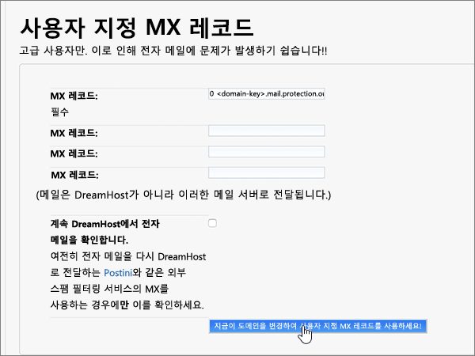

# Dreamhost에서 Microsoft에 대 한 DNS 레코드 만들기Create DNS records at Dreamhost for Microsoft

 원하는 정보를 찾지 못한 경우 **[도메인 FAQ를 확인](../setup/domains-faq.md)** 하세요.**[Check the Domains FAQ](../setup/domains-faq.md)** if you don't find what you're looking for. 
  
DreamHost이 DNS 호스팅 공급자 인 경우이 문서의 단계에 따라 도메인을 확인 하 고 전자 메일, Lync 등에 대 한 DNS 레코드를 설정 합니다.If DreamHost is your DNS hosting provider, follow the steps in this article to verify your domain and set up DNS records for email, Lync, and so on.
 
DreamHost에서 이러한 레코드를 추가 하 고 나면 도메인이 Microsoft 서비스에서 작동 하도록 설정 됩니다.After you add these records at DreamHost, your domain will be set up to work with Microsoft services.
  
  
> [!NOTE]
> 일반적으로 DNS 변경 내용을 적용하는 데 15분 정도 걸립니다. 그러나 변경한 내용이 인터넷의 DNS 시스템 전체에 업데이트되는 데에는 시간이 오래 걸릴 수 있습니다. DNS 레코드를 추가한 후 메일 흐름이나 기타 문제가 있는 경우 [도메인 이름 또는 DNS 레코드 변경 후 발생한 문제 해결](../get-help-with-domains/find-and-fix-issues.md)을 참조하세요.Typically it takes about 15 minutes for DNS changes to take effect. However, it can occasionally take longer for a change you've made to update across the Internet's DNS system. If you're having trouble with mail flow or other issues after adding DNS records, see [Troubleshoot issues after changing your domain name or DNS records](../get-help-with-domains/find-and-fix-issues.md). 
  
## 확인을 위해 TXT 레코드 추가Add a TXT record for verification

Microsoft에서 사용자 도메인을 사용하려면 먼저 도메인을 소유하고 있어야 합니다. 도메인 등록 기관에서 사용자의 계정으로 로그인하고 DNS 레코드를 만들 수 있으면 Microsoft에 도메인을 소유하고 있음을 증명할 수 있습니다.Before you use your domain with Microsoft, we have to make sure that you own it. Your ability to log in to your account at your domain registrar and create the DNS record proves to Microsoft that you own the domain.
  
> [!NOTE]
> 이 레코드는 사용자가 도메인을 소유하고 있는지 확인하는 데만 사용되며 그 밖에 아무런 영향도 주지 않습니다. 원하는 경우 나중에 삭제할 수 있습니다.This record is used only to verify that you own your domain; it doesn't affect anything else. You can delete it later, if you like. 
  
1. 시작 하려면 [이 링크](https://panel.dreamhost.com/)를 사용 하 여 DreamHost의 도메인 페이지로 이동 합니다.To get started, go to your domains page at DreamHost by using [this link](https://panel.dreamhost.com/). 로그인 하 라는 메시지가 표시 됩니다.You'll be prompted to Sign in.
    
    
  
2. **대시보드** 페이지에서 **도메인**을 선택 하 고 도메인을 **관리**합니다.On the **Dashboard** page, select **Domains**, and then **Manage Domains**.
    
    
  
3. 도메인 **관리** 페이지의 **도메인** 섹션에서 편집 하려는 도메인의 **DNS** 를 선택 합니다.On the **Manage Domains** page, in the **Domain** section, select **DNS** for the domain that you want to edit. 
    
    
  
4. In the **Add a custom DNS record** section, in the boxes for the new record, type or copy and paste the values from the following table.In the **Add a custom DNS record** section, in the boxes for the new record, type or copy and paste the values from the following table. 
    
    (You may have to scroll down.)(You may have to scroll down.)
    
    (드롭다운 목록에서 **Type(종류)** 값을 선택합니다.)(Choose the **Type** value from the drop-down list.) 
    
    |**이름****Name**|**Type(종류)****Type**|**값****Value**|**설명****Comment**|
    |:-----|:-----|:-----|:-----|
    |(Leave this field empty.)(Leave this field empty.)    |TXTTXT    |MS=ms *XXXXXXXX*MS=ms *XXXXXXXX*    **참고:** 이 값은 예시입니다.**Note:** This is an example. 여기에는 표에 있는 특정 **대상 또는 주소 가리키기** 값을 사용합니다.Use your specific **Destination or Points to Address** value here, from the table.           [이 값을 찾는 방법How do I find this?](../get-help-with-domains/information-for-dns-records.md)          |(이 필드는 선택 사항입니다.)(This field is optional.)    |
   
   
  
5. **지금 레코드 추가** 를 선택 합니다.Select **Add Record Now!**
    
    
  
6. 방금 만든 레코드가 인터넷에서 업데이트될 수 있도록 몇 분 정도 기다립니다.Wait a few minutes before you continue, so that the record you just created can update across the Internet.
    
이제 도메인 등록 기관에 레코드가 추가되었습니다. Microsoft로 돌아가서 레코드를 요청합니다.Now that you've added the record at your domain registrar's site, you'll go back to Microsoft and request the record.
  
Microsoft에서 올바른 TXT 레코드를 찾으면 도메인이 확인된 것입니다.When Microsoft finds the correct TXT record, your domain is verified.
  
1. Microsoft 관리 센터에서 **설정** \> <a href="https://go.microsoft.com/fwlink/p/?linkid=834818" target="_blank">도메인</a> 페이지로 이동합니다.In the Microsoft admin center, go to the **Settings** \> <a href="https://go.microsoft.com/fwlink/p/?linkid=834818" target="_blank">Domains</a> page.

    
2. **도메인** 페이지에서 확인 중인 도메인을 선택합니다.On the **Domains** page, select the domain that you are verifying. 
    
    
  
3. **설정** 페이지에서 **설정 시작**을 선택합니다.On the **Setup** page, select **Start setup**.
    
    
  
4. **도메인 확인** 페이지에서 **확인**을 선택합니다.On the **Verify domain** page, select **Verify**.
    
    
  
> [!NOTE]
>  일반적으로 DNS 변경 내용을 적용하는 데 15분 정도 걸립니다. 그러나 변경한 내용이 인터넷의 DNS 시스템 전체에 업데이트되는 데에는 시간이 오래 걸릴 수 있습니다. DNS 레코드를 추가한 후 메일 흐름이나 기타 문제가 있는 경우 [도메인 이름 또는 DNS 레코드 변경 후 발생한 문제 해결](../get-help-with-domains/find-and-fix-issues.md)을 참조하세요.Typically it takes about 15 minutes for DNS changes to take effect. However, it can occasionally take longer for a change you've made to update across the Internet's DNS system. If you're having trouble with mail flow or other issues after adding DNS records, see [Troubleshoot issues after changing your domain name or DNS records](../get-help-with-domains/find-and-fix-issues.md). 
  

  
## 사용자 도메인의 전자 메일이 Microsoft로 전송되도록 MX 레코드 추가하기Add an MX record so email for your domain will come to Microsoft

아래 단계를 따릅니다.Follow the steps below.
  
1. 시작 하려면 [이 링크](https://panel.dreamhost.com/)를 사용 하 여 DreamHost의 도메인 페이지로 이동 합니다.To get started, go to your domains page at DreamHost by using [this link](https://panel.dreamhost.com/). 로그인 하 라는 메시지가 표시 됩니다.You'll be prompted to Sign in.
    
    
  
2. **대시보드** 페이지에서 **메일**, **사용자 지정 MX**를 차례로 선택 합니다.On the **Dashboard** page, select **Mail**, and then **Custom MX**.
    
    
  
3. **메일 배달 관리** 섹션의 **작업** 열에서 편집할 도메인에 대해 **편집** 을 선택 합니다.In the **Manage Mail Delivery** section, in the **Actions** column, select **Edit** for the domain that you want to edit. 
    
    
  
4. **사용자 지정 MX 레코드** 구역의 새 레코드 용 상자에 다음 표의 값을 입력 하거나 복사 하 여 붙여넣습니다.In the **Custom MX Record** section, in the boxes for the new record, type or copy and paste the following values from the following table. 
    
    (아래로 스크롤해야 할 수 있습니다.)(You may have to scroll down.)
    
    기존의 다른 MX 레코드가 있는 경우 해당 레코드를 삭제 하도록 표시 합니다.(If there are any other existing MX records, mark those records to be deleted.)
    
    |**MX 레코드 (필수)****MX Record (required)**|
    |:-----|
    |0  *\<domain-key\>*  .mail.protection.outlook.com.0  *\<domain-key\>*  .mail.protection.outlook.com.    **이 값은 마침표(.)로 끝나야 합니다.****This value MUST end with a period (.)**   0은 MX 우선 순위 값입니다. 이 값을 MX 값 시작 부분에 추가하고 나머지 값과 공백으로 구분합니다.  The 0 is the MX priority value. Add it to the beginning of the MX value, separated from the remainder of the value by a space.    **참고:**  *\<domain-key\>*  Microsoft 계정에서를 다운로드 하세요.**Note:** Get your  *\<domain-key\>*  from your Microsoft account.           [이 값을 찾는 방법How do I find this?](../get-help-with-domains/information-for-dns-records.md)          |
   
    
  
5. **지금 사용자 지정 MX 레코드를 사용 하려면이 도메인 변경을 선택 합니다.**Select **Change this domain to use custom MX records now!**
    
    
  
6. 기존의 다른 MX 레코드가 있는 경우에는 항목을 선택한 다음 키보드에서 **delete** 키를 눌러 각 레코드를 삭제 합니다.If there are any other existing MX records, delete each record by selecting the entry and then pressing the **Delete** key on your keyboard. 
    
    
  
7. 레코드를 모두 삭제 한 경우 **지금 사용자 지정 MX 레코드 업데이트** 를 선택 합니다.If you have deleted any records, select **Update your custom MX records now!**
    
    

  
## Microsoft에 필요한 6 개의 CNAME 레코드를 추가 합니다.Add the six CNAME records that are required for Microsoft

아래 단계를 따릅니다.Follow the steps below.
  
1. 시작 하려면 [이 링크](https://panel.dreamhost.com/)를 사용 하 여 DreamHost의 도메인 페이지로 이동 합니다.To get started, go to your domains page at DreamHost by using [this link](https://panel.dreamhost.com/). 로그인 하 라는 메시지가 표시 됩니다.You'll be prompted to Sign in.
    
    
  
2. **대시보드** 페이지에서 **도메인**을 선택 하 고 도메인을 **관리**합니다.On the **Dashboard** page, select **Domains**, and then **Manage Domains**.
    
    
  
3. 도메인 **관리** 페이지의 **도메인** 섹션에서 편집 하려는 도메인의 **DNS** 를 선택 합니다.On the **Manage Domains** page, in the **Domain** section, select **DNS** for the domain that you want to edit. 
    
    
  
4. **사용자 지정 DNS 레코드 추가** 구역의 새 레코드 용 상자에 다음 표에 있는 첫 번째 행의 값을 입력 하거나 복사 하 여 붙여넣습니다.In the **Add a custom DNS record** section, in the boxes for the new record, type or copy and paste the values from the first row in the following table. 
    
    (아래로 스크롤해야 할 수 있습니다.)(You may have to scroll down.)
    
    (드롭다운 목록에서 **Type(종류)** 값을 선택합니다.)(Choose the **Type** value from the drop-down list.) 
    
    |**이름****Name**|**Type(종류)****Type**|**값****Value**|**설명****Comment**|
    |:-----|:-----|:-----|:-----|
    |autodiscoverautodiscover    |CNAMECNAME    |autodiscover.outlook.com.autodiscover.outlook.com.    **이 값은 마침표(.)로 끝나야 합니다.****This value MUST end with a period (.)**   |(이 필드는 선택 사항입니다.)(This field is optional.)    |
    |sipsip    |CNAMECNAME    |sipdir.online.lync.com.sipdir.online.lync.com.    **이 값은 마침표(.)로 끝나야 합니다.****This value MUST end with a period (.)**   |(이 필드는 선택 사항입니다.)(This field is optional.)    |
    |lyncdiscoverlyncdiscover    |CNAMECNAME    |webdir.online.lync.com.webdir.online.lync.com.    **이 값은 마침표(.)로 끝나야 합니다.****This value MUST end with a period (.)**   |(이 필드는 선택 사항입니다.)(This field is optional.)    |
    |enterpriseregistrationenterpriseregistration    |CNAMECNAME    |enterpriseregistration.windows.net.enterpriseregistration.windows.net.    **이 값은 마침표(.)로 끝나야 합니다.****This value MUST end with a period (.)**   |(이 필드는 선택 사항입니다.)(This field is optional.)    |
    |enterpriseenrollmententerpriseenrollment    |CNAMECNAME    |enterpriseenrollment-s.manage.microsoft.com.enterpriseenrollment-s.manage.microsoft.com.    **이 값은 마침표(.)로 끝나야 합니다.****This value MUST end with a period (.)**   |(이 필드는 선택 사항입니다.)(This field is optional.)    |
   
    
  
5. **지금 레코드 추가** 를 선택 합니다.Select **Add Record Now!**
    
    
  
6. 위의 두 단계와 표에 있는 나머지 다섯 개 행의 값을 사용 하 여 나머지 5 개의 CNAME 레코드를 각각 추가 합니다.Using the preceding two steps and the values from the other five rows in the table, add each of the other five CNAME records.

  
## 전자 메일 스팸 방지에 유용한 SPF용 TXT 레코드 추가Add a TXT record for SPF to help prevent email spam

> [!IMPORTANT]
> 도메인 한 개의 SPF에 둘 이상의 TXT 레코드가 있을 수 없습니다.You cannot have more than one TXT record for SPF for a domain. 도메인에 둘 이상의 SPF 레코드가 있는 경우 전자 메일 오류를 비롯하여 배달 및 스팸 분류 문제가 발생할 수 있습니다.If your domain has more than one SPF record, you'll get email errors, as well as delivery and spam classification issues. 도메인에 이미 SPF 레코드가 있는 경우 Microsoft의 새 SPF 레코드를 만들지 마세요.If you already have an SPF record for your domain, don't create a new one for Microsoft. 대신, 두 값 집합을 모두 포함 하는  *단일*  SPF 레코드가 있도록 현재 레코드에 필수 Microsoft 값을 추가 합니다.Instead, add the required Microsoft values to the current record so that you have a  *single*  SPF record that includes both sets of values.
  
아래 단계를 따릅니다.Follow the steps below.
  
1. 시작 하려면 [이 링크](https://panel.dreamhost.com/)를 사용 하 여 DreamHost의 도메인 페이지로 이동 합니다.To get started, go to your domains page at DreamHost by using [this link](https://panel.dreamhost.com/). 로그인 하 라는 메시지가 표시 됩니다.You'll be prompted to Sign in.
    
    
  
2. **대시보드** 페이지에서 **도메인**을 선택 하 고 도메인을 **관리**합니다.On the **Dashboard** page, select **Domains**, and then **Manage Domains**.
    
    
  
3. 도메인 **관리** 페이지의 **도메인** 섹션에서 편집 하려는 도메인의 **DNS** 를 선택 합니다.On the **Manage Domains** page, in the **Domain** section, select **DNS** for the domain that you want to edit. 
    
    
  
4. **사용자 지정 DNS 레코드 추가** 구역의 새 레코드 용 상자에 다음 표에 있는 첫 번째 행의 값을 입력 하거나 복사 하 여 붙여넣습니다.In the **Add a custom DNS record** section, in the boxes for the new record, type or copy and paste the values from the first row in the following table. 
    
    (아래로 스크롤해야 할 수 있습니다.)(You may have to scroll down.)
    
    (드롭다운 목록에서 **Type(종류)** 값을 선택합니다.)(Choose the **Type** value from the drop-down list.) 
    
    |**이름****Name**|**Type(종류)****Type**|**값****Value**|**설명****Comment**|
    |:-----|:-----|:-----|:-----|
    |(Leave this field empty.)(Leave this field empty.)    |TXTTXT    |v=spf1 include:spf.protection.outlook.com -allv=spf1 include:spf.protection.outlook.com -all    **참고:** 모든 공백이 올바르게 유지되도록 이 항목을 복사하여 붙여 넣는 것이 좋습니다.**Note:** We recommend copying and pasting this entry, so that all of the spacing stays correct.           |(이 필드는 선택 사항입니다.)(This field is optional.)    |
   
   
  
5. **지금 레코드 추가** 를 선택 합니다.Select **Add Record Now!**
    
    
  
6. 위의 두 단계와 표에 있는 두 번째 행의 값을 사용 하 여 다른 SRV 레코드를 추가 합니다.Using the preceding two steps and the values from the second row in the table, add the other SRV record.
    
  
## Microsoft 필요한 2개의 SRV 레코드 추가하기Add the two SRV records that are required for Microsoft

아래 단계를 따릅니다.Follow the steps below.
  
1. 시작 하려면 [이 링크](https://panel.dreamhost.com/)를 사용 하 여 DreamHost의 도메인 페이지로 이동 합니다.To get started, go to your domains page at DreamHost by using [this link](https://panel.dreamhost.com/). 로그인 하 라는 메시지가 표시 됩니다.You'll be prompted to Sign in.
    
    
  
2. **대시보드** 페이지에서 **도메인**을 선택 하 고 도메인을 **관리**합니다.On the **Dashboard** page, select **Domains**, and then **Manage Domains**.
    
    
  
3. 도메인 **관리** 페이지의 **도메인** 섹션에서 편집 하려는 도메인의 **DNS** 를 선택 합니다.On the **Manage Domains** page, in the **Domain** section, select **DNS** for the domain that you want to edit. 
    
    
  
4. **사용자 지정 DNS 레코드 추가** 구역의 새 레코드 용 상자에 다음 표에 있는 첫 번째 행의 값을 입력 하거나 복사 하 여 붙여넣습니다.In the **Add a custom DNS record** section, in the boxes for the new record, type or copy and paste the values from the first row in the following table. 
    
    (아래로 스크롤해야 할 수 있습니다.)(You may have to scroll down.)
    
    (드롭다운 목록에서 **Type(종류)** 값을 선택합니다.)(Choose the **Type** value from the drop-down list.) 
    
    |**이름****Name**|**Type(종류)****Type**|**값****Value**|**설명****Comment**|
    |:-----|:-----|:-----|:-----|
    |_sip._tls_sip._tls    |SRVSRV    |100 1 443100 1 443    sipdir.online.lync.com.sipdir.online.lync.com.    **이 값은 마침표(.)로 끝나야 합니다.****This value MUST end with a period (.)**   |(이 필드는 선택 사항입니다.)(This field is optional.)    |
    |_sipfederationtls._tcp_sipfederationtls._tcp    |SRVSRV    |100 1 5061100 1 5061    sipfed.online.lync.comsipfed.online.lync.com.    **이 값은 마침표(.)로 끝나야 합니다.****This value MUST end with a period (.)**   |(이 필드는 선택 사항입니다.)(This field is optional.)    |
   
    
  
5. **지금 레코드 추가**를 선택 합니다.Select **Add Record Now!**.
    
    
  
6. 위의 두 단계와 표에 있는 두 번째 행의 값을 사용 하 여 다른 SRV 레코드를 추가 합니다.Using the preceding two steps and the values from the second row in the table, add the other SRV record.
    
> [!NOTE]
>  일반적으로 DNS 변경 내용을 적용하는 데 15분 정도 걸립니다. 그러나 변경한 내용이 인터넷의 DNS 시스템 전체에 업데이트되는 데에는 시간이 오래 걸릴 수 있습니다. DNS 레코드를 추가한 후 메일 흐름이나 기타 문제가 있는 경우 [도메인 이름 또는 DNS 레코드 변경 후 발생한 문제 해결](../get-help-with-domains/find-and-fix-issues.md)을 참조하세요.Typically it takes about 15 minutes for DNS changes to take effect. However, it can occasionally take longer for a change you've made to update across the Internet's DNS system. If you're having trouble with mail flow or other issues after adding DNS records, see [Troubleshoot issues after changing your domain name or DNS records](../get-help-with-domains/find-and-fix-issues.md). 

  
