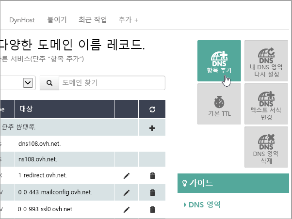

# 커넥트 OVH에서 DNS 레코드를 Microsoft 365

원하는 정보를 찾지 못한 경우 [도메인 FAQ를 확인](../setup/domains-faq.yml)하세요.
  
DNS 호스팅 공급자로 OVH를 사용하고 있는 경우 이 문서의 단계에 따라 도메인을 확인하고 전자 메일, 비즈니스용 Skype Online에 대한 DNS 레코드를 설정하세요.

OVH에서 이러한 레코드를 추가하고 나면 도메인이 OVH에서 작동하게 Microsoft 서비스.

> [!NOTE]
>  일반적으로 DNS 변경 내용을 적용하는 데 15분 정도 걸립니다. 그러나 변경한 내용이 인터넷의 DNS 시스템 전체에 업데이트되는 데에는 시간이 오래 걸릴 수 있습니다. DNS 레코드를 추가한 후 메일 흐름이나 기타 문제가 있는 경우 [도메인 이름 또는 DNS 레코드 변경 후 발생한 문제 해결](../get-help-with-domains/find-and-fix-issues.md)을 참조하세요. 
  
## 확인을 위해 TXT 레코드 추가

Microsoft에서 사용자 도메인을 사용하려면 먼저 도메인을 소유하고 있어야 합니다. 도메인 등록 기관에서 사용자의 계정으로 로그인하고 DNS 레코드를 만들 수 있으면 Microsoft에 도메인을 소유하고 있음을 증명할 수 있습니다.
  
> [!NOTE]
> 이 레코드는 사용자가 도메인을 소유하고 있는지 확인하는 데만 사용되며 그 밖에 아무런 영향도 주지 않습니다. 원하는 경우 나중에 삭제할 수 있습니다. 
  
1. 시작하려면 이 링크를 사용하여 OVH의 도메인 [페이지로 이동합니다.](https://www.ovh.com/manager/) You'll be prompted to log in.

    

1. 대시보드 방문 페이지의 모든 내 활동 보기에서 편집할 도메인의 이름을 선택합니다.
  
1. **DNS 영역 을 선택합니다.**

    
  
1. 항목 **추가를 선택합니다.**

    
  
1. **TXT 선택**

    
  
1. 새 레코드의 상자에서 다음 표의 값을 입력하거나 복사하여 붙여넣습니다. TTL 값을 할당하기 위해 드롭다운 목록에서 **사용자** 지정을 선택한 다음 텍스트 상자에 값을 입력합니다. 

    |**Record type(레코드 종류)**|**하위 도메인**|**TTL**|**값**|
    |:-----|:-----|:-----|:-----|
    |TXT    |(공백으로 둠)    |3600(초)    |MS=msxxxxxxxxxx    **참고:** 이 값은 예시입니다. 여기에는 표에 있는 특정 **대상 또는 주소 가리키기** 값을 사용합니다.  [이 값을 찾는 방법](../get-help-with-domains/information-for-dns-records.md)          |

1. **다음** 을 선택합니다.

1. **확인** 을 선택합니다.

    
  
1. 방금 만든 레코드가 인터넷에서 업데이트될 수 있도록 몇 분 정도 기다립니다.

이제 도메인 등록 기관에 레코드가 추가되었습니다. Microsoft로 돌아가서 레코드를 요청합니다. Microsoft에서 올바른 TXT 레코드를 찾으면 도메인이 확인된 것입니다.

다음을 통해 레코드를 Microsoft 365.
  
1. 관리 센터에서 도메인 **설정** \> <a href="https://go.microsoft.com/fwlink/p/?linkid=834818" target="_blank">**로 이동하세요.**</a>

1. 도메인 페이지에서 확인할 도메인을 선택하고 설정 시작 **을 선택합니다.** 

    :::image type="content" source="../../media/dns-IONOS/IONOS-DomainConnects-2.png" alt-text="설치 시작을 선택합니다.":::

1. **계속** 을 선택합니다.
  
1. **도메인 확인** 페이지에서 **확인** 을 선택합니다.

> [!NOTE]
>  일반적으로 DNS 변경 내용을 적용하는 데 15분 정도 걸립니다. 그러나 변경한 내용이 인터넷의 DNS 시스템 전체에 업데이트되는 데에는 시간이 오래 걸릴 수 있습니다. DNS 레코드를 추가한 후 메일 흐름이나 기타 문제가 있는 경우 [도메인 이름 또는 DNS 레코드 변경 후 발생한 문제 해결](../get-help-with-domains/find-and-fix-issues.md)을 참조하세요. 
  
## 사용자 도메인의 전자 메일이 Microsoft로 전송되도록 MX 레코드 추가하기

1. 시작하려면 이 링크를 사용하여 OVH의 도메인 [페이지로 이동합니다.](https://www.ovh.com/manager/) You'll be prompted to log in.

    
  
1. 대시보드 방문 페이지의 모든 내 활동 보기에서 편집할 도메인의 이름을 선택합니다.
  
1. **DNS 영역 을 선택합니다.**

    
  
1. 항목 **추가를 선택합니다.**

    
  
1. **MX 를 선택합니다.**

    
  
1. 새 레코드의 상자에서 다음 표의 값을 입력하거나 복사하여 붙여넣습니다. TTL 값을 할당하기 위해 드롭다운 목록에서 **사용자** 지정을 선택한 다음 텍스트 상자에 값을 입력합니다. 

    > [!NOTE]
    > 기본적으로 OVH는 대상에 대해 상대 표기 기능을 사용하여 대상 레코드의 끝에 도메인 이름을 추가합니다. 대신 절대 표기 방법을 사용하세요. 아래 표와 같이 대상 레코드에 점이 추가됩니다. 
  
    |**하위 도메인**|**TTL**|**우선 순위**|**대상**|
    |:-----|:-----|:-----|:-----|
    |(공백으로 둠)    |3600(초)    |0    우선 순위에 대한 자세한 내용은 [MX 우선 순위란?](../setup/domains-faq.yml)을 참조하세요.   |\<domain-key\>.mail.protection.outlook.com.    **참고:** Microsoft  *\<domain-key\>*  계정에서 다운로드하세요.  [이 값을 찾는 방법](../get-help-with-domains/information-for-dns-records.md)  |

    
  
1. **다음** 을 선택합니다.

    
  
1. **확인** 을 선택합니다.

    

1. DNS 영역 페이지의 목록에서 다른 MX 레코드를 **삭제합니다.** 각 레코드를 선택하고 작업 **열에서** 휴지통 삭제 **아이콘을** 선택합니다.

    
  
1. **확인** 을 선택합니다.

## Microsoft에 필요한 CNAME 레코드 추가

1. 시작하려면 이 링크를 사용하여 OVH의 도메인 [페이지로 이동합니다.](https://www.ovh.com/manager/) You'll be prompted to log in.

    
  
1. 대시보드 방문 페이지의 모든 내 활동 보기에서 편집할 도메인의 이름을 선택합니다.
  
1. **DNS 영역 을 선택합니다.**

    
  
1. 항목 **추가를 선택합니다.**

    
  
1. **CNAME 을 선택합니다.**

    

1. 새 레코드의 상자에서 다음 표에 있는 첫 번째 행의 값을 입력하거나 복사하여 붙여넣습니다.  TTL 값을 할당하기 위해 드롭다운 목록에서 **사용자** 지정을 선택한 다음 텍스트 상자에 값을 입력합니다. 

    |**하위 도메인**|**TTL**|**대상**|
    |:-----|:-----|:-----|
    |autodiscover    |3600(초)    |autodiscover.outlook.com.    |

    
  
1. **다음** 을 선택합니다.

    
  
1. **확인** 을 선택합니다.

## 전자 메일 스팸 방지에 유용한 SPF용 TXT 레코드 추가

> [!IMPORTANT]
> 도메인 한 개의 SPF에 둘 이상의 TXT 레코드가 있을 수 없습니다. 도메인에 둘 이상의 SPF 레코드가 있는 경우 전자 메일 오류를 비롯하여 배달 및 스팸 분류 문제가 발생할 수 있습니다. 도메인에 이미 SPF 레코드가 있는 경우 Microsoft의 새 SPF 레코드를 만들지 마세요. 대신 두 값 집합을 모두 포함하는  *단일*  SPF 레코드가 있도록 현재 레코드에 필요한 Microsoft 값을 추가합니다. 
  
1. 시작하려면 이 링크를 사용하여 OVH의 도메인 [페이지로 이동합니다.](https://www.ovh.com/manager/) You'll be prompted to log in.

    
  
1. 대시보드 방문 페이지의 모든 내 활동 보기에서 편집할 도메인의 이름을 선택합니다.
  
1. **DNS 영역 을 선택합니다.**

    
  
1. 항목 **추가를 선택합니다.**

    
  
1. **TXT 를 선택합니다.**

1. In the boxes for the new record, type or copy and paste the following values. TTL 값을 할당하기 위해 드롭다운 목록에서 **사용자** 지정을 선택한 다음 텍스트 상자에 값을 입력합니다. 

    |**하위 도메인**|**TTL**|**값**|
    |:-----|:-----|:-----|
    |(공백으로 둠)    |3600(초)    |v=spf1 include:spf.protection.outlook.com -all <br/**참고:** 모든 공란이 올바르게 유지 있도록 이 항목을 복사하여 붙여 넣는 것이 좋습니다.           |

    
  
1. **다음** 을 선택합니다.

    
  
1. **확인** 을 선택합니다.

    
  
## 고급 옵션: 비즈니스용 Skype

조직에서 채팅, 전화 회의 및 화상 통화와 비즈니스용 Skype 같은 온라인 통신 서비스에도 이 옵션을 사용하는 Microsoft Teams. Skype 사용자 간 통신을 위한 SRV 레코드 2개와 사용자를 로그인하고 서비스에 연결하기 위한 CNAME 레코드 2개 등 4개 레코드가 필요합니다.

### 필수 SRV 레코드 2개 추가

1. 시작하려면 이 링크를 사용하여 OVH의 도메인 [페이지로 이동합니다.](https://www.ovh.com/manager/) You'll be prompted to log in.

    
  
1. 대시보드 방문 페이지의 모든 내 활동 보기에서 편집할 도메인의 이름을 선택합니다.
  
1. **DNS 영역 을 선택합니다.**

    
  
1. 항목 **추가를 선택합니다.**

    

1. **SRV 를 선택합니다.**

1. In the boxes for the new record, type or copy and paste the following values. TTL 값을 할당하기 위해 드롭다운 목록에서 **사용자** 지정을 선택한 다음 텍스트 상자에 값을 입력합니다. 

    |**하위 도메인**|**TTL(초)**| **Priority(우선 순위)** | **Weight(가중치)** | **Port(포트)**|**대상**|
    |:-----|:-----|:-----|:-----|:-----|:-----|
    |_sip._tls|3600(s.) |100 |  1  | 443 |sipdir.online.lync.com. **이 값은 기간(.)으로 끝나야 합니다.**>  **참고:** 모든 공백이 올바르게 유지되도록 이 항목을 복사하여 붙여 넣는 것이 좋습니다. | 
    |_sipfederationtls._tcp| 3600(s.)|100 | 1 | 5061 | sipfed.online.lync.com. **이 값은 마침표(.)로 끝나야 합니다.**  **참고:** 모든 공백이 올바르게 유지되도록 이 항목을 복사하여 붙여 넣는 것이 좋습니다.    | 
  
1. 다른 SRV 레코드를 추가하려면 다른 레코드 **추가를** 선택하고 표의 다음 행 값을 사용하여 레코드를 만든 다음 레코드 **만들기를 선택합니다.**

> [!NOTE]
> Typically it takes about 15 minutes for DNS changes to take effect. 그러나 변경한 내용이 인터넷의 DNS 시스템 전체에 업데이트되는 데에는 시간이 오래 걸릴 수 있습니다. DNS 레코드를 추가한 후 메일 흐름 또는 기타 문제가 발생하는 경우 [도메인 또는 DNS 레코드를 추가한 후 문제 찾기 및 해결하기](../get-help-with-domains/find-and-fix-issues.md)를 참조하세요. 

### 두 개의 필수 CNAME 레코드 추가 

1. 시작하려면 이 링크를 사용하여 OVH의 도메인 [페이지로 이동합니다.](https://www.ovh.com/manager/) You'll be prompted to log in.

    
  
1. 대시보드 방문 페이지의 모든 내 활동 보기에서 편집할 도메인의 이름을 선택합니다.
  
1. **DNS 영역 을 선택합니다.**

    
  
1. 항목 **추가를 선택합니다.**

    

1. **CNAME 을 선택합니다.**

    

1. 새 레코드의 상자에서 다음 표에 있는 첫 번째 행의 값을 입력하거나 복사하여 붙여넣습니다.  TTL 값을 할당하기 위해 드롭다운 목록에서 **사용자** 지정을 선택한 다음 텍스트 상자에 값을 입력합니다. 

    |**하위 도메인**| **TTL** | **대상** | 
    |:-----|:-----|:-----|
    |sip    | 3600(s.)    |sipdir.online.lync.com.    **이 값은 마침표(.)로 끝나야 합니다.**   |
    |lyncdiscover    |3600(s.) |webdir.online.lync.com.    **이 값은 마침표(.)로 끝나야 합니다.**    |
  
1. **다음** 을 선택합니다.

    
  
1. **확인** 을 선택합니다.

1. 다른 CNAME 레코드를 추가합니다.

> [!NOTE]
> 일반적으로 DNS 변경 내용을 적용하는 데 15분 정도 걸립니다. 그러나 변경한 내용이 인터넷의 DNS 시스템 전체에 업데이트되는 데에는 시간이 오래 걸릴 수 있습니다. DNS 레코드를 추가한 후 메일 흐름이나 기타 문제가 있는 경우 [도메인 이름 또는 DNS 레코드 변경 후 발생한 문제 해결](../get-help-with-domains/find-and-fix-issues.md)을 참조하세요. 
  
## 고급 옵션: Intune 및 모바일 장치 관리 Microsoft 365

이 서비스는 도메인에 연결하는 모바일 장치를 보호하고 원격으로 관리하는 데 도움이 됩니다. 모바일 장치 관리에는 사용자가 서비스에 장치를 등록할 수 있도록 두 개의 CNAME 레코드가 필요합니다.

### 두 개의 필수 CNAME 레코드 추가

1. 시작하려면 이 링크를 사용하여 OVH의 도메인 [페이지로 이동합니다.](https://www.ovh.com/manager/) You'll be prompted to log in.

    
  
1. 대시보드 방문 페이지의 모든 내 활동 보기에서 편집할 도메인의 이름을 선택합니다.
  
1. **DNS 영역 을 선택합니다.**

    
  
1. 항목 **추가를 선택합니다.**

    
  
1. **CNAME 을 선택합니다.**

    

1. 새 레코드의 상자에서 다음 표에 있는 첫 번째 행의 값을 입력하거나 복사하여 붙여넣습니다.  TTL 값을 할당하기 위해 드롭다운 목록에서 **사용자** 지정을 선택한 다음 텍스트 상자에 값을 입력합니다. 
  
    |**하위 도메인**| **TTL** | **대상** | 
    |:-----|:-----|:-----|
    |enterpriseregistration   | 3600(s.)    |enterpriseregistration.windows.net.    **이 값은 마침표(.)로 끝나야 합니다.**   |
    |enterpriseenrollment     |3600(s.) |enterpriseenrollment-s.manage.microsoft.com.    **이 값은 마침표(.)로 끝나야 합니다.**  |

1. **다음** 을 선택합니다.

    
  
1. **확인** 을 선택합니다.

1. 다른 CNAME 레코드를 추가합니다.

> [!NOTE]
> 일반적으로 DNS 변경 내용을 적용하는 데 15분 정도 걸립니다. 그러나 변경한 내용이 인터넷의 DNS 시스템 전체에 업데이트되는 데에는 시간이 오래 걸릴 수 있습니다. DNS 레코드를 추가한 후 메일 흐름이나 기타 문제가 있는 경우 [도메인 이름 또는 DNS 레코드 변경 후 발생한 문제 해결](../get-help-with-domains/find-and-fix-issues.md)을 참조하세요.