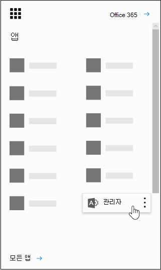

# 조직의 Power BI

이 페이지에서는 조직의 사용자가 Power BI를 사용할 수 있는 방법 및 조직이 이 서비스를 획득하는 방법을 제어할 수 있는 방법을 설명합니다.

## Power BI란?

Microsoft Power BI를 통해 사용자는 새로운 방식으로 데이터를 시각화하고, 검색을 공유하고, 공동 작업을 할 수 있습니다. 자세한 내용은 [Power BI 웹 사이트](https://powerbi.microsoft.com/en-us/)를 참조하세요.
  
## 모든 Power BI 국가, 지역 및 산업별 규정 준수 요구 사항을 충족하나요?

규정 준수에 대한 자세한 Power BI [Microsoft 보안 센터를 참조합니다.](https://go.microsoft.com/fwlink/?LinkId=785324)
  
## 사용자가 Power BI에 등록하는 방법

관리자는 [Power BI 웹 사이트](https://powerbi.microsoft.com/en-us/)를 통해 Power BI에 등록할 수 있습니다. 또한 이 페이지의 구매 서비스 페이지를 통해 등록할 Microsoft 365 관리 센터. 관리자가 Power BI에 등록할 때는 액세스 권한이 필요한 사용자에게 사용자 구독 라이선스를 할당할 수 있습니다.
  
또한 조직의 개별 사용자는 [Power BI 웹 사이트](https://powerbi.microsoft.com/en-us/)를 통해 Power BI에 등록할 수도 있습니다. 조직의 사용자가 Power BI에 등록하면 이 사용자는 Power BI 라이선스를 자동으로 할당받습니다.
  
## 내 조직의 개별 사용자가 등록하는 방법

조직의 사용자에 적용할 수 있는 세 가지 시나리오가 있습니다.
  
### 시나리오 1: 조직에 기존 Microsoft 365 환경이 있으며 사용자가 이미 Power BI 계정이 Microsoft 365 있습니다.

이 시나리오에서 사용자가 테넌트에 회사 또는 학교 계정(예: 예: contoso.com)을 이미 가지고 있지만 Power BI는 아직 가지고 있지 않다면 Microsoft는 해당 계정에 대한 계획을 활성화합니다. 그러면 사용자는 Power BI 서비스를 사용하는 방법에 대한 알림을 자동으로 받게 됩니다.
  
### 시나리오 2: 조직에 기존 Microsoft 365 환경이 있으며 조직에 등록하는 Power BI 계정이 Microsoft 365 없습니다.

이 시나리오에서는 사용자에게 조직의 도메인(예: contoso.com)에 전자 메일 주소가 있지만 아직 Microsoft 365 없습니다. 이 경우 사용자는 Power BI에 등록할 수 있으며 그러면 자동으로 계정을 부여 받습니다. 이렇게 하면 사용자가 Power BI 서비스에 액세스할 수 있습니다. 예를 들어 Nancy라는 직원이 자신의 회사 전자 메일 주소(예: Nancy@contoso.com)를 사용하여 등록하면 Microsoft는 Contoso Microsoft 365 환경에서 사용자로 Nancy를 자동으로 추가하고 해당 계정에 대한 Power BI 활성화합니다.
  
### 시나리오 3: 조직에 전자 메일 도메인에 Microsoft 365 환경이 없습니다.

조직에서 이러한 작업을 활용하기 위해 필요한 관리 작업은 Power BI.
  
> [!IMPORTANT]
> 조직에 전자 메일 도메인이 여러 개 있으며 모든 전자 메일 주소 확장이 동일한 테넌트에 있는 것을 선호하는 경우 사용자가 기본 테넌트를 만들기 전에 모든 전자 메일 주소 도메인을 해당 테넌트에 추가합니다. 사용자를 만든 후 테넌트 전체에서 사용자를 이동하는 자동화된 메커니즘은 없습니다. 이 프로세스에 대한 자세한 내용은 여러 도메인이 있는 경우 사용자가 추가되는 테넌트는 제어할 수 [있나요?](#if-i-have-multiple-domains-can-i-control-the-tenant-that-users-are-added-to) 및 온라인에서 도메인을 추가하는 Office 365 [참조하세요.](../setup/add-domain.md)
  
## 현재 내 조직에 있는 사용자 ID를 관리하는 방식이 어떻게 바뀌나요?

조직에 이미 기존 Microsoft 365 환경이 있으며 조직의 모든 사용자가 Microsoft 365 계정이 있는 경우 ID 관리는 변경되지 않습니다.
  
조직에 이미 기존 Microsoft 365 환경이 있지만 조직의 일부 사용자에게 Microsoft 365 계정이 없는 경우 테넌트에서 사용자를 만들고 사용자의 직장 또는 학교 전자 메일 주소를 기반으로 라이선스를 할당합니다. 다시 말해서 특정 시기에 관리하는 사용자 수는 조직의 사용자가 서비스에 등록하게 되면서 점점 증가합니다.
  
온-프레미스로 디렉터리를 관리하고 ADFS(Active Directory Federation Services)를 사용하는 경우 Microsoft는 사용자를 테넌트에 추가하지 않으며 테넌트에 가입하려는 사용자는 해당 조직의 관리자에게 문의하라는 메시지를 받게 됩니다.
  
조직에 전자 메일 도메인에 Microsoft 365 환경이 없는 경우 ID 관리 방식이 변경되지 않습니다. 사용자는 새 클라우드 전용 사용자 디렉터리에 추가될 뿐 아니라 테넌트 관리자로 인계하고 관리할 수 있는 옵션이 제공됩니다.
  
## 내 사용자용으로 Microsoft에서 만든 테넌트를 관리하는 프로세스는 무엇인가요?

Microsoft에서 테넌트가 만들어진 경우 다음 단계에 따라 해당 테넌트를 소유 및 관리할 수 있습니다.
  
1. 관리하려는 테넌트 도메인과 일치하는 전자 메일 주소 도메인을 사용해 [Power BI에 등록](https://go.microsoft.com/fwlink/?LinkId=522448)하여 테넌트에 가입합니다. 예를 들어 Microsoft가 contoso.com 테넌트를 만든 경우 @contoso.com으로 끝나는 전자 메일 주소를 사용하여 테넌트에 가입해야 합니다.

1. 도메인 소유권을 확인하여 관리자 제어권 보유: 테넌트에 가입한 후에는 도메인 소유권을 확인하여 자신의 수준을 관리자 역할로 승격할 수 있습니다. 이렇게 하려면 다음 단계를 따릅니다.

::: moniker range="o365-worldwide"

3. <a href="https://admin.microsoft.com" target="_blank">https://admin.microsoft.com</a>으로 이동합니다.

::: moniker-end

::: moniker range="o365-germany"

3. 로 가다 <a href="https://portal.office.de" target="_blank">https://portal.office.de</a>

::: moniker-end

::: moniker range="o365-21vianet"

3. <a href="https://portal.partner.microsoftonline.cn" target="_blank">https://portal.partner.microsoftonline.cn</a>(으)로 이동합니다.

::: moniker-end

4. 왼쪽 위에서 앱 시작 관리자 아이콘을 선택하고 **관리자** 를 선택합니다.

    
  
5. 관리자 되기 페이지의 지침을 **읽은** 다음 **예, 관리자가 되겠습니다.를 선택합니다.**

    > [!NOTE]
    >  이 옵션이 나타나지 않는 경우 관리자가 이미 있습니다.
  
## 도메인이 여러 개 있는 경우 사용자가 추가된 테넌트는 제어할 수 있나요?

아무 작업도 수행하지 않으면 각 사용자 전자 메일 도메인 및 하위 도메인에 대해 테넌트가 만들어집니다.
  
모든 사용자가 전자 메일 주소 확장명과 상관없이 동일한 테넌트에 속하도록 하려면 다음을 수행합니다.
  
- 미리 대상 테넌트를 만들거나, 기존 테넌트를 사용하여 이 테넌트 안에 통합하려는 모든 기존 도메인 및 하위 도메인을 추가합니다. 그러면 해당 도메인 및 하위 도메인으로 끝나는 전자 메일 주소를 가진 모든 사용자가 등록하면 자동으로 대상 테넌트에 들어갑니다.

> [!IMPORTANT]
> 테넌트가 만들어진 후에는 사용자가 테넌트 간에 이동할 수 있는 자동화된 메커니즘이 지원되지 않습니다. 단일 테넌트에 도메인을 추가하는 Microsoft 365 자세한 내용은 [Add a domain to Office 365.](../setup/add-domain.md)

> [!IMPORTANT]
> 테넌트 관리에 대한 자세한 내용은 Power BI [참조하세요.](/power-bi/service-admin-administering-power-bi-in-your-organization)
  
## 사용자가 기존 테넌트에 가입하지 못하게 하는 방법

사용자가 기존 테넌트에 가입하지 못하게 하는 관리자로 취할 수 있는 단계가 있습니다. 사용자가 테넌트에 참가하지 못하게 차단하면 사용자의 로그인 시도가 실패하고 조직의 관리자에게 문의할 수 있습니다. 학생, 교직원 및 교직원용 라이선스와 같은 자동 라이선스 배포를 Office 365 Education 이미 사용하지 않도록 설정한 경우 이 프로세스를 반복할 필요가 없습니다.
  
이러한 단계를 수행하려면 Windows PowerShell을 사용해야 합니다. Windows PowerShell을 시작하려면 [PowerShell 시작 가이드](/powershell/scripting/overview)를 참조하세요.
  
다음 단계를 수행하려면 [V2 PowerShell](https://www.powershellgallery.com/packages/AzureADPreview/2.0.2.5)모듈의 최신 64비트 Azure Active Directory 설치해야 합니다.
  
링크를 선택한 후에 **실행** 을 선택하여 설치 프로그램 패키지를 실행합니다.
  
**테넌트 자동 가입 사용 안 함**: 새 사용자가 관리 테넌트에 가입하지 못하도록 하려면 다음 Windows PowerShell 명령을 사용합니다.
  
새 사용자의 테넌트 자동 가입을 사용하지 않으려면:  `Set-MsolCompanySettings -AllowEmailVerifiedUsers $false`
  
새 사용자의 테넌트 자동 가입을 사용하지 않으려면:  `Set-MsolCompanySettings -AllowEmailVerifiedUsers $true`
  
> [!NOTE]
> 이렇게 차단하면 조직의 새 사용자가 Power BI에 등록할 수 없습니다. 조직에 대해 신규 등록을 사용하지 못하도록 설정하기 전에 Power BI를 등록한 사용자는 자신의 라이선스를 계속 보유합니다. 이미 등록한 사용자에 대한 Power BI 제거하려면 어떻게 [하나요?를](#how-do-i-remove-power-bi-for-users-that-already-signed-up) 참조하세요. 이전에 서비스에 등록한 사용자에 대한 Power BI 액세스 권한을 제거하는 방법에 대한 지침을 참조하세요.
  
## 사용자가 기존 테넌트에 가입하도록 허용하는 방법

To allow users to join your tenant, run the opposite command as described in the question above:  `Set-MsolCompanySettings -AllowEmailVerifiedUsers $true`
  
## 테넌트에 차단이 있는지 확인하는 방법은 무엇인가요?

다음 PowerShell 스크립트 사용:  `Get-MsolCompanyInformation | fl allow*`
  
## 내 기존 사용자가 Power BI를 사용하기 시작할 수 없도록 하는 방법

**자동 라이선스 배포 사용 안 함**: 기존 사용자에 대해 자동 라이선스 배포를 사용하지 않으려면 다음 Windows PowerShell 스크립트를 사용합니다. 학생, 교직원 및 교직원용 라이선스와 같은 자동 라이선스 배포를 Office 365 Education 이미 사용하지 않도록 설정한 경우 이 프로세스를 반복할 필요가 없습니다.
  
기존 사용자에 대해 자동 라이선스 배포를 사용하지 않으려면:  `Set-MsolCompanySettings -AllowAdHocSubscriptions $false`
  
기존 사용자에 대해 자동 라이선스 배포를 사용하려면:  `Set-MsolCompanySettings -AllowAdHocSubscriptions $true`
  
> [!NOTE]
> *AllowAdHocSubscriptions* 플래그는 사용자가 Azure 권한 관리 서비스에 등록할 수 있는 기능을 포함하여 조직의 여러 사용자 기능을 제어하는 데 사용됩니다. 이 플래그를 변경하면 모든 기능에 적용됩니다.
  
## 내 기존 사용자가 Power BI에 등록하게 하는 방법은 무엇인가요?

To allow your existing users to sign up for Power BI, run the opposite command as described in the question above:  `Set-MsolCompanySettings -AllowAdHocSubscriptions $true`
  
## 이미 등록한 사용자에 대해 Power BI를 제거하는 방법

사용자가 Power BI 등록했지만 더 이상 Power BI 사용자에 대한 Power BI 라이선스를 제거할 수 있습니다.
  
::: moniker range="o365-worldwide"

1. 관리 센터에서 **사용자** \> <a href="https://go.microsoft.com/fwlink/p/?linkid=834822" target="_blank">활성 사용자</a> 페이지로 이동합니다..

::: moniker-end

::: moniker range="o365-germany"

 1. 관리 센터에서 **사용자** \> <a href="https://go.microsoft.com/fwlink/p/?linkid=847686" target="_blank">활성 사용자</a> 페이지로 이동합니다..

::: moniker-end

::: moniker range="o365-21vianet"

 1. 관리 센터에서 **사용자** \> <a href="https://go.microsoft.com/fwlink/p/?linkid=850628" target="_blank">활성 사용자</a> 페이지로 이동합니다..

::: moniker-end

2. 라이선스를 제거할 사용자를 찾은 다음 해당 이름을 선택합니다.

3. 라이선스 **및 앱 탭에서** **Microsoft** Power BI 선택을 취소합니다.

4. **변경 내용 저장** 을 선택합니다.

## 새 사용자가 내 테넌트에 참여했을 때 이를 알 수 있는 방법은 무엇인가요?

이 프로그램의 일환으로 테넌트에 가입한 사용자에게는 관리자 대시보드의 활성 사용자 창 내에서 필터링할 수 있는 고유한 라이선스가 할당됩니다.
  
이 새 보기를 만들하려면 관리 센터에서 사용자 지정 사용자 보기 만들기 의 [단계를 따릅니다.](../add-users/create-edit-or-delete-a-custom-user-view.md#create-a-custom-user-view) 할당된 **제품 라이선스에서** **Microsoft** Power BI. 새 보기를 만든 후 이 프로그램에 등록한 테넌트의 모든 사용자를 볼 수 있습니다.
  
## 준비해야 할 추가 사항이 있나요?

암호 재설정 요청이 많아질 수 있습니다. 이 프로세스에 대한 자세한 내용은 [사용자 암호 다시 설정](../add-users/reset-passwords.md)을 참조하세요.
  
관리 센터의 표준 프로세스를 통해 테넌트에서 사용자를 제거할 수 있습니다. 하지만 해당 사용자가 여전히 조직의 활성 전자 메일 주소를 가지고 있는 경우 모든 사용자의 가입을 차단하지 않는 한 이 사용자는 다시 가입할 수 있습니다.
  
## 내 테넌트에 Microsoft Power BI 라이선스가 1백만 개 표시된 이유는 무엇입니까?

적격 조직의 사용자는 Microsoft Power BI 서비스를 사용할 자격이 있으며, 이 라이선스는 테넌트에 있는 새 Power BI 사용자에 대해 사용 가능한 기능을 나타냅니다. 이러한 라이선스에는 비용이 부과되지 않습니다. 사용자가 직접 Power BI 등록하도록 선택한 경우 등록 프로세스를 완료하면 이러한 사용 가능한 무료 라이선스 중 하나에 할당됩니다. 관리 센터를 통해 사용자에게 이러한 라이선스를 직접 할당할 수도 있습니다.
  
## 무료인가요? 이러한 라이선스에 대해 요금을 지불해야 하나요?

이는 Power BI의 무료 버전에 대한 라이선스입니다. 추가 기능에 관심이 있는 경우 Power BI Pro 버전을 고려해 보세요.
  
## 라이선스가 1백만 개인 이유는 무엇인가요?

대부분의 조직이 사용자에게 지연 없이 이 혜택을 제공할 수 있는 충분한 라이선스를 사용할 수 있는 수를 선택했습니다.
  
## 라이선스가 1백만 개 이상 필요한 경우는 어떻게 하나요?

추가 라이선스를 구입해야 하는 경우 자세한 정보는 Microsoft 계정 담당자에게 문의하세요.