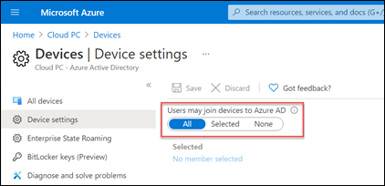
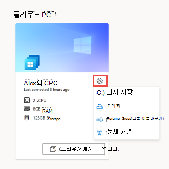
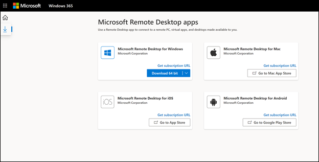

# Windows 365 Business 및 Cloud PC 시작

이 문서는 조직에 대한 Windows 365 Business를 구입하고 설정하는 사용자용입니다.
  
[Windows 365 Business는](https://www.microsoft.com/windows-365/business) 소규모 회사(최대 300명)에서 사용할 수 있는 Windows 365 버전입니다. 이를 통해 조직은 사용자에게 클라우드 PC를 쉽고 간소화된 방식으로 제공합니다.  클라우드 Windows 365 클라우드 PC를 사용하여 Microsoft 클라우드에서 앱, 데이터, 콘텐츠, 설정 및 저장소를 스트리밍할 수 있습니다.

> [!NOTE]  
> 시작하기 전에 사용자의 Azure AD 장치 설정이 **Azure** [AD에](/azure/active-directory/devices/device-management-azure-portal#configure-device-settings) 장치를 가입할 수 있는지 확인합니다. 

   
## 필수 구성 요소
365 Business를 설정하기 위한 라이선스 Windows 없습니다.

최상의 온보드 환경을 제공하려면 설치  문제 해결 가이드를 참조하여 환경 기본 설정이 Windows 365 Business에 최적화되어 있는지 확인하세요. 

## 구독 구입

사용자를 위해 365 Business Windows 구입하는 방법에는 두 가지가 있습니다.

- Windows [365 제품 사이트](https://www.microsoft.com/windows-365/business/compare-plans-pricing)
- Microsoft 365 관리 센터

구독을 구입한 후 구독을 사용하여 Microsoft 365 관리 센터 사용자에게 라이선스를 할당할 수 있습니다.

### Windows 365 제품 사이트를 통해 구독 구입

아직 Microsoft 365 없는 경우 Windows 365 제품 사이트에서 Windows [365](https://www.microsoft.com/windows-365/business/compare-plans-pricing)Business 구독을 Windows 수 있습니다. 다음 단계에 따라 Windows 365 제품 페이지를 통해 Windows 365 Business 구독을 구입합니다.

1. Windows [365 Business](https://www.microsoft.com/windows-365/business) 페이지에서 요금제 및 가격 **보기를 선택합니다.**
2. 다음 페이지에서 구매할 구독을 선택하고 지금 **구입을 선택합니다.**
3. Windows **365 Business를** 선택해 주셔서 감사합니다. 페이지에서 단계에 따라 계정을 설정하세요.
4. **5단계 -** 확인 세부 정보 에서 사용자에게 라이선스를 할당할 준비가 된 경우 시작을 선택하여 의 Windows 365 홈 페이지로  https://windows365.microsoft.com 이동합니다.
5. 365 Windows 페이지의 빠른 **작업** 섹션에서 **조직 관리를 선택합니다.** 그러면 사용자에게 라이선스를 Microsoft 365 관리 센터 수 있는 위치로 진행됩니다.

전역 또는 대금 청구 관리자 역할이 없는 사용자는 셀프 서비스 구매를 사용하여 Windows 365 Business 제품 사이트에서 직접 Windows [365 Business](https://www.microsoft.com/windows-365/business?rtc=1)구독을 구입할 수 있습니다. 이러한 방식으로 구독을 구입하는 사용자에게 조직의 다른 사용자에게 해당 구독에 대한 [Microsoft 365 관리 센터](https://go.microsoft.com/fwlink/p/?linkid=2024339)할당할 수 있는 제한된 보기가 부여됩니다. 라이선스를 다른 사용자에게 할당하면 해당 사용자를 위한 Windows 365 Business Cloud PC가 자동으로 만들어지며, 이 PC는 Windows 홈 페이지에서 액세스할 [수 있습니다.](https://windows365.microsoft.com/)

> [!NOTE]
> 셀프 서비스 구매는 인도 또는 정부 또는 교육 고객에게는 제공되지 않습니다.

셀프 서비스 구매에 대한 자세한 내용은 셀프 서비스 구매 [FAQ를 참조합니다.](../../commerce/subscriptions/self-service-purchase-faq.yml)

### Microsoft 관리 센터를 통해 구독 구입

이미 Microsoft 365 테넌트가 있으며 전역 또는 대금 청구 관리자인 경우 Microsoft 365 관리 센터 사용하여 조직의 Windows 365 Business 구독을 구입할 수 있습니다.

1. Microsoft 관리 센터에서 청구 서비스 > **페이지로** 이동합니다.
2. 서비스 **구매 페이지에서** Windows **365 Business를 검색합니다.** 찾은 경우 세부 **정보 를 선택합니다.**
3. Windows **365 Business** 페이지의 **프로세서/ram/Storage 옵션** 섹션에서 구독 선택 메뉴를  사용하여 CPU, RAM 및 저장소 요구에 따라 사용자의 구독을 선택합니다. 사용자의 Windows 가장 적합한 구독 선택에 대한 지침은 Windows [365 Business](windows-365-business-sizing.md) 크기 조정 옵션을 참조하세요.
4. 체크 **아웃 페이지에서** 구입하려는 구독 수와 결제 정보를 입력합니다. 그런 다음 주문 **을 선택합니다.**
5. 모두 **설정되어 있습니다!** 구매를 확인하는 페이지가 나타납니다.

## 사용자에게 라이선스 할당

Windows 365 제품 사이트를 통해 구독을 구매한 경우 또는 Microsoft 365 관리 센터 통해 구독을  구매한 경우 구독의 청구 페이지를 통해 사용자에게 라이선스를 할당할 Microsoft 365 관리 센터. 

사용자에게 비즈니스 Windows 따라 서로 다른 365 Business 라이선스 유형을 사용자에게 할당할 수 있습니다. 사용자에게 적합한 라이선스 유형에 대한 지침은 Windows [365 Business](windows-365-business-sizing.md) 크기 조정 옵션을 참조하세요.

> [!IMPORTANT]
> 테넌트에 Windows 365 라이선스가 처음 할당되면 Windows **365 BPRT** 영구 사용자라는 시스템 계정이 Azure Active Directory. 이 계정을 삭제하거나 변경하지 않습니다(예: 이름 또는 UPN 변경). 시스템 계정이 삭제되면 설치가 실패할 수 있습니다. 이 시스템 계정은 원활한 설정 프로세스를 보장하며, Windows 365 Business의 범위가 지정되는 서비스 기능 이외에는 테넌트에 대한 쓰기 기능이나 액세스 권한이 없습니다. 이 사용자를 삭제하는 경우 다음 [문제 해결 단계를 따릅니다.](/microsoft-365/admin/setup/troubleshoot-windows-365-business?#step-2-verify-that-the-windows-365-bprt-permanent-user-system-account-is-active)

## 클라우드 PC 시작

라이선스가 할당된 후 사용자에게 클라우드 PC에 액세스할 수 있는 두 가지 방법이 있습니다.

- Windows 365 홈페이지(https://windows365.microsoft.com)
- 클라이언트를 Microsoft 원격 데스크톱 사용

### Windows 365 홈페이지

사용자는 클라우드 PC로 이동하여 **https://windows365.microsoft.com** 액세스할 수 있습니다.  

사용자는 Windows 365 홈페이지에서 클라우드 PC 섹션에 액세스할 수 있는 클라우드 **PC를 볼 수** 있습니다.

사용자는 브라우저에서 **열기 를 선택하여** 클라우드 PC를 열 수 있습니다.

> [!NOTE]  
> 모바일 장치는 현재 지원되지 않습니다.

#### 사용자 작업

사용자는 Windows 365 홈페이지에서 클라우드 PC 카드의 기어 아이콘을 선택하여 클라우드 PC에서 작업을 수행할 수 있습니다.

- **다시 시작:** 클라우드 PC를 다시 시작합니다.

- **재설정:** 재설정은 다음을 합니다.

    - 설치를 다시 Windows 10.
    - 개인 파일을 제거합니다.
    - 설정에 대한 변경 내용을 제거합니다.
    - 앱을 제거합니다.

    > [!IMPORTANT]  
    > 클라우드 PC를 초기화하기 전에 클라우드 저장소 서비스 또는 외부 저장소에 보관해야 하는 중요한 파일을 백업해야 합니다. 클라우드 PC를 다시 설정하면 이러한 파일이 삭제됩니다.

- **이름 변경:** 365 홈 페이지에서 사용자에게 표시되는 클라우드 PC의 Windows 변경합니다.

- **문제** 해결: 사용자가 클라우드 PC에 연결하지 못하게 할 수 있는 문제를 해결합니다. 다음 표에서는 검사 결과로 표시될 수 있는 상태에 대해 설명하고 있습니다.

    | 상태 | 설명 |
    |:-----|:-----|
    |문제가 검색되지 않습니다. |어떤 검사도 클라우드 PC에서 문제를 발견하지 않습니다. |
    |해결된 문제 |문제가 검색되고 해결되었습니다. |
    |클라우드 PC에 연결할 수 없습니다. We're working to fix it, try again later. |연결에 필요한 Microsoft 서비스를 사용할 수 없습니다. 나중에 다시 연결을 시도합니다. |
    |클라우드 PC의 문제를 해결할 수 없습니다. 관리자에게 문의합니다. |문제가 검색되어도 문제를 해결하지 못했습니다. 이는 지속적인 업데이트 또는 다른 Windows 때문일 수 있습니다. 이 오류가 장시간 지속되면 클라우드 PC를 다시 설정해야 할 수 있습니다. |

### 원격 데스크톱

이 Microsoft 원격 데스크톱 앱을 사용하면 클라우드 PC를 비롯한 원격 PC에 액세스하고 제어할 수 있습니다. Windows 365 사용자는 365 홈 페이지에서 필요한 원격 데스크톱 클라이언트를 Windows 수 있습니다.

#### 앱 Microsoft 원격 데스크톱 설치

원격 데스크톱 클라이언트를 설정하기 위해 사용자는 다음 단계를 따릅니다.

1. Windows **365 홈** 페이지에서 Microsoft 원격 데스크톱 앱 아이콘(홈 아이콘 **아래)을** 선택합니다.
2. 앱 **Microsoft 원격 데스크톱** 페이지에서 필요한 원격 데스크톱 앱을 다운로드하여 설치합니다.

   

운영 체제의 클라이언트 목록은 원격 데스크톱 [클라이언트를 참조하세요.](/windows-server/remote/remote-desktop-services/clients/remote-desktop-clients)

## 앱 설치

사용자는 일반적으로 클라우드 PC에 앱을 설치할 수 Windows 응용 프로그램의 웹 사이트에서 다운로드하거나 클라우드 PC에서 다운로드하여 Microsoft Store.

모든 Windows 365 Business 사용자는 클라우드 PC에 대한 로컬 관리자 권한이 있으므로 작업 공간에 앱을 설치하는 데 필요한 권한이 필요합니다.

> [!IMPORTANT]
> 사용자가 클라우드 PC에서 Microsoft 365 Business Standard 라이선스를 사용하려면 "계정 문제: 계정에서 찾은 제품을 사용하여 공유 컴퓨터 시나리오에서 Office 수 없습니다."라는 오류가 표시될 수 있습니다. 이 시나리오에서 사용자는 클라우드 PC에 설치된 Office 버전을 제거하고 Office.com에서 새 복사본을 설치해야 합니다.

## Intune을 통한 관리

조직 및 사용자에게 라이선스가 제대로 부여된 경우 클라우드 PC를 Intune에 등록하는 동일한 절차에 따라 [Intune에](/mem/intune/user-help/enroll-windows-10-device)Windows 10 수 있습니다.

## 포트 25를 사용하여 아웃바운드 전자 메일 메시지 전송은 지원되지 않습니다.

Windows 365 Business 클라우드 PC에서 포트 25에서 직접 아웃바운드 전자 메일 메시지를 보내는 것은 지원되지 않습니다. 포트 TCP/25를 통해 통신은 보안상의 이유로 Windows 365 Business 네트워크 계층에서 차단됩니다. 전자 메일 서비스에서 전자 메일 클라이언트 응용 프로그램에 대해 SMTP(Simple Mail Transfer Protocol)를 사용하는 경우 해당 웹 인터페이스를 사용할 수 있습니다(사용 가능한 경우). 또는 전자 메일 서비스 공급자에게 다른 포트를 사용하는 TLS(전송 계층 보안)를 통해 보안 SMTP를 사용하도록 전자 메일 클라이언트 앱을 구성하는 데 도움을 요청할 수 있습니다.

## 지원을 얻는 방법

Windows 365 Business를 설정하는 동안 도움을 Microsoft 365 관리 센터 도움말 또는 지원 보기를 [참조합니다.](/microsoft-365/business-video/get-help-support)

## 관련 콘텐츠

[Windows 365 Business](https://www.microsoft.com/windows-365/business)  
[Windows 365 Business 크기 조정 옵션](windows-365-business-sizing.md)  
[Windows 365 Business 계획 비교](https://www.microsoft.com/windows-365/business/compare-plans-pricing)  
[원격 데스크톱 클라이언트 앱 비교](/windows-server/remote/remote-desktop-services/clients/remote-desktop-app-compare) 
[중소기업에서 Microsoft Teams 설정](/microsoftteams/deploy-small-business)
