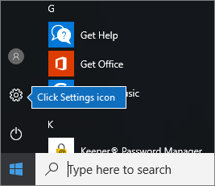

# 사용자용 Windows 장치 Microsoft 365 Business Premium 설정

## 시작하기 전에

Windows 사용자를 위해 Windows Microsoft 365 Business Premium 장치를 설정하기 전에 모든 Windows 장치가 Windows 10 Pro 버전 1703(크리에이터스 업데이트)을 실행하고 있는지 확인하십시오. Windows 10 Pro 클라우드 서비스 및 장치 관리 기능 집합인 Windows 10 Business 배포하기 위한 선행 구성 Windows 10 Pro 관리 및 보안 제어를 Microsoft 365 Business Premium.
  
Windows 7 Pro, Windows 8 Pro Windows 또는 Windows 8.1 Pro 7을 실행하는 Microsoft 365 Business Premium 디바이스가 있는 경우 Microsoft 365 Business Premium 업그레이드를 Windows 10 있습니다.
  
Windows 장치를 Windows 10 Pro 크리에이터 업데이트로 업그레이드하는 방법에 대한 자세한 내용은 [Windows Pro 크리에이터 업데이트로 Windows 장치 업그레이드](../../business-video/upgrade.md)의 단계를 따르세요.
  
디바이스가 [Azure AD에](#verify-the-device-is-connected-to-azure-ad) 연결되어 있는지 확인을 참조하여 업그레이드가 있는지 확인하거나 업그레이드가 올바르게 진행된지 확인합니다.

## 시청: 커넥트 비즈니스에 PC를 Microsoft 365 수 있습니다.

> [!VIDEO https://www.microsoft.com/videoplayer/embed/RE3yXh3] 

이 비디오가 도움이 된 경우에는 [소규모 비즈니스 및 Microsoft 365를 처음 사용하는 사용자들을 위한 완전한 교육 시리즈](../../business-video/index.yml)를 참조하세요.
  
## Windows 10 장치를 조직의 Azure AD에 연결

조직의 모든 Windows 장치가 Windows 10 Pro 크리에이터스 업데이트로 업그레이드되거나 Windows 10 Pro 크리에이터스 업데이트를 이미 실행 중인 경우 이러한 장치를 조직의 크리에이터스에 가입할 수 Azure Active Directory. 디바이스가 가입되고 나면 디바이스가 Windows 10 Business 구독의 일부인 Microsoft 365 Business Premium 업그레이드됩니다.
  
### 최신 또는 새로 업그레이드된 Windows 10 Pro 장치의 경우

Windows 10 Pro 크리에이터 업데이트를 실행하는 새로운 장치 또는 Windows 10 Pro 크리에이터 업데이트로 업그레이드했지만 Windows 10 장치 설정을 완료하지 않은 장치의 경우 다음 단계를 따르세요.
  
1. **어떻게 설정하시겠어요?** 페이지에 도달할 때까지 Windows 10 장치 설정을 진행합니다. 
    
    
  
2. 여기서 조직에 대해 설정 **을 선택한** 다음 조직에 대한 사용자 이름과 암호를 Microsoft 365 Business Premium. 
    
3. Windows 10 장치 설정을 완료합니다.
    
   설정을 완료하면 사용자가 조직의 Azure AD에 연결됩니다. [장치가 Azure AD에 연결되었는지 확인](#verify-the-device-is-connected-to-azure-ad)을 참조하여 연결을 확인하세요. 
  
### Windows 10 Pro를 이미 설치하여 운영 중인 장치의 경우

 **Azure AD에 사용자 연결:**
  
1. 사용자의 Windows PC에서 Windows 10 Pro 버전 1703(크리에이터 업데이트)([필수 조건](../security-and-compliance/pre-requisites-for-data-protection.md) 확인)을 사용하는 경우 Windows 로고와 설정 아이콘을 차례로 클릭합니다.
  
   
  
2. **설정** 에서 **계정** 으로 이동합니다.
  
   
  
3. **사용자 정보** 페이지에서 **회사 또는 학교 액세스** \> **연결** 을 차례로 클릭합니다.
  
   
  
4. **회사 또는 학교 계정 설정** 대화 상자의 **대체 작업** 에서 **Azure Active Directory에 이 장치 가입** 을 선택합니다.
  
   
  
5. **로그인 시작** 페이지에 회사 또는 학교 계정을 입력합니다 \> **다음**.
  
   **암호 입력** 페이지에서 암호를 입력합니다 \> **로그인**.
  
   
  
6. 조직 **페이지가 맞는지 확인 페이지에서** 정보가 올바른지 확인하고 참가를 **선택합니다.**
  
   모두 **설정되어 있습니다!** page, chosse **Done**.
  
   
  
파일을 업로드하여 비즈니스용 OneDrive 다시 동기화합니다. 타사 도구를 사용하여 프로필 및 파일을 마이그레이션한 경우 이러한 도구를 새 프로필과 동기화합니다.
  
## 장치가 Azure AD에 연결되었는지 확인

동기화 상태를 확인하려면 설정  직장 또는 학교 액세스 페이지에서 _  _에 연결 **영역을** 선택하여 정보 및 연결 끊기 단추를 \<organization name\>  **노출합니다.** 정보를 **선택하면** 동기화 상태를 확인할 수 있습니다. 
  
동기화 **상태 페이지에서** **동기화를** 선택하면 PC에 최신 모바일 장치 관리 정책을 다운로드할 수 있습니다.
  
Microsoft 365 Business Premium 계정을 사용하려면 Windows 시작 단추로 이동하여 현재 계정 사진을 **마우스** 오른쪽 단추로 클릭한 다음 계정 전환 **을 클릭합니다.** 조직 전자 메일 및 암호를 사용하여 로그인합니다.
  

  
## PC가 서버로 업그레이드되어 있는지 Windows 10 Business

Azure AD에 가입된 Windows 10 디바이스가 Windows 10 Business 구독의 일부로 Microsoft 365 Business Premium 합니다.
  
1. **설정** \> **시스템** \> **정보** 로 이동합니다.
    
2. **버전** 이 **Windows 10 Business** 인지 확인합니다.
    
    
  
## 다음 단계

모바일 장치를 설정하려면 Microsoft 365 Business Premium 사용자를 위한 모바일 장치 설정 [,](set-up-mobile-devices.md)장치 보호 또는 앱 보호 정책을 설정하려면 비즈니스용 Microsoft 365 [관리를 참조하세요.](/admin/index.yml)
  
## 관련 콘텐츠

[Microsoft 365 Business 교육 비디오](../../business-video/index.yml)(링크 페이지)
