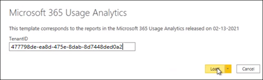

# 커넥트 사용하여 Microsoft 365 정부 커뮤니티 클라우드(GCC) 데이터 관리

다음 절차에 따라 Microsoft 365 정부 커뮤니티 클라우드(GCC) 테넌트의 Microsoft 365 사용 현황 분석 보고서를 사용하여 데이터에 연결합니다. 

> [!NOTE]
> 이러한 지침은 테넌트의 Microsoft 365 GCC 있습니다. 

## 시작하기 전에

처음에 사용 현황 Microsoft 365 구성: 

- 데이터 수집을 사용하도록 Microsoft 365 전역 관리자로 설정해야 합니다. 
- 템플릿 파일을 [사용하려면](https://powerbi.microsoft.com/en-us/desktop/) Power BI Desktop 응용 프로그램이 필요합니다. 
- 보고서를 [Power BI Pro 보고](https://go.microsoft.com/fwlink/p/?linkid=845347) Premium 라이선스 또는 추가 용량이 필요합니다. 

## 1단계: 조직의 데이터를 사용 현황 분석 보고서에 Microsoft 365 수 있도록 설정

1. 이 Microsoft 365 관리 센터 탐색 메뉴를 확장하고 **보고서를** 선택한 다음 사용 을 **선택합니다.** 
2. 사용 **현황 보고서 페이지의** Microsoft 365 사용 현황 분석 섹션에서 를 **시작.** 
3. 사용 **현황 Power BI 사용에서** 조직 사용 현황 데이터를 **Microsoft** 사용 현황 분석에 사용할 수 있도록 설정을 선택하고 Power BI **을 선택합니다.**

     

    이렇게 하면 조직 데이터에 이 보고서에 액세스할 수 있는 프로세스가 시작될 것이고 사용 현황 분석에 대한 데이터를 준비하고 Microsoft 365 **표시됩니다.** 이 프로세스를 완료하는 데 24시간이 걸릴 수 있습니다. 

4. 조직 데이터가 준비되면 페이지를 새로 고치면 데이터를 사용할 수 있으며 테넌트 ID 번호도 제공된다는 **메시지가** 표시됩니다. 테넌트 데이터에 연결하려고 할 때 이후 단계에서 테넌트 ID를 사용해야 합니다. 
 
     
 
    > [!IMPORTANT]
    > 데이터를 사용할 수 있는 경우 Power BI 로 이동을 선택하지 말고 Power BI 마켓플레이스로 이동하십시오.  GCC 테넌트에 필요한 이 보고서의 템플릿 앱은 Power BI 마켓플레이스에서 사용할 수 없습니다.  

## 2단계: Power BI 템플릿을 다운로드하고, 데이터에 연결하고, 보고서를 게시합니다.

Microsoft 365 GCC 사용 현황 분석 보고서 Microsoft 365 파일을 다운로드하여 사용하여 데이터에 연결할 수 있습니다. 템플릿 파일을 Power BI Desktop 수 있습니다. 

 > [!NOTE]
 > 현재 Microsoft 365 사용 현황 분석 보고서용 템플릿 앱은 GCC 마켓플레이스의 Power BI 없습니다.  

1. Power BI [템플릿을 다운로드한](https://download.microsoft.com/download/7/8/2/782ba8a7-8d89-4958-a315-dab04c3b620c/Microsoft%20365%20Usage%20Analytics.pbit)후 Power BI Desktop. 
2. **TenantID를** 묻는 메시지가 표시될 때 1단계에서 이 보고서에 대한 조직의 데이터를 준비할 때 받은 테넌트 ID를 입력합니다. 그런 다음 **로드를 선택합니다.** 데이터를 로드하는 데 몇 분 정도 걸립니다. 

     

3. 로드가 완료되면 보고서가 표시될 것이고 데이터에 대한 임원 요약이 표시됩니다. 

     
 

4. 보고서에 변경 내용을 저장합니다. 
5. 보고서를 **볼** 수 있는 Power BI Desktop 온라인 서비스에 게시하려면 Power BI 메뉴에서 게시를 선택합니다. 이렇게 하려면 Power BI Pro 또는 Power BI Premium 필요합니다. 게시 [프로세스의 일부로](/power-bi/create-reports/desktop-upload-desktop-files#to-publish-a-power-bi-desktop-dataset-and-reports)온라인 서비스에서 사용 가능한 작업 영역으로 게시할 대상을 Power BI 합니다.

## 관련 콘텐츠

[사용량 분석 정보](usage-analytics.md)  
[사용 현황 분석 최신 버전 가져오기](get-the-latest-version-of-usage-analytics.md)  
[Microsoft 365 사용 현황 분석에서 보고서 탐색 및 활용](navigate-and-utilize-reports.md)  