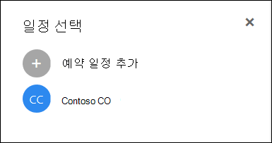

# Microsoft Bookings 질문과 대답Microsoft Bookings Frequently Asked Questions

## 일반 사항General

### Microsoft Bookings란?What is Microsoft Bookings?

Microsoft Bookings는 약속을 쉽게 예약하고 관리할 수 있는 Microsoft 365 앱입니다.Microsoft Bookings is a Microsoft 365 app that makes scheduling and managing appointments easy. Bookings에는 웹 기반 예약 일정이 포함되어 있으며 Outlook과 통합되어 직원의 일정을 최적화하여 고객에게 가장 적합한 시간을 유연하게 예약할 수 있습니다.Bookings includes a Web-based booking calendar and integrates with Outlook to optimize your staff’s calendar, giving your customers flexibility to book a time that works best for them. 자동 알림 전자 메일은 no-shows를 줄이고 조직은 반복적인 관리 작업을 줄여 시간을 절약합니다.Automated notification emails reduce no-shows, and organizations save time with a reduction in repetitive scheduling tasks. Bookings를 사용하면 Skype 또는 Microsoft Teams를 통해 가상 약속을 쉽게 수행하고 Teams의 Bookings 앱을 통해 매일 예약을 관리할 수 있습니다.Bookings helps you easily conduct virtual appointments via Skype or Microsoft Teams, and helps you manage day-to-day scheduling via the Bookings app in Teams. Bookings는 사용자 지정 기능을 기본으로 사용하여 조직의 여러 부분의 요구를 충족하도록 디자인되어 있습니다.With built-in ability to customize, Bookings is designed to meet the needs of multiple parts of any organization.

### Microsoft Bookings는 어떻게 사용하나요?How do I use Microsoft Bookings?

Bookings는 온라인 서비스로, 다운로드할 필요가 없습니다.Bookings is an online service, so you don't need to download anything. Microsoft 365 웹 환경 내의 앱 선택으로 이동하면 됩니다.Just go to the app chooser within the Microsoft 365 Web experience. 또한 관리자는 Bookings 도우미 앱을 사용하여 고객 및 약속에 대한 최신 정보를 최신으로 유지 할 수 있습니다.Administrators can also use the Bookings companion app to stay current with the latest information about customers and their appointments.

### Microsoft Bookings에 액세스할 수 있는 사용자Who has access to Microsoft Bookings?

예약은 전 세계 Microsoft 365 Business Premium, Microsoft 365 Business Standard, A3, A5, E3 및 E5 고객에 대해 기본적으로 사용 가능하고 활성 상태입니다.Bookings is available and active by default for Microsoft 365 Business Premium, Microsoft 365 Business Standard, A3, A5, E3, and E5 customers worldwide. Bookings는 21Vianet에서 운영하는 Office 365에서도 사용할 수 있습니다.Bookings is also available in Office 365 operated by 21Vianet.

### 고객에게 개인 일정 또는 비즈니스 일정이 표시하나요?Will my customers see my personal or business calendar?

고객에게는 등록하기로 선택한 서비스, 시간 및 직원에 대해 온라인으로 게시한 Bookings 일정만 표시됩니다.Your customers will only see the Bookings calendar that you publish online for the services, times, and staff that you choose to register.

### 직원 관리에서 예약 가능 특성을 변경하는 방법How do I change a bookable attribute under Manage staff?

직원 구성원이 추가된 경우 요청을 수락하거나 거부하는 전자 메일을 받았을 것입니다.When staff members were added, they would have received an email to accept or reject the request. 동일한 전자 메일을 열고 "거부"를 선택하여 예약할 수 없습니다.They can open the same email and select "Reject" to make them non-bookable. 현재 앱 내부에서 전환할 방법이 없습니다.We currently do not have a way to toggle this from inside the app.

### 최종 사용자가 Bookings 앱에 액세스하는 방법How do end users access the Bookings app?

Microsoft 365 Business Premium, Microsoft 365 Business Standard, A3, A5, E3, E5에 대한 라이선스가 부여되거나 관리자 또는 뷰어 역할에서 직원 구성원으로 추가된 모든 사용자가 Microsoft 365 웹 환경 내의 앱 선택기에서 Bookings에 액세스할 수 있습니다.Anyone who is licensed for Microsoft 365 Business Premium, Microsoft 365 Business Standard, A3, A5, E3, E5, or is added as a staff member in either the Administrator or Viewer roles can access Bookings in the app chooser within the Microsoft 365 Web experience. iOS 및 Android에 사용할 수 있는 도우미 앱이 있습니다.There is also a companion app available for iOS and Android.

### 자체 웹 사이트에서 Bookings를 사용할 수 있나요?Can I use Bookings in my own Web site?

예.Yes. iFrame을 통해 사이트에 Bookings 일정을 포용할 수 있는 방법을 제공합니다.We provide a way for you to embed your Bookings calendar in your site via an iFrame. 링크 embeding 코드는 Bookings 앱 내의 **Bookings** 페이지 탭에 있습니다.Link embedding code is located in the **Bookings page** tab within the Bookings app.

### 비즈니스용 웹 페이지가 없는 경우에도 Bookings를 사용할 수 있나요?Can I use Bookings even if I don’t have a Web page for my business?

예.Yes. 웹앱의 예약 페이지 탭에서  예약 페이지에 대한 링크를 제공하고 있습니다.We provide a link to your booking page within the **Booking page** tab in the Web app. 고객 또는 클라이언트에 대한 링크를 제공하면 비즈니스에 대한 최신 가용성 정보가 표시됩니다.You just need to provide that link to your customers or clients, and they will see the latest availability information for your business. 또는 소셜 미디어에서 예약 페이지를 공유하거나 embed 기능을 사용하여 iFrame에서 호스팅할 수도 있습니다.Alternatively, you can share the booking page in social media or even use the embed feature to host it in an iFrame. 직접 검색 엔진 인덱싱을 사용 안 하도록 설정하고 조직 내의 사용자로만 액세스를 제한하여 페이지에 액세스할 수 있는 사용자도 제어할 수 있습니다.You also have the ability to control who can access the page by disabling direct search engine indexing and restricting access to only those within your organization.

### IT 부서에서 최종 사용자가 Bookings에 액세스할 수 있는지 여부를 제어할 수 있나요?Can our IT department control whether end users can access Bookings?

Bookings는 기본적으로 Microsoft 365 Business Premium, Microsoft 365 Business Standard, M365 A3/A5 및 E3/E5 테넌트에서 사용할 수 있지만 관리자가 선택한 경우 Microsoft 365 관리 센터에서 이 기능을 해제할 수 있습니다.Bookings is available in Microsoft 365 Business Premium, Microsoft 365 Business Standard, M365 A3/A5 and E3/E5 tenants by default, but administrators can turn it off in the Microsoft 365 admin center if they choose. 이렇게 하여 다음 [지침을 따릅니다.](turn-bookings-on-or-off.md)To do so, [follow these instructions](turn-bookings-on-or-off.md).

고객이 테넌트의 특정 적격 라이선스에 대해 Bookings에 대한 액세스를 사용하지 않도록 설정하려는 경우 그룹 정책을 사용하여 라이선스를 제한하거나 새 Bookings 일정을 만들 수 있는 대상을 제한하는 OWA 사서함 정책을 구현할 수 있습니다.If a customer wants to disable access to Bookings for certain eligible licenses in their tenant, they can either use a group policy to restrict licenses or implement an OWA Mailbox policy that will restrict who is able to create new Bookings calendars.

OWA 사서함 정책을 사용하여 Bookings에 대한 액세스를 사용하지 않도록 설정하는 경우 모든 사용자에게 Bookings 라이선스가 부여됩니다. 그러나 사용자가 앱에 액세스하려고 하면 정책에 참여하거나 기존 Bookings 일정에 직원으로 추가된 사용자만 성공할 수 있습니다.If you use an OWA Mailbox policy to disable access to Bookings, all users will have a Bookings license, however when they attempt to access the app, they will only be successful if they are part of the policy or if they have been added to an existing Bookings calendar as staff. "선택한 [사용자만](turn-bookings-on-or-off.md) Bookings 일정을 만들 수 있도록 허용" 섹션의 세부 정보입니다.Details [here](turn-bookings-on-or-off.md) in the “Allow only selected users to create Bookings calendars” section.

### Bookings를 사용자 지정 가능한가요?Is Bookings customizable?

예. Bookings는 사용자 지정이 가능하고 다양한 시나리오에 사용할 수 있습니다.Yes, Bookings is customizable and can be used for a variety of different scenarios. Bookings 일정을 설정할 때 웹 기반 일정 페이지의 다양한 측면, 비즈니스 정보, 직원 세부 정보, 서비스 유형 및 일정 정책을 사용자 지정할 수 있습니다.When setting up a Bookings calendar, many aspects of the Web-based scheduling page, your business information, staff details, service types, and scheduling policies can be customized.

### Microsoft Teams에서 원래 Bookings 웹앱의 모든 기능을 사용할 수 있나요?Is all the functionality of the original Bookings Web app available in Microsoft Teams?

이제 Teams에서 경량 버전의 Bookings를 앱으로 사용할 수 있습니다.A lightweight version of Bookings is now available as an app in Teams. 여기에서 초기 공지 사항을 [찾아 주세요.](https://www.microsoft.com/microsoft-365/blog/2020/03/06/empowering-care-teams-with-new-tools-in-microsoft-365/)Please find the initial announcement [here](https://www.microsoft.com/microsoft-365/blog/2020/03/06/empowering-care-teams-with-new-tools-in-microsoft-365/). 웹앱에 딥 링크 기능이 제공될 수 있으며, 설치 후 Teams를 종료하지 않고도 Bookings를 매일 사용할 수 있습니다.There is deep link functionality to pop out in the Web app, and after setup, day-to-day use of Bookings can be done without ever leaving Teams. 플랫폼 전체에서 정보 흐름Information flows across platforms.

### Bookings a small business offering or an Enterprise offering or both?Is Bookings a small business offering or an Enterprise offering or both?

Bookings는 다양한 산업 전반에 걸쳐 엔터프라이즈 및 중소기업 고객에게 이상적인 솔루션입니다.Bookings is an ideal solution for both Enterprise and small business customers, across a variety of industries. 사용 사례는 다음과 같습니다.Use cases include:

- 금융 서비스Financial services
    - 컨설팅consultations
    - banking and insurance servicesbanking and insurance services
    - tax filingstax filings

- 인사(인사)Human resources (HR)
    - 후보 면접candidate interviews
    - 온보더링onboarding
    - 혜택 지원benefits assistance
    - 교육 및 세미나training and seminars

- 의료Healthcare
    - patient visitspatient visits
    - 공급자-공급자 공동 작업provider-to-provider collaboration
    - insurance consultsinsurance consults

- 정부 & 공공 부문Government & Public Sector
    - 법정 청문회 및 재판court hearings and trials
    - 공용 서비스public services
    - 부서 약속department appointments

- 교육 -- K-12Education -- K-12
    - 부모-교사 회의parent-teacher conferences
    - 학교 번 시청school town hall
    - 학생-조언자 방문student-counselor visits

- 교육 -- 상위 EdEducation -- Higher Ed
    - 근무 시간office hours
    - tutoringtutoring
    - 학생 서비스student services
    - 시험 등록exam sign-up

- 소매Retail
    - 보조 쇼핑assisted shopping
    - 계약자일정contractor scheduling
    - 디자인 서비스design services

- 일반 엔터프라이즈 및 소규모 비즈니스 요구General Enterprise and small business needs
    - 고객 및 클라이언트 모임customer and client meetings
    - 기술 지원tech support
    - 법적 검토legal reviews
    - facilitiesfacilities

## 가격 책정 및 라이선스Pricing and licensing

### Microsoft Bookings를 다운로드하는 방법How do I get Microsoft Bookings?

예약은 Microsoft 365 Business Premium, Microsoft 365 Business Standard, A3, A5, E3 및 E5 라이선스가 있는 고객을 위해 Microsoft 365에서 iOS 및 Android 도우미 앱과 함께 사용할 수 있습니다.Bookings is available in Microsoft 365 for customers with Microsoft 365 Business Premium, Microsoft 365 Business Standard, A3, A5, E3, and E5 licenses, along with an iOS and Android companion app. 예약은 독립 실행형 앱으로 사용할 수 없습니다.Bookings is not available as a standalone app. Outlook Web App Outlook 내에 데이터를 저장하기 때문에 Bookings를 사용하려면 웹용 Outlook 또는 Outlook을 사용하도록 설정해야 합니다.Outlook Web App or Outlook on the web must be enabled to use Bookings, as it stores data within Outlook.

Bookings 라이선스는 일정 만들기 및 관리를 포함하여 제품에 모든 기능을 제공합니다.A Bookings license provides full functionality to the product, including creating and managing calendars. 또한 해당 사용자가 관리자 또는 뷰어 역할의 직원으로 추가될 때 사용자가 기존 일정을 보고 편집할 수 있습니다.It also enables the ability for users to view and edit existing calendars, when those users are added as staff in an Administrator or Viewer role.

### 현재 공급자의 전자 메일 계정을 Microsoft 365로 마이그레이션해야 하나요?Do I need to migrate my email account from my current provider to Microsoft 365?

현재 공급자를 유지할 수 있지만 Bookings는 Microsoft 365 계정에서 사용되는 전자 메일로 모든 알림을 전송합니다.You can keep your current provider, but Bookings will send all notifications to the email used in your Microsoft 365 account.

### 직원이 Microsoft 365 계정 없이 Bookings를 사용할 수 있나요?Can my employees use Bookings without a Microsoft 365 account?

예.Yes. 전자 메일로 직원을 추가할 수 있으며 누군가와 약속을 예약할 때 전자 메일 확인 및 일정 초대를 계속 받을 수 있습니다.You can add your staff with any email, and they will still get the email confirmation and the calendar invite when someone books an appointment with them.

### 동일한 Microsoft 365 계정으로 Bookings 일정을 두 개 이상 만들고 이 일정 간에 전환할 수 있나요?Can I create more than one Bookings calendar under the same Microsoft 365 account and switch between them?

예.Yes. 계정 하나를 사용하여 두 개 이상의 Bookings 일정을 만들고 관리할 수 있습니다.You can create and manage more than one Bookings calendar with one account. Bookings 웹앱의 업무 이름 옆에 있는 캐비트를 사용하여 전환할 수 있습니다.You can switch between them using the caret next to the business name in the Bookings Web app.

### 조직에 F1/F3, E1 및 E3/E5가 혼합된 라이선스가 있는 경우 어떻게 하나요?What if my organization has mixed licenses with F1/F3, E1, and E3/E5?

많은 조직이 Microsoft 365 라이선싱이 혼합된 것으로 인식하고 있습니다.We recognize that many organizations have a mixture of Microsoft 365 licensing. 예를 들어 고객에게는 본사 직원용 M365 E3 라이선스가 있지만 스토어 직원에 대한 M365 E1(또는 F1 또는 F3) 라이선스가 있을 수 있습니다.For example, a customer may have M365 E3 licenses for employees in their headquarters, but M365 E1 (or F1 or F3) licenses for their store employees.

이 예에서 M365 E3 라이선스가 있는 본사 직원은 Bookings에 대한 모든 권한을 가지며, 즉 새 일정을 만들고, 설정을 편집하고, 직원을 추가하고, 예약 페이지를 게시하고, 일정 내에서 약속을 만들고 관리하고, 보고서를 끌어 올 수 있습니다.In this example, the headquarters employees with an M365 E3 license have full access to Bookings, which means they can create new calendars, edit settings, add staff, publish a booking page, create and manage appointments within the calendar, and pull reports.

E1/F1/F3 라이선스가 있는 직원 또는 라이선스가 없는 직원은 게스트 역할의 일정에 직원으로 추가한 다음 약속을 예약할 수 있으며 예약 시 확인 전자 메일을 받게 됩니다.Those store employees with E1/F1/F3 licenses, or with no licenses, can still be added as staff to calendars in a Guest role and then booked for appointments, and they will receive confirmation emails when they are booked. 직원 탭에 나열된 사용 가능/예약 시간 동안에도 예약할 수 있습니다. Bookings 일정 가용성은 예약 가능한 시간을 설정된 시간 및 서비스 시간으로 제한합니다.They can still be booked during their available/scheduled hours as listed in the staff tab. The Bookings calendar availability constrains bookable times by their set hours and service hours.

예약 웹앱을 통해 약속이 이미 예약된 경우에도 스토어 직원은 Bookings에서 사용할 수 없는 것으로 표시됩니다.The store employees will also display as unavailable in Bookings if an appointment has already been scheduled at that time through the Bookings Web app. Bookings를 통해 예약된 약속은 Bookings 내에서 직원 구성원의 일정에 대한 약속이 바쁘게 반영됩니다.Appointments booked via Bookings will reflect as busy on a staff member's calendar within Bookings. Bookings를 사용할 수 없는 라이선스가 있는 직원은 동일한 테넌트 내에 있는 경우 Bookings에서 개인 일정이 가용성에 영향을 줄 수 있습니다.Staff with a non-Bookings enabled license can still have their personal calendar impact their availability in Bookings, provided they are within the same tenant.

게스트 역할의 사람은 고객이 초기 약속을 만들 때 제공한 정보를 볼 수 있습니다.People in the Guests role can view any of the information the customer has provided within the initial appointment creation. 예를 들어 약속을 예약한 스토어 담당자가 약속 전에 고객에게 전화를 걸면 예약 프로세스 중에 고객이 제공하는 정보에 액세스할 수 있습니다.For example, if the store representative who is booked for the appointment is required to call the customer prior to the appointment, they will have access to the information the customer provides during the scheduling process. 예약된 직원 구성원은 확인 전자 메일에 나타나는 모든 정보 및 .ics 일정 이벤트(예: 입력한 고객 전화 번호)에 액세스할 수 있습니다.The staff member who is booked will have access to all information that appears in the confirmation email, as well as the .ics calendar event (such as the customer phone number if it was entered).

게스트 역할의 사용자들은 Bookings 웹앱에 액세스하여 설정을 변경하거나 약속을 보고 관리할 수 없습니다(추가, 취소 및 다시 예약).People in the Guest role will not have the ability to access the Bookings Web app to change settings or to view and manage appointments (add, cancel, and reschedule). 그러나 셀프 서비스 페이지를 사용하여 고객이 약속을 하는 방법과 동일한 방식으로 고객을 대신하여 약속을 만들 수 있습니다.However, they can make appointments on behalf of customers using the Self-service page, in the same way that a customer would make an appointment.

페이지 및 약속을 설정하고 관리하기 위해 Bookings 적격 라이선스를 사용하여 각 저장소의 비즈니스 관리자 또는 관리자에게 라이선스를 부여하는 것이 좋습니다.We recommend licensing a business manager or administrator of each store with a Bookings-eligible license to set up and manage pages and appointments. 그런 다음 나머지 직원은 Bookings 라이선스가 있는 직원과 함께 예약을 다시 예약하거나 취소합니다.The rest of the staff would then work with the employee licensed with Bookings in order to reschedule or cancel a booking.

## 제품 기능Product features

### Microsoft 365 테넌트에 Bookings 일정이 표시되는 위치\*\*Where do Bookings calendars show up in my Microsoft 365 tenant?\*\*

각 새 Bookings 일정은 Exchange에 해당 사서함과 AAD(Azure Active Directory)의 관련 항목을 만듭니다. 여기서 항목은 라이선스가 없는 사용자로 나열됩니다.Each new Bookings calendar creates a corresponding mailbox in Exchange, as well as a related entry in Azure Active Directory (AAD), where the entry is listed as an unlicensed user.

### 이전에 만든 Bookings 일정을 삭제할 수 있나요?Can I delete a previously created Bookings calendar?

Bookings 일정을 삭제하려면 Exchange에서 연결된 사서함을 삭제해야 합니다.In order to delete a Bookings calendar you must delete the associated mailbox in Exchange.

### 일정을 만들고 다른 사용자가 Bookings에 액세스할 수 있는 경우 내 일정을 볼 수 있나요?If I create a calendar and someone else has access to Bookings, would they be able to see my calendar?

웹앱을 통해 만든 Bookings 일정에 액세스할 수 있는 사람은 관리자 또는 뷰어 역할에서 직원으로 추가된 사용자뿐입니다.The only people who have access to Bookings calendars that you create (through the Web app) is anyone who has been added as staff, in either an Administrator or Viewer role. 테넌트 관리자는 Exchange 및 AAD의 모든 Bookings 사서함 목록을 볼 수 있습니다.Tenant admins will be able to see a list of all Bookings mailboxes in Exchange and AAD.

### 비디오 회의 모임이 Bookings 앱에 통합되어 있나요?Are video conferencing meetings integrated into the Bookings app?

온라인 모임은 Bookings 내에서 Skype 또는 Microsoft Teams 클라이언트를 사용할 때 사용할 수 있습니다.Online meetings are available within Bookings when using the Skype or Microsoft Teams clients. 온라인 모임은 서비스 수준에서 사용하도록 설정할 수 있으며, 선택한 모임 클라이언트(Skype 또는 Teams)는 예약된 직원 구성원에 대해 기본적으로 설정됩니다.Online meetings can be enabled at the service-level, and the meeting client you choose (Skype or Teams) will be the one set by default for a booked staff member. 온라인 모임에 참가하기 위해 각 새 약속에는 약속에 연결된 고유한 모임 링크가 있으며, 이벤트 및 확인 전자 메일에 쉬운 참가 옵션이 포함됩니다.To join the online meetings, each new appointment will have a unique meeting link attached to the appointment, and in addition, easy join options are included in the event and in confirmation emails.

### 정책은 어떻게 작동하나요?How does scheduling policy work?

최대 리드 타임이라는 **설정은** 예약할 수 있는 가장 멀리(일 단위로 측정)를 결정합니다.A setting called **Maximum lead time** determines the farthest in advance (measured in days) that a booking can be made. 최소 리드 타임(최소 리드  타임, 시간, 예약 및 취소의 경우)과 최대 리드 타임 사이에는 최소 24시간이 있어야 합니다.There must be at least 24 hours between **Minimum lead time** (the minimum lead time, in hours, for bookings and cancellations) and Maximum lead time. 최소 리드 타임이 0시간으로 설정된 경우 최대 1일로 설정할 수 있습니다. 이 경우 고객은 예약이 시작될 때까지 예약을 취소할 수 있으며, 고객은 약속이 다음 날 내에 있는 경우만 예약을 예약할 수 있습니다.Maximum lead time can be set to one day if Minimum lead time is set to 0 hours, which in this case means a customer can cancel a booking up until the time that it starts, and customers can only schedule bookings if the appointment is within the next day.

:::image type="content" source="media/bookings-faq-scheduling.png" alt-text="Bookings의 예약":::

### Bookings는 표준 시간대에서 어떻게 작동하나요?How does Bookings work across time zones?

모든 시간은 기본적으로 업무 표준 시간대(현지 표준 시간대)에 있습니다.All times are in the business time zone (your local time zone) by default. 즉, Bookings 일정에 대해 구성한 작업 시간 등의 모든 설정이 이 표준 시간대에 표시됩니다.This means any setting you configure for a Bookings calendar, such as working hours, will appear in this time zone. 셀프 서비스 페이지에는 최종 사용자의 표준 시간대에 있는 모든 약속 시간을 표시할 수 있습니다. 이 시간은 원하는 경우 해제할 수 있습니다.The Self-service page has the ability to display all the appointment times in the end-user's time zone, which can be turned off if desired. 비즈니스 **표준** 시간대에 항상 예약 페이지 탭에서 확인되지 않은 상태로 시간 슬롯을 표시하면 페이지를 방문하는 사용자가 현지 표준 시간대에 시간 슬롯을 볼 수 있습니다.If **Always show time slots in business time zone** remains unchecked on the Bookings page tab, then people visiting the page will see time slots in their own local time zones.

:::image type="content" source="media/bookings-faq-region.png" alt-text="예약 지역 및 표준 시간대 설정":::

Bookings의 직원에 대한 표준 시간대를 설정하는 프로비전은 없습니다.There is no provision to set time zone for staff in Bookings. 직원 표준 시간대 및 업무 시간이 업무 표준 시간대에 있습니다.Staff time zone, and thus business hours, will be in the business time zone.

### 전자 메일 알림을 테넌트 도메인 이름으로 보낼 수 있나요?Can email notifications be sent as the tenant domain name?

전자 메일 주소는 Microsoft 365 설정 수준에서 제어 및 관리되고 도메인 구성 설정에 따라 다릅니다.The email addresses are controlled and managed at the Microsoft 365 settings level and depend on the domain configuration settings there. 자세한 내용은 여기에서 찾을 수 [있습니다.](https://docs.microsoft.com/powershell/module/exchange/get-accepteddomain)More information can be found [here](https://docs.microsoft.com/powershell/module/exchange/get-accepteddomain).

### 다른 서비스 또는 특정 구성에 종속된 SMS 메시지를 보낼 수 있나요?Is the ability to send SMS messages dependent on a different service or specific configuration?

SMS 메시지는 현재 북미에서 사용할 수 있으며 Skype 또는 Twilio 계정은 SMS 배달에 사용됩니다.SMS messages are currently available in North America, and a Skype or Twilio account will be used for SMS delivery.

### Bookings 약속은 사람의 일정에 어떻게 표시될 수 있나요?How can Bookings appointments show up on a person’s calendar?

예약 확인은 서비스 공급자와 고객의 받은 편지함으로 모두 전송됩니다.The confirmation of the booking is sent to both the service provider’s and customer’s inboxes. 확인 전자 메일에는 \*.ics 첨부 파일이 포함되어 있습니다. 이 첨부 파일은 모든 관련 약속 세부 정보를 사용하여 사용자의 일정에 추가할 수 있습니다.The confirmation email contains an \*.ics file attachment, which can then be added to the user’s calendar with all relevant appointment details.

### 서비스 공급자 또는 직원 및 고객 전자 메일을 트리거하는 이유는 무엇입니까?What triggers service provider or staff and customer emails?

전자 메일은 Bookings 웹앱의 서비스 탭에 있는 설정에 따라 트리거됩니다.Emails are triggered based on settings in the Services tab in the Bookings Web app. 셀프 서비스 페이지 또는 Bookings 웹 앱의 일정 탭에서 고객이 예약한 경우 확인 및/또는 미리 알림 전자 메일이 트리거됩니다.A booking made by the customer on the Self-service page, or on the Calendar tab in the Bookings Web app, will trigger a confirmation and/or a reminder email. 확인 전자 메일 또는 웹 앱 내에서 예약  관리 단추를 통해 예약을 변경할 때도 동일한 일이 발생하게 됩니다.The same thing will happen when someone makes a change to the booking via the **Manage booking** button in the confirmation email or within the Web app. 예약 웹앱의 서비스 탭에 자세히 설명된 미리 알림 전자 메일은 약속 이전의 지정된 기간에 전송됩니다.Reminder emails are sent at a specified time period prior to an appointment, as detailed in the Services tab in the Bookings Web app.

### 1:1이 아닌 1:다인 강의실 스타일 약속을 예약할 수 있나요?Can I book classroom-style appointments that are 1:many instead of 1:1?

예, 여러 사용자가 동일한 약속을 동시에 예약할 수 있는 그룹 예약 기능이 있습니다(예: 피트니스 수업용).Yes, we have a group bookings functionality that allows multiple people to book the same appointment at the same time (such as for a fitness class). 이 기능은 여기에서 자세히 [설명되어 있습니다.](https://techcommunity.microsoft.com/t5/microsoft-bookings-blog/microsoft-bookings-now-supports-online-meetings-and-group/ba-p/1214120)This functionality is described in detail [here](https://techcommunity.microsoft.com/t5/microsoft-bookings-blog/microsoft-bookings-now-supports-online-meetings-and-group/ba-p/1214120).

### 일정은 공개되지 않은 상태로 유지되지만 지정된 사용자가 계속 액세스할 수 있나요?Can calendars remain unpublished (not public-facing) but still accessible to designated users?

예.Yes. 웹앱의 예약 페이지 탭에는 조직에서 예약하려면 **Microsoft 365 또는 Office 365** 계정 필요 확인란이 있습니다.There is a check box on the Booking page tab in the Web app: **Require a Microsoft 365 or Office 365 account from my organization to book**. 이 확인란을 선택하면 셀프 서비스 페이지 액세스가 테넌트 내에 있는 페이지로만 제한됩니다.Selecting this check box restricts Self-service page access to only those that are within your tenant. 만들기 및 관리를 위해 웹 앱 내에 있는 Bookings 일정은 관리자 또는 뷰어 역할이 있는 페이지에 직원으로 추가된 개인만 액세스할 수 있습니다.The Bookings calendar that sits within the Web app for creation and management can only be accessed by those individuals added as staff to the page with Administrator or Viewer roles.

:::image type="content" source="media/bookings-faq-access-ctrl.png" alt-text="Bookings의 예약 페이지 액세스 제어":::

### 홈페이지는 얼마나 자주 업데이트하나요?How frequently does the Home page update?

웹앱이 로드될 때마다 홈 페이지에 연결된 최신 데이터가 검색됩니다.The latest data linked to your Home page is retrieved  whenever the Web app is loaded. Bookings에서 추적하는 정보 유형에 대한 자세한 내용은 이 지원 문서를 [참조하세요.](metrics-and-activity-tracking.md)For further details on the type of information tracked by Bookings, see this [support article](metrics-and-activity-tracking.md).

### 시간 해제에 대한 전자 메일 알림을 해제할 수 있나요?Can I turn off the email notifications for Time Off?

Bookings 웹앱 내에서 녹음/녹화하는 경우 항상 직원에게 알림 전자 메일이 트리거됩니다.Recording Time Off within the Bookings Web app will always trigger a notification email to staff members. 직원 구성원이 알림에 대해 혼동하는 경우 직원에게 관리자 측에서 발생하는 일에 대해 보다 잘 알릴 수 있도록 메모나 시간제 알림 제목에 세부 정보를 추가하는 것이 좋습니다.If any staff members are confused about the notification, we recommend you add more detail in the notes or title of the Time Off notification, to better inform staff about what is occurring on the admin side.

### Bookings 일정을 복제하거나 복제할 수 있으며 쉽게 확장할 수 있도록 임시로 만들 수 있나요?Can Bookings calendars be cloned or duplicated, and can they be templatized for easy scaling?

이 프로세스는 Graph API를 사용하여 사서함 세부 정보를 확인한 다음 해당 세부 정보를 사용하여 새 사서함을 만드는 것입니다.The process would be to use the Graph API to get mailbox details, and then use those details to create a new mailbox. API 설명서는 [다음과 있습니다.](https://docs.microsoft.com/graph/api/resources/booking-api-overview?view=graph-rest-beta)API documentation is [here](https://docs.microsoft.com/graph/api/resources/booking-api-overview?view=graph-rest-beta).

### Bookings에서 사용할 수 있는 보고는 무엇입니까?What reporting is available in Bookings?

관리자 역할에 할당된 모든 Bookings 직원은 탭으로 구분된 값()을 다운로드할 수 있습니다. 지난 120일 동안의 모든 예약이 있는 TSV) 파일입니다.All Bookings staff assigned to the Administrator role can download a tab-separated values (.TSV) file with all bookings made in the past 120 days. Bookings 보고서를 다운로드할 수 있습니다. Bookings 페이지의 홈 탭에 있는 TSV 양식입니다.Bookings reports can be downloaded in .TSV form from the Home tab of the Bookings page. Bookings API를 사용하여 보다 사용자 지정 및 특정 목적을 위해 이 데이터를 수집할 수도 있습니다.The Bookings API can also be used to collect this data for more customized and specific purposes.

### 셀프 서비스 페이지에서 한 번만 서비스를 공유할 수 있나요?Is it possible to share only one service on the Self-service page at a time?

예, 각 서비스에 대해 별도의 Bookings 일정을 만들거나 서비스 탭으로 이동하여 서비스를 편집할 수 있으며 페이지 맨 위에 해당 특정 서비스에 대한 URL만 공유하는 옵션이 표시됩니다.Yes, you can either create separate Bookings calendars for each service, or you can go to the Services tab, edit a service, and at the top of the page you will see an option to share a URL only for that specific service.

### 약속을 예약하는 경우 동의 양식 또는 공개를 위해 사용할 수 있는 옵션은 무엇입니까?What options are available for embedding a consent form or disclosure for those booking an appointment?

예약 페이지에서 고객  데이터 사용 동의 확인란을 사용하도록 설정하고 조직의 공개 또는 동의 요구 사항을 제대로 전달할 수 있도록 표현을 사용자 지정하는 것이 좋습니다.We recommend enabling the **Customer data usage consent** check box in the Booking page and customizing the wording to properly convey your organization's disclosure or consent requirements. 또 다른 옵션은 동의 양식에 대한 링크가 포함된 서비스에 사용자 정의 필드를 추가하고 고객이 양식을 완료한 후 약속을 계속할 수 있도록 요구하는 것입니다.Another option is to add a custom field to the service that includes a link to the consent form, and require customers to confirm that they have completed the form before they can proceed with making an appointment. 동의 양식 URL을 확인 및 미리 알림 전자 메일의 추가 메모로 추가할 수도 있지만, 이렇게 하면 사용자가 약속을 예약할 수 없습니다.You can also add the consent form URL as additional notes in confirmation and reminder emails, but this will not prevent users from booking an appointment.

### 셀프 서비스 예약 페이지에서 직원 선택 기능을 변경할 수 있는 사항은 무엇입니까?What changes can be made to the staff selection capability on the Self-service booking page?

고객이 예약 페이지 또는 서비스 섹션에서 예약 옵션에 대한 특정  사람을 선택하도록 허용을 선택 취소하여 예약을 완전히 제거할 수 있는 경우 고객이 특정 직원 구성원을 선택할 수 있는 기능을 제공합니다.The ability for customers to select specific staff members when booking can be removed completely by de-selecting the **Allow customers to choose a specific person for the booking** option from the Booking page or the Services section. Bookings는 직원 가용성에 따라 사용 가능한 직원 구성원을 임의로 예약에 자동으로 할당합니다.Bookings will automatically assign an available staff member at random to the booking, based on staff availability.

### Bookings에서 많은 동시 예약 요청 및 셀프 서비스 페이지 방문을 지원할 수 있나요?Can Bookings support many concurrent booking requests and Self-service page visits?

예약은 한 때 많은 수의 방문자와 예약을 지원할 수 있습니다.Booking can support a large quantity of visitors and bookings at one time. 페이지에 트래픽이 매우 많은 경우 "서버 사용 중" 오류가 발생합니다.If the page experiences a very large volume of traffic, users will receive a “server busy” error. 약속 가용성은 페이지가 로드될 때와 예약이 완료된 경우에 업데이트됩니다.Appointment availability is updated when the page is loaded, as well as when a booking is made. 여러 사용자가 같은 약속을 한 번 예약하려고 하면 Bookings에서 한 사람만 해당 시간을 예약하고 다른 잠재 고객에게 알림 메시지를 제공한 다음 다른 시간을 찾지 못하게 합니다.If multiple people are trying to book the same appointment at one time, Bookings will only let one person book that time and give a notification message to the other potential customers, and prompt them to find a different time.

## 개인 정보Privacy

### Bookings 데이터는 어디에 저장하나요?Where is Bookings data stored?

Bookings는 Microsoft 365 앱으로, 모든 데이터가 Microsoft 365 플랫폼과 Exchange에 저장됩니다.Bookings is a Microsoft 365 app, meaning all data is stored within the Microsoft 365 platform and in Exchange. Bookings는 Microsoft에서 설정한 모든 데이터 저장소 정책을 따르며, 동일한 정책 다음에 모든 Office 앱이 적용됩니다.Bookings follows all data storage policies set by Microsoft, which are the same policies followed by all Office apps. Bookings는 Exchange의 공유 사서함을 사용하여 고객, 직원, 서비스 및 약속 세부 정보를 저장합니다.Bookings uses shared mailboxes in Exchange to store customer, staff, service, and appointment details. Exchange의 공유 사서함에 대한 준수 정책은 Bookings 사서함에도 적용됩니다.Compliance policies for shared mailboxes in Exchange also apply for Bookings mailboxes. 모든 고객 데이터(예약 시 고객이 제공한 정보 포함)는 Bookings에 캡처되고 앱 내에 저장되어 Exchange에 저장됩니다.All customer data (including information provided by customers when booking) is captured in Bookings and is stored within the app, thus it is stored within Exchange. Microsoft Bookings는 여기에서 찾을 수 있는 Microsoft 365에서 사용하는 동일한 정책을 [사용 합니다.](https://www.microsoft.com/online/legal/v2/?docid=22&langid=en-us)Microsoft Bookings uses the same policies used by Microsoft 365, which you can find [here.](https://www.microsoft.com/online/legal/v2/?docid=22&langid=en-us)

### 모든 사용자의 Bookings 일정을 중앙에서 관리하는 방법이 있나요?Is there a way to centrally manage Bookings calendars for all users?

각 Bookings 일정은 독립적으로 유지 관리됩니다.Each Bookings calendar is maintained independently. 홈 페이지에서 캐런을 클릭한 후 검색 드롭다운 외 통합 보기가 없습니다.There is no consolidated view, other than the search drop-down after clicking the caret on the home page.

### 사용자가 인증된 방식How are users authenticated?

Bookings 웹앱에 대한 액세스에는 일반 AAD(Azure Active Directory) 인증을 통한 인증이 포함됩니다.Access to the Bookings Web app involves authentication through the regular Azure Active Directory (AAD) authentication. 셀프 서비스 예약 페이지는 웹 페이지 링크가 있는 모든 사람이 사용할 수 있습니다.The Self-service booking page can be made available to everyone with the Web page link. 그러나 조직에서 예약 설정에 **Microsoft 365 또는 Office 365** 계정 필요를 선택하면 해당 페이지는 Microsoft 365 테넌트 내에서만 사용할 수 있습니다(AAD 인증 사용).However, when the **Require a Microsoft 365 or Office 365 account from my organization** to book setting is selected, the page is restricted for use only within the Microsoft 365 tenant (using AAD authentication).

:::image type="content" source="media/bookings-faq-access-ctrl.png" alt-text="Bookings의 예약 페이지 액세스 제어":::

### 고객 데이터가 어떤 이유로 인해 프로덕션 시스템에서 나가나요?Does customer data leave the production system for any reason?

예. Bookings는 Exchange의 일부이기 때문에 고객이 액세스 권한이 있는 자체 데이터를 다운로드할 수 있도록 Graph API 및 EWS(Exchange 웹 서비스) API를 허용합니다.Yes, since Bookings is a part of Exchange, we allow Graph APIs and Exchange Web Services (EWS) APIs for the customers to download their own data to which they have access.

### 고객 응답을 위해 전자 메일 주소를 사용자 지정할 수 있나요?Is there the ability to customize email addresses for customer replies?

고객이 응답을 보내는 전자 메일 주소를 정의할 수 있습니다.There is the ability to define which email address customer send their replies to. 이 설정은 비즈니스 정보 **탭에** 있습니다. 일반적인 Exchange 사서함 이름 바꾸기 프로세스를 통해 Exchange 내에서 Bookings 사서함 이름 자체를 변경할 수도 있습니다.This setting is on the **Business information** tab. The Bookings mailbox name itself can also be changed within Exchange, through usual Exchange mailbox renaming processes.

### 고객이 예약 프로세스 중에 사용 약관에 동의하기를 바랍니다.We would like for the customer to accept our terms and conditions during the booking process. 가능한가요?Is that possible?

이 기능은 GDPR 규정 준수를 위해 이미 존재합니다.This feature already exists for GDPR compliance. 예약 페이지에는 게시 세부 정보 섹션 바로 아래에 사용자 지정 동의 필드가 있습니다.The Booking page has a field for custom consent, right under the publishing details section. 해당 확인란을 확인하고 사용자 지정 동의 메시지를 작성하면 셀프 서비스 페이지에 필수 필드로 표시됩니다.Just check that box and write your own custom consent message and it will show up as a required field on the Self-service page. 고객이 동의를 부여한 날짜 및 시간이 기록됩니다.The date and time that the customer grants consent will be recorded.

이 섹션에서는 다양한 텍스트를 지원하지 않지만 링크가 비즈니스 정보 섹션 아래에 추가될 수 있으며 동의 확인란 바로 아래에 표시됩니다.This section does not support rich text, but think links can be added under the business information section and would show up just below the consent check box.

### Exchange에서 Bookings와 연결된 사서함을 식별하는 방법How can Bookings-associated mailboxes in Exchange be identified?

다음 명령을 사용하여 모든 Bookings 사서함 및 해당 사서함에 액세스할 수 있는 사용자의 정보를 검색할 수 있습니다.The following command can be used to retrieve information of all Bookings mailboxes and users who have access to them.

`Get-Mailbox -RecipientTypeDetails SchedulingMailbox -ResultSize:Unlimited | Get-MailboxPermission |Select-Object Identity,User,AccessRights | Where-Object {($\_.user -like '\*@\*')}`

## 기술 질문Technical Questions

### 사용자가 온라인 모임으로 구성된 서비스에 대한 약속을 예약하는 경우 선택적 전자 메일 주소 필드를 비워 두면 모임에 대한 Microsoft Teams 링크를 어떻게 받을 수 있나요?If a user schedules an appointment for a service consisting of an online meeting, how do they receive the Microsoft Teams link to the meeting if they leave the optional email address field empty?

시스템에 고객의 전자 메일 정보가 없는 경우 확인 메일이 고객에게 배달될 방법이 없습니다. 따라서 Teams 링크를 받지 못합니다.If the system does not have the customer's email information, there is no way for the confirmation mail to be delivered to the customer, and thus they will not receive a Teams link. 해결 방법은 Bookings의 서비스 탭에서 할 수 있는 필수 필드로 전자 메일 주소를 설정하는 것입니다.The solution is to set the email address as a required field, which you can do on the Services tab of Bookings. Bookings에서 새 서비스를 만들 때마다 기본적으로 고객 전자 메일 필드가 필수 필드로 설정됩니다.Note that whenever you create a new service in Bookings, the customer email field is set as a required field by default.

### "모든 사용자"를 선택하거나 고객이 약속의 직원 구성원을 선택할 수 없는 경우 직원은 어떻게 약속에 할당하나요?How are staff assigned to appointments when “Anyone” is selected, or when customers do not have the ability to choose a staff member for the appointment?

이러한 시나리오에서는 예약 시 사용할 수 있는 모든 직원 구성원 중 임의로 직원을 할당합니다.Staff are assigned randomly in these scenarios, out of all staff members available at the time of the appointment being booked. 현재 임의로 할당된 약속을 모든 직원 구성원에게 동일하게 배포하거나 할당된 약속 수를 각 직원 구성원에게 할당할 수 있는 방법은 없습니다.Currently there is no way to ensure equal distribution of randomly assigned appointments across all members of the staff, or to cap the number of assigned appointments to each staff member. 여러 임의 배정 후 직원 전체에서 수행해야 하는 부하 분산이 있는 경우 Bookings 페이지 내의 일정 탭에서 수동으로 수행하면 됩니다.If there is load-balancing that needs to be done across your staff after a number of random assignments, it can be done manually in the Calendar tab within the Bookings page.

### 사용자가 이전에 이미 옵트인한 경우 SMS 메시지 수신을 옵트아웃(opt out)할 수 있는 방법How can users opt out of receiving SMS messages if they have already opted in previously?

SMS 문자 메시지가 설정된 약속을 예약하면 예약할 때마다 고객에게 옵트인(opt in) 확인란을 선택하라는 메시지가 표시됩니다.When booking an appointment with SMS text messages enabled, customers will be prompted to check the opt in box each time they book. 고객은 또한 메시지가 중단될 것임을 나타내는 SMS 메시지(SMS 공급자)에 직접 회신한 다음 해당 전화 번호로 추가 텍스트가 전송되지 않습니다.Customers can also reply directly to the SMS message (the SMS provider) indicating that they would like the messages to cease, and then no further texts will be sent to that phone number. 고객이 Bookings 자체가 아니라 공급자로부터 문자 메시지를 받지 못하게 하면 Bookings 페이지에서 옵트인(opt in)을 경우에도 향후에 SMS 메시지를 받지 않습니다.If the customer opts out of receiving text messages from the provider, not from Bookings itself, they will no longer receive SMS messages in the future, even when opting in from the Bookings page.

## 문제 해결Troubleshooting

### 이 직원의 일정을 동기화할 수 없습니다.This staff member's calendar can't be synced

"이 직원의 일정을 동기화할 수 없습니다."라는 오류가 표시되면 이 섹션에는 오류를 해결하는 데 도움이 되는 몇 가지 문제 해결 절차가 포함되어 있습니다.If you receive the error, "This staff member's calendar can't be synced", this section contains several troubleshooting procedures to help you resolve the error.

> [!NOTE]
> Microsoft 365 Business Standard, Microsoft 365 A3 또는 Microsoft 365 A5 구독이 있는 고객의 경우 예약이 기본적으로 켜져 있습니다.Bookings is turned on by default for customers who have the Microsoft 365 Business Standard, Microsoft 365 A3, or Microsoft 365 A5 subscriptions. Office 365 Enterprise E3 및 Office 365 Enterprise E5가 있는 고객은 Bookings를 사용할 수도 있지만 기본적으로 꺼져 있습니다.Bookings is also available to customers who have Office 365 Enterprise E3 and Office 365 Enterprise E5, but it is turned off by default. 시작은 [Microsoft Bookings에 대한 액세스 권한을 참조합니다.](get-access.md)To get started, see [Get access to Microsoft Bookings](get-access.md). Bookings를 켜거나 끄기 위해 조직에 대해 Bookings 켜기 또는 [끄기를 참조합니다.](turn-bookings-on-or-off.md)To turn Bookings on or off, see [Turn Bookings on or off for your organization](turn-bookings-on-or-off.md).

직원의 일정 동기화에 대한 정보를 찾고 있는 경우 [Bookings에 직원 추가를 참조하세요.](add-staff.md)If you are looking for information on syncing your staff's calendar, see [Add staff to Bookings](add-staff.md). 직원 세부  정보 페이지에서 **일정의** 이벤트가 가용성에 영향을 주는지 확인하십시오.Make sure on the **Staff details** page, **Events on calendar affect availability** is checked.

### 직원 구성원이 일정 권한을 변경해야 합니다.The staff member needs to change their calendar permissions

Bookings가 직원 구성원의 일정과 제대로 동기화하려면 각 직원 구성원이 일정을 공유해야 합니다.In order for Bookings to properly sync with your staff members' calendars, each staff member must share their calendar. 각 직원 구성원은 다음 지침에 따라 자신의 일정을 공유해야 합니다.Each staff member must follow these instructions to share their own calendar.

1. Microsoft 365에 로그인한 다음 앱 시작기에서 **Outlook을** 선택합니다.Sign in to Microsoft 365, and then select **Outlook** from the app launcher.

   > [!div class="mx-imgBorder"]
   > 

1. At the top of the page, select **Share** \> **Calendar**.At the top of the page, select **Share** \> **Calendar**.

   

1. 조직 **내부 사용자 섹션에서** 내 조직 옆의 드롭다운 상자를 선택한 다음 사용 중일 때 볼 수 있는 **옵션을 선택합니다.**In the **People inside your organization** section, select the drop-down box next to **My Organization**, and then select **Can view when I'm busy**.

   > [!NOTE]
   > 이 설정은 Bookings 및 조직의 다른 사용자와 공유합니다.This setting shares your free/busy information with Bookings and with other users in your organization. 예약한 약속 유형, 약속을 예약한 사람 또는 위치와 같은 다른 정보는 포함하지 않습니다.It does not include any other information, such as what type of appointment you have scheduled, who you have scheduled the appointment with, or the location.

   > [!div class="mx-imgBorder"]
   > 

1. **완료** 를 선택합니다.Select **Done**.

### 조직에서 직원 구성원을 찾을 수 없습니다.We can't find a staff member in our organization

직원이 퇴사한 후 Microsoft 365 또는 Office 365 조직에서 사용자를 제거한 경우 일정에 표시되지 않도록 예약에서 해당 사용자를 제거해야 합니다. 따라서 고객이 약속을 예약하지 못하도록 해야 합니다.If an employee has left your company and you removed them from your Microsoft 365 or Office 365 organization, you still need to remove that user from Bookings so they won't show up in the calendar and to prevent customers from booking appointments with them.

1. Microsoft 365에 로그인한 다음 **Bookings** \> **Staff로 이동하십시오.**Sign in to Microsoft 365, and then go to **Bookings** \> **Staff**.

1. 직원 구성원의 이름 위에 마우스 커서를 놓습니다.Hover your mouse cursor over the staff member's name. **편집** 및 **삭제** 아이콘이 전화 열 **오른쪽에** 표시됩니다.**Edit** and **delete** icons appear to the right of the **Phone** column.

1. 삭제 **아이콘을** 선택합니다.Select the **Delete** icon.

1. 확인 상자에서 확인을 **선택합니다.**In the confirmation box, select **OK**.

> [!NOTE]
> 예약 일정이 두 개 이상 있는 경우 모든 일정에서 사용자를 제거해야 합니다.If you have more than one booking calendar, you must remove the user from all of them.

두 개 이상의 일정이 있는지 확인하려면 왼쪽 메뉴에서 회사 이름 옆에 있는 드롭다운 화살표를 선택한 다음 열기 를 **선택합니다.**To check if you have more than one calendar, in the left menu, select the drop-down arrow next to your company name, and then select **Open**. 한 달력만 있는 경우 예약 일정을 추가하는 옵션만 표시됩니다.If you only have one calendar, then you will see only the option to add a booking calendar. 이 예제에서는 "Contoso CO"라는 두 번째 달력이 있는 것으로 표시됩니다.This example shows that there is a second calendar named "Contoso CO".

### 식별할 수 없는 동기화 오류가 있습니다.There's a syncing error we can't identify

이 오류는 일시적인 오류로, 일반적으로 인터넷 연결이 불안정하여 발생합니다.This is a transient error and typically occurs because of an unstable internet connection. 이러한 문제는 일반적으로 몇 분 후에 해결됩니다.These problems usually resolve themselves after a few minutes.

이 오류가 장시간 후에도 계속 표시되거나 자주 표시될 경우 고객 지원에 문의하시기 바랍니다.If you still see this error after an extended period of time or you are seeing it often, please contact support.

## 추가 리소스Additional resources

  - [Microsoft Bookings는 엔터프라이즈 블로그에서 가용성을 확장합니다.Microsoft Bookings expands availability in the enterprises blog](https://techcommunity.microsoft.com/t5/microsoft-bookings-blog/microsoft-bookings-expands-availability-in-enterprises/ba-p/1214065)

  - [Microsoft Bookings Works 비디오 방법How Microsoft Bookings Works video](https://support.office.com/article/microsoft-bookings-69c45b78-6de4-4f28-9449-cdcc18b7ae45)

  - [Microsoft Bookings 사용 시작Start using Microsoft Bookings](get-access.md)

  - [Microsoft Bookings 설정 또는 해제Turn Microsoft Bookings on or off](turn-bookings-on-or-off.md)

  - [개별적으로 또는 대량으로 사용자 추가Add users individually or in bulk](https://docs.microsoft.com/microsoft-365/admin/add-users/add-users?view=o365-worldwide.)

  - [Bookings에 직원 추가Add staff to Bookings](add-staff.md)

  - [템플릿이 정의된 후 자동화할 API 구성 요소API components to automate after template has been defined](https://docs.microsoft.com/graph/api/bookingbusiness-post-bookingbusinesses)

  - [표시용 Bookings 일정의 URLURL to Bookings Calendar for Display](https://outlook.office.com/bookings/calendar)

  - [Bookings 규정 준수 정책Bookings compliance policies](https://docs.microsoft.com/microsoft-365/compliance/gdpr-dsr-office365?view=o365-worldwide#bookings)

  - [예약 페이지 사용자 정의 및 게시Customize and publish your booking page](customize-booking-page.md)

  - [테넌트 사서함 구성Tenant Mailbox configuration](https://docs.microsoft.com/powershell/module/exchange/get-accepteddomain)

  - [그룹 예약Group Bookings](https://techcommunity.microsoft.com/t5/microsoft-bookings-blog/microsoft-bookings-now-supports-online-meetings-and-group/ba-p/1214120)

  - [예약 메트릭 및 활동 추적Bookings metrics and activity tracking](metrics-and-activity-tracking.md)

  - [M365 공개 로드맵M365 Public Roadmap](https://www.microsoft.com/microsoft-365/roadmap?filters=&searchterms=bookings)

  - [UserVoice를 통해 피드백 제출](https://outlook.uservoice.com/forums/314907-microsoft-bookings/suggestions/39505261-365-admins-should-have-full-access-to-all-bookings)Submit feedback via [UserVoice](https://outlook.uservoice.com/forums/314907-microsoft-bookings/suggestions/39505261-365-admins-should-have-full-access-to-all-bookings)
