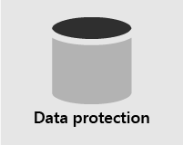

# 보안 개요

> [!VIDEO https://www.microsoft.com/videoplayer/embed/RE4mzxI?autoplay=false]

Microsoft 365 Business Premium 위협 방지, 데이터 보호 및 장치 관리 기능을 제공하면 온라인 위협 및 무단 액세스로부터 회사를 보호하고 휴대폰, 태블릿 및 컴퓨터에서 회사 데이터를 보호하고 관리할 수 있습니다.

| [위협 방지](#threat-protection)|  [데이터 보호](#data-protection) |   [장치 관리](#device-management) |
|--|--|--|

## 위협 방지

Microsoft 365 Business Premium 맬웨어, Office 365 유해한 링크 등으로부터 보호하는 클라우드 기반 전자 메일 필터링 서비스인 [ATP(Advanced Threat Protection)가](safe-links.md)포함되어 있습니다. ATP 금고 링크는 전자 메일 또는 문서의 악의적인 URL로부터 Office 보호합니다. ATP 금고 첨부 파일을 사용하면 메시지나 문서에 첨부된 맬웨어 및 바이러스로부터 보호할 수 있습니다.

[MFA(다단계 인증)](turn-on-mfa.md)또는 2단계 인증을 사용하려면 리소스에 액세스하기 전에 ID를 확인하기 위해 인증 코드와 같은 두 번째 인증 형식을 제시해야 합니다.

[Windows Defender,](/windows/security/threat-protection/overview-of-threat-mitigations-in-windows-10) 맬웨어, 스파이웨어 및 기타 위협으로부터 시스템, 파일 및 온라인 활동을 포괄적으로 보호합니다.

## 데이터 보호

데이터 보호 기능을 Microsoft 365 Business Premium 중요한 데이터를 안전하게 보호하고 권한이 있는 사용자만 데이터에 액세스할 수 있도록 합니다.

[DLP(데이터](set-up-dlp.md) 손실 방지) 정책을 사용하여 실수로 공유되지 않는 주민등용번호 또는 신용 카드 번호와 같은 중요한 정보를 식별하고 관리할 수 있습니다.

[Office 365 메시지 암호화](/microsoft-365/compliance/ome) 암호화 및 액세스 권한 기능을 결합하여 받는 사람만 메시지 콘텐츠를 볼 수 있도록 합니다. Office 365 메시지 암호화.com, yahoo!Outlook Gmail 및 기타 전자 메일 서비스와 함께 작동합니다.

[Exchange Online Archiving](/office365/servicedescriptions/exchange-online-archiving-service-description/exchange-online-archiving-service-description) Microsoft Exchange 및 데이터 중복을 Exchange Online 고급 보관 기능을 제공하는 클라우드 기반 보관 솔루션입니다. 보존 정책을 사용하여 조직에서 전자 메일 및 기타 통신과 관련된 부담을 줄일 수 있습니다. 회사에서 소송과 관련된 통신을 보존해야 하는 경우 소송 보존 및 소송 보존을 사용하여 In-Place 전자 메일을 보존할 수 있습니다.

## 장치 관리

Microsoft 365 Business Premium 관리 기능을 사용하면 사용자가 등록된 디바이스로 할 수 있는 작업을 모니터링하고 제어할 수 있습니다. 이러한 기능에는 조건부 액세스, [MDM(모바일 장치 관리),](/microsoft-365/admin/basic-mobility-security/manage-enrolled-devices)BitLocker 및 자동 업데이트가 포함됩니다.

조건부 액세스 정책을 사용하여 특정 사용자 및 작업에 대한 추가 보안 조치를 요구할 수 있습니다. 예를 들어 [MFA(다단계](/microsoft-365/business-video/turn-on-mfa) 인증)를 요구하거나 조건부 액세스를 지원하지 않는 클라이언트를 차단할 수 있습니다.

MDM을 사용하면 iPhone, iPad, Androids 및 휴대폰과 같은 사용자의 모바일 장치를 보호하고 Windows 있습니다. 장치 보안 정책을 만들고 관리하고, 원격으로 장치를 초기화하여 모든 회사 데이터를 제거하고, 장치를 공장 설정으로 초기화하고, 자세한 장치 보고서를 볼 수 있습니다.

BitLocker 암호화를 사용하도록 설정하여 디바이스를 분실하거나 도난당한 경우 데이터를 보호하고, Windows Exploit Guard를 사용하도록 설정하여 랜섬웨어에 대한 고급 보호 기능을 제공할 수 있습니다.

모든 사용자 장치에 최신 보안 기능 및 업데이트가 적용될 수 있도록 자동 업데이트를 구성할 수 있습니다.

## 권장 보안 지침

Microsoft Business Premium이 있는 경우 보안을 설정하고 안전하게 공동 작업을 시작하는 가장 빠른 방법은 [소규모 기업 및 캠페인을 위한 Microsoft 365](../campaigns/index.md) 라이브러리의 지침을 따르는 것입니다. 이 지침은 Microsoft Defending Democracy 팀과 협력하여 정교한 해커가 시작한 사이버 위협으로부터 모든 중소기업 고객을 보호하기 위해 개발되었습니다.
