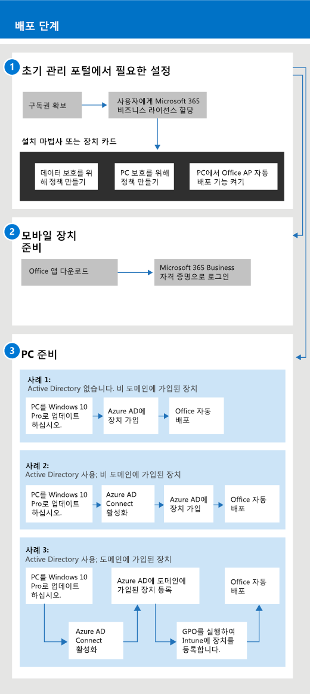

# Microsoft 365 Business 시작Get started with Microsoft 365 Business

## Microsoft 365 Business란What is Microsoft 365 Business

Microsoft 365 Business는 항상 최신 상태를 유지 하는 Outlook, Word, Excel 및 기타 Office 제품과 같은 광범위 한 비즈니스 생산성 및 공동 작업 도구입니다.Microsoft 365 Business is a comprehensive set of business productivity and collaboration tools, such as Outlook, Word, Excel, and other Office products, that are always up to date. 관리 작업을 간단 하 게 수행할 수 있는 엔터프라이즈급 보안을 사용 하 여 모든 iOS, Android 및 Windows 10 장치에서 회사 파일을 보호 합니다.You can protect your work files on all your iOS, Android, and Windows 10 devices with enterprise-grade security that is simple to manage.
  
Microsoft 365 Business는 최대 300의 라이선스를 의미 합니다.Microsoft 365 Business is meant for up to 300 licenses. 라이선스가 더 필요한 경우 자세한 내용은 [Microsoft 365 Enterprise](https://go.microsoft.com/fwlink/p/?linkid=860986) 설명서를 참조 하세요.If you need more licenses, see [Microsoft 365 Enterprise](https://go.microsoft.com/fwlink/p/?linkid=860986) documentation for more information. 
  
## Microsoft 365 Business 받기Get Microsoft 365 Business

- 파트너가 있는 경우 microsoft 365 Business: microsoft [파트너 센터에서 microsoft 365 business](get-microsoft-365-business.md)를 받을 수 있습니다.If you have a partner, they'll get Microsoft 365 Business: [Get Microsoft 365 Business from Microsoft Partner Center](get-microsoft-365-business.md).
    
- 파트너가 없는데 Microsoft 365 Business를 받으려면 [여기에서 구매](https://www.microsoft.com/microsoft-365/business)할 수 있습니다.If you don't have a partner and want to get Microsoft 365 Business, you can [buy it here](https://www.microsoft.com/microsoft-365/business).
    
## Microsoft 365 Business 설정Set up Microsoft 365 Business

 **Microsoft 365 Business 제품군 설정 개요****Overview of Microsoft 365 Business Suite set up**
  
다음 다이어그램에서는 관리자가 Microsoft 365 Business를 설정 하는 방법을 설명 합니다.The following diagram describes how admins set up Microsoft 365 Business. 또한 Microsoft 365 Business를 위해 Windows PC를 준비하는 단계를 설명합니다.It also describes the steps to prepare Windows PCs for Microsoft 365 Business. [Windows AutoPilot](add-autopilot-devices-and-profile.md)를 사용 하 여 Microsoft 365 Business 관리 센터에서 새 장치를 추가할 수도 있습니다.You can also add new devices in the Microsoft 365 Business admin center with [Windows AutoPilot](add-autopilot-devices-and-profile.md). AutoPilot을 사용 하 여 새 장치를 설정 하 고 사전 구성 하 여 사용자가 Microsoft 365 Business 자격 증명으로 로그인 하는 즉시 생산적으로 사용할 준비가 되도록 할 수 있습니다.You can use AutoPilot to set up and pre-configure new devices so that they're ready for productive use as soon as a user signs in with their Microsoft 365 Business credentials.
  

  
### 1: Microsoft 365 Business 설정(관리자)1: Set up Microsoft 365 Business (Admin)

전역 관리자 자격 증명을 사용 하 여 [microsoft 365 business 관리 센터](https://portal.office.com/adminportal/home) 에 로그인 하 고 다음 단계를 완료 하 여 Microsoft 365 Business를 설정 합니다.Sign in to [Microsoft 365 Business admin center](https://portal.office.com/adminportal/home) with your global admin credentials, and complete the following steps to set up Microsoft 365 Business. 
  
1. [Microsoft 365 Business를 사용 하 여 장치의 데이터를 보호 하기 위한 필수 구성 요소Prerequisites for protecting data on devices with Microsoft 365 Business](pre-requisites-for-data-protection.md)
    
    먼저 필수 구성 요소를 읽고 장치가 Microsoft 365 Business를 사용할 준비가 되었는지 확인 합니다.Read the prerequisites first to make sure that your devices are ready for Microsoft 365 Business.
    
2. [설치 마법사를 사용 하 여 Microsoft 365 Business 설정Use the setup wizard to set up Microsoft 365 Business](set-up.md)
    
    **로컬 Active Directory에서 클라우드로 영구적으로 이동**하는 경우 Microsoft 365 Business 관리 센터로 이동 하 여 설치 마법사를 사용 하 여 사용자를 수동으로 추가 하거나 Azure AD Connect를 사용 하 여 일회성 동기화를 수행할 수 있습니다.If you're **permanently moving from a local Active Directory to the cloud**, you can go to the Microsoft 365 Business admin center and use the setup wizard to add your users manually, or you can do a one-time sync with Azure AD Connect. 이 작업은 다음 두 가지 방법으로 수행할 수 있습니다.There are two ways to do this: 
    
    - Exchange 2010, Exchange 2013 또는 Exchange 2016 server도 있는 경우 최소 하이브리드를 사용 하 여 [exchange 사서함을 Office 365로 빠르게 마이그레이션할](https://support.office.com/article/fdecceed-0702-4af3-85be-f2a0013937ef)수 있습니다.If you also have an Exchange 2010, Exchange 2013, or Exchange 2016 server, you can [Use Minimal Hybrid to quickly migrate Exchange mailboxes to Office 365](https://support.office.com/article/fdecceed-0702-4af3-85be-f2a0013937ef). 최소 하이브리드 단계에는 Azure AD에 대 한 사용자 동기화 및 온-프레미스에서 클라우드로의 전자 메일 마이그레이션 등이 포함 됩니다.The minimal hybrid steps include a one-time sync of users to Azure AD, and email migration from on-premises to the cloud. 전자 메일 마이그레이션이 완료 되 면이 방법을 사용할 때 디렉터리 동기화가 자동으로 해제 됩니다.After the email migration is complete, the directory synchronization is automatically turned off when you use this method.
    
    - Office 365 디렉터리 동기화 마법사를 사용 하 여 사용자를 클라우드와 동기화 합니다.Use the Office 365 directory sync wizard to synchronize your users to the cloud. [Office 365에서 디렉터리 동기화 설정](https://support.office.com/article/1b3b5318-6977-42ed-b5c7-96fa74b08846)의 단계를 따라 이 프로세스를 완료합니다.Follow the steps in [Set up directory synchronization for Office 365](https://support.office.com/article/1b3b5318-6977-42ed-b5c7-96fa74b08846) to complete this process. 사용자를 클라우드에 동기화 한 후 [에는 Office 365에 대 한 디렉터리 동기화를 해제](https://support.office.com/article/ee5f861e-bd48-4267-83d1-a4ead4b4a00d)해야 합니다.After you synchronize your users to the cloud, you'll have to [Turn off directory synchronization for Office 365](https://support.office.com/article/ee5f861e-bd48-4267-83d1-a4ead4b4a00d).
    
    또한이 방식으로 추가 된 각 사용자에 게 Microsoft 365 Business에 대 한 라이선스를 제공 해야 합니다.You'll also have to give each user that was added this way a license to Microsoft 365 Business. [설치 마법사](set-up.md) 에서이 작업을 수행 하거나 [비즈니스용 Office 365에서 사용자에 게 라이선스를 할당할](https://support.office.com/article/997596B5-4173-4627-B915-36ABAC6786DC)수 있습니다.You can do this in the [setup wizard](set-up.md) or you can [Assign licenses to users in Office 365 for business](https://support.office.com/article/997596B5-4173-4627-B915-36ABAC6786DC).
    
### 2: 모바일 장치 준비2: Prepare mobile devices

[Microsoft 365 business 사용자를 위한 모바일 장치 설정](set-up-mobile-devices.md) 의 단계에 따라 장치에 Office 앱을 설치 하 고 Microsoft 365 Business에 의해 보호 되 고 있는지 확인 합니다.Follow the steps in [Set up mobile devices for Microsoft 365 Business users](set-up-mobile-devices.md) to install Office apps on devices and make sure they're protected by Microsoft 365 Business. 
  
### 3: PC 준비3: Prepare PCs

관리자는 [Windows AutoPilot](add-autopilot-devices-and-profile.md)을 사용 하 여 새 Windows 10 pc에 대 한 설정을 미리 선택할 수 있습니다.Admins can pre-select settings for new Windows 10 PCs by using [Windows AutoPilot](add-autopilot-devices-and-profile.md). 사용자는이 항목의 단계를 수행 하 여 기존 또는 새 Windows 10 장치를 설정할 수 있으며 [Microsoft 365 비즈니스 사용자를 위해 Windows pc를 설정](set-up-windows-devices.md)합니다.Users can set up their existing or new Windows 10 devices by following the steps in this topic: [Set up Windows PCs for Microsoft 365 Business users](set-up-windows-devices.md). 기존 장치의 경우 사용자가 **선택적** 으로 [파일을 비즈니스용 OneDrive로 이동할](move-files-to-onedrive.md)수 있습니다.For existing devices, users can **optionally** [move files to OneDrive for Business](move-files-to-onedrive.md). 타사 도구를 사용 하 여 Windows 프로필에 연결 된 파일을 OneDrive로 이동할 수도 있습니다.They can also use third-party tools to move files associated with Windows profile to OneDrive.
  
조직에서 Windows Server Active Directory 온-프레미스를 사용 하는 경우에는 Microsoft 365 Business를 설정 하 여 Windows 10 장치를 보호 하 되, 로컬 인증을 필요로 하는 온-프레미스 리소스에 대 한 액세스를 계속 유지할 수 있습니다.If your organization uses Windows Server Active Directory on-premises, you can set up Microsoft 365 Business to protect your Windows 10 devices, while still maintaining access to on-premises resources that require local authentication. 이를 설정 하려면 [도메인에 가입 된 Windows 10 장치를 Microsoft 365 Business에서 관리할 수 있도록 설정](manage-windows-devices.md) 의 단계를 수행 합니다.Follow the steps in [Enable domain-joined Windows 10 devices to be managed by Microsoft 365 Business](manage-windows-devices.md) to set this up. 이 방법을 사용할 수 있으며이 상태에 있는 장치를 **하이브리드 AZURE AD 가입 장치**라고 합니다.This method is preferred, and devices in this state are called **Hybrid Azure AD joined devices**. 
  
일부 온-프레미스 리소스가 포함 된 로컬 Active Directory (예: 파일 공유 및 프린터)를 유지 하는 경우 **azure ad 조인** 장치에서 [Microsoft 365 BUSINESS의 azure ad 조인 장치 로부터 온-프레미스 리소스에 액세스](access-resources.md)하 여 이러한 리소스에 액세스할 수 있습니다.If you retain a local Active Directory that contains some on-premises resources (such as file shares and printers), you can give your **Azure AD-joined devices** access to these resources by following the steps here: [Access on-premises resources from an Azure AD-joined device in Microsoft 365 Business](access-resources.md).
  
Windows 10 PC를 설정한 후 장치에 [Office를 자동으로 설치](auto-install-or-uninstall-office.md)할 수 있습니다.After you have set up Windows 10 PCs, you can [automatically install Office](auto-install-or-uninstall-office.md) to the devices. 
  
## 지원 센터 문의Contact support

 **지원 센터에 문의해야 하는 경우:****If you need to contact support:**
  
- 파트너에게 문의합니다.Contact your partner.
    
- Microsoft 365 비즈니스 관리자는 고객 지원 팀에 액세스할 수 있습니다. \*\* [비즈니스 제품에 대 한 지원 문의-관리자 도움말](https://support.office.com/article/32a17ca7-6fa0-4870-8a8d-e25ba4ccfd4b)\*\*As a Microsoft 365 Business admin, you have access to our customer support team: **[Contact support for business products - Admin Help](https://support.office.com/article/32a17ca7-6fa0-4870-8a8d-e25ba4ccfd4b)**
    
## 관련 항목Related topics
[Microsoft 365 Business 문서 및 리소스Microsoft 365 Business documentation and resources](https://go.microsoft.com/fwlink/p/?linkid=853701)
  
Microsoft[365 business로](migrate-to-microsoft-365-business.md) 의 Microsoft [365 business 마이그레이션 관리](manage.md)[Manage Microsoft 365 Business](manage.md)[Migrate to Microsoft 365 Business](migrate-to-microsoft-365-business.md)
  

