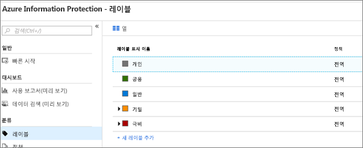
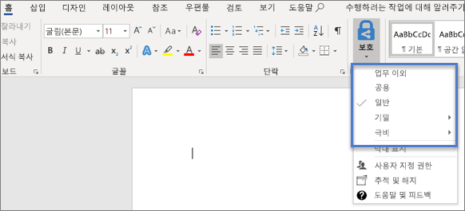

# Microsoft 365 Business 보안 기능Microsoft 365 Business security features

Microsoft 365 Business는 PC, 휴대폰 및 태블릿의 데이터를 보호하기 간편한 보안 기능을 제공합니다.Microsoft 365 Business offers simplified security features to help safeguard your data on PCs, phones, and tablets.
    
## Microsoft 365 Business 관리 센터 보안 기능Microsoft 365 Business admin center security features

관리 센터에서 다양한 Microsoft 365 Business 보안 기능을 간편하게 설정 또는 해제하면서 편리하게 관리할 수 있습니다. 관리 센터에서는 다음을 수행할 수 있습니다.You can manage many of the Microsoft 365 Business security features in the admin center, which gives you a simplified way to turn these features on or off. In the admin center you can do the following:
  

  
- [Android 또는 iOS 디바이스에 대한 애플리케이션 관리 설정 지정](app-protection-settings-for-android-and-ios.md).[Set app protection settings for Android or iOS devices](app-protection-settings-for-android-and-ios.md) 
    
    이러한 설정을 통해 지정된 기간 후에 비활성 상태인 디바이스에서 파일을 삭제하고, 작업 파일을 암호화하고, 사용자가 PIN 등을 설정하도록 요구할 수 있습니다.These settings include deleting files from an inactive device after a set period, encrypting work files, requiring that users set a PIN, etc.
    
- [Windows 10 디바이스의 애플리케이션 설정 지정Set application protection settings for Windows 10 devices](protection-settings-for-windows-10-devices.md) 
    
    이러한 설정은 회사 소유 또는 개인 소유의 디바이스에 있는 회사 데이터에 적용될 수 있습니다.These settings can be applied to company data on both company-owned, or personally-owned devices.
    
- [Windows 10 디바이스의 디바이스 보호 설정 지정](protection-settings-for-windows-10-pcs.md).[Set device protection settings for Windows 10 devices](protection-settings-for-windows-10-pcs.md) 
    
    [BitLocker](https://go.microsoft.com/fwlink/p/?linkid=871405) 암호화를 사용하도록 설정하여 디바이스를 분실하거나 도난당한 경우 데이터를 보호하고, [Windows Exploit Guard](https://go.microsoft.com/fwlink/p/?linkid=871404)를 사용하도록 설정하여 랜섬웨어에 대한 고급 보호 기능을 제공할 수 있습니다.You can enable [BitLocker](https://go.microsoft.com/fwlink/p/?linkid=871405) encryption to help protect data in case a device is lost or stolen, and enable [Windows Exploit Guard](https://go.microsoft.com/fwlink/p/?linkid=871404) to provide advanced protection against ransomware. 
    
- [디바이스에서 회사 데이터 제거Remove company data from devices](remove-company-data.md)
    
    디바이스를 분실하거나 도난당한 경우 또는 직원이 퇴사하는 경우 회사 데이터를 원격으로 지울 수 있습니다.You can remotely wipe company data if a device is lost, stolen, or an employee leaves your company.
    
- [Windows 10 디바이스를 공장 설정으로 다시 설정](reset-devices-to-factory-settings.md).Reset Windows 10 devices to their factory settings 
    
    디바이스 보호가 설정된 Windows 10 디바이스를 다시 설정할 수 있습니다.You can reset any Windows 10 devices that have device protection settings applied to them.
    
## 추가 보안 기능Additional security features 

Microsoft 365 Business의 고급 기능을 사용하여 사이버 위협으로부터 비즈니스를 보호하고 중요한 정보를 보호할 수 있습니다.Advanced features in Microsoft 365 Business are available to help you protect your business against cyber-threats and safeguard sensitive information.
  
- **[Office 365 고급 위협 방지](https://support.office.com/article/e100fe7c-f2a1-4b7d-9e08-622330b83653)****[Office 365 Advanced Threat Protection](https://support.office.com/article/e100fe7c-f2a1-4b7d-9e08-622330b83653)**
    
    ATP(Advanced Threat Protection)는 직원이나 고객 정보를 손상시키도록 설계된 정교한 피싱 및 랜섬웨어 공격으로부터 비즈니스를 보호할 수 있도록 합니다.기능은 다음과 같습니다.Advanced Threat Protection (ATP) helps guard your business against sophisticated phishing and ransomware attacks designed to compromise employee or customer information. Features include:
    
  - 위험한 메시지를 감지하고 삭제하기 위한 정교한 첨부 파일 검색 및 AI 기반 분석Sophisticated attachment scanning and AI-powered analysis to detect and discard dangerous messages.
    
  - 전자 메일의 웹 링크를 자동으로 검사하여 피싱 수법에 속하는지 여부를 평가합니다. 이를 통해 안전하지 않은 웹 사이트에 액세스하는 경우를 방지할 수 있습니다.Automatic checks of web links in email to assess if they are part of a phishing scheme. This keeps you safe from accessing unsafe websites.
    
- **[데이터 손실 방지 정책 개요](https://support.office.com/article/1966b2a7-d1e2-4d92-ab61-42efbb137f5e)**(DLP)[Overview of data loss prevention policies](https://support.office.com/article/1966b2a7-d1e2-4d92-ab61-42efbb137f5e) 
    
    신용 카드 번호, 주민 등록 번호 등의 중요한 정보를 자동으로 감지하도록 DLP를 설정하여 회사 외부에서 함부로 공유하는 일을 방지할 수 있습니다.You can set up DLP to automatically detect sensitive information, like credit card numbers, social security numbers, etc. to prevent their inadvertent sharing outside your company.
    
- **[Exchange Online Archiving](https://products.office.com/exchange/microsoft-exchange-online-archiving-email)****[Exchange Online Archiving](https://products.office.com/exchange/microsoft-exchange-online-archiving-email)**
    
    Exchange Online Archiving 라이선스가 있으면 연속 데이터 백업을 사용하여 메시지를 쉽게 보관할 수 있습니다. 이 기능은 나중에 검색 또는 복원에 필요한 경우에 대비하여 삭제한 항목을 포함하는 모든 사용자 전자 메일을 저장합니다. 또한 소송 보존, eDiscovery을 위해 전자 메일 데이터를 보존하거나 규정 준수 요구 사항을 충족할 수 있습니다.Exchange Online Archiving license enables messages to be easily archived with continuous data backup. It stores all of a user's emails, including deleted items, in case they are needed later for discovery or restoration. Additionally, you can use different retention policies to preserve email data for litigation holds, eDiscovery, or to meet compliance requirements.
    
- **[Azure Information Protection](https://go.microsoft.com/fwlink/p/?linkid=871406)****[Azure Information Protection](https://go.microsoft.com/fwlink/p/?linkid=871406)**
    
    정보 보호는 사용하면 “전달 금지” 및 “복사 금지”와 같은 컨트롤을 사용하여 전자 메일 및 문서에 포함된 중요한 정보에 대한 액세스를 제어할 수 있습니다. 또한 중요한 정보를 “기밀”로 분류하고 분류된 정보를 회사 외부 및 내부에서 공유하는 방법을 지정할 수도 있습니다. 엔터프라이즈 수준의 암호화를 전자 메일 및 문서에 쉽게 적용하여 사용자의 정보를 비공개로 유지할 수 있습니다. Microsoft 365 Business에는 [Azure Information Protection 플랜 1](https://go.microsoft.com/fwlink/p/?linkid=871407)의 모든 기능이 포함되어 있습니다. Office 앱용 Azure Information Protection 클라이언트 추가 기능을 설치할 수도 있습니다. 자세한 내용은 [Azure Information Protection 클라이언트 관리자 가이드](https://docs.microsoft.com/azure/information-protection/rms-client/client-admin-guide)를 참조하세요.Information protection helps you control access to sensitive information in email and documents with controls like "Do not forward" and "Do not copy." You can also classify sensitive information as "Confidential" and specify how classified information can be shared outside and inside the business. Enterprise-grade encryption is easy to apply to email and documents to keep your information private. Microsoft 365 Business includes all the features of [Azure Information Protection Plan 1](https://go.microsoft.com/fwlink/p/?linkid=871407). You can also install the Azure Information Protection client add-in for Office apps. For more details, see [Azure Information Protection client admininstrator guide](https://docs.microsoft.com/azure/information-protection/rms-client/client-admin-guide).
    
- **[Azure Portal의 Intune 전체 기능](https://go.microsoft.com/fwlink/p/?linkid=871403)****[The full capabilities of Intune in the Azure portal](https://go.microsoft.com/fwlink/p/?linkid=871403)**
    
    Azure Portal에서 Intune 관리 센터에 액세스하여 Microsoft 365 Business 관리 센터를 통해 사용할 수 없는 Windows용 고급 디바이스 관리와 함께 MacOS 디바이스, iPhone 및 Android 디바이스 관리와 같은 추가 보안 기능을 설정할 수 있습니다.Accessing the Intune admin center in the Azure portal allows you to set up additional security features, such as the management of MacOS devices, iPhone, and Android devices along with advanced device management for Windows, that are not available through Microsoft 365 Business admin center.
    
다음 섹션에서는 보안 및 준수 센터 및 Intune 관리 센터에서 이러한 기능을 관리하는 방법을 설명합니다. 이후에 Microsoft 365 Business 관리 센터에 간소화된 컨트롤이 추가될 예정입니다.The next sections describe how you can manage these features in the Security &amp; Compliance center and the Intune admin center. Over time the simplified controls will be added to the Microsoft 365 Business admin center.
  
## Advanced Threat Protection 기능 설정Set up Advanced Threat Protection features

- **안전하지 않은 첨부 파일로부터 보호:** ATP는 전자 메일 첨부 파일을 가상 환경에서 열고 결과 동작을 분석하여 악의적인 콘텐츠를 식별합니다. 콘텐츠를 평가하여 의도(정상 또는 악성)를 파악하며, ATP에서 안전하지 않은 첨부 파일 배달이 차단되므로 피싱 체계 및 랜섬웨어 감염으로부터 보호할 수 있습니다. 첨부 파일 보호 기능을 활성화하려면 [Office 365 ATP 안전 첨부 파일 정책 설정](https://support.office.com/article/078eb946-819a-4e13-8673-fe0c0ad3a775)을 참조하세요.**Protect against unsafe attachments:** ATP identifies malicious content by opening email attachments in a virtual environment and performing analysis of the resulting behavior. The content is evaluated to determine its intent (whether normal or malicious), and ATP blocks delivery of unsafe attachments, helping protect you against phishing schemes and ransomware infections. To activate attachment protection, see [Set up Office 365 ATP Safe Attachments policies](https://support.office.com/article/078eb946-819a-4e13-8673-fe0c0ad3a775).
    
- 사용자가 악의적인 링크를 클릭할 때 사용자 환경 보호: ATP는 사용자가 전자 메일의 링크를 클릭할 때 링크를 검사합니다. 링크가 안전하지 않으면 사이트를 방문하지 않도록 경고하거나 사이트가 차단되었다는 알림이 제공됩니다. 이를 통해 피싱 수법으로부터 보호할 수 있습니다. [Office 365 ATP 안전 링크 정책을 설정](https://support.office.com/article/bdd5372d-775e-4442-9c1b-609627b94b5d#reveddefaultscc)하거나 [Office 365 ATP 안전 링크 정책을 설정](https://support.office.com/article/bdd5372d-775e-4442-9c1b-609627b94b5d#addemailpolscc)할 수 있습니다.Protect your environment when users click malicious links: ATP also examines links in email at the time a user clicks them. If a link is unsafe, the user is warned not to visit the site or informed that the site has been blocked. This helps protect against phishing schemes. You can [Set up Office 365 ATP Safe Links policies](https://support.office.com/article/bdd5372d-775e-4442-9c1b-609627b94b5d#reveddefaultscc) or [Set up Office 365 ATP Safe Links policies](https://support.office.com/article/bdd5372d-775e-4442-9c1b-609627b94b5d#addemailpolscc).
    
## DLP 기능 설정Set up DLP

PII(개인 식별 정보)를 보호하도록 정책을 설정하는 방법의 예제를 보려면 [템플릿에서 DLP 정책 만들기](https://support.office.com/article/59414438-99f5-488b-975c-5023f2254369)를 참조하세요.See [Create a DLP policy from a template](https://support.office.com/article/59414438-99f5-488b-975c-5023f2254369) for an example on how to set up a policy to protect against personally identifiable information (PII). 
  
DLP는 사용 준비가 완료된 여러 다른 로캘용 정책 템플릿을 제공합니다. 예를 들어, 오스트레일리아 재무 데이터, 캐나다 개인 정보 보호법, 미국 재무 데이터 등이 있습니다. 전체 목록을 보려면 [DLP 정책 템플릿에 포함되는 내용](https://support.office.com/article/c2e588d3-8f4f-4937-a286-8c399f28953a)을 참조하세요. 이러한 모든 템플릿은 PII 템플릿 예제와 비슷한 방식으로 사용하도록 설정할 수 있습니다.DLP comes with many ready-to-use policy templates for many different locales. For example, Australia Financial Data, Canada Personal Information Act, U.S. Financial Data, etc. See [What the DLP policy templates include](https://support.office.com/article/c2e588d3-8f4f-4937-a286-8c399f28953a) for a full list. All of these templates can be enabled similar to the PII template example. 
  
## Exchange Online Archiving을 사용하여 전자 메일 보존 설정Set up email retention with Exchange Online Archiving

 **Exchange Online Archiving** 라이선스 기능을 사용하면 eDiscovery 목적에 맞게 전자 메일 콘텐츠를 보존하여 규정 준수 및 규정 표준을 유지 관리할 수 있습니다. 그뿐 아니라 소송이 발생할 경우 위험 요소를 줄일 수 있으며 보안 위반 이후나 삭제한 항목을 복구해야 할 경우에 복구하는 방법도 제공됩니다. 이러한 기능을 활성화하려면 소송 보존을 사용하여 모든 사용자의 콘텐츠를 보존하거나 보다 나은 사용자 지정을 위해 보존 정책을 사용할 수 있습니다.**Exchange Online Archiving** license features give you the ability to help maintain compliance and regulatory standards by preserving email content for the purposes of eDiscovery. It also helps reduce your risk in the event of litigation and provides a way to recover data after a security breach or when you need to recover deleted items. To activate these capabilities, you can use litigation hold to preserve all of a user's content, or use retention policies for greater customization. 
  
**소송 보존:** 사용자의 전체 사서함에 소송 보존을 적용하여 삭제한 항목을 포함하는 모든 사서함 콘텐츠를 보존할 수 있습니다.**Litigation hold:** You can preserve all mailbox content including deleted items by putting a user's entire mailbox on litigation hold. 
    
사서함에 소송 보존을 적용하려면 관리 센터에서 다음을 수행합니다.To place a mailbox on litigation hold, in the Admin center:
    
1. 왼쪽 탐색 영역에서 **사용자** \> **활성 사용자**로 이동합니다.In the left nav, go to **Users** \> **Active users**.
    
2. 해당 사서함에 소송 보존을 적용하려는 사용자를 선택하고 사용자 창에서 **메일 설정**을 확장하고 **기타 설정** 옆에 있는 **Exchange 속성 편집**을 선택합니다.Select a user whose mailbox you want to place on litigation hold and in the user pane expand **Mail settings** and next to **More settings** choose **Edit Exchange properties**.
    
3. 사용자의 사서함 페이지에서 왼쪽 탐색 영역의 \*\* 사서함 기능\*\*을 선택하고 **소송 보존** 아래의 **사용** 링크를 선택합니다.On the mailbox page for the user, choose \*\* mailbox features \*\* on the left nav, and then choose the **Enable** link under **Litigation hold**.
    
4. **소송 보존** 대화 상자의 **소송 보존 기간** 필드에서 소송 보존 기간을 지정할 수 있습니다. 무한 보존을 적용하려면 이 필드를 비워 둡니다. 메모를 추가하여 사서함 소유자에게 소송 보존 \>에 대해 추가로 설명해야 하는 웹 사이트를 알려주고 **저장**을 선택합니다.In the **litigation hold** dialog box you can specify the litigation hold duration in the **Litigation hold duration** field, leave field empty if you want to place an infinite hold. You can also add notes and direct the mail box owner to a website you might have to explain more about the litigation hold \> **Save**.
    
**보존:** 특정 기간 동안 보존하거나 보존 기간이 끝나면 영구적으로 콘텐츠를 삭제하는 것과 같은 사용자 지정된 보존 정책을 사용하도록 설정할 수 있습니다. 자세한 내용은 [보존 정책 개요](https://support.office.com/article/5e377752-700d-4870-9b6d-12bfc12d2423)를 참조하세요.**Retention:** You can enable customized retention policies, for example, to preserve for a specific amount of time or delete content permanently at the end of the retention period. To learn more, see [Overview of retention policies](https://support.office.com/article/5e377752-700d-4870-9b6d-12bfc12d2423).
## Azure Information Protection 기능 설정Set up Azure Information Protection features

AIP(Azure Information Protection)는 조직에서 레이블을 적용하여 해당 문서 및 전자 메일을 분류하고 필요에 따라 보호할 수 있도록 하는 클라우드 기반 솔루션입니다. 이러한 레이블은 규칙 및 조건을 정의하는 관리자가 자동으로 적용하거나, 사용자가 수동으로 적용하거나, 사용자에게 권장 사항을 제공하는 상황에서 두 가지 방법을 조합하여 적용할 수 있습니다.Azure Information Protection (AIP) is a cloud-based solution that helps an organization to classify and optionally, protect its documents and emails by applying labels. Labels can be applied automatically by administrators who define rules and conditions, manually by users, or a combination where users are given recommendations.

웹용 Outlook에서 전자 메일을 보낼 경우 모든 사용자가 다음과 같은 제한을 적용할 수 있게 자동으로 설정됩니다.The ability to apply the following restrictions when sending emails in Outlook on the web is automatically enabled for all users:
  
- **전달 금지**: 받는 사람은 메시지를 읽을 수 있지만 콘텐츠를 전달, 인쇄 또는 복사할 수 없습니다**Do Not Forward**: Recipients can read the message, but they can't forward, print, or copy content
    
- **암호화**: 전체 메시지가 암호화됩니다. 받는 사람은 암호화된 콘텐츠에 액세스하기 전에 추가 단계를 수행하여 해당 ID를 확인해야 하며 암호화를 제거할 수 없습니다.**Encrypt**: The entire message is encrypted. Recipients must take extra steps to confirm their identity before accessing encrypted content and can't remove encryption.
    
- **기밀**: 조직의 직원들에게 전자 메일 콘텐츠 및 첨부 파일에 대한 모든 권한을 부여하지만, 조직 외부의 사람에게는 이러한 권한을 부여하지 않습니다. 데이터 소유자는 언제든지 콘텐츠를 추적하고 취소할 수 있습니다.**Confidential**: Gives the employees in your organization full permissions to the email content and attachments, but not to people outside your organization. Data owners can track and revoke content at any point.
    
- **극비**: 이 제한은 극비 데이터에 적용할 수 있으며, 직원들이 데이터를 보고, 편집하고, 회신할 수 있지만 전달, 인쇄 또는 복사할 수는 없도록 합니다. 데이터 소유자는 언제든지 콘텐츠를 추적하고 취소할 수 있습니다.**Highly Confidential**: This restriction can be applied to highly confidential data, allowing employees to view, edit, and reply, but not forward, print, or copy the data. Data owners can track and revoke content at any point.

### Azure Information Protection이 활성화되어 있는지 확인Make sure Azure Information Protection is activated

AIP가 활성화되었는지 확인하려면To verify that AIP is activated :

1. [Azure Active Directory 관리 센터](https://portal.azure.com/)에 로그인합니다.Sign into [Azure Active Directory admin center](https://portal.azure.com/).

    관리 센터의 왼쪽 탐색 영역에서 **관리 센터** \> **Azure Active Directory**를 찾아 로그인할 수도 있습니다.You can also sing in by locating **Admin centers** \> **Azure Active Directory** in the left nav in the admin center.

2. **모든 서비스**를 선택하고 **검색 상자**에 *Azure Information Protection*을 입력합니다.Select **All services** and tyoe in *Azure Information Protection* in the **Search Box**.

3. 결과가 표시되면 **Azure Information Protection** 옆에 있는 시작을 클릭하여 즐겨찾기로 지정하고 나중에 쉽게 찾을 수 있습니다.Once the results display, click the start next to **Azure Information Protection** to make it a favorite and easy to find later.

4. **Azure Information Protection** \> **보호 활성화**를 선택하고 상태가 활성화됨으로 설정되어 있는지 확인합니다.Select **Azure Information Protection** \> **Protection activation** and make sure the status is set to activated. 

### Azure Information Protection 정책 및 기본 레이블 보기View the Azure Information Protection policy and default labels 

기존 레이블을 보고 수정하려면To view, and modify, the existing labels:

1. Azure Information Protection 대시보드에서 **분류** \> \*\*레이블을 선택합니다.On the Azure Information Protection dashboard, select **Classifications** \> \*\*Labels.  

2. 옵션을 보려면 아무 레이블이나 선택합니다. 표시 이름, 색 등을 변경할 수 있습니다.You can choose any label to view options, you can change the display name, colors, etc.
 
3. 고유한 레이블을 만들려면 [레이블 수정 및 새로 만들기](https://docs.microsoft.com/azure/information-protection/infoprotect-tutorial-step2)를 참조하세요.See  [Modify and create new labels](https://docs.microsoft.com/azure/information-protection/infoprotect-tutorial-step2) if you want to create your own. 

### 수동으로 Azure Information Protection 클라이언트 설치Install the Azure Information Protection client manually

AIP 클라이언트를 수동으로 설치하려면To manually install the AIP client:

1. [Microsoft 다운로드 센터](https://www.microsoft.com/download/details.aspx?id=53018)에서 **AzInfoProtection.exe**를 다운로드합니다.Download **AzInfoProtection.exe** from [Microsoft download center](https://www.microsoft.com/download/details.aspx?id=53018).
 
2. Word 문서를 보고 **홈** 탭에서 **보호** 옵션을 사용할 수 있는지 확인하여 설치가 제대로 되었는지 확인할 수 있습니다.You can verify that the installation worked by viewing a Word document and making sure that the **Protect** option is available on the **Home** tab.  

자세한 내용은 [클라이언트 설치](https://docs.microsoft.com/azure/information-protection/infoprotect-tutorial-step3)를 참조하세요.For more information see, [Install the client](https://docs.microsoft.com/azure/information-protection/infoprotect-tutorial-step3)
    
## FAQFAQ

 ### 이러한 보안 기능을 모든 지역/국가에서 사용할 수 있나요?Are these security features available in all markets?
  
예. 이러한 기능은 Microsoft 365 Business가 판매되는 모든 지역/국가에서 사용할 수 있습니다.Yes, these features are available in all markets where Microsoft 365 Business is sold.
  
### 보안 및 준수 센터는 어떻게 찾을 수 있나요?How do I find the Security &amp; Compliance center?
  
1. 관리자 자격 증명을 사용하여 [Microsoft 365 Business에 로그인](https://portal.microsoft.com/)합니다.Sign in to [Microsoft 365 Business](https://portal.microsoft.com/) by using your global admin credentials. 
    
2. 왼쪽 탐색 창에서 **관리 센터**를 찾아 확장합니다.In the left nav, locate **Admin centers** and expand it. 
    
    
  
3. **보안 및 준수**를 선택하여 보안 및 준수 센터로 이동합니다.Choose **Security &amp; Compliance** to go to Security &amp; compliance center. 
    
 ### Intune 관리 센터는 어떻게 찾을 수 있나요?How do I find the Intune admin center?
  
  
1. 관리자 자격 증명을 사용하여 [Microsoft 365 Business에 로그인](https://portal.microsoft.com/)합니다.Sign in to [Microsoft 365 Business](https://portal.microsoft.com/) by using your global admin credentials. 
    
2. 왼쪽 탐색 창에서 **관리 센터**를 찾아 확장합니다.In the left nav, locate **Admin centers** and expand it. 
    
3. **Intune**을 선택하여 Intune 관리 센터로 이동합니다.Choose **Intune** to go to Intune admin center. 
    

