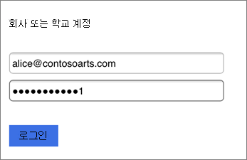

# Microsoft 365 Business 사용자를 위한 모바일 장치 설정

iPhone 또는 Android 휴대폰에서 Office를 설치하려면 탭의 지침을 따르세요. 지침의 단계를 따르면 Office 앱에서 만든 작업 파일이 Microsoft 365 Business에 의해 보호됩니다.

다음은 Outlook에 대한 단계를 보여주는 예제이지만 설치하려는 모든 Office 앱에 적용되는 내용입니다.
  
## 모바일 장치 설정

## [iPhone](#tab/iPhone)
  
Microsoft 365 Business를 사용 하 여 iOS 장치에서 Office 앱을 설정 하는 방법에 대 한 간단한 비디오를 시청 하세요.  

> [!VIDEO https://www.microsoft.com/videoplayer/embed/RWee2n] 

이 비디오가 도움이 된 경우에는 [소규모 비즈니스 및 Microsoft 365를 처음 사용하는 사용자들을 위한 완전한 교육 시리즈](https://support.office.com/article/6ab4bbcd-79cf-4000-a0bd-d42ce4d12816)를 참조하세요.

**App store**로 이동하여 검색 필드에 Microsoft Outlook을 입력합니다.
  

  
구름 아이콘을 탭하여 Outlook을 설치합니다.
  

  
설치가 완료되면 **열기** 단추를 탭하여 Outlook을 연 다음 **시작**을 탭합니다.
  

  
Enter your work email address on the **Add Email Account** screen \> **Add Account**, and then enter your Microsoft 365 Business credentials \> **Sign in**.
  

  
조직이 앱에서 파일을 보호 하는 경우에는 조직에서 이제 앱의 데이터를 보호 하 고 앱을 다시 시작 하 여 계속 사용할 수 있음을 알리는 대화 상자가 표시 됩니다. **확인**을 탭하고 Outlook을 닫습니다. 
  

  
iPhone에서 Outlook을 찾아 다시 시작합니다. 메시지가 표시 되 면 PIN을 입력 하 고 확인 합니다. 이제 iPhone에서 Outlook을 사용할 준비가 되었습니다.
  

  
## [Android](#tab/Android)
  
Android 장치에 Outlook 및 Office를 설치 하는 방법에 대 한 비디오를 시청 하세요.  

> [!VIDEO https://www.microsoft.com/videoplayer/embed/ecc2e9c0-bc7e-4f26-8b14-91d84dbcfef0] 

이 비디오가 도움이 된 경우에는 [소규모 비즈니스 및 Microsoft 365를 처음 사용하는 사용자들을 위한 완전한 교육 시리즈](https://support.office.com/article/6ab4bbcd-79cf-4000-a0bd-d42ce4d12816)를 참조하세요.

Android 휴대폰에서 설치 프로그램을 시작 하려면 Play 스토어로 이동 합니다.
  

  
Google Play 검색 상자에 Microsoft Outlook을 입력 하 고 **설치**를 탭 합니다. 설치가 완료 되 면 **열기**를 누릅니다.
  

  
Outlook 앱에서 **시작**을 탭 하 고 Microsoft 365 Business 전자 메일 계정 \> 추가를 **계속**하 고 조직 자격 증명을 사용 하 여 로그인 합니다.
  

  
Intune 회사 포털 앱 설치를 안내하는 대화 상자에서 **스토어로 이동**을 탭합니다.
  

  
Play 스토어에서 Intune 회사 포털을 설치 합니다.
  

  
Outlook을 다시 열어 PIN을 입력하고 확인합니다. 이제 Outlook 앱을 사용할 준비가 되었습니다.
  

## 참고 항목

[Microsoft 365 Business 교육 비디오](https://support.office.com/article/6ab4bbcd-79cf-4000-a0bd-d42ce4d12816)

---
