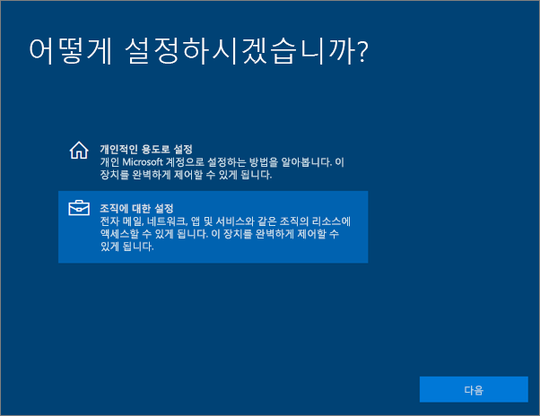
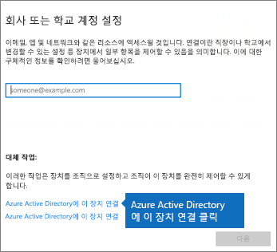
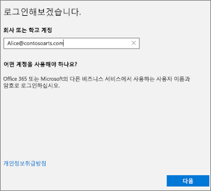
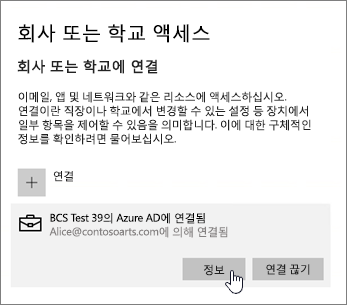
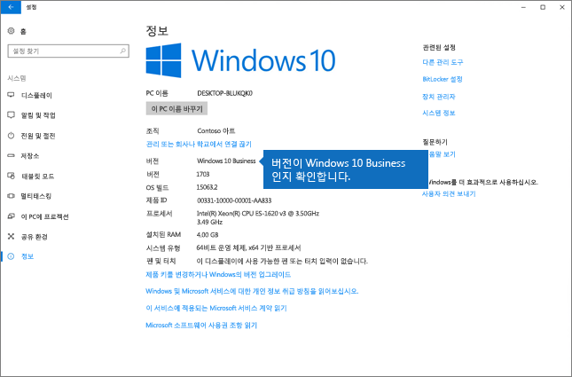

# Microsoft 365 Business 사용자를 위해 Windows 장치 설정

## 필수 구성 요소

Microsoft 365 Business 사용자를 위해 Windows 장치를 설정하기 전에 모든 Windows 장치가 Windows 10 Pro 버전 1703(크리에이터 업데이트)을 사용하고 있는지 확인하세요. Windows 10 Pro를 보완하고 중앙 집중식 관리와 Microsoft 365 Business의 보안 제어를 사용할 수 있는 클라우드 서비스이자 장치 관리 기능인 Windows 10 Business를 배포하려면 Windows 10 Pro가 설치되어 있어야 합니다.
  
Windows 장치에서 Windows 7 Pro, Windows 8 Pro 또는 Windows 8.1 Pro를 실행하는 경우 Microsoft 365 Business 구독을 통해 Windows 10으로 업그레이드할 수 있습니다.
  
Windows 장치를 Windows 10 Pro 크리에이터 업데이트로 업그레이드하는 방법에 대한 자세한 내용은 [Windows Pro 크리에이터 업데이트로 Windows 장치 업그레이드](upgrade-to-windows-pro-creators-update.md)의 단계를 따르세요.
  
[장치가 AZURE AD에 연결 되었는지 확인](#verify-the-device-is-connected-to-azure-ad) 을 참조 하 여 업그레이드가 있는지 확인 하거나 업그레이드가 제대로 수행 되었는지 확인 합니다.

Microsoft 365에 Windows를 연결 하는 방법에 대 한 간단한 비디오를 시청 하세요.  

> [!VIDEO https://www.microsoft.com/videoplayer/embed/RE3yXh3] 

이 비디오를 통해 도움이 되는 경우에는 [소규모 기업을 위한 전체 교육 시리즈 및 Microsoft 365에 새로 소개 하](https://support.office.com/article/6ab4bbcd-79cf-4000-a0bd-d42ce4d12816)고 있습니다.
  
## Windows 10 장치를 조직의 Azure AD에 연결

조직의 모든 Windows 장치가 Windows 10 Pro 크리에이터 업데이트로 업그레이드 되었거나 이미 Windows 10 Pro 작성자 업데이트를 실행 하 고 있는 경우 이러한 장치를 조직의 Azure Active Directory에 연결할 수 있습니다. 장치가 연결 되 면 Microsoft 365 비즈니스 구독의 일부인 Windows 10 Business로 자동으로 업그레이드 됩니다.
  
### 최신 또는 새로 업그레이드된 Windows 10 Pro 장치의 경우

Windows 10 Pro 크리에이터 업데이트를 실행하는 새로운 장치 또는 Windows 10 Pro 크리에이터 업데이트로 업그레이드했지만 Windows 10 장치 설정을 완료하지 않은 장치의 경우 다음 단계를 따르세요.
  
1. **어떻게 설정하시겠어요?** 페이지에 도달할 때까지 Windows 10 장치 설정을 진행합니다. 
    
    
  
2. 해당 페이지에서 **조직용 설정**을 선택한 다음 Microsoft 365 Business 사용자 이름과 암호를 입력합니다. 
    
3. Windows 10 장치 설정을 완료합니다.
    
   설정을 완료하면 사용자가 조직의 Azure AD에 연결됩니다. [장치가 Azure AD에 연결되었는지 확인](#verify-the-device-is-connected-to-azure-ad)을 참조하여 연결을 확인하세요. 
  
### Windows 10 Pro를 이미 설치하여 운영 중인 장치의 경우

 **Azure AD에 사용자 연결:**
  
1. 사용자의 Windows PC에서 Windows 10 Pro 버전 1703(크리에이터 업데이트)([필수 조건](pre-requisites-for-data-protection.md) 확인)을 사용하는 경우 Windows 로고와 설정 아이콘을 차례로 클릭합니다.
  
   
  
2. **설정**에서 **계정**으로 이동합니다.
  
   
  
3. **사용자 정보** 페이지에서 **회사 또는 학교 액세스** \> **연결**을 차례로 클릭합니다.
  
   
  
4. **회사 또는 학교 계정 설정** 대화 상자의 **대체 작업**에서 **Azure Active Directory에 이 장치 가입**을 선택합니다.
  
   
  
5. **로그인 시작** 페이지에 회사 또는 학교 계정을 입력합니다 \> **다음**.
  
   **암호 입력** 페이지에서 암호를 입력합니다 \> **로그인**.
  
   
  
6. **조직** 확인 페이지에서 정보가 올바른지 확인 하 고 **참가**를 클릭 합니다.
  
   **완료되었습니다!** 페이지에서 **완료**를 클릭합니다.
  
   
  
비즈니스용 OneDrive에 파일을 업로드 한 경우 다시 동기화 하세요. 타사 도구를 사용 하 여 프로필 및 파일을 마이그레이션한 경우이를 새 프로필과 동기화 해야 합니다.
  
## 장치가 Azure AD에 연결되었는지 확인

동기화 상태를 확인하려면 **설정**의 **회사 또는 학교 액세스** 페이지에서 \<조직 이름\> _ **에 연결** _ 영역에서 클릭하여 **정보** 및 **연결 해제** 버튼을 표시합니다. **정보**를 클릭해 동기화 상태를 확인합니다. 
  
동기화 상태 페이지에서 동기화를 클릭하여 최신 모바일 장치 관리 정책을 PC로 이동합니다.
  
Microsoft 365 Business 계정을 사용 하려면 Windows **시작** 단추로 이동 하 여 현재 계정 사진을 마우스 오른쪽 단추로 클릭 한 다음 **계정을 전환**합니다. 조직 전자 메일 및 암호를 사용 하 여 로그인 합니다.
  

  
## 장치가 Windows 10 Business로 업그레이드 되었는지 확인

Azure AD에 연결된 Windows 10 장치가 Microsoft 365 Business 구독의 일부로서 Windows 10 Business로 업그레이드 되었는지 확인합니다.
  
1. **설정** \> **시스템** \> **정보**로 이동합니다.
    
2. **버전**이 **Windows 10 Business**인지 확인합니다.
    
    
  
## 다음 단계

모바일 장치를 설정하려면 [Microsoft 365 Business 사용자를 위한 모바일 장치 설정](set-up-mobile-devices.md)을 참조하고 장치 보호 또는 앱 보호를 설정하려면 [Microsoft 365 Business 관리](manage.md)를 참조하세요.
  
## 참고 항목

[Microsoft 365 Business 교육 비디오](https://support.office.com/article/6ab4bbcd-79cf-4000-a0bd-d42ce4d12816)
