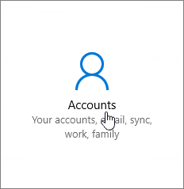

# 사용자용 Windows 장치 Microsoft 365 Business Premium 설정Set up Windows devices for Microsoft 365 Business Premium users

## 시작하기 전에Before you begin

Windows 사용자를 위해 Windows Microsoft 365 Business Premium 장치를 설정하기 전에 모든 Windows 장치가 Windows 10 Pro 버전 1703(크리에이터스 업데이트)을 실행하고 있는지 확인하십시오.Before you can set up Windows devices for Microsoft 365 Business Premium users, make sure all the Windows devices are running Windows 10 Pro, version 1703 (Creators Update). Windows 10 Pro 클라우드 서비스 및 장치 관리 기능 집합인 Windows 10 Business 배포하기 위한 선행 구성 Windows 10 Pro 관리 및 보안 제어를 Microsoft 365 Business Premium.Windows 10 Pro is a prerequisite for deploying Windows 10 Business, which is a set of cloud services and device management capabilities that complement Windows 10 Pro and enable the centralized management and security controls of Microsoft 365 Business Premium.
  
Windows 7 Pro, Windows 8 Pro Windows 또는 Windows 8.1 Pro 7을 실행하는 Microsoft 365 Business Premium 디바이스가 있는 경우 Microsoft 365 Business Premium 업그레이드를 Windows 10 있습니다.If you have Windows devices running Windows 7 Pro, Windows 8 Pro, or Windows 8.1 Pro, your Microsoft 365 Business Premium subscription entitles you to a Windows 10 upgrade.
  
Windows 장치를 Windows 10 Pro 크리에이터 업데이트로 업그레이드하는 방법에 대한 자세한 내용은 [Windows Pro 크리에이터 업데이트로 Windows 장치 업그레이드](upgrade-to-windows-pro-creators-update.md)의 단계를 따르세요.For more information on how to upgrade Windows devices to Windows 10 Pro Creators Update, follow the steps in this topic: [Upgrade Windows devices to Windows Pro Creators Update](upgrade-to-windows-pro-creators-update.md).
  
디바이스가 [Azure AD에](#verify-the-device-is-connected-to-azure-ad) 연결되어 있는지 확인을 참조하여 업그레이드가 있는지 확인하거나 업그레이드가 올바르게 진행된지 확인합니다.See [Verify the device is connected to Azure AD](#verify-the-device-is-connected-to-azure-ad) to verify you have the upgrade, or to make sure the upgrade worked.

## 시청: 커넥트 PC를 Microsoft 365 BusinessWatch: Connect your PC to Microsoft 365 Business

> [!VIDEO https://www.microsoft.com/videoplayer/embed/RE3yXh3] 

이 비디오가 도움이 된 경우에는 [소규모 비즈니스와 Microsoft 365를 처음 사용하는 사용자를 위한 완전한 교육 시리즈](../business-video/index.yml)를 참조하세요.If you found this video helpful, check out the [complete training series for small businesses and those new to Microsoft 365](../business-video/index.yml).
  
## Windows 10 장치를 조직의 Azure AD에 연결Join Windows 10 devices to your organization's Azure AD

조직의 모든 Windows 장치가 Windows 10 Pro 크리에이터스 업데이트로 업그레이드되거나 Windows 10 Pro 크리에이터스 업데이트를 이미 실행 중인 경우 이러한 장치를 조직의 크리에이터스에 가입할 수 Azure Active Directory.When all Windows devices in your organization have either been upgraded to Windows 10 Pro Creators Update or are already running Windows 10 Pro Creators Update, you can join these devices to your organization's Azure Active Directory. 디바이스가 가입되고 나면 디바이스가 Windows 10 Business 구독의 일부인 Microsoft 365 Business Premium 업그레이드됩니다.Once the devices are joined, they'll be automatically upgraded to Windows 10 Business, which is part of your Microsoft 365 Business Premium subscription.
  
### 최신 또는 새로 업그레이드된 Windows 10 Pro 장치의 경우For a brand new, or newly upgraded, Windows 10 Pro device

Windows 10 Pro 크리에이터 업데이트를 실행하는 새로운 장치 또는 Windows 10 Pro 크리에이터 업데이트로 업그레이드했지만 Windows 10 장치 설정을 완료하지 않은 장치의 경우 다음 단계를 따르세요.For a brand new device running Windows 10 Pro Creators Update, or for a device that was upgraded to Windows 10 Pro Creators Update but has not gone through Windows 10 device setup, follow these steps.
  
1. **어떻게 설정하시겠어요?** 페이지에 도달할 때까지 Windows 10 장치 설정을 진행합니다.Go through Windows 10 device setup until you get to the **How would you like to set up?** page. 
    
    
  
2. 여기서 조직에 대해 설정 **을 선택한** 다음 조직에 대한 사용자 이름과 암호를 Microsoft 365 Business Premium.Here, choose **Set up for an organization** and then enter your username and password for Microsoft 365 Business Premium. 
    
3. Windows 10 장치 설정을 완료합니다.Finish Windows 10 device setup.
    
   설정을 완료하면 사용자가 조직의 Azure AD에 연결됩니다. [장치가 Azure AD에 연결되었는지 확인](#verify-the-device-is-connected-to-azure-ad)을 참조하여 연결을 확인하세요.Once you're done, the user will be connected to your organization's Azure AD. See [Verify the device is connected to Azure AD](#verify-the-device-is-connected-to-azure-ad) to make sure. 
  
### Windows 10 Pro를 이미 설치하여 운영 중인 장치의 경우For a device already set up and running Windows 10 Pro

 **Azure AD에 사용자 연결:****Connect users to Azure AD:**
  
1. 사용자의 Windows PC에서 Windows 10 Pro 버전 1703(크리에이터 업데이트)([필수 조건](pre-requisites-for-data-protection.md) 확인)을 사용하는 경우 Windows 로고와 설정 아이콘을 차례로 클릭합니다.In your user's Windows PC, that is running Windows 10 Pro, version 1703 (Creators Update) (see [pre-requisites](pre-requisites-for-data-protection.md)), click the Windows logo, and then the Settings icon.
  
   
  
2. **설정** 에서 **계정** 으로 이동합니다.In **Settings**, go to **Accounts**.
  
   
  
3. **사용자 정보** 페이지에서 **회사 또는 학교 액세스** \> **연결** 을 차례로 클릭합니다.On **Your info** page, click **Access work or school** \> **Connect**.
  
   
  
4. **회사 또는 학교 계정 설정** 대화 상자의 **대체 작업** 에서 **Azure Active Directory에 이 장치 가입** 을 선택합니다.On the **Set up a work or school account** dialog, under **Alternate actions**, choose **Join this device to Azure Active Directory**.
  
   
  
5. **로그인 시작** 페이지에 회사 또는 학교 계정을 입력합니다 \> **다음**.On the **Let's get you signed in** page, enter your work or school account \> **Next**.
  
   **암호 입력** 페이지에서 암호를 입력합니다 \> **로그인**.On the **Enter password** page, enter your password \> **Sign in**.
  
   
  
6. 조직 **페이지가 맞는지 확인 페이지에서** 정보가 올바른지 확인하고 참가를 **선택합니다.**On the **Make sure this is your organization** page, verify that the information is correct, and choose **Join**.
  
   모두 **설정되어 있습니다!**On the **You're all set!** page, chosse **Done**.page, chosse **Done**.
  
   
  
파일을 업로드하여 비즈니스용 OneDrive 다시 동기화합니다.If you uploaded files to OneDrive for Business, sync them back down. 타사 도구를 사용하여 프로필 및 파일을 마이그레이션한 경우 이러한 도구를 새 프로필과 동기화합니다.If you used a third-party tool to migrate profile and files, also sync those to the new profile.
  
## 장치가 Azure AD에 연결되었는지 확인Verify the device is connected to Azure AD

동기화 상태를 확인하려면 설정  직장 또는 학교 액세스 페이지에서 _  _에 연결 **영역을** 선택하여 정보 및 연결 끊기 단추를 \<organization name\>  **노출합니다.**To verify your sync status, on the **Access work or school** page in **Settings**, select the **Connected to** _ \<organization name\> _ area to expose the buttons **Info** and **Disconnect**. 정보를 **선택하면** 동기화 상태를 확인할 수 있습니다.Choose **Info** to get your synchronization status. 
  
동기화 **상태 페이지에서** **동기화를** 선택하면 PC에 최신 모바일 장치 관리 정책을 다운로드할 수 있습니다.On the **Sync status** page, choose **Sync** to get the latest mobile device management policies onto the PC.
  
Microsoft 365 Business Premium 계정을 사용하려면 Windows 시작 단추로 이동하여 현재 계정 사진을 **마우스** 오른쪽 단추로 클릭한 다음 계정 전환 **을 클릭합니다.**To start using the Microsoft 365 Business Premium account, go to the Windows **Start** button, right-click your current account picture, and then **Switch account**. 조직 전자 메일 및 암호를 사용하여 로그인합니다.Sign in by using your organization email and password.
  

  
## PC가 서버로 업그레이드되어 있는지 Windows 10 BusinessVerify the PC is upgraded to Windows 10 Business

Azure AD에 가입된 Windows 10 디바이스가 Windows 10 Business 구독의 일부로 Microsoft 365 Business Premium 합니다.Verify that your Azure AD joined Windows 10 devices are upgraded to Windows 10 Business as part of your Microsoft 365 Business Premium subscription.
  
1. **설정** \> **시스템** \> **정보** 로 이동합니다.Go to **Settings** \> **System** \> **About**.
    
2. **버전** 이 **Windows 10 Business** 인지 확인합니다.Confirm that the **Edition** shows **Windows 10 Business**.
    
    
  
## 다음 단계Next steps

모바일 장치를 설정하려면 Microsoft 365 Business Premium 사용자를 위한 모바일 장치 설정 [,](set-up-mobile-devices.md)장치 보호 또는 앱 보호 정책을 설정하려면 비즈니스용 Microsoft 365 [관리를 참조하세요.](manage.md)To set up your mobile devices, see [Set up mobile devices for Microsoft 365 Business Premium users](set-up-mobile-devices.md), To set device protection or app protection policies, see [Manage Microsoft 365 for business](manage.md).
  
## 관련 콘텐츠Related content

[Microsoft 365 교육용 비디오(링크](../business-video/index.yml) 페이지)[Microsoft 365 for business training videos](../business-video/index.yml) (link page)
