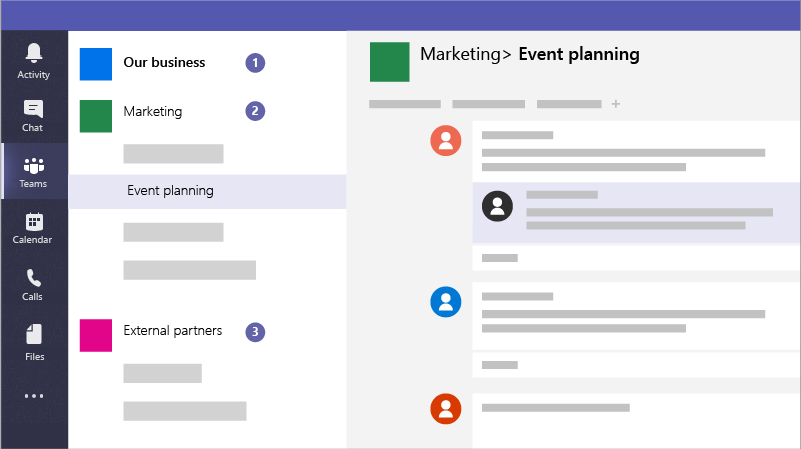

# 공동 작업을 위한 팀을 Microsoft Teams

Microsoft Teams 모든 장치에서 직원들이 체계적으로 대화를 할 수 있도록 하는 공동 작업 앱입니다. 조직 외부의 Microsoft Teams 게스트와 인스턴트 대화를 할 수 있습니다. 전화 통화를 걸고, 모임을 호스트하고, 파일을 공유할 수 있습니다.

## 모범 사례

1. 중요한 정보를 위한 비공개 팀을 만들 수 있습니다.
1. 조직 전체의 모든 사용자와 의사소통할 수 있는 조직 전체 팀을 만들 수 있습니다.
1. 특정 프로젝트에 대한 팀을 만들고 포함해야 하는 사용자에 따라 올바른 양의 보호를 적용합니다.
1. 외부 파트너와의 커뮤니케이션을 위한 특정 팀을 만들어 비즈니스에 중요한 것과는 별도로 유지할 수 있습니다.

예를 들어 비즈니스, 법률 회사 또는 의료 관행은 다음 팀을 만들 수 있습니다.

1. 비즈니스, 회사 또는 실무 **전각 팀:** 이는 모든 사람이 업무 전반에 걸쳐 매일 커뮤니케이션하고 작업하는 데 사용할 수 있는 것입니다. 이 팀을 사용하여 공지 사항을 게시하거나 전체 회사 또는 사례에 대한 관심 정보를 공유할 수 있습니다.
1. **개별 팀:** 소규모 그룹을 위한 팀을 설정하여 하루 중 업무에 대해 공동 작업을 할 수 있습니다.
1. **외부 커뮤니케이션 팀 또는 팀:** 공급업체, 파트너 또는 클라이언트와 협력하여 중요한 모든 것을 허용하지 않습니다. 특정 그룹에 대해 다른 채널을 설정합니다.

또한 캠페인은 안전하게 통신하고 공동 작업을 할 수 있는 다음 팀을 만들 수 있습니다.

1. **캠페인 잠재 고객 팀:** 주요 캠페인 구성원만 액세스할 수 있도록 비공개 팀으로 설정하고 잠재적으로 중요한 관심사에 대해 논의할 수 있습니다.
2. **일반 캠페인 팀:** 이는 모든 사람이 매일 통신하고 업무에 사용할 수 있는 것입니다. 개인, 그룹 또는 위원회는 이 팀에서 작업을 할 수 있는 채널을 설정할 수 있습니다. 예를 들어 이벤트 계획 사용자들은 캠페인 이벤트에 대한 채팅 및 조율을 위한 채널을 설정할 수 있습니다.
3. **파트너 팀:** 공급업체, 파트너 또는 지원자들과 협력하여 중요한 정보를 허용하지 않습니다.

팀을 만들면 다음과 같은 다른 팀이 만들어집니다.

- 새 Microsoft 365 [그룹](/MicrosoftTeams/office-365-groups)
- 팀 [SharePoint 저장하기](/MicrosoftTeams/sharepoint-onedrive-interact) 위한 온라인 사이트 및 문서 라이브러리
- 공유 [Exchange Online](/MicrosoftTeams/exchange-teams-interact) 일정
- OneNote 전자 필기장
- Planner 및 Office 365 같은 다른 Power BI

내부 Microsoft Teams 찾을 수 있습니다.

1. **Teams:** 소속된 채널을 찾거나 직접 만들 수 있습니다. 채널 내에서는 현장 모임을 열고, 대화를 나누고, 파일을 공유할 수 있습니다.
2. **모임:** 해당 일 또는 주에 대한 모든 것을 볼 수 있습니다. 또는 모임을 예약합니다. 이 일정은 일정과 Outlook 동기화됩니다.
3. **통화:** 경우에 따라 조직에서 설정한 경우 조직에서 다른 사용자로 전화를 걸 수 Microsoft Teams 없는 경우에도 해당 사용자로 전화를 걸 수 Microsoft Teams.
4. **활동:** 읽을 수 없는 모든 메시지, @mentions, 답장 등도 확인

맨 위에 있는 명령 상자를 사용하여 특정 항목이나 사용자 검색, 빠른 작업 및 앱을 실행합니다.

## 설정하기

비즈니스 소유자 및 관리자, 캠페인 관리자 및 후보에 대한 비공개 팀을 만들 수 있습니다.

> [!VIDEO https://www.microsoft.com/videoplayer/embed/RWeqWA]

비즈니스 또는 캠페인의 모든 사람이 커뮤니케이션하고 파일을 공유하는 데 사용할 수 있는 조직 전체 팀을 만들 수 있습니다.

> [!VIDEO https://www.microsoft.com/videoplayer/embed/RE2GCG9]

광고 또는 재무와 같이 조직 외부의 게스트와 공유하는 팀을 만들 수 있습니다.

> [!VIDEO https://www.microsoft.com/videoplayer/embed/RE1FQMp]

자세한 내용은 Microsoft Teams [설명서를 Microsoft Teams 참조하세요.](/microsoftteams/microsoft-teams)

## 관리자 설정

조직 전체 팀을 만들 관리자는 관리자 되어야 합니다. 자세한 내용은 What is an Admin in Microsoft 365? 을 [참조하세요.](https://support.office.com/article/what-is-an-admin-e123627e-4892-4461-b9aa-1b6d57a5cfa4?ui=en-US&rs=en-US&ad=US)