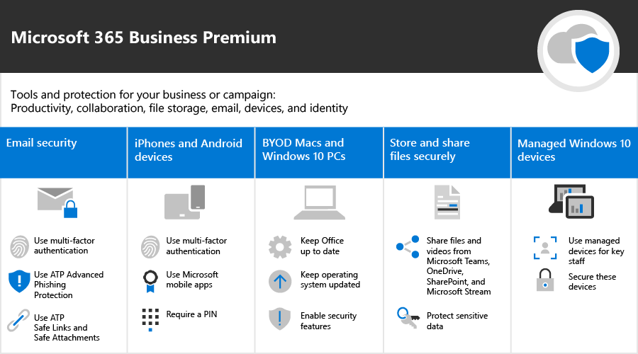

캠페인을 위한 Microsoft 365
===========================

현재 세계에서 데이터와 통신을 안전 하 게 유지 하는 것은 특히 정치적 캠페인, 의료 및 법적 관행 및 기타 수많은 기업에 대 한 우선 순위입니다. 캠페인에 대 한 Microsoft 365에는 데이터를 보호 하는 데 도움이 되는 권장 사항 집합이 포함 되어 있습니다. 이 라이브러리에는 사용자가 캠페인이 아닌 경우에도이 권장 환경을 설정 및 사용 하는 데 필요한 도움말이 포함 되어 있습니다.

> [!VIDEO https://www.microsoft.com/videoplayer/embed/RE3clbH] 

**캠페인에 대 한 Microsoft 365 이란?** 다음을 수행할 수 있도록 Microsoft 365 Business Premium이 포함 된 권장 보안 구성입니다.
- 신뢰할 수 있는 비즈니스 생산성 및 Outlook, Word, Excel 및 기타 Office 제품과 같은 공동 작업 도구를 사용 합니다. 
- 관리 하기 간편한 엔터프라이즈급 보안을 사용 하 여 모든 iOS, Android 및 Windows 10 장치에서 작업 파일을 보호 합니다. 
- 사용자 계정 및 id에 대 한 추가 보호 적용 

미국의 연방 선거 캠페인은 Microsoft 365 Business Premium에 대 한 특별 가격 산정을 인정 하지만이 계획을 사용 하는 모든 조직은이 가이드를 활용 하 여 향상 된 보안을 구성 하 고 안전 하 게 공동 작업 하는 방법을 배울 수 있습니다.

이 라이브러리에는 다음이 포함 됩니다.
- 보안 강화를 추가 하기 위한 규범적인 설정 지침
- 사용자가 보안 액세스용으로 장치를 설정 하는 데 도움이 됩니다.
- 안전 하 게 공동 작업 하 고 공유 하는 방법에 대 한 지침입니다.

포함 된 항목에 대 한 자세한 내용은 [Microsoft 365 Business Premium](https://www.microsoft.com/microsoft-365/business)를 참조 하세요. 

시작
--------------------------

<ul class="panelContent cardsJ">
    <li>
        

            

                

                    

                        

                            
                        

                    

                    

                        
<b>시작 하려면 다음 단계를 수행 하세요.</b>

                        
<a href="get-microsoft-365-campaigns.md">Microsoft 365 캠페인 받기</a>

                        
<a href="m365-campaigns-users.md">사용자가 Microsoft 365을 사용 하는 방법을 알아봅니다.</a>

                        
<a href="microsoft-365-campaigns-setup-overview.md">Microsoft 365 캠페인 설정</a>

                    

                

            

        

    </li>
</ul>

캠페인 또는 소규모 기업을 위한 솔루션
--------------------------

Microsoft 365 보안 환경을 설정한 후에는 다음 솔루션을 사용 하 여 작업을 수행할 수 있습니다.

<ul class="panelContent cardsW cols cols2">
    <li>
        

            

                

                    

                        

                            
                        

                    

                    

                        <h3>공동 작업용 팀 만들기</h3>
                        
주요 직원, 모든 직원 및 파트너 또는 공급 업체에 대 한 특정 팀과의 의사 소통 및 공동 작업을 위한 공간을 Microsoft 팀에 게 제공 합니다.

                        
<a href="create-teams-for-collaboration.md">팀 만들기</a>

                    

                

            

        

    </li>
    <li>
        

            

                

                    

                        

                            
                        

                    

                    

                        <h3>온라인 모임 설정</h3>
                        
오디오, 비디오 및 Microsoft 팀과의 공유를 사용 하 여 모임 일정을 정합니다.

                        
<a href="set-up-meetings.md">모임 설정</a>

                    

                

            

        

    </li>
    <li>
        

            

                

                    

                        

                            
                        

                    

                    

                        <h3>중요 한 전자 메일 암호화 또는 레이블 지정</h3>
                        
암호화 및 민감도 레이블을 사용 하 여 기밀 정보나 중요 한 정보가 포함 된 전자 메일을 보호 합니다.

                        
<a href="send-encrypted-email.md">암호화된 전자 메일 보내기</a>

                    

                

            

        

    </li>
    <li>
        

            

                

                    

                        

                            
                        

                    

                    

                        <h3>통신 사이트 만들기</h3>
                        
SharePoint를 사용 하 여 만든 내부 통신 사이트에서 팀과 이벤트, 메시지, 이미지 등을 공유 합니다.

                        
<a href="create-communications-site.md">사이트 만들기</a>

                    

                

            

        

    </li>
    <li>
        

            

                

                    

                        

                            
                        

                    

                    

                        <h3>파일 및 동영상 공유</h3>
                        
모든 해당 사용자가 사용할 수 있도록 파일 및 비디오를 클라우드에 저장 합니다.

                        
<a href="share-files-and-videos.md">공유 시작</a>

                    

                

            

        

    </li>
</ul>
