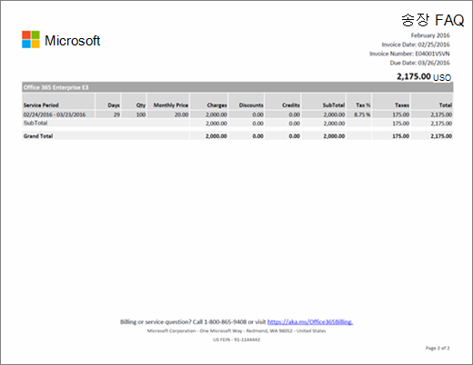

# 비즈니스용 Microsoft 365의 청구서 또는 송장 이해

> [!IMPORTANT]
> 2021년 1월 26일 현재 벨기에, 프랑스, 이탈리아, 룩셈부르크, 포르투갈, 스페인 및 미국의 고객에게는 새 은행 계좌가 더 이상 지원되지 않습니다. 해당 국가 중 하나의 기존 고객인 경우 기존 은행 계좌로 구독료를 계속 결제할 수 있으며 은행 계좌 상태가 양호한 경우에만 새 구독을 추가할 수 있습니다.

월간 또는 연간(구독을 구입했을 때 선택한 옵션에 따라 다름)으로 관리 센터에서 새 명세서를 사용할 수 있다는 전자 메일을 받게 됩니다. [청구서 또는 송장을 찾아서 보는 방법을 알아봅니다](view-your-bill-or-invoice.md).
  
송장은 두 페이지로 되어 있습니다. 1페이지는 송장 요약으로, 송장, 주문, 지불 금액, 납부 방법, 지원 서비스 문의 방법에 대한 일반 정보가 나와 있습니다.
  

  
2페이지는 각 구독의 청구 내역에 대한 세부 정보가 나와 있습니다.
  

  
송장에 포함된 필드와 용어에 대한 설명은 이 문서 후반에 있는 [송장 필드 용어](#invoice-field-glossary)를 참조하세요.
  
## 청구 개념 이해

송장을 보기 전에 몇 가지 주요 청구 개념을 이해하는 것이 좋습니다.
  
### 송장 잔액과 주문 잔액 비교

 **송장 잔액** 은 송장에 표시되는 금액으로, 특정 청구 기간에만 해당하는 지불 금액입니다. 총 **주문 잔액** 은 미지불된 모든 송장의 합계입니다. 주문 잔액은 관리 센터의 **청구** 섹션에서 볼 수 있습니다.
  
### 청구 주기와 송장 주기 비교

 **청구 주기** 는 대금이 청구되는 횟수를 의미합니다. 구독은 구독 구매 시 선택한 옵션에 따라 월간 또는 연간으로 청구됩니다. **송장 주기** 는 송장을 받는 횟수를 의미합니다. 연간 청구를 선택한 경우에는 구독에 대한 활동에 요금이 부과되거나 크레딧이 필요하지 않은 경우, 연간 하나의 송장만 받게 됩니다.
  
주문이 두 개 이상 있으면 각 주문에 대한 송장을 받게 됩니다.
  
## 송장 필드 용어집

다음 표에는 송장에 있을 수 있는 필드가 설명되어 있습니다. 결제 방법이 송장인지 또는 신용 카드나 은행 계좌인지에 따라 여기에 나열된 필드 중 일부가 송장에 없을 수도 있습니다.
  
> [!NOTE]
> 은행 계좌로 결제하는 방법은 일부 국가나 지역에서는 사용할 수 없습니다.
  
|**이름**|**설명**|
|:-----|:-----|
|연간 가격|구독은 월간 또는 연간으로 비용이 청구됩니다. 구독 구매 시 연간 청구를 선택한 경우, 연간 라이선스 가격이 송장에 반영됩니다. 청구 주기를 변경하려면 구독을 취소하고 새 청구 주기로 다시 구매해야 합니다.|
|대금 청구 기간|대금 청구 기간은 마지막 송장 날짜 이후의 기간입니다. 서비스 기간은 서비스 이용에 대한 요금이 청구되는 기간입니다.|
|청구지|청구 담당 부서의 주소로, 대개 구매자 주소와 동일합니다. 청구 주소를 업데이트하려면 [청구 주소 변경](change-your-billing-addresses.md)을 참조하세요.|
|요금|송장 1페이지에 송장 청구 기간에 해당하는 모든 요금이 요약되어 있습니다. 2페이지에는 각 구독에 대한 자세한 요금 내역이 나와 있습니다.|
|수표|지불 방식이 송장일 때 사용자 국가에서 수표 지불이 가능하면 1페이지 하단에 지불 금액을 보낼 곳에 대한 정보가 나와 있습니다. 수표에 송장 번호를 기입하세요.|
|크레딧|송장 1페이지에 송장 청구 기간에 해당하는 모든 크레딧이 요약되어 있습니다. 2페이지에는 각 구독에 대한 자세한 크레딧 내역이 나와 있습니다.|
|고객 PO 번호|PO(구매 주문) 번호입니다. PO 번호를 업데이트하면 이후 송장에는 새 번호가 포함됩니다. [구매 주문 번호 변경](#change-your-purchase-order-number).    **참고** 기존 송장에는 PO 번호를 추가할 수 없습니다.           |
|일수|각 청구 거래는 서비스 기간과 연결됩니다. 일수 열은 해당 서비스 기간의 일수를 나타냅니다.|
|할인|송장 1페이지에 송장 청구 기간의 모든 할인이 요약되어 있습니다. 2페이지에는 각 구독에 대한 자세한 할인 내역이 나와 있습니다.|
|기한|송장 금액을 결제해야 하는 날짜입니다. 신용 카드 또는 은행 계좌로 구독 비용을 결제하는 경우 송장 날짜 다음날에 신용 카드 또는 은행 계좌로 비용이 청구됩니다.  **참고** 은행 계좌로 결제하는 방법은 일부 국가나 지역에서는 사용할 수 없습니다.           |
|전자 자금 이체|구독 결제 방법으로 "송장"을 선택한 경우 1페이지에 전자(전신, ACH, SEPA 등) 결제를 위한 Microsoft 은행 계좌 정보가 포함됩니다. 일반적으로 은행에는 지불 금액을 보낼 때 작성하는 기입 필드가 있습니다. 표시된 송장 번호를 이 필드에 기입하세요.|
|총합계|이 행에는 전체 요금, 할인, 크레딧, 소계, 세금에 대한 각 합계와 송장에 나열된 모든 구독에 대한 합계 열이 있습니다.|
|청구 날짜|송장을 만든 날짜입니다. 송장 날짜는 청구 기간 마지막 날의 그 다음날입니다. 예를 들어 대금 청구 기간이 1월 15일 ~ 2월 14일이면 송장 날짜는 2월 15일입니다.|
|송장 번호|송장에 할당된 고유 번호입니다. 지불 금액과 함께 송장 번호를 기입하세요.|
|월별 가격|구독은 월간 또는 연간으로 비용이 청구됩니다. 구독 구매 시 월별 청구를 선택한 경우, 월별 라이선스 가격이 송장에 반영됩니다. 청구 주기를 변경하려면 구독을 취소하고 새 청구 주기로 다시 구매해야 합니다.|
|주문 번호|새 구독을 구매할 때마다 주문이 생성됩니다. 매월 각 주문에 대한 송장을 받게 됩니다.|
|지불 관련 지침|신용 카드로 지불하는 경우 "지불하지 마십시오. 기록된 신용 카드로 청구됩니다."라고 표시되어 있습니다. 송장으로 지불하는 경우 전자 자금 이체(EFT)와 수표(해당하는 경우)로 지불하는 방법에 대한 지침이 나와 있습니다.|
|지불 기간|송장 날짜로부터 남은 지불 기한 일수입니다. 일반적으로 30일입니다.|
|제품|송장 1페이지에 나오는 "온라인 서비스"는 구독을 설명하기 위한 일반 용어입니다. 2페이지에는 개별 구독 이름이 나와 있습니다.|
|수량|서비스 기간 동안 구매한 라이선스 수입니다.|
|서비스 기간|서비스 기간은 서비스 이용에 대한 요금이 청구되는 기간입니다. 대금 청구 기간은 마지막 송장 날짜 이후의 기간입니다.|
|서비스 사용 주소|서비스를 사용 중인 주소로, 대개 구매자 주소와 동일합니다. 서비스 사용 주소를 업데이트하려면 [청구 주소 변경](change-your-billing-addresses.md)을 참조하세요.|
|구매자|회사명과 주소입니다. 이 정보를 업데이트하려면 [Change your organization's address, technical contact email, and other information](../../admin/manage/change-address-contact-and-more.md)(조직 주소, 기술 담당자 전자 메일 및 기타 정보 변경)을 참조하세요.  |
|소계|송장에 나열된 각 구독에는 모든 요금, 할인, 크레딧, 소계, 세금에 대한 별도의 소계 열과 해당 구독에 대한 합계 열이 있습니다.|
|세금|송장의 1페이지에는 총 세금이 나와 있습니다. 2페이지에는 적용한 세율과 각 품목에 대한 총 세금이 나와 있습니다. 송장에 세금이 포함되어 있는데 회사가 세금 면제 대상이라면 [지원 서비스에 문의](../../business-video/get-help-support.md)하세요.  |
|합계|송장 청구 기간에 지급해야 할 금액입니다.|

## 구매 주문 번호 변경

송장 단위로 결제하는 경우 구독에 대한 PO(구매 주문) 번호를 추가하거나 변경할 수 있습니다.
  
> [!NOTE]
> 기존 송장에는 PO 번호를 추가할 수 없습니다. PO 번호는 이후의 모든 송장에 표시됩니다.

::: moniker range="o365-worldwide"

1. 관리 센터에서 **청구** \> <a href="https://go.microsoft.com/fwlink/p/?linkid=842054" target="_blank">내 상품</a> 페이지로 이동합니다.

::: moniker-end

::: moniker range="o365-germany"

1. 관리 센터에서 **청구** \> <a href="https://go.microsoft.com/fwlink/p/?linkid=847745" target="_blank">내 상품</a> 페이지로 이동합니다.

::: moniker-end

::: moniker range="o365-21vianet"

1. 관리 센터에서 **청구** \> <a href="https://go.microsoft.com/fwlink/p/?linkid=850626" target="_blank">내 상품</a> 페이지로 이동합니다.

::: moniker-end

1. **제품** 탭에서 변경할 구독을 선택합니다.

1. 구독 세부 정보 페이지의 구독 및 결제 **설정 섹션에서** 송장 **편집을 선택합니다.**

1. 음성으로 결제에  대한 세부 정보 편집 창의 아래쪽에 PO 번호를 입력한 다음 저장을 **선택합니다.**

## 관련 콘텐츠

[청구서 또는 송장을](view-your-bill-or-invoice.md) 찾아서 보는 방법(문서)\
[멕시코 비즈니스용 Microsoft 365 청구 정보](mexico-billing-info.md)(문서) \
[대금 청구 주소](change-your-billing-addresses.md) 변경(문서)\
[조직의 주소, 기술](../../admin/manage/change-address-contact-and-more.md) 담당자 전자 메일 및 기타 정보 변경(문서)\
[비즈니스용 Microsoft 365 요금](pay-for-your-subscription.md) 결제(문서)\
[Minecraft: Education Edition 결제 옵션](/education/windows/school-get-minecraft) (문서)
