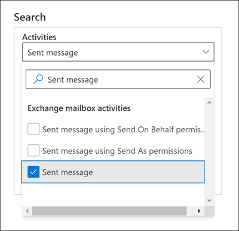

# Microsoft 365의 고급 감사

Microsoft 365의 [감사 기능](search-the-audit-log-in-security-and-compliance.md)은 조직에 Microsoft 365의 여러 서비스에서 다양한 유형의 감사 활동에 대한 가시성을 제공합니다. 고급 감사는 (Microsoft 365 준수 센터 및 Office 365 관리 활동 API에서 감사 로그 검색 사용) 필요한 감사 로그 보존을 강화하고 손상 범위를 확인하는 데 도움이 되는 중요한 이벤트에 대한 액세스를 제공하고 Office 365 관리 활동 API에 빠르게 액세스할 수 있게 해주어 조직에서 법의학 및 규정 준수 조사를 수행하는 데 도움이 됩니다. 

> [!NOTE]
> Office 365 E5/A5/G5 또는 Microsoft 365 Enterprise E5/A5/G5 구독이 있는 조직의 경우 고급 감사 기능을 사용할 수 있습니다. 감사 로그의 장기 보존 및 조사를 위한 고급 감사 이벤트 생성과 같은 고급 감사 기능을 사용하려면 Microsoft 365 E5/A5/G5 규정 준수 또는 E5/A5/G5 eDiscovery 및 감사 추가 기능 라이선스를 사용자에게 할당해야 합니다. 라이선스에 대한 자세한 내용은 다음을 참조하세요. - [고급 감사 라이선스 요구 사항](auditing-solutions-overview.md#licensing-requirements) - [보안 및 규정 준수를 위한 Microsoft 365 라이선싱 지침](/office365/servicedescriptions/microsoft-365-service-descriptions/microsoft-365-tenantlevel-services-licensing-guidance/microsoft-365-security-compliance-licensing-guidance#advanced-audit)

이 문서에서는 고급 감사 기능 개요와 고급 감사에 대한 사용자 설정 방법이 나와 있습니다.

## 감사 로그의 장기 보존

고급 감사는 1년 동안 모든 Exchange, SharePoint 및 Azure Active Directory 감사 레코드를 보존합니다. 이는 1년 동안의 **워크로드** 속성(활동이 발생한 서비스를 나타냄)에 대한 **Exchange**, **SharePoint** 또는 **AzureActiveDirectory** 값을 포함하는 모든 감사 레코드를 보유하는 기본 감사 로그 보유 정책에 의해 수행됩니다. 감사 기록을 장기간 유지하면 진행 중인 법률적 또는 규정 준수 조사에 도움이 될 수 있습니다. 자세한 정보는 [감사 로그 보존 정책 관리](audit-log-retention-policies.md#default-audit-log-retention-policy)의 "기본 감사 로그 보존 정책"섹션을 참조하십시오.

고급 감사의 1년 보존 기능 외에도 10년 동안 감사 로그를 보존하는 기능도 출시했습니다. 감사 로그의 10년 보존은 장기 실행 조사를 지원하고 규제, 법률 및 내부 의무에 대응하는 데 도움이 됩니다.

> [!NOTE]
> 10년간의 감사 로그 보존은 추가적인 사용자당 추가 기능 라이선스를 필요로 합니다. 이 라이선스가 사용자에게 할당되고 해당 사용자에 대해 적절한 10년 감사 로그 보존 정책이 설정된 후 해당 정책이 적용되는 감사 로그는 10년 동안 보존되기 시작합니다. 이 정책은 소급되지 않으며 10년 감사 로그 보존 정책을 만들기 전에 생성된 감사 로그를 보존할 수 없습니다. 자세한 내용은 이 문서의 [고급 감사에 대한 FAQ](#faqs-for-advanced-audit) 섹션을 참조하십시오.

### 로그 보존 정책 감사

기본 감사 로그 보존 정책에 포함되지 않은 다른 서비스에서 생성된 모든 감사 레코드(이전 섹션에서 설명)는 90일 동안 보존됩니다. 그러나 최대 10년 동안 다른 감사 레코드를 보존하기 위한 사용자 지정 감사 로그 보존 정책을 만들 수 있습니다. 다음 기준 중 하나 이상을 기반으로 감사 레코드를 보존하는 정책을 만들 수 있습니다.

- 감사되는 활동이 발생하는 Microsoft 365 서비스

- 감사되는 구체적 활동

- 감사되는 활동을 수행하는 사용자

특정 정책이 다른 정책보다 우선하도록 정책 및 우선순위 수준과 일치하는 감사 레코드에 대한 보존 기간을 지정할 수도 있습니다. 또한 조직의 일부 또는 모든 사용자에 대해 1년 미만(또는 10년)에 대해 Exchange, SharePoint 또는 Azure Active Directory 감사 레코드를 보존해야 할 경우 사용자 지정 감사 로그 보존 정책이 기본 감사 보존 정책 보다 우선적으로 적용됩니다. 자세한 내용은 [감사 로그 보존 정책 관리](audit-log-retention-policies.md)를 참조하십시오.

## 고급 감사 이벤트

고급 감사는 메일 항목에 액세스한 시기, 메일 항목에 회신 및 전달된 시기, 사용자가 Exchange Online 및 SharePoint Online에서 검색한 시기와 내용과 같은 중요한 이벤트에 대한 액세스를 제공하여 조직이 포렌식 및 규정 준수 조사를 수행하는 데 도움이 됩니다. 이러한 이벤트는 발생 가능성이 있는 위반을 조사하고 손상 범위를 결정하는 데 도움이 될 수 있습니다. Exchange 및 SharePoint의 이러한 이벤트 외에도 중요한 이벤트로 간주되고 사용자에게 적절한 [고급 감사 라이선스](auditing-solutions-overview.md#licensing-requirements)가 할당되어야 하는 다른 Microsoft 365 서비스의 이벤트가 있습니다. 사용자가 이러한 이벤트를 수행할 때 감사 로그가 생성되도록 사용자에게 고급 감사 라이선스가 할당되어야 합니다.

고급 감사는 다음과 같은 이벤트를 제공합니다.

- [MailItemsAccessed](#mailitemsaccessed)

- [보내기](#send)

- [SearchQueryInitiatedExchange](#searchqueryinitiatedexchange)*

- [SearchQueryInitiatedSharePoint](#searchqueryinitiatedsharepoint)*

- [Microsoft 365의 기타 고급 감사 이벤트](#other-advanced-audit-events-in-microsoft-365)

> [!NOTE]
> * 현재 이 이벤트는 Office 365 및 Microsoft 365 Government GCC High 및 DoD 환경에서 사용할 수 없습니다.

### MailItemsAccessed

MailItemsAccessed 이벤트는 사서함 감사 작업이며 메일 프로토콜과 메일 클라이언트가 메일 데이터에 액세스할 때 트리거됩니다. 이 이벤트는 조사관이 데이터 침해를 식별하고 손상되었을 수 있는 메시지의 범위를 결정하는 데 도움이 될 수 있습니다. 공격자가 전자 메일 메시지에 액세스한 경우 실제로 메시지를 읽었다는 명시적인 신호가 없는 경우에도 MailItemsAccessed 작업이 트리거됩니다(즉, 바인딩 또는 동기화를 통한 액세스 유형이 감사 레코드에 기록됨).

새로운 MailItemsAccessed 이벤트는 Exchange Online의 사서함 감사 로깅에서 MessageBind를 대체하고 다음과 같은 향상된 기능을 제공합니다.

- MessageBind는 AuditAdmin 사용자 로그온 유형에 대해서만 구성 할 수 있었습니다. 대리인 또는 소유자 조치에는 적용되지 않았습니다. MailItemsAccessed는 모든 로그온 유형에 적용됩니다.

- MessageBind는 메일 클라이언트만 액세스할 수 있었습니다. MessageBind는 동기화 활동에는 적용되지 않았습니다. MailItemsAccessed 이벤트는 바인딩 및 동기화 액세스 유형에 의해 트리거됩니다.

- MessageBind 작업은 동일한 전자 메일 메시지에 액세스할 때 여러 감사 레코드가 생성되어 "노이즈" 감사가 발생합니다. 반대로 MailItemsAccessed 이벤트는 더 적은 감사 레코드로 집계됩니다.

MailItemsAccessed 액세스 활동의 감사 레코드에 대한 자세한 내용은 [고급 감사를 사용하여 손상된 계정 조사](mailitemsaccessed-forensics-investigations.md)를 참조하세요.

MailItemsAccessed 감사 레코드를 검색하려면 Microsoft 365 보안 및 준수 센터의 [감사 로그 검색 도구](search-the-audit-log-in-security-and-compliance.md)의 **Exchange 사서함 활동** 드롭다운 목록에서 **액세스한 사서함 항목** 에 대한 활동을 검색할 수 있습니다.

Exchange Online PowerShell에서 [Search-UnifiedAuditLog -Operations MailItemsAccessed](/powershell/module/exchange/search-unifiedauditlog) 또는 [Search-MailboxAuditLog -Operations MailItemsAccessed](/powershell/module/exchange/search-mailboxauditlog) 명령을 실행할 수도 있습니다.

### 보내기

보내기 이벤트는 또한 사서함 감사 작업이며 사용자가 다음 작업 중 하나를 수행할 때 트리거됩니다.

- 전자 메일 메시지 전송

- 전자 메일 메시지에 회신

- 전자 메일 메시지 전달

조사관은 보내기 이벤트를 사용하여 손상된 계정에서 보낸 전자 메일을 식별할 수 있습니다. 보내기 이벤트에 대한 감사 레코드에는 메시지를 보낸 시간, InternetMessage ID, 제목 줄, 메시지에 첨부 파일이 포함 되었는지와 같이 메시지에 대한 정보가 포함됩니다. 이 감사 정보를 통해 조사자는 손상된 계정에서 보내거나 공격자가 보낸 전자 메일 메시지에 대한 정보를 식별하는 데 도움을 받을 수 있습니다. 또한 조사자는 Microsoft 365 eDiscovery 도구를 사용하여 메시지를 검색하여(제목 줄 또는 메시지 ID) 메시지를 받는 사람과 보낸 메시지의 실제 내용을 식별할 수 있습니다.

감사 레코드 보내기를 검색하려면 Microsoft 365 준수 센터 [감사 로그 검색 도구](search-the-audit-log-in-security-and-compliance.md)의 **Exchange 사서함 활동** 드롭다운 목록에서 **보낸 메시지** 활동을 검색할 수 있습니다.

또한 Exchange Online PowerShell에서 [Search-UnifiedAuditLog -Operations Send](/powershell/module/exchange/search-unifiedauditlog) 또는 [Search-MailboxAuditLog -Operations Send](/powershell/module/exchange/search-mailboxauditlog) 명령을 실행할 수도 있습니다.

### SearchQueryInitiatedExchange

SearchQueryInitiatedExchange 이벤트는 사용자가 Outlook을 사용하여 사서함의 항목을 검색할 때 트리거됩니다. 이벤트는 다음 Outlook 환경에서 검색을 수행하면 트리거됩니다.

- Outlook(데스크톱 클라이언트)

- 웹용 Outlook(OWA)

- iOS용 Outlook

- Android용 Outlook

- Windows 10용 메일 앱

조사관은 SearchQueryInitiatedExchange 이벤트를 사용하여 계정을 손상시켰을 수 있는 공격자가 사서함의 중요한 정보를 찾아보았는지 혹은 액세스하려 시도했는지를 확인할 수 있습니다. SearchQueryInitedExchange 이벤트에 대한 감사 레포트에는 검색 질의의 실제 텍스트와 같은 정보가 포함되어 있습니다. 감사 레코드는 검색이 수행된 Outlook 환경을 나타냅니다. 공격자가 수행한 검색 쿼리를 관찰하여 조사관은 검색된 전자 메일 데이터의 의도를 더욱 잘 이해할 수 있습니다.

SearchQueryInitiatedExchange 감사 레코드를 검색하려면 준수 센터의 [감사 로그 검색 도구](search-the-audit-log-in-security-and-compliance.md)의 **검색 활동** 드롭다운 목록에서 **수행한 전자 메일 검색** 활동을 검색할 수 있습니다.

Exchange Online PowerShell에서 [Search-UnifiedAuditLog-Operations SearchQueryInitiatedExchange](/powershell/module/exchange/search-unifiedauditlog)를 실행할 수도 있습니다.

> [!NOTE]
> 감사 로그에서 이 이벤트를 검색할 수 있도록 SearchQueryInitiatedExchange가 기록되도록 설정해야 합니다. 자세한 내용은 [고급 감사 설정](set-up-advanced-audit.md#step-2-enable-advanced-audit-events)을 참조하세요.

### SearchQueryInitiatedSharePoint

사서함 항목 검색과 마찬가지로 SearchQueryInitiatedSharePoint 이벤트는 사용자가 SharePoint의 항목을 검색할 때 트리거됩니다. 이벤트는 다음과 같은 유형의 SharePoint 사이트에서 검색을 수행하면 트리거됩니다.

- 홈 사이트

- 커뮤니케이션 사이트

- 허브 사이트

- Microsoft Teams와 연결된 사이트

조사자는 SearchQueryInitialSharePoint 이벤트를 사용하여 공격자가 SharePoint에서 중요한 정보를 찾고 액세스했는지 여부를 확인할 수 있습니다. SearchQueryInitialSharePoint 이벤트에 대한 감사 레코드에는 검색 쿼리의 실제 텍스트도 포함됩니다. 감사 레코드는 검색된 SharePoint 사이트의 유형도 나타냅니다. 공격자가 수행한 검색 쿼리를 관찰하여 조사관은 검색된 파일 데이터의 의도와 범위를 더욱 잘 이해할 수 있습니다.

SearchQueryInitiatedSharePoint 감사 레코드를 검색하려면 준수 센터의 [감사 로그 검색 도구](search-the-audit-log-in-security-and-compliance.md)의 **검색 활동** 드롭다운 목록에서 **수행한 SharePoint 검색** 활동을 검색할 수 있습니다.

또한 Exchange Online PowerShell에서 [Search-UnifiedAuditLog -Operations SearchQueryInitiatedExchange](/powershell/module/exchange/search-unifiedauditlog)를 실행할 수도 있습니다.

> [!NOTE]
> 감사 로그에서 이 이벤트를 검색할 수 있도록 SearchQueryInitiatedSharePoint가 기록되도록 설정해야 합니다. 자세한 내용은 [고급 감사 설정](set-up-advanced-audit.md#step-2-enable-advanced-audit-events)을 참조하세요.

### Microsoft 365의 기타 고급 감사 이벤트

Exchange Online 및 SharePoint Online의 이벤트 외에도 사용자에게 적절한 고급 감사 라이선스가 할당될 때 기록되는 다른 Microsoft 365 서비스에 이벤트가 있습니다. 다음 Microsoft 365 서비스는 고급 감사 이벤트를 제공합니다. 해당 링크를 선택하여 이러한 이벤트를 식별하고 설명하는 문서로 이동합니다.

- [Microsoft Forms](search-the-audit-log-in-security-and-compliance.md#microsoft-forms-activities)

- [Microsoft Stream](/stream/audit-logs#actions-logged-in-stream)

- [Microsoft Teams](/microsoftteams/audit-log-events#teams-activities)

- [Yammer](search-the-audit-log-in-security-and-compliance.md#yammer-activities)

## Office 365 관리 활동 API에 대한 고 대역폭 액세스

Office 365 관리 활동 API를 통해 감사 로그에 액세스하는 조직은 게시자 수준에서 제한을 스로틀링하여 제한되었습니다. 이는 여러 고객을 대신하여 데이터를 가져 오는 게시자의 경우 모든 고객이 한도를 공유했음을 의미합니다.

고급 감사가 릴리스됨에 따라 Microsoft는 게시자 수준 제한에서 테넌트 수준 제한으로 전환하고 있습니다. 결과적으로 각 조직은 감사 데이터에 액세스하기 위해 자체 할당된 대역폭 할당량을 얻게 됩니다. 대역폭은 사전 정의된 정적 제한이 아니지만 조직의 자리 수를 포함하여 E5/A5/G5 조직이 E5/A5/G5 이외의 조직보다 더 많은 대역폭을 갖도록 여러 요인을 조합하여 모델링되었습니다.

모든 조직에는 처음에 분당 2,000건의 요청 기준이 할당됩니다. 이 한도는 조직의 라이선스 수와 라이선스 구독에 따라 동적으로 증가합니다. E5/A5/G5 조직은 E5/A5/G5 이외의 조직보다 약 2배의 대역폭을 얻게 됩니다. 또한 서비스 상태를 보호하기 위해 최대 대역폭에 제한이 있습니다.

자세한 내용은 [Office 365 관리 활동 API 참조](/office/office-365-management-api/office-365-management-activity-api-reference#api-throttling)의 "API 조절"섹션을 참조하십시오.

## 고급 감사를 위한 FAQ

**고급 감사를 활용하려면 모든 사용자에게 E5/A5/G5 라이선스가 필요한가요?**

사용자 수준 고급 감사 기능을 활용하려면 사용자에게 E5/A5/G5 라이선스가 할당되어야 합니다. 사용자에게 기능을 표시하기 위해 적절한 라이선스를 확인하는 몇 가지 기능이 있습니다. 예를 들어, 90일 이상 적절한 라이선스가 할당되지 않은 사용자에 대한 감사 레코드를 보존하려고 하면 시스템에서 오류 메시지가 반환됩니다.

**내 조직에 E5/A5/G5 구독이 있는 경우에는 고급 감사 이벤트에 대해 감사 레코드에 대한 액세스 권한을 얻으려면 어떤 작업을 수행해야 하나요?**

적격 고객 및 적절한 E5/A5/G5 라이선스가 할당된 사용자의 경우 (이 문서에서 앞서 설명한 대로) SearchQueryInitiatedExchange 및 SearchQueryInitiatedSharePoint 이벤트를 사용하도록 설정하는 것을 제외하고 중요한 감사 이벤트에 대한 액세스를 생성하기 위해 필요한 조치가 없습니다. 고급 감사 이벤트는 해당 라이선스가 할당된 후에 E5/A5/G5 라이선스가 있는 사용자에 대해서만 생성됩니다.

**고급 감사의 새 이벤트는 Office 365 관리 작업 API에서 사용할 수 있나요?**

예. 적절한 라이선스가 있는 사용자에 대한 감사 레코드가 생성되는 한 Office 365 관리 작업 API를 통해 이러한 레코드에 액세스할 수 있습니다.

**이 기능이 일반에 공개되었지만 필요한 추가 기능 라이선스를 사용하기 전에 10년 감사 로그 보존 정책을 만든 경우 조직의 감사 로그 데이터는 어떻게 되나요?**

사용자가 일반 가용성이 통용되도록 기능을 출시한 작년 2020년 4분기 이후에 만든 10년 감사 로그 보존 정책으로 감사된 모든 감사 로그 데이터는 10년 동안 보존됩니다. 여기에는 2021년 3월에 구매용으로 필수 추가 기능 라이선스를 릴리스하기 전에 만든 10년 감사 로그 보존 정책이 포함됩니다. 그러나 이제 10년 감사 로그 보존 추가 기능 라이선스를 구매할 수 있기 때문에 감사 데이터가 10년 감사 보존 정책이 적용된 모든 사용자에 대해 해당 추가 기능 라이선스를 구입하여 할당해야 합니다.
