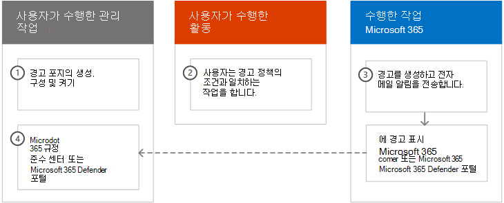
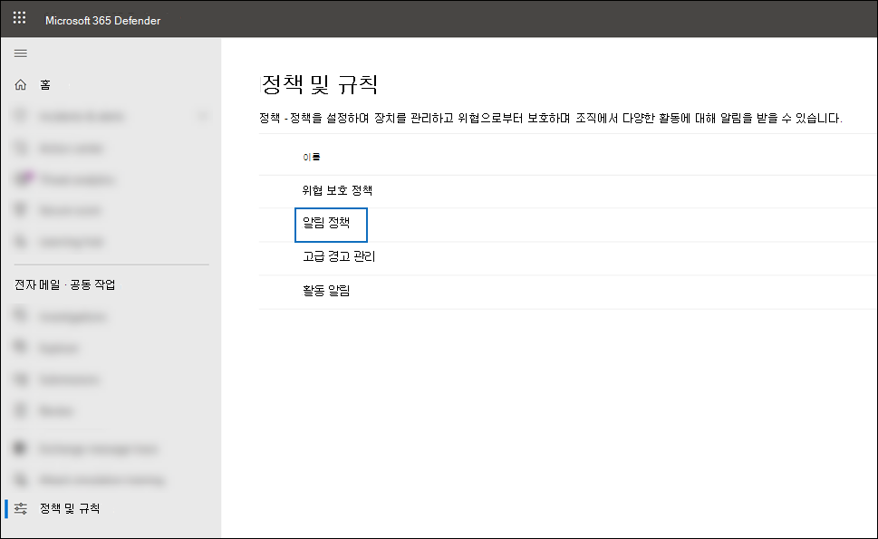
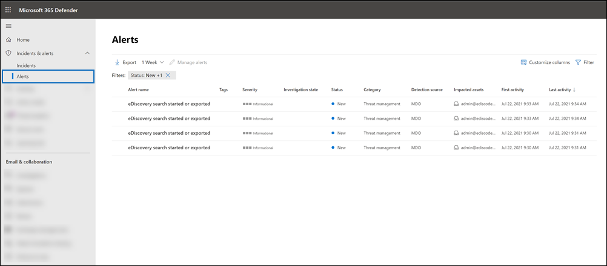
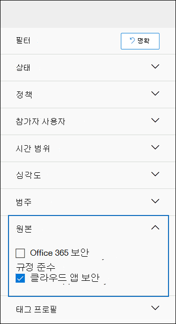

# <a name="alert-policies-in-microsoft-365"></a>Microsoft 365의 알림 정책

Microsoft 365 규정 준수 센터 또는 Microsoft 365 Defender 포털에서 경고 정책 및 경고 대시보드 도구를 사용하여 경고 정책을 만든 다음 사용자가 경고 정책의 조건과 일치하는 활동을 수행할 때 생성되는 경고를 볼 수 있습니다. Exchange Online, 맬웨어 공격, 피싱 캠페인, 비정상적인 파일 삭제 수준 및 외부 공유의 관리자 권한 할당과 같은 활동을 모니터링하는 데 도움이 되는 몇 가지 기본 경고 정책이 있습니다.

경고 정책을 사용하면 정책에 의해 트리거되는 경고를 분류하고, 조직의 모든 사용자에게 정책을 적용하고, 경고가 트리거되는 경우의 임계값 수준을 설정하고, 경고가 트리거될 때 전자 메일 알림을 받을지 여부를 결정할 수 있습니다. 또한 경고를  보고 필터링하고, 경고를 관리할 수 있도록 경고 상태를 설정한 다음, 문제를 해결하거나 해결한 후 경고를 해지할 수 있는 경고 페이지도 있습니다.

> [!NOTE]
> 경고 정책은 미국 정부 E1/Microsoft 365 Enterprise, Office 365 Enterprise 또는 Office 365, E3/F3/G3 또는 E5/G5 구독이 있는 조직에 사용할 수 있습니다. 고급 기능은 E5/G5 구독이 있는 조직 또는 E1/F1/G1 또는 E3/F3/G3 구독이 있는 조직과 Office 365 P2용 Microsoft Defender 또는 Microsoft 365 E5 Compliance E5 eDiscovery 및 감사 추가 기능 구독을 제공하는 조직에서만 사용할 수 있습니다. E5/G5 또는 추가 기능 구독이 필요한 기능은 이 항목에서 강조 표시됩니다. 또한 경고 정책은 Office 365 GCC, High 및 DoD US GCC 환경에서 사용할 수 있습니다.

## <a name="how-alert-policies-work"></a>경고 정책 작동 방식

다음은 경고 정책의 작동 방식과 사용자 또는 관리자 활동이 경고 정책의 조건과 일치할 때 트리거되는 경고에 대한 간략한 개요입니다.



1. 조직의 관리자는 조직 또는 사이트 포털의 경고 정책 페이지를 사용하여  경고 정책을 Microsoft 365 규정 준수 센터 Microsoft 365 Defender 니다. 보안 및 준수 센터 PowerShell에서 [New-ProtectionAlert](/powershell/module/exchange/new-protectionalert) cmdlet을 사용하여 경고 & 수 있습니다.

   경고 정책을 만들하려면 알림 관리 역할 또는 경고 관리 역할 또는 조직 구성 Microsoft 365 규정 준수 센터 수 있습니다.

   > [!NOTE]
   > 정책에 의해 경고가 트리거될 수 있는 경우 경고 정책을 만들거나 업데이트한 후 최대 24시간이 소요됩니다. 이는 정책이 경고 검색 엔진에 동기화해야 하기 때문에입니다.

2. 사용자는 경고 정책의 조건과 일치하는 활동을 수행합니다. 맬웨어 공격의 경우 조직의 사용자에게 전송된 감염된 전자 메일 메시지가 경고를 트리거합니다.

3. Microsoft 365 또는 Defender 포털의 경고 페이지에  표시되는 Microsoft 365 규정 준수 센터 생성됩니다. 또한 경고 정책에 대해 전자 메일 알림을 사용할 수 있는 경우 Microsoft는 받는 사람 목록에 알림을 보냅니다. 관리자 또는 다른 사용자가 경고 페이지에서 볼 수 있는 알림은 사용자에게 할당된 역할에 따라 결정됩니다. 자세한 내용은 경고를 보는 데 필요한 [RBAC 권한을 참조하세요.](#rbac-permissions-required-to-view-alerts)

4. 관리자는 준수 센터에서 알림을 관리합니다. 경고 관리는 모든 조사를 추적하고 관리하는 데 도움이 되는 경고 상태를 할당하는 것으로 구성됩니다.

## <a name="alert-policy-settings"></a>경고 정책 설정

경고 정책은 경고를 생성하는 사용자 또는 관리자 활동을 정의하는 규칙 및 조건 집합, 활동을 수행하는 경우 경고를 트리거하는 사용자 목록 및 경고가 트리거되기 전에 활동이 발생해야 하는 시간을 정의하는 임계값으로 구성됩니다. 또한 정책을 분류하고 심각도 수준을 할당합니다. 이러한 두 설정은 규정 준수 센터에서 정책을 관리하고 경고를 볼 때 이러한 설정을 필터링할 수 있기 때문에 경고 정책 및 정책 조건이 일치할 때 트리거되는 경고를 관리하는 데 도움이 됩니다. 예를 들어 동일한 범주의 조건과 일치하는 경고를 보거나 심각도 수준이 같은 경고를 볼 수 있습니다.

경고 정책을 보고 만들 수 있는 경우:

### <a name="microsoft-365-compliance-center"></a>Microsoft 365 규정 준수 센터

으로 <https://compliance.microsoft.com> 이동한 다음 정책 경고  >  **경고 정책**  >  **을 선택합니다.** 또는 으로 직접 이동하면 <https://compliance.microsoft.com/alertpolicies> 됩니다.


### <a name="microsoft-365-defender-portal"></a>Microsoft 365 Defender 포털

전자 메일 <https://security.microsoft.com> 관리 공동 **작업으로 이동하여** & **정책**& 경고  >  **정책 을 선택합니다.** 또는 으로 직접 이동하면 <https://security.microsoft.com/alertpolicies> 됩니다.



> [!NOTE]
> 준수 센터 또는 Defender 포털에서 경고 정책을 View-Only 관리 역할에 할당해야 합니다. 경고 정책을 만들고 편집하려면 경고 관리 역할을 할당해야 합니다. 자세한 내용은 보안 및 규정 준수 [센터의 사용 권한을 참조하세요.](../security/office-365-security/permissions-in-the-security-and-compliance-center.md)

경고 정책은 다음과 같은 설정 및 조건으로 구성됩니다.

- **경고가 추적하는 활동입니다.** 활동을 추적하는 정책을 만들거나 경우에 따라 외부 사용자와 파일을 공유하거나 액세스 권한을 할당하거나 익명 링크를 만들어서 파일을 공유하는 등의 몇 가지 관련 활동을 만들 수 있습니다. 사용자가 정책에 정의된 활동을 수행하면 경고 임계값 설정에 따라 경고가 트리거됩니다.

    > [!NOTE]
    > 추적할 수 있는 활동은 미국 정부 계획에 따라 조직의 Office 365 Enterprise Office 365 따라 달라집니다. 일반적으로 맬웨어 캠페인 및 피싱 공격과 관련된 활동에는 E5/G5 구독 또는 E1/F1/G1 또는 E3/F3/G3 구독과 함께 Office 365 플랜 2 추가 기능 구독에 대한 [Defender가](../security/office-365-security/defender-for-office-365.md) 필요합니다.

- **활동 조건**. 대부분의 작업에서 경고를 트리거하기 위해 충족해야 하는 추가 조건을 정의할 수 있습니다. 일반적인 조건에는 IP 주소(사용자가 특정 IP 주소 또는 IP 주소 범위 내에서 컴퓨터에서 활동을 수행할 때 경고가 트리거될 수 있도록), 특정 사용자 또는 사용자가 해당 활동을 수행하는 경우 경고가 트리거될지 여부, 활동이 특정 파일 이름 또는 URL에 대해 수행될지 여부가 포함됩니다. 조직의 모든 사용자가 활동을 수행할 때 경고를 트리거하는 조건을 구성할 수도 있습니다. 사용 가능한 조건은 선택한 활동에 따라 달라집니다.

사용자 태그를 경고 정책의 조건으로 정의할 수도 있습니다. 그러면 정책에 의해 트리거된 경고에 영향을 미치는 사용자의 컨텍스트가 포함됩니다. 시스템 사용자 태그 또는 사용자 지정 사용자 태그를 사용할 수 있습니다. 자세한 내용은 Microsoft [Defender for Office 365.](/microsoft-365/security/office-365-security/user-tags)

- **경고가 트리거되는 경우.** 경고가 트리거되기 전에 활동이 발생할 수 있는 시간(%)을 정의하는 설정을 구성할 수 있습니다. 이렇게 하면 활동이 정책 조건과 일치할 때마다, 특정 임계값을 초과하거나, 경고 추적 활동의 발생이 조직에서 비정상적이 될 때마다 경고를 생성하도록 정책을 설정할 수 있습니다.

    

    비정상적인 활동에 따라 설정을 선택하면 Microsoft는 선택한 활동에 대한 일반 빈도를 정의하는 기준 값을 설정합니다. 이 기준을 설정하는 데 최대 7일이 소요되는 동안 경고가 생성되지 않습니다. 기준이 설정되면 경고 정책에 의해 추적되는 활동의 빈도가 기준 값을 크게 초과하면 경고가 트리거됩니다. 감사 관련 활동(예: 파일 및 폴더 활동)의 경우 단일 사용자 또는 조직의 모든 사용자를 기반으로 기준을 설정할 수 있습니다. 맬웨어 관련 활동의 경우 단일 맬웨어 패밀리, 받는 사람 한명 또는 조직의 모든 메시지를 기반으로 기준을 설정할 수 있습니다.

    > [!NOTE]
    > 임계값 또는 비정상적인 활동에 따라 경고 정책을 구성하려면 E5/G5 구독 또는 E1/F1/G1 또는 E3/F3/G3 구독과 함께 Office 365 P2, Microsoft 365 E5 Compliance 또는 Microsoft 365 eDiscovery 및 감사 추가 기능 구독에 대한 Microsoft Defender를 구독해야 합니다. E1/F1/G1 및 E3/F3/G3 구독이 있는 조직은 활동이 발생할 때마다 경고가 트리거되는 경고 정책만 만들 수 있습니다.

- **경고 범주.** 정책에서 생성된 경고를 추적하고 관리하기 위해 정책에 다음 범주 중 하나를 할당하면 됩니다.

  - 데이터 손실 방지

  - 정보 거버넌스

  - 메일 흐름

  - 사용 권한

  - 위협 관리

  - 기타

  경고 정책의 조건과 일치하는 활동이 발생하면 생성된 경고에 이 설정에 정의된 범주로 태그가 지정됩니다. 이렇게 하면 범주에 따라 경고를 정렬하고 필터링할  수 있기 때문에 준수 센터의 경고 페이지에서 동일한 범주 설정이 있는 경고를 추적하고 관리할 수 있습니다.

- **경고 심각도.** 경고 범주와 마찬가지로 심각도 특성(낮음, 중간, 높음 또는 **정보)을** 경고 정책에 할당합니다. 경고 범주와 마찬가지로, 경고 정책의 조건과 일치하는 활동이 발생하면 생성된 경고는 경고 정책에 대해 설정된 심각도 수준과 동일한 심각도 수준으로 태그가 지정됩니다. 또한 경고 페이지에서 심각도 설정이 동일한 경고를 추적하고 관리할 **수** 있습니다. 예를 들어 심각도가 높은 경고만 표시될 수  있도록 경고 목록을 필터링할 수 있습니다.

    > [!TIP]
    > 경고 정책을 설정할 때 사용자에게 배달 후 맬웨어 검색, 중요하거나 분류된 데이터 보기, 외부 사용자와 데이터 공유 또는 데이터 손실 또는 보안 위협을 초래할 수 있는 기타 활동과 같이 심각한 부정적인 결과를 초래할 수 있는 활동에 더 높은 심각도의 할당을 고려해 보십시오. 이렇게 하면 경고 및 작업의 우선 순위를 지정하여 원인을 조사하고 해결하는 데 도움이 됩니다.

- **전자 메일 알림**. 경고가 트리거될 때 사용자 목록에 전자 메일 알림을 보내거나 보내지 못하게 정책을 설정할 수 있습니다. 최대 알림 수에 도달하면 해당 일 동안 경고에 대한 알림이 더 이상 전송되지 못하게 일별 알림 제한을 설정할 수도 있습니다. 전자 메일 알림 외에도 관리자 또는 다른 관리자는 경고 페이지에서 정책에 의해 트리거되는 경고를 볼 **수** 있습니다. 특정 범주의 경고 정책 또는 심각도 설정이 더 높은 전자 메일 알림을 사용하도록 설정하는 것이 있습니다.

## <a name="default-alert-policies"></a>기본 경고 정책

Microsoft는 관리자 권한 남용, Exchange, 잠재적인 외부 및 내부 위협 및 정보 거버넌스 위험을 식별하는 데 도움이 되는 기본 제공 경고 정책을 제공합니다. 경고 **정책 페이지에서** 이러한 기본 제공 정책의 이름은 굵게 표시되고 정책 유형은 시스템으로 **정의됩니다.** 이러한 정책은 기본적으로 켜져 있습니다. 이러한 정책을 끄거나 다시 켜고, 전자 메일 알림을 보낼 받는 사람 목록을 설정하고, 일별 알림 제한을 설정할 수 있습니다. 이러한 정책에 대한 다른 설정은 편집할 수 없습니다.

다음 표에는 사용 가능한 기본 경고 정책과 각 정책이 할당된 범주가 나열되어 있습니다. 범주는 사용자가 경고 페이지에서 볼 수 있는 알림을 결정하는 데 사용됩니다. 자세한 내용은 경고를 보는 데 필요한 [RBAC 권한을 참조하세요.](#rbac-permissions-required-to-view-alerts)

또한 이 표에는 각 요금제에 Office 365 Enterprise Office 365 미국 정부 계획의 기본 계획 및 기본 계획이 표시됩니다. 조직에 E1/F1/G1 또는 E3/F3/G3 구독 외에 적절한 추가 기능 구독이 있는 경우 일부 기본 경고 정책을 사용할 수 있습니다.

| 기본 경고 정책 | 설명 | Category | Enterprise 구독 |
|:-----|:-----|:-----|:-----|
|**악의적인 URL 클릭이 감지되었습니다.**|조직의 링크로 보호된 사용자가 [](../security/office-365-security/safe-links.md) 금고 링크를 클릭할 때 경고를 생성합니다. 이 이벤트는 MICROSOFT Defender에서 URL Office 365 변경 내용이 식별되거나 사용자가 금고 링크 페이지를 Microsoft 365 비즈니스용 금고 정책에 따라 트리거됩니다. 이 경고 정책에는 **심각도 높은** 설정이 있습니다. Office 365 P2, E5, G5 고객용 Defender의 경우 이 경고는 에서 자동으로 자동화된 조사 [및 응답을 Office 365.](../security/office-365-security/office-365-air.md) 이 경고를 트리거하는 이벤트에 대한 자세한 내용은 [Set up 금고 Links policies을 참조하십시오.](../security/office-365-security/set-up-safe-links-policies.md)|위협 관리|E5/G5 또는 Office 365 P2 추가 기능 구독용 Defender|
|**관리자 전송 결과 완료**|관리 제출이 제출된 엔터티의 다시 검색을 완료하면 경고를 생성합니다. [](../security/office-365-security/admin-submission.md) 관리자 제출에서 다시 검색 결과가 렌더링될 때마다 경고가 트리거됩니다. 이러한 알림은 이전 제출의 [](https://compliance.microsoft.com/reportsubmission)결과를 검토하고, 사용자가 보고한 메시지를 제출하여 최신 정책 확인을 받아 결과를 다시 검사하고, 조직의 필터링 정책이 의도한 영향을 미치는지 확인하는 데 도움이 하도록 알리기 위한 것입니다. 이 정책에는 **정보 심각도** 설정이 있습니다.|위협 관리|E1/F1, E3/F3 또는 E5|
|**관리자가 전자 메일에 대한 수동 조사를 트리거했습니다.**|관리자가 위협 탐색기에서 전자 메일에 대한 수동 조사를 트리거하면 경고를 생성합니다. 자세한 내용은 예제: 보안 [관리자가 위협 탐색기에서 조사를 트리거합니다.를 참조하세요.](../security/office-365-security/automated-investigation-response-office.md#example-a-security-administrator-triggers-an-investigation-from-threat-explorer) 이 경고는 조직에 조사가 시작된 것을 알리는 경고입니다. 경고는 경고를 트리거한 사람에 대한 정보를 제공하며 조사에 대한 링크를 포함합니다. 이 정책에는 **정보 심각도** 설정이 있습니다.|위협 관리| E5/G5 또는 Microsoft Defender for Office 365 P2 추가 기능 구독| 
|**전달/리디렉션 규칙 만들기**|조직의 누군가가 메시지를 다른 전자 메일 계정으로 전달하거나 리디렉션하는 사서함에 대한 받은 편지함 규칙을 만들 때 경고를 생성합니다. 이 정책은 PowerShell에서 웹용 Outlook(이전의 Outlook Web App) 또는 Exchange Online 규칙만 추적합니다. 이 정책에는 **정보 심각도** 설정이 있습니다. 받은 편지함 규칙을 사용하여 전자 메일을 전달하고 리디렉션하는 웹용 Outlook 다른 계정으로 메시지를 웹용 Outlook 규칙 사용을 [참조하세요.](https://support.office.com/article/1433e3a0-7fb0-4999-b536-50e05cb67fed)|위협 관리|E1/F1/G1, E3/F3/G3 또는 E5/G5|
|e **eDiscovery 시작 또는 내보내기**|보안 및 준수 센터에서 콘텐츠 검색 도구를 사용하는 경우 경고를 생성합니다. 다음과 같은 콘텐츠 검색 활동이 수행되면 경고가 트리거됩니다. <br/><br/>* 콘텐츠 검색이 시작된 경우<br/>* 콘텐츠 검색 결과를 내보낼 수 있습니다.<br/>* 콘텐츠 검색 보고서 내보내기<br/><br/>eDiscovery 사례와 함께 이전 콘텐츠 검색 활동을 수행할 때도 경고가 트리거됩니다. 이 정책에는 **정보 심각도** 설정이 있습니다. 콘텐츠 검색 활동에 대한 자세한 내용은 감사 로그에서 [eDiscovery 활동 검색을 참조하세요.](search-for-ediscovery-activities-in-the-audit-log.md#ediscovery-activities)|위협 관리|E1/F1/G1, E3/F3/G3 또는 E5/G5|
|**관리자 권한 Exchange 권한 상승**|조직에서 다른 사용자에게 관리 권한이 할당된 경우 Exchange Online 생성합니다. 예를 들어 사용자가 조직의 조직 관리 역할 그룹에 Exchange Online. 이 정책의 **심각도는** 낮음 설정입니다.|사용 권한|E1/F1/G1, E3/F3/G3 또는 E5/G5|
|**악성 파일이 포함된 전자 메일 메시지가 전달 후 제거됨**|악성 파일이 포함된 메시지가 조직의 사서함으로 배달될 때 경고를 생성합니다. 이 이벤트가 발생하면 Microsoft는 제로 아워 자동 제거를 사용하여 Exchange Online 사서함에서 감염된 메시지를 [제거합니다.](../security/office-365-security/zero-hour-auto-purge.md) 이 정책에는 **정보 심각도** 설정이 있으며 에서 자동으로 자동화된 조사 [및 응답을 Office 365.](../security/office-365-security/office-365-air.md) 이 새 정책에 대한 자세한 내용은 Microsoft Defender for [Office 365.](new-defender-alert-policies.md)|위협 관리|E5/G5 또는 Microsoft Defender for Office 365 P2 추가 기능 구독|
|**악성 URL이 포함된 전자 메일 메시지가 전달 후 제거됨**|악의적인 URL이 포함된 메시지가 조직의 사서함으로 배달될 때 경고를 생성합니다. 이 이벤트가 발생하면 Microsoft는 제로 아워 자동 제거를 사용하여 Exchange Online 사서함에서 감염된 메시지를 [제거합니다.](../security/office-365-security/zero-hour-auto-purge.md) 이 정책에는 **정보 심각도** 설정이 있으며 에서 자동으로 자동화된 조사 [및 응답을 Office 365.](../security/office-365-security/office-365-air.md) 이 새 정책에 대한 자세한 내용은 Microsoft Defender for [Office 365.](new-defender-alert-policies.md)|위협 관리|E5/G5 또는 Office 365 P2 추가 기능 구독용 Defender|
|**캠페인의 전자 메일 메시지가 전달되었다가 나중에 제거됨**|캠페인과 연결된 메시지가 조직의 사서함으로 [](../security/office-365-security/campaigns.md) 배달될 때 경고를 생성합니다. 이 이벤트가 발생하면 Microsoft는 제로 아워 자동 제거를 사용하여 Exchange Online 사서함에서 감염된 메시지를 [제거합니다.](../security/office-365-security/zero-hour-auto-purge.md) 이 정책에는 **정보 심각도** 설정이 있으며 에서 자동으로 자동화된 조사 [및 응답을 Office 365.](../security/office-365-security/office-365-air.md) 이 새 정책에 대한 자세한 내용은 Microsoft Defender for [Office 365.](new-defender-alert-policies.md)|위협 관리|E5/G5 또는 Office 365 P2 추가 기능 구독용 Defender|
|**배달 후 제거된 전자 메일 메시지**|악의적인 엔터티(URL 또는 파일)를 포함하지 않는 악의적인 메시지가 조직의 사서함으로 배달될 때 경고를 생성합니다. 이 이벤트가 발생하면 Microsoft는 제로 아워 자동 제거를 사용하여 Exchange Online 사서함에서 감염된 메시지를 [제거합니다.](../security/office-365-security/zero-hour-auto-purge.md) 이 정책에는 **정보 심각도** 설정이 있으며 에서 자동으로 자동화된 조사 [및 응답을 Office 365.](../security/office-365-security/office-365-air.md) 이 새 정책에 대한 자세한 내용은 Microsoft Defender for [Office 365.](new-defender-alert-policies.md)|위협 관리|E5/G5 또는 Office 365 P2 추가 기능 구독용 Defender|
|**사용자가 맬웨어 또는 피싱 메일로 보고한 전자 메일**|조직의 사용자가 보고서 메시지 추가 기능을 사용하여 메시지를 피싱 전자 메일로 보고하면 경고를 생성합니다. 이 정책의 **심각도는** 낮음 설정입니다. 이 추가 기능의 자세한 내용은 보고서 메시지 추가 기능 [사용을 참조하세요.](https://support.office.com/article/b5caa9f1-cdf3-4443-af8c-ff724ea719d2) Office 365 P2, E5, G5 고객용 Defender의 경우 이 경고는 에서 자동으로 자동화된 조사 [및 응답을 Office 365.](../security/office-365-security/office-365-air.md)|위협 관리|E1/F1/G1, E3/F3/G3 또는 E5/G5|
|**전자 메일 보내기 제한 초과**|조직의 누군가가 아웃바운드 스팸 정책에서 허용하는 것보다 많은 메일을 보낸 경우 경고를 생성합니다. 이는 일반적으로 사용자가 너무 많은 전자 메일을 보내거나 계정이 손상될 수 있는 표시입니다. 이 정책에는 **중간** 심각도 설정이 있습니다. 이 경고 정책에 의해 경고가 생성되는 경우 사용자 계정이 손상되어 있는지 [여부를 검사하는 것이 좋습니다.](../security/office-365-security/responding-to-a-compromised-email-account.md)|위협 관리|E1/F1/G1, E3/F3/G3 또는 E5/G5|
|**잠재적인 피싱 시도로 인해 양식이 차단됩니다.**|조직의 누군가가 반복되는 피싱 시도 동작으로 인해 Microsoft Forms를 사용하여 양식을 공유하고 응답을 수집할 수 제한되면 경고를 생성합니다. 이 정책에는 **심각도 높은 설정이** 있습니다.|위협 관리|E1, E3/F3 또는 E5|
|**피싱으로 플래그가 지정 및 확인된 양식**|조직 내에서 Microsoft Forms에서 만든 양식이 보고서 남용을 통해 잠재적인 피싱으로 식별되고 Microsoft에서 피싱으로 확인되면 경고를 생성합니다. 이 정책에는 **심각도 높은** 설정이 있습니다.|위협 관리|E1, E3/F3 또는 E5|
|**메시지가 지연된 경우**|커넥터를 사용하여 Microsoft가 전자 메일 메시지를 사용자 조직 또는 파트너 서버로 배달할 수 없는 경우 경고를 생성합니다. 이 경우 메시지가 큐에 Office 365. 이 경고는 2,000개 이상의 메시지가 1시간 이상 대기 중인 경우 트리거됩니다. 이 정책에는 **심각도 높은** 설정이 있습니다.|메일 흐름|E1/F1/G1, E3/F3/G3 또는 E5/G5|
|**배달 후 검색된 맬웨어 캠페인**|맬웨어가 포함된 비정상적으로 많은 수의 메시지가 조직의 사서함으로 배달될 때 경고를 생성합니다. 이 이벤트가 발생하면 Microsoft는 감염된 메시지를 사서함에서 Exchange Online 제거합니다. 이 정책에는 **심각도 높은** 설정이 있습니다.|위협 관리|E5/G5 또는 Microsoft Defender for Office 365 P2 추가 기능 구독|
|**맬웨어 캠페인 검색 및 차단**|조직의 사용자에게 특정 유형의 맬웨어가 포함된 비정상적으로 많은 수의 전자 메일 메시지를 보내고 시도하면 경고가 생성됩니다. 이 이벤트가 발생하면 감염된 메시지가 Microsoft에서 차단되고 사서함으로 배달되지 않습니다. 이 정책의 **심각도는** 낮음 설정입니다.|위협 관리|E5/G5 또는 Office 365 P2 추가 기능 구독용 Defender|
|**맬웨어 캠페인이 검색된 SharePoint OneDrive**|조직의 특정 사이트 SharePoint 또는 OneDrive 사이트에 있는 파일에서 비정상적으로 많은 맬웨어 또는 바이러스가 감지되면 경고를 생성합니다. 이 정책에는 **심각도 높은** 설정이 있습니다.|위협 관리|E5/G5 또는 Office 365 P2 추가 기능 구독용 Defender|
|**ZAP를 사용하지 않도록 설정되어 있기 때문에 맬웨어가 잠기지 않습니다.**| 피싱 메시지에 대한 자동 제거가 사용하지 않도록 설정되어 있기 때문에 Microsoft가 사서함에 맬웨어 메시지를 Zero-Hour 경고를 생성합니다. 이 정책에는 **정보 심각도** 설정이 있습니다. |위협 관리|E5/G5 또는 Office 365 P2 추가 기능 구독용 Defender|
|**사용자의 정크 메일 폴더를 사용할 수 없습니다.**|Microsoft에서 사용자의 정크 메일 폴더를 사용할 수 없다고 감지하면 경고를 생성하여 높은 신뢰도의 피싱 메시지를 사서함으로 배달할 수 있습니다. 이 정책에는 **정보 심각도** 설정이 있습니다.|위협 관리|E1/F1/G1, E3/F3/G3 또는 E5/G5|
|**ETR을 통해 전달된 피싱**|Microsoft가 높은 신뢰도의 피싱 메시지를 사서함으로 배달할 수 있는 Exchange 전송 규칙(ETR)을 감지하면 경고를 생성합니다. 이 정책에는 **정보 심각도** 설정이 있습니다. 메일 흐름 규칙(메일 Exchange 규칙)에 대한 자세한 내용은 에서 메일 흐름 규칙(전송 [규칙)을 Exchange Online.](/exchange/security-and-compliance/mail-flow-rules/mail-flow-rules)|위협 관리|E1/F1/G1, E3/F3/G3 또는 E5/G5|
|**IP 허용 정책으로 인해 배달된 피싱**|Microsoft가 높은 신뢰도의 피싱 메시지를 사서함으로 배달할 수 있는 IP 허용 정책을 감지하면 경고를 생성합니다. 이 정책에는 **정보 심각도** 설정이 있습니다. IP 허용 정책(연결 필터링)에 대한 자세한 내용은 [Configure the default connection filter policy - Office 365.](../security/office-365-security/configure-the-connection-filter-policy.md)|위협 관리|E1/F1/G1, E3/F3/G3 또는 E5/G5|
|**ZAP를 사용하지 않도록 설정되어 있기 때문에 피싱이 잠기지 않습니다.**| 피싱 메시지에 대한 자동 제거가 사용하지 않도록 설정되어 있기 때문에 Microsoft에서 사서함으로 높은 수준의 피싱 Zero-Hour 감지할 때 경고를 생성합니다. 이 정책에는 **정보 심각도** 설정이 있습니다.|위협 관리|E5/G5 또는 Office 365 P2 추가 기능 구독용 Defender|
|**테넌트 또는** 사용자에 따라 전달된 피싱 <sup>1</sup>|Microsoft에서 사서함으로 피싱 메시지 배달이 허용된 관리자 또는 사용자 다시 정의를 감지하면 경고를 생성합니다. 다시 정의의 예로는 특정 보낸 사람 또는 도메인의 메시지를 허용하는 받은 편지함 또는 메일 흐름 규칙 또는 특정 보낸 사람 또는 도메인의 메시지를 허용하는 스팸 방지 정책이 있습니다. 이 정책에는 **심각도 높은** 설정이 있습니다.|위협 관리|E5/G5 또는 Office 365 P2 추가 기능 구독용 Defender|
|**의심스러운 전자 메일 전달 활동**|조직의 누군가가 의심스러운 외부 계정으로 자동 전자 메일을 보내면 경고를 생성합니다. 이는 계정이 손상된 것일 수 있지만 사용자를 제한할 만큼 심각하지는 않은 동작에 대한 초기 경고입니다. 이 정책에는 **심각도 높은** 설정이 있습니다. 드물지만 이 정책에 의해 생성된 경고는 이상일 수 있습니다. 사용자 계정이 손상 된지 여부를 [확인 하는 것이 좋습니다.](../security/office-365-security/responding-to-a-compromised-email-account.md)|위협 관리|E1/F1/G1, E3/F3/G3 또는 E5/G5|
|**의심스러운 전자 메일 전송 패턴이 감지되었습니다.**|조직의 누군가가 의심스러운 전자 메일을 보내고 전자 메일을 보내지 못하도록 제한될 위험이 있는 경우 경고를 생성합니다. 이는 계정이 손상되지만 사용자를 제한할 만큼 심각하지는 않다는 것을 나타낼 수 있는 동작에 대한 초기 경고입니다. 이 정책에는 **중간** 심각도 설정이 있습니다. 드물지만 이 정책에 의해 생성된 경고는 이상일 수 있습니다. 그러나 사용자 계정이 손상 된지 여부를 확인 하는 [것이 좋습니다.](../security/office-365-security/responding-to-a-compromised-email-account.md)|위협 관리|E1/F1/G1, E3/F3/G3 또는 E5/G5  |
|**전자 메일 보내기 제한 테넌트**|조직의 전자 메일 트래픽이 대부분 의심스러운 것으로 감지되고 Microsoft가 조직에서 전자 메일을 보내지 못하도록 제한한 경우 경고를 생성합니다. 잠재적으로 손상된 사용자 및 관리자 계정, 새 커넥터 또는 오픈 릴레이를 조사한 다음 Microsoft 지원에 문의하여 조직 차단을 해제합니다. 이 정책에는 **심각도 높은** 설정이 있습니다. 조직이 차단되는 이유에 대한 자세한 내용은 에서 오류 코드 [5.7.7xx에](/Exchange/mail-flow-best-practices/non-delivery-reports-in-exchange-online/fix-error-code-5-7-700-through-5-7-750)대한 전자 메일 배달 문제 Exchange Online.|위협 관리|E1/F1/G1, E3/F3/G3 또는 E5/G5|
|**비정상적인 외부 사용자 파일 활동**|조직 외부의 사용자가 SharePoint 또는 OneDrive 파일에 대해 비정상적으로 많은 활동을 수행하면 경고를 생성합니다. 여기에는 파일 액세스, 파일 다운로드, 파일 삭제 등의 활동이 포함됩니다. 이 정책에는 **심각도 높은** 설정이 있습니다.|정보 거버넌스|E5/G5, Office 365 P2용 Microsoft Defender 또는 Microsoft 365 E5 추가 기능 구독|
|**비정상적인 외부 파일 공유 볼륨**|조직 외부의 사용자와 공유하는 SharePoint 또는 OneDrive 수가 비정상적으로 많은 경우 경고를 생성합니다. 이 정책에는 **중간** 심각도 설정이 있습니다.|정보 거버넌스|E5/G5, Office 365 P2용 Defender 또는 Microsoft 365 E5 추가 기능 구독|
|**비정상적인 파일 deletion 볼륨**|비정상적으로 많은 수의 파일이 짧은 기간 내에 SharePoint OneDrive 경우 경고를 생성합니다. 이 정책에는 **중간** 심각도 설정이 있습니다.|정보 거버넌스|E5/G5, Office 365 P2용 Defender 또는 Microsoft 365 E5 추가 기능 구독|
|**피싱 메일로 보고된 전자 메일의 비정상적인 증가**|조직에서 보고서 메시지 추가 기능을 사용하여 메시지를 피싱 메일로 보고하는 Outlook 경우 경고를 생성합니다. 이 정책에는 **중간** 심각도 설정이 있습니다. 이 추가 기능의 자세한 내용은 보고서 메시지 추가 기능 [사용을 참조하세요.](https://support.office.com/article/b5caa9f1-cdf3-4443-af8c-ff724ea719d2)|위협 관리|E5/G5 또는 Office 365 P2 추가 기능 구독용 Defender|
|**받은 편지함/폴더**<sup>1,</sup><sup>2로</sup> 배달된 사용자 가장 피싱|Microsoft에서 관리자 또는 사용자 다시 정의에서 사용자 가장 피싱 메시지를 사서함의 받은 편지함(또는 기타 사용자가 액세스할 수 있는 폴더)으로 배달할 수 있도록 허용한 경우 경고를 생성합니다. 다시 정의의 예로는 특정 보낸 사람 또는 도메인의 메시지를 허용하는 받은 편지함 또는 메일 흐름 규칙 또는 특정 보낸 사람 또는 도메인의 메시지를 허용하는 스팸 방지 정책이 있습니다. 이 정책에는 **중간** 심각도 설정이 있습니다.|위협 관리|E5/G5 또는 Office 365 P2 추가 기능 구독용 Defender|
|**전자 메일 보내기 제한 사용자**|조직의 누군가가 아웃바운드 메일 보내기 제한 시 경고를 생성합니다. 일반적으로 계정이 손상되고 사용자가 계정의 제한된 사용자  페이지에 Microsoft 365 규정 준수 센터. (이 페이지에 액세스하기 위해 위협 관리 > 제한된 > **검토로 이동합니다.** 이 정책에는 **심각도 높은** 설정이 있습니다. 제한된 사용자에 대한 자세한 내용은 스팸 전자 메일을 전송한 후 차단 목록에서 사용자, 도메인 또는 [IP 주소 제거를 참조하세요.](/office365/securitycompliance/removing-user-from-restricted-users-portal-after-spam)|위협 관리|E1/F1/G1, E3/F3/G3 또는 E5/G5|
|**양식 공유 및 응답 수집이 제한된 사용자**|조직의 누군가가 반복되는 피싱 시도 동작으로 인해 Microsoft Forms를 사용하여 양식을 공유하고 응답을 수집할 수 제한되면 경고를 생성합니다. 이 정책에는 **심각도 높은** 설정이 있습니다.|위협 관리|E1, E3/F3 또는 E5|

> [!NOTE]
> <sup>1</sup> 고객 피드백에 따라 이 기본 경고 정책을 일시적으로 제거했습니다. We're working to improve it, and will replace it with a new version in the near future. 그 때까지 다음 설정을 사용하여 이 기능을 대체하는 사용자 지정 경고 정책을 만들 수 있습니다. <ul><li>활동은 배달 시 감지된 피싱 전자 메일입니다.</li> <li>메일이 ZAP가 아닌 경우</li> <li>메일 방향이 인바운드입니다.</li> <li>메일 배달 상태 배달</li> <li>검색 기술은 악성 URL 보존, URL 검색, 고급 피싱 필터, 일반 피싱 필터, 도메인 가장, 사용자 가장 및 브랜드 가장입니다.</li></ul> 피싱 방지 정책에 대한 자세한 Office 365 피싱 방지 및 피싱 방지 정책 설정 을 [참조하세요.](../security/office-365-security/set-up-anti-phishing-policies.md)<br/><br/><sup>2</sup> 이 경고 정책을 다시 생성하기 위해 이전 각주에 있는 지침을 따르지만 사용자 가장을 유일한 검색 기술로 선택하십시오.

일부 기본 제공 정책에서 모니터링하는 비정상적인 활동은 이전에 설명한 경고 임계값 설정과 동일한 프로세스를 기반으로 합니다. Microsoft는 "일반적인" 활동에 대한 일반 빈도를 정의하는 기준 값을 수립합니다. 그런 다음 기본 제공 경고 정책에 의해 추적되는 활동의 빈도가 기준 값을 크게 초과하면 경고가 트리거됩니다.

## <a name="viewing-alerts"></a>경고 보기

조직의 사용자가 수행한 활동이 경고 정책의 설정과 일치하면 규정 준수  센터 또는 Defender 포털의 경고 페이지에 경고가 생성되고 표시됩니다. 경고 정책의 설정에 따라 경고가 트리거될 때 지정된 사용자 목록으로 전자 메일 알림도 전송됩니다. 각 경고에 대해 경고  페이지의 대시보드에는 해당 경고 정책의 이름, 경고의 심각도 및 범주(경고 정책에 정의되어 있으며, 활동이 발생한 횟수)가 표시됩니다. 이 값은 경고 정책의 임계값 설정을 기반으로 합니다. 대시보드에는 각 경고의 상태도 표시됩니다. 상태 속성을 사용하여 경고를 관리하는 데 대한 자세한 내용은 [Managing alerts를 참조하십시오.](#managing-alerts)

경고를 표시하는 경우:

### <a name="microsoft-365-compliance-center"></a>Microsoft 365 규정 준수 센터

 으로 <https://compliance.microsoft.com> 이동한 다음 **경고 를 선택합니다.** 또는 으로 직접 이동하면 <https://compliance.microsoft.com/compliancealerts> 됩니다.


### <a name="microsoft-365-defender-portal"></a>Microsoft 365 Defender 포털

으로 <https://security.microsoft.com> 이동한 다음 **인시던트** 및 &  >  **경고를 선택합니다.** 또는 으로 직접 이동하면 <https://security.microsoft.com/alerts> 됩니다.



다음 필터를 사용하여 경고 페이지에서 모든 경고의 하위 집합을 볼 **수** 있습니다.

- **상태.** 이 필터를 사용하여 특정 상태가 할당된 경고를 표시합니다. 기본 상태는 활성 **입니다.** 사용자 또는 다른 관리자는 상태 값을 변경할 수 있습니다.

- **정책.** 이 필터를 사용하여 하나 이상의 경고 정책 설정과 일치하는 경고를 표시합니다. 또는 모든 경고 정책에 대한 모든 경고를 표시할 수 있습니다.

- **시간 범위입니다.** 이 필터를 사용하여 특정 날짜 및 시간 범위 내에서 생성된 경고를 표시합니다.

- **심각도.** 이 필터를 사용하여 특정 심각도에 할당된 경고를 표시합니다.

- **범주.** 이 필터를 사용하여 하나 이상의 경고 범주에서 경고를 표시합니다.

- **태그.** 이 필터를 사용하여 하나 이상의 사용자 태그에서 경고를 표시합니다. 태그는 경고에 나타나는 태그가 지정한 사서함 또는 사용자를 기준으로 반영됩니다. 자세한 [내용은 Office 356 ATP의](../security/office-365-security/user-tags.md) 사용자 태그를 참조합니다.

- **원본.** 이 필터를 사용하여 준수 센터의 경고 정책에 의해 트리거된 경고나 정책 또는 정책에 의해 Office 365 Cloud App Security 경고를 표시하거나 둘 다를 사용할 수 있습니다. 경고에 대한 Office 365 Cloud App Security 자세한 내용은 [경고 Cloud App Security 보기를 참조하세요.](#viewing-cloud-app-security-alerts)

> [!IMPORTANT]
> 사용자 태그별 필터링 및 정렬은 현재 공개 미리 보기에 있습니다.
> 상업적으로 출시되기 전에 상당수 수정될 수 있습니다. Microsoft는 제공된 정보에 대해 표현적 또는 암시적 보증을하지 않습니다.

## <a name="alert-aggregation"></a>경고 집계

경고 정책의 조건과 일치하는 여러 이벤트가 짧은 기간 동안 발생하는 경우 경고 집계라는 프로세스에 의해 기존 경고에 *추가됩니다.* 이벤트가 경고를 트리거하면 경고가 생성되고 경고  페이지에 표시되고 알림이 전송됩니다. 집계 간격 내에서 동일한 이벤트가 Microsoft 365 경고를 트리거하는 대신 기존 경고에 새 이벤트에 대한 세부 정보를 추가합니다. 경고 집계의 목표는 경고 "피로"를 줄이고 동일한 이벤트에 대한 더 적은 경고에 집중하고 조치를 취할 수 있도록 하는 것입니다.

집계 간격의 길이는 구독에 따라 Office 365 Microsoft 365 있습니다.

|구독|집계 간격|
|:---------|:---------:|
|Office 365 또는 Microsoft 365 E5/G5|1분|
|Office 365용 Defender 플랜 2 |1분|
|E5 준수 추가 기능 또는 E5 검색 및 감사 추가 기능|1분|
|Office 365 또는 Microsoft 365 E1/F1/G1 또는 E3/F3/G3|15분|
|Office 365 요금제 1 또는 Exchange Online Protection|15분|


동일한 경고 정책과 일치하는 이벤트가 집계 간격 내에 발생하면 이후 이벤트에 대한 세부 정보가 원래 경고에 추가됩니다. 모든 이벤트의 경우 집계된 이벤트에 대한 정보가 세부 정보 필드에 표시되고 집계 간격으로 이벤트가 발생한 횟수가 활동/적중 횟수 필드에 표시됩니다. 활동 목록을 통해 모든 집계된 이벤트 인스턴스에 대한 자세한 정보를 볼 수 있습니다.

다음 스크린샷은 4개의 집계된 이벤트가 있는 경고를 보여줍니다. 활동 목록에는 경고와 관련된 4개의 전자 메일 메시지에 대한 정보가 포함되어 있습니다.


경고 집계에 대해 다음에 유의하십시오.

- A potentially **malicious URL click was detected** default alert [policy](#default-alert-policies) are not aggregateed. 이 정책에 의해 트리거되는 경고는 각 사용자 및 전자 메일 메시지에 고유하기 때문에입니다.

- 현재 적중  횟수 경고 속성은 모든 경고 정책에 대해 집계된 이벤트 수를 나타내지 않습니다. 이러한 경고 정책에 의해 트리거되는 경고의 경우 메시지 목록  보기 또는 경고에 대한 활동 보기를 클릭하여 집계된 **이벤트를** 볼 수 있습니다. 모든 경고 정책에 대해 적중 횟수 경고  속성에 나열된 집계된 이벤트 수를 만들기 위해 작업 중입니다.

## <a name="rbac-permissions-required-to-view-alerts"></a>경고를 보는 데 필요한 RBAC 권한

조직의 사용자에게 할당된 RBAC(역할 기반 액세스 제어) 권한에 따라 경고 페이지에서  사용자에게 표시될 수 있는 경고가 결정됩니다. 어떻게 이 작업을 수행하나요? Microsoft 365 규정 준수 센터 또는 Microsoft 365 Defender 포털에서 역할 그룹의 구성원 자격에 따라 사용자에게 할당되는 관리 역할은 경고 페이지에서 사용자에게 볼 수  있는 경고 범주를 지정합니다. 다음은 몇 가지 예입니다.

- 레코드 관리 역할 그룹의 구성원은 정보 거버넌스 범주가 할당된 경고 정책에 의해 생성된 경고만 **볼 수** 있습니다.

- 준수 관리자 역할 그룹의 구성원은 위협 관리 범주가 할당된 경고 정책에 의해 생성된 경고를 볼 **수** 없습니다.

- 할당된 역할 중 어떤 역할도 경고 범주의 경고를 볼 수 있는 권한을 제공하지 못하기 때문에 eDiscovery 관리자 역할 그룹의 구성원은 경고를 볼 수 없습니다.

RBAC 사용 권한에 따라 이 디자인을 사용하면 조직의 특정 작업 역할에 있는 사용자가 보고 관리할 수 있는 알림을 결정할 수 있습니다.

다음 표에는 6가지 다른 경고 범주의 경고를 보는 데 필요한 역할이 나열되어 있습니다. 표의 첫 번째 열에는 Microsoft 365 규정 준수 센터 포털의 모든 역할이 Microsoft 365 Defender 나열됩니다.  확인 표시는 해당 역할이 할당된 사용자가 위쪽 행에 나열된 해당 경고 범주의 경고를 볼 수 있도록 나타냅니다.

기본 경고 정책이 할당된 범주를 표시하는 경우 기본 경고 정책의 [표를 참조합니다.](#default-alert-policies)

|역할|정보 거버넌스|데이터 손실 방지|메일 흐름|사용 권한|위협 관리|기타|
|:---------|:---------:|:---------:|:---------:|:---------:|:---------:|:---------:|
|감사 로그|||||||
|사례 관리|||||||
|규정 준수 관리자|||||||
|준수 검색|||||||
|디바이스 관리|||||||
|Disposition Management|||||||
|DLP 규정 준수 관리|||||||
|내보내기|||||||
|Hold|||||||
|정보 보호 분석가|||||||
|정보 보호 조사자|||||||
|알림 관리|||||||
|조직 구성|||||||
|Preview|||||||
|레코드 관리|||||||
|보존 관리|||||||
|검토|||||||
|RMS 암호 해독|||||||
|역할 관리|||||||
|검색 및 제거|||||||
|보안 관리자|||||||
|보안 읽기 권한자||||||
|서비스 보증 보기|||||||
|관리 검토 관리자|||||||
|보기 전용 감사 로그|||||||
|View-Only 관리|||||||
|View-Only DLP 준수 관리|||||||
|View-Only 관리|||||||
|보기 전용 받는 사람|||||||
|View-Only 레코드 관리|||||||
|View-Only 보존 관리|||||||


> [!TIP]
> 각 기본 역할 그룹에 할당된 역할을 보기 위해 보안 및 준수 센터 PowerShell에서 & 실행합니다.
> 
> ```powershell
> $RoleGroups = Get-RoleGroup
> ```
> 
> ```powershell
> $RoleGroups | foreach {Write-Output -InputObject `r`n,$_.Name,"-----------------------"; Get-RoleGroup $_.Identity | Select-Object -ExpandProperty Roles}
> ```
>
> 또한 그룹 또는 웹 사이트 포털에서 역할 그룹에 할당된 역할을 Microsoft 365 규정 준수 센터 Microsoft 365 Defender 있습니다. 사용 권한 **페이지로** 이동하여 역할 그룹을 선택합니다. 할당된 역할은 플라이아웃 페이지에 나열됩니다.

## <a name="managing-alerts"></a>경고 관리

규정 준수 센터의 경고 페이지에  경고가 생성되고 표시되면 경고를 평가하고 조사하고 해결할 수 있습니다. 사용자에게 경고에 대한 액세스 권한을 부여하는 [동일한 RBAC](#rbac-permissions-required-to-view-alerts) 권한도 경고를 관리할 수 있습니다.

다음은 경고를 관리하기 위해 수행할 수 있는 몇 가지 작업입니다.

- **경고에 상태를 할당합니다.** 경고에 활성(기본값), 조사 중,  해결 또는 해지 중 하나를 경고에 할당할 **수 있습니다.**  그런 다음 이 설정을 필터링하여 상태 설정이 같은 경고를 표시할 수 있습니다. 이 상태 설정은 경고 관리 프로세스를 추적하는 데 도움이 될 수 있습니다.

- **경고 세부 정보를 시청합니다.** 경고를 선택하여 경고에 대한 세부 정보가 있는 플라이아웃 페이지를 표시할 수 있습니다. 자세한 정보는 해당 경고 정책에 따라 달라지지만 일반적으로 다음을 포함합니다.

  - cmdlet 또는 감사 로그 작업과 같이 경고를 트리거한 실제 작업의 이름입니다.

  - 경고를 트리거한 활동에 대한 설명입니다.

  - 경고를 트리거한 사용자(또는 사용자 목록)입니다. 단일 사용자 또는 단일 활동을 추적하도록 설정된 경고 정책에만 포함됩니다.

  - 경고에 의해 추적된 활동이 수행된 횟수입니다. 경고가 더 많이 트리거될 수 있기 때문에 이 수치가 경고 페이지에 나열된 실제 관련 경고 수와 일치하지 않을 수 있습니다.

  - 경고를 트리거한 각 활동에 대한 항목이 포함된 활동 목록에 대한 링크입니다. 이 목록의 각 항목은 활동이 발생한 시간, 실제 작업의 이름(예: "FileDeleted"), 활동을 수행한 사용자, 활동이 수행된 개체(예: 파일, eDiscovery 사례 또는 사서함) 및 사용자 컴퓨터의 IP 주소를 식별합니다. 맬웨어 관련 경고의 경우 이 링크는 메시지 목록에 연결됩니다.

  - 해당 경고 정책의 이름 및 링크입니다.

- **전자 메일 알림을 표시하지 않습니다.** 경고에 대한 플라이아웃 페이지에서 전자 메일 알림을 끄거나 표시하지 않습니다. 전자 메일 알림을 표시하지 않는 경우 경고 정책의 조건과 일치하는 활동 또는 이벤트가 발생할 때 Microsoft에서 알림을 보내지 않습니다. 그러나 사용자가 수행한 활동이 경고 정책의 조건과 일치하면 경고가 트리거됩니다. 경고 정책을 편집하여 전자 메일 알림을 해제할 수도 있습니다.

- **경고를 해결합니다.** 플라이아웃 페이지에서 경고를 해결된 것으로 표시하여 경고 상태를 해결된 경고로 **설정하는 데 사용할 수 있습니다.** 필터를 변경하지 않으면 해결된 알림이 경고 페이지에 **표시되지** 않습니다.

## <a name="viewing-cloud-app-security-alerts"></a>경고 Cloud App Security 보기

정책에 의해 트리거되는 Office 365 Cloud App Security 규정 준수 센터의  경고 페이지에 표시됩니다. 여기에는 활동 정책에 의해 트리거되는 경고와 해당 정책의 이상 검색 정책에 의해 트리거되는 경고가 Office 365 Cloud App Security. 즉, 준수 센터에서 모든 경고를 볼 수 있습니다. Office 365 Cloud App Security E5 또는 OFFICE 365 ENTERPRISE US Government G5 구독을 Office 365 조직에서만 사용할 수 있습니다. 자세한 내용은 Overview [of Cloud App Security.](/cloud-app-security/what-is-cloud-app-security)

Microsoft Cloud App Security E5 Enterprise Mobility + Security 독립 실행형 서비스로 등록된 조직은 에서 Cloud App Security 앱 및 서비스와 관련된 Microsoft 365 알림을 볼 수도 있습니다. Microsoft 365 규정 준수 센터 또는 Microsoft 365 Defender 포털입니다.

준수 Cloud App Security Defender 포털에서 경고만 표시하려면 원본 필터를  사용하여 를 **Cloud App Security.**



준수 센터의 경고 정책에 의해 트리거되는 경고와 마찬가지로 경고에 대한 세부 Cloud App Security 플라이아웃 페이지를 표시할 수 있습니다. 경고에는 세부 정보를 보고, Cloud App Security 관리하기 위한 링크와 경고를 트리거한 해당 Cloud App Security 정책에 대한 링크가 포함되어 있습니다. 에서 [경고 모니터링을 Cloud App Security.](/cloud-app-security/monitor-alerts)


> [!IMPORTANT]
> 준수 센터에서 Cloud App Security 경고의 상태를 변경하면 Cloud App Security 포털에서 동일한 경고의 해결 상태가 업데이트되지 않습니다. 예를 들어 준수 센터에서 경고의  상태를 해결된 것으로 표시하면 알림 포털에서 경고의 Cloud App Security 변경되지 않습니다. 알림 경고를 Cloud App Security 해결하거나 Cloud App Security 포털에서 관리합니다.
