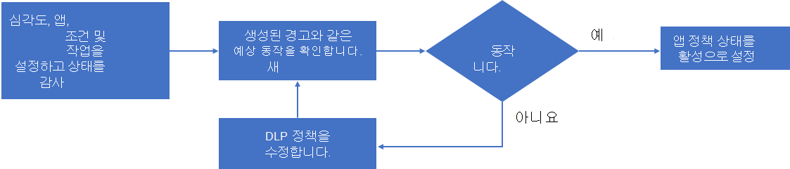

# 앱 정책 만들기

>*[보안 및 규정 준수를 위한 Microsoft 365 라이선싱 지침](https://aka.ms/ComplianceSD).*

비정상적인 앱 동작을 감지하고 경고를 생성하는 기본 제공 기능 집합과 함께 Microsoft 앱 거버넌스의 앱 정책은 다음을 수행할 수 있는 방법입니다.

- 앱 거버넌스가 자동 또는 수동 수정을 위해 앱 동작을 경고할 수 있는 조건을 지정합니다.
- 조직에 대한 앱 준수 정책을 구현합니다.

사용자 지정할 수 있는 제공된 템플릿에서 앱 정책을 만들거나 사용자 지정 앱 정책을 만들 수 있습니다.

새 앱 정책을 만들려면 **Microsoft 365 준수 센터 > 앱 및 거버넌스 > 개요 페이지 > 정책** 으로 이동합니다.

- 앱 사용용으로 디자인된 템플릿을 사용하여 새 앱 정책을 만들려면 **앱 사용 정책 만들기** 아래에서 **정책 만들기** 를 선택합니다.
- 앱 사용 권한용으로 디자인된 템플릿을 사용하여 새 앱 정책을 만들려면 **사용 권한 정책 만들기** 에서 **정책 만들기** 를 선택합니다.
- 앱 인증 또는 사용자 지정 정책에 대한 새 앱 정책을 만들려면 **새 항목 만들기** 를 선택합니다.

## 앱 정책 템플릿

앱 정책 템플릿을 기반으로 새 앱 정책을 만들려면 **앱 정책 템플릿 선택 페이지** 에서 앱 템플릿 범주를 선택하고 템플릿의 이름을 선택한 다음 **다음** 을 선택합니다.

앱 거버넌스에는 세 가지 범주의 앱 정책 템플릿이 있습니다.

### 앱 사용자 및 데이터 액세스

앱 거버넌스에는 앱 사용에 대한 경고를 생성하는 이러한 템플릿이 포함되어 있습니다.

 

****

|서식 파일 이름|설명|
|---|---|
|많은 양의 데이터 액세스 권한이 있는 새 앱|해당 데이터 패턴을 예상할 수 있도록 대용량 데이터 액세스 권한이 있는 최근 등록된 앱을 강조 표시합니다. 
 기본적으로이 정책은 지난 7일 동안 등록되고, 해당 기간에 데이터 액세스가 1GB 이상인 모든 앱에 플래그를 지정합니다. 이 정책은 추가 조건 및 작업으로 사용자 지정할 수 있습니다.|
|||

### 앱 사용 권한

앱 거버넌스에는 앱 사용 권한에 대한 경고를 생성하는 이러한 템플릿이 포함되어 있습니다.

 

****

|서식 파일 이름|설명|
|---|---|
|과도한 권한이 있는 앱|잠재적인 사용 권한 감소에 대한 기회를 식별하기 위해 해당 앱에서 사용하는 것보다 권한이 더 많은 모든 앱을 강조 표시합니다. 
 기본적으로 이 정책은 90일 동안 사용되지 않는 경우 과도한 권한 보유로 표시된 모든 앱에 플래그를 지정합니다. 이 기간 필터는 더 많은 조건 및 작업으로 사용자 지정할 수 있습니다.|
|높은 권한이 있는 새 앱|추가 조사가 필요할 수 있는 잠재적으로 큰 공간을 차지하는 앱을 식별하도록 사용 권한이 높은 모든 새 앱을 강조 표시합니다. 
 기본적으로 이 정책은 높은 사용 권한이 있는 지난 7일 동안 등록된 모든 앱에 플래그를 지정합니다.|
 |비 Graph 권한이 있는 새 앱|비 Graph API에 대한 권한이 있는 모든 새 앱을 강조 표시하여 최신 보안 업데이트를 받지 못하거나 나중에 지원되지 않을 수 있는 API를 식별하고 검토합니다.
 
 기본적으로 이 정책은 비 Graph 권한이 있는 지난 7일 동안 등록된 모든 앱에 플래그를 지정합니다.|
|||

### M365 인증

앱 거버넌스에는 M365 인증에 대한 경고를 생성하는 이러한 템플릿이 포함되어 있습니다.

 

****

|서식 파일 이름|설명|
|---|---|
|인증되지 않은 새 앱|테넌트에서 예상되도록 M365 인증 프로세스를 거치지 않은 새 앱을 강조 표시합니다. 
 기본적으로 이 정책은 지난 7일 동안 등록되어 인증되지 않은 모든 앱에 플래그를 지정합니다.|
|||

## 사용자 지정 앱 정책

기본 제공 템플릿 중 하나에서 아직 수행하지 않은 작업을 수행해야 하는 경우 사용자 지정 앱 정책을 사용합니다.

새 사용자 지정 앱 정책을 만들려면 먼저 **정책** 페이지에서 **새 항목 만들기** 를 선택합니다. **앱 정책 템플릿 선택 페이지** 에서 **사용자 지정** 범주, **사용자 지정 정책** 템플릿을 선택한 다음 **다음** 을 선택합니다.

**이름 및 설명** 페이지에서 다음을 구성합니다.

- 정책 이름

- 정책 설명

- 이 정책에서 생성된 경고의 심각도를 설정하는 정책 심각도를 선택합니다.

  - High
  - Medium
  - 낮음

**정책 설정 및 조건 선택** 페이지에서 **이 정책이 적용할 수 있는 앱** 에 대해 다음을 선택합니다.

- 모든 앱
- 특정 앱 선택

  창에서 하나 이상의 앱을 선택할 수 있습니다. **추가** 를 선택합니다.

**다음** 을 선택합니다.

**정책 설정 및 조건 선택** 페이지에서 **정책에 대한 새 조건 설정** 을 선택한 후 **다음** 을 선택합니다.

**규칙 만들기** 창을 사용하여 새 규칙의 조건을 선택할 수 있습니다. **조건 추가** 를 선택하고 조건 목록에서 선택한 다음 조건 값을 지정합니다. 여러 조건을 추가할 수 있습니다.

다음은 사용자 지정 앱 정책에 사용할 수 있는 조건입니다.

 

****

|조건|조건 값 수락됨|추가 정보|
|---|---|---|
|앱 등록 기간|지난 X일 이내||
|앱 인증|기본 규정 준수, MCAS 규정 준수 또는 해당 없음|[Microsoft 365 인증](/microsoft-365-app-certification/docs/enterprise-app-certification-guide)|
|게시자 검증|예 또는 아니요|[게시자 확인](/azure/active-directory/develop/publisher-verification-overview)|
|응용 프로그램 사용 권한|목록에서 하나 이상의 API 권한 선택|[Microsoft Graph 권한 참조](/graph/permissions-reference)|
|위임된 권한|목록에서 하나 이상의 API 권한 선택|[Microsoft Graph 권한 참조](/graph/permissions-reference)|
|높은 권한|예 또는 아니요|MCAS에서 사용하는 동일한 논리를 기반으로 하는 내부 지정입니다.|
|과도한 권한이 있는 앱|예 또는 아니요|해당 앱에서 사용하는 것보다 더 많은 권한이 부여된 앱입니다.|
|비 Graph API 권한|예 또는 아니요|Graph API 권한이 없는 앱입니다.|
|앱 데이터 액세스|시간당 XGB 데이터 액세스보다 큼||
|앱 데이터 액세스 추세|지난 7일 간의 데이터 사용량 X% 증가||
|앱 API 액세스|시간당 X API 호출보다 큼||
|앱 API 액세스 추세|지난 7일 동안 API 호출 증가 비율은 X%입니다.||
|동의한 사용자|(초과 또는 미만) X 동의한 사용자||
|우선 순위 사용자 동의|예 또는 아니요|[우선 순위 계정](/microsoft-365/admin/setup/priority-accounts)이 있는 사용자입니다.|
|앱에 동의한 사용자|목록에서 사용자 선택||
|사용자의 역할 동의|Teams 관리자, 디렉터리 읽기 권한자, 보안 읽기 권한자, 준수 관리자, 보안 관리자, 기술 지원팀 관리자, SharePoint 관리자, Exchange 관리자, 전역 읽기 권한자, 전역 관리자, 준수 데이터 관리자, 사용자 관리자, 서비스 지원 관리자 중 하나 이상을 선택합니다.|여러 항목을 선택할 수 있습니다. 
 할당된 멤버가 있는 모든 Azure AD 역할을 이 목록에서 사용할 수 있어야 합니다.|
|액세스된 워크로드|OneDrive 및/또는 SharePoint 및/또는 Exchange|여러 항목을 선택할 수 있습니다.|
|오류율|오류율이 지난 7일 동안 X%보다 크며, 여기서 X는 관리자가 정의한 값입니다.||
||||

경고를 생성하려면 이 앱 정책에 대한 지정된 모든 조건을 충족해야 합니다.

조건 지정이 완료되면 **저장** 을 선택한 후 **다음** 을 선택합니다.

**정책 작업 정의** 페이지에서 이 정책을 기반으로 하는 경고가 생성될 때 앱 거버넌스에서 앱을 사용하지 않도록 설정하려면 **앱 사용 안 함** 을 선택한 후 **다음** 을 선택합니다.

**정책 상태 정의** 페이지에서 다음 옵션 중 하나를 선택합니다.

- **감사 모드**: 정책이 평가되지만 구성된 작업은 발생하지 않습니다. 감사 모드 정책은 정책 목록에 **감사** 상태로 표시됩니다.
- **활성**: 정책이 평가되고 구성된 작업이 발생합니다.
- **비활성**: 정책이 평가되지 않으며 구성된 작업이 발생하지 않습니다.

## 사용자 지정 정책 만들기

앱 거버넌스는 테넌트에서 앱을 모니터링하는 데 유용한 정책을 쉽게 만들 수 있는 몇 가지 기본 템플릿을 제공합니다.

1. 앱 거버넌스 페이지에서 **정책** 탭을 선택합니다.
1. **정책 만들기** 를 선택합니다.
1. **범주** 에서 **사용자 지정** 을 선택합니다. **템플릿** 에서 **사용자 지정 정책** 을 선택합니다. **다음** 을 선택합니다.
1. 정책 이름을 입력하고 설명을 입력한 다음 **정책 심각도** 드롭다운 목록에서 심각도를 선택합니다. **다음** 을 선택합니다.
1. **아니요, 정책을 사용자 지정하겠습니다** 를 선택한 후 **다음** 을 선택합니다.
1. 이 정책을 테넌트 내의 모든 앱에 적용할지 아니면 특정 앱을 선택할지 선택합니다. 이 정책에 대한 특정 앱을 선택하는 경우 **앱 추가** 를 선택하고 목록에서 원하는 앱을 선택합니다. **앱 선택** 창에서 이 정책을 적용할 앱을 여러 개 선택한 다음 **추가** 를 선택합니다. 목록에 만족하면 **다음** 을 선택합니다.
1. **정책에 대해 새 조건 설정** 을 선택한 다음 **조건 편집** 을 선택합니다. **조건 추가** 를 선택하고 목록에서 조건을 선택한 다음 적용할 조건을 선택합니다. 조건을 더 추가하려면 반복합니다. **저장** 을 선택하여 규칙을 저장하고 규칙 추가가 완료되면 **다음** 을 선택합니다.
1. 기본적으로 이 정책은 조건이 충족될 때 경고를 트리거합니다. **앱 사용 안 함** 과 같은 정책이 트리거될 때 작업을 수행하도록 선택할 수 있습니다. 정책이 사용자 및 합법적인 앱 사용에 영향을 줄 수 있으므로 작업을 적용할 때는 주의해야 합니다. **다음** 을 선택합니다.
1. 정책 상태를 선택합니다.
    - **감사** - 정책 평가가 활성화되어 있지만, 정책 동작은 활성화되어 있지 않습니다.
    - **활성화** - 정책 평가 및 작업은 활성화되어 있습니다.
    - **비활성화** - 정책 평가 및 작업은 비활성화되어 있습니다.
  
    새 정책을 테스트하려면 감사 모드를 사용해야 합니다. **다음** 을 선택합니다.
1. 사용자 지정 정책의 모든 매개 변수를 신중하게 검토합니다. 만족하면 **제출** 을 선택합니다. 설정 아래에서 **편집** 을 선택하여 설정을 변경할 수도 있습니다.

## 새 앱 정책 테스트 및 모니터링

이제 앱 정책이 만들어졌으므로 **정책** 페이지에서 모니터링하여 테스트 중에 예상되는 활성 경고 수 및 총 경고를 등록하고 있는지 확인해야 합니다.

경고 수가 예기치 않게 낮은 값인 경우 앱 정책의 설정을 편집하여 상태를 설정하기 전에 올바르게 구성했는지 확인합니다.

다음은 새 정책을 만들고 테스트한 다음 활성화하는 프로세스의 예입니다.

1. 심각도, 앱, 조건 및 작업을 초기 값으로 설정하고 상태를 **감사 모드** 로 설정하여 새 정책을 만듭니다.
2. 생성된 경고와 같은 예상 동작을 확인합니다.
3. 동작이 필요하지 않은 경우 필요에 따라 정책 앱, 조건 및 작업 설정을 편집하고 2단계로 돌아갑니다.
4. 동작이 필요한 경우 정책을 편집하고 상태를 **활성** 으로 변경합니다.

## 다음 단계

[앱 정책을 관리합니다.](app-governance-app-policies-manage.md)
