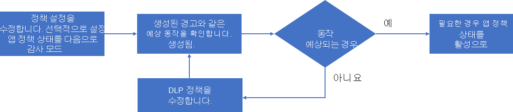

# 앱 정책 관리

>*[보안 및 규정 준수를 위한 Microsoft 365 라이선싱 지침](https://aka.ms/ComplianceSD).*

조직에서 사용 중인 최신 앱을 파악하고, 새 앱 기반 공격에 대응하고, 앱 준수 요구 사항에 대한 지속적인 변경을 위해 다음과 같은 방법으로 앱 정책을 관리해야 합니다.

- 새 앱을 대상으로 하는 새 정책 만들기
- 기존 정책의 상태 변경(활성, 비활성, 감사 모드)
- 기존 정책의 조건 변경
- 경고 자동 수정을 위한 기존 정책의 작업 변경

기존 정책을 관리하는 프로세스의 예는 다음과 같습니다.

1. 정책을 편집합니다.

  - 정책 설정을 변경합니다.
  - 필요한 경우 테스트를 위해 상태를 **감사 모드** 로 변경합니다.

2. 생성된 경고와 같은 예상 동작을 확인합니다.
1. 동작이 예상되지 않는 경우 1단계로 돌아갑니다.
1. 동작이 필요한 경우 정책을 편집하고 상태를 활성으로 변경합니다(필요한 경우).

## 앱 정책 구성 편집

기존 앱 정책의 구성을 변경하려면 다음을 수행합니다.

- 정책 목록에서 정책을 선택한 다음, 앱 정책 창에서 **편집** 을 선택합니다.
- 세로 타원을 사용하여 목록에서 정책을 선택한 다음 **편집** 을 선택합니다.

**편집 정책** 페이지의 경우 페이지를 단계별로 실행하고 적절하게 변경합니다.

- **설명**: 정책의 목적을 더 쉽게 이해할 수 있도록 설명을 변경합니다.
- **심각도**
- **정책 설정**: 정책이 적용되는 앱 집합을 변경합니다. 기존 조건을 사용하거나 조건을 수정하도록 선택할 수도 있습니다.
- **작업**: 정책에 의해 생성된 경고의 자동 수정 작업을 변경합니다.
- **상태**: 정책 상태를 변경합니다.

## 앱 정책 삭제

앱 정책을 삭제하려면 다음을 수행합니다.

- 정책 목록에서 정책을 선택한 다음, 앱 정책 창에서 **삭제** 를 선택합니다.
- 세로 타원을 사용하여 목록에서 정책을 선택한 다음 **삭제** 를 선택합니다.

앱 정책을 삭제하는 대신 상태를 비활성으로 변경할 수 있습니다. 비활성 상태가 되면 경고가 생성되지 않습니다. 예를 들어 향후 정책에 유용한 특정 조건 집합이 있는 앱에 대한 앱 정책을 삭제하는 대신 앱 정책의 이름을 변경하여 유용성을 나타내고 상태를 비활성으로 설정합니다. 나중에 정책으로 돌아가서 비슷한 앱을 수정하고 상태를 감사 모드 또는 비활성으로 설정할 수 있습니다.
