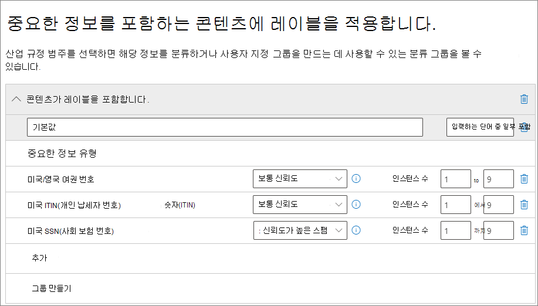
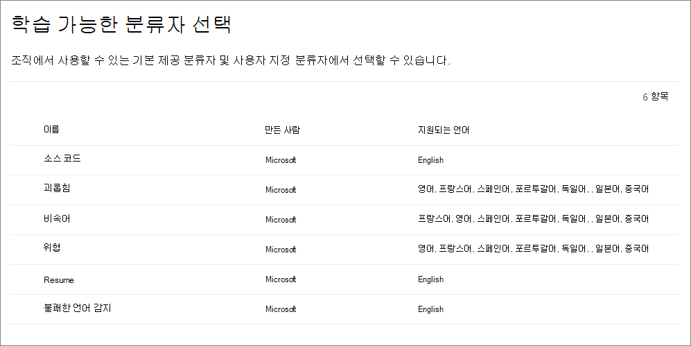

# <a name="automatically-apply-a-retention-label-to-retain-or-delete-content"></a>보존 레이블 자동 적용하여 콘텐츠를 보존 또는 삭제하기

>*[보안 및 규정 준수를 위한 Microsoft 365 라이선싱 지침](/office365/servicedescriptions/microsoft-365-service-descriptions/microsoft-365-tenantlevel-services-licensing-guidance/microsoft-365-security-compliance-licensing-guidance).*

> [!NOTE]
> 이 시나리오는 SharePoint의 문서 세트나 라이브러리 또는 Exchange의 폴더와 같은 구성 구조에 대한 [규정 레코드](records-management.md#records) 또는 기본 레이블을 지원하지 않습니다. 이러한 시나리오에는 [게시된 보존 레이블 정책](create-apply-retention-labels.md#step-2-publish-retention-labels)이 필요합니다.

[보존 레이블](retention.md)의 가장 강력한 기능 중 하나는 명시된 조건과 일치하는 콘텐츠에 자동으로 레이블을 적용하는 기능입니다. 이 경우 조직의 사용자는 보존 레이블을 적용할 필요가 없습니다. Microsoft 365에서 이러한 작업을 자동으로 수행합니다.
  
자동 적용 보존 레이블은 다음과 같은 이유 때문에 강력합니다.
  
- 사용자에게 모든 분류를 교육할 필요가 없습니다.
    
- 모든 콘텐츠를 올바르게 분류하기 위해 사용자에게 의존할 필요가 없습니다.
    
- 사용자가 더 이상 데이터 거버넌스 정책을 알아야 할 필요가 없으며, 업무에 집중할 수 있습니다.
    
콘텐츠에 아직 보존 레이블이 적용되어 있지 않고 중요한 정보, 키워드 또는 검색 가능한 속성 또는 [학습 가능한 분류자](classifier-get-started-with.md)에 대한 일치 항목이 포함되어 있는 경우 콘텐츠에 보존 레이블을 자동으로 적용할 수 있습니다. 이제 미리 보기에서 SharePoint 또는 OneDrive에 저장된 클라우드 첨부 파일에 보존 레이블을 자동으로 적용할 수도 있습니다.

> [!TIP]
> 검색 가능한 속성을 사용하여 [Teams 모임 녹음/녹화](#microsoft-teams-meeting-recordings) 및 [민감도 레이블이 적용된 항목](#identify-files-and-emails-that-have-a-sensitivity-label)을 식별합니다.

다음 조건에 따라 보존 레이블을 자동으로 적용하는 프로세스:


두 가지 관리 단계를 수행하려면 다음 지침을 사용합니다.

> [!NOTE]
> 자동 정책은 항목에 자동으로 보존 레이블을 적용하기 위해 조건과 함께 서비스 측 레이블을 사용합니다. 다음을 수행할 때 보존 레이블을 레이블 정책과 함께 자동으로 적용할 수도 있습니다. 
>
> - SharePoint Syntex의 문서 이해 모델에 보존 레이블을 적용합니다.
> - SharePoint 및 Outlook에 대한 기본 보존 레이블 적용
> - Outlook 규칙을 사용하여 전자 메일에 보존 레이블 적용
>
> 이 시나리오의 경우 [앱에서 보존 레이블 만들기 및 적용하기](create-apply-retention-labels.md)를 참조하세요.

## <a name="before-you-begin"></a>시작하기 전에

조직의 전역 관리자는 보존 레이블과 해당 정책을 만들고 편집할 수 있는 모든 권한을 가지고 있습니다. 전역 관리자로 로그인하지 않은 경우 [보존 정책 및 보존 레이블을 만들고 관리하는 데 필요한 권한](get-started-with-retention.md#permissions-required-to-create-and-manage-retention-policies-and-retention-labels)을 참조하세요.

보존 레이블 정책을 만들기 전에 **적응형** 또는 **정적** 정책인지 결정합니다. 자세한 내용은 [보존을 위한 적응형 또는 정적 정책 범위](retention.md#adaptive-or-static-policy-scopes-for-retention)를 참조하세요. 적응형 정책을 사용하기로 결정한 경우 보존 레이블 정책을 만들기 전에 하나 이상의 적응형 범위를 만든 다음 보존 레이블 정책 만들기 프로세스 중 범위를 선택해야 합니다. 자세한 내용은 [적응형 범위에 대한 구성 정보](retention-settings.md#configuration-information-for-adaptive-scopes)를 참조하세요.

## <a name="how-to-auto-apply-a-retention-label"></a>보존 레이블을 자동으로 적용하는 방법

먼저 보존 레이블을 만듭니다. 그런 다음 해당 레이블을 적용하는 자동 정책을 만듭니다. 보존 레이블을 이미 만든 경우에는 [자동 정책 만들기](#step-2-create-an-auto-apply-policy)로 건너뜁니다.

탐색 지침은 [레코드 관리](records-management.md)를 사용 중인지에 따라 달라집니다. 두 시나리오 모두에 대한 지침이 제공됩니다.

### <a name="step-1-create-a-retention-label"></a>1단계: 보존 레이블 만들기

1. [Microsoft 365 규정 준수 센터](https://compliance.microsoft.com/)에서 다음의 위치 중 한 곳으로 이동합니다.
    
    - 레코드 관리를 사용하는 경우:
        - **솔루션** > **레코드 관리** > **파일 계획** 탭 > **+ 레이블 만들기** > **보존 레이블**
        
    - 레코드 관리를 사용하지 않는 경우:
       - **솔루션** > **정보 관리** > **레이블** tab > + **레이블 만들기**
    
    탐색 창에 솔루션이 즉시 표시되지 않나요? 먼저 **모두 표시** 를 선택합니다. 

2. 구성에 표시되는 메시지를 따릅니다.
    
    보존 설정에 대한 자세한 내용은 [콘텐츠 보존 및 삭제 설정](retention-settings.md#settings-for-retaining-and-deleting-content)을 참조하세요. 그러나 레이블이 [클라우드 첨부 파일](#auto-apply-labels-to-cloud-attachments)에 사용되는 경우 보존 기간의 시작을 **항목에 레이블이 지정된 경우** 로 구성해야 합니다.
    
    레코드 관리를 사용하는 경우:
    
    - 파일 계획 설명자에 대한 자세한 내용은 [파일 계획을 사용하여 보존 레이블 관리의 개요](file-plan-manager.md)를 참조하세요
    
    - 보존 레이블을 사용하여 레코드를 선언하려면 **항목을 레코드로 표시** 를 선택하거나 **항목을 규제 레코드로 표시** 를 선택합니다. 자세한 정보는 [레코드를 선언하도록 보존 레이블 구성하기](declare-records.md#configuring-retention-labels-to-declare-records)를 참조하세요.

3. 레이블을 만든 후 레이블을 게시하거나 레이블을 자동 적용하거나 레이블을 저장하는 옵션이 표시되면 **특정 콘텐츠 유형에 이 레이블 자동 적용** 을 선택한 다음 **완료** 를 선택합니다. 

기존 레이블을 수정하려면 레이블을 선택한 다음 **레이블 편집** 옵션을 선택하여 2단계의 레이블 설명과 [적격 설정](#updating-retention-labels-and-their-policies)을 변경할 수 있는 **보존 레이블 편집** 구성을 시작합니다.

### <a name="step-2-create-an-auto-apply-policy"></a>2단계: 자동 적용 정책 만들기

자동 적용 정책을 만들 때 지정한 조건에 따라 콘텐츠에 자동으로 적용할 보존 레이블을 선택합니다.

1. [Microsoft 365 규정 준수 센터](https://compliance.microsoft.com/)에서 다음의 위치 중 한 곳으로 이동합니다.
    
    - 레코드 관리를 사용하는 경우: **정보 거버넌스**
        - **솔루션** > **레코드 관리** > **레이블 정책** 탭 > **레이블 자동 적용**
    
    - 레코드 관리를 사용하지 않는 경우:
        - **솔루션** > **정보 거버넌스** > **레이블 정책** 탭 > **레이블 자동 적용**
    
    탐색 창에 솔루션이 즉시 표시되지 않나요? 먼저 **모두 표시** 를 선택합니다. 

2. 이 자동 레이블 지정 정책의 이름과 설명을 입력하고 **다음** 을 선택합니다.

3. **이 레이블을 적용할 콘텐츠 형식을 선택** 에서 사용 가능한 조건 중 하나를 선택합니다. 선택 항목에 대한 자세한 내용은 이 페이지의 [보존 레이블 자동 적용 조건 구성](#configuring-conditions-for-auto-apply-retention-labels) 섹션을 참조하세요.

4. **생성할 보존 정책 유형 선택** 페이지에서 [시작하기 전](#before-you-begin) 지침에서 선택한 항목에 따라 **적응형** 또는 **정적** 을 선택합니다. 적응형 범위를 아직 만들지 않은 경우 **적응형** 을 선택할 수는 있지만 선택할 적응형 범위가 없기 때문에 이 옵션으로 마법사를 완료할 수 없습니다.

5. 선택한 범위에 따라:
    
    - **적응형** 을 선택한 경우: **적응형 정책 범위 및 위치 선택** 페이지에서 **범위 추가** 를 선택하고 생성된 적응형 범위를 하나 이상 선택합니다. 그런 다음 위치를 하나 이상 ​​선택합니다. 선택할 수 있는 위치는 추가된 [범위 유형](retention-settings.md#configuration-information-for-adaptive-scopes)에 따라 다릅니다. 예를 들어 **사용자** 의 범위 유형만 추가한 경우 **Exchange 이메일** 은 선택할 수 있지만 **SharePoint 사이트** 는 선택할 수 없습니다. 
    
    - **정적** 을 선택한 경우: **위치 선택** 페이지에서 위치를 켜거나 끕니다. 각 위치를 기본값으로 둬서 [정책을 전체 위치에 적용](retention-settings.md#a-policy-that-applies-to-entire-locations)하거나 [포함 및 제외를 지정](retention-settings.md#a-policy-with-specific-inclusions-or-exclusions)합니다.
    
    위치 선택에 대한 자세한 내용은 [위치](retention-settings.md#locations)를 참조하세요.

6. 마법사에서 표시되는 메시지에 따라 보존 레이블을 선택하고, 구성 선택을 검토하고 제출합니다.

기존 자동 적용 정책을 편집하려면 정책을 선택하고 선택한 보존 레이블과 모든 [적격 설정](#updating-retention-labels-and-their-policies)을 2단계에서 변경하도록 해주는 **보존 정책 구성 편집** 을 시작합니다.

자동 적용 레이블 정책을 사용하여 콘텐츠에 레이블을 지정한 후에는 콘텐츠 또는 정책을 변경하거나 새 자동 적용 레이블 정책을 사용하여 적용된 레이블을 자동으로 제거하거나 변경할 수 없습니다. 자세한 내용은 [한 번에 하나의 보존 레이블만](retention.md#only-one-retention-label-at-a-time)을 참조하세요.

> [!NOTE]
> 자동 적용 보존 레이블 정책은 콘텐츠에 적용되는 기존 보존 레이블을 대체하지 않습니다. 구성한 조건을 사용하여 콘텐츠 레이블을 다시 지정하려면 기존 콘텐츠에서 현재 보존 레이블을 수동으로 제거해야 합니다.

### <a name="configuring-conditions-for-auto-apply-retention-labels"></a>보존 레이블 자동 적용에 대한 조건 구성하기

콘텐츠에 다음이 포함될 경우, 콘텐츠에 자동으로 보존 레이블을 적용할 수 있습니다.

- [특정 중요한 정보 유형](#auto-apply-labels-to-content-with-specific-types-of-sensitive-information)

- [만든 쿼리와 일치하는 특정 키워드 또는 검색 가능한 속성](#auto-apply-labels-to-content-with-keywords-or-searchable-properties)

- [학습 가능한 분류자와 일치](#auto-apply-labels-to-content-by-using-trainable-classifiers)

또는 새로 공유된 [클라우드 첨부 파일](#auto-apply-labels-to-cloud-attachments)에 보존 레이블을 자동으로 적용할 수 있습니다.

중요한 정보, 키워드 또는 검색 가능한 속성 또는 학습 가능한 분류자를 기반으로 자동 적용되도록 보존 레이블을 구성하는 경우 다음 표를 사용하여 보존 레이블을 자동으로 적용할 수 있는 시기를 식별하세요.

Exchange:

|조건|전송 중인 항목(전송 또는 수신) |기존 항목(미사용 데이터)|
|:-----|:-----|:-----|
|중요한 정보 유형 - 기본 제공| 예 | 아니요 |
|중요한 정보 유형 - 사용자 지정| 예 | 아니요 |
|특정 키워드 또는 검색 가능한 속성| 예 |예 |
|학습 가능한 분류자| 예 | 예(지난 6개월만 해당) |

SharePoint 및 OneDrive:

|조건|새 항목 또는 수정된 항목 |기존 항목(미사용 데이터)|
|:-----|:-----|:-----|
|중요한 정보 유형 - 기본 제공| 예 | 예 |
|중요한 정보 유형 - 사용자 지정| 예 | 아니요 |
|특정 키워드 또는 검색 가능한 속성| 예 |예 |
|학습 가능한 분류자| 예 | 예(지난 6개월만 해당) |

또한 초안 상태에 있거나 게시되지 않은 SharePoint 항목은 이 시나리오에서 지원되지 않습니다.

#### <a name="auto-apply-labels-to-content-with-specific-types-of-sensitive-information"></a>특정 유형의 중요한 정보가 있는 콘텐츠에 레이블 자동 적용

> [!IMPORTANT]
> 중요한 정보를 식별하여 자동 적용하는 전자 메일의 경우 Microsoft 365 그룹의 사서함을 포함하여 모든 사서함이 자동으로 포함됩니다.
> 
> 그룹 사서함은 일반적으로 **Microsoft 365 그룹** 위치를 선택하여 포함되지만 이 특정 정책 구성의 경우 그룹 위치에는 Microsoft 365 그룹에 연결된 SharePoint 사이트만 포함됩니다.

중요한 정보에 대한 자동 적용 보존 레이블 정책을 만들면 DLP(데이터 손실 방지) 정책을 만들 때 같은 정책 템플릿 목록이 표시됩니다. 각 템플릿은 특정 중요한 정보 유형을 찾도록 미리 구성되어 있습니다. 다음 예에서 중요한 정보 유형은 **개인 정보** 범주 및 **미국 PII(개인 식별 정보) 데이터** 서식 파일에서 가져온 것입니다.



중요한 정보 유형에 대한 자세한 내용은 [중요한 정보 유형 엔터티 정의](sensitive-information-type-entity-definitions.md)를 참조하세요. 현재 이 시나리오에서는 [정확한 데이터 일치](create-custom-sensitive-information-types-with-exact-data-match-based-classification.md) 및 [문서 지문](document-fingerprinting.md)이 지원되지 않습니다.

정책 서식 파일을 선택한 후에는 모든 유형의 중요한 정보를 추가하거나 제거할 수 있으며, 신뢰 수준 및 인스턴스 수를 변경할 수 있습니다. 이전 예제 스크린샷에서는 다음과 같은 경우에만 보존 라벨이 자동으로 적용되도록 이러한 옵션이 변경되었습니다.
  
- 검색된 중요한 정보 유형의 일치 정확도(또는 [신뢰 수준](sensitive-information-type-learn-about.md#more-on-confidence-levels))는 중요한 정보 유형 중 2개에 대해 **중간 신뢰도** 이상이며 1개에 대해 **높은 신뢰도** 를 갖습니다. 많은 중요한 정보 유형은 여러 패턴으로 정의되는데 일치 정확도가 높은 패턴에서는 더 많은 증거(예: 키워드, 날짜 또는 주소)가 검색되어야 하는 반면 일치 정확도가 낮은 패턴은 증거가 덜 요구됩니다. 신뢰 수준이 낮을수록 콘텐츠가 조건과 일치하기가 더 쉽지만 더 많은 가양성이 발생할 수 있습니다.

- 콘텐츠는 이러한 세 가지 중요한 정보 유형 중 어느 유형의 1~9개 인스턴스를 포함합니다. **시작** 값의 기본값은 **모두** 입니다.

이러한 옵션에 대한 자세한 내용은 를 쉽게 찾을 수 있도록 하기 위해 DLP 문서에서 다음 지침을 참조하세요. [일치하기 더욱 쉽게 혹은 어렵게 만드는 튜닝 규칙](data-loss-prevention-policies.md#tuning-rules-to-make-them-easier-or-harder-to-match) 

중요한 정보 유형을 사용하여 보존 레이블을 자동으로 적용할 때 고려해야 할 사항은 다음과 같습니다.

- 사용자 지정 중요한 정보 유형을 사용하는 경우 SharePoint 및 OneDrive의 기존 항목에 자동 레이블을 지정할 수 없습니다.

- 이메일의 경우 포함하거나 제외할 특정 수신자를 선택할 수 없습니다. **모든 수신자** 설정만 지원되며 이 구성의 경우에만 Microsoft 365 그룹의 사서함이 포함됩니다. 

#### <a name="auto-apply-labels-to-content-with-keywords-or-searchable-properties"></a>키워드 또는 검색 가능 속성이 있는 콘텐츠에 레이블 자동 적용

검색 가능한 속성의 특정 단어, 구 또는 값을 포함하는 쿼리를 사용하여 콘텐츠에 레이블을 자동으로 적용할 수 있습니다. AND, OR 및 NOT과 같은 검색 연산자를 사용하여 쿼리를 세분화할 수 있습니다.


KQL(키워드 쿼리 언어)에 대한 자세한 내용은 [KQL(키워드 쿼리 언어) 구문 참조](/sharepoint/dev/general-development/keyword-query-language-kql-syntax-reference)를 참조하세요.

쿼리 기반 자동 적용 정책은 eDiscovery 콘텐츠 검색과 동일한 검색 색인을 사용하여 콘텐츠를 식별합니다. 사용할 수 있는 검색 가능 속성에 대한 자세한 내용은 [내용 검색](keyword-queries-and-search-conditions.md)에 대한 키워드 쿼리 및 검색 조건을 참조합니다.

키워드 또는 검색 가능 속성을 사용하여 보존 레이블을 자동으로 적용할 때 고려해야 할 몇 가지 사항은 다음과 같습니다.

- SharePoint의 경우 이러한 KQL 쿼리에 대해 크롤링된 속성과 사용자 지정 속성이 지원되지 않으므로 문서에 미리 정의된 관리 속성만 사용해야 합니다. 그러나 기본적으로 리파이너로 사용하도록 설정된 미리 정의된 관리 속성((RefinableDate00-19, RefinableString00-99, RefinableInt00-49, RefinableDecimals00-09 및 RefinableDouble00-09)으로 테넌트 수준에서 매핑을 사용할 수 있습니다. 자세한 내용은 [SharePoint 서버](/SharePoint/technical-reference/crawled-and-managed-properties-overview)에서 탐색 및 관리 속성에 대한 개요를 참조하고, 지침은 [새 관리 속성](/sharepoint/manage-search-schema#create-a-new-managed-property)을(를) 참조합니다.

- 사용자 지정 속성을 고정 속성 중 하나에 매핑하는 경우 KQL 쿼리에서 보존 레이블에 사용하기 전에 24시간을 기다립니다.

- 별칭을 사용하여 SharePoint 관리 속성의 이름을 변경할 수 있지만 레이블의 KQL 쿼리에 이 속성을 사용하지 않습니다. 관리 속성의 실제 이름을 항상 지정합니다(예: "RefableString01").

- 공백이나 특수 문자가 포함된 값을 검색하려면 큰 따옴표(`" "`)를 사용하여 구를 포함하세요. 예를 들어, `subject:"Financial Statements"`

- URL을 기준으로 항목을 일치시키려면 *Path* 대신 *DocumentLink* 속성을 사용하세요. 

- 접미사 와일드카드 검색(예: `*cat`) 또는 부분 문자열 와일드카드 검색(예: `*cat*`)은 지원되지 않습니다. 그러나, 접두사 와일드카드 검색(예: `cat*`)이 지원됩니다.

- 부분적으로 인덱싱된 항목은 예상된 항목에 레이블을 지정하지 않거나 NOT 연산자를 사용할 때 레이블 지정에서 제외될 것으로 예상되는 항목에 레이블을 지정하지 않는 데 책임이 있을 수 있습니다. 자세한 내용은 [콘텐츠 검색에서 부분적으로 인덱싱된 항목](partially-indexed-items-in-content-search.md)을 참조하세요.


예제 쿼리:

| 워크로드 | 예제 |
|:-----|:-----|
|Exchange   | `subject:"Financial Statements"` |
|Exchange   | `recipients:garthf@contoso.com` |
|SharePoint | `contenttype:document` |
|SharePoint | `site:https://contoso.sharepoint.com/sites/teams/procurement AND contenttype:document`|
|Exchange 또는 SharePoint | `"customer information" OR "private"`|

더 복잡한 예:

다음 SharePoint 쿼리는 해당 파일에 키워드 **password**, **passwords** 또는 **pw** 이 포함된 경우 Word 문서 또는 Excel 스프레드시트를 식별합니다.

```
(password OR passwords OR pw) AND (filetype:doc* OR filetype:xls*)
```

다음 Exchange 쿼리는 해당 문서가 이메일에 첨부될 때 **nda** 또는 **비공개 계약** 구문이 포함된 Word 문서 또는 PDF를 식별합니다.

```
(nda OR "non disclosure agreement") AND (attachmentnames:.doc* OR attachmentnames:.pdf)
```

SharePoint에 대한 다음 쿼리는 신용 카드 번호가 포함된 문서를 식별합니다. 

```
sensitivetype:"credit card number"
```

다음 쿼리에는 법적 내용이 포함된 문서 또는 전자 메일을 식별하는 데 도움이 되는 일반적인 키워드가 포함되어 있습니다.

```
ACP OR (Attorney Client Privilege*) OR (AC Privilege)
```

다음 쿼리는 인력진의 문서 또는 전자 메일을 식별하는 데 도움이 되는 일반적인 키워드를 포함합니다. 

```
(resume AND staff AND employee AND salary AND recruitment AND candidate)
```

이 최종 예제에서는 키워드 사이에 연산자를 항상 포함하는 최상의 방법을 사용합니다. 키워드(또는 두 개의 속성:값 식) 사이에 공백이 있으면 AND를 사용한 것과 같습니다. 항상 연산자를 추가하면 이 예제 쿼리는 키워드를 포함하는 내용 대신 이러한 키워드를 모두 포함하는 내용만 식별합니다. 키워드가 포함된 내용을 식별하려는 경우 AND 대신 OR을 지정합니다. 이 예에서 알 수 있듯이, 연산자를 항상 지정하면 쿼리를 올바르게 해석하는 것이 더 쉽습니다. 

##### <a name="microsoft-teams-meeting-recordings"></a>Microsoft Teams 모임 녹음/녹화

> [!NOTE]
> Teams 모임 녹음/녹화를 유지하고 삭제하는 기능은 기록이 OneDrive 또는 SharePoint에 저장되기 전에는 작동하지 않습니다. 자세한 정보는 [모임 녹음/녹화에 비즈니스용 OneDrive 및 SharePoint 또는 Stream 사용](/MicrosoftTeams/tmr-meeting-recording-change)을 참조하세요.

사용자의 OneDrive 계정 또는 SharePoint에 저장된 Microsoft Teams 모임 녹음/녹화를 식별하려면 **키워드 쿼리 편집기** 에 대해 다음을 지정합니다.

```
ProgID:Media AND ProgID:Meeting
```

대부분의 경우 모임 녹음/녹화는 OneDrive에 저장되지만, 채널 모임의 경우에는 SharePoint에 저장됩니다.

##### <a name="identify-files-and-emails-that-have-a-sensitivity-label"></a>민감도 레이블이 있는 파일 및 전자 메일 식별

특정 [민감도 레이블](sensitivity-labels.md)이 적용된 SharePoint나 OneDrive 및 Exchange 전자 메일의 파일을 식별하려면 **키워드 쿼리 편집기** 에 대해 다음을 지정합니다.

```
InformationProtectionLabelId:<GUID>
```

GUID를 찾으려면 [Get-Label](/powershell/module/exchange/get-label) cmdlet을 [보안 및 준수 센터 PowerShell](/powershell/exchange/scc-powershell)에서 사용합니다.

````powershell
Get-Label | Format-Table -Property DisplayName, Name, Guid
````

#### <a name="auto-apply-labels-to-content-by-using-trainable-classifiers"></a>학습 가능한 분류자를 사용하여 콘텐츠에 레이블 자동 적용

학습 가능한 분류자 옵션을 선택하는 경우 미리 학습된 분류자 또는 사용자 지정 학습 가능한 분류자 하나 이상을 선택할 수 있습니다.



> [!CAUTION]
> 많은 수의 가양성을 생성하는 관계로 미리 학습된 **불쾌감을 주는 언어** 분류자는 사용을 중단합니다. 이 분류자를 사용하지 마세요. 만약 현재 사용 중이라면 이 옵션을 사용하지 않도록 비즈니스 프로세스를 변경하고, 대신 미리 학습된 **표적 괴롭힘**, **욕설**, **위협** 분류자를 사용하는 것이 좋습니다.

이 옵션을 사용하여 레이블을 자동으로 적용하려면 SharePoint 사이트 및 사서함에 10MB 이상의 데이터가 있어야 합니다.

학습 가능한 분류자에 대한 자세한 내용은 [학습 가능한 분류자에 대한 자세한 정보](classifier-learn-about.md)를 참조하세요.

> [!TIP]
> Trainable 분류자를 Exchange에 사용하는 경우 [콘텐츠 탐색기에서 분류자를 재학습하는 방법](classifier-how-to-retrain-content-explorer.md)을 참조하세요.

교육 가능한 분류자를 사용하여 보존 레이블을 자동으로 적용할 때 고려해야 할 사항은 다음과 같습니다.

- 6개월보다 오래된 SharePoint 및 OneDrive 항목에는 자동 레이블을 지정할 수 없습니다.

#### <a name="auto-apply-labels-to-cloud-attachments"></a>클라우드 첨부 파일에 레이블 자동 적용

> [!NOTE]
> 이 옵션은 미리 보기에서 점진적으로 출시되며 변경될 수 있습니다.

통신을 통해 전송되는 테넌트의 모든 파일 복사본을 캡처하고 유지해야 하는 경우 이 옵션을 사용해야 할 수 있습니다. 통신 서비스 자체, Exchange 및 Teams에 대한 보존 정책과 함께 이 옵션을 사용합니다.

> [!IMPORTANT]
> 클라우드 첨부 파일에 보존 레이블을 자동 적용하는 데 사용할 레이블을 선택할 때 레이블 보존 설정 **보존 기간 시작 기준** 이 **항목에 레이블이 지정된 경우** 인지 확인하세요.

최신 첨부 파일이라고도 하는 클라우드 첨부 파일은 클라우드에 저장된 파일에 대한 포함된 링크를 사용하는 공유 메커니즘입니다. 버전 제어와 같은 공동 작업 혜택이 있는 공유 콘텐츠를 위한 중앙 집중식 저장소를 지원합니다. 클라우드 첨부 파일은 파일의 첨부 복사본이나 파일에 대한 URL 텍스트 링크가 아닙니다. [Outlook](/office365/troubleshoot/retention/cannot-retain-cloud-attachments#cloud-attachments-in-outlook) 및 [Teams](/office365/troubleshoot/retention/cannot-retain-cloud-attachments#cloud-attachments-in-teams)에서 지원되는 클라우드 첨부 파일에 대한 시각적 체크리스트를 참조하는 것이 도움이 될 수 있습니다.

클라우드 첨부 파일에 보존 레이블을 적용하는 옵션을 선택하면 규정 준수를 위해 공유 시 해당 파일의 복사본이 생성됩니다. 그러면 선택한 보존 레이블이 eDiscovery를 사용하여 식별할 수 있는 사본에 적용됩니다. 사용자는 보존 라이브러리에 저장된 사본을 인식하지 못합니다. 보존 레이블은 메시지 자체 또는 원본 파일에 적용되지 않습니다.

파일을 수정하고 다시 공유하면 파일의 새 복사본이 자료 보존 라이브러리에 새 버전으로 저장됩니다. **항목에 레이블이 지정된 경우** 레이블 설정을 사용해야 하는 이유를 비롯한 자세한 내용은 [클라우드 첨부 파일에서 보존 기능이 작동하는 방식](retention-policies-sharepoint.md#how-retention-works-with-cloud-attachments)을 참조하세요.

이 옵션에 대해 지원되는 클라우드 첨부 파일은 SharePoint 및 OneDrive에 저장된 문서, 비디오 및 이미지와 같은 파일입니다. Teams의 경우 채팅 메시지에서 공유되는 클라우드 첨부 파일과 표준 및 비공개 채널이 지원됩니다. Teams 또는 Outlook 이외의 모임 초대 및 앱을 통해 공유되는 클라우드 첨부 파일은 지원되지 않습니다.

이 옵션에 필수는 아니지만 공유 버전을 정확하게 캡처할 수 있도록 SharePoint 사이트 및 OneDrive 계정에 대해 버전 관리가 활성화되어 있는지 확인하는 것이 좋습니다. 버전 관리가 사용하도록 설정되지 않은 경우 사용 가능한 마지막 버전이 유지됩니다. 초안 또는 게시된 적이 없는 문서는 지원되지 않습니다.

클라우드 첨부 파일에 보존 레이블을 자동 적용하는 데 사용할 레이블을 선택할 때 레이블 보존 설정 **보존 기간 시작 기준** 이 **항목에 레이블이 지정된 경우** 인지 확인하세요. 

이 옵션의 위치를 ​​구성할 때 다음을 선택할 수 있습니다.

- SharePoint 커뮤니케이션 사이트에 저장된 공유 파일용 **SharePoint 사이트**, Microsoft 365 그룹으로 연결되지 않은 팀 사이트 및 기본 사이트. 
- Microsoft 365 그룹으로 연결된 팀 사이트에 저장된 공유 파일용 **Microsoft 365 그룹**.
- 사용자의 OneDrive에 저장된 공유 파일에 대한 **OneDrive 계정**.

원본 파일, 전자 메일 메시지 또는 Teams 메시지를 보존하거나 삭제하려면 별도의 보존 정책을 만들어야 합니다.

> [!NOTE]
> 보존된 클라우드 첨부 파일이 포함된 메시지와 동시에 만료되도록 하려면 보존 레이블이 동일하도록 보존한 다음 Exchange 및 Teams에 대한 보존 정책과 같은 조치 및 타이밍을 삭제하도록 구성합니다.

클라우드 첨부 파일에 보존 레이블을 자동 적용할 때 고려할 사항:

- 새로 공유된 클라우드 첨부 파일에만 보존 레이블이 자동 지정됩니다.

- Teams 및 Outlook 외부에서 공유되는 클라우드 첨부 파일은 지원되지 않습니다.

- 다음 항목은 보존할 수 있는 클라우드 첨부 파일로 지원되지 않습니다.
    - SharePoint 사이트, 페이지, 목록, 양식, 폴더, 문서 세트 및 OneNote 페이지.
    - 해당 파일에 대한 액세스 권한이 없는 사용자가 공유한 파일.
    - 클라우드 첨부 파일이 전송되기 전에 삭제된 파일. 이는 사용자가 파일을 계속 사용할 수 있는지 먼저 확인하지 않고 다른 메시지에서 이전에 공유한 첨부 파일을 복사하여 붙여넣는 경우 발생할 수 있습니다. 또는 파일이 삭제되었을 때 누군가가 오래된 메시지를 전달합니다.
    - 조직 외부의 게스트 또는 사용자가 공유하는 파일.
    - 초안 이메일 및 전송되지 않은 메시지의 파일.
    - 빈 파일.

## <a name="how-long-it-takes-for-retention-labels-to-take-effect"></a>보존 레이블이 적용되는 데 걸리는 시간

중요한 정보, 키워드 또는 검색 가능한 속성 또는 학습 가능한 분류자를 기반으로 보존 레이블을 자동으로 적용하는 경우 보존 레이블을 적용하는 데 최대 7일이 걸릴 수 있습니다.
  


7일 후에 레이블이 표시되지 않는 경우, 준수 센터의 **레이블 정책** 페이지에서 자동 적용 정책을 선택하여 그 **상태** 를 확인합니다. **꺼짐(오류)** 의 상태가 표시되고 위치에 대한 세부 정보에 정책을 배포하거나(SharePoint의 경우) 혹은 정책 재배포를 시도하는 데(OneDrive의 경우) 예상보다 시간이 오래 걸리고 있다는 메시지가 표시되는 경우, [Set-RetentionCompliancePolicy](/powershell/module/exchange/set-retentioncompliancepolicy) PowerShell 명령을 실행하여 정책 배포를 다시 시도하세요.

1. [보안 및 준수 센터 PowerShell에 연결](/powershell/exchange/connect-to-scc-powershell)합니다.

2. 다음 명령을 실행합니다.
    
    ```PowerShell
    Set-RetentionCompliancePolicy -Identity <policy name> -RetryDistribution
    ```

## <a name="updating-retention-labels-and-their-policies"></a>보존 레이블과 해당 정책 업데이트하기

중요한 정보, 키워드 또는 검색 가능한 속성 또는 학습 가능한 분류자와 일치하도록 구성된 보존 레이블 정책 자동 적용: 정책의 보존 레이블이 이미 콘텐츠에 적용된 경우 선택한 레이블 및 정책에 대한 구성 변경 사항은 새로 식별된 콘텐츠와 더불어 이 콘텐츠에 자동으로 적용됩니다.

클라우드 첨부 파일에 대해 구성된 보존 레이블 정책 자동 적용: 이 정책은 기존 파일이 아닌 새로 공유된 파일에 적용되기 때문에 선택한 레이블 및 정책에 대한 구성 변경 사항은 새로 공유된 콘텐츠에만 자동으로 적용됩니다.

다음 내용을 포함하는 레이블이나 정책을 만들고 저장한 후에는 일부 설정을 변경할 수 없습니다.
- 보존 레이블 및 정책 이름과 보존 기간을 제외한 보존 설정입니다. 그러나 항목에 레이블이 지정된 시기를 기준으로 보존 기간을 변경할 수는 없습니다.
- 항목을 레코드로 표시하는 옵션입니다.

### <a name="deleting-retention-labels"></a>보존 레이블 제거

이벤트 기반 보존을 위해 구성되지 않은 보존 레이블 정책에 현재 포함되지 않은 보존 레이블을 삭제하거나 항목을 규정 레코드로 표시할 수 있습니다.

삭제할 수 있는 보존 레이블의 경우, 항목에 적용된 경우 삭제가 실패하고 레이블링된 항목을 식별하기 위한 내용 탐색기에 대한 링크가 표시됩니다.

그러나 콘텐츠 탐색기에서 레이블이 지정된 항목을 표시하는 데 최대 이틀이 걸릴 수 있습니다. 이 시나리오에서는 콘텐츠 탐색기에 대한 링크를 표시하지 않고 보존 레이블을 삭제할 수 있습니다.

## <a name="locking-the-policy-to-prevent-changes"></a>변경 방지를 위한 정책 잠금

아무도 정책을 끄거나, 삭제하거나, 제한 수준을 낮출 수 없도록 하려면, [보존 정책 및 보존 레이블 정책 변경을 제한하기 위한 보존 잠금 사용](retention-preservation-lock.md)을 참조하세요.

## <a name="next-steps"></a>다음 단계

SharePoint에서 관리 속성에 자동 적용 보존 레이블 정책을 사용하는 예제 시나리오와 보존 기간을 시작하는 이벤트 기반 보존에 대한 자세한 내용은 [보존 레이블을 사용하여 SharePoint에 저장된 문서의 수명 주기를 관리](auto-apply-retention-labels-scenario.md)를 참조하세요.
