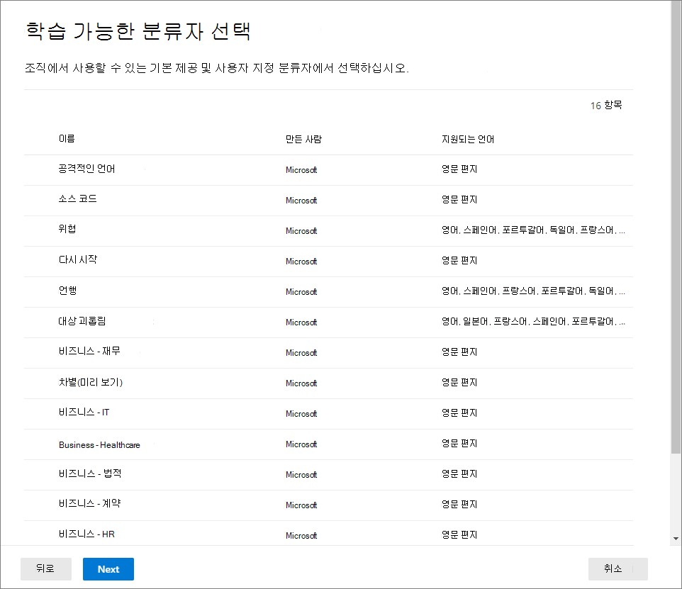

# <a name="automatically-apply-a-retention-label-to-retain-or-delete-content"></a><span data-ttu-id="e5a1f-103">보존 레이블 자동 적용하여 콘텐츠를 보존 또는 삭제하기</span><span class="sxs-lookup"><span data-stu-id="e5a1f-103">Automatically apply a retention label to retain or delete content</span></span>

><span data-ttu-id="e5a1f-104">*[보안 및 규정 준수를 위한 Microsoft 365 라이선싱 지침](https://aka.ms/ComplianceSD).*</span><span class="sxs-lookup"><span data-stu-id="e5a1f-104">*[Microsoft 365 licensing guidance for security & compliance](https://aka.ms/ComplianceSD).*</span></span>

> [!NOTE]
> <span data-ttu-id="e5a1f-105">이 시나리오는 [규제 기록](records-management.md#records)에서 지원 되지 않습니다.</span><span class="sxs-lookup"><span data-stu-id="e5a1f-105">This scenario is not supported for [regulatory records](records-management.md#records).</span></span>

<span data-ttu-id="e5a1f-106">[보존 레이블](retention.md)의 가장 강력한 기능 중 하나는 지정된 조건과 일치하는 콘텐츠에 자동으로 레이블을 적용하는 기능입니다.</span><span class="sxs-lookup"><span data-stu-id="e5a1f-106">One of the most powerful features of [retention labels](retention.md) is the ability to apply them automatically to content that matches specified conditions.</span></span> <span data-ttu-id="e5a1f-107">이 경우 조직의 사용자는 레이블을 적용할 필요가 없습니다.</span><span class="sxs-lookup"><span data-stu-id="e5a1f-107">In this case, people in your organization don't need to apply the retention labels.</span></span> <span data-ttu-id="e5a1f-108">Microsoft 365에서 이 작업을 수행합니다.</span><span class="sxs-lookup"><span data-stu-id="e5a1f-108">Microsoft 365 does the work for them.</span></span>
  
<span data-ttu-id="e5a1f-109">자동 적용 보존 레이블은 다음과 같은 이유 때문에 강력합니다.</span><span class="sxs-lookup"><span data-stu-id="e5a1f-109">Auto-applying retention labels are powerful because:</span></span>
  
- <span data-ttu-id="e5a1f-110">사용자에게 모든 분류를 교육할 필요가 없습니다.</span><span class="sxs-lookup"><span data-stu-id="e5a1f-110">You don't need to train your users on all of your classifications.</span></span>
    
- <span data-ttu-id="e5a1f-111">모든 콘텐츠를 올바르게 분류하기 위해 사용자에게 의존할 필요가 없습니다.</span><span class="sxs-lookup"><span data-stu-id="e5a1f-111">You don't need to rely on users to classify all content correctly.</span></span>
    
- <span data-ttu-id="e5a1f-112">사용자가 더 이상 데이터 거버넌스 정책을 알아야 할 필요가 없으며, 업무에 집중할 수 있습니다.</span><span class="sxs-lookup"><span data-stu-id="e5a1f-112">Users no longer need to know about data governance policies - they can focus on their work.</span></span>
    
<span data-ttu-id="e5a1f-113">콘텐츠에 중요한 정보, 키워드나 검색 가능한 속성 또는 [학습 가능한 분류자](classifier-get-started-with.md) 일치 항목이 포함된 경우 보존 레이블을 콘텐츠에 자동으로 적용할 수 있습니다.</span><span class="sxs-lookup"><span data-stu-id="e5a1f-113">You can apply retention labels to content automatically when that content contains sensitive information, keywords or searchable properties, or a match for [trainable classifiers](classifier-get-started-with.md).</span></span>

> [!TIP]
> <span data-ttu-id="e5a1f-114">이제 미리 보기에서 검색 가능한 속성을 사용하여 [Teams 모임 녹음/녹화](#microsoft-teams-meeting-recordings)을 식별합니다.</span><span class="sxs-lookup"><span data-stu-id="e5a1f-114">Now in preview, use searchable properties to identify [Teams meeting recordings](#microsoft-teams-meeting-recordings).</span></span>

<span data-ttu-id="e5a1f-115">다음 조건에 따라 보존 레이블을 자동으로 적용하는 프로세스:</span><span class="sxs-lookup"><span data-stu-id="e5a1f-115">The processes to automatically apply a retention label based on these conditions:</span></span>


<span data-ttu-id="e5a1f-117">두 가지 관리 단계를 수행하려면 다음 지침을 사용합니다.</span><span class="sxs-lookup"><span data-stu-id="e5a1f-117">Use the following instructions for the two admin steps.</span></span>

> [!NOTE]
> <span data-ttu-id="e5a1f-118">자동 정책은 자동으로 보존 레이블을 적용하기 위해 조건과 함께 서비스 측 레이블을 사용합니다.</span><span class="sxs-lookup"><span data-stu-id="e5a1f-118">Auto-policies use service-side labeling with conditions to automatically apply retention labels.</span></span> <span data-ttu-id="e5a1f-119">다음을 수행할 때 보존 레이블을 레이블 정책과 함께 자동으로 적용할 수도 있습니다.</span><span class="sxs-lookup"><span data-stu-id="e5a1f-119">You can also automatically apply a retention label with a label policy when you do the following:</span></span> 
>
> - <span data-ttu-id="e5a1f-120">해당 컨테이너의 레이블이 지정되지 않은 콘텐츠에 자동으로 레이블이 지정되도록 SharePoint 라이브러리, 폴더 또는 문서 집합에 기본 보존 레이블을 적용합니다.</span><span class="sxs-lookup"><span data-stu-id="e5a1f-120">Apply a default retention label to a SharePoint library, folder, or document set so that unlabeled content in that container is automatically labeled</span></span>
>- <span data-ttu-id="e5a1f-121">규칙을 사용하여 전자 메일에 자동으로 보존 레이블 적용하기</span><span class="sxs-lookup"><span data-stu-id="e5a1f-121">Automatically applying a retention label to email by using rules</span></span>
>
> <span data-ttu-id="e5a1f-122">이 시나리오의 경우 [앱에서 보존 레이블 만들기 및 적용하기](create-apply-retention-labels.md)를 참조하세요.</span><span class="sxs-lookup"><span data-stu-id="e5a1f-122">For these scenarios, see [Create and apply retention labels in apps](create-apply-retention-labels.md).</span></span>

## <a name="before-you-begin"></a><span data-ttu-id="e5a1f-123">시작하기 전에</span><span class="sxs-lookup"><span data-stu-id="e5a1f-123">Before you begin</span></span>

<span data-ttu-id="e5a1f-124">조직의 전역 관리자는 보존 레이블과 해당 정책을 만들고 편집할 수 있는 모든 권한을 가지고 있습니다.</span><span class="sxs-lookup"><span data-stu-id="e5a1f-124">The global admin for your organization has full permissions to create and edit retention labels and their policies.</span></span> <span data-ttu-id="e5a1f-125">전역 관리자로 로그인하지 않은 경우 [보존 정책 및 보존 레이블을 만들고 관리하는 데 필요한 권한](get-started-with-retention.md#permissions-required-to-create-and-manage-retention-policies-and-retention-labels)을 참조하세요.</span><span class="sxs-lookup"><span data-stu-id="e5a1f-125">If you aren't signing in as a global admin, see [Permissions required to create and manage retention policies and retention labels](get-started-with-retention.md#permissions-required-to-create-and-manage-retention-policies-and-retention-labels).</span></span>

## <a name="how-to-auto-apply-a-retention-label"></a><span data-ttu-id="e5a1f-126">보존 레이블을 자동으로 적용하는 방법</span><span class="sxs-lookup"><span data-stu-id="e5a1f-126">How to auto-apply a retention label</span></span>

<span data-ttu-id="e5a1f-127">먼저 보존 레이블을 만듭니다.</span><span class="sxs-lookup"><span data-stu-id="e5a1f-127">First, create your retention label.</span></span> <span data-ttu-id="e5a1f-128">그런 다음 해당 레이블을 적용하는 자동 정책을 만듭니다.</span><span class="sxs-lookup"><span data-stu-id="e5a1f-128">Then create an auto-policy to apply that label.</span></span> <span data-ttu-id="e5a1f-129">보존 레이블을 이미 만든 경우에는 [자동 정책 만들기](#step-2-create-an-auto-apply-policy)로 건너뜁니다.</span><span class="sxs-lookup"><span data-stu-id="e5a1f-129">If you have already created your retention label, skip to [creating an auto-policy](#step-2-create-an-auto-apply-policy).</span></span>

<span data-ttu-id="e5a1f-130">탐색 지침은 [레코드 관리](records-management.md)를 사용 중인지에 따라 달라집니다.</span><span class="sxs-lookup"><span data-stu-id="e5a1f-130">Navigation instructions depend on whether you're using [records management](records-management.md) or not.</span></span> <span data-ttu-id="e5a1f-131">두 시나리오 모두에 대한 지침이 제공됩니다.</span><span class="sxs-lookup"><span data-stu-id="e5a1f-131">Instructions are provided for both scenarios.</span></span>

### <a name="step-1-create-a-retention-label"></a><span data-ttu-id="e5a1f-132">1단계: 보존 레이블 만들기</span><span class="sxs-lookup"><span data-stu-id="e5a1f-132">Step 1: Create a retention label</span></span>

1. <span data-ttu-id="e5a1f-133">[Microsoft 365 규정 준수 센터](https://compliance.microsoft.com/)에서 다음의 위치 중 한 곳으로 이동합니다.</span><span class="sxs-lookup"><span data-stu-id="e5a1f-133">In the [Microsoft 365 compliance center](https://compliance.microsoft.com/), navigate to one of the following locations:</span></span>
    
    - <span data-ttu-id="e5a1f-134">레코드 관리를 사용하는 경우:</span><span class="sxs-lookup"><span data-stu-id="e5a1f-134">If you are using records management:</span></span>
        - <span data-ttu-id="e5a1f-135">**솔루션** > **레코드 관리** > **파일 계획** 탭 > **+ 레이블 만들기** > **보존 레이블**</span><span class="sxs-lookup"><span data-stu-id="e5a1f-135">**Solutions** > **Records management** > **File plan** tab > **+ Create a label** > **Retention label**</span></span>
        
    - <span data-ttu-id="e5a1f-136">레코드 관리를 사용하지 않는 경우:</span><span class="sxs-lookup"><span data-stu-id="e5a1f-136">If you are not using records management:</span></span>
       - <span data-ttu-id="e5a1f-137">**솔루션** > **정보 관리** > **레이블** tab > + **레이블 만들기**</span><span class="sxs-lookup"><span data-stu-id="e5a1f-137">**Solutions** > **Information governance** > **Labels** tab > + **Create a label**</span></span>
    
    <span data-ttu-id="e5a1f-138">바로 옵션이 표시되지 않나요?</span><span class="sxs-lookup"><span data-stu-id="e5a1f-138">Don't immediately see your option?</span></span> <span data-ttu-id="e5a1f-139">먼저 **모두 표시**를 선택합니다.</span><span class="sxs-lookup"><span data-stu-id="e5a1f-139">First select **Show all**.</span></span> 

2. <span data-ttu-id="e5a1f-140">마법사의 지시를 따릅니다.</span><span class="sxs-lookup"><span data-stu-id="e5a1f-140">Follow the prompts in the wizard.</span></span> <span data-ttu-id="e5a1f-141">레코드 관리를 사용하는 경우:</span><span class="sxs-lookup"><span data-stu-id="e5a1f-141">If you are using records management:</span></span>
    
    - <span data-ttu-id="e5a1f-142">파일 계획 설명자에 대한 자세한 내용은 [파일 계획을 사용하여 보존 레이블 관리의 개요](file-plan-manager.md)를 참조하세요</span><span class="sxs-lookup"><span data-stu-id="e5a1f-142">For information about the file plan descriptors, see [Use file plan to manage retention labels](file-plan-manager.md)</span></span>
    
    - <span data-ttu-id="e5a1f-143">보존 레이블을 사용하여 레코드를 선언하려면 **항목을 레코드로 표시**를 선택하거나 **항목을 규제 레코드로 표시**를 선택합니다.</span><span class="sxs-lookup"><span data-stu-id="e5a1f-143">To use the retention label to declare records, select **Mark items as records**, or **Mark items as regulatory records**.</span></span> <span data-ttu-id="e5a1f-144">자세한 정보는 [레코드를 선언하도록 보존 레이블 구성하기](declare-records.md#configuring-retention-labels-to-declare-records)를 참조하세요.</span><span class="sxs-lookup"><span data-stu-id="e5a1f-144">For more information, see [Configuring retention labels to declare records](declare-records.md#configuring-retention-labels-to-declare-records).</span></span>

3. <span data-ttu-id="e5a1f-145">레이블을 만든 후 레이블을 게시하고 레이블을 자동으로 적용하거나 단지 레이블을 저장하는 옵션이 표시되면 **이 레이블을 특정 콘텐츠에 자동으로 적용**을 선택한 후 **완료**를 선택하여 다음 절차에서 2 단계로 바로 이동하는 자동 레이블 만들기 마법사를 시작합니다.</span><span class="sxs-lookup"><span data-stu-id="e5a1f-145">After you have created the label and you see the options to publish the label, auto-apply the label, or just save the label: Select **Auto-apply this label to a specific type of content**, and then select **Done** to start the Create auto-labeling wizard that takes you directly to step 2 in the following procedure.</span></span>

<span data-ttu-id="e5a1f-146">기존 레이블을 편집하려면 레이블을 선택한 후 **레이블 편집** 옵션을 선택하여 레이블 설명과 [적격 설정](#updating-retention-labels-and-their-policies)을 변경하는 데 사용하는 편집 보유 마법사를 2단계에서 시작합니다.</span><span class="sxs-lookup"><span data-stu-id="e5a1f-146">To edit an existing label, select it, and then select the **Edit label** option to start the Edit retention wizard that lets you change the label descriptions and any [eligible settings](#updating-retention-labels-and-their-policies) from step 2.</span></span>


### <a name="step-2-create-an-auto-apply-policy"></a><span data-ttu-id="e5a1f-147">2단계: 자동 적용 정책 만들기</span><span class="sxs-lookup"><span data-stu-id="e5a1f-147">Step 2: Create an auto-apply policy</span></span>

<span data-ttu-id="e5a1f-148">자동 적용 정책을 만들 때 지정한 조건에 따라 콘텐츠에 자동으로 적용할 보존 레이블을 선택합니다.</span><span class="sxs-lookup"><span data-stu-id="e5a1f-148">When you create an auto-apply policy, you select a retention label to automatically apply to content, based on the conditions that you specify.</span></span>

1. <span data-ttu-id="e5a1f-149">[Microsoft 365 규정 준수 센터](https://compliance.microsoft.com/)에서 다음의 위치 중 한 곳으로 이동합니다.</span><span class="sxs-lookup"><span data-stu-id="e5a1f-149">In the [Microsoft 365 compliance center](https://compliance.microsoft.com/), navigate to one of the following locations:</span></span>
    
    - <span data-ttu-id="e5a1f-150">레코드 관리를 사용하는 경우: **정보 거버넌스**</span><span class="sxs-lookup"><span data-stu-id="e5a1f-150">If you are using records management: **Information governance**:</span></span>
        - <span data-ttu-id="e5a1f-151">**솔루션** > **레코드 관리** > **레이블 정책** 탭 > **레이블 자동 적용**</span><span class="sxs-lookup"><span data-stu-id="e5a1f-151">**Solutions** > **Records management** > **Label policies** tab > **Auto-apply a label**</span></span>
    
    - <span data-ttu-id="e5a1f-152">레코드 관리를 사용하지 않는 경우:</span><span class="sxs-lookup"><span data-stu-id="e5a1f-152">If you are not using records management:</span></span>
        - <span data-ttu-id="e5a1f-153">**솔루션** > **정보 거버넌스** > **레이블 정책** 탭 > **레이블 자동 적용**</span><span class="sxs-lookup"><span data-stu-id="e5a1f-153">**Solutions** > **Information governance** > **Label policies** tab > **Auto-apply a label**</span></span>
    
    <span data-ttu-id="e5a1f-154">바로 옵션이 표시되지 않나요?</span><span class="sxs-lookup"><span data-stu-id="e5a1f-154">Don't immediately see your option?</span></span> <span data-ttu-id="e5a1f-155">먼저 **모두 표시**를 선택합니다.</span><span class="sxs-lookup"><span data-stu-id="e5a1f-155">First select **Show all**.</span></span> 

2. <span data-ttu-id="e5a1f-156">자동 레이블 만들기 마법사의 지시를 따릅니다.</span><span class="sxs-lookup"><span data-stu-id="e5a1f-156">Follow the prompts in the Create auto-labeling wizard.</span></span>
    
    <span data-ttu-id="e5a1f-157">보존 레이블을 자동으로 적용하는 조건을 구성하는 방법에 대한 자세한 내용은이 페이지에서 [보존 레이블 자동 적용에 대한 조건 구성하기](#configuring-conditions-for-auto-apply-retention-labels) 섹션을 참조하세요.</span><span class="sxs-lookup"><span data-stu-id="e5a1f-157">For information about configuring the conditions that automatically apply the retention label, see the [Configuring conditions for auto-apply retention labels](#configuring-conditions-for-auto-apply-retention-labels) section on this page.</span></span>
    
    <span data-ttu-id="e5a1f-158">보존 레이블이 지원하는 위치에 대한 자세한 내용은 [보존 레이블과 위치](retention.md#retention-label-policies-and-locations) 섹션을 참조하세요.</span><span class="sxs-lookup"><span data-stu-id="e5a1f-158">For information about the locations supported by retention labels, see the [Retention labels and locations](retention.md#retention-label-policies-and-locations) section.</span></span>

<span data-ttu-id="e5a1f-159">기존 자동 적용 정책을 편집하려면 정책을 선택하고 선택한 보존 레이블과 모든 [적격 설정](#updating-retention-labels-and-their-policies)을 2단계에서 변경하도록 해주는 보존 정책 편집 마법사를 시작합니다.</span><span class="sxs-lookup"><span data-stu-id="e5a1f-159">To edit an existing auto-apply policy, select it to start the Edit retention policy wizard that lets you change the selected retention label and any [eligible settings](#updating-retention-labels-and-their-policies) from step 2.</span></span>


### <a name="configuring-conditions-for-auto-apply-retention-labels"></a><span data-ttu-id="e5a1f-160">보존 레이블 자동 적용에 대한 조건 구성하기</span><span class="sxs-lookup"><span data-stu-id="e5a1f-160">Configuring conditions for auto-apply retention labels</span></span>

<span data-ttu-id="e5a1f-161">콘텐츠에 다음이 포함될 경우, 콘텐츠에 자동으로 보존 레이블을 적용할 수 있습니다.</span><span class="sxs-lookup"><span data-stu-id="e5a1f-161">You can apply retention labels to content automatically when that content contains:</span></span>

- [<span data-ttu-id="e5a1f-162">특정 중요한 정보 유형</span><span class="sxs-lookup"><span data-stu-id="e5a1f-162">Specific types of sensitive information</span></span>](#auto-apply-labels-to-content-with-specific-types-of-sensitive-information)

- [<span data-ttu-id="e5a1f-163">만든 쿼리와 일치하는 특정 키워드 또는 검색 가능한 속성</span><span class="sxs-lookup"><span data-stu-id="e5a1f-163">Specific keywords or searchable properties that match a query you create</span></span>](#auto-apply-labels-to-content-with-keywords-or-searchable-properties)

- [<span data-ttu-id="e5a1f-164">학습 가능한 분류자와 일치</span><span class="sxs-lookup"><span data-stu-id="e5a1f-164">A match for trainable classifiers</span></span>](#auto-apply-labels-to-content-by-using-trainable-classifiers)

#### <a name="auto-apply-labels-to-content-with-specific-types-of-sensitive-information"></a><span data-ttu-id="e5a1f-165">특정 유형의 중요한 정보가 있는 콘텐츠에 레이블 자동 적용</span><span class="sxs-lookup"><span data-stu-id="e5a1f-165">Auto-apply labels to content with specific types of sensitive information</span></span>

<span data-ttu-id="e5a1f-166">중요한 정보에 대한 자동 적용 보존 레이블을 만들면 DLP(데이터 손실 방지) 정책을 만들 때 같은 정책 템플릿 목록이 표시됩니다.</span><span class="sxs-lookup"><span data-stu-id="e5a1f-166">When you create auto-apply retention labels for sensitive information, you see the same list of policy templates as when you create a data loss prevention (DLP) policy.</span></span> <span data-ttu-id="e5a1f-167">각 템플릿은 특정 중요한 정보 유형을 찾도록 미리 구성되어 있습니다.</span><span class="sxs-lookup"><span data-stu-id="e5a1f-167">Each template is preconfigured to look for specific types of sensitive information.</span></span> <span data-ttu-id="e5a1f-168">예를 들어 여기에 나와 있는 서식 파일은 미국 ITIN, SSN 및 여권 번호를 **개인 정보** 범주와 **미국 PII (개인 식별 정보) 데이터 서식 파일**에서 검색합니다.</span><span class="sxs-lookup"><span data-stu-id="e5a1f-168">For example, the template shown here looks for U.S. ITIN, SSN, and passport numbers from the **Privacy** category, and **U.S Personally Identifiable Information (PII) Data template**:</span></span>


<span data-ttu-id="e5a1f-170">중요한 정보 유형에 대한 자세한 내용은 [중요한 정보 유형 엔터티 정의](sensitive-information-type-entity-definitions.md)를 참조하세요.</span><span class="sxs-lookup"><span data-stu-id="e5a1f-170">To learn more about the sensitivity information types, see [Sensitive information type entity definitions](sensitive-information-type-entity-definitions.md).</span></span>

<span data-ttu-id="e5a1f-171">정책 템플릿을 선택한 후 중요한 정보 유형을 추가하거나 제거할 수 있으며 인스턴스 수 및 일치 정확도를 변경할 수 있습니다.</span><span class="sxs-lookup"><span data-stu-id="e5a1f-171">After you select a policy template, you can add or remove any types of sensitive information, and you can change the instance count and match accuracy.</span></span> <span data-ttu-id="e5a1f-172">다음에 표시된 예제 스크린샷에서는 다음 경우에만 보존 레이블이 자동 적용됩니다.</span><span class="sxs-lookup"><span data-stu-id="e5a1f-172">In the example screenshot shown next, a retention label will be auto-applied only when:</span></span>
  
- <span data-ttu-id="e5a1f-173">탐지된 중요한 정보 유형은 일치 정확도(또는 신뢰 수준)가 75 이상입니다.</span><span class="sxs-lookup"><span data-stu-id="e5a1f-173">The type of sensitive information that's detected has a match accuracy (or confidence level) of at least 75.</span></span> <span data-ttu-id="e5a1f-174">많은 중요한 정보 유형은 여러 패턴으로 정의됩니다. 여기서 일치 정확도가 더 높은 패턴은 증거(예: 키워드, 날짜 또는 주소)가 더 많이 발견되어야 하지만, 일치 정확도가 더 낮은 패턴에는 증거가 덜 필요합니다.</span><span class="sxs-lookup"><span data-stu-id="e5a1f-174">Many sensitive information types are defined with multiple patterns, where a pattern with a higher match accuracy requires more evidence to be found (such as keywords, dates, or addresses), while a pattern with a lower match accuracy requires less evidence.</span></span> <span data-ttu-id="e5a1f-175">**최소** 일치 정확도가 더 낮을수록 콘텐츠가 조건과 일치하기가 더 쉬워집니다.</span><span class="sxs-lookup"><span data-stu-id="e5a1f-175">The lower the **min** match accuracy, the easier it is for content to match the condition.</span></span>

- <span data-ttu-id="e5a1f-176">콘텐츠는 이러한 세 가지 중요한 정보 유형 중 어느 유형의 1~9개 인스턴스를 포함합니다.</span><span class="sxs-lookup"><span data-stu-id="e5a1f-176">The content contains between 1 and 9 instances of any of these three sensitive information types.</span></span> <span data-ttu-id="e5a1f-177">**모두**로 변경되도록 **최대** 값을 삭제할 수 있습니다.</span><span class="sxs-lookup"><span data-stu-id="e5a1f-177">You can delete the **to** value so that it changes to **Any**.</span></span>

<span data-ttu-id="e5a1f-178">이러한 옵션에 대한 자세한 내용은 를 쉽게 찾을 수 있도록 하기 위해 DLP 문서에서 다음 지침을 참조하세요. [일치하기 더욱 쉽게 혹은 어렵게 만드는 튜닝 규칙](data-loss-prevention-policies.md#tuning-rules-to-make-them-easier-or-harder-to-match) </span><span class="sxs-lookup"><span data-stu-id="e5a1f-178">For more information about these options, see the following guidance from the DLP documentation [Tuning rules to make them easier or harder to match](data-loss-prevention-policies.md#tuning-rules-to-make-them-easier-or-harder-to-match).</span></span>
    

  
#### <a name="auto-apply-labels-to-content-with-keywords-or-searchable-properties"></a><span data-ttu-id="e5a1f-180">키워드 또는 검색 가능 속성이 있는 콘텐츠에 레이블 자동 적용</span><span class="sxs-lookup"><span data-stu-id="e5a1f-180">Auto-apply labels to content with keywords or searchable properties</span></span>

<span data-ttu-id="e5a1f-p114">검색 가능한 속성의 특정 단어, 구 또는 값을 포함하는 쿼리를 사용하여 콘텐츠에 레이블을 자동으로 적용할 수 있습니다. AND, OR 및 NOT과 같은 검색 연산자를 사용하여 쿼리를 세분화할 수 있습니다.</span><span class="sxs-lookup"><span data-stu-id="e5a1f-p114">You can auto-apply labels to content by using a query that contains specific words, phrases, or values of searchable properties. You can refine your query by using search operators such as AND, OR, and NOT.</span></span>


<span data-ttu-id="e5a1f-184">KQL(키워드 쿼리 언어)에 대한 자세한 내용은 [KQL(키워드 쿼리 언어) 구문 참조](https://docs.microsoft.com/sharepoint/dev/general-development/keyword-query-language-kql-syntax-reference)를 참조하세요.</span><span class="sxs-lookup"><span data-stu-id="e5a1f-184">For more information about the query syntax that uses Keyword Query Language (KQL), see [Keyword Query Language (KQL) syntax reference](https://docs.microsoft.com/sharepoint/dev/general-development/keyword-query-language-kql-syntax-reference).</span></span>

<span data-ttu-id="e5a1f-185">쿼리 기반 레이블은 검색 인덱스를 사용하여 콘텐츠를 식별합니다.</span><span class="sxs-lookup"><span data-stu-id="e5a1f-185">Query-based labels use the search index to identify content.</span></span> <span data-ttu-id="e5a1f-186">검색 가능한 속성에 대한 자세한 내용은 다음을 참조하세요.</span><span class="sxs-lookup"><span data-stu-id="e5a1f-186">For more information about the searchable properties that you can use, see:</span></span>

- [<span data-ttu-id="e5a1f-187">콘텐츠 검색에 대한 키워드 쿼리 및 검색 조건</span><span class="sxs-lookup"><span data-stu-id="e5a1f-187">Keyword queries and search conditions for Content Search</span></span>](keyword-queries-and-search-conditions.md)
- [<span data-ttu-id="e5a1f-188">SharePoint Server에서 크롤링 및 관리 속성의 개요</span><span class="sxs-lookup"><span data-stu-id="e5a1f-188">Overview of crawled and managed properties in SharePoint Server</span></span>](https://docs.microsoft.com/SharePoint/technical-reference/crawled-and-managed-properties-overview)

> [!NOTE]
> <span data-ttu-id="e5a1f-189">SharePoint 관리 속성에는 별칭이 지원되지만, 보존 레이블을 구성할 때는 사용하지 마세요.</span><span class="sxs-lookup"><span data-stu-id="e5a1f-189">Although SharePoint managed properties support aliases, don't use these when you configure your retention labels.</span></span> <span data-ttu-id="e5a1f-190">관리 속성의 실제 이름을 항상 지정합니다(예: "RefableString01").</span><span class="sxs-lookup"><span data-stu-id="e5a1f-190">Always specify the actual name of the managed property, for example, "RefinableString01".</span></span>

<span data-ttu-id="e5a1f-191">예제 쿼리:</span><span class="sxs-lookup"><span data-stu-id="e5a1f-191">Examples queries:</span></span>

| <span data-ttu-id="e5a1f-192">워크로드</span><span class="sxs-lookup"><span data-stu-id="e5a1f-192">Workload</span></span> | <span data-ttu-id="e5a1f-193">예제</span><span class="sxs-lookup"><span data-stu-id="e5a1f-193">Example</span></span> |
|:-----|:-----|
|<span data-ttu-id="e5a1f-194">Exchange</span><span class="sxs-lookup"><span data-stu-id="e5a1f-194">Exchange</span></span>   | `subject:"Quarterly Financials"` |
|<span data-ttu-id="e5a1f-195">Exchange</span><span class="sxs-lookup"><span data-stu-id="e5a1f-195">Exchange</span></span>   | `recipients:garthf@contoso.com` |
|<span data-ttu-id="e5a1f-196">SharePoint</span><span class="sxs-lookup"><span data-stu-id="e5a1f-196">SharePoint</span></span> | `contenttype:contract` |
|<span data-ttu-id="e5a1f-197">SharePoint</span><span class="sxs-lookup"><span data-stu-id="e5a1f-197">SharePoint</span></span> | `site:https://contoso.sharepoint.com/sites/teams/procurement AND contenttype:contract`|

##### <a name="microsoft-teams-meeting-recordings"></a><span data-ttu-id="e5a1f-198">Microsoft Teams 모임 녹음/녹화</span><span class="sxs-lookup"><span data-stu-id="e5a1f-198">Microsoft Teams meeting recordings</span></span>

> [!NOTE]
> <span data-ttu-id="e5a1f-199">Teams 모임 녹음/녹화를 유지하고 삭제하는 기능은 미리 보기로 출시되며 기록이 OneDrive 또는 SharePoint에 저장되기 전에는 작동하지 않습니다.</span><span class="sxs-lookup"><span data-stu-id="e5a1f-199">The ability to retain and delete Teams meeting recordings is rolling out in preview and won't work before recordings are saved to OneDrive or SharePoint.</span></span> <span data-ttu-id="e5a1f-200">자세한 정보는 [모임 녹음/녹화에 비즈니스용 OneDrive 및 SharePoint 또는 Stream 사용](https://docs.microsoft.com/MicrosoftTeams/tmr-meeting-recording-change)을 참조하세요.</span><span class="sxs-lookup"><span data-stu-id="e5a1f-200">For more information, see [Use OneDrive for Business and SharePoint Online or Stream for meeting recordings](https://docs.microsoft.com/MicrosoftTeams/tmr-meeting-recording-change).</span></span>

<span data-ttu-id="e5a1f-201">사용자의 OneDrive 계정 또는 SharePoint에 저장된 Microsoft Teams 모임 녹음/녹화를 식별하려면 **키워드 쿼리 편집기**에 대해 다음을 지정합니다.</span><span class="sxs-lookup"><span data-stu-id="e5a1f-201">To identify Microsoft Teams meeting recordings that are stored in users' OneDrive accounts or in SharePoint, specify the following for the **Keyword query editor**:</span></span>

``` 
ProgID:Media AND ProgID:Meeting
```

<span data-ttu-id="e5a1f-202">이 보존 레이블의 경우 레이블 정책을 만들어 관련 사용자의 OneDrive 계정 또는 SharePoint 사이트에도 게시해야 합니다.</span><span class="sxs-lookup"><span data-stu-id="e5a1f-202">For this retention label, you must also publish it to the relevant users' OneDrive accounts or SharePoint sites by creating a label policy.</span></span> <span data-ttu-id="e5a1f-203">대부분의 경우 모임 녹음/녹화는 OneDrive에 저장되지만, 채널 모임의 경우에는 SharePoint에 저장됩니다.</span><span class="sxs-lookup"><span data-stu-id="e5a1f-203">Most of the time, the meeting recordings are saved to OneDrive, but for channel meetings, they are saved in SharePoint.</span></span>

<span data-ttu-id="e5a1f-204">자동 적용 정책을 저장한 경우:</span><span class="sxs-lookup"><span data-stu-id="e5a1f-204">When you have saved the auto-apply policy:</span></span>

1. <span data-ttu-id="e5a1f-205">**레이블 정책** 탭 > **레이블 게시**를 선택합니다.</span><span class="sxs-lookup"><span data-stu-id="e5a1f-205">Select **Label policies** tab > **Publish labels**</span></span>

2. <span data-ttu-id="e5a1f-206">레이블을 선택하라는 메시지가 표시되면 KQL 쿼리로 작성한 레이블을 선택하여 Teams 모임 녹음/녹화를 식별합니다.</span><span class="sxs-lookup"><span data-stu-id="e5a1f-206">When prompted to select a label, choose the label you created with the KQL query to identify Teams meeting recordings.</span></span>

3. <span data-ttu-id="e5a1f-207">위치를 묻는 메시지가 표시되면 **SharePoint 사이트** 및 **OneDrive 계정**을 선택합니다.</span><span class="sxs-lookup"><span data-stu-id="e5a1f-207">When prompted for the location, choose **SharePoint sites** and **OneDrive accounts**.</span></span> <span data-ttu-id="e5a1f-208">그런 다음 **모든**의 기본값을 유지하거나 특정 OneDrive 계정을 포함하거나 제외하는 등의 개별 위치를 지정할 수 있습니다.</span><span class="sxs-lookup"><span data-stu-id="e5a1f-208">You can then keep the default of **All**, or specify individual locations, such as including or excluding specific OneDrive accounts.</span></span>

4. <span data-ttu-id="e5a1f-209">마법사를 완료하고 이 레이블 정책을 저장합니다.</span><span class="sxs-lookup"><span data-stu-id="e5a1f-209">Complete the wizard and save this label policy.</span></span>

#### <a name="auto-apply-labels-to-content-by-using-trainable-classifiers"></a><span data-ttu-id="e5a1f-210">학습 가능한 분류자를 사용하여 콘텐츠에 레이블 자동 적용</span><span class="sxs-lookup"><span data-stu-id="e5a1f-210">Auto-apply labels to content by using trainable classifiers</span></span>

<span data-ttu-id="e5a1f-211">학습 가능한 분류자 옵션을 선택할 때 기본 분류자 중 하나 또는 사용자 지정 분류자를 선택할 수 있습니다.</span><span class="sxs-lookup"><span data-stu-id="e5a1f-211">When you choose the option for a trainable classifier, you can select one of the built-in classifiers, or a custom classifier.</span></span> <span data-ttu-id="e5a1f-212">기본 제공 분류자에는 **이력서**, **SourceCode**, **대상 희롱**, **비속어**, **위협**이 포함됩니다.</span><span class="sxs-lookup"><span data-stu-id="e5a1f-212">The built-in classifiers include **Resumes**, **SourceCode**, **Targeted Harassment**, **Profanity**, and **Threat**:</span></span>



> [!CAUTION]
> <span data-ttu-id="e5a1f-214">당사는 **비속어** 기본 제공 분류자가 많은 수의 가양성을 생성하였기 에 그 사용을 중단하고 있습니다.</span><span class="sxs-lookup"><span data-stu-id="e5a1f-214">We are deprecating the **Offensive Language** built-in classifier because it has been producing a high number of false positives.</span></span> <span data-ttu-id="e5a1f-215">이러한 기본 제공 분류자를 사용하지 않도록 하고 현재 사용하고 있는 경우에는 비즈니스 프로세스를 제거해야 합니다.</span><span class="sxs-lookup"><span data-stu-id="e5a1f-215">Don't use this built-in classifier and if you are currently using it, you should move your business processes off it.</span></span> <span data-ttu-id="e5a1f-216">대신에 **대상 지정 괴롭힘**,**모독** 그리고 **위협**기본 제공 분류자를 사용하는 것이 좋습니다.</span><span class="sxs-lookup"><span data-stu-id="e5a1f-216">We recommend using the **Targeted Harassment**, **Profanity**, and **Threat** built-in classifiers instead.</span></span>

<span data-ttu-id="e5a1f-217">이 옵션을 사용하여 레이블을 자동으로 적용하려면 SharePoint 사이트 및 사서함에 10MB 이상의 데이터가 있어야 합니다.</span><span class="sxs-lookup"><span data-stu-id="e5a1f-217">To automatically apply a label by using this option, SharePoint sites and mailboxes must have at least 10 MB of data.</span></span>

<span data-ttu-id="e5a1f-218">학습 가능한 분류자에 대한 자세한 내용은 [학습 가능한 분류자에 대한 자세한 정보(미리 보기)](classifier-learn-about.md)를 참조하세요.</span><span class="sxs-lookup"><span data-stu-id="e5a1f-218">For more information about trainable classifiers, see [Learn about trainable classifiers (preview)](classifier-learn-about.md).</span></span>

> [!TIP]
> <span data-ttu-id="e5a1f-219">Trainable 분류자를 Exchange에 사용하는 경우 최근 릴리스된 [콘텐츠 탐색기에서 분류자를 재학습하는 방법(미리 보기)](classifier-how-to-retrain-content-explorer.md)을 참조하세요.</span><span class="sxs-lookup"><span data-stu-id="e5a1f-219">If you use trainable classifiers for Exchange, see the recently released [How to retrain a classifier in content explorer (preview)](classifier-how-to-retrain-content-explorer.md).</span></span>

## <a name="how-long-it-takes-for-retention-labels-to-take-effect"></a><span data-ttu-id="e5a1f-220">보존 레이블이 적용되는 데 걸리는 시간</span><span class="sxs-lookup"><span data-stu-id="e5a1f-220">How long it takes for retention labels to take effect</span></span>

<span data-ttu-id="e5a1f-221">보존 레이블을 자동으로 적용하는 경우 보존 레이블이 조건과 일치하는 모든 기존 콘텐츠에 적용되는 데 최대 7일이 걸릴 수 있습니다.</span><span class="sxs-lookup"><span data-stu-id="e5a1f-221">When you auto-apply retention labels, it can take up to seven days for the retention labels to be applied to all existing content that matches the conditions.</span></span>
  

  
## <a name="updating-retention-labels-and-their-policies"></a><span data-ttu-id="e5a1f-223">보존 레이블과 해당 정책 업데이트하기</span><span class="sxs-lookup"><span data-stu-id="e5a1f-223">Updating retention labels and their policies</span></span>

<span data-ttu-id="e5a1f-224">보존 레이블 또는 자동 적용 정책을 편집할 때 보존 레이블이 이미 콘텐츠에 적용된 경우, 새로 식별된 콘텐츠 외에 이 콘텐츠에도 업데이트된 설정이 자동으로 적용됩니다.</span><span class="sxs-lookup"><span data-stu-id="e5a1f-224">When you edit a retention label or auto-apply policy, and the retention label is already applied to content, your updated settings will automatically be applied to this content in addition to content that's newly identified.</span></span>

<span data-ttu-id="e5a1f-225">다음 내용을 포함하는 레이블이나 정책을 만들고 저장한 후에는 일부 설정을 변경할 수 없습니다.</span><span class="sxs-lookup"><span data-stu-id="e5a1f-225">Some settings can't be changed after the label or policy is created and saved, which include:</span></span>
- <span data-ttu-id="e5a1f-226">사용자가 만든 날짜를 기준으로 콘텐츠를 보존하거나 삭제하도록 레이블을 구성하지 않은 경우 보존 기간을 제외한 보존 설정입니다.</span><span class="sxs-lookup"><span data-stu-id="e5a1f-226">The retention settings except the retention period, unless you've configured the label to retain or delete the content based on when it was created.</span></span>
- <span data-ttu-id="e5a1f-227">항목을 레코드로 표시하는 옵션입니다.</span><span class="sxs-lookup"><span data-stu-id="e5a1f-227">The option to mark items as a record.</span></span>

## <a name="next-steps"></a><span data-ttu-id="e5a1f-228">다음 단계</span><span class="sxs-lookup"><span data-stu-id="e5a1f-228">Next steps</span></span>

<span data-ttu-id="e5a1f-229">SharePoint에서 관리 속성에 자동 적용 정책을 사용하는 예제 시나리오와 보존 기간을 시작하는 이벤트 기반 보존에 대한 자세한 내용은  [보존 레이블을 사용하여 SharePoint에 저장된 문서의 수명 주기를 관리](auto-apply-retention-labels-scenario.md)를 참조하세요.  </span><span class="sxs-lookup"><span data-stu-id="e5a1f-229">See [Use retention labels to manage the lifecycle of documents stored in SharePoint](auto-apply-retention-labels-scenario.md) for an example scenario that uses an auto-apply policy with managed properties in SharePoint, and event-based retention to start the retention period.</span></span>
