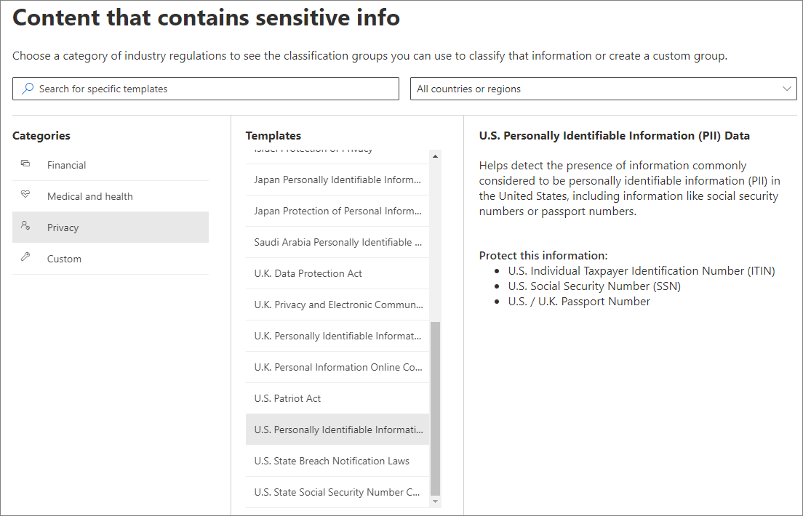

# 보존 레이블 자동 적용하여 콘텐츠를 보존 또는 삭제하기Automatically apply a retention label to retain or delete content

>*[보안 및 규정 준수를 위한 Microsoft 365 라이선싱 지침](https://aka.ms/ComplianceSD)**[Microsoft 365 licensing guidance for security & compliance](https://aka.ms/ComplianceSD).*

[보존 레이블](retention.md)의 가장 강력한 기능 중 하나는 지정된 조건과 일치하는 콘텐츠에 자동으로 레이블을 적용하는 기능입니다.One of the most powerful features of [retention labels](retention.md) is the ability to apply them automatically to content that matches specified conditions. 이 경우 조직의 사용자는 레이블을 적용할 필요가 없습니다.In this case, people in your organization don't need to apply the retention labels. Microsoft 365에서 이 작업을 수행합니다.Microsoft 365 does the work for them.
  
자동 적용 보존 레이블은 다음과 같은 이유 때문에 강력합니다.Auto-applying retention labels are powerful because:
  
- 사용자에게 모든 분류를 교육할 필요가 없습니다.You don't need to train your users on all of your classifications.
    
- 모든 콘텐츠를 올바르게 분류하기 위해 사용자에게 의존할 필요가 없습니다.You don't need to rely on users to classify all content correctly.
    
- 사용자가 더 이상 데이터 거버넌스 정책을 알아야 할 필요가 없으며, 업무에 집중할 수 있습니다.Users no longer need to know about data governance policies - they can focus on their work.
    
콘텐츠에 중요한 정보, 키워드 또는 [학습 가능한 분류자](classifier-getting-started-with.md) 일치 항목이 포함된 경우 보존 레이블을 콘텐츠에 자동으로 적용할 수 있습니다.You can apply retention labels to content automatically when that content contains sensitive information, keywords, or a match for [trainable classifiers](classifier-getting-started-with.md).
    
다음 조건에 따라 보존 레이블을 자동으로 적용하는 프로세스:The processes to automatically apply a retention label based on these conditions:

두 가지 관리 단계를 수행하려면 다음 지침을 사용합니다.Use the following instructions for the two admin steps.

> [!NOTE]
> 자동 정책은 자동으로 보존 레이블을 적용하기 위해 조건과 함께 서비스 측 레이블을 사용합니다.Auto-policies use service-side labeling with conditions to automatically apply retention labels. 다음을 수행할 때 보존 레이블을 레이블 정책과 함께 자동으로 적용할 수도 있습니다.You can also automatically apply a retention label with a label policy when you do the following: 
>
> - 해당 컨테이너의 레이블이 지정되지 않은 콘텐츠에 자동으로 레이블이 지정되도록 SharePoint 라이브러리, 폴더 또는 문서 집합에 기본 보존 레이블을 적용합니다.Apply a default retention label to a SharePoint library, folder, or document set so that unlabeled content in that container is automatically labeled
>- 규칙을 사용하여 전자 메일에 자동으로 보존 레이블 적용하기Automatically applying a retention label to email by using rules
>
> 이 시나리오의 경우 [앱에서 보존 레이블 만들기 및 적용하기](create-apply-retention-labels.md)를 참조하세요.For these scenarios, see [Create and apply retention labels in apps](create-apply-retention-labels.md).

## 시작하기 전에Before you begin

조직의 전역 관리자는 보존 레이블과 해당 정책을 만들고 편집할 수 있는 모든 권한을 가지고 있습니다.The global admin for your organization has full permissions to create and edit retention labels and their policies. 전역 관리자로 로그인하지 않은 경우 [보존 정책 및 보존 레이블을 만들고 관리하는 데 필요한 권한](get-started-with-retention.md#permissions-required-to-create-and-manage-retention-policies-and-retention-labels)을 참조하세요.If you aren't signing in as a global admin, see [Permissions required to create and manage retention policies and retention labels](get-started-with-retention.md#permissions-required-to-create-and-manage-retention-policies-and-retention-labels).

## 보존 레이블을 자동으로 적용하는 방법How to auto-apply a retention label

먼저 보존 레이블을 만듭니다.First, create your retention label. 그런 다음 해당 레이블을 적용하는 자동 정책을 만듭니다.Then create an auto-policy to apply that label. 보존 레이블을 이미 만든 경우에는 [자동 정책 만들기](#step-2-create-an-auto-apply-policy)로 건너뜁니다.If you have already created your retention label, skip to [creating an auto-policy](#step-2-create-an-auto-apply-policy).

탐색 지침은 [레코드 관리](records-management.md)를 사용 중인지에 따라 달라집니다.Navigation instructions depend on whether you're using [records management](records-management.md) or not. 두 시나리오 모두에 대한 지침이 제공됩니다.Instructions are provided for both scenarios.

### 1단계: 보존 레이블 만들기Step 1: Create a retention label

1. [Microsoft 365 규정 준수 센터](https://compliance.microsoft.com/)에서 다음의 위치 중 한 곳으로 이동합니다.In the [Microsoft 365 compliance center](https://compliance.microsoft.com/), navigate to one of the following locations:
    
    - 레코드 관리를 사용하는 경우:If you are using records management:
        - **솔루션** > **레코드 관리** > **파일 계획** 탭 > **+ 레이블 만들기** > **보존 레이블****Solutions** > **Records management** > **File plan** tab > **+ Create a label** > **Retention label**
        
    - 레코드 관리를 사용하지 않는 경우:If you are not using records management:
       - **솔루션** > **정보 관리** > **레이블** tab > + **레이블 만들기****Solutions** > **Information governance** > **Labels** tab > + **Create a label**
    
    바로 옵션이 표시되지 않나요?Don't immediately see your option? 먼저 **모두 표시**를 선택합니다.First select **Show all**. 

2. 마법사의 지시를 따릅니다.Follow the prompts in the wizard. 레코드 관리를 사용하는 경우:If you are using records management:
    
    - 파일 계획 설명자에 대한 자세한 내용은 [파일 계획을 사용하여 보존 레이블 관리의 개요](file-plan-manager.md)를 참조하세요For information about the file plan descriptors, see [Use file plan to manage retention labels](file-plan-manager.md)
    
    - 보존 레이블을 사용하여 콘텐츠를 레코드로 선언하려면 **레이블을 사용하여 콘텐츠를 “기록”으로 분류** 확인란을 체크합니다.To use the retention label to declare content as a record, enable the checkbox **Use label to classify content as a "Record"**.

기존 레이블을 편집하려면 레이블을 선택하고 **레이블 편집**을 선택하여 레이블 설명과 [적격 설정](#updating-retention-labels-and-their-policies)을 변경하는 데 사용하는 동일한 마법사를 2단계에서 시작합니다.To edit an existing label, select it, and then select **Edit label** to start the same wizard that lets you change the label descriptions and any [eligible settings](#updating-retention-labels-and-their-policies) from step 2. 또는 사용 가능한 **편집** 옵션 중 하나를 선택하여 해당 페이지로 바로 이동하고 업데이트를 수행합니다.Alternatively, select any of the available **Edit** options to go directly to the relevant page to make your update.

### 2단계: 자동 적용 정책 만들기Step 2: Create an auto-apply policy

자동 적용 정책을 만들 때 지정한 조건에 따라 콘텐츠에 자동으로 적용할 보존 레이블을 선택합니다.When you create an auto-apply policy, you select a retention label to automatically apply to content, based on the conditions that you specify.

1. [Microsoft 365 규정 준수 센터](https://compliance.microsoft.com/)에서 다음의 위치 중 한 곳으로 이동합니다.In the [Microsoft 365 compliance center](https://compliance.microsoft.com/), navigate to one of the following locations:
    
    - 레코드 관리를 사용하는 경우: **정보 거버넌스**If you are using records management: **Information governance**:
        - **솔루션** > **레코드 관리** > **레이블 정책** 탭 > **레이블 자동 적용****Solutions** > **Records management** > **Label policies** tab > **Auto-apply label**
    
    - 레코드 관리를 사용하지 않는 경우:If you are not using records management:
        - **솔루션** > **정보 거버넌스** > **레이블 정책** 탭 > **레이블 자동 적용****Solutions** > **Information governance** > **Label policies** tab > **Auto-apply label**
    
    바로 옵션이 표시되지 않나요?Don't immediately see your option? 먼저 **모두 표시**를 선택합니다.First select **Show all**. 

2. 마법사의 지시를 따릅니다.Follow the prompts in the wizard.
    
    보존 레이블을 자동으로 적용하는 조건을 구성하는 방법에 대한 자세한 내용은이 페이지에서 [보존 레이블 자동 적용에 대한 조건 구성하기](#configuring-conditions-for-auto-apply-retention-labels) 섹션을 참조하세요.For information about configuring the conditions that automatically apply the retention label, see the [Configuring conditions for auto-apply retention labels](#configuring-conditions-for-auto-apply-retention-labels) section on this page.
    
    보존 레이블이 지원하는 위치에 대한 자세한 내용은 [보존 레이블과 위치](retention.md#retention-label-policies-and-locations) 섹션을 참조하세요.For information about the locations supported by retention labels, see the [Retention labels and locations](retention.md#retention-label-policies-and-locations) section.

기존 자동 적용 레이블 정책을 편집하려면 레이블을 선택하고 **정책 편집**을 선택하여 정책 설명과 [적격 설정](#updating-retention-labels-and-their-policies)을 변경하는 데 사용하는 동일한 마법사를 2단계에서 시작합니다.To edit an existing auto-apply label policy, select it, and then select **Edit policy** to start the same wizard that lets you change the policy description and any [eligible settings](#updating-retention-labels-and-their-policies) from step 2. 또는 사용 가능한 **편집** 옵션 중 하나를 선택하여 해당 페이지로 바로 이동하고 업데이트를 수행합니다.Alternatively, select any of the available **Edit** options to go directly to the relevant page to make your update.

### 보존 레이블 자동 적용에 대한 조건 구성하기Configuring conditions for auto-apply retention labels

콘텐츠에 다음이 포함될 경우, 콘텐츠에 자동으로 보존 레이블을 적용할 수 있습니다.You can apply retention labels to content automatically when that content contains:

- [특정 중요한 정보 유형Specific types of sensitive information](#auto-apply-labels-to-content-with-specific-types-of-sensitive-information)

- [만든 쿼리와 일치하는 특정 키워드Specific keywords that match a query you create](#auto-apply-labels-to-content-with-keywords-or-searchable-properties)

- [학습 가능한 분류자와 일치A match for trainable classifiers](#auto-apply-labels-to-content-by-using-trainable-classifiers)

#### 특정 유형의 중요한 정보가 있는 콘텐츠에 레이블 자동 적용Auto-apply labels to content with specific types of sensitive information

중요한 정보에 대한 자동 적용 보존 레이블을 만들면 DLP(데이터 손실 방지) 정책을 만들 때 같은 정책 템플릿 목록이 표시됩니다.When you create auto-apply retention labels for sensitive information, you see the same list of policy templates as when you create a data loss prevention (DLP) policy. 각 정책 템플릿은 특정 중요한 정보 유형을 찾도록 미리 구성되어 있습니다.Each policy template is preconfigured to look for specific types of sensitive information. 예를 들어, 여기에 표시된 템플릿은 미국 ITIN, SSN 및 여권 번호를 검색합니다.For example, the template shown here looks for U.S. ITIN, SSN, and passport numbers. DLP에 대한 자세한 내용은 [데이터 손실 방지 정책 개요](data-loss-prevention-policies.md)를 참조하세요.To learn more about DLP, see [Overview of data loss prevention policies](data-loss-prevention-policies.md).
  

  
정책 템플릿을 선택한 후 임의 유형의 중요한 정보를 추가하거나 제거하고, 인스턴스 수 및 일치 정확도를 변경할 수 있습니다. 여기에 표시된 예제에서는 다음 경우에만 보존 레이블이 자동 적용됩니다.After you select a policy template, you can add or remove any types of sensitive information, and you can change the instance count and match accuracy. In the example shown here, a retention label will be auto-applied only when:
  
- 콘텐츠에 이러한 세 가지 중요한 정보 유형 중 어느 하나의 1~9개 인스턴스가 포함되어 있습니다. **max** 값을 삭제하여 **any**로 변경할 수 있습니다.The content contains between 1 and 9 instances of any of these three sensitive information types. You can delete the **max** value so that it changes to **any**.
    
- 탐지된 중요한 정보 유형은 일치 정확도(또는 신뢰 수준)가 75 이상입니다.The type of sensitive information that's detected has a match accuracy (or confidence level) of at least 75. 많은 중요한 정보 유형은 여러 패턴으로 정의됩니다. 여기서 일치 정확도가 더 높은 패턴은 증거(예: 키워드, 날짜 또는 주소)가 더 많이 발견되어야 하지만, 일치 정확도가 더 낮은 패턴에는 증거가 덜 필요합니다.Many sensitive information types are defined with multiple patterns, where a pattern with a higher match accuracy requires more evidence to be found (such as keywords, dates, or addresses), while a pattern with a lower match accuracy requires less evidence. **최소** 일치 정확도가 더 낮을수록 콘텐츠가 조건과 일치하기가 더 쉬워집니다.The lower the **min** match accuracy, the easier it is for content to match the condition. 
    
이 옵션에 대한 자세한 내용은 [더 쉽게 또는 더 어렵게 일치하도록 규칙 조정](data-loss-prevention-policies.md#tuning-rules-to-make-them-easier-or-harder-to-match)을 참조하세요.For more information on these options, see [Tuning rules to make them easier or harder to match](data-loss-prevention-policies.md#tuning-rules-to-make-them-easier-or-harder-to-match).
    

  
#### 키워드 또는 검색 가능 속성이 있는 콘텐츠에 레이블 자동 적용Auto-apply labels to content with keywords or searchable properties

특정 조건을 충족하는 콘텐츠에 레이블을 자동으로 적용할 수 있습니다. 현재 사용 가능한 조건은 특정 단어, 구 또는 검색 가능 속성 값을 포함하는 콘텐츠에만 레이블을 적용하도록 지원합니다. AND, OR 및 NOT과 같은 검색 연산자를 사용하여 쿼리를 구체화할 수 있습니다.You can auto-apply labels to content that satisfies certain conditions. The conditions now available support applying a label to content that contains specific words, phrases, or values of searchable properties. You can refine your query by using search operators like AND, OR, and NOT.

검색 가능한 속성에 대한 레이블을 자동 적용하는 동안에는 관리 속성에 대한 별칭이 쿼리에 사용될 수 없습니다.While auto-applying labels for searchable properties, an alias for a managed property cannot be used in the query. 관리 속성의 실제 이름(예: RefinableString01)이어야 합니다.It must be the actual name of the managed property, for example, RefinableString01.

쿼리 구문에 대한 자세한 내용은 다음을 참조하세요.For more information on query syntax, see:

- [KQL(키워드 쿼리 언어) 구문 참조Keyword Query Language (KQL) syntax reference](https://docs.microsoft.com/sharepoint/dev/general-development/keyword-query-language-kql-syntax-reference)

쿼리 기반 레이블은 검색 인덱스를 사용하여 콘텐츠를 식별합니다. 유효한 검색 가능 속성에 대한 자세한 내용은 다음을 참조하세요.Query-based labels use the search index to identify content. For more information on valid searchable properties, see:

- [콘텐츠 검색에 대한 키워드 쿼리 및 검색 조건Keyword queries and search conditions for Content Search](keyword-queries-and-search-conditions.md)
- [SharePoint Server에서 크롤링 및 관리 속성의 개요Overview of crawled and managed properties in SharePoint Server](https://docs.microsoft.com/SharePoint/technical-reference/crawled-and-managed-properties-overview)

예제 쿼리:Examples queries:

- ExchangeExchange
    - subject:"Quarterly Financials"subject:"Quarterly Financials"
    - recipients:garthfrecipients:garthf<!--nolink-->@contoso.com@contoso.com
- SharePoint 및 OneDriveSharePoint and OneDrive
    - contenttype:contractcontenttype:contract
    - site:httpssite:https<!--nolink-->://contoso.sharepoint.com/sites/teams/procurement AND contenttype:contract://contoso.sharepoint.com/sites/teams/procurement AND contenttype:contract

#### 학습 가능한 분류자를 사용하여 콘텐츠에 레이블 자동 적용Auto-apply labels to content by using trainable classifiers

학습 가능한 분류자 옵션을 선택할 때 기본 분류자 중 하나 또는 사용자 지정 분류자를 선택할 수 있습니다.When you choose the option for a trainable classifier, you can select one of the built-in classifiers, or a custom classifier. 기본 제공 분류자에는 **이력서**, **SourceCode**, **대상 희롱**, **비속어**, **위협**이 포함됩니다.The built-in classifiers include **Resumes**, **SourceCode**, **Targeted Harassment**, **Profanity**, and **Threat**:

> [!CAUTION]
> 당사는 **비속어** 기본 제공 분류자가 많은 수의 가양성을 생성하였기 에 그 사용을 중단하고 있습니다.We are deprecating the **Offensive Language** built-in classifier because it has been producing a high number of false positives. 이러한 기본 제공 분류자를 사용하지 않도록 하고 현재 사용하고 있는 경우에는 비즈니스 프로세스를 제거해야 합니다.Don't use this built-in classifier and if you are currently using it, you should move your business processes off it. 대신에 **대상 지정 괴롭힘**,**모독** 그리고 **위협**기본 제공 분류자를 사용하는 것이 좋습니다.We recommend using the **Targeted Harassment**, **Profanity**, and **Threat** built-in classifiers instead.

이 옵션을 사용하여 레이블을 자동으로 적용하려면 SharePoint Online 사이트 및 사서함에 10MB 이상의 데이터가 있어야 합니다.To automatically apply a label by using this option, SharePoint Online sites and mailboxes must have at least 10 MB of data.

학습 가능한 분류자에 대한 자세한 내용은 [학습 가능한 분류자 시작(미리 보기)](classifier-getting-started-with.md)를 참조하세요.For more information about trainable classifiers, see [Getting started with trainable classifiers (preview)](classifier-getting-started-with.md).

구성 예는 [분류자를 준비하고 기본 제공 분류자를 사용하는 방법](classifier-using-a-ready-to-use-classifier.md#how-to-verify-that-a-built-in-classifier-will-meet-your-needs)을 참조하세요.For an example configuration, see [How to prepare for and use a built-in classifier](classifier-using-a-ready-to-use-classifier.md#how-to-verify-that-a-built-in-classifier-will-meet-your-needs).

## 보존 레이블이 적용되는 데 걸리는 시간How long it takes for retention labels to take effect

보존 레이블을 자동으로 적용하는 경우 보존 레이블이 조건과 일치하는 모든 기존 콘텐츠에 적용되는 데 최대 7일이 걸릴 수 있습니다.When you auto-apply retention labels, it can take up to seven days for the retention labels to be applied to all existing content that matches the conditions.
  

  
## 보존 레이블과 해당 정책 업데이트하기Updating retention labels and their policies

보존 레이블 또는 자동 적용 정책을 편집할 때 보존 레이블이 이미 콘텐츠에 적용된 경우, 새로 식별된 콘텐츠 외에 이 콘텐츠에도 업데이트된 설정이 자동으로 적용됩니다.When you edit a retention label or auto-apply policy, and the retention label is already applied to content, your updated settings will automatically be applied to this content in addition to content that's newly identified.

다음 내용을 포함하는 레이블이나 정책을 만들고 저장한 후에는 일부 설정을 변경할 수 없습니다.Some settings can't be changed after the label or policy is created and saved, which include:
- 사용자가 만든 날짜를 기준으로 콘텐츠를 보존하거나 삭제하도록 레이블을 구성하지 않은 경우 보존 기간을 제외한 보존 설정입니다.The retention settings except the retention period, unless you've configured the label to retain or delete the content based on when it was created.
- 레코드로 분류하는 옵션입니다.The option to classify as a record.

## 다음 단계Next steps

SharePoint에서 관리 속성에 자동 적용 정책을 사용하는 예제 시나리오와 보존 기간을 시작하는 이벤트 기반 보존에 대한 자세한 내용은  [보존 레이블을 사용하여 SharePoint에 저장된 문서의 수명 주기를 관리](auto-apply-retention-labels-scenario.md)를 참조하세요.  See [Use retention labels to manage the lifecycle of documents stored in SharePoint](auto-apply-retention-labels-scenario.md) for an example scenario that uses an auto-apply policy with managed properties in SharePoint, and event-based retention to start the retention period.
