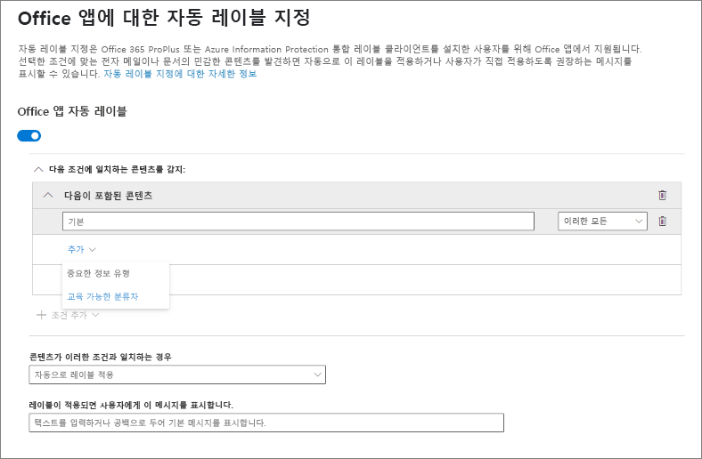
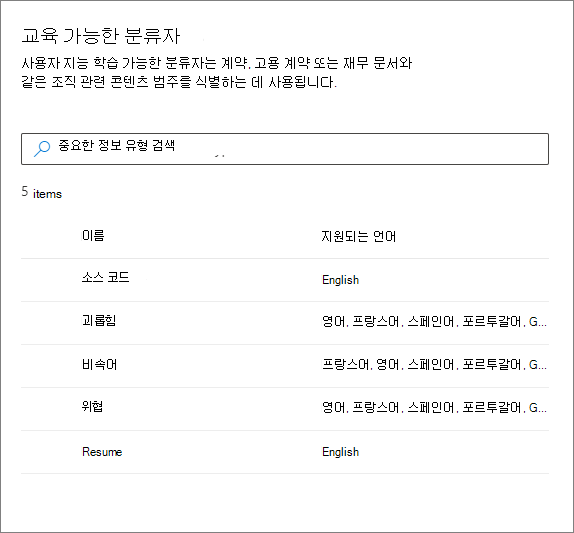
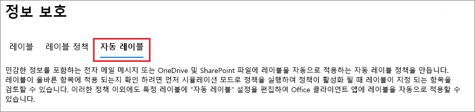
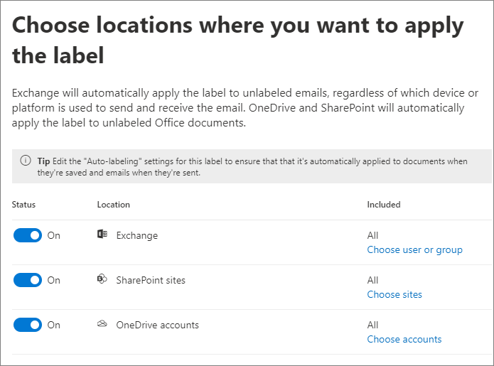
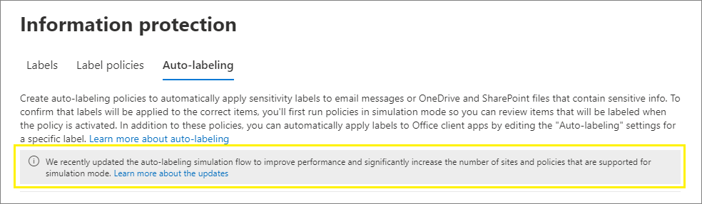

# <a name="apply-a-sensitivity-label-to-content-automatically"></a>콘텐츠에 민감도 레이블을 자동으로 적용

>*[보안 및 규정 준수에 대한 Microsoft 365 라이선싱 지침](/office365/servicedescriptions/microsoft-365-service-descriptions/microsoft-365-tenantlevel-services-licensing-guidance/microsoft-365-security-compliance-licensing-guidance).*

> [!NOTE]
> 현재 Azure Purview(미리 보기)에서 레이블 자동 적용에 대한 자세한 내용은 [Azure Purview에서 콘텐츠에 레이블 자동 적용](/azure/purview/create-sensitivity-label)을 참조하세요.

민감도 레이블을 만들 때 사용자가 지정한 조건과 일치하는 경우 해당 레이블을 파일 및 전자 메일에 자동으로 붙일 수 있습니다.

콘텐츠에 자동으로 민감도 레이블을 적용하는 기능은 다음과 같은 이유로 중요합니다.

- 사용자에게 각 분류를 언제 사용할지 교육할 필요가 없습니다.

- 모든 콘텐츠를 올바르게 분류하기 위해 사용자에게 의존할 필요가 없습니다.

- 사용자가 더 이상 정책을 알 필요가 없으며, 대신 업무에 집중할 수 있습니다.

콘텐츠에 수동으로 레이블을 지정한 경우 해당 레이블은 자동 레이블로 대체되지 않습니다. 그러나 자동으로 적용된 [우선 순위 낮은 레이블](sensitivity-labels.md#label-priority-order-matters)이 자동 레이블 적용 기능에 의해 변경될 수 있습니다.

Microsoft 365에서 콘텐츠에 민감도 레이블을 자동으로 적용하는 방법에는 두 가지가 있습니다.

- **사용자가 문서를 편집하거나 전자 메일을 작성(답장 또는 전달) 시 클라이언트 쪽 레이블 지정**: 파일 및 전자 메일(Word, Excel, PowerPoint 및 Outlook 포함)에 자동 레이블을 지정하기 위해 구성된 레이블을 사용합니다.

    이 방법은 자동 레이블 적용 뿐만 아니라 사용자에게 레이블 권장을 지원합니다. 그러나 두 경우 모두 사용자가 레이블을 수락할지 또는 거부할지 결정하여 내용에 올바른 레이블을 지정할 수 있도록 합니다. 이 클라이언트 쪽 레이블에는 문서가 저장되기 전에 레이블을 지정할 수 있으므로 문서에 대한 지연 시간이 최소화됩니다. 그러나 일부 클라이언트 앱에서는 자동 레이블 지정을 지원하지 않습니다. 이 기능은 Azure Information Protection 통합 레이블 지정 클라이언트 및 [일부 버전의 Office](sensitivity-labels-office-apps.md#support-for-sensitivity-label-capabilities-in-apps)에서 지원됩니다.

    구성 방법에 대한 자세한 내용은 이 페이지에서 [Office 앱에 대한 자동 레이블 지정 구성 방법](#how-to-configure-auto-labeling-for-office-apps)을 참조하세요.

- **콘텐츠가 이미 저장되었거나(SharePoint 또는 OneDrive) 전자 메일로 전송(Exchange Online에서 처리됨)된 경우 서비스쪽 레이블 지정**: 자동 레이블 지정 정책을 사용합니다.

  이 메서드는 미사용 데이터(SharePoint 및 OneDrive의 문서) 및 전송 중인 데이터(Exchange에서 보내거나 받은 전자 메일)에 대한 자동 레이블 지정이라고 불리기도 합니다. Exchange의 경우에는 미사용 전자 메일(사서함)을 포함하지 않습니다.

  이 레이블 지정은 응용 프로그램이 아닌 서비스에서 적용되므로 사용자에게 어떤 버전의 앱이 있는지 걱정할 필요가 없습니다. 따라서 이 기능은 조직 전체에서 즉시 사용할 수 있으며 대규모로 레이블을 지정하는 데 적합합니다. 자동 레이블 지정 정책은 사용자가 레이블 지정 프로세스와 상호 작용하지 않기 때문에 권장되는 레이블 지정을 지원하지 않습니다. 대신 관리자가 시뮬레이션 모드에서 정책을 실행하여 실제로 레이블을 적용하기 전에 콘텐츠의 올바른 레이블을 확인합니다.

  구성 지침은 이 페이지에서 [SharePoint, OneDrive 및 Exchange에 대한 자동 레이블 지정 정책을 구성하는 방법](#how-to-configure-auto-labeling-policies-for-sharepoint-onedrive-and-exchange)을 참조하세요.

  SharePoint 및 OneDrive에 대한 자동 레이블 지정에만 해당:

  - Word, PowerPoint, Excel Office 파일은 지원됩니다. Open XML 형식(예: .docx, .xlsx)은 지원되지만, Microsoft Office 97~2003 형식(예: .doc, .xls)은 지원되지 않습니다.
    - 이러한 파일은 자동 레이블 지정 정책이 작성되기 전이나 만들어진 후에 유휴 상태로 자동 레이블링될 수 있습니다. 파일이 열려 있는 세션(파일이 열려 있는 경우)의 일부인 경우 자동 레이블을 지정할 수 없습니다.
    - 현재 목록 항목에 대한 첨부 파일은 지원되지 않으며 레이블이 자동 지정되지 않습니다.
  - 테넌트에서 하루 최대 25,000개의 자동 레이블 지정 파일 수.
  - 개별적으로 지정된 경우 최대 100개의 사이트(SharePoint 또는 OneDrive)를 대상으로 하는 테넌트당 최대 100개의 자동 레이블 정책. 또한 모든 사이트를 지정할 수 있으며 이 구성은 최대 100개 사이트에서 제외됩니다.
  - 시뮬레이션 모드 및 레이블 적용 시 둘 다의 경우 자동 레이블링 정책의 결과로 수정됨, 수정자 및 날짜에 대한 기존 값은 변경되지 않습니다.
  - 레이블이 암호화를 적용하는 경우 [권한 관리 발행자 및 권한 관리 소유자](/azure/information-protection/configure-usage-rights#rights-management-issuer-and-rights-management-owner)는 파일을 마지막으로 수정한 계정입니다.

  Exchange 자동 레이블 지정에만 해당:

  - Office 앱을 사용하는 수동 레이블 지정 또는 자동 레이블 기능과는 달리, PDF 첨부 파일과 Office 첨부 파일(Word, Excel, PowerPoint 파일)에도 자동 레이블 지정 정책에서 지정한 조건에 대한 검사가 실시됩니다. 일치하는 경우 전자 메일에는 레이블이 지정되지만 첨부 파일에는 지정되지 않습니다.
    - PDF 파일의 경우, 레이블이 암호화를 적용한다면 테넌트가 [PDF 첨부 파일을 사용](ome-faq.yml#are-pdf-file-attachments-supported-)할 때 해당 파일이 암호화됩니다.
    - Office 파일의 경우, Open XML 형식(예: .docx 및 .xlsx)은 지원되지만, Microsoft Office 97~2003 형식(예: .doc 및 .xls)은 지원되지 않습니다. 레이블이 암호화를 적용할 경우 해당 파일은 암호화됩니다.
  - IRM 암호화를 적용하는 Exchange 메일 흐름 규칙 또는 DLP(데이터 손실 방지) 정책이 있는 경우: 이러한 규칙 또는 정책과 자동 레이블 지정 정책으로 콘텐츠를 식별하면 레이블이 적용됩니다. 해당 레이블이 암호화를 적용하면 Exchange 메일 흐름 규칙 또는 DLP 정책의 IRM 설정이 무시됩니다. 그러나 해당 레이블에 암호화가 적용되지 않으면 레이블과 더불어 메일 흐름 규칙 또는 DLP 정책의 IRM 설정이 적용됩니다.
  - 레이블이 없는 IRM 암호화를 포함하는 전자 메일은 자동 레이블 지정을 사용하여 일치하는 항목이 있는 경우 모든 암호화 설정이 있는 레이블로 대체됩니다.
  - 자동 레이블 지정 조건과 일치하는 경우 수신 전자 메일에 레이블이 지정됩니다.
    - [암호화](encryption-sensitivity-labels.md)를 위해 레이블을 구성하는 경우 해당 암호화는 적용되지 않습니다.
    - [동적 표시](sensitivity-labels-office-apps.md#dynamic-markings-with-variables)를 적용하기 위해 레이블을 구성하는 경우, 결과에 조직 외부 사용자의 이름이 표시될 수 있다는 사실을 명심하세요.
  - 레이블이 암호화를 적용하는 경우 [권한 관리 발행자 및 권한 관리 소유자](/azure/information-protection/configure-usage-rights#rights-management-issuer-and-rights-management-owner)는 전자 메일을 보낸 사람입니다. 현재는 들어오는 모든 전자 메일 메시지에 대해 자동으로 암호화되는 권한 관리자 소유자를 설정할 수 있는 방법이 없습니다.

## <a name="compare-auto-labeling-for-office-apps-with-auto-labeling-policies"></a>자동 레이블 지정 정책과 Office 앱에 대한 자동 레이블 지정 비교

다음 표를 사용하면 두 가지 보완적인 자동 레이블 지정 방법의 동작이 어떻게 차이나는지 알아볼 수 있습니다.

|기능 또는 동작|레이블 설정: 파일 및 전자 메일에 자동 레이블 지정  |정책: 자동 레이블 지정|
|:-----|:-----|:-----|
|앱 종속성|예([최소 버전](sensitivity-labels-office-apps.md#support-for-sensitivity-label-capabilities-in-apps)) |아니요\* |
|위치별 제한|아니오 |예 |
|조건: 사용자 지정 중요한 정보 유형에 대한 정확한 데이터 일치|예 |아니요 |
|조건: 훈련 가능한 분류자|예 |아니요 |
|조건: 전자 메일 공유 옵션 및 추가 옵션|아니요 |예 |
|조건: 예외|아니요 |예(전자 메일만 해당) |
|권장 사항, 정책 도구 설명 및 사용자 재정의|예 |아니요 |
|시뮬레이션 모드|아니요 |예 |
|조건이 확인된 Exchange 첨부 파일|아니요 | 예|
|시각적 표시 적용 |예 |예(전자 메일만 해당) |
|레이블 없이 적용된 IRM 암호화 재정의|예(사용자에게 내보내기의 최소 사용 권한이 있는 경우) |예(전자 메일만 해당) |
|받는 전자 메일에 레이블 지정|아니요 |예|

\* 현재 모든 지역에서 자동 레이블을 사용할 수 있는 것은 아닙니다. 테넌트에서 이 기능을 지원할 수 없는 경우 **자동 레이블 지정** 탭이 준수 센터에 표시되지 않습니다.

## <a name="how-multiple-conditions-are-evaluated-when-they-apply-to-more-than-one-label"></a>여러 조건에 두 개 이상의 레이블을 적용했을 때 평가 방식

레이블은 정책에서 지정한 위치에 따라 평가되도록 정렬됩니다. 먼저 배치된 레이블은 가장 낮은 위치에 있고(가장 민감하지 않음) 마지막에 위치한 레이블은 가장 높은 위치에 배치됩니다(가장 민감합니다). 우선 순위에 대한 자세한 내용은 [레이블 우선 순위 (순서 관련 문제)](sensitivity-labels.md#label-priority-order-matters)를 참조하세요.

## <a name="dont-configure-a-parent-label-to-be-applied-automatically-or-recommended"></a>상위 레이블이 자동으로 적용되거나 권장되도록 구성하지 않음

상위 레이블(하위 레이블이 있는 레이블)은 콘텐츠에 적용할 수 없습니다. Office 앱에서 상위 레이블을 자동으로 적용하거나 권장하도록 구성하지 않았는지 확인하고 자동 레이블 정책에 대한 상위 레이블을 선택하지 마세요. 이렇게 하면 상위 레이블이 콘텐츠에 적용되지 않습니다.

하위 레이블과 함께 자동 레이블을 사용하려면 상위 레이블과 하위 레이블을 모두 게시해야 합니다.

상위 레이블 및 하위 레이블에 대한 자세한 내용은 [하위 레이블(레이블 그룹화)](sensitivity-labels.md#sublabels-grouping-labels)을 참조하세요.

## <a name="how-to-configure-auto-labeling-for-office-apps"></a>Office 앱에 대한 자동 레이블 지정을 구성하는 방법

Office 앱의 기본 제공 레이블 지정의 경우 Office 앱에서 자동 레이블 지정에 [필요한 최소 버전](sensitivity-labels-office-apps.md#support-for-sensitivity-label-capabilities-in-apps)을 확인합니다.

Azure Information Protection 통합 레이블 지정 클라이언트는 기본 제공 및 사용자 지정 중요한 정보 유형에 대한 자동 레이블 지정을 지원하지만 학습 가능한 분류자 또는 EDM(정확한 데이터 일치)을 사용하는 중요한 정보 유형에는 지원되지 않습니다.

[민감도 레이블을 만들거나 편집](create-sensitivity-labels.md)하는 경우, Office 앱에 대한 자동 레이블 지정 설정을 사용할 수 있습니다. **파일 및 전자 메일** 이 레이블 범위에서 선택되어 있는지 확인합니다.


구성을 거쳐 이동하면서 중요한 정보 유형 또는 교육 가능한 분류자 목록에서 사용자가 선택할 수 있는 **파일 및 전자 메일의 자동 레이블 지정** 페이지를 볼 수 있습니다.



이 민감도 레이블이 자동으로 적용되면 사용자는 Office 앱에서 알림을 보게 됩니다. 다음은 그 예시입니다.


### <a name="configuring-sensitive-info-types-for-a-label"></a>레이블에 대한 중요한 정보 유형 구성

**중요한 정보 유형** 옵션을 선택하면 DLP(데이터 손실 방지) 정책을 만들 때 같은 중요한 정보 유형 목록이 표시됩니다. 예를 들어 신용카드 번호, 주민등록번호 또는 여권 번호와 같은 고객의 개인 정보를 포함하는 모든 콘텐츠에 자동으로 기밀 유지 레이블을 적용할 수 있습니다.


DLP 정책을 구성할 때와 마찬가지로 인스턴스 수와 일치 정확성을 변경하여 조건을 구체화할 수 있습니다. 다음은 그 예시입니다.


이러한 구성 옵션에 대한 자세한 내용은 DLP 설명서 [일치하기 더욱 쉽게 혹은 어렵게 만드는 튜닝 규칙](data-loss-prevention-policies.md#tuning-rules-to-make-them-easier-or-harder-to-match)을 참조하세요.

또한 DLP 정책 구성과 마찬가지로 조건이 모든 중요한 정보 유형을 탐지해야 하는지 또는 이러한 정보 유형 중 하나만 탐지해야 하는지 선택할 수 있습니다. 또한 조건을 더 유연하고 복잡하게 만들기 위해 [그룹을 추가하고 그룹 간에 논리 연산자를 사용](data-loss-prevention-policies.md)할 수 있습니다.

> [!NOTE]
> 사용자 지정 중요 정보 유형에 따른 자동 레이블 지정은 기존 콘텐츠가 아닌 OneDrive 및 SharePoint에서 새로 작성되거나 수정된 콘텐츠에만 적용됩니다. 이 제한은 자동 레이블 지정 정책에도 적용됩니다.

#### <a name="custom-sensitive-information-types-with-exact-data-match"></a>정확한 데이터 일치가 포함된 사용자 지정 중요한 정보 유형

사용자 지정 중요한 정보 유형에 대해 [정확한 데이터 일치(EDM) 기반 분류](create-custom-sensitive-information-types-with-exact-data-match-based-classification.md)를 사용하도록 민감도 레이블을 구성할 수 있습니다. 그러나 현재로서는 EDM을 사용하지 않는 중요한 정보 유형도 하나 이상 지정해야 합니다. 예를 들어 **신용카드 번호** 와 같은 기본 제공 중요한 정보 유형 중 하나입니다.

중요한 정보 유형 조건에 대해 EDM만 사용하여 민감도 레이블을 구성하면 레이블에 대한 자동 레이블 설정이 자동으로 꺼집니다.

### <a name="configuring-trainable-classifiers-for-a-label"></a>레이블에 교육 가능한 분류자 구성하기

이 옵션을 사용하는 경우 자동 레이블 지정과 [중요한 정보 유형 옵션](#configuring-sensitive-info-types-for-a-label)에 구성된 하나 이상의 다른 민감도 레이블을 테넌트에 게시했는지 확인하세요.

**교육 가능한 분류자** 옵션을 선택하는 경우, Microsoft의 기본 제공 교육 가능 분류자를 하나 이상 선택합니다. 사용자 지정 교육 가능 분류자를 만든 경우, 다음의 사항 또한 선택할 수 있습니다.



해당 분류자에 대한 자세한 내용은 [학습 가능한 분류자에 대한 자세한 정보](classifier-learn-about.md)를 참조하세요.

### <a name="recommend-that-the-user-applies-a-sensitivity-label"></a>사용자가 민감도 레이블을 적용하는 것이 좋습니다.

원한다면 사용자에게 레이블을 적용하도록 권장할 수 있습니다. 이 옵션을 사용하면 사용자가 분류와 모든 관련 보호를 수락할 수 있으며, 사용자 콘텐츠에 레이블이 적합하지 않다면 권장 사항을 무시할 수 있습니다.


다음은 사용자 지정 정책 팁을 사용하여 레이블을 권장 작업으로 적용하도록 조건을 구성할 때 Azure Information Protection 통합 레이블 지정 클라이언트에서 표시되는 메시지의 예입니다. 정책 팁에 표시될 텍스트를 선택할 수 있습니다.


### <a name="when-automatic-or-recommended-labels-are-applied"></a>자동 또는 권장 레이블이 적용되는 경우

Office 앱의 자동 및 권장 레이블 지정 구현은 Office 기본 제공 레이블을 사용할지, Azure Information Protection 통합 레이블 지정 클라이언트를 사용할지에 따라 달라집니다. 하지만 다음은 두 경우에 모두 해당합니다.

- 이전에 수동으로 레이블이 지정되었거나, 더 높은 수준의 민감성으로 자동으로 레이블이 지정된 적이 있는 문서나 전자 메일에 대해서는 자동 레이블 지정을 사용할 수 없습니다. 문서나 전자 메일에는 하나의 보존 레이블과 하나의 민감도 레이블만 적용할 수 있다는 사실을 기억하세요.

- 이전에 더 높은 민감성으로 레이블이 지정된 적이 있는 문서나 전자 메일에 대해서는 권장 레이블 지정을 사용할 수 없습니다. 콘텐츠가 이미 더 높은 민감도로 레이블 지정되었다면 사용자에게는 권장 사항과 정책 팁이 담긴 메시지가 표시되지 않습니다.

기본 제공 레이블 지정과 관련된 내용:

- 모든 Office 앱이 자동(및 권장) 레이블 지정을 지원하는 것은 아닙니다. 자세한 내용은 [앱에서의 민감도 레이블 기능에 대한 지원](sensitivity-labels-office-apps.md#support-for-sensitivity-label-capabilities-in-apps)을 참조하세요.

- 데스크톱 버전의 Word에서 권장되는 레이블의 경우 사용자가 권장되는 민감도 레이블을 적용하는 대신, 중요한 콘텐츠를 검토하고 제거할 수 있도록 권장 사항을 트리거한 중요한 콘텐츠에 플래그가 지정됩니다.

- Office 앱에서 이러한 레이블을 적용하는 방법에 대한 자세한 내용과 예제 스크린샷 및 중요한 정보를 검색하는 방법에 대한 자세한 내용은 [Office에서 파일 및 전자 메일에 자동으로 민감도 레이블 적용 또는 추천](https://support.microsoft.com/office/automatically-apply-or-recommend-sensitivity-labels-to-your-files-and-emails-in-office-622e0d9c-f38c-470a-bcdb-9e90b24d71a1)을 참조하세요.

Azure Information Protection 통합 레이블 지정 클라이언트와 관련된 내용:

- 자동 및 권장되는 레이블은 문서를 저장할 때는 Word, Excel 및 PowerPoint에 적용되고, 전자 메일을 보낼 때는 Outlook에 적용됩니다.

- Outlook에서 권장되는 레이블 지정을 지원하려면 먼저 [고급 정책 설정](/azure/information-protection/rms-client/clientv2-admin-guide-customizations#enable-recommended-classification-in-outlook)을 구성해야 합니다.

- 문서 및 전자 메일의 본문 텍스트와 머리글 및 바닥글에서는 중요한 정보를 검색할 수 있지만, 전자 메일의 제목 줄이나 첨부 파일에서는 중요한 정보를 검색할 수 없습니다.

## <a name="how-to-configure-auto-labeling-policies-for-sharepoint-onedrive-and-exchange"></a>SharePoint, OneDrive 및 Exchange에 대한 자동 레이블 지정 정책을 구성하는 방법

반드시 자동 레이블 정책을 구성하기 전에 먼저 필수 조건을 알고 있어야 합니다.

### <a name="prerequisites-for-auto-labeling-policies"></a>자동 레이블 지정 정책에 대한 필수 구성 요소

- 시뮬레이션 모드:
  - Microsoft 365에 대한 감사가 설정되어 있어야 합니다. 감사를 설정해야 하거나 감사가 이미 설정되어 있는지 확실하지 않은 경우에는 [감사 로그 검색 켜기 또는 끄기](turn-audit-log-search-on-or-off.md)를 참조하세요.
  - 원본 보기에서 파일 또는 전자 메일 콘텐츠를 보려면 **콘텐츠 탐색기 콘텐츠 뷰어** 역할을 보유하고 있어야 합니다. 전역 관리자에게는 기본적으로 해당 역할이 없습니다. 이 권한이 없는 경우 **일치하는 항목** 탭에서 항목을 선택할 때 미리 보기 창이 표시되지 않습니다.

- SharePoint 및 OneDrive에서 파일에 자동 레이블을 지정하려면 다음을 수행합니다.
  - [SharePoint 및 OneDrive에서 Office 파일에 대한 민감도 레이블을 사용하도록 설정](sensitivity-labels-sharepoint-onedrive-files.md)합니다.
  - 자동 레이블 지정 정책이 실행될 때 다른 프로세스나 사용자가 파일을 열면 안됩니다. 편집을 위해 체크 아웃된 파일은 이 범주로 분류됩니다.

- 기본 제공 민감도 유형이 아닌 [사용자 지정 민감도 정보 유형](sensitive-information-type-learn-about.md)을 사용하려는 경우:
  - 사용자 정의 민감도 정보 유형은 사용자 정의 민감도 정보 유형이 작성된 후 SharePoint 또는 OneDrive에서 추가되거나 수정된 콘텐츠에만 적용됩니다.
  - 새로운 사용자 지정 민감도 정보 유형을 테스트하려면 자동 레이블 지정 정책을 만들기 전에 해당 유형을 만든 다음 테스트용 샘플 데이터가 포함된 새 문서를 만듭니다.

- 자동 레이블 지정 정책에 대해 선택할 수 있는 하나 이상의 민감도 레이블이 [생성 및 게시](create-sensitivity-labels.md)(적어도 한 명의 사용자에게) 됩니다. 이러한 레이블의 경우:
  - 소개에 설명된 대로 레이블 설정은 자동 레이블 지정 정책을 보완하기 때문에 Office 앱 레이블 설정의 자동 레이블 지정 설정이 켜져 있는지 여부는 중요하지 않습니다.
  - 자동 레이블에 사용하려는 레이블이 시각적 표시(머리글, 바닥글, 워터 마크)를 사용하도록 구성된 경우 문서에는 적용되지 않습니다.
  - 레이블이 [암호화](encryption-sensitivity-labels.md)를 적용하는 경우:
    - 자동 레이블 지정 정책에 SharePoint 또는 OneDrive의 위치가 포함된 경우, **지금 사용 권한 할당** 에 대해 레이블을 구성해야 합니다.
    - 자동 레이블 지정 정책이 Exchange 전용인 경우 **지금 사용 권한 할당** 또는 **사용자가 사용 권한을 할당하도록 허용**(전달하지 않음 또는 암호화 전용인 경우)에 대해 레이블을 구성할 수 있습니다.

### <a name="learn-about-simulation-mode"></a>시뮬레이션 모드에 대해 알아보기

시뮬레이션 모드는 자동 레이블 지정 정책에 고유하며 워크플로에 적합합니다. 정책에서 적어도 한 번의 시뮬레이션이 실행될 때까지 문서 및 전자 메일에 자동으로 레이블을 지정할 수 없습니다.

자동 레이블 지정 정책의 워크플로:

1. 자동 레이블 정책 만들기 및 구성

2. 시뮬레이션 모드에서 정책을 실행하며 완료하는 데 12시간이 걸릴 수 있습니다. 시뮬레이션이 완료되면 [활동 경고](alert-policies.md)를 받도록 구성된 사용자에게 전송되는 전자 메일 알림을 트리거합니다.

3. 결과를 검토하고 필요한 경우 정책을 구체화합니다. 응답 모드를 다시 실행하고 다시 완료될 때까지 기다립니다.

4. 필요한 경우 3단계를 반복합니다.

5. 프로덕션에서 배포.

시뮬레이션된 배포는 PowerShell의 WhatIf 매개 변수처럼 실행됩니다. 사용자가 정의한 규칙을 사용하여 자동 레이블 지정 정책이 선택한 레이블을 적용한 것처럼 보고된 결과를 볼 수 있습니다. 그런 다음 필요한 경우 규칙을 조정하고 시뮬레이션을 다시 실행할 수 있습니다. 그러나 Exchange용 자동 레이블 지정은 사서함에 저장된 전자 메일이 아닌 보내고 받는 전자 메일에 적용되기 때문에, 정확히 같은 전자 메일 메시지를 보내고 받을 수 없는 한 시뮬레이션의 전자 메일에 대한 결과가 일관되길 기대하지 않습니다.

또한 시뮬레이션 모드를 사용하면 배포 전에 자동 레이블 지정 정책의 범위를 단계적으로 늘릴 수 있습니다. 예를 들어 단일 문서 라이브러리를 사용하여 SharePoint 사이트와 같은 단일 위치에서 시작할 수 있습니다. 그런 다음 반복적인 변경으로 범위를 여러 사이트로 늘리고 OneDrive와 같은 다른 위치로 범위를 늘립니다.

마지막으로 시뮬레이션 모드를 사용하여 자동 레이블 지정 정책을 실행하는 데 필요한 시간을 대략적으로 제공하여 시뮬레이션 모드없이 실행할 시기를 계획하고 예약할 수 있습니다.

### <a name="creating-an-auto-labeling-policy"></a>자동 레이블 지정 정책 만들기

1. <a href="https://go.microsoft.com/fwlink/p/?linkid=2077149" target="_blank">Microsoft 365 규정 준수 센터</a>에서 민감도 레이블로 이동합니다.

    - **솔루션** > **정보 보호**

    이 옵션이 바로 보이지 않는 경우에는 먼저 **모두 표시** 를 선택합니다.

2. **자동 레이블 지정** 탭을 선택합니다.

    

    > [!NOTE]
    > **자동 레이블** 탭이 보이지 않으면 현재 해당 지역에서 이 기능을 사용할 수 없습니다.

3. **+ 자동 레이블 지정 정책 만들기** 를 선택합니다. 그러면 새 정책 구성이 시작됩니다.

    

4. **이 레이블을 적용할 정보 선택** 페이지에서 **재무** 또는 **개인 정보 보호** 와 같은 템플릿 중 하나를 선택합니다. **표시 옵션** 드롭 다운을 사용하여 검색을 구체화할 수 있습니다. 또는 템플릿이 요구 사항을 충족하지 않으면 **사용자 지정 정책** 을 선택합니다. **다음** 을 선택합니다.

5. **자동 레이블 지정 정책 이름 지정** 페이지에서 고유한 이름을 입력하고, 필요에 따라 레이블을 지정할 콘텐츠를 식별하는 자동으로 적용되는 레이블, 위치 및 조건을 식별하는 데 도움이 되는 설명을 입력합니다.

6. **레이블을 적용할 위치 선택** 페이지에서 Exchange, SharePoint 사이트 및 OneDrive의 위치를 선택하고 지정합니다. 선택한 위치에 대한 기본값 **모두** 를 유지하지 않으려면 링크를 선택하여 특정 인스턴스를 선택합니다. 그런 후 **다음** 을 선택합니다.

    
    
    개별 OneDrive 계정을 지정하려면 [조직의 모든 사용자 OneDrive URL 목록 가져오기](/onedrive/list-onedrive-urls)를 참조하세요.

7. **일반 또는 고급 규칙 설정** 페이지의 경우: 선택한 모든 위치에서 레이블을 지정할 콘텐츠를 식별하는 규칙을 정의하기 위해 **일반 규칙** 의 기본값을 유지합니다. 위치마다 다른 규칙이 필요한 경우 **고급 규칙** 을 선택합니다. 그런 후 **다음** 을 선택합니다.

    이 규칙은 민감한 정보 유형 및 공유 옵션이 포함된 조건을 사용합니다.
    - 민감한 정보 유형의 경우 기본 제공 정보 유형과 사용자 지정 민감한 정보 유형을 모두 선택할 수 있습니다.
    - 공유 옵션의 경우 **조직 내부의 사용자만** 또는 **조직 외부의 사용자** 를 선택할 수 있습니다.

    유일한 위치가 **Exchange** 이거나 **고급 규칙** 을 선택한 경우 다음과 같은 추가 조건을 선택할 수 있습니다.
    - 보낸 사람 IP 주소는
    - 받는 사람 도메인은
    - 받는 사람은
    - 첨부 파일 확장명은
    - 첨부 파일이 암호로 보호됨
    - 전자 메일 첨부 파일의 콘텐츠를 검사할 수 없음
    - 전자 메일 첨부 파일 내용의 검사가 완료되지 않음
    - 헤더가 패턴과 일치
    - 제목이 패턴과 일치
    - 받는 사람 주소에 단어가 포함되어 있음
    - 받는 사람 주소가 패턴과 일치
    - 보낸 사람 주소가 패턴과 일치
    - 보낸 사람 도메인은
    - 받는 사람이 다음의 구성원임
    - 보낸 사람은

    이러한 각 조건에 대해 예외를 지정할 수 있습니다.

8. 이제 이전 선택에 따라 조건 및 예외를 사용하여 새 규칙을 만들 수 있습니다.

    민감한 정보 유형의 구성 옵션은 Office 앱에 대한 자동 레이블 지정에 대해 선택한 것과 동일합니다. 자세한 정보가 필요한 경우 [레이블에 민감한 정보 유형 구성](#configuring-sensitive-info-types-for-a-label)을 참조하세요.

    필요한 모든 규칙을 정의하고 해당 상태가 켜져 있음을 확인한 후 **다음** 을 선택하여 자동 적용을 위해 레이블 선택으로 이동합니다.

9. **자동 적용할 레이블 선택** 페이지에서 **+ 레이블 선택** 을 선택하고, **민감도 레이블 선택** 창에서 레이블을 선택한 후 **다음** 을 선택합니다.

10. **정책을 지금 또는 나중에 테스트할지 결정** 페이지의 경우: 지금 자동 레이블 지정 정책을 실행할 준비가 되었으면 **시뮬레이션 모드에서 정책 실행** 을 선택합니다. 그렇지 않으면 **정책을 해제로 두기** 를 선택합니다. **다음** 을 선택합니다.

    

11. **요약** 페이지에서 자동 레이블 지정 정책의 구성을 검토하고 필요한 사항을 변경한 후 구성을 완료합니다.

이제 **정보 보호** > **자동 레이블 지정** 페이지에서 **시뮬레이션** 혹은 **끄기** 구역에 시뮬레이션 모드에서 실행할지의 선택 여부에 따라 자동 레이블 지정 정책이 표시됩니다. 구성 및 상태에 대한 세부 사항을 보려면 정책을 선택합니다(예: **정책 시뮬레이션을 아직 실행 중**). 시뮬레이션 모드에서의 정책의 경우 **일치 항목** 탭을 선택하여 지정한 규칙과 일치하는 전자 메일 또는 문서를 확인합니다.

다음의 인터페이스에서 직접 정책을 수정할 수 있습니다.

- **끄기** 구역에 있는 정책의 경우 **정책 편집** 단추를 선택합니다.

- **시뮬레이션** 구역에 있는 정책의 경우 페이지 맨 위의 다음과 같은 탭에서 **편집** 옵션을 선택합니다.

    

    시뮬레이션없이 정책을 실행할 준비가 되면 **정책 켜기** 옵션을 선택합니다.

자동 정책은 삭제될 때까지 계속 실행됩니다. 예를 들어 새 문서와 수정된 문서는 현재 정책 설정에 포함됩니다.

적절한 [권한](data-classification-content-explorer.md#permissions)이 있는 경우 [콘텐츠 탐색기](data-classification-content-explorer.md)를 사용하여 자동 레이블 지정 정책의 결과를 볼 수도 있습니다.

- **콘텐츠 탐색기 목록 뷰어** 를 사용하면 파일 내용이 아닌 파일의 레이블을 볼 수 있습니다.
- **콘텐츠 탐색기 콘텐츠 뷰어** 를 사용하면 파일 내용을 볼 수 있습니다.

> [!TIP]
> 또한 콘텐츠 탐색기를 사용하여 민감한 정보가 포함된 문서가 있지만 레이블이 지정되지 않은 위치를 식별할 수도 있습니다. 이 정보를 사용하여 이러한 위치를 자동 레이블 지정 정책에 추가하고 식별된 민감한 정보 유형을 규칙으로 포함합니다.

### <a name="use-powershell-for-auto-labeling-policies"></a>자동 레이블 지정 정책을 위한 PowerShell 사용

[보안 및 준수 센터 PowerShell](/powershell/exchange/scc-powershell)을 사용하여 자동 레이블 지정 정책을 만들고 구성할 수 있습니다. 즉, 자동 레이블 지정 정책의 생성 및 유지 관리를 완전히 스크립팅할 수 있으며 OneDrive 및 SharePoint 위치에 대해 여러 URL을 지정하는 보다 효율적인 방법을 제공합니다.

PowerShell에서 명령을 실행하기 전에 먼저 [보안 및 준수 센터 PowerShell에 연결](/powershell/exchange/connect-to-scc-powershell)해야 합니다.

새 자동 레이블 지정 정책을 생성하려면 다음을 수행하세요.

```powershell
New-AutoSensitivityLabelPolicy -Name <AutoLabelingPolicyName> -SharePointLocation "<SharePointSiteLocation>" -ApplySensitivityLabel <Label> -Mode TestWithoutNotifications
```

이 명령은 지정한 SharePoint 사이트에 대한 자동 레이블 지정 정책을 만듭니다. OneDrive 위치의 경우 *OneDriveLocation* 매개 변수를 대신 사용하세요.

기존 자동 레이블 지정 정책에 사이트를 추가하려면 다음 단계를 따르세요.

```powershell
$spoLocations = @("<SharePointSiteLocation1>","<SharePointSiteLocation2>")
Set-AutoSensitivityLabelPolicy -Identity <AutoLabelingPolicyName> -AddSharePointLocation $spoLocations -ApplySensitivityLabel <Label> -Mode TestWithoutNotifications
```

이 명령은 기존 자동 레이블 지정 정책에 추가되는 변수의 추가 SharePoint URL을 지정합니다. OneDrive 위치를 대신 추가하려면 *$OneDriveLocations* 와 같은 다른 변수와 함께 *AddOneDriveLocation* 매개 변수를 사용하세요.

새로운 자동 레이블 지정 정책 규칙을 만들려면 다음을 수행하세요.

```powershell
New-AutoSensitivityLabelRule -Policy <AutoLabelingPolicyName> -Name <AutoLabelingRuleName> -ContentContainsSensitiveInformation @{"name"= "a44669fe-0d48-453d-a9b1-2cc83f2cba77"; "mincount" = "2"} -Workload SharePoint
```

기존 자동 레이블 지정 정책의 경우, 이 명령은 엔터티 ID가 a44669fe-0d48-453d-a9b1-2cc83f2cba77인 **미국 사회 보장 번호(SSN)** 의 중요한 정보 유형을 감지하는 새 정책 규칙을 만듭니다. 다른 중요한 정보 유형의 엔티티 ID를 찾으려면 [중요한 정보 유형 엔터티 정의](sensitive-information-type-entity-definitions.md)를 참조하세요.

자동 레이블 지정 정책을 지원하는 PowerShell cmdlet, 사용 가능한 매개 변수 및 몇 가지 예에 대한 자세한 내용은 다음 cmdlet 도움말을 참조하세요.

- [Get-AutoSensitivityLabelPolicy](/powershell/module/exchange/get-autosensitivitylabelpolicy)
- [New-AutoSensitivityLabelPolicy](/powershell/module/exchange/new-autosensitivitylabelpolicy)
- [New-AutoSensitivityLabelRule](/powershell/module/exchange/new-autosensitivitylabelrule)
- [Remove-AutoSensitivityLabelPolicy](/powershell/module/exchange/remove-autosensitivitylabelpolicy)
- [Remove-AutoSensitivityLabelRule](/powershell/module/exchange/remove-autosensitivitylabelrule)
- [Set-AutoSensitivityLabelPolicy](/powershell/module/exchange/set-autosensitivitylabelpolicy)
- [Set-AutoSensitivityLabelRule](/powershell/module/exchange/set-autosensitivitylabelrule)

## <a name="recent-enhancements-for-auto-labeling-policies"></a>자동 레이블 지정 정책에 대한 최근 개선 사항

OneDrive 및 SharePoint에 대한 자동 레이블 지정 정책에 대한 최근 개선 사항에는 이전 버전에서 다음과 같이 개선된 사항이 포함됩니다.

- 테넌트당 10개가 아닌 최대 100개의 자동 레이블 지정 정책.

- 모든 OneDrive 및 SharePoint 사이트에 대한 지원(새 정책의 기본값) 및 URL로 각 사이트를 입력할 필요 없이 사용 가능한 SharePoint 사이트를 선택하는 기능. 새 기본값인 **모두** 를 사용하면 테넌트의 모든 기존 SharePoint 사이트 및 OneDrive 계정과 새로 생성된 사이트 및 계정이 정책에 자동으로 포함됩니다. SharePoint용으로 **사이트 선택** 을 선택하면 필요한 경우 URL로 사이트를 수동으로 입력할 수 있습니다.

- 자동 레이블 지정 정책에서 개별 사이트를 지정할 때 이제 10개 사이트 대신 최대 100개 사이트가 지원됩니다.

- 자동 레이블 지정 정책당 최대 1,000,000개의 일치 파일이 제공되지만 테넌트에서 하루에 자동 레이블이 지정된 총 25,000개의 파일은 동일하게 유지됩니다.

- 시뮬레이션 개선 사항:
  - 시뮬레이션 모드에서 자동 레이블 지정 정책을 실행하면 최대 48시간이 아닌 12시간 이내에 완료됩니다.
  - 검토를 위해 일치하는 모든 항목 대신 각 사이트(OneDrive 또는 SharePoint)에 대해 무작위로 샘플링된 일치 파일을 최대 100개까지 제공하여 성능을 향상시킵니다.
  - 시뮬레이션이 완료되면 [활동 알림](alert-policies.md)을 수신하도록 구성된 사용자에게 이메일 알림이 전송됩니다.

- 일치하는 항목을 검토하는 데 도움이 되는 개선 사항:
  - 샘플링된 일치 항목에 대한 추가 메타데이터 정보입니다.
  - SharePoint 사이트 이름 및 파일 소유자와 같이 일치하는 항목에 대한 정보를 내보내는 기능. 이 정보를 사용하여 일치하는 파일을 피벗 및 분석하고 필요한 경우 검토를 위해 파일 소유자에게 위임할 수 있습니다.

> [!TIP]
> 지원되는 더 많은 정책과 사이트를 활용하려면 PowerShell을 사용하여 효율적으로 새 정책을 만들고 기존 정책에 사이트를 추가하세요. 자세한 내용은 이 페이지의 [자동 레이블 지정 정책에 PowerShell 사용](#use-powershell-for-auto-labeling-policies) 섹션을 참조하세요.

### <a name="how-to-determine-whether-your-tenant-has-the-new-enhancements"></a>테넌트에 새로운 개선 사항이 있는지 확인하는 방법

테넌트에 새로운 개선 사항이 있으면 **자동 레이블 지정** 탭에 다음 알림이 표시됩니다.



> [!NOTE]
> 테넌트가 새로운 개선 사항을 수신할 때 시뮬레이션 모드에 있던 자동 레이블 지정 정책이 있는 경우 시뮬레이션을 다시 실행해야 합니다. 이 시나리오가 적용되는 경우 시뮬레이션을 검토할 때 **시뮬레이션 다시 시작** 을 선택하라는 메시지가 표시됩니다. 시뮬레이션을 다시 시작하지 않으면 완료되지 않습니다.
>
> 그러나 개선 사항은 시뮬레이션 없이 실행되는 모든 자동 레이블 지정 정책과 사용자가 생성하는 모든 새로운 자동 레이블 지정 정책에 계속 적용됩니다.

## <a name="tips-to-increase-labeling-reach"></a>레이블 지정 범위를 늘리기 위한 팁

자동 레이블 지정은 조직에서 소유하는 Office 파일을 분류, 레이블 지정 및 보호하는 가장 효율적인 방법 중 하나이지만 레이블 지정 범위를 늘리기 위해 추가 방법으로 자동 레이블 지정을 보완할 수 있는지 확인하세요.

- [Azure Information Protection 통합 레이블 지정 클라이언트](/azure/information-protection/rms-client/aip-clientv2)를 사용하는 경우:

  - 네트워크 공유 및 SharePoint Server 라이브러리와 같은 온-프레미스 데이터 저장소의 파일의 경우: [스캐너](/azure/information-protection/deploy-aip-scanner)를 사용하여 이러한 파일에서 중요한 정보를 검색하고 레이블을 적절하게 지정합니다. 이러한 파일을 Microsoft 365 SharePoint로 마이그레이션하거나 업로드하려는 경우 스캐너를 사용하여 파일을 클라우드로 이동하기 전에 레이블을 지정합니다.

  - 민감도 레이블을 사용하기 전에 다른 레이블 지정 솔루션을 사용한 경우: PowerShell 및 [고급 설정을 사용하여 이러한 솔루션의 레이블을 다시 사용](/azure/information-protection/rms-client/clientv2-admin-guide-customizations#migrate-labels-from-secure-islands-and-other-labeling-solutions)합니다.

- 사용자에게 적용할 민감도 레이블 교육을 제공한 후 [수동 레이블 지정](https://support.microsoft.com/office/apply-sensitivity-labels-to-your-files-and-email-in-office-2f96e7cd-d5a4-403b-8bd7-4cc636bae0f9)을 권장합니다. 사용자가 적용할 레이블을 이해하고 있다고 확신하는 경우 기본 레이블 및 필수 레이블을 [정책 설정](sensitivity-labels.md#what-label-policies-can-do)으로 구성하는 것이 좋습니다.

또한 하나 이상의 DLP 정책이 파일의 콘텐츠를 검색할 때까지 게스트가 새로 추가된 파일에 액세스하지 못하도록 하려면 SharePoint에서 [새 파일을 기본적으로 중요한 것으로 표시](/sharepoint/sensitive-by-default)하는 것이 좋습니다.
