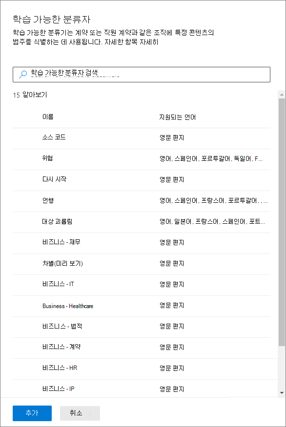
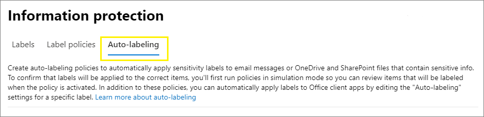

# 민감도 레이블을 콘텐츠에 자동으로 적용Apply a sensitivity label to content automatically

>*[보안 및 규정 준수를 위한 Microsoft 365 라이선싱 지침](https://aka.ms/ComplianceSD).**[Microsoft 365 licensing guidance for security & compliance](https://aka.ms/ComplianceSD).*

민감도 레이블을 만들 때 사용자가 지정한 조건과 일치하는 경우 해당 레이블을 콘텐츠에 자동으로 할당할 수 있습니다.When you create a sensitivity label, you can automatically assign that label to content when it matches conditions that you specify.

콘텐츠에 자동으로 민감도 레이블을 적용하는 기능도 다음과 같은 이유로 중요합니다.The ability to apply sensitivity labels to content automatically is important because:

- 사용자에게 각 분류를 언제 사용할지 교육할 필요가 없습니다.You don't need to train your users when to use each of your classifications.

- 모든 콘텐츠를 올바르게 분류하기 위해 사용자에게 의존할 필요가 없습니다.You don't need to rely on users to classify all content correctly.

- 사용자가 더 이상 정책을 알아야 할 필요가 없으며, 그 대신 업무에 집중할 수 있습니다.Users no longer need to know about your policies—they can instead focus on their work.

민감도 레이블을 자동으로 적용하는 방법에는 두 가지가 있습니다.There are two different methods for automatically applying a sensitivity label:

- **사용자가 문서를 편집하거나 전자 메일 작성(답장 또는 전달) 시 클라이언트 쪽 레이블 지정**: Office 앱(Word, Excel, PowerPoint 및 Outlook)에 자동 레이블 지정을 위해 구성된 레이블을 사용합니다.**Client-side labeling when users edit documents or compose (also reply or forward) emails**: Use a label that's configured for auto-labeling for Office apps (Word, Excel, PowerPoint, and Outlook). 
    
    이 방법은 자동 레이블 적용뿐만 아니라 사용자에게 레이블을 제안합니다.This method supports recommending a label to users, as well as automatically applying a label. 그러나 두 경우 모두 사용자가 레이블을 수락할지 또는 거부할지 결정하여 내용에 올바른 레이블을 지정할 수 있도록 합니다.But in both cases, the user decides whether to accept or reject the label, to help ensure the correct labeling of content. 이 클라이언트 쪽 레이블에는 문서가 저장되기 전에 레이블을 지정할 수 있으므로 문서에 대한 지연 시간이 최소화됩니다.This client-side labeling has minimal delay for documents because the label can be applied even before the document is saved. 그러나 일부 클라이언트 앱에서는 자동 레이블 지정을 지원하지 않습니다.However, not all client apps support auto-labeling. 이 기능은 Azure Information Protection 통합 레이블 지정 클라이언트 및 [일부 버전의 Office](sensitivity-labels-office-apps.md#support-for-sensitivity-label-capabilities-in-apps)에서 지원됩니다.This capability is supported by the Azure Information Protection unified labeling client, and [some versions of Office](sensitivity-labels-office-apps.md#support-for-sensitivity-label-capabilities-in-apps). 
    
    구성 방법에 대한 자세한 내용은 이 페이지에서 [Office 앱에 대한 자동 레이블 지정 구성 방법](#how-to-configure-auto-labeling-for-office-apps)을 참조하세요.For configuration instructions, see [How to configure auto-labeling for Office apps](#how-to-configure-auto-labeling-for-office-apps) on this page.

- **콘텐츠가 이미 저장되었거나(SharePoint 또는 OneDrive) 전자 메일로 전송(Exchange Online에서 처리됨)된 경우 서비스쪽 레이블 지정**: 자동 레이블 지정 정책을 사용합니다.**Service-side labeling when content is already saved (in SharePoint or OneDrive) or emailed (processed by Exchange Online)**: Use an auto-labeling policy. 
    
    또한 유휴 데이터(SharePoint 및 OneDrive의 문서) 및 전송 중인 데이터(Exchange에서 보내거나 받은 전자 메일)에 대한 자동 레이블 지정이라고 부르는 경우도 있습니다.You might also hear this method referred to as auto-labeling for data at rest (documents in SharePoint and OneDrive) and data in transit (email that is sent or received by Exchange). Exchange의 경우 유휴 전자 메일(사서함)은 포함되지 않습니다.For Exchange, it doesn't include emails at rest (mailboxes). 
    
    이 레이블 지정은 응용 프로그램이 아닌 서비스에서 적용되므로 사용자에게 어떤 버전의 앱이 있는지 걱정할 필요가 없습니다.Because this labeling is applied by services rather than by applications, you don't need to worry about what apps users have and what version. 따라서 이 기능은 조직 전체에서 즉시 사용할 수 있으며 대규모로 레이블을 지정하는 데 적합합니다.As a result, this capability is immediately available throughout your organization and suitable for labeling at scale. 자동 레이블 지정 정책은 사용자가 레이블 지정 프로세스와 상호 작용하지 않기 때문에 권장되는 레이블 지정을 지원하지 않습니다.Auto-labeling policies don't support recommended labeling because the user doesn't interact with the labeling process. 대신 관리자가 시뮬레이션 모드에서 정책을 실행하여 실제로 레이블을 적용하기 전에 콘텐츠의 올바른 레이블을 확인합니다.Instead, the administrator runs the policies in simulation mode to help ensure the correct labeling of content before actually applying the label.
    
    구성 지침은 이 페이지에서 [SharePoint, OneDrive 및 Exchange에 대한 자동 레이블 지정 정책을 구성하는 방법](#how-to-configure-auto-labeling-policies-for-sharepoint-onedrive-and-exchange)을 참조하세요.For configuration instructions, see [How to configure auto-labeling policies for SharePoint, OneDrive, and Exchange](#how-to-configure-auto-labeling-policies-for-sharepoint-onedrive-and-exchange) on this page.
    
    SharePoint 및 OneDrive에 대한 자동 레이블 지정에만 해당:Specific to auto-labeling for SharePoint and OneDrive:
    - Word, PowerPoint 및 Excel용 Office 파일이 지원됩니다.Office files for Word, PowerPoint, and Excel are supported.
    - 테넌트에서 하루 최대 25,000개의 자동 레이블 지정 파일 수.Maximum of 25,000 automatically labeled files in your tenant per day.
    - 모든 정책에서 최대 10개의 사이트 모음 수.Maximum of 10 sites collections across all policies.
    - 모든 테넌트에서 최대 10개의 정책 수.Maximum of 10 policies across your tenant.
    - 시뮬레이션 모드 및 레이블 적용 시 둘 다의 경우 자동 레이블링 정책의 결과로 수정됨, 수정자 및 날짜에 대한 기존 값은 변경되지 않습니다.Existing values for modified, modified by, and the date are not changed as a result of auto-labeling policies—for both simulation mode and when labels are applied.
    - 레이블이 암호화를 적용하는 경우 [권한 관리 발행자 및 권한 관리 소유자](https://docs.microsoft.com/azure/information-protection/configure-usage-rights#rights-management-issuer-and-rights-management-owner)는 민감도 레이블을 만든 사람입니다.When the label applies encryption, the [Rights Management issuer and Rights Management owner](https://docs.microsoft.com/azure/information-protection/configure-usage-rights#rights-management-issuer-and-rights-management-owner) is the person who created the sensitivity label.

    Exchange 자동 레이블 지정에만 해당:Specific to auto-labeling for Exchange:
    - Office 앱을 사용하여 수동 레이블 지정 또는 자동 레이블 기능과 달리 Office 첨부 파일 (Word, Excel 및 PowerPoint 파일) 및 PDF 첨부 파일도 자동 레이블 지정 정책에서 지정한 조건에 대해 검사합니다.Unlike manual labeling or auto-labeling with Office apps, Office attachments (Word, Excel, and PowerPoint files) and PDF attachments are also scanned for the conditions you specify in your auto-labeling policy. 일치하는 항목이 있는 경우 전자 메일에 레이블이 표시되지만 첨부 파일에는 표시되지 않습니다.When there is a match, the email is labeled but not the attachment.
    - IRM 암호화를 적용하는 Exchange 메일 흐름 규칙 또는 DLP(데이터 손실 방지) 정책이 있는 경우: 이러한 규칙 또는 정책과 자동 레이블 지정 정책으로 콘텐츠를 식별하면 레이블이 적용됩니다.If you have Exchange mail flow rules or data loss prevention (DLP) policies that apply IRM encryption: When content is identified by these rules or policies and an auto-labeling policy, the label is applied. 해당 레이블이 암호화를 적용하면 Exchange 메일 흐름 규칙 또는 DLP 정책의 IRM 설정이 무시됩니다.If that label applies encryption, the IRM settings from the Exchange mail flow rules or DLP policies are ignored. 그러나 해당 레이블에 암호화가 적용되지 않으면 레이블과 더불어 메일 흐름 규칙 또는 DLP 정책의 IRM 설정이 적용됩니다.However, if that label doesn't apply encryption, the IRM settings from the mail flow rules or DLP policies are applied in addition to the label.
    - 레이블이 없는 IRM 암호화를 포함하는 전자 메일은 자동 레이블 지정을 사용하여 일치하는 항목이 있는 경우 모든 암호화 설정이 있는 레이블로 대체됩니다.Email that has IRM encryption with no label will be replaced by a label with any encryption settings when there is a match by using auto-labeling.
    - 자동 레이블 지정 조건과 일치하는 경우 받는 전자 메일에 레이블이 지정됩니다.Incoming email is labeled when there is a match with your auto-labeling conditions. 그러나 레이블이 암호화로 구성되면 암호화가 적용되지 않습니다.However, if the label is configured for encryption, that encryption isn't applied.
    - 레이블이 암호화를 적용하는 경우 [권한 관리 발행자 및 권한 관리 소유자](https://docs.microsoft.com/azure/information-protection/configure-usage-rights#rights-management-issuer-and-rights-management-owner)는 전자 메일을 보낸 사람입니다.When the label applies encryption, the [Rights Management issuer and Rights Management owner](https://docs.microsoft.com/azure/information-protection/configure-usage-rights#rights-management-issuer-and-rights-management-owner) is the person who sends the email.
    

## 자동 레이블 지정 정책과 Office 앱에 대한 자동 레이블 지정 비교Compare auto-labeling for Office apps with auto-labeling policies

다음 표를 사용하면 두 가지 보완적인 자동 레이블 지정 방법의 동작이 어떻게 차이나는지 알아볼 수 있습니다.Use the following table to help you identify the differences in behavior for the two complementary automatic labeling methods:

|기능 또는 동작Feature or behavior|레이블 지정 설정: Office 앱에 대한 자동 레이블 지정Label setting: Auto-labeling for Office apps |정책: 자동 레이블 지정Policy: Auto-labeling|
|:-----|:-----|:-----|
|앱 종속성App dependency|[예Yes](sensitivity-labels-office-apps.md#support-for-sensitivity-label-capabilities-in-apps) |아니요No |
|위치별 제한Restrict by location|아니오No |예Yes |
|조건: 훈련 가능한 분류자Conditions: Trainable classifiers|예Yes |아니요No |
|조건: 전자 메일 공유 옵션 및 추가 옵션Conditions: Sharing options and additional options for email|아니요No |예Yes |
|권장 사항, 정책 도구 설명 및 사용자 재정의Recommendations, policy tooltip, and user overrides|예Yes |아니요No |
|시뮬레이션 모드Simulation mode|아니요No |예Yes |
|조건이 확인된 Exchange 첨부 파일Exchange attachments checked for conditions|아니요No | 예Yes|
|시각적 표시 적용Apply visual markings |예Yes |예(전자 메일만 해당)Yes (email only) |
|레이블 없이 적용된 IRM 암호화 재정의Override IRM encryption applied without a label|예(사용자에게 내보내기의 최소 사용 권한이 있는 경우)Yes if the user has the minimum usage right of Export |예(전자 메일만 해당)Yes (email only) |
|받는 전자 메일에 레이블 지정Label incoming email|아니요No |예(암호화가 적용되지 않음)Yes (encryption not applied) |

> [!NOTE]
> 콘텐츠에 수동으로 레이블을 지정한 경우 해당 레이블은 자동 레이블로 대체되지 않습니다.When content has been manually labeled, that label will never be replaced by automatic labeling. 그러나 자동 레이블 지정 정책은 Office 앱에 대한 자동 레이블 지정을 사용하여 적용된 [우선 순위가 낮은 레이블](sensitivity-labels.md#label-priority-order-matters)을 대체할 수 있습니다.However, auto-labeling policies can replace a [lower priority label](sensitivity-labels.md#label-priority-order-matters) that was applied by using auto-labeling for Office apps.

## 두 개 이상 레이블에 적용했을 때 여러 조건의 평가 방식How multiple conditions are evaluated when they apply to more than one label

레이블은 정책에서 지정한 위치에 따라 평가되도록 정렬됩니다. 먼저 배치된 레이블은 가장 낮은 위치에 있고(가장 민감하지 않음) 마지막에 위치한 레이블은 가장 높은 위치에 배치됩니다(가장 민감합니다). 우선 순위에 대한 자세한 내용은 [레이블 우선 순위 (순서 관련 문제)](sensitivity-labels.md#label-priority-order-matters)를 참조하십시오.The labels are ordered for evaluation according to their position that you specify in the policy: The label positioned first has the lowest position (least sensitive) and the label positioned last has the highest position (most sensitive). For more information on priority, see [Label priority (order matters)](sensitivity-labels.md#label-priority-order-matters).

## 상위 레이블이 자동으로 적용되거나 권장되도록 구성하지 않음Don't configure a parent label to be applied automatically or recommended

상위 레이블(하위 레이블이 있는 레이블)은 콘텐츠에 적용할 수 없습니다.Remember, you can't apply a parent label (a label with sublabels) to content. Office 앱에서 상위 레이블을 자동으로 적용하거나 권장하도록 구성하지 않았는지 확인하고 자동 레이블 정책에 대한 상위 레이블을 선택하지 마세요.Make sure that you don't configure a parent label to be auto-applied or recommended in Office apps, and don't select a parent label for an auto-labeling policy. 이렇게 하면 상위 레이블이 콘텐츠에 적용되지 않습니다.If you do, the parent label won't be applied to content.

하위 레이블과 함께 자동 레이블을 사용하려면 상위 레이블과 하위 레이블을 모두 게시해야 합니다.To use automatic labeling with sublabels, make sure you publish both the parent label and the sublabel.

상위 레이블 및 하위 레이블에 대한 자세한 내용은 [하위 레이블(레이블 그룹화)](sensitivity-labels.md#sublabels-grouping-labels)을 참조하세요.For more information on parent labels and sublabels, see [Sublabels (grouping labels)](sensitivity-labels.md#sublabels-grouping-labels).

## Office 앱에 대한 자동 레이블 지정을 구성하는 방법How to configure auto-labeling for Office apps

Windows용 Office 앱의 자동 레이블 지정은 Azure Information Protection 통합 레이블 클라이언트에서 지원됩니다.Automatic labeling in Office apps for Windows is supported by the Azure Information Protection unified labeling client. Office 앱에서 기본 제공되는 레이블 지정은 [앱마다 사용 가능 단계가 다릅니다](sensitivity-labels-office-apps.md#support-for-sensitivity-label-capabilities-in-apps).For built-in labeling in Office apps, this capability is in [different stages of availability for different apps](sensitivity-labels-office-apps.md#support-for-sensitivity-label-capabilities-in-apps).

[민감도 레이블을 만들거나 편집](create-sensitivity-labels.md)하는 경우, Office 앱에 대한 자동 레이블 지정 설정을 사용할 수 있습니다.The auto-labeling settings for Office apps are available when you [create or edit a sensitivity label](create-sensitivity-labels.md). 중요한 정보가 감지되는 경우 자동으로 민감도 레이블을 콘텐츠에 적용하도록 선택할 수 있습니다.You can choose to apply sensitivity labels to content automatically when sensitive information is detected. 중요한 정보 유형 또는 교육 가능한 분류자 목록에서 선택합니다.Choose from a list of sensitive info types or trainable classifiers:

이 민감도 레이블이 자동으로 적용되면 사용자는 Office 앱에서 알림을 보게 됩니다.When this sensitivity label is automatically applied, the user sees a notification in their Office app. 예시:For example:

### 레이블에 대한 중요한 정보 유형 구성Configuring sensitive info types for a label

**중요한 정보 유형** 옵션을 선택하면 DLP(데이터 손실 방지) 정책을 만들 때 같은 중요한 정보 유형 목록이 표시됩니다.When you select the **Sensitive info types** option, you see the same list of sensitive information types as when you create a data loss prevention (DLP) policy. 예를 들어 신용카드 번호, 주민등록번호 또는 여권 번호와 같은 고객의 개인 정보를 포함하는 모든 콘텐츠에 자동으로 기밀 유지 레이블을 적용할 수 있습니다.So you can, for example, automatically apply a Highly Confidential label to any content that contains customers' personal information, such as credit card numbers, social security numbers, or passport numbers:

중요한 정보 유형을 선택하면 인스턴스 수 또는 일치 정확도를 변경하여 조건을 구체화할 수 있습니다.After you select your sensitive information types, you can refine your condition by changing the instance count or match accuracy. 자세한 내용은 [규칙을 조정하여 더욱 쉽게 또는 더욱 일치하기 어렵게 하기](data-loss-prevention-policies.md#tuning-rules-to-make-them-easier-or-harder-to-match)를 참조하세요.For more information, see [Tuning rules to make them easier or harder to match](data-loss-prevention-policies.md#tuning-rules-to-make-them-easier-or-harder-to-match).

또한 조건이 모든 민감 정보 유형을 감지해야 하는지 또는 한 가지 유형만 감지하면 되는지를 선택할 수 있습니다.Further, you can choose whether a condition must detect all sensitive information types, or just one of them. 조건을 더 유연하게 만들거나 복잡하게 만들려면 그룹을 추가하고 그룹 간에 논리 연산자를 사용할 수 있습니다.And to make your conditions more flexible or complex, you can add groups and use logical operators between the groups. 자세한 내용은 [그룹화 및 논리 연산자](data-loss-prevention-policies.md#grouping-and-logical-operators)를 참조하세요.For more information, see [Grouping and logical operators](data-loss-prevention-policies.md#grouping-and-logical-operators).

### 레이블에 교육 가능한 분류자 구성하기Configuring trainable classifiers for a label

이 옵션은 현재 미리 보기로 제공됩니다.This option is currently in preview.

**교육 가능한 분류자** 옵션을 선택하는 경우, Microsoft의 기본 제공 교육 가능 분류자를 하나 이상 선택합니다.When you select the **Trainable classifiers** option, select one or more of the built-in trainable classifiers from Microsoft. 사용자 지정 교육 가능 분류자를 만든 경우, 다음의 사항 또한 선택할 수 있습니다.If you've created your own custom trainable classifiers, these are also available to select:

> [!CAUTION]
> 당사는 **비속어** 기본 제공 분류자가 많은 수의 가양성을 생성하였기 에 그 사용을 중단하고 있습니다.We are deprecating the **Offensive Language** built-in classifier because it has been producing a high number of false positives. 이러한 기본 제공 분류자를 사용하지 않도록 하고 현재 사용하고 있는 경우에는 비즈니스 프로세스를 제거해야 합니다.Don't use this built-in classifier and if you are currently using it, you should move your business processes off it. 대신에 **대상 지정 괴롭힘**,**모독** 그리고 **위협**기본 제공 분류자를 사용하는 것이 좋습니다.We recommend using the **Targeted Harassment**, **Profanity**, and **Threat** built-in classifiers instead.

이러한 분류자에 대한 자세한 내용은[교육 가능한 분류자 시작하기(미리 보기)](classifier-getting-started-with.md)를 참조하세요.For more information about these classifiers, see [Getting started with trainable classifiers (preview)](classifier-getting-started-with.md).

이 옵션의 미리 보기 기간 동안 다음 앱이 민감도 레이블에 대한 교육 가능한 분류자를 지원합니다.During the preview period for this option, the following apps support trainable classifiers for sensitivity labels:

- Windows 엔터프라이즈용 Microsoft 365 앱([구 Office 365 ProPlus](https://docs.microsoft.com/deployoffice/name-change))가 버전 2006 이후에서 [현재 채널](https://docs.microsoft.com/deployoffice/overview-update-channels#current-channel-overview)로 배포됩니다.Microsoft 365 Apps for enterprise ([formerly Office 365 ProPlus](https://docs.microsoft.com/deployoffice/name-change)) for Windows, now rolling out to the [Current Channel](https://docs.microsoft.com/deployoffice/overview-update-channels#current-channel-overview) in version 2006 and later:
    - WordWord
    - ExcelExcel
    - PowerPointPowerPoint

- [SharePoint 및 OneDrive에서 Office 파일에 대한 민감도 레이블을 사용하도록 설정](sensitivity-labels-sharepoint-onedrive-files.md)한 경우, 웹 앱용 Office:Office for the web apps, when you have [enabled sensitivity labels for Office files in SharePoint and OneDrive](sensitivity-labels-sharepoint-onedrive-files.md):
    - WordWord
    - ExcelExcel
    - PowerPointPowerPoint
    - OutlookOutlook

### 사용자가 민감도 레이블을 적용하는 것이 좋습니다.Recommend that the user applies a sensitivity label

원하는 경우 사용자에게 레이블을 적용할 것을 권장할 수 있습니다.If you prefer, you can recommend to your users that they apply the label. 이 옵션을 사용하면 사용자가 분류 및 관련 보호를 수락하거나, 레이블이 콘텐츠에 적합하지 않은 경우에는 권장 사항을 취소할 수 있습니다.With this option, your users can accept the classification and any associated protection, or dismiss the recommendation if the label isn't suitable for their content.

다음은 사용자 지정 정책 팁을 사용하여 레이블을 권장 작업으로 적용하도록 조건을 구성할 때 Azure Information Protection 통합 레이블 지정 클라이언트에서 표시되는 프롬프트의 예입니다.Here's an example of a prompt from the Azure Information Protection unified labeling client when you configure a condition to apply a label as a recommended action, with a custom policy tip. 정책 팁에 표시될 텍스트를 선택할 수 있습니다.You can choose what text is displayed in the policy tip.

### 자동 또는 권장 레이블이 적용되는 경우When automatic or recommended labels are applied

Office 앱에서 구현되는 자동 및 권장되는 레이블 지정은 Office에 기본 제공되는 레이블을 사용할지 또는 Azure Information Protection 통합 레이블 지정 클라이언트를 사용하는지에 따라 다릅니다.The implementation of automatic and recommended labeling in Office apps depend on whether you're using labeling that's built into Office, or the Azure Information Protection unified labeling client. 그러나 두 경우 모두에 다음이 적용됩니다.In both cases, however:

- 이전에 수동으로 레이블을 지정했거나, 이전에 더 높은 민감도로 레이블이 자동으로 지정된 문서 및 전자 메일에는 자동 레이블 지정을 사용할 수 없습니다.You can't use automatic labeling for documents and emails that were previously manually labeled, or previously automatically labeled with a higher sensitivity. 문서 또는 전자 메일에는 단일 보존 레이블 외에 단일 민감도 레이블만 적용할 수 있습니다.Remember, you can only apply a single sensitivity label to a document or email (in addition to a single retention label).

- 이전에 더 높은 민감도로 레이블이 지정된 문서 또는 전자 메일에는 권장 레이블 지정을 사용할 수 없습니다.You can't use recommended labeling for documents or emails that were previously labeled with a higher sensitivity. 콘텐츠에 더 높은 민감도로 레이블이 지정되면 사용자에게 권장 사항 및 정책 팁이 포함된 프롬프트가 표시되지 않습니다.When the content's already labeled with a higher sensitivity, the user won't see the prompt with the recommendation and policy tip.

기본 제공 레이블 지정과 관련된 내용:Specific to built-in labeling:

- 모든 Office 앱이 자동(및 권장) 레이블 지정을 지원하는 것은 아닙니다.Not all Office apps support automatic (and recommended) labeling. 자세한 내용은 [앱에서의 민감도 레이블 기능에 대한 지원](sensitivity-labels-office-apps.md#support-for-sensitivity-label-capabilities-in-apps)을 참조하세요.For more information, see [Support for sensitivity label capabilities in apps](sensitivity-labels-office-apps.md#support-for-sensitivity-label-capabilities-in-apps).

- 데스크톱 버전의 Word에서 권장되는 레이블의 경우 사용자가 권장되는 민감도 레이블을 적용하는 대신, 중요한 콘텐츠를 검토하고 제거할 수 있도록 권장 사항을 트리거한 중요한 콘텐츠에 플래그가 지정됩니다.For recommended labels in the desktop versions of Word, the sensitive content that triggered the recommendation is flagged so that users can review and remove the sensitive content instead of applying the recommended sensitivity label.

- Office 앱에서 이러한 레이블을 적용하는 방법에 대한 자세한 내용과 예제 스크린샷 및 중요한 정보를 검색하는 방법에 대한 자세한 내용은 [Office에서 파일 및 전자 메일에 자동으로 민감도 레이블 적용 또는 추천](https://support.office.com/ko-KR/article/automatically-apply-or-recommend-sensitivity-labels-to-your-files-and-emails-in-office-622e0d9c-f38c-470a-bcdb-9e90b24d71a1)을 참조하세요.For details about how these labels are applied in Office apps, example screenshots, and how sensitive information is detected, see [Automatically apply or recommend sensitivity labels to your files and emails in Office](https://support.office.com/ko-KR/article/automatically-apply-or-recommend-sensitivity-labels-to-your-files-and-emails-in-office-622e0d9c-f38c-470a-bcdb-9e90b24d71a1).

Azure Information Protection 통합 레이블 지정 클라이언트와 관련된 내용:Specific to the Azure Information Protection unified labeling client:

-  자동 및 권장되는 레이블은 문서를 저장할 때는 Word, Excel 및 PowerPoint에 적용되고, 전자 메일을 보낼 때는 Outlook에 적용됩니다.Automatic and recommended labeling applies to Word, Excel, and PowerPoint when you save a document, and to Outlook when you send an email.

- Outlook에서 권장되는 레이블 지정을 지원하려면 먼저 [고급 정책 설정](https://docs.microsoft.com/azure/information-protection/rms-client/clientv2-admin-guide-customizations#enable-recommended-classification-in-outlook)을 구성해야 합니다.For Outlook to support recommended labeling, you must first configure an [advanced policy setting](https://docs.microsoft.com/azure/information-protection/rms-client/clientv2-admin-guide-customizations#enable-recommended-classification-in-outlook).

- 문서 및 전자 메일의 본문 텍스트와 머리글 및 바닥글에서는 중요한 정보를 검색할 수 있지만, 전자 메일의 제목 줄이나 첨부 파일에서는 중요한 정보를 검색할 수 없습니다.Sensitive information can be detected in the body text in documents and emails, and to headers and footers—but not in the subject line or attachments of email.

## SharePoint, OneDrive 및 Exchange에 대한 자동 레이블 지정 정책을 구성하는 방법How to configure auto-labeling policies for SharePoint, OneDrive, and Exchange

반드시 자동 레이블 정책을 구성하기 전에 먼저 필수 조건을 알고 있어야 합니다.Make sure you're aware of the prerequisites before you configure auto-labeling policies. 

### 자동 레이블 지정 정책에 대한 필수 구성 요소Prerequisites for auto-labeling policies

- 시뮬레이션 모드:Simulation mode:
    - Microsoft 365에 대한 감사가 설정되어 있어야 합니다.Auditing for Microsoft 365 must be turned on. 감사를 설정해야 하거나 감사가 이미 설정되어 있는지 확실하지 않은 경우에는 [감사 로그 검색 켜기 또는 끄기](turn-audit-log-search-on-or-off.md)를 참조하세요.If you need to turn on auditing or you're not sure whether auditing is already on, see [Turn audit log search on or off](turn-audit-log-search-on-or-off.md).
    - 원본 보기에서 파일 내용을 보려면 **콘텐츠 탐색기 콘텐츠 뷰어** 역할을 보유하고 있어야 합니다.To view file contents in the source view, you must have the **Content Explorer Content Viewer** role. 전역 관리자에게는 기본적으로 이 역할이 없습니다.Global admins don't have this role by default. 이 권한이 없는 경우 **일치하는 항목** 탭에서 항목을 선택할 때 미리 보기 창이 표시되지 않습니다.If you don't have this permission, you don't see the previewer pane when you select an item from the **Matched Items** tab.

- SharePoint 및 OneDrive에서 파일에 자동 레이블을 지정하려면 다음을 수행합니다.To auto-label files in SharePoint and OneDrive:
    - [SharePoint 및 OneDrive에서 Office 파일에 대한 민감도 레이블을 사용하도록 설정](sensitivity-labels-sharepoint-onedrive-files.md)합니다.You have [enabled sensitivity labels for Office files in SharePoint and OneDrive](sensitivity-labels-sharepoint-onedrive-files.md).
    - 자동 레이블 지정 정책이 실행될 때 다른 프로세스나 사용자가 파일을 열면 안됩니다.At the time the auto-labeling policy runs, the file mustn't be open by another process or user. 편집을 위해 체크 아웃된 파일은 이 범주로 분류됩니다.A file that's checked out for editing falls into this category.

- 기본 제공 민감도 유형이 아닌 [사용자 지정 민감도 정보 유형](custom-sensitive-info-types.md)을 사용하려는 경우:If you plan to use [custom sensitive information types](custom-sensitive-info-types.md) rather than the built-in sensitivity types: 
    - 사용자 지정 민감도 정보 유형은 사용자 지정 민감도 정보 유형을 저장한 후 생성되는 콘텐츠에 대해 평가됩니다.Custom sensitivity information types are evaluated for content that is created after the custom sensitivity information types are saved. 
    - 새로운 사용자 지정 민감도 정보 유형을 테스트하려면 자동 레이블 지정 정책을 만들기 전에 해당 유형을 만든 다음 테스트용 샘플 데이터가 포함된 새 문서를 만듭니다.To test new custom sensitive information types, create them before you create your auto-labeling policy, and then create new documents with sample data for testing.

- 자동 레이블 지정 정책에 대해 선택할 수 있는 하나 이상의 민감도 레이블이 [생성 및 게시](create-sensitivity-labels.md)(적어도 한 명의 사용자에게) 됩니다.One or more sensitivity labels [created and published](create-sensitivity-labels.md) (to at least one user) that you can select for your auto-labeling policies. 이러한 레이블의 경우:For these labels:
    - 소개에 설명된 대로 레이블 설정은 자동 레이블 지정 정책을 보완하기 때문에 Office 앱 레이블 설정의 자동 레이블 지정 설정이 켜져 있는지 여부는 중요하지 않습니다.It doesn't matter if the auto-labeling in Office apps label setting is turned on or off, because that label setting supplements auto-labeling policies, as explained in the introduction.
    - 자동 레이블에 사용하려는 레이블이 시각적 표시(머리글, 바닥글, 워터 마크)를 사용하도록 구성된 경우 문서에는 적용되지 않습니다.If the labels you want to use for auto-labeling are configured to use visual markings (headers, footers, watermarks), note that these are not applied to documents.
    - 레이블이 [암호화](encryption-sensitivity-labels.md)를 적용하는 경우 **지금 권한 할당** 설정에 대해 구성해야 합니다.If the labels apply [encryption](encryption-sensitivity-labels.md), they must be configured for the **Assign permissions now** setting.

### 시뮬레이션 모드에 대해 알아보기Learn about simulation mode

시뮬레이션 모드는 자동 레이블 지정 정책에 고유하며 워크플로에 적합합니다.Simulation mode is unique to auto-labeling policies and woven into the workflow. 정책에서 적어도 한 번의 시뮬레이션이 실행될 때까지 문서 및 전자 메일에 자동으로 레이블을 지정할 수 없습니다.You can't automatically label documents and emails until your policy has run at least one simulation.

자동 레이블 지정 정책의 워크플로:Workflow for an auto-labeling policy:

1. 자동 레이블 지정 정책 만들기 및 구성Create and configure an auto-labeling policy

2. 시뮬레이션 모드로 정책을 실행하고 최소 24시간을 기다립니다.Run the policy in simulation mode and wait at least 24 hours

3. 결과를 검토하고 필요한 경우 정책을 조정한 후 시뮬레이션 모드를 다시 실행하고 최소 24시간을 기다립니다.Review the results, and if necessary, refine your policy, rerun simulation mode and wait at least 24 hours

4. 필요한 경우 3단계를 반복합니다.Repeat step 3 as needed

5. 프로덕션에서 배포Deploy in production

시뮬레이션된 배포는 PowerShell의 WhatIf 매개 변수처럼 실행됩니다.The simulated deployment runs like the WhatIf parameter for PowerShell. 사용자가 정의한 규칙을 사용하여 자동 레이블 지정 정책이 선택한 레이블을 적용한 것처럼 보고된 결과를 볼 수 있습니다.You see results reported as if the auto-labeling policy had applied your selected label, using the rules that you defined. 그런 다음 필요한 경우 규칙을 조정하고 시뮬레이션을 다시 실행할 수 있습니다.You can then refine your rules for accuracy if needed, and rerun the simulation. 그러나 Exchange용 자동 레이블 지정은 사서함에 저장된 전자 메일이 아닌 보내고 받는 전자 메일에 적용되기 때문에, 정확히 같은 전자 메일 메시지를 보내고 받을 수 없는 한 시뮬레이션의 전자 메일에 대한 결과가 일관되길 기대하지 않습니다.However, because auto-labeling for Exchange applies to emails that are sent and received, rather than emails stored in mailboxes, don't expect results for email in a simulation to be consistent unless you're able to send and receive the exact same email messages.

또한 시뮬레이션 모드를 사용하면 배포 전에 자동 레이블 지정 정책의 범위를 단계적으로 늘릴 수 있습니다.Simulation mode also lets you gradually increase the scope of your auto-labeling policy before deployment. 예를 들어 단일 문서 라이브러리를 사용하여 SharePoint 사이트와 같은 단일 위치에서 시작할 수 있습니다.For example, you might start with a single location, such as a SharePoint site, with a single document library. 그런 다음 반복적인 변경으로 범위를 여러 사이트로 늘리고 OneDrive와 같은 다른 위치로 범위를 늘립니다.Then, with iterative changes, increase the scope to multiple sites, and then to another location, such as OneDrive.

마지막으로 시뮬레이션 모드를 사용하여 자동 레이블 지정 정책을 실행하는 데 필요한 시간을 대략적으로 제공하여 시뮬레이션 모드없이 실행할 시기를 계획하고 예약할 수 있습니다.Finally, you can use simulation mode to provide an approximation of the time needed to run your auto-labeling policy, to help you plan and schedule when to run it without simulation mode.

### 자동 레이블 지정 정책 만들기Creating an auto-labeling policy

1. [Microsoft 365 규정 준수 센터](https://compliance.microsoft.com/)에서 민감도 레이블로 이동합니다.In the [Microsoft 365 compliance center](https://compliance.microsoft.com/), navigate to sensitivity labels:
    
    - **솔루션** > **정보 보호****Solutions** > **Information protection**
    
    이 옵션이 바로 보이지 않는 경우에는 먼저 **모두 표시**를 선택합니다.If you don't immediately see this option, first select **Show all**.

2. **자동 레이블 지정** 탭을 선택합니다.Select the **Auto-labeling** tab:
    
    
    

3. \*\* + 자동 레이블 지정 정책 만들기\*\*를 선택합니다.Select **+ Create auto-labeling policy**. 이를 통해 새 정책 마법사가 시작됩니다.This starts the New policy wizard:
    
    

4. **이 레이블을 적용할 정보 선택** 페이지에서 **재무** 또는 **개인 정보 보호**와 같은 템플릿 중 하나를 선택합니다.For the page **Choose info you want this label applied to**: Select one of the templates, such as **Financial** or **Privacy**. **표시 옵션** 드롭 다운을 사용하여 검색을 구체화할 수 있습니다.You can refine your search by using the **Show options for** dropdown. 또는 템플릿이 요구 사항을 충족하지 않으면 **사용자 지정 정책**을 선택합니다.Or, select **Custom policy** if the templates don't meet your requirements. **다음**을 선택합니다.Select **Next**.

5. **자동 레이블 지정 정책 이름 지정** 페이지에서 고유한 이름을 입력하고, 필요에 따라 레이블을 지정할 콘텐츠를 식별하는 자동으로 적용되는 레이블, 위치 및 조건을 식별하는 데 도움이 되는 설명을 입력합니다.For the page **Name your auto-labeling policy**: Provide a unique name, and optionally a description to help identify the automatically applied label, locations, and conditions that identify the content to label.

6. **레이블을 적용할 위치 선택** 페이지에서 Exchange, SharePoint 사이트 및 OneDrive의 위치를 선택하고 지정합니다.For the page **Choose locations where you want to apply the label**: Select and specify locations for Exchange, SharePoint sites, and OneDrive. 그런 후 **다음**을 선택합니다.Then select **Next**.
    
    
    
    OneDrive의 경우 개별 계정을 지정해야 합니다.For OneDrive, you must specify individual accounts. 사용자의 OneDrive에 대한 URL은 다음과 같은 형식입니다. `https://<tenant name>-my.sharepoint.com/personal/<user_name>_<tenant name>_com`The URL for a user's OneDrive is in the following format: `https://<tenant name>-my.sharepoint.com/personal/<user_name>_<tenant name>_com`
    
    예를 들어, "rsimone"라는 사용자 이름을 보유한 Contoso 테넌트에 있는 사용자의 경우: `https://contoso-my.sharepoint.com/personal/rsimone_contoso_onmicrosoft_com`For example, for a user in the contoso tenant that has a user name of "rsimone": `https://contoso-my.sharepoint.com/personal/rsimone_contoso_onmicrosoft_com`
    
    테넌트의 구문을 확인하고 사용자 URL을 확인하려면, [조직에 있는 모든 사용자 OneDrive URL 목록 가져오기](https://docs.microsoft.com/onedrive/list-onedrive-urls)를 참조하세요.To verify the syntax for your tenant and identify URLs for users, see [Get a list of all user OneDrive URLs in your organization](https://docs.microsoft.com/onedrive/list-onedrive-urls).

7. **일반 또는 고급 규칙 설정** 페이지의 경우: 선택한 모든 위치에서 레이블을 지정할 콘텐츠를 식별하는 규칙을 정의하기 위해 **일반 규칙**의 기본값을 유지합니다.For the **Set up common or advanced rules** page: Keep the default of **Common rules** to define rules that identify content to label across all your selected locations. 위치마다 다른 규칙이 필요한 경우 **고급 규칙**을 선택합니다.If you need different rules per location, select **Advanced rules**. 그런 후 **다음**을 선택합니다.Then select **Next**.
    
    이 규칙은 민감한 정보 유형 및 공유 옵션이 포함된 조건을 사용합니다.The rules use conditions that include sensitive information types and sharing options:
    - 민감한 정보 유형의 경우 기본 제공 정보 유형과 사용자 지정 민감한 정보 유형을 모두 선택할 수 있습니다.For sensitive information types, you can select both built-in and custom sensitive information types.
    - 공유 옵션의 경우 **조직 내부의 사용자만** 또는 **조직 외부의 사용자**를 선택할 수 있습니다.For the shared options, you can choose **only with people inside my organization** or **with people outside my organization**.
    
    유일한 위치가 **Exchange**이거나 **고급 규칙**을 선택한 경우 다음과 같은 추가 조건을 선택할 수 있습니다.If your only location is **Exchange**, or if you select **Advanced rules**, there are additional conditions that you can select:
    - 보낸 사람 IP 주소는Sender IP address is
    - 받는 사람 도메인은Recipient domain is
    - 받는 사람은Recipient is
    - 첨부 파일 확장명은Attachment's file extension is
    - 첨부 파일이 암호로 보호됨Attachment is password protected
    - 전자 메일 첨부 파일의 콘텐츠를 검사할 수 없음Any email attachment's content could not be scanned
    - 전자 메일 첨부 파일 내용의 검사가 완료되지 않음Any email attachment's content didn't complete scanning

8. 이제 이전 선택에 따라 조건 및 예외를 사용하여 새 규칙을 만들 수 있습니다.Depending on your previous choices, you'll now have an opportunity to create new rules by using conditions and exceptions.
    
    민감한 정보 유형의 구성 옵션은 Office 앱에 대한 자동 레이블 지정에 대해 선택한 것과 동일합니다.The configuration options for sensitive information types are the same as those you select for auto-labeling for Office apps. 자세한 정보가 필요한 경우 [레이블에 민감한 정보 유형 구성](#configuring-sensitive-info-types-for-a-label)을 참조하세요.If you need more information, see [Configuring sensitive info types for a label](#configuring-sensitive-info-types-for-a-label).
    
    필요한 모든 규칙을 정의하고 해당 상태가 켜져 있음을 확인한 후 **다음**을 선택하여 자동 적용을 위해 레이블 선택으로 이동합니다.When you have defined all the rules you need, and confirmed their status is on, select **Next** to move on to choosing a label to auto-apply.

11. **자동 적용할 레이블 선택** 페이지에서 **+ 레이블 선택**을 선택하고, **민감도 레이블 선택** 창에서 레이블을 선택한 후 **다음**을 선택합니다.For the **Choose a label to auto-apply** page: Select **+ Choose a label**, select a label from the **Choose a sensitivity label** pane, and then select **Next**.

12. **정책을 지금 또는 나중에 테스트할지 결정** 페이지의 경우: 지금 자동 레이블 지정 정책을 실행할 준비가 되었으면 **시뮬레이션 모드에서 정책 실행**을 선택합니다.For the **Decide if you want to test out the policy now or later** page: Select **Run policy in simulation mode** if you're ready to run the auto-labeling policy now, in simulation mode. 그렇지 않으면 **정책을 해제로 두기**를 선택합니다.Otherwise, select **Leave policy turned off**. **다음**을 선택합니다.Select **Next**: 
    
    

13. **요약** 페이지에서 자동 레이블 지정 정책의 구성을 검토하고 필요한 사항을 변경한 후 마법사를 완료합니다.For the **Summary** page: Review the configuration of your auto-labeling policy and make any changes that needed, and complete the wizard.
    
    Office 앱에 대한 자동 레이블 지정 기능과 달리 별도의 게시 옵션은 없습니다.Unlike auto-labeling for Office apps, there's no separate publish option. 그러나 게시 레이블과 마찬가지로 자동 레이블 지정 정책이 조직 전체에 복제될 때까지 최대 24시간이 소요됩니다.However, as with publishing labels, allow up to 24 hours for the auto-labeling policy to replicate throughout your organization.

이제 **정보 보호** > **자동 레이블 지정** 페이지에서 **시뮬레이션** 혹은 **끄기** 구역에 시뮬레이션 모드에서 실행할지의 선택 여부에 따라 자동 레이블 지정 정책이 표시됩니다.Now on the **Information protection** > **Auto-labeling** page, you see your auto-labeling policy in the **Simulation** or **Off** section, depending on whether you chose to run it in simulation mode or not. 구성 및 상태에 대한 세부 사항을 보려면 정책을 선택합니다(예: **정책 시뮬레이션을 아직 실행 중**).Select your policy to see the details of the configuration and status (for example, **Policy simulation is still running**). 시뮬레이션 모드에서의 정책의 경우 **일치 항목** 탭을 선택하여 지정한 규칙과 일치하는 전자 메일 또는 문서를 확인합니다.For policies in simulation mode, select the **Matched items** tab to see which emails or documents matched the rules that you specified.

다음의 인터페이스에서 직접 정책을 수정할 수 있습니다.You can modify your policy directly from this interface:

- **끄기** 구역에 있는 정책의 경우 **정책 편집** 단추를 선택합니다.For a policy in the **Off** section, select the **Edit policy** button.

- **시뮬레이션** 구역에 있는 정책의 경우 페이지 맨 위의 다음과 같은 탭에서 **편집** 옵션을 선택합니다.For policy in the **Simulation** section, select the **Edit policy** option at the top of the page, from either tab:
    
    
    
    시뮬레이션없이 정책을 실행할 준비가 되면 **정책 켜기** 옵션을 선택합니다.When you're ready to run the policy without simulation, select the **Turn on policy** option.

자동 정책은 삭제될 때까지 계속 실행됩니다.Your auto-policies run continuously until they are deleted. 예를 들어 새 문서와 수정된 문서는 현재 정책 설정에 포함됩니다.For example, new and modified documents will be included with the current policy settings.

적절한 [권한](data-classification-content-explorer.md#permissions)이 있는 경우 [콘텐츠 탐색기](data-classification-content-explorer.md)를 사용하여 자동 레이블 지정 정책의 결과를 볼 수도 있습니다.You can also see the results of your auto-labeling policy by using [content explorer](data-classification-content-explorer.md) when you have the appropriate [permissions](data-classification-content-explorer.md#permissions):
- **콘텐츠 탐색기 목록 뷰어**를 사용하면 파일 내용이 아닌 파일의 레이블을 볼 수 있습니다.**Content Explorer List Viewer** lets you see a file's label but not the file's contents.
- **콘텐츠 탐색기 콘텐츠 뷰어**를 사용하면 파일 내용을 볼 수 있습니다.**Content Explorer Content Viewer** lets you see the file's contents.

> [!TIP]
> 또한 콘텐츠 탐색기를 사용하여 민감한 정보가 포함된 문서가 있지만 레이블이 지정되지 않은 위치를 식별할 수도 있습니다.You can also use content explorer to identify locations that have documents with sensitive information, but are unlabeled. 이 정보를 사용하여 이러한 위치를 자동 레이블 지정 정책에 추가하고 식별된 민감한 정보 유형을 규칙으로 포함합니다.Using this information, consider adding these locations to your auto-labeling policy, and include the identified sensitive information types as rules.

