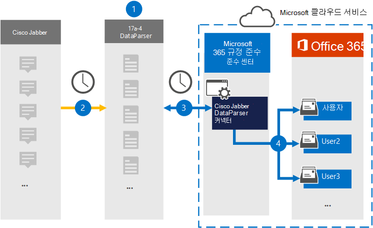

# Cisco Jabber 데이터를 보관할 커넥터 설정

17a-4 LLC의 [Cisco Jabber DataParser를](https://www.17a-4.com/jabber-dataparser/) 사용하여 Cisco Jabber에서 사용자 사서함으로 데이터를 가져오고 Microsoft 365 보관합니다. DataParser에는 타사 데이터 원본에서 항목을 캡처하고 해당 항목을 가져오도록 구성된 Cisco Jabber 커넥터가 Microsoft 365. Cisco Jabber DataParser 커넥터는 Cisco Jabber 데이터를 전자 메일 메시지 형식으로 변환한 다음 해당 항목을 전자 메일의 사용자 사서함으로 Microsoft 365.

Cisco Jabber 데이터가 사용자 사서함에 저장되고 나면 소송 보존, eDiscovery Microsoft 365 보존 정책 및 보존 레이블, 통신 준수와 같은 Microsoft 365 준수 기능을 적용할 수 있습니다. Cisco Jabber 커넥터를 사용하여 조직에서 데이터를 가져오고 Microsoft 365 조직이 정부 및 규제 정책을 준수하는 데 도움이 될 수 있습니다.

## 보관 Cisco Jabber 데이터 개요

다음 개요에서는 데이터 커넥터를 사용하여 Cisco Jabber 데이터를 데이터 원본에 보관하는 Microsoft 365.

1. 조직은 17a-4와 함께 Cisco Jabber DataParser를 설정하고 구성합니다.

2. Cisco Jabber 항목은 정기적으로 DataParser에 의해 수집됩니다. 또한 DataParser는 메시지 내용을 전자 메일 메시지 형식으로 변환합니다.

3. 데이터 센터에서 만드는 Cisco Jabber DataParser 커넥터는 Microsoft 365 규정 준수 센터 연결하고 메시지를 Microsoft 클라우드의 보안 Azure Storage 위치로 전송합니다.

4. 받은 편지함 폴더 **Cisco Jabber DataParser라는** 하위 폴더가 사용자 사서함에 만들어지며 Cisco Jabber 항목을 해당 폴더로 가져오게 됩니다. 커넥터는 Email 속성 값을 사용하여 항목을 가져올 사서함을 결정할 *수* 있습니다. 모든 Cisco Jabber 항목에는 모든 참가자의 전자 메일 주소로 채워지는 이 속성이 포함되어 있습니다.

## 커넥터를 설정하기 전에

- Microsoft 커넥터에 대한 DataParser 계정을 생성합니다. 이 작업을 위해 [17a-4 LLC에 문의합니다.](https://www.17a-4.com/contact/) 1단계에서 커넥터를 만들 때 이 계정에 로그인해야 합니다.

- 1단계에서 Cisco Jabber DataParser 커넥터를 만들고 3단계에서 완료하는 사용자는 2단계에서 사서함 가져오기 내보내기 역할에 할당해야 Exchange Online. 이 역할은 서버의 데이터  커넥터 페이지에서 커넥터를 추가하는 Microsoft 365 규정 준수 센터. 기본적으로 이 역할은 역할 그룹의 역할 그룹에 할당되지 Exchange Online. 사서함 가져오기 내보내기 역할을 조직의 조직 관리 역할 그룹에 추가할 수 Exchange Online. 또는 역할 그룹을 만들고 사서함 가져오기 내보내기 역할을 할당한 다음 해당 사용자를 구성원으로 추가할 수 있습니다. 자세한 내용은 "역할  그룹에서  역할 그룹 관리" 문서의 역할 그룹 만들기 또는 역할 그룹 수정 섹션을 Exchange Online.

- 이 데이터 커넥터는 미국 GCC 클라우드의 Microsoft 365 사용할 수 있습니다. 타사 응용 프로그램 및 서비스는 Microsoft 365 인프라 외부에 있는 타사 시스템에서 조직의 고객 데이터를 저장, 전송 및 처리해야 할 수 있으므로 Microsoft 365 및 데이터 보호 약정의 적용을 Microsoft 365 수 있습니다. Microsoft는 타사 응용 프로그램에 연결하는 데 이 제품을 사용하는 것은 해당 타사 응용 프로그램이 FEDRAMP 규격임을 암시하는 표현을 사용하지 않습니다.

## 1단계: Cisco Jabber DataParser 커넥터 설정

첫 번째 단계는 서버의 데이터 커넥터 페이지에 액세스하고 Microsoft 365 규정 준수 센터 Cisco Jabber 데이터에 대한 17a-4 커넥터를 만드는 것입니다.

1. 으로 <https://compliance.microsoft.com> 이동한 다음 **데이터** 커넥터  >  **Cisco Jabber DataParser 를 클릭합니다.**

2. **Cisco Jabber DataParser** 제품 설명 페이지에서 커넥터 **추가를 클릭합니다.**

3. 서비스 **약관 페이지에서** 동의를 **클릭합니다.**

4. 커넥터를 식별하는 고유한 이름을 입력하고 다음 을 **클릭합니다.**

5. 17a-4 계정에 로그인하고 Cisco Jabber DataParser 연결 마법사의 단계를 완료합니다.

## 2단계: Cisco Jabber DataParser 커넥터 구성

17a-4 지원에서 Cisco Jabber DataParser 커넥터를 구성합니다.

## 3단계: 사용자 매핑

Cisco Jabber DataParser 커넥터는 데이터를 전자 메일로 가져오기 전에 Microsoft 365 전자 메일 주소에 자동으로 Microsoft 365.

## 4단계: Cisco Jabber DataParser 커넥터 모니터링

Cisco Jabber DataParser 커넥터를 만든 후 연결선의 커넥터 상태를 Microsoft 365 규정 준수 센터.

1. 으로 <https://compliance.microsoft.com> 이동하여 왼쪽 **nav에서 데이터** 커넥터를 클릭합니다.

2. 커넥터 **탭을** 클릭한 다음 만든 Cisco Jabber DataParser 커넥터를 선택하여 커넥터에 대한 속성과 정보가 포함된 플라이아웃 페이지를 표시합니다.

3. 원본이 있는 커넥터 상태  **아래에서** 로그 다운로드 링크를 클릭하여 커넥터의 상태 로그를 열거나 저장합니다. 이 로그에는 Microsoft 클라우드로 가져온 데이터가 포함되어 있습니다.

## 알려진 문제

현재는 10MB보다 큰 첨부 파일 또는 항목 가져오기는 지원되지 않습니다. 더 큰 항목에 대한 지원은 나중에 사용할 수 있습니다.
