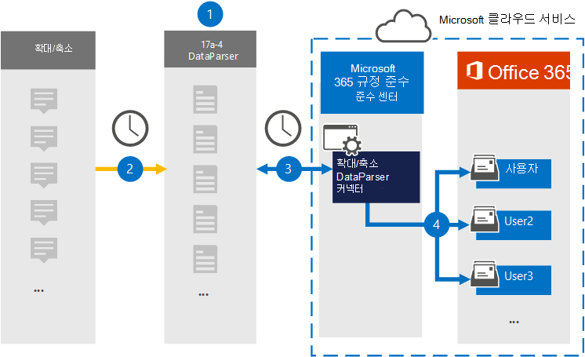

# 확대/축소 데이터를 보관할 커넥터 설정(미리 보기)Set up a connector to archive Zoom data (preview)

17a-4 LLC의 [Zoom DataParser를](https://www.17a-4.com/dataparser/) 사용하여 확대/축소 플랫폼에서 조직의 사용자 사서함으로 데이터를 Microsoft 365 보관합니다.Use the [Zoom DataParser](https://www.17a-4.com/dataparser/) from 17a-4 LLC to import and archive data from the Zoom platform to user mailboxes in your Microsoft 365 organization. DataParser에는 타사 데이터 원본의 항목을 캡처하고 해당 항목을 가져오도록 구성된 확대/축소 커넥터가 Microsoft 365.The DataParser includes a Zoom connector that's configured to capture items from a third-party data source and import those items to Microsoft 365. Zoom DataParser 커넥터는 확대/축소 데이터를 전자 메일 메시지 형식으로 변환한 다음 해당 항목을 전자 메일 메시지의 사용자 사서함으로 Microsoft 365.The Zoom DataParser connector converts Zoom data to an email message format and then imports those items to user mailboxes in Microsoft 365.

확대/축소 데이터가 사용자 사서함에 저장되고 나면 소송 보존, eDiscovery Microsoft 365 보존 정책 및 보존 레이블, 통신 준수와 같은 Microsoft 365 준수 기능을 적용할 수 있습니다.After Zoom data is stored in user mailboxes, you can apply Microsoft 365 compliance features such as Litigation Hold, eDiscovery, retention policies and retention labels, and communication compliance. 확대/축소 커넥터를 사용하여 데이터 가져오기 및 보관을 Microsoft 365 조직이 정부 및 규제 정책을 준수하는 데 도움이 될 수 있습니다.Using a Zoom connector to import and archive data in Microsoft 365 can help your organization stay compliant with government and regulatory policies.

## 확대/축소 데이터 보관 개요Overview of archiving Zoom data

다음 개요에서는 데이터 커넥터를 사용하여 데이터 원본의 확대/축소 데이터를 보관하는 Microsoft 365.The following overview explains the process of using a data connector to archive Zoom data in Microsoft 365.

1. 조직은 17a-4와 함께 작업하여 Zoom DataParser를 설정하고 구성합니다.Your organization works with 17a-4 to set up and configure the Zoom DataParser.

2. 확대/축소 항목은 정기적으로 DataParser에 의해 수집됩니다.On a regular basis, Zoom items are collected by the DataParser. 또한 DataParser는 메시지 내용을 전자 메일 메시지 형식으로 변환합니다.The DataParser also converts the content of a message to an email message format.

3. 데이터 센터에서 만드는 Zoom DataParser 커넥터는 Microsoft 365 규정 준수 센터 연결하고 메시지를 Microsoft 클라우드의 보안 Azure Storage 위치로 전송합니다.The Zoom DataParser connector that you create in the Microsoft 365 compliance center connects to DataParser and transfers the messages to a secure Azure Storage location in the Microsoft cloud.

4. **Zoom DataParser라는** 받은 편지함 폴더의 하위 폴더가 사용자 사서함에 만들어지며 확대/축소 항목을 해당 폴더로 가져오게 됩니다.A subfolder in the Inbox folder named **Zoom DataParser** is created in the user mailboxes, and the Zoom items are imported to that folder. 커넥터는 Email 속성 값을 사용하여 항목을 가져올 사서함을 결정할 *수* 있습니다.The connector determines which mailbox to import items to by using the value of the *Email* property. 모든 확대/축소 항목에는 모든 참가자의 전자 메일 주소로 채워지는 이 속성이 포함되어 있습니다.Every Zoom item contains this property, which is populated with the email address of every participant.

## 커넥터를 설정하기 전에Before you set up a connector

- Microsoft 커넥터에 대한 DataParser 계정을 생성합니다.Create a DataParser account for Microsoft connectors. 이 작업을 위해 [17a-4 LLC에 문의합니다.](https://www.17a-4.com/contact/)To do this, contact [17a-4 LLC](https://www.17a-4.com/contact/). 1단계에서 커넥터를 만들 때 이 계정에 로그인해야 합니다.You need to sign into this account when you create the connector in Step 1.

- 1단계에서 Zoom DataParser 커넥터를 만들고 3단계에서 완료하는 사용자는 2단계에서 사서함 가져오기 내보내기 역할에 할당해야 Exchange Online.The user who creates the Zoom DataParser connector in Step 1 (and completes it in Step 3) must be assigned to the Mailbox Import Export role in Exchange Online. 이 역할은 서버의 데이터  커넥터 페이지에서 커넥터를 추가하는 Microsoft 365 규정 준수 센터.This role is required to add connectors on the **Data connectors** page in the Microsoft 365 compliance center. 기본적으로 이 역할은 역할 그룹의 역할 그룹에 할당되지 Exchange Online.By default, this role is not assigned to a role group in Exchange Online. 사서함 가져오기 내보내기 역할을 조직의 조직 관리 역할 그룹에 추가할 수 Exchange Online.You can add the Mailbox Import Export role to the Organization Management role group in Exchange Online. 또는 역할 그룹을 만들고 사서함 가져오기 내보내기 역할을 할당한 다음 해당 사용자를 구성원으로 추가할 수 있습니다.Or you can create a role group, assign the Mailbox Import Export role, and then add the appropriate users as members. 자세한 내용은 "역할  그룹에서  역할 그룹 관리" 문서의 역할 그룹 만들기 또는 역할 그룹 수정 섹션을 Exchange Online.For more information, see the [Create role groups](/Exchange/permissions-exo/role-groups#create-role-groups) or [Modify role groups](/Exchange/permissions-exo/role-groups#modify-role-groups) sections in the article "Manage role groups in Exchange Online".

## 1단계: Zoom DataParser 커넥터 설정Step 1: Set up a Zoom DataParser connector

첫 번째 단계는 2단계에서 데이터 커넥터 페이지에 액세스하고 Microsoft 365 규정 준수 센터 17a-4 커넥터를 만들어 확대/축소 데이터에 대한 커넥터를 만드는 것입니다.The first step is to access to the Data connectors page in the Microsoft 365 compliance center and create a 17a-4 connector for Zoom data.

1. 으로 <https://compliance.microsoft.com> 이동한 다음 **데이터** 커넥터  >  **Zoom DataParser 를 클릭합니다.**Go to <https://compliance.microsoft.com> and then click **Data connectors** > **Zoom DataParser**.

2. Zoom **DataParser** 제품 설명 페이지에서 커넥터 **추가를 클릭합니다.**On the **Zoom DataParser** product description page, click **Add connector**.

3. 서비스 **약관 페이지에서** 동의를 **클릭합니다.**On the **Terms of service** page, click **Accept**.

4. 커넥터를 식별하는 고유한 이름을 입력하고 다음 을 **클릭합니다.**Enter a unique name that identifies the connector and then click **Next**.

5. 17a-4 계정에 로그인하고 Zoom DataParser 연결 마법사의 단계를 완료합니다.Sign in to your 17a-4 account and complete the steps in the Zoom DataParser connection wizard.

## 2단계: Zoom DataParser 커넥터 구성Step 2: Configure the Zoom DataParser connector

17a-4 지원을 사용하여 Zoom DataParser 커넥터를 구성합니다.Work with 17a-4 Support to configure the Zoom DataParser connector.

## 3단계: 사용자 매핑Step 3: Map users

Zoom DataParser 커넥터는 데이터를 데이터 원본으로 가져오기 전에 Microsoft 365 전자 메일 주소에 자동으로 Microsoft 365.The Zoom DataParser connector will automatically map users to their Microsoft 365 email addresses before importing data to Microsoft 365.

## 4단계: Zoom DataParser 커넥터 모니터링Step 4: Monitor the Zoom DataParser connector

Zoom DataParser 커넥터를 만든 후 연결선의 커넥터 상태를 볼 수 Microsoft 365 규정 준수 센터.After you create a Zoom DataParser connector, you can view the connector status in the Microsoft 365 compliance center.

1. 으로 <https://compliance.microsoft.com> 이동하여 왼쪽 **nav에서 데이터** 커넥터를 클릭합니다.Go to <https://compliance.microsoft.com> and click **Data connectors** in the left nav.

2. 커넥터 **탭을** 클릭한 다음 만든 Zoom DataParser 커넥터를 선택하여 커넥터에 대한 속성과 정보가 포함된 플라이아웃 페이지를 표시합니다.Click the **Connectors** tab and then select the Zoom DataParser connector that you created to display the flyout page, which contains the properties and information about the connector.

3. 원본이 있는 커넥터 상태  **아래에서** 로그 다운로드 링크를 클릭하여 커넥터의 상태 로그를 열거나 저장합니다.Under **Connector status with source**, click the **Download log** link to open (or save) the status log for the connector. 이 로그에는 Microsoft 클라우드로 가져온 데이터가 포함되어 있습니다.This log contains data that has been imported to the Microsoft cloud.

## 알려진 문제Known issues

현재는 10MB보다 큰 첨부 파일 또는 항목 가져오기는 지원되지 않습니다.At this time, we don't support importing attachments or items that are larger than 10 MB. 더 큰 항목에 대한 지원은 나중에 사용할 수 있습니다.Support for larger items will be available at a later date.
