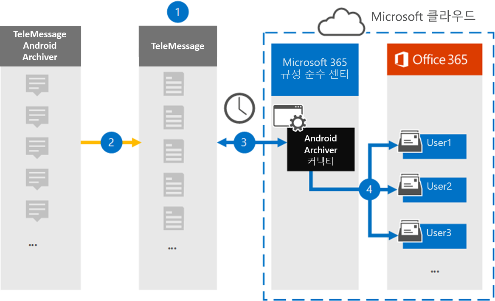

# Android 모바일 데이터를 보관할 커넥터 설정

휴대폰에서 TeleMessage 커넥터를 Microsoft 365 규정 준수 센터 Android 휴대폰에서 SMS, MMS, 음성 통화 및 통화 로그를 가져오고 보관합니다. 커넥터를 설정하고 구성한 후 이 커넥터는 매일 조직의 TeleMessage 계정에 연결하고 TeleMessage Android Archiver를 사용하여 직원의 모바일 통신을 조직의 사서함으로 Microsoft 365.

Android 휴대폰의 데이터가 사용자 사서함에 저장되고 나면 소송 보존, Microsoft 365 검색 및 보존 정책과 같은 Microsoft 365 준수 기능을 Android Archiver 데이터에 적용할 수 있습니다. 예를 들어 콘텐츠 검색을 사용하여 Android Archiver 모바일 통신을 검색하거나 Android Archiver 커넥터 데이터가 포함된 사서함을 보관할 수 Advanced eDiscovery 있습니다. Android Archiver 커넥터를 사용하여 조직에서 데이터를 가져오고 Microsoft 365 정책을 준수하는 데 도움이 될 수 있습니다.

## Android 모바일 데이터 보관 개요

다음 개요에서는 커넥터를 사용하여 Android 모바일 데이터를 커넥터에 보관하는 Microsoft 365.

1. 조직은 TeleMessage와 함께 Android Archiver 커넥터를 설치합니다. 자세한 내용은 [Android Archiver를 참조하세요.](https://www.telemessage.com/office365-activation-for-android-archiver/)

2. 실시간으로 조직의 Android 휴대폰에서 SMS, MMS, 음성 통화 및 통화 로그가 TeleMessage 사이트에 복사됩니다.

3. Microsoft 365 규정 준수 센터 만든 Android Archiver 커넥터는 매일 TeleMessage 사이트에 연결하고 이전 24시간의 Android 데이터를 Microsoft 클라우드의 보안 Azure Storage 위치로 전송합니다. 또한 커넥터는 Android 데이터를 전자 메일 메시지 형식으로 변환합니다.

4. 커넥터는 모바일 통신 항목을 특정 사용자의 사서함으로 가져올 수 있습니다. Android Archiver라는 새 폴더가 특정 사용자의 사서함에 만들어지며 항목이 해당 폴더로 가져오기됩니다. 커넥터는 사용자의 전자 메일 주소 속성 값을 사용하여 *매핑합니다.* 모든 전자 메일 메시지에는 전자 메일 메시지의 모든 참가자의 전자 메일 주소로 채워지는 이 속성이 포함되어 있습니다. 사용자의 전자 메일 주소 속성 값을  사용하는 자동 사용자 매핑 외에도 CSV 매핑 파일을 업로드하여 사용자 지정 매핑을 정의할 수도 있습니다. 이 매핑 파일에는 각 사용자의 휴대폰 번호와 Microsoft 365 사서함 주소가 포함되어야 합니다. 자동 사용자 매핑을 사용하도록 설정하고 사용자 지정 매핑을 제공하는 경우 커넥터가 모든 전자 메일 항목에 대해 먼저 사용자 지정 매핑 파일을 봐야 합니다. 사용자의 휴대폰 번호에 해당하는 유효한 Microsoft 365 사용자가 없는 경우 커넥터는 전자 메일 항목의 사용자의 전자 메일 주소 속성을 사용하게 됩니다. 커넥터가 전자 메일 항목의 사용자 지정 매핑 Microsoft 365 사용자 전자 메일  주소 속성에서 유효한 사용자 지정 사용자를 찾지 못하면 항목을 가져오지 않습니다.

## 커넥터를 설정하기 전에

Android 통신 데이터를 보관하는 데 필요한 일부 구현 단계는 Microsoft 365 외부에 있으며 준수 센터에서 커넥터를 만들기 전에 완료해야 합니다.

- [TeleMessage에서 Android Archiver](https://www.telemessage.com/mobile-archiver/order-mobile-archiver-for-o365) 서비스를 주문하고 조직에 대한 유효한 관리 계정을 얻습니다. 커넥터를 만들 때 이 계정에 로그인해야 합니다.

- Android Archiver 서비스가 필요한 모든 사용자를 TeleMessage 계정에 등록합니다. 사용자를 등록할 때 사용자 계정과 동일한 전자 메일 주소를 Microsoft 365 합니다.

- 직원의 휴대폰에서 TeleMessage Android Archiver 앱을 설치하고 활성화합니다.

- Android Archiver 커넥터를 만드는 사용자에게 사서함 가져오기 내보내기 역할이 할당되어야 Exchange Online. 이 연결은 서버의 데이터  커넥터 페이지에서 커넥터를 추가하는 Microsoft 365 규정 준수 센터. 기본적으로이 역할은 Exchange Online의 어떤 역할 그룹에도 할당되지 않습니다. 사서함 가져오기 내보내기 역할을 조직의 조직 관리 역할 그룹에 추가할 수 Exchange Online. 또는 역할 그룹을 만들고 사서함 가져오기 내보내기 역할을 할당한 다음 해당 사용자를 구성원으로 추가할 수 있습니다. 자세한 내용은 "역할  그룹에서  역할 그룹 관리" 문서의 역할 그룹 만들기 또는 역할 그룹 수정 섹션을 Exchange Online.

- 이 데이터 커넥터는 미국 GCC 클라우드의 Microsoft 365 사용할 수 있습니다. 타사 응용 프로그램 및 서비스는 Microsoft 365 인프라 외부에 있는 타사 시스템에서 조직의 고객 데이터를 저장, 전송 및 처리해야 할 수 있으므로 Microsoft 365 및 데이터 보호 약정의 적용을 Microsoft 365 수 있습니다. Microsoft는 타사 응용 프로그램에 연결하는 데 이 제품을 사용하는 것은 해당 타사 응용 프로그램이 FEDRAMP 규격임을 암시하는 표현을 사용하지 않습니다.

## Android Archiver 커넥터 만들기

마지막 단계는 Android Archiver 커넥터를 만드는 Microsoft 365 규정 준수 센터. 커넥터는 사용자가 제공한 정보를 사용하여 TeleMessage 사이트에 연결하고 Android 통신을 서버의 해당 사용자 사서함 상자로 Microsoft 365.

1. 으로 [https://compliance.microsoft.com](https://compliance.microsoft.com) 이동하여 **데이터** 커넥터  >  **Android Archiver 를 클릭합니다.**

2. Android **Archiver 제품** 설명 페이지에서 커넥터 **추가를 클릭합니다.**

3. 서비스 **약관 페이지에서** 동의를 **클릭합니다.**

4. **TeleMessage에** 로그인 페이지의 3단계에서 다음 상자에 필요한 정보를 입력하고 다음을 **클릭합니다.**

   - **사용자 이름:** TeleMessage 사용자 이름입니다.

   - **암호:** TeleMessage 암호입니다.

5. 커넥터를 만든 후 팝업 창을 닫고 다음 을 **클릭합니다.**

6. 사용자 **매핑 페이지에서** 자동 사용자 매핑을 사용하도록 설정하고 다음 을 **클릭합니다.** CSV 파일을 업로드하는 사용자 지정 매핑이 필요한 경우 다음 을 **클릭합니다.**

7. 설정을 검토한 다음 **마친을 클릭하여** 커넥터를 생성합니다.

8. 데이터 커넥터 페이지의 커넥터  탭으로 이동하여 새 커넥터의 가져오기 프로세스 진행률을 볼 수 있습니다.

## 알려진 문제

- 현재는 10MB보다 큰 첨부 파일 또는 항목 가져오기는 지원되지 않습니다. 더 큰 항목에 대한 지원은 나중에 사용할 수 있습니다.
