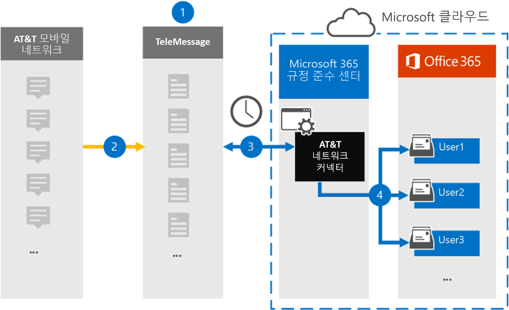

# AT&T SMS/MMS 데이터를 보관할 커넥터 설정Set up a connector to archive AT&T SMS/MMS data

Microsoft 365 규정 준수 센터의 TeleMessage 커넥터를 사용하여 AT SMS T 모바일 네트워크에서&데이터를 가져오고 보관합니다.Use a TeleMessage connector in the Microsoft 365 compliance center to import and archive SMS and MMS data from AT&T Mobile Network. 커넥터를 설정하고 구성한 후 이 커넥터는 매일 조직의 AT&T 네트워크에 연결하고 SMS 및 MMS 데이터를 조직의 사서함으로 Microsoft 365.After you set up and configure a connector, it connects to your organization's AT&T Network once every day, and imports SMS and MMS data to mailboxes in Microsoft 365.

사용자 SMS 및 MMS 메시지를 저장한 후 소송 보존, 콘텐츠 검색 및 Microsoft 365 보존 정책과 같은 Microsoft 365 준수 기능을 AT&T 네트워크 데이터에 적용할 수 있습니다.After SMS and MMS messages are stored in user mailboxes, you can apply Microsoft 365 compliance features such as Litigation Hold, Content Search, and Microsoft 365 retention policies to AT&T Network data. 예를 들어 콘텐츠 검색을 사용하여 AT&T 네트워크 데이터를 검색하거나 AT&T 네트워크 커넥터 데이터가 포함된 사서함을 보안 사례의 Advanced eDiscovery 있습니다.For example, you can search AT&T Network data using Content Search or associate the mailbox that contains the AT&T Network connector data with a custodian in an Advanced eDiscovery case. AT&T 네트워크 커넥터를 사용하여 조직의 데이터를 Microsoft 365 및 규제 정책을 준수하는 데 도움이 될 수 있습니다.Using a AT&T Network connector to import and archive data in Microsoft 365 can help your organization stay compliant with government and regulatory policies.

## T 네트워크 데이터&보관 개요Overview of archiving AT&T Network data

다음 개요에서는 커넥터를 사용하여 AT&T 네트워크 데이터를 보관하는 Microsoft 365.The following overview explains the process of using a connector to archive AT&T Network data in Microsoft 365.

1. 조직은 TeleMessage와 함께 AT&T 네트워크 커넥터를 설치합니다.Your organization works with TeleMessage to set up an AT&T Network connector. 자세한 내용은 [AT&T Network Archiver 를 참조하세요.](https://www.telemessage.com/office365-activation-for-atnt-network-archiver/)For information, see [AT&T Network Archiver](https://www.telemessage.com/office365-activation-for-atnt-network-archiver/).

2. 실시간으로 조직의 AT SMS T 네트워크의&및 MMS 메시지가 TeleMessage 사이트에 복사됩니다.In real time, SMS and MMS messages from your organization's AT&T Network are copied to the TeleMessage site.

3. Microsoft 365 준수 센터에서 만드는 AT&T 네트워크 커넥터는 매일 TeleMessage 사이트에 연결하고 이전 24시간 동안의 SMS 및 MMS 메시지를 Microsoft 클라우드의 보안 Azure Storage 위치로 전송합니다.The AT&T Network connector that you create in the Microsoft 365 compliance center connects to the TeleMessage site every day and transfers the SMS and MMS messages from the previous 24 hours to a secure Azure Storage location in the Microsoft cloud. 또한 커넥터는 메시지 및 MMS SMS 전자 메일 메시지 형식으로 변환합니다.The connector also converts the content of SMS and MMS messages to an email message format.

4. 커넥터는 모바일 통신 항목을 특정 사용자의 사서함으로 가져올 수 있습니다.The connector imports the mobile communication items to the mailbox of specific users. AT&**T SMS/MMS Network Archiver라는** 새 폴더가 사용자의 사서함에 만들어지며 항목을 가져와야 합니다.A new folder named **AT&T SMS/MMS Network Archiver** is created in the user's mailbox and the items are imported to it. 커넥터는 사용자의 전자 메일 주소 속성 값을 사용하여 이 *매핑을* 실행합니다.The connector does this mapping by using the value of the *User's Email address* property. 모든 SMS 및 MMS 메시지에는 메시지의 모든 참가자의 전자 메일 주소로 채워지는 이 속성이 포함되어 있습니다.Every SMS and MMS message contains this property, which is populated with the email address of every participant of the message.
 
   사용자의 전자 메일 주소 속성 값을  사용하는 자동 사용자 매핑 외에도 CSV 매핑 파일을 업로드하여 사용자 지정 매핑을 정의할 수도 있습니다.In addition to automatic user mapping using the value of the *User’s Email address* property, you can also define a custom mapping by uploading a CSV mapping file. 이 매핑 파일에는 조직의 사용자에 대한 휴대폰 번호와 Microsoft 365 전자 메일 주소가 포함되어 있습니다.This mapping file contains the mobile phone number and corresponding Microsoft 365 email address for users in your organization. 자동 사용자 매핑과 사용자 지정 매핑을 모두 사용하도록 설정하면 커넥터가 모든 전자 메일 항목에 대해 먼저 사용자 지정 매핑 파일을 룩합니다.If you enable both automatic user mapping and custom mapping, for every email item the connector first looks at the custom mapping file. 휴대폰 번호에 해당하는 유효한 Microsoft 365 사용자가 없는 경우 커넥터는 가져오려고 하는 항목의 전자 메일 주소 속성 값을 사용합니다.If it doesn't find a valid Microsoft 365 user that corresponds to a mobile phone number, the connector uses the values in the email address property of the item it's trying to import. 커넥터가 사용자 지정 매핑 파일 또는 전자 메일 Microsoft 365 주소 속성에서 유효한 사용자 지정 사용자를 찾지 못하면 항목을 가져오지 않습니다.If the connector doesn't find a valid Microsoft 365 user in either the custom mapping file or in the email address property of the email item, the item won't be imported.

## 시작하기 전에Before you begin

AT&T 네트워크 데이터를 보관하는 데 필요한 일부 구현 단계는 Microsoft 365 외부에 있으며 준수 센터에서 커넥터를 만들기 전에 완료해야 합니다.Some of the implementation steps required to archive AT&T Network data are external to Microsoft 365 and must be completed before you can create the connector in the compliance center.

- [TeleMessage에서](https://www.telemessage.com/mobile-archiver/order-mobile-archiver-for-o365/) 모바일 보관 서비스 주문 및 조직에 대한 유효한 관리 계정을 얻습니다.Order the [mobile archiver service from TeleMessage](https://www.telemessage.com/mobile-archiver/order-mobile-archiver-for-o365/) and get a valid administration account for your organization. 준수 센터에서 커넥터를 만들 때 이 계정에 로그인해야 합니다.You'll need to sign into this account when you create the connector in the compliance center.

- AT&T 계정 및 대금 청구 연락처 세부 정보를 확인하여 TeleMessage 온보더링 양식을 작성하고 AT&T에서 메시지 보관 서비스를 주문할 수 있습니다.Obtain your AT&T account and billing contact details so you can fill-out the TeleMessage onboarding forms and order the message archiving service from AT&T.

- TELEMessage 계정에 AT&T SMS/MMS 네트워크 보관이 필요한 모든 사용자를 등록합니다.Register all users that require AT&T SMS/MMS Network archiving in the TeleMessage account. 사용자를 등록할 때 사용자 계정과 동일한 전자 메일 주소를 Microsoft 365 합니다.When registering users, be sure to use the same email address that's used for their Microsoft 365 account.

- 직원은 AT 및 T 모바일 네트워크에 회사 소유의 회사 소유 휴대폰 및 회사&있어야 합니다.Your employees must have corporate-owned and corporate-liable mobile phones on the AT&T mobile network. 직원 소유의 Microsoft 365 또는 "BYOD(Bring Your Own Devices) 장치에서는 보관 메시지를 사용할 수 없습니다.Archiving messages in Microsoft 365 isn't available for employee-owned or "Bring Your Own Devices (BYOD) devices.

- AT&T 네트워크 커넥터를 만드는 사용자에게 사서함 가져오기 내보내기 역할이 할당되어야 Exchange Online.The user who creates a AT&T Network connector must be assigned the Mailbox Import Export role in Exchange Online. 준수 센터의 데이터 커넥터  페이지에서 커넥터를 추가하려면 Microsoft 365 필요합니다.This is required to add connectors in the **Data connectors** page in the Microsoft 365 compliance center. 기본적으로이 역할은 Exchange Online의 어떤 역할 그룹에도 할당되지 않습니다.By default, this role isn't assigned to any role group in Exchange Online. 사서함 가져오기 내보내기 역할을 조직의 조직 관리 역할 그룹에 추가할 수 Exchange Online.You can add the Mailbox Import Export role to the Organization Management role group in Exchange Online. 또는 역할 그룹을 만들고 사서함 가져오기 내보내기 역할을 할당한 다음 해당 사용자를 구성원으로 추가할 수 있습니다.Or you can create a role group, assign the Mailbox Import Export role, and then add the appropriate users as members. 자세한 내용은 "역할  그룹에서  역할 그룹 관리" 문서의 역할 그룹 만들기 또는 역할 그룹 수정 섹션을 Exchange Online.For more information, see the [Create role groups](/Exchange/permissions-exo/role-groups#create-role-groups) or [Modify role groups](/Exchange/permissions-exo/role-groups#modify-role-groups) sections in the article "Manage role groups in Exchange Online".

- 이 데이터 커넥터는 미국 GCC 클라우드의 Microsoft 365 사용할 수 있습니다.This data connector is available in GCC environments in the Microsoft 365 US Government cloud. 타사 응용 프로그램 및 서비스는 Microsoft 365 인프라 외부에 있는 타사 시스템에서 조직의 고객 데이터를 저장, 전송 및 처리해야 할 수 있으므로 Microsoft 365 및 데이터 보호 약정의 적용을 Microsoft 365 수 있습니다.Third-party applications and services might involve storing, transmitting, and processing your organization's customer data on third-party systems that are outside of the Microsoft 365 infrastructure and therefore are not covered by the Microsoft 365 compliance and data protection commitments. Microsoft는 타사 응용 프로그램에 연결하는 데 이 제품을 사용하는 것은 해당 타사 응용 프로그램이 FEDRAMP 규격임을 암시하는 표현을 사용하지 않습니다.Microsoft makes no representation that use of this product to connect to third-party applications implies that those third-party applications are FEDRAMP compliant.

## AT&T 네트워크 커넥터 만들기Create a AT&T Network connector

이전 섹션에 설명된 선행 작업을 완료한 후 규정 준수 센터에서 AT&T 네트워크 커넥터를 Microsoft 365 있습니다.After you've completed the prerequisites described in the previous section, you can create an AT&T Network connector in the Microsoft 365 compliance center. 커넥터는 사용자가 제공한 정보를 사용하여 TeleMessage 사이트에 연결하고 SMS 및 MMS 메시지를 전자 메일 서버의 해당 사용자 사서함 상자로 Microsoft 365.The connector uses the information you provide to connect to the TeleMessage site and transfer SMS and MMS messages to the corresponding user mailbox boxes in Microsoft 365.

1. 으로 이동한 다음 데이터 [https://compliance.microsoft.com](https://compliance.microsoft.com/) 커넥터 AT&  \  **클릭합니다.**Go to [https://compliance.microsoft.com](https://compliance.microsoft.com/) and then click **Data connectors** \ **AT&T Network**.

2. AT&**T 네트워크** 제품 설명 페이지에서 커넥터 **추가를 클릭합니다.**On the **AT&T Network product** description page, click **Add connector**

3. 서비스 **약관 페이지에서** 동의를 **클릭합니다.**On the **Terms of service** page, click **Accept**.

4. **TeleMessage에** 로그인 페이지의 3단계에서 다음 상자에 필요한 정보를 입력하고 다음을 **클릭합니다.**On the **Login to TeleMessage** page, under Step 3, enter the required information in the following boxes and then click **Next**.

   - **사용자 이름:** TeleMessage 사용자 이름입니다.**Username:** Your TeleMessage username.

   - **암호:** TeleMessage 암호입니다.**Password:** Your TeleMessage password.

5. 커넥터를 만든 후 팝업 창을 닫고 다음 페이지로 이동하면 됩니다.After the connector is created, you can close the pop-up window and go to the next page.

6. 사용자 **매핑 페이지에서** 자동 사용자 매핑을 사용하도록 설정합니다.On the **User mapping** page, enable automatic user mapping. 사용자 지정 매핑을 사용하도록 설정하려면 사용자 매핑 정보가 포함된 CSV 파일을 업로드한 후 다음 을 **클릭합니다.**To enable custom mapping, upload a CSV file that contains the user mapping information, and then click **Next**.

7. 설정을 검토한 다음 **마친을 클릭하여** 커넥터를 생성합니다.Review your settings, and then click **Finish** to create the connector.

8. 준수 **센터의** 데이터 커넥터  페이지의 커넥터 탭으로 이동하여 새 커넥터의 가져오기 프로세스 진행률을 확인하십시오.Go to the **Connectors** tab on the **Data connectors** page in the compliance center to see the progress of the import process for the new connector.

## 알려진 문제Known issues

- 현재는 10MB보다 큰 첨부 파일 또는 항목 가져오기는 지원되지 않습니다.At this time, we don't support importing attachments or items that are larger than 10 MB. 더 큰 항목에 대한 지원은 나중에 사용할 수 있습니다.Support for larger items will be available at a later date.
