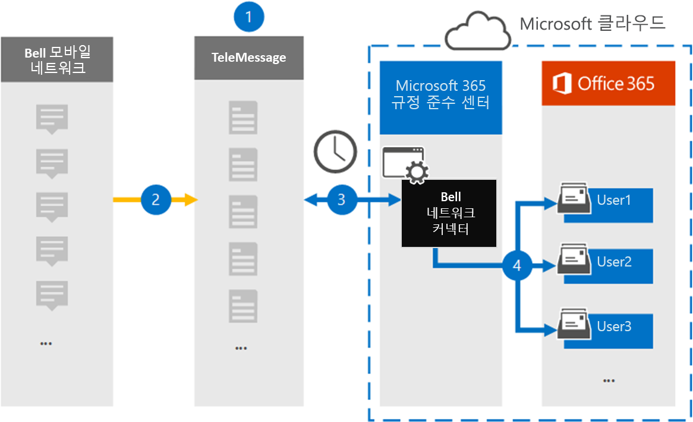

# 벨 네트워크 데이터를 보관 하는 연결선 설정 (미리 보기)Set up a connector to archive Bell Network data (preview)

Microsoft 365 준수 센터의 TeleMessage 커넥터를 사용 하 여 벨 네트워크에서 짧은 메시징 서비스 (SMS) 및 MMS (멀티미디어 메시징 서비스) 메시지를 가져오고 보관 합니다.Use a TeleMessage connector in the Microsoft 365 compliance center to import and archive Short Messaging Service (SMS) and Multimedia Messaging Service (MMS) messages from the Bell Network. 커넥터를 설정 하 고 구성한 후에는 매일 한 번씩 조직의 벨 네트워크에 연결 하 고 SMS 및 MMS 메시지를 Microsoft 365의 사서함으로 가져옵니다.After you set up and configure a connector, it connects to your organization's Bell Network once every day, and imports SMS and MMS messages to mailboxes in Microsoft 365.

SMS 및 MMS 메시지가 사용자 사서함에 저장 되 면 소송 보존, 콘텐츠 검색 및 Microsoft 365 고정 정책 등의 Microsoft 365 규정 준수 기능을 사용 하 여 네트워크 데이터를 삭제할 수 있습니다.After the SMS and MMS messages are stored in user mailboxes, you can apply Microsoft 365 compliance features such as Litigation Hold, Content Search, and Microsoft 365 retention policies to Bell Network data. 예를 들어 콘텐츠 검색을 사용 하 여 벨 네트워크 SMS/MMS를 검색 하거나 벨 네트워크 커넥터 데이터를 포함 하는 사서함을 고급 eDiscovery 사례의 custodian에 연결할 수 있습니다.For example, you can search Bell Network SMS/MMS using Content Search or associate the mailbox that contains the Bell Network connector data with a custodian in an Advanced eDiscovery case. 벨 네트워크 커넥터를 사용 하 여 Microsoft 365에서 데이터를 가져오고 보관 하면 조직이 정부 및 규정 정책을 준수 하는 데 도움이 될 수 있습니다.Using a Bell Network connector to import and archive data in Microsoft 365 can help your organization stay compliant with government and regulatory policies.

## 벨 네트워크 데이터 보관 개요Overview of archiving Bell Network data

다음 개요에서는 커넥터를 사용 하 여 Microsoft 365에서 벨 네트워크 데이터를 보관 하는 프로세스에 대해 설명 합니다.The following overview explains the process of using a connector to archive Bell Network data in Microsoft 365.

1. 조직에서 TeleMessage 및 벨을 사용 하 여 벨 네트워크 커넥터를 설정 합니다.Your organization works with TeleMessage and Bell to set up a Bell Network connector. 자세한 내용은 [벨 네트워크 winrar](https://www.telemessage.com/office365-activation-for-bell-network-archiver)를 참조 하십시오.For more information, see [Bell Network Archiver](https://www.telemessage.com/office365-activation-for-bell-network-archiver).

2. 조직의 벨 네트워크에 있는 SMS 및 MMS 메시지는 24 시간 마다 TeleMessage 사이트에 복사 됩니다.Once every 24 hours, SMS and MMS messages from your organization’s Bell Network are copied to the TeleMessage site.

3. Microsoft 365 준수 센터에서 만든 벨 네트워크 커넥터는 매일 TeleMessage 사이트에 연결 하 고 SMS 및 MMS 메시지를 이전 24 시간에서 Microsoft 클라우드의 안전한 Azure Storage 위치로 전송 합니다.The Bell Network connector that you create in the Microsoft 365 compliance center connects to the TeleMessage site every day and transfers the SMS and MMS messages from the previous 24 hours to a secure Azure Storage location in the Microsoft Cloud. 또한이 커넥터는 SMS 및 MMS 메시지의 콘텐츠를 전자 메일 메시지 형식으로 변환 합니다.The connector also converts the content of SMS and MMS messages to an email message format.

4. 커넥터는 모바일 통신 항목을 특정 사용자의 사서함으로 가져옵니다.The connector imports the mobile communication items to the mailbox of specific users. 특정 사용자의 사서함에 **벨 SMS/MMS 네트워크 winrar** 라는 새 폴더가 만들어지고 해당 폴더로 항목을 가져옵니다.A new folder named **Bell SMS/MMS Network Archiver** is created in a specific user's mailbox and the items are imported to it. 커넥터는 *사용자의 전자 메일 주소* 속성 값을 사용 하 여이 매핑을 수행 합니다.The connector does this mapping by using the value of the *User’s Email address* property. 모든 SMS 및 MMS 메시지에는 메시지의 모든 참가자의 전자 메일 주소로 채워지는이 속성이 포함 되어 있습니다.Every SMS and MMS message contains this property, which is populated with the email address of every participant of the message.

   *사용자의 전자 메일 주소* 속성 값을 사용 하는 자동 사용자 매핑 외에도 CSV 매핑 파일을 업로드 하 여 사용자 지정 매핑을 정의할 수 있습니다.In addition to automatic user mapping using the value of the *User’s Email address* property, you can also define a custom mapping by uploading a CSV mapping file. 이 매핑 파일에는 조직의 사용자에 대 한 휴대폰 번호와 해당 Microsoft 365 전자 메일 주소가 포함 되어 있습니다.This mapping file contains the mobile phone number and corresponding Microsoft 365 email address for users in your organization. 자동 사용자 매핑과 사용자 지정 매핑을 모두 사용 하도록 설정 하는 경우 모든 벨 네트워크 항목에 대해 커넥터는 먼저 사용자 지정 매핑 파일을 찾습니다.If you enable both automatic user mapping and custom mapping, for every Bell Network item the connector first looks at custom mapping file. 사용자의 휴대폰 번호에 해당 하는 유효한 Microsoft 365 사용자를 찾지 못하면 커넥터는 가져오려고 하는 항목의 전자 메일 주소 속성 값을 사용 합니다.If it doesn't find a valid Microsoft 365 user that corresponds to a user's mobile phone number, the connector will use the values in the email address property of the item it's trying to import. 커넥터가 사용자 지정 매핑 파일 또는 종 네트워크 항목의 전자 메일 주소 속성에서 유효한 Microsoft 365 사용자를 찾지 못하면 항목을 가져오지 않습니다.If the connector doesn't find a valid Microsoft 365 user in either the custom mapping file or in the email address property of the Bell Network item, the item won't be imported.

## 시작하기 전에Before you begin

벨 네트워크 데이터를 보관 하는 데 필요한 일부 구현 단계는 Microsoft 365 외부에 있으므로, 준수 센터에서 커넥터를 만들기 전에 완료 해야 합니다.Some of the implementation steps required to archive Bell Network data are external to Microsoft 365 and must be completed before you can create a connector in the compliance center.

- [TeleMessage에서 벨 네트워크 winrar 서비스](https://www.telemessage.com/mobile-archiver/order-mobile-archiver-for-o365/) 를 주문 하 고 조직의 유효한 관리 계정을 가져옵니다.Order the [Bell Network Archiver service from TeleMessage](https://www.telemessage.com/mobile-archiver/order-mobile-archiver-for-o365/) and get a valid administration account for your organization. 준수 센터에서 커넥터를 만들 때이 계정에 로그인 해야 합니다.You'll need to sign into this account when you create the connector in the compliance center.

- TeleMessage 온 보 딩 양식을 작성 하 고 종에서 메시지 보관 서비스를 주문할 수 있도록 벨 네트워크 계정 및 대금 청구 연락처 세부 정보를 얻습니다.Obtain your Bell Network account and billing contact details so you can fill-out the TeleMessage onboarding forms and order the message archiving service from Bell.

- TeleMessage 계정에 종 SMS/MMS 네트워크 보관이 필요한 모든 사용자를 등록 합니다.Register all users that require Bell SMS/MMS Network archiving in the TeleMessage account. 사용자를 등록할 때 Microsoft 365 계정에 사용 되는 것과 동일한 전자 메일 주소를 사용 해야 합니다.When registering users, be sure to use the same email address that's used for their Microsoft 365 account.

- 직원은 벨 모바일 네트워크에 회사 소유 및 회사 책임의 휴대폰을 갖고 있어야 합니다.Your employees must have corporate-owned and corporate-liable mobile phones on the Bell mobile network. Microsoft 365의 보관 메시지는 직원 소유 또는 "자체 장치 (BYOD) 장치를 사용 하 여 사용할 수 없습니다.Archiving messages in Microsoft 365 isn't available for employee-owned or "Bring Your Own Devices (BYOD) devices.

- 조직에서는 Office 365 가져오기 서비스가 조직의 사서함 데이터에 액세스할 수 있도록 허용 해야 합니다.Your organization must consent to allow the Office 365 Import service to access mailbox data in your organization. 커넥터를 만들 때이 동의를 제공 해야 합니다.You will need to provide this consent when you create the connector. 이 요청에 동의 하려면 [이 페이지로](https://login.microsoftonline.com/common/oauth2/authorize?client_id=570d0bec-d001-4c4e-985e-3ab17fdc3073&response_type=code&redirect_uri=https://portal.azure.com/&nonce=1234&prompt=admin_consent)이동 하 여 Microsoft 365 전역 관리자의 자격 증명으로 로그인 한 다음 요청을 수락 합니다.To consent to this request, go to [this page](https://login.microsoftonline.com/common/oauth2/authorize?client_id=570d0bec-d001-4c4e-985e-3ab17fdc3073&response_type=code&redirect_uri=https://portal.azure.com/&nonce=1234&prompt=admin_consent), sign in with the credentials of Microsoft 365 global admin, and then accept the request. 벨 네트워크 커넥터를 성공적으로 만들기 전에이 단계를 완료 해야 합니다.You have to complete this step before you can successfully create a Bell Network connector.

- 벨 네트워크 커넥터를 만드는 사용자에 게는 Exchange Online의 사서함 가져오기 내보내기 역할이 할당 되어야 합니다.The user who creates a Bell Network connector must be assigned the Mailbox Import Export role in Exchange Online. 이는 Microsoft 365 준수 센터의 **데이터 커넥터** 페이지에서 커넥터를 추가 하는 데 필요 합니다.This is required to add connectors in the **Data connectors** page in the Microsoft 365 compliance center. 기본적으로이 역할은 Exchange Online의 어떤 역할 그룹에도 할당되지 않습니다.By default, this role isn't assigned to any role group in Exchange Online. Exchange Online의 조직 관리 역할 그룹에 사서함 가져오기 내보내기 역할을 추가할 수 있습니다.You can add the Mailbox Import Export role to the Organization Management role group in Exchange Online. 또는 역할 그룹을 만들고 사서함 가져오기 내보내기 역할을 할당 한 다음 해당 사용자를 구성원으로 추가할 수 있습니다.Or you can create a role group, assign the Mailbox Import Export role, and then add the appropriate users as members. 자세한 내용은 "Exchange Online에서 역할 그룹 관리" 문서의 [역할 그룹 만들기](https://docs.microsoft.com/Exchange/permissions-exo/role-groups#create-role-groups) 또는 [역할 그룹 수정](https://docs.microsoft.com/Exchange/permissions-exo/role-groups#modify-role-groups) 섹션을 참조 하세요.For more information, see the [Create role groups](https://docs.microsoft.com/Exchange/permissions-exo/role-groups#create-role-groups) or [Modify role groups](https://docs.microsoft.com/Exchange/permissions-exo/role-groups#modify-role-groups) sections in the article "Manage role groups in Exchange Online".

## 벨 네트워크 커넥터 만들기Create a Bell Network connector

마지막 단계는 Microsoft 365 준수 센터에서 벨 네트워크 커넥터를 만드는 것입니다.The last step is to create a Bell Network connector in the Microsoft 365 compliance center. 커넥터는 제공 하는 정보를 사용 하 여 TeleMessage 사이트에 연결 하 고 SMS/MMS 메시지를 Microsoft 365의 해당 사용자 사서함 상자로 전송 합니다.The connector uses the information you provide to connect to the TeleMessage site and transfer SMS/ MMS messages to the corresponding user mailbox boxes in Microsoft 365.

1. 로 이동한 [https://compliance.microsoft.com](https://compliance.microsoft.com) 후 **데이터 커넥터**  >  **벨 SMS/MMS 네트워크 winrar**를 클릭 합니다.Go to [https://compliance.microsoft.com](https://compliance.microsoft.com) and then click **Data connectors** > **Bell SMS/MMS Network Archiver**.

2. **벨 네트워크** 제품 설명 페이지에서 **커넥터 추가** 를 클릭 합니다.On the **Bell Network** product description page, click **Add connector**

3. **서비스 약관** 페이지에서 **수락**을 클릭 합니다.On the **Terms of service** page, click **Accept**.

4. **TeleMessage 로그인** 페이지의 3 단계에서 다음 상자에 필요한 정보를 입력 하 고 **다음**을 클릭 합니다.On the **Login to TeleMessage** page, under Step 3, enter the required information in the following boxes and then click **Next**.

   - **사용자 이름:** 사용자의 TeleMessage 사용자 이름입니다.**Username:** Your TeleMessage username.

   - **암호:** TeleMessage 암호**Password:** Your TeleMessage password.

5. 커넥터를 만든 후에는 팝업 창을 닫고 다음 페이지로 이동할 수 있습니다.After the connector is created, you can close the pop-up window and go to the next page.

6. **사용자 매핑** 페이지에서 자동 사용자 매핑을 사용 하도록 설정 합니다.On the **User mapping** page, enable automatic user mapping. 사용자 지정 매핑을 사용 하도록 설정 하려면 사용자 매핑 정보가 포함 된 CSV 파일을 업로드 하 고 **Next (다음**)를 클릭 합니다.To enable custom mapping, upload a CSV file that contains the user mapping information, and then click **Next**.

7. 관리자 동의를 제공 하 고 **Next (다음**)를 클릭 합니다.Provide admin consent and then click **Next**.

   관리자의 동의를 제공 하려면 Office 365 전역 관리자의 자격 증명을 사용 하 여 로그인 한 다음 승인 요청을 수락 해야 합니다.To provide admin consent, you must be signed in with the credentials of an Office 365 global admin, and then accept the consent request. 전역 관리자로 로그인 하지 않은 경우 [이 페이지로](https://login.microsoftonline.com/common/oauth2/authorize?client_id=570d0bec-d001-4c4e-985e-3ab17fdc3073&response_type=code&redirect_uri=https://portal.azure.com/&nonce=1234&prompt=admin_consent) 이동 하 여 전역 관리자 자격 증명을 사용 하 여 로그인 하 고 요청을 수락할 수 있습니다.If you aren't signed in as a global admin, you can go to [this page](https://login.microsoftonline.com/common/oauth2/authorize?client_id=570d0bec-d001-4c4e-985e-3ab17fdc3073&response_type=code&redirect_uri=https://portal.azure.com/&nonce=1234&prompt=admin_consent) and sign in using global admin credentials to accept the request.

8. 설정을 검토 하 고 **마침을** 클릭 하 여 커넥터를 만듭니다.Review your settings, and then click **Finish** to create the connector.

9. 준수 센터의 **데이터 커넥터** 페이지에 있는 **커넥터** 탭으로 이동 하 여 새 커넥터에 대 한 가져오기 프로세스 진행 상황을 확인 합니다.Go to the **Connectors** tab on the **Data connectors** page in the compliance center to see the progress of the import process for the new connector.

## 알려진 문제Known issues

- 이 경우에는 10mb 보다 큰 첨부 파일을 가져올 수 없지만 더 큰 항목에 대 한 지원은 나중에 제공 될 예정입니다.At this time, we don't support importing attachments larger than 10 MB but support for larger items will be available at a later date.
