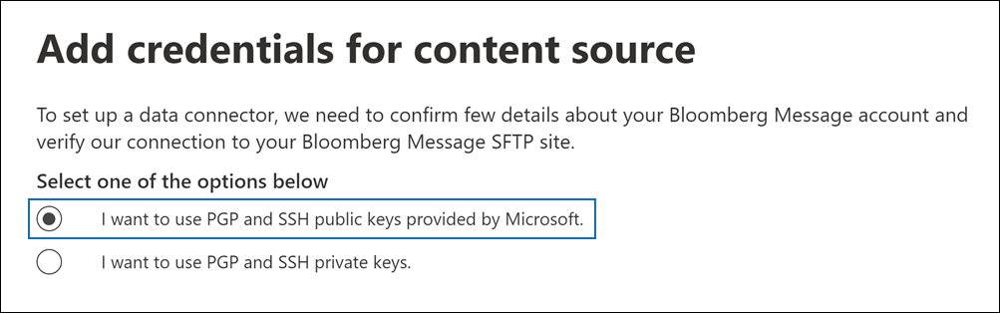

# Bloomberg 메시지 데이터를 보관할 커넥터 설정Set up a connector to archive Bloomberg Message data

Microsoft 365 규정 준수 센터의 데이터 커넥터를 사용하여 Bloomberg 메시지 공동 작업 도구에서 금융 서비스 전자 메일 데이터를 [가져오고 보관합니다.](https://www.bloomberg.com/professional/product/collaboration/)Use a data connector in the Microsoft 365 compliance center to import and archive financial services email data from the [Bloomberg Message](https://www.bloomberg.com/professional/product/collaboration/) collaboration tool. 커넥터를 설정 및 구성하고 나면 조직의 Bloomberg SFTP(Secure FTP) 사이트에 매일 연결하고 Microsoft 365의 사서함으로 전자 메일 항목을 가져올 수 있습니다.After you set up and configure a connector, it connects to your organization's Bloomberg secure FTP (SFTP) site once every day, and imports email items to mailboxes in Microsoft 365.

Bloomberg 메시지 데이터가 사용자 사서함에 저장되고 나면 소송 보존, 콘텐츠 검색, 원본 위치 보관, 감사, 커뮤니케이션 규정 준수 및 Microsoft 365 보존 정책과 같은 Microsoft 365 규정 준수 기능을 Bloomberg 메시지 데이터에 적용할 수 있습니다.After Bloomberg Message data is stored in user mailboxes, you can apply Microsoft 365 compliance features such as Litigation hold, content search, In-place archiving, auditing, Communication compliance, and Microsoft 365 retention policies to Bloomberg Message data. 예를 들어 콘텐츠 검색 도구를 사용하여 Bloomberg Message 전자 메일을 검색하거나 Bloomberg Message 데이터가 포함된 사서함을 고급 eDiscovery 사례의 관리인과 연결할 수 있습니다.For example, you can search Bloomberg Message emails using the content search tool or associate the mailbox that contains the Bloomberg Message data with a custodian in an Advanced eDiscovery case. Bloomberg 메시지 커넥터를 사용하여 Microsoft 365에서 데이터를 가져오고 보관하면 조직이 정부 및 규제 정책을 준수하는 데 도움이 될 수 있습니다.Using a Bloomberg Message connector to import and archive data in Microsoft 365 can help your organization stay compliant with government and regulatory policies.

## Bloomberg 메시지 데이터 보관 개요Overview of archiving Bloomberg Message data

다음 개요에서는 커넥터를 사용하여 Microsoft 365에서 Bloomberg 메시지 데이터를 보관하는 프로세스에 대해 설명합니다.The following overview explains the process of using a connector to archive Bloomberg Message data in Microsoft 365.

1. 조직은 Bloomberg와 함께 Bloomberg SFTP 사이트를 설정합니다.Your organization works with Bloomberg to set up a Bloomberg SFTP site. Bloomberg와 함께 전자 메일 메시지를 Bloomberg SFTP 사이트로 복사하도록 Bloomberg 메시지를 구성할 수도 있습니다.You'll also work with Bloomberg to configure Bloomberg Message to copy email messages to the Bloomberg SFTP site.

2. 24시간마다 Bloomberg Message의 전자 메일 메시지가 Bloomberg SFTP 사이트에 복사됩니다.Once every 24 hours, email messages from Bloomberg Message are copied to the Bloomberg SFTP site.

3. Microsoft 365 규정 준수 센터에서 만든 Bloomberg 메시지 커넥터는 매일 Bloomberg SFTP 사이트에 연결하고 지난 24시간 동안의 전자 메일 메시지를 Microsoft 클라우드의 보안 Azure Storage 영역으로 전송합니다.The Bloomberg Message connector that you create in the Microsoft 365 compliance center connects to the Bloomberg SFTP site every day and transfers the email messages from the previous 24 hours to a secure Azure Storage area in the Microsoft Cloud.

4. 커넥터는 전자 메일 메시지 항목을 특정 사용자의 사서함으로 가져올 수 있습니다.The connector imports the email message items to the mailbox of a specific user. BloombergMessage라는 새 폴더가 특정 사용자의 사서함에 만들어지며 항목이 해당 폴더로 가져오기됩니다.A new folder named BloombergMessage is created in the specific user's mailbox and the items will be imported to it.

   이 커넥터는 CorporateEmailAddress 속성 값을 사용하여 이 기능을 실행합니다.The connector does this by using the value of the CorporateEmailAddress property. 모든 전자 메일 메시지에는 전자 메일 메시지의 모든 참가자의 전자 메일 주소로 채워지는 이 속성이 포함되어 있습니다.Every email message contains this property, which is populated with the email address of every participant of the email message. *CorporateEmailAddress* 속성 값을 사용하는 자동 사용자 매핑 외에도 CSV 매핑 파일을 업로드하여 사용자 지정 매핑을 정의할 수도 있습니다.In addition to automatic user mapping using the value of the *CorporateEmailAddress* property, you can also define a custom mapping by uploading a CSV mapping file. 이 매핑 파일에는 Bloomberg UUID 및 조직의 각 사용자에 대한 해당 Microsoft 365 사서함 주소가 포함되어 있습니다.This mapping file contains a Bloomberg UUID and the corresponding Microsoft 365 mailbox address for each user in your organization. 자동 사용자 매핑을 사용하도록 설정하고 사용자 지정 매핑을 제공하는 경우 커넥터가 모든 전자 메일 항목에 대해 먼저 사용자 지정 매핑 파일을 봐야 합니다.If you enable automatic user mapping and provide a custom mapping, for every email item the connector will first look at the custom-mapping file. 사용자의 Bloomberg UUID에 해당하는 유효한 Microsoft 365 사용자를 찾지 못하면 커넥터에서 전자 메일 항목의 *CorporateEmailAddress* 속성을 사용하게 됩니다.If it doesn't find a valid Microsoft 365 user that corresponds to a user's Bloomberg UUID, the connector uses the *CorporateEmailAddress* property of the email item. 커넥터가 전자 메일 항목의 사용자 지정 매핑 파일 또는 *CorporateEmailAddress* 속성에서 유효한 Microsoft 365 사용자를 찾지 못하면 항목을 가져오지 않습니다.If the connector doesn't find a valid Microsoft 365 user in either the custom-mapping file or the *CorporateEmailAddress* property of the email item, the item won't be imported.

## 커넥터를 설정하기 전에Before you set up a connector

Bloomberg 메시지 데이터를 보관하는 데 필요한 구현 단계 중 일부는 Microsoft 365 외부에 있으며 준수 센터에서 커넥터를 만들기 전에 완료해야 합니다.Some of the implementation steps required to archive Bloomberg Message data are external to Microsoft 365 and must be completed before you can create the connector in the compliance center.

- Bloomberg 메시지 커넥터를 설정하기 위해 PGP(Pretty Good Privacy) 및 SSH(보안 셸)에 키와 키 암호가 필요합니다.To set up a Bloomberg Message connector, you have to use keys and key passphrases for Pretty Good Privacy (PGP) and Secure Shell (SSH). 이러한 키는 Bloomberg SFTP 사이트를 구성하는 데 사용하며, 커넥터가 Bloomberg SFTP 사이트에 연결하여 Microsoft 365로 데이터를 가져오는 데 사용됩니다.These keys are used to configure the Bloomberg SFTP site and used by the connector to connect to the Bloomberg SFTP site to import data to Microsoft 365. PGP 키는 Bloomberg SFTP 사이트에서 Microsoft 365로 전송되는 데이터의 암호화를 구성하는 데 사용됩니다.The PGP key is used to configure the encryption of data that's transferred from the Bloomberg SFTP site to Microsoft 365. SSH 키는 커넥터가 Bloomberg SFTP 사이트에 연결할 때 보안 원격 로그인을 사용하도록 보안 셸을 구성하는 데 사용됩니다.The SSH key is used to configure secure shell to enable a secure remote login when the connector connects to the Bloomberg SFTP site.

  커넥터를 설정할 때 Microsoft에서 제공하는 공개 키와 키 암호 또는 개인 키와 암호(passphrases)를 사용할 수 있습니다.When setting up a connector, you have the option to use public keys and key passphrases provided by Microsoft or you can use your own private keys and passphrases. Microsoft에서 제공하는 공개 키를 사용하는 것이 좋습니다.We recommend that you use the public keys provided by Microsoft. 그러나 조직에서 개인 키를 사용하여 Bloomberg SFTP 사이트를 이미 구성한 경우 동일한 개인 키를 사용하여 커넥터를 만들 수 있습니다.However, if your organization has already configured a Bloomberg SFTP site using private keys, then you can create a connector using these same private keys.

- [Bloomberg Anywhere 구독](https://www.bloomberg.com/professional/product/remote-access/?bbgsum-page=DG-WS-PROF-PROD-BBA).Subscribe to [Bloomberg Anywhere](https://www.bloomberg.com/professional/product/remote-access/?bbgsum-page=DG-WS-PROF-PROD-BBA). 이 정보는 Bloomberg Anywhere에 로그인하여 설정 및 구성해야 하는 Bloomberg SFTP 사이트에 액세스할 수 있도록 하는 데 필요합니다.This is required so that you can log in to Bloomberg Anywhere to access the Bloomberg SFTP site that you have to set up and configure.

- Bloomberg SFTP(보안 파일 전송 프로토콜) 사이트를 설치합니다.Set up a Bloomberg SFTP (Secure file transfer protocol) site. Bloomberg와 협력하여 SFTP 사이트를 설정한 후 Bloomberg Message의 데이터는 매일 SFTP 사이트에 업로드됩니다.After working with Bloomberg to set up the SFTP site, data from Bloomberg Message is uploaded to the SFTP site every day. 2단계에서 만든 커넥터는 이 SFTP 사이트에 연결하고 전자 메일 데이터를 Microsoft 365 사서함으로 전송합니다.The connector you create in Step 2 connects to this SFTP site and transfers the email data to Microsoft 365 mailboxes. 또한 SFTP는 전송 프로세스 중에 사서함으로 전송되는 Bloomberg 메시지 데이터를 암호화합니다.SFTP also encrypts the Bloomberg Message data that is sent to mailboxes during the transfer process.

  Bloomberg *SFTP(BB-SFTP라고도 불리는)에 대한 자세한 내용은 BB-SFTP를 참조하십시오.*For information about Bloomberg SFTP (also called *BB-SFTP*):

  - Bloomberg 지원에서 "SFTP 연결 표준" [문서를 참조합니다.](https://www.bloomberg.com/professional/support/documentation/)See the "SFTP Connectivity Standards" document at [Bloomberg Support](https://www.bloomberg.com/professional/support/documentation/).

  - [Bloomberg 고객 지원에 문의합니다.](https://service.bloomberg.com/portal/sessions/new?utm_source=bloomberg-menu&utm_medium=csc)Contact [Bloomberg customer support](https://service.bloomberg.com/portal/sessions/new?utm_source=bloomberg-menu&utm_medium=csc).

- Bloomberg와 함께 SFTP 사이트를 설정한 후 Bloomberg는 Bloomberg 구현 전자 메일 메시지에 응답한 후 몇 가지 정보를 제공합니다.After you work with Bloomberg to set up an SFTP site, Bloomberg will provide some information to you after you respond to the Bloomberg implementation email message. 다음 정보의 복사본을 저장합니다.Save a copy of the following information. 이 커넥터를 사용하여 3단계에서 커넥터를 설정할 수 있습니다.You use it to set up a connector in Step 3.

  - 조직의 ID로 Bloomberg SFTP 사이트에 로그인하는 데 사용되는 회사 코드입니다.Firm code, which is an ID for your organization and is used to log in to the Bloomberg SFTP site.

  - Bloomberg SFTP 사이트의 암호Password for your Bloomberg SFTP site

  - Bloomberg SFTP 사이트의 URL(예: sftp.bloomberg.com).URL for Bloomberg SFTP site (for example, sftp.bloomberg.com). 또한 Bloomberg는 Bloomberg SFTP 사이트에 해당하는 IP 주소를 제공할 수도 있습니다. 이 IP 주소는 커넥터를 설정하는 데에도 사용할 수 있습니다.In addition, Bloomberg may also provide a corresponding IP address for the Bloomberg SFTP site, which also can be used to set up the connector.

  - Bloomberg SFTP 사이트의 포트 번호Port number for Bloomberg SFTP site

- Bloomberg 메시지 커넥터는 하루 총 200,000개 항목을 가져올 수 있습니다.The Bloomberg Message connector can import a total of 200,000 items in a single day. SFTP 사이트에 200,000개가 넘는 항목이 있는 경우 해당 항목을 Microsoft 365로 가져오지 않습니다.If there are more than 200,000 items on the SFTP site, none of those items will be imported to Microsoft 365.

- 3단계에서 Bloomberg 메시지 커넥터를 만들고 1단계에서 공개 키 및 IP 주소를 다운로드하는 사용자에게 Exchange Online의 사서함 가져오기 내보내기 역할이 할당되어야 합니다.The user who creates a Bloomberg Message connector in Step 3 (and who downloads the public keys and IP address in Step 1) must be assigned the Mailbox Import Export role in Exchange Online. 이는 Microsoft 365  규정 준수 센터의 데이터 커넥터 페이지에서 커넥터를 추가하는 데 필요합니다.This is required to add connectors in the **Data connectors** page in the Microsoft 365 compliance center. 기본적으로이 역할은 Exchange Online의 어떤 역할 그룹에도 할당되지 않습니다.By default, this role isn't assigned to any role group in Exchange Online. Exchange Online의 조직 관리 역할 그룹에 사서함 가져오기 내보내기 역할을 추가할 수 있습니다.You can add the Mailbox Import Export role to the Organization Management role group in Exchange Online. 또는 역할 그룹을 만들고 사서함 가져오기 내보내기 역할을 할당한 다음 해당 사용자를 구성원으로 추가할 수 있습니다.Or you can create a role group, assign the Mailbox Import Export role, and then add the appropriate users as members. 자세한 내용은 "Exchange  Online에서  역할 그룹 관리" 문서의 역할 그룹 만들기 또는 역할 그룹 수정 섹션을 참조하세요.For more information, see the [Create role groups](/Exchange/permissions-exo/role-groups#create-role-groups) or [Modify role groups](/Exchange/permissions-exo/role-groups#modify-role-groups) sections in the article "Manage role groups in Exchange Online".

## 공개 키를 사용하여 커넥터 설정Set up a connector using public keys

이 섹션의 단계에서는 PGP(Pretty Good Privacy) 및 SSH(보안 셸)에 대한 공개 키를 사용하여 Bloomberg 메시지 커넥터를 설정하는 방법을 설명합니다.The steps in this section show you how to set up a Bloomberg Message connector using the public keys for Pretty Good Privacy (PGP) and Secure Shell (SSH).

### 1단계: PGP 및 SSH 공개 키 얻기Step 1: Obtain PGP and SSH public keys

첫 번째 단계는 PGP 및 SSH 공개 키의 복사본을 얻는 것입니다.The first step is to obtain a copy of the PGP and SSH public keys. 2단계에서 이러한 키를 사용하여 커넥터(3단계에서 만든 커넥터)가 SFTP 사이트에 연결하고 Bloomberg Message 전자 메일 데이터를 Microsoft 365 사서함으로 전송할 수 있도록 Bloomberg SFTP 사이트를 구성합니다.You use these keys in Step 2 to configure the Bloomberg SFTP site to allow the connector (that you create in Step 3) to connect to the SFTP site and transfer the Bloomberg Message email data to Microsoft 365 mailboxes. 이 단계에서는 Bloomberg SFTP 사이트를 구성할 때 사용하는 IP 주소도 얻게 됩니다.You also obtain an IP address in this step, which you use when configuring the Bloomberg SFTP site.

1. 으로 <https://compliance.microsoft.com> 이동하여 왼쪽 **nav에서 데이터** 커넥터를 클릭합니다.Go to <https://compliance.microsoft.com> and click **Data connectors** in the left nav.

2. **Bloomberg** 메시지 아래의 **데이터** 커넥터 페이지에서 보기를 **클릭합니다.**On the **Data connectors** page under **Bloomberg Message**, click **View**.

3. **Bloomberg 메시지 제품** 설명 페이지에서 커넥터 **추가를 클릭합니다.**On the **Bloomberg Message** product description page, click **Add connector**

4. 서비스 **약관 페이지에서** 동의를 **클릭합니다.**On the **Terms of service** page, click **Accept**.

5. 콘텐츠 **원본에 대한** 자격 증명 추가 페이지에서 Microsoft에서 제공하는 PGP 및 SSH 공개 키를 **사용하려는 경우를 클릭합니다.**On the **Add credentials for content source** page, click **I want to use PGP and SSH public keys provided by Microsoft**.

   

6. 1단계에서 **SSH** 키 다운로드, **PGP** 키 다운로드 및 **IP** 주소 링크 다운로드를 클릭하여 각 파일의 복사본을 로컬 컴퓨터에 저장합니다.Under step 1, click the **Download SSH key**, **Download PGP key**, and **Download IP address** links to save a copy of each file to your local computer.

   

   이러한 파일에는 2단계에서 Bloomberg SFTP 사이트를 구성하는 데 사용되는 다음 항목이 포함되어 있습니다.These files contain the following items that are used to configure the Bloomberg SFTP site in Step 2:

   - PGP 공개 키: 이 키는 Bloomberg SFTP 사이트에서 Microsoft 365로 전송되는 데이터의 암호화를 구성하는 데 사용됩니다.PGP public key: This key is used to configure the encryption of data that's transferred from the Bloomberg SFTP site to Microsoft 365.

   - SSH 공개 키: 이 키는 커넥터가 Bloomberg SFTP 사이트에 연결할 때 보안 원격 로그인을 사용하도록 보안 셸을 구성하는 데 사용됩니다.SSH public key: This key is used to configure secure shell to enable a secure remote login when the connector connects to the Bloomberg SFTP site.

   - IP 주소: Bloomberg SFTP 사이트는 이 IP 주소의 연결 요청을 수락하도록 구성됩니다.IP address: The Bloomberg SFTP site is configured to accept connection requests from this IP address. Bloomberg 메시지 커넥터가 SFTP 사이트에 연결하고 Bloomberg Message 데이터를 Microsoft 365로 전송하는 데 동일한 IP 주소가 사용됩니다.The same IP address is used by the Bloomberg Message connector to connect to the SFTP site and transfer Bloomberg Message data to Microsoft 365.

7. 취소를 **클릭하여** 마법사를 닫습니다.Click **Cancel** to close the wizard. 3단계에서 이 마법사로 돌아와서 커넥터를 만들 수 있습니다.You come back to this wizard in Step 3 to create the connector.

### 2단계: Bloomberg SFTP 사이트 구성Step 2: Configure the Bloomberg SFTP site

> [!NOTE]
> 조직에서 이전에 Bloomberg SFTP 사이트를 설정하여 공용 PGP 및 SSH 키를 사용하여 Instant Bloomberg 데이터를 보관한 경우 다른 PGP 및 SSH 키를 사용하여 데이터를 보관할 수 있습니다.If your organization has previously set up a Bloomberg SFTP site to archive Instant Bloomberg data using public PGP and SSH keys, you don't have to set up another one. 3단계에서 커넥터를 만들 때 동일한 SFTP 사이트를 지정할 수 있습니다.You can specify the same SFTP site when you create the connector in Step 3.

다음 단계는 1단계에서 획득한 PGP 및 SSH 공개 키와 IP 주소를 사용하여 Bloomberg SFTP 사이트에 대해 PGP 암호화 및 SSH 인증을 구성하는 것입니다.The next step is to use the PGP and SSH public keys and the IP address that you obtained in Step 1 to configure PGP encryption and SSH authentication for the Bloomberg SFTP site. 이렇게 하면 3단계에서 만든 Bloomberg 메시지 커넥터가 Bloomberg SFTP 사이트에 연결하고 Bloomberg Message 데이터를 Microsoft 365로 전송할 수 있습니다.This lets the Bloomberg Message connector that you create in Step 3 connect to the Bloomberg SFTP site and transfer Bloomberg Message data to Microsoft 365. Bloomberg SFTP 사이트를 설정하려면 Bloomberg 고객 지원과 함께 작업해야 합니다.You need to work with Bloomberg customer support to set up your Bloomberg SFTP site. Bloomberg [고객 지원에 도움을](https://service.bloomberg.com/portal/sessions/new?utm_source=bloomberg-menu&utm_medium=csc) 요청하세요.Contact [Bloomberg customer support](https://service.bloomberg.com/portal/sessions/new?utm_source=bloomberg-menu&utm_medium=csc) for assistance.

> [!IMPORTANT]
> Bloomberg는 1단계에서 다운로드한 세 개의 파일을 전자 메일 메시지에 첨부하고 고객 지원 팀에 보내 Bloomberg SFTP 사이트를 설정하는 것이 좋습니다.Bloomberg recommends that you attach the three files that you downloaded in Step 1 to an email message and send it to their customer support team when working with them to set up your Bloomberg SFTP site.

### 3단계: Bloomberg 메시지 커넥터 만들기Step 3: Create a Bloomberg Message connector

마지막 단계는 Microsoft 365 규정 준수 센터에서 Bloomberg 메시지 커넥터를 만드는 것입니다.The last step is to create a Bloomberg Message connector in the Microsoft 365 compliance center. 커넥터는 사용자가 제공한 정보를 사용하여 Bloomberg SFTP 사이트에 연결하고 전자 메일 메시지를 Microsoft 365의 해당 사용자 사서함 상자로 전송합니다.The connector uses the information you provide to connect to the Bloomberg SFTP site and transfer email messages to the corresponding user mailbox boxes in Microsoft 365.

1. 으로 <https://compliance.microsoft.com> 이동하여 왼쪽 **nav에서 데이터** 커넥터를 클릭합니다.Go to <https://compliance.microsoft.com> and click **Data connectors** in the left nav.

2. **Bloomberg** 메시지 아래의 **데이터** 커넥터 페이지에서 보기를 **클릭합니다.**On the **Data connectors** page under **Bloomberg Message**, click **View**.

3. **Bloomberg 메시지 제품** 설명 페이지에서 커넥터 **추가를 클릭합니다.**On the **Bloomberg Message** product description page, click **Add connector**

4. 서비스 **약관 페이지에서** 동의를 **클릭합니다.**On the **Terms of service** page, click **Accept**.

5. 콘텐츠 **원본에 대한** 자격 증명 추가 페이지에서 Microsoft에서 제공하는 PGP 및 SSH 공개 키를 **사용하려는 경우를 클릭합니다.**On the **Add credentials for content source** page, click **I want to use PGP and SSH public keys provided by Microsoft**.

6. 3단계 아래에서 다음 상자에 필요한 정보를 입력한 다음 연결 유효성 **검사를 클릭합니다.**Under Step 3, enter the required information in the following boxes and then click **Validate connection**.

      - **이름:** 커넥터의 이름입니다.**Name:** The name for the connector. 조직에서 고유해야 합니다.It must be unique in your organization.

      - **회사 코드:** Bloomberg SFTP 사이트의 사용자 이름으로 사용되는 조직의 ID입니다.**Firm code:** The ID for your organization that is used as the username for the Bloomberg SFTP site.

      - **암호:** 조직의 Bloomberg SFTP 사이트의 암호입니다.**Password:** The password for your organization's Bloomberg SFTP site.

      - **SFTP URL:** Bloomberg SFTP 사이트의 URL(예: `sftp.bloomberg.com` ).**SFTP URL:** The URL for the Bloomberg SFTP site (for example, `sftp.bloomberg.com`). 이 값에 IP 주소를 사용할 수도 있습니다.You can also use an IP address for this value.

      - **SFTP 포트:** Bloomberg SFTP 사이트의 포트 번호입니다.**SFTP port:** The port number for the Bloomberg SFTP site. 커넥터는 이 포트를 사용하여 SFTP 사이트에 연결합니다.The connector uses this port to connect to the SFTP site.

7. 연결의 유효성이 검사된 후 다음 을 **클릭합니다.**After the connection is successfully validated, click **Next**.

8. Bloomberg 메시지 사용자를 **Microsoft 365** 사용자에 매핑 페이지에서 자동 사용자 매핑을 사용하도록 설정하고 필요한 경우 사용자 지정 사용자 매핑을 제공합니다.On the **Map Bloomberg Message users to Microsoft 365 users** page, enable automatic user mapping and provide custom user mapping as required.

   > [!NOTE]
   > 커넥터는 메시지 항목을 특정 사용자의 사서함으로 가져올 수 있습니다.The connector imports message items to the mailbox of a specific user. **BloombergMessage라는** 새 폴더가 특정 사용자의 사서함에 만들어지며 항목이 해당 폴더로 가져오기됩니다.A new folder named **BloombergMessage** is created in the specific user's mailbox and the items will be imported to it. 이 커넥터는 *CorporateEmailAddress* 속성 값을 사용하여 실행합니다.The connector does by using the value of the *CorporateEmailAddress* property. 모든 채팅 메시지에는 이 속성이 포함되어 있으며 이 속성은 채팅 메시지의 모든 참가자의 전자 메일 주소로 채워됩니다.Every chat message contains this property, and the property is populated with the email address of every participant of the chat message. *CorporateEmailAddress* 속성 값을 사용하는 자동 사용자 매핑 외에도 CSV 매핑 파일을 업로드하여 사용자 지정 매핑을 정의할 수도 있습니다.In addition to automatic user mapping using the value of the *CorporateEmailAddress* property, you can also define custom mapping by uploading a CSV mapping file. 매핑 파일에는 각 사용자에 대한 Bloomberg UUID 및 해당 Microsoft 365 사서함 주소가 포함되어야 합니다.The mapping file should contain the Bloomberg UUID and corresponding Microsoft 365 mailbox address for each user. 자동 사용자 매핑을 사용하도록 설정하고 사용자 지정 매핑을 제공하는 경우 커넥터가 모든 메시지 항목에 대해 먼저 사용자 지정 매핑 파일을 봐야 합니다.If you enable automatic user mapping and provide a custom mapping, for every message item the connector will first look at custom mapping file. 사용자의 Bloomberg UUID에 해당하는 유효한 Microsoft 365 사용자를 찾지 못하면 커넥터가 채팅 항목의 *CorporateEmailAddress* 속성을 사용하게 됩니다.If it doesn't find a valid Microsoft 365 user that corresponds to a user's Bloomberg UUID, the connector will use the *CorporateEmailAddress* property of the chat item. 커넥터가 메시지 항목의 *CorporateEmailAddress* 속성 또는 사용자 지정 매핑 파일에서 유효한 Microsoft 365 사용자를 찾지 못하면 항목을 가져오지 않습니다.If the connector doesn't find a valid Microsoft 365 user in either the custom mapping file or the *CorporateEmailAddress* property of the message item, the item won't be imported.

9. **다음을** 클릭하고 설정을 검토한 다음 마친을 클릭하여 커넥터를 생성합니다. Click **Next**, review your settings, and then click **Finish** to create the connector.

10. 데이터 커넥터 **페이지로 이동하여** 새 커넥터의 가져오기 프로세스 진행률을 확인하십시오.Go to the **Data connectors** page to see the progress of the import process for the new connector. 커넥터에 대한 정보가 포함된 플라이아웃 페이지를 표시하려면 커넥터를 클릭합니다.Click the connector to display the flyout page, which contains information about the connector.

## 개인 키를 사용하여 커넥터 설정Set up a connector using private keys

이 섹션의 단계에서는 PGP 및 SSH 개인 키를 사용하여 Bloomberg 메시지 커넥터를 설정하는 방법을 설명합니다.The steps in this section show you how to set up a Bloomberg Message connector using PGP and SSH private keys. 이 커넥터 설정 옵션은 개인 키를 사용하여 Bloomberg SFTP 사이트를 이미 구성한 조직을 위한 것입니다.This connector setup option is intended for organizations that have already configured a Bloomberg SFTP site using private keys.

### 1단계: Bloomberg SFTP 사이트를 구성하기 위해 IP 주소 얻기Step 1: Obtain an IP address to configure the Bloomberg SFTP site

> [!NOTE]
> 조직에서 이전에 PGP 및 SSH 개인 키를 사용하여 Instant Bloomberg 데이터를 보관하도록 Bloomberg SFTP 사이트를 구성한 경우 다른 파일을 구성할 수 없습니다.If your organization has previously configured a Bloomberg SFTP site to archive Instant Bloomberg data using PGP and SSH private keys, you don't have to configure another one. 2단계에서 커넥터를 만들 때 동일한 SFTP 사이트를 지정할 수 있습니다.You can specify the same SFTP site when you create the connector in Step 2.

조직에서 PGP 및 SSH 개인 키를 사용하여 Bloomberg SFTP 사이트를 설정한 경우 IP 주소를 얻어 Bloomberg 고객 지원에 제공해야 합니다.If your organization has used PGP and SSH private keys to set up a Bloomberg SFTP site, then you have to obtain an IP address and provide it to Bloomberg customer support. Bloomberg SFTP 사이트는 이 IP 주소의 연결 요청을 수락하도록 구성해야 합니다.The Bloomberg SFTP site must be configured to accept  connection requests from this IP address. Bloomberg 메시지 커넥터가 SFTP 사이트에 연결하고 Bloomberg Message 데이터를 Microsoft 365로 전송하는 데 동일한 IP 주소가 사용됩니다.The same IP address is used by the Bloomberg Message connector to connect to the SFTP site and transfer Bloomberg Message data to Microsoft 365.

IP 주소를 구하는 방법:To obtain the IP address:

1. 으로 <https://compliance.microsoft.com> 이동하여 왼쪽 **nav에서 데이터** 커넥터를 클릭합니다.Go to <https://compliance.microsoft.com> and click **Data connectors** in the left nav.

2. **Bloomberg** 메시지 아래의 **데이터** 커넥터 페이지에서 보기를 **클릭합니다.**On the **Data connectors** page under **Bloomberg Message**, click **View**.

3. **Bloomberg 메시지 제품** 설명 페이지에서 커넥터 **추가를 클릭합니다.**On the **Bloomberg Message** product description page, click **Add connector**

4. 서비스 **약관 페이지에서** 동의를 **클릭합니다.**On the **Terms of service** page, click **Accept**.

5. 콘텐츠 **원본에 대한** 자격 증명 추가 페이지에서 PGP 및 SSH 개인 키를 사용하려는 **을 클릭합니다.**On the **Add credentials for content source** page, click **I want to use PGP and SSH private keys**.

6. 1단계에서 IP 주소 다운로드를 클릭하여 **IP** 주소 파일의 복사본을 로컬 컴퓨터에 저장합니다.Under step 1, click **Download IP address** to save a copy of the IP address file to your local computer.

   

7. 취소를 **클릭하여** 마법사를 닫습니다.Click **Cancel** to close the wizard. 2단계에서 이 마법사로 돌아와 커넥터를 만들면 됩니다.You come back to this wizard in Step 2 to create the connector.

Bloomberg 고객 지원과 함께 이 IP 주소의 연결 요청을 수락하도록 Bloomberg SFTP 사이트를 구성해야 합니다.You need to work with Bloomberg customer support to configure your Bloomberg SFTP site to accept connection requests from this IP address. Bloomberg [고객 지원에 도움을](https://service.bloomberg.com/portal/sessions/new?utm_source=bloomberg-menu&utm_medium=csc) 요청하세요.Contact [Bloomberg customer support](https://service.bloomberg.com/portal/sessions/new?utm_source=bloomberg-menu&utm_medium=csc) for assistance.

### 2단계: Bloomberg 메시지 커넥터 만들기Step 2: Create a Bloomberg Message connector

Bloomberg SFTP 사이트를 구성한 후 다음 단계는 Microsoft 365 규정 준수 센터에서 Bloomberg 메시지 커넥터를 만드는 것입니다.After your Bloomberg SFTP site is configured, the next step is to create a Bloomberg Message connector in the Microsoft 365 compliance center. 커넥터는 사용자가 제공한 정보를 사용하여 Bloomberg SFTP 사이트에 연결하고 전자 메일 메시지를 Microsoft 365의 해당 사용자 사서함 상자로 전송합니다.The connector uses the information you provide to connect to the Bloomberg SFTP site and transfer email messages to the corresponding user mailbox boxes in Microsoft 365. 이 단계를 완료하기 위해 Bloomberg SFTP 사이트를 설정하는 데 사용한 동일한 개인 키 및 키 암호의 복사본이 있는지 확인해야 합니다.To complete this step, be sure to have copies of the same private keys and key passphrases that you used to set up your Bloomberg SFTP site.

1. 으로 <https://compliance.microsoft.com> 이동하여 왼쪽 **nav에서 데이터** 커넥터를 클릭합니다.Go to <https://compliance.microsoft.com> and click **Data connectors** in the left nav.

2. **Bloomberg** 메시지 아래의 **데이터** 커넥터 페이지에서 보기를 **클릭합니다.**On the **Data connectors** page under **Bloomberg Message**, click **View**.

3. **Bloomberg 메시지 제품** 설명 페이지에서 커넥터 **추가를 클릭합니다.**On the **Bloomberg Message** product description page, click **Add connector**

4. 서비스 **약관 페이지에서** 동의를 **클릭합니다.**On the **Terms of service** page, click **Accept**.

5. 콘텐츠 **원본에 대한** 자격 증명 추가 페이지에서 PGP 및 SSH 개인 키를 사용하려는 **을 클릭합니다.**On the **Add credentials for content source** page, click **I want to use PGP and SSH private keys**.

   

6. 3단계 아래에서 다음 상자에 필요한 정보를 입력한 다음 연결 유효성 **검사를 클릭합니다.**Under Step 3, enter the required information in the following boxes and then click **Validate connection**.

      - **이름:** 커넥터의 이름입니다.**Name:** The name for the connector. 조직에서 고유해야 합니다.It must be unique in your organization.

      - **회사 코드:** Bloomberg SFTP 사이트의 사용자 이름으로 사용되는 조직의 ID입니다.**Firm code:** The ID for your organization that is used as the username for the Bloomberg SFTP site.

      - **암호:** 조직의 Bloomberg SFTP 사이트의 암호입니다.**Password:** The password for your organization's Bloomberg SFTP site.

      - **SFTP URL:** Bloomberg SFTP 사이트의 URL(예: `sftp.bloomberg.com` ).**SFTP URL:** The URL for the Bloomberg SFTP site (for example, `sftp.bloomberg.com`). 이 값에 IP 주소를 사용할 수도 있습니다.You can also use an IP address for this value.

      - **SFTP 포트:** Bloomberg SFTP 사이트의 포트 번호입니다.**SFTP port:** The port number for the Bloomberg SFTP site. 커넥터는 이 포트를 사용하여 SFTP 사이트에 연결합니다.The connector uses this port to connect to the SFTP site.

      - **PGP 개인 키:** Bloomberg SFTP 사이트의 PGP 개인 키입니다.**PGP private key:** The PGP private key for the Bloomberg SFTP site. 키 블록의 시작 및 끝 줄을 포함하여 전체 개인 키 값을 포함해야 합니다.Be sure to include the entire private key value, including the beginning and ending lines of the key block.

      - **PGP 키 암호:** PGP 개인 키의 암호입니다.**PGP key passphrase:** The passphrase for the PGP private key.

      - **SSH 개인 키:** Bloomberg SFTP 사이트의 SSH 개인 키입니다.**SSH private key:** The SSH private key for the Bloomberg SFTP site. 키 블록의 시작 및 끝 줄을 포함하여 전체 개인 키 값을 포함해야 합니다.Be sure to include the entire private key value, including the beginning and ending lines of the key block.

      - **SSH 키 암호:** SSH 개인 키의 암호입니다.**SSH key passphrase:** The passphrase for the SSH private key.

7. 연결의 유효성이 검사된 후 다음 을 **클릭합니다.**After the connection is successfully validated, click **Next**.

8. Bloomberg 메시지 사용자를 **Microsoft 365** 사용자에 매핑 페이지에서 자동 사용자 매핑을 사용하도록 설정하고 필요한 경우 사용자 지정 사용자 매핑을 제공합니다.On the **Map Bloomberg Message users to Microsoft 365 users** page, enable automatic user mapping and provide custom user mapping as required.

   > [!NOTE]
   > 커넥터는 메시지 항목을 특정 사용자의 사서함으로 가져올 수 있습니다.The connector imports message items to the mailbox of a specific user. **BloombergMessage라는** 새 폴더가 특정 사용자의 사서함에 만들어지며 항목이 해당 폴더로 가져오기됩니다.A new folder named **BloombergMessage** is created in the specific user's mailbox and the items will be imported to it. 이 커넥터는 *CorporateEmailAddress* 속성 값을 사용하여 실행합니다.The connector does by using the value of the *CorporateEmailAddress* property. 모든 채팅 메시지에는 이 속성이 포함되어 있으며 이 속성은 채팅 메시지의 모든 참가자의 전자 메일 주소로 채워됩니다.Every chat message contains this property, and the property is populated with the email address of every participant of the chat message. *CorporateEmailAddress* 속성 값을 사용하는 자동 사용자 매핑 외에도 CSV 매핑 파일을 업로드하여 사용자 지정 매핑을 정의할 수도 있습니다.In addition to automatic user mapping using the value of the *CorporateEmailAddress* property, you can also define custom mapping by uploading a CSV mapping file. 매핑 파일에는 각 사용자에 대한 Bloomberg UUID 및 해당 Microsoft 365 사서함 주소가 포함되어야 합니다.The mapping file should contain the Bloomberg UUID and corresponding Microsoft 365 mailbox address for each user. 자동 사용자 매핑을 사용하도록 설정하고 사용자 지정 매핑을 제공하는 경우 커넥터가 모든 메시지 항목에 대해 먼저 사용자 지정 매핑 파일을 봐야 합니다.If you enable automatic user mapping and provide a custom mapping, for every message item the connector will first look at custom mapping file. 사용자의 Bloomberg UUID에 해당하는 유효한 Microsoft 365 사용자를 찾지 못하면 커넥터가 채팅 항목의 *CorporateEmailAddress* 속성을 사용하게 됩니다.If it doesn't find a valid Microsoft 365 user that corresponds to a user's Bloomberg UUID, the connector will use the *CorporateEmailAddress* property of the chat item. 커넥터가 메시지 항목의 *CorporateEmailAddress* 속성 또는 사용자 지정 매핑 파일에서 유효한 Microsoft 365 사용자를 찾지 못하면 항목을 가져오지 않습니다.If the connector doesn't find a valid Microsoft 365 user in either the custom mapping file or the *CorporateEmailAddress* property of the message item, the item won't be imported.

9. **다음을** 클릭하고 설정을 검토한 다음 마친을 클릭하여 커넥터를 생성합니다. Click **Next**, review your settings, and then click **Finish** to create the connector.

10. 데이터 커넥터 **페이지로 이동하여** 새 커넥터의 가져오기 프로세스 진행률을 확인하십시오.Go to the **Data connectors** page to see the progress of the import process for the new connector. 커넥터에 대한 정보가 포함된 플라이아웃 페이지를 표시하려면 커넥터를 클릭합니다.Click the connector to display the flyout page, which contains information about the connector.

## 알려진 문제Known issues

- Microsoft 365로 가져온 Bloomberg 메시지 전자 메일의 스레딩은 지원되지 않습니다.Threading of Bloomberg Message email imported to Microsoft 365 isn't supported. 개인에게 전송된 개별 메시지는 가져오지만 스레드 대화에는 표시되지 않습니다.Individual messages sent to a person are imported, but they aren't presented in a threaded conversation. Microsoft는 이후 버전의 Bloomberg Message 데이터 커넥터에서 스레딩을 지원하기 위해 작업 중입니다.Microsoft is working to support threading in later versions of the Bloomberg Message data connector.
