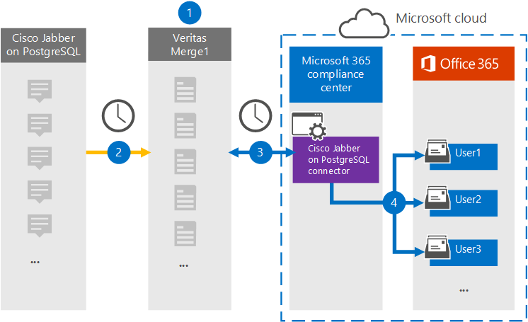

# PostgreSQL 데이터에 Cisco Jabber를 보관할 커넥터 설정(미리 보기)Set up a connector to archive Cisco Jabber on PostgreSQL data (preview)

Microsoft 365 규정 준수 센터의 Veritas 커넥터를 사용하여 Cisco Jabber 플랫폼에서 조직의 사용자 사서함으로 데이터를 Microsoft 365 보관합니다.Use a Veritas connector in the Microsoft 365 compliance center to import and archive data from the Cisco Jabber platform to user mailboxes in your Microsoft 365 organization. Veritas는 타사 데이터 원본에서 항목을 정기적으로 캡처하고 해당 항목을 다른 데이터 원본으로 가져오도록 구성된 [PostgreSQL 커넥터에 Cisco Jabber를](https://www.veritas.com/insights/merge1/jabber) Microsoft 365.Veritas provides a [Cisco Jabber on PostgreSQL](https://www.veritas.com/insights/merge1/jabber) connector that is configured to capture items from the third-party data source (on a regular basis) and import those items to Microsoft 365. 커넥터는 PostgreSQL의 Cisco Jabber에서 메시지, 채팅 및 공유 콘텐츠와 같은 콘텐츠를 전자 메일 메시지 형식으로 변환한 다음 해당 항목을 사서함의 사용자 사서함으로 Microsoft 365.The connector converts the content such as messages, chats, and shared content from Cisco Jabber on PostgreSQL to an email message format and then imports those items to the user's mailbox in Microsoft 365.

PostgreSQL 데이터의 Cisco Jabber가 사용자 사서함에 저장되고 나면 소송 보존, eDiscovery Microsoft 365 보존 정책 및 보존 레이블과 같은 Microsoft 365 준수 기능을 적용할 수 있습니다.After Cisco Jabber on PostgreSQL data is stored in user mailboxes, you can apply Microsoft 365 compliance features such as Litigation Hold, eDiscovery, retention policies and retention labels. PostgreSQL 커넥터의 Cisco Jabber를 사용하여 조직의 데이터를 가져오고 Microsoft 365 조직이 정부 및 규제 정책을 준수하는 데 도움이 될 수 있습니다.Using a Cisco Jabber on PostgreSQL connector to import and archive data in Microsoft 365 can help your organization stay compliant with government and regulatory policies.

## PostgreSQL 데이터에 대한 보관 Cisco Jabber 개요Overview of archiving Cisco Jabber on PostgreSQL data

다음 개요에서는 커넥터를 사용하여 해당 커넥터의 PostgreSQL 데이터에 Cisco Jabber를 보관하는 Microsoft 365.The following overview explains the process of using a connector to archive the Cisco Jabber on PostgreSQL data in Microsoft 365.

1. 조직은 PostgreSQL의 Cisco Jabber와 함께 PostgreSQL 사이트에서 Cisco Jabber를 설정하고 구성합니다.Your organization works with Cisco Jabber on PostgreSQL to set up and configure a Cisco Jabber on PostgreSQL site.

2. 24시간마다 PostgreSQL 항목의 Cisco Jabber가 Veritas Merge1 사이트에 복사됩니다.Once every 24 hours, Cisco Jabber on PostgreSQL items are copied to the Veritas Merge1 site. 또한 이 커넥터는 PostgreSQL 항목의 Cisco Jabber를 전자 메일 메시지 형식으로 변환합니다.The connector also converts Cisco Jabber on PostgreSQL items to an email message format.

3. Microsoft 365 준수 센터에서 만든 PostgreSQL 커넥터의 Cisco Jabber는 매일 Veritas Merge1 사이트에 연결하고, Microsoft 클라우드의 보안 Azure Storage 위치로 Jabber 콘텐츠를 전송합니다.The Cisco Jabber on PostgreSQL connector that you create in the Microsoft 365 compliance center, connects to the Veritas Merge1 site every day, and transfers the Jabber content to a secure Azure Storage location in the Microsoft cloud.

4. 커넥터는 3단계에 설명된 자동 사용자 매핑의 *Email* 속성 값을 사용하여 변환된 항목을 특정 사용자의 사서함으로 [가져올 수 있습니다.](#step-3-map-users-and-complete-the-connector-setup)The connector imports the converted items to the mailboxes of specific users using the value of the *Email* property of the automatic user mapping as described in [Step 3](#step-3-map-users-and-complete-the-connector-setup). **PostgreSQL의 받은 편지함 폴더에 있는 Cisco Jabber라는** 하위 폴더가 사용자 사서함에 만들어지며 항목이 해당 폴더로 가져오기됩니다.A subfolder in the Inbox folder named **Cisco Jabber on PostgreSQL** is created in the user mailboxes, and items are imported to that folder. 이 커넥터는 Email 속성 값을 사용하여 이 *기능을* 실행합니다.The connector does this by using the value of the *Email* property. 모든 Jabber 항목에는 항목의 모든 참가자의 전자 메일 주소로 채워지는 이 속성이 포함되어 있습니다.Every Jabber item contains this property, which is populated with the email address of every participant of the item.

## 시작하기 전에Before you begin

- Microsoft 커넥터에 대한 Merge1 계정을 생성합니다.Create a Merge1 account for Microsoft connectors. 이를 위해 [Veritas 고객 지원에 문의합니다.](https://www.veritas.com/content/support/en_US)To do this, contact [Veritas Customer Support](https://www.veritas.com/content/support/en_US). 1단계에서 커넥터를 만들 때 이 계정에 로그인해야 합니다.You need to sign into this account when you create the connector in Step 1.

- 1단계에서 PostgreSQL 커넥터에 Cisco Jabber를 만들고 3단계에서 완료하는 사용자는 2단계에서 사서함 가져오기 내보내기 역할에 할당해야 Exchange Online.The user who creates the Cisco Jabber on PostgreSQL connector in Step 1 (and completes it in Step 3) must be assigned to the Mailbox Import Export role in Exchange Online. 이 역할은 준수 센터의  데이터 커넥터 페이지에서 커넥터를 Microsoft 365 필요합니다.This role is required to add connectors on the **Data connectors** page in the Microsoft 365 compliance center. 기본적으로 이 역할은 역할 그룹의 역할 그룹에 할당되지 Exchange Online.By default, this role is not assigned to any role group in Exchange Online. 사서함 가져오기 내보내기 역할을 조직의 조직 관리 역할 그룹에 추가할 수 Exchange Online.You can add the Mailbox Import Export role to the Organization Management role group in Exchange Online. 또는 역할 그룹을 만들고 사서함 가져오기 내보내기 역할을 할당한 다음 해당 사용자를 구성원으로 추가할 수 있습니다.Or you can create a role group, assign the Mailbox Import Export role, and then add the appropriate users as members. 자세한 내용은 "역할  그룹에서  역할 그룹 관리" 문서의 역할 그룹 만들기 또는 역할 그룹 수정 섹션을 Exchange Online.For more information, see the [Create role groups](/Exchange/permissions-exo/role-groups#create-role-groups) or [Modify role groups](/Exchange/permissions-exo/role-groups#modify-role-groups) sections in the article "Manage role groups in Exchange Online".

## 1단계: PostgreSQL 커넥터에서 Cisco Jabber 설정Step 1: Set up the Cisco Jabber on PostgreSQL connector

첫 번째 단계는 Microsoft 365  센터의 데이터 커넥터 페이지에 액세스하고 Jabber 데이터에 대한 커넥터를 만드는 것입니다.The first step is to access to the **Data Connectors** page in the Microsoft 365 compliance center and create a connector for Jabber data.

1. 으로 <https://compliance.microsoft.com> 이동한  다음 &gt; **PostgreSQL에서 데이터 커넥터 Cisco Jabber를 클릭합니다.**Go to <https://compliance.microsoft.com> and then click **Data connectors** &gt; **Cisco Jabber on PostgreSQL**.

2. **PostgreSQL 제품 설명 페이지의 Cisco Jabber에서** 커넥터 **추가를 클릭합니다.**On the **Cisco Jabber on PostgreSQL** product description page, click **Add connector**.

3. 서비스 **약관 페이지에서** 동의를 **클릭합니다.**On the **Terms of service** page, click **Accept**.

4. 커넥터를 식별하는 고유한 이름을 입력하고 다음 을 **클릭합니다.**Enter a unique name that identifies the connector, and then click **Next**.

5. Merge1 계정에 로그인하여 커넥터를 구성합니다.Sign in to your Merge1 account to configure the connector.

## 2단계: Veritas Merge1 사이트에서 PostgreSQL에서 Cisco Jabber 구성Step 2: Configure the Cisco Jabber on PostgreSQL on the Veritas Merge1 site

두 번째 단계는 Veritas Merge1 사이트의 PostgreSQL 커넥터에서 Cisco Jabber를 구성하는 것입니다.The second step is to configure the Cisco Jabber on PostgreSQL connector on the Veritas Merge1 site. PostgreSQL 커넥터에서 Cisco Jabber를 구성하는 방법에 대한 자세한 내용은 [Merge1 Third-Party Connectors User Guide를 참조하십시오.](https://docs.ms.merge1.globanetportal.com/Merge1%20Third-Party%20Connectors%20Cisco%20Jabber%20on%20PostgreSQL%20User%20Guide.pdf)For information about how to configure the Cisco Jabber on PostgreSQL connector, see [Merge1 Third-Party Connectors User Guide](https://docs.ms.merge1.globanetportal.com/Merge1%20Third-Party%20Connectors%20Cisco%20Jabber%20on%20PostgreSQL%20User%20Guide.pdf).

저장 및 & **마친** 후  준수 센터의 커넥터 마법사에 Microsoft 365 페이지가 표시됩니다.After you click **Save & Finish**, the **User mapping** page in the connector wizard in the Microsoft 365 compliance center is displayed.

## 3단계: 사용자 매핑 및 커넥터 설정 완료Step 3: Map users and complete the connector setup

사용자를 매핑하고 Microsoft 365 준수 센터에서 커넥터 설정을 완료하려면 다음 단계를 수행합니다.To map users and complete the connector setup in the Microsoft 365 compliance center, follow these steps:

1. **PostgreSQL 사용자의 Cisco Jabber를** 사용자 Microsoft 365 자동 사용자 매핑을 사용하도록 설정하십시오.On the **Map Cisco Jabber on PostgreSQL users to Microsoft 365 users** page, enable automatic user mapping. PostgreSQL 항목의 Cisco Jabber에는 조직의 사용자에 대한 전자 메일 주소를 포함하는 *Email이라는* 속성이 포함됩니다.The Cisco Jabber on PostgreSQL items include a property called *Email*, which contains email addresses for users in your organization. 커넥터가 이 주소를 Microsoft 365 사용자 사서함으로 항목을 가져올 수 있습니다.If the connector can associate this address with a Microsoft 365 user, the items are imported to that user's mailbox.

2. **다음을** 클릭하고 설정을 검토한 다음  데이터 커넥터 페이지로 이동하여 새 커넥터의 가져오기 프로세스 진행률을 확인합니다.Click **Next**, review your settings, and then go to the **Data connectors** page to see the progress of the import process for the new connector.

## 4단계: PostgreSQL 커넥터에서 Cisco Jabber 모니터링Step 4: Monitor the Cisco Jabber on PostgreSQL connector

PostgreSQL 커넥터에서 Cisco Jabber를 만든 후 준수 센터에서 커넥터 상태를 Microsoft 365 있습니다.After you create the Cisco Jabber on PostgreSQL connector, you can view the connector status in the Microsoft 365 compliance center.

1. 으로 <https://compliance.microsoft.com/> 이동하여 왼쪽 **nav에서 데이터** 커넥터를 클릭합니다.Go to <https://compliance.microsoft.com/> and click **Data connectors** in the left nav.

2. 커넥터 **탭을** 클릭한 다음 **PostgreSQL 커넥터에서 Cisco Jabber를** 선택하여 커넥터에 대한 속성과 정보가 포함된 플라이아웃 페이지를 표시합니다.Click the **Connectors** tab and then select the **Cisco Jabber on PostgreSQL** connector to display the flyout page, which contains the properties and information about the connector.

3. 원본이 있는 커넥터 상태  **아래에서** 로그 다운로드 링크를 클릭하여 커넥터의 상태 로그를 열거나 저장합니다.Under **Connector status with source**, click the **Download log** link to open (or save) the status log for the connector. 이 로그에는 Microsoft 클라우드로 가져온 데이터가 포함되어 있습니다.This log contains data that has been imported to the Microsoft cloud.

## 알려진 문제Known issues

- 현재는 10MB보다 큰 첨부 파일 또는 항목 가져오기는 지원되지 않지만 나중에 더 큰 항목에 대한 지원을 사용할 수 있습니다.At this time, we don't support importing attachments or items larger than 10 MB but support for larger items will be available at a later date.
