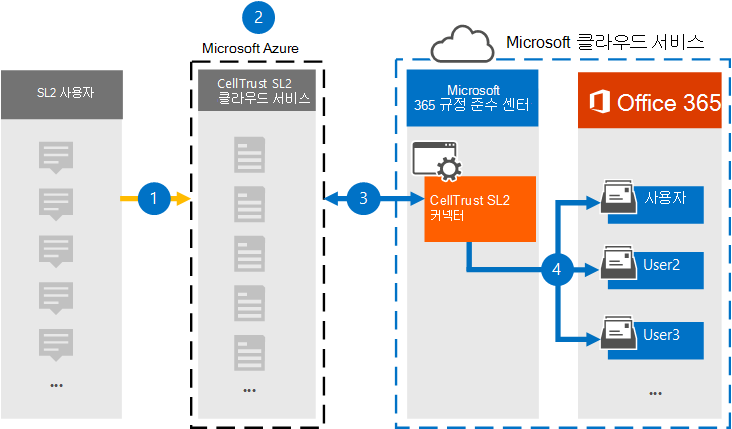

# CellTrust SL2의 데이터를 보관하여 Microsoft 365

CellTrust SL2는 모바일 통신 데이터를 캡처하고 주요 보관 기술과 통합하여 FINRA, HIPAA, FOIA 및 TCPA와 같은 규정에 대한 전자 검색 요구 사항을 충족합니다. SL2 데이터 커넥터는 모바일 통신 항목을 가져오고 Microsoft 365. 이 문서에서는 보관을 위해 CellTrust SL2 Microsoft 365 사용하여 SL2를 통합하는 프로세스에 대해 설명합니다. 이 프로세스를 완료하면 사용자가 CellTrust SL2 서비스를 구독하고 SL2 아키텍처에 익숙한 것으로 가정합니다. CellTrust SL2에 대한 자세한 내용은 <https://www.celltrust.com> 을 참조하세요.

데이터 원본의 사용자 사서함으로 데이터를 Microsoft 365 소송 보존, eDiscovery Microsoft 365 보존 정책 및 통신 준수와 같은 Microsoft 365 준수 기능을 적용할 수 있습니다. CellTrust SL2 Data Connector를 사용하여 조직에서 데이터를 가져오고 Microsoft 365 조직이 정부 및 규제 정책을 준수하는 데 도움이 될 수 있습니다.

## CellTrust SL2 Data Connector를 사용하여 보관 개요

CellTrust의 SL2 플랫폼은 여러 원본의 통신 데이터를 캡처합니다. SL2 데이터 원본은 P2P(일대일) 또는 A2P(응용 프로그램 대 개인)입니다. 이 문서에서 설명하는 프로세스는 P2P 데이터 원본에만 해당합니다. 모든 P2P 데이터 원본의 경우 공동 작업의 한 명 이상의 사용자가 SL2 서비스에 구독된 SL2 사용자입니다. 다음 개요에서는 이 섹션에서 CellTrust SL2 Data Connector를 사용하는 Microsoft 365.

1. SL2 사용자는 해당 서비스의 SL2 서비스와 데이터를 Microsoft Azure.

2. 조직에 CellTrust의 SL2 클라우드 서비스 환경에 SL2 도메인이 있습니다. 도메인에 US(조직 구성 단위)가 하나 이상 있을 수 있습니다. SL2 클라우드 서비스는 데이터를 Microsoft Azure 플랫폼의 높은 보안 영역으로 전송하여 데이터가 데이터 환경을 Microsoft Azure 않습니다. SL2 계획(Enterprise, SMB 또는 정부)에 따라 도메인이 전역 또는 Microsoft Azure 또는 Microsoft Azure 호스트됩니다.

3. CellTrust SL2 데이터 커넥터를 만든 후 도메인 및 OUS(SL2 계획에 관계 없이)는 데이터 전송을 Microsoft 365. 데이터 피드는 데이터 원본, US 또는 도메인 자체에 따라 보고를 지원하기 위해 구성됩니다. 따라서 조직에서는 모든 데이터 원본을 공급하기 위해 커넥터를 하나만 Microsoft 365.

4. 커넥터는 매핑된 각 사용자 아래에 **CellTrust SL2** 이라는 Office 365 라이선스가 있는 폴더를 만듭니다. 이 매핑은 전자 메일 주소를 사용하여 Office 365 사서함에 CellTrust SL2 사용자를 연결합니다. CellTrust SL2의 사용자 ID가 Office 365 일치하지 않는 경우 사용자의 데이터는 보관되지 않습니다.

## 커넥터를 설정하기 전에

- CellTrust SL2 클라우드 서비스 환경에 도메인이 있는지 확인 프로덕션 또는 평가판 SL2 도메인을 얻는 데 대한 자세한 내용은 [CellTrust에 문의하세요.](https://www.celltrust.com/contact-us/#form)

- SL2 도메인의 관리자 계정에 액세스하려면 자격 증명을 얻습니다.

- 1단계에서 CellTrust SL2 데이터 커넥터를 만들고 3단계에서 완료하는 사용자는 2단계에서 사서함 가져오기 내보내기 역할에 할당해야 Exchange Online. 이 역할은 서버의 데이터  커넥터 페이지에서 커넥터를 추가하는 Microsoft 365 규정 준수 센터. 기본적으로 이 역할은 역할 그룹의 역할 그룹에 할당되지 Exchange Online. 사서함 가져오기 내보내기 역할을 조직의 조직 관리 역할 그룹에 추가할 수 Exchange Online. 또는 역할 그룹을 만들고 사서함 가져오기 내보내기 역할을 할당한 다음 해당 사용자를 구성원으로 추가할 수 있습니다. 자세한 내용은 "역할  그룹에서  역할 그룹 관리" 문서의 역할 그룹 만들기 또는 역할 그룹 수정 섹션을 Exchange Online.

- 이 데이터 커넥터는 미국 GCC 클라우드의 Microsoft 365 사용할 수 있습니다. 타사 응용 프로그램 및 서비스는 Microsoft 365 인프라 외부에 있는 타사 시스템에서 조직의 고객 데이터를 저장, 전송 및 처리해야 할 수 있으므로 Microsoft 365 및 데이터 보호 약정의 적용을 Microsoft 365 수 있습니다. Microsoft는 타사 응용 프로그램에 연결하는 데 이 제품을 사용하는 것은 해당 타사 응용 프로그램이 FEDRAMP 규격임을 암시하는 표현을 사용하지 않습니다.

## 1단계: CellTrust SL2 커넥터 만들기

첫 번째 단계는 서버의 데이터 커넥터를 Microsoft 365 규정 준수 센터.

1. 으로 <https://compliance.microsoft.com> 이동하여 왼쪽 탐색 창에서 데이터 커넥터를 클릭합니다. 

2. 개요 **탭에서** 필터를 **클릭하고** **CellTrust로** 를 선택한 다음 필터를 적용합니다.

   

3. **CellTrust SL2(미리 보기)를 클릭합니다.**

4. **CellTrust SL2(미리 보기)** 제품 설명 페이지에서 커넥터 **추가를 클릭합니다.**

5. 서비스 **약관 페이지에서** 동의를 **클릭합니다.**

6. 커넥터를 식별하는 고유한 이름을 입력하고 다음 을 **클릭합니다.** 입력한 이름은 데이터 커넥터를  만든 후 데이터 커넥터 페이지에서 커넥터를 식별합니다.

7. **CellTrust 계정에 로그인 페이지에서 CellTrust에** **로그인을 클릭합니다.** 새 브라우저 창에서 검색할 수 **Microsoft 365 CellTrust 포털로** 리디렉션됩니다.

## 2단계: 보관할 도메인 또는 OUS 선택

다음 단계에서는 CellTrust SL2 도메인의 관리자 계정에 로그인하고 도메인 및 US를 선택하여 해당 도메인에 Microsoft 365.

1. CellTrust **Microsoft 365 커넥터** 페이지에서 SL2 클라우드 서비스에서 환경을 선택하여 로그인 페이지를 표시합니다.

   일반적으로 환경을 나타내는 하나의 옵션이 표시해야 합니다. 그러나 도메인이 두 개 이상의 환경에 있는 경우 각 환경에 대한 옵션이 표시됩니다. 선택한 후 SL2 로그인 페이지로 리디렉션됩니다.

2. 도메인 또는 OU 관리자 계정 자격 증명으로 로그인합니다.

   SL2 도메인 관리자로 로그인하면 해당 도메인의 도메인 및 OUS 이름이 표시됩니다. US가 없는 경우 도메인 이름만 표시됩니다. OU 관리자로 로그인하면 OU의 이름만 표시됩니다.

3. 보관할 사업부를 사용하도록 설정하십시오. 도메인을 선택하면 US가 자동으로 선택되지 않습니다. 각 OU를 개별적으로 사용하도록 설정하여 보관해야 합니다.

   

4. 선택을 마치면 브라우저 창을 닫고 브라우저의 마법사 페이지로 Microsoft 365 규정 준수 센터. 몇 초 후에 마법사가 자동으로 다음 매핑 단계로 진행됩니다.

## 3단계: 사용자 매핑 및 커넥터 설정 완료

마지막 단계는 사용자를 매핑하고 연결기에서 커넥터 설정을 Microsoft 365 규정 준수 센터.

1. 사용자 매핑 **페이지에서** 사용자에 대한 전자 메일 주소가 SL2 및 전자 메일 주소에서 동일한 경우 자동 사용자 매핑을 Microsoft 365.  그렇지 않으면 사용자의 SL2 주소를 해당 사용자의 SL2 주소에 매핑하는 CSV 파일을 업로드하여 수동으로 전자 메일 주소를 Microsoft 365 합니다.

2. **다음을** 클릭하고 설정을 검토한 다음 마친을 클릭하여 커넥터를 생성합니다. 

   새 커넥터가 데이터 커넥터 페이지의 목록에 **추가됩니다.**

## CellTrust에서 도움말을 얻게 됩니다.

[CellTrust](https://www.celltrust.com/contact-us/#support) SL2 데이터 커넥터 설정에 대한 자세한 내용은 CellTrust 고객 지원 페이지를 참조하세요.

## 추가 정보

- 도메인 관리자는 해당 도메인 또는 해당 도메인의 모든 US에 대한 커넥터를 설정할 수 있습니다. OU 관리자 계정을 사용하는 경우 해당 특정 OU에 대한 커넥터만 설정할 수 있습니다.

- 위의 단계를 성공적으로 완료하려면 Microsoft 365 E5 라이선스가 할당되어야 Microsoft Office 권한이 있어야 합니다.

- 새 커넥터를 테스트하기 위해 SL2 모바일 앱 또는 SL2 포털에서 문자 메시지를 전송합니다. 사서함으로 Microsoft 365 이동하고 받은 편지함에서 **CellTrust SL2** 폴더를 여는 방법을 확인합니다. 사서함에 문자 메시지가 표시될 때 몇 분 정도 걸릴 수 있습니다.

- 많은 법률 및 규정은 요청 시 증거로 생성될 수 있는 방식으로 전자 통신을 보존해야 합니다. eDiscovery(Electronic Discovery)는 전자 통신의 프로덕션을 준수하는 데 사용됩니다. Enterprise EIA(정보 보관) 솔루션은 eDiscovery를 수행하고 보존 정책 관리, 데이터 분류 및 콘텐츠 감독과 같은 기능을 제공하도록 디자인되었습니다. Microsoft 365 조직에 영향을 주는 규정 및 표준을 준수하기 위한 장기 보존 솔루션을 제공합니다.

- 이 문서에 *사용된 보관이라는* 용어는 EIA(정보 보관) 솔루션 내에서 사용되는 컨텍스트에서 보관을 Enterprise 참조합니다. EIA 솔루션에는 법적 소송, 소송, 감사 및 조사에 대한 문서를 생성하는 eDiscovery 기능이 있습니다. 재해 복구 및 비즈니스 연속성에 사용되는 백업 및 복원 컨텍스트에서 보관은 이 문서 내에서 용어를 의도적으로 사용하는 것이 아니며,
