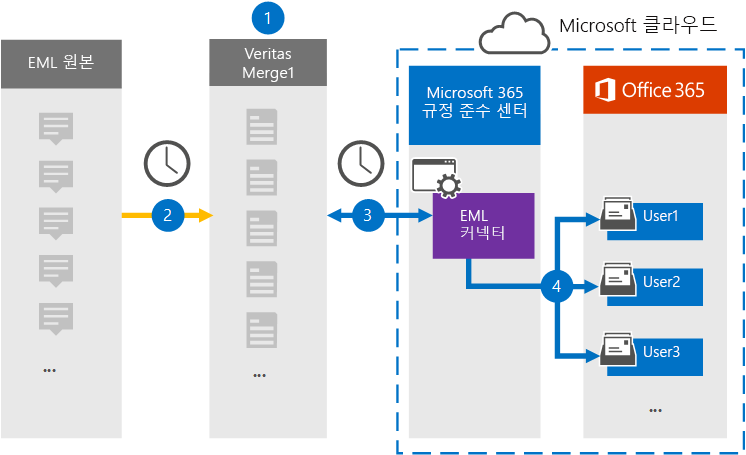

# EML 데이터를 보관 하는 연결선 설정 (미리 보기)Set up a connector to archive EML data (preview)

Microsoft 365 준수 센터의 Globanet 커넥터를 사용 하 여 Microsoft 365 조직의 사용자 사서함에 대 한 EML 데이터를 가져오고 보관 합니다.Use a Globanet connector in the Microsoft 365 compliance center to import and archive EML data to user mailboxes in your Microsoft 365 organization. EML는 파일에 저장 된 전자 메일 메시지의 파일 확장명입니다.EML is the file extension for an email message saved to a file. 커넥터는 항목의 콘텐츠를 원본 형식에서 전자 메일 메시지 형식으로 변환한 다음 해당 항목을 사용자 사서함으로 가져옵니다.The connector converts the content of an item from the source format to an email message format and then imports the item to a user mailbox.

EML 메시지가 사용자 사서함에 저장 되 면 소송 보존, eDiscovery, 보존 정책 및 보존 레이블과 통신 준수와 같은 Microsoft 365 준수 기능을 적용할 수 있습니다.After EML messages are stored in user mailboxes, you can apply Microsoft 365 compliance features such as Litigation Hold, eDiscovery, retention policies and retention labels, and communication compliance. EML 커넥터를 사용 하 여 Microsoft 365에서 데이터를 가져오고 보관 하면 조직이 정부 및 규정 정책을 준수 하는 데 도움이 될 수 있습니다.Using an EML connector to import and archive data in Microsoft 365 can help your organization stay compliant with government and regulatory policies.

## 보관 EML 데이터의 개요Overview of archiving EML data

다음 개요에서는 커넥터를 사용 하 여 Microsoft 365에서 EML 데이터를 보관 하는 프로세스에 대해 설명 합니다.The following overview explains the process of using a connector to archive EML data in Microsoft 365.

1. 조직은 EML 원본을 사용 하 여 EML 사이트를 설정 및 구성 합니다.Your organization works with the EML source to set up and configure an EML site.

2. 24 시간 마다, EML 원본의 콘텐츠 항목이 Globanet Merge1 사이트에 복사 됩니다.Once every 24 hours, content items from the EML source are copied to the Globanet Merge1 site. 이 프로세스 중에 EML 파일의 콘텐츠는 전자 메일 메시지 형식으로 변환 됩니다.During this process, the content of an EML file is converted to an email message format.

3. Microsoft 365 준수 센터에서 만드는 EML 커넥터는 매일 Globanet Merge1 site에 연결 하 고 메시지를 Microsoft 클라우드의 안전한 Azure Storage 위치로 전송 합니다.The EML connector that you create in the Microsoft 365 compliance center, connects to the Globanet Merge1 site every day and transfers the messages to a secure Azure Storage location in the Microsoft cloud.

4. 커넥터는 [3 단계](#step-3-map-users-and-complete-the-connector-setup)에서 설명 하는 자동 사용자 매핑 프로세스의 *전자 메일* 속성 값을 사용 하 여 변환 된 메시지 항목을 특정 사용자의 사서함으로 가져옵니다.The connector imports the converted message items to the mailboxes of specific users using the value of the *Email* property of the automatic user mapping process that's described in [Step 3](#step-3-map-users-and-complete-the-connector-setup). 이 프로세스 중에 **eml**라는 받은 편지함 폴더의 하위 폴더가 사용자 사서함에 만들어지고, eml 항목은 해당 폴더로 가져옵니다.During this process, a subfolder in the Inbox folder named **EML**is created in the user mailboxes, and the EML items are imported to that folder. 커넥터는 *Email* 속성 값을 사용 하 여이를 수행 합니다.The connector does this by using the value of the *Email* property. 모든 메시지에는이 속성이 있으며,이 속성은 콘텐츠 항목의 모든 참가자의 전자 메일 주소로 채워집니다.Every message contains this property, which is populated with the email address of every participant of the content item.

## 시작하기 전에Before you begin

- Globanet Merge1 계정을 만들려면 EML 커넥터에 대 한 사용 조건을 수락 합니다.Create a Globanet Merge1 account by accepting the terms and conditions for an EML connector. 이 작업을 수행 하려면 [Globanet 고객 지원](https://globanet.com/contact-us)에 문의 하세요.To do this, contact [Globanet Customer Support](https://globanet.com/contact-us). 1 단계에서 커넥터를 만들 때이 계정에 로그인 해야 합니다.You need to sign into this account when you create the connector in Step 1.

- 1 단계에서 EML 커넥터를 만든 후 3 단계에서 완료 하는 사용자는 Exchange Online의 사서함 가져오기 내보내기 역할에 할당 되어야 합니다.The user who creates the EML connector in Step 1 (and completes it in Step 3) must be assigned to the Mailbox Import Export role in Exchange Online. 이 역할은 Microsoft 365 준수 센터의 **데이터 커넥터** 페이지에 커넥터를 추가 하는 데 필요 합니다.This role is required to add connectors on the **Data connectors** page in the Microsoft 365 compliance center. 기본적으로이 역할은 Exchange Online의 어떠한 역할 그룹에도 할당 되지 않습니다.By default, this role is not assigned to any role group in Exchange Online. Exchange Online의 조직 관리 역할 그룹에 사서함 가져오기 내보내기 역할을 추가할 수 있습니다.You can add the Mailbox Import Export role to the Organization Management role group in Exchange Online. 또는 역할 그룹을 만들고 사서함 가져오기 내보내기 역할을 할당 한 다음 해당 사용자를 구성원으로 추가할 수 있습니다.Or you can create a role group, assign the Mailbox Import Export role, and then add the appropriate users as members. 자세한 내용은 "Exchange Online에서 역할 그룹 관리" 문서의 [역할 그룹 만들기](https://docs.microsoft.com/Exchange/permissions-exo/role-groups#create-role-groups) 또는 [역할 그룹 수정](https://docs.microsoft.com/Exchange/permissions-exo/role-groups#modify-role-groups) 섹션을 참조 하세요.For more information, see the [Create role groups](https://docs.microsoft.com/Exchange/permissions-exo/role-groups#create-role-groups) or [Modify role groups](https://docs.microsoft.com/Exchange/permissions-exo/role-groups#modify-role-groups) sections in the article "Manage role groups in Exchange Online".

## 1 단계: EML 연결선 설정Step 1: Set up an EML Connector

첫 번째 단계는 Microsoft 365 준수 센터의 **데이터 커넥터** 페이지에 액세스 하 여 EML 데이터에 대 한 커넥터를 만드는 것입니다.The first step is to access to the **Data Connectors** page in the Microsoft 365 compliance center and create a connector for EML data.

1. 로 이동한 [https://compliance.microsoft.com](https://compliance.microsoft.com/) 후 **데이터 커넥터**  >  **EML**를 클릭 합니다.Go to [https://compliance.microsoft.com](https://compliance.microsoft.com/) and then click **Data connectors** > **EML**.

2. **EML** 제품 설명 페이지에서 **커넥터 추가**를 클릭 합니다.On the **EML** product description page, click **Add connector**.

3. **서비스 약관** 페이지에서 **수락**을 클릭 합니다.On the **Terms of service** page, click **Accept**.

4. 커넥터를 식별 하는 고유한 이름을 입력 한 후 **다음**을 클릭 합니다.Enter a unique name that identifies the connector, and then click **Next**.

5. Merge1 계정에 로그인 하 여 커넥터를 구성 합니다.Sign in to your Merge1 account to configure the connector.

## 2 단계: Globanet Merge1 사이트에서 EML 커넥터 구성Step 2: Configure the EML connector on the Globanet Merge1 site

두 번째 단계는 Globanet Merge1 사이트에서 EML 커넥터를 구성 하는 것입니다.The second step is to configure the EML connector on the Globanet Merge1 site. EML 커넥터를 구성 하는 방법에 대 한 자세한 내용은 [Merge1 타사 커넥터 사용자 가이드](https://docs.ms.merge1.globanetportal.com/Merge1%20Third-Party%20Connectors%20EML%20User%20Guide%20.pdf)를 참조 하십시오.For information about configuring  the EML connector, see [Merge1 Third-Party Connectors User Guide](https://docs.ms.merge1.globanetportal.com/Merge1%20Third-Party%20Connectors%20EML%20User%20Guide%20.pdf).

**마침을 & 저장**을 클릭 하면 Microsoft 365 준수 센터로 돌아옵니다, 커넥터 마법사의 **사용자 매핑** 페이지에 표시 됩니다.After you click **Save & Finish**, you are returned to the Microsoft 365 compliance center, to the **User mapping** page of the connector wizard.

## 3 단계: 사용자 매핑 및 커넥터 설정 완료Step 3: Map users and complete the connector setup

사용자를 매핑하고 Microsoft 365 준수 센터에서 커넥터 설정을 완료 하려면 다음 단계를 수행 합니다.To map users and complete the connector setup in the Microsoft 365 compliance center, follow these steps:

1. **Microsoft 365 사용자에 게 외부 사용자 매핑** 페이지에서 자동 사용자 매핑을 사용 하도록 설정 합니다.On the **Map external users to Microsoft 365 users** page, enable automatic user mapping. EML 원본 항목에는 조직의 사용자에 대 한 전자 메일 주소를 포함 하는 *email*이라는 속성이 포함 되어 있습니다.The EML source items include a property called *Email*, which contains email addresses for users in your organization. 커넥터가이 주소를 Microsoft 365 사용자와 연결할 수 있으면 해당 사용자의 사서함으로 EML 항목을 가져옵니다.If the connector can associate this address with a Microsoft 365 user, the EML items are imported to that user’s mailbox.

2. **관리 승인** 페이지에서 **동의 제공** 단추를 클릭 합니다.On the **Admin Consent** page, click the **Provide Consent** button. Microsoft 사이트로 리디렉션됩니다.You will be redirected to the Microsoft site. **수락** 을 클릭 하 여 동의를 제공 합니다.Click **Accept** to provide the consent.

   조직에서는 Office 365 가져오기 서비스가 조직의 사서함 데이터에 액세스할 수 있도록 허용 해야 합니다.Your organization must consent to allow the Office 365 Import service to access mailbox data in your organization. 관리자의 동의를 제공 하려면 Microsoft 365 전역 관리자의 자격 증명을 사용 하 여 로그인 한 다음 승인 요청을 수락 해야 합니다.To provide admin consent, you must be signed in with the credentials of a Microsoft 365 global admin, and then accept the consent request. 전역 관리자로 로그인 하지 않은 경우 [이 페이지로](https://login.microsoftonline.com/common/oauth2/authorize?client_id=570d0bec-d001-4c4e-985e-3ab17fdc3073&response_type=code&redirect_uri=https://portal.azure.com/&nonce=1234&prompt=admin_consent) 이동 하 여 전역 관리자 자격 증명을 사용 하 여 로그인 하 고 요청을 수락할 수 있습니다.If you aren't signed in as a global admin, you can go to [this page](https://login.microsoftonline.com/common/oauth2/authorize?client_id=570d0bec-d001-4c4e-985e-3ab17fdc3073&response_type=code&redirect_uri=https://portal.azure.com/&nonce=1234&prompt=admin_consent) and sign in using global admin credentials to accept the request.

3. **다음**을 클릭 하 고 설정을 검토 한 다음 **데이터 커넥터** 페이지로 이동 하 여 새 커넥터에 대 한 가져오기 프로세스의 진행 상황을 확인 합니다.Click **Next**, review your settings, and then go to the **Data connectors** page to see the progress of the import process for the new connector.

## 4 단계: EML 커넥터 모니터링Step 4: Monitor the EML connector

EML 커넥터를 만든 후에는 Microsoft 365 준수 센터에서 커넥터 상태를 볼 수 있습니다.After you create the EML connector, you can view the connector status in the Microsoft 365 compliance center.

1. 으로 이동 하 여 [https://compliance.microsoft.com](https://compliance.microsoft.com) 왼쪽 탐색 창에서 **데이터 커넥터** 를 클릭 합니다.Go to [https://compliance.microsoft.com](https://compliance.microsoft.com) and click **Data connectors** in the left nav.

2. **커넥터 탭을** 클릭 한 다음 **EML** 연결선을 선택 하 여 커넥터에 대 한 속성 및 정보가 포함 된 플라이 아웃 페이지를 표시 합니다.Click the **Connectors** tab and then select the **EML** connector to display the flyout page, which contains the properties and information about the connector.

3. **커넥터 상태 (원본 포함**)에서 **로그 다운로드** 링크를 클릭 하 여 커넥터의 상태 로그를 열거나 저장 합니다.Under **Connector status with source**, click the **Download log** link to open (or save) the status log for the connector. 이 로그에는 Microsoft 클라우드로 가져온 데이터에 대 한 정보가 포함 되어 있습니다.This log contains information about the data that has been imported to the Microsoft cloud.

## 알려진 문제Known issues

- 이 경우에는 10mb 보다 큰 첨부 파일을 가져올 수 없지만 더 큰 항목에 대 한 지원은 나중에 제공 될 예정입니다.At this time, we don't support importing attachments larger than 10 MB but support for larger items will be available at a later date.
