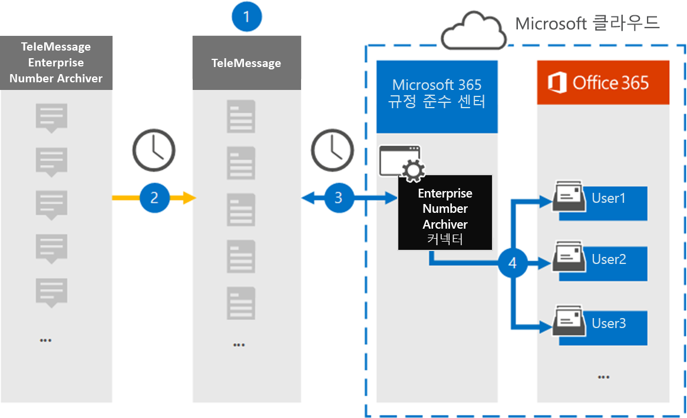

# 엔터프라이즈 번호 데이터를 보관할 커넥터 설정Set up a connector to archive Enterprise Number data

Microsoft 365 규정 준수 센터의 TeleMessage 커넥터를 사용하여 ENTERPRISE Number Archiver에서 SMS(Short Messaging Service) 및 MMS(Multimedia Messaging Service) 메시지, 채팅 메시지, 음성 통화 녹음 및 음성 통화 로그를 가져오고 보관합니다.Use a TeleMessage connector in the Microsoft 365 compliance center to import and archive Short Messaging Service (SMS) and Multimedia Messaging Service (MMS) messages, chat messages, voice call recordings, and voice call logs from the Enterprise Number Archiver. 커넥터를 설정하고 구성한 후 커넥터는 매일 한 번씩 조직의 TeleMessage 계정에 연결하고 TeleMessage Enterprise Number Archiver를 사용하여 직원의 모바일 통신 데이터를 Microsoft 365의 사서함으로 가져올 수 있습니다.After you set up and configure a connector, it connects to your organization's TeleMessage account once every day and imports the mobile communication data of employees using the TeleMessage Enterprise Number Archiver to mailboxes in Microsoft 365.

TeleMessage Enterprise Number Archiver 커넥터 데이터를 사용자 사서함에 저장한 후 소송 보존, 콘텐츠 검색, In-Place 보관, 감사, 통신 준수 및 Microsoft 365 보존 정책과 같은 Microsoft 365 규정 준수 기능을 엔터프라이즈 번호 보관 데이터에 적용할 수 있습니다.After the TeleMessage Enterprise Number Archiver connector data is stored in user mailboxes, you can apply Microsoft 365 compliance features such as Litigation Hold, Content Search, In-Place Archiving, Auditing, Communication compliance, and Microsoft 365 retention policies to Enterprise Number Archiver data. 예를 들어 콘텐츠 검색을 사용하여 TeleMessage Enterprise Number Archiver SMS, MMS 및 음성 통화를 검색하거나 Enterprise Number Archiver 커넥터 데이터가 포함된 사서함을 고급 eDiscovery 사례의 보호자와 연결할 수 있습니다.For example, you can search the TeleMessage Enterprise Number Archiver SMS, MMS, and Voice Call using Content Search or associate the mailbox that contains the Enterprise Number Archiver connector data with a custodian in an Advanced eDiscovery case. Enterprise Number Archiver 커넥터를 사용하여 Microsoft 365에서 데이터를 가져오고 보관하면 조직이 정부 및 규제 정책을 준수하는 데 도움이 될 수 있습니다.Using an Enterprise Number Archiver connector to import and archive data in Microsoft 365 can help your organization stay compliant with government and regulatory policies.

## 엔터프라이즈 번호 데이터 보관 개요Overview of archiving Enterprise Number data

다음 개요에서는 커넥터를 사용하여 Microsoft 365에서 엔터프라이즈 네트워크 데이터를 보관하는 프로세스에 대해 설명합니다.The following overview explains the process of using a connector to archive Enterprise Network data in Microsoft 365.

1. 조직은 TeleMessage와 함께 Enterprise Number Archiver 커넥터를 설치합니다.Your organization works with TeleMessage to set up an Enterprise Number Archiver connector. 자세한 내용은 여기를 [참조하세요.](https://www.telemessage.com/office365-activation-for-enterprise-number-archiver/)For more details refer to [here](https://www.telemessage.com/office365-activation-for-enterprise-number-archiver/).

2. Microsoft 365 규정 준수 센터에서 만든 Enterprise Number Archiver 커넥터는 매일 TeleMessage 사이트에 연결하고 이전 24시간의 전자 메일 메시지를 Microsoft 클라우드의 보안 Azure Storage 영역으로 전송합니다.The Enterprise Number Archiver connector that you create in the Microsoft 365 compliance center connects to the TeleMessage site every day and transfers the email messages from the previous 24 hours to a secure Azure Storage area in the Microsoft Cloud.

3. 커넥터는 모바일 통신 항목을 특정 사용자의 사서함으로 가져올 수 있습니다.The connector imports the mobile communication items to the mailbox of a specific user. Enterprise Number Archiver라는 새 폴더가 특정 사용자의 사서함에 만들어지며 항목을 해당 폴더로 가져올 수 있습니다.A new folder named Enterprise Number Archiver is created in the specific user's mailbox and the items are imported to it. 커넥터는 사용자의 전자 메일 주소 속성 값을 사용하여 *매핑합니다.*The connector does mapping by using the value of the *User’s Email address* property. 모든 전자 메일 메시지에는 전자 메일 메시지의 모든 참가자의 전자 메일 주소로 채워지는 이 속성이 포함되어 있습니다.Every email message contains this property, which is populated with the email address of every participant of the email message. 사용자의 전자 메일 주소 속성 값을  사용한 자동 사용자 매핑 외에도 CSV 매핑 파일을 업로드하여 사용자 지정 매핑을 정의할 수도 있습니다.In addition to automatic user mapping using the value of the *User’s Email address* property, you can also define a custom mapping by uploading a CSV mapping file. 이 매핑 파일에는 각 사용자의 휴대폰 번호와 해당 Microsoft 365 사서함 주소가 포함되어야 합니다.This mapping file should contain User’s mobile Number and the corresponding Microsoft 365 mailbox address for each user. 자동 사용자 매핑을 사용하도록 설정하고 사용자 지정 매핑을 제공하는 경우 커넥터가 모든 전자 메일 항목에 대해 먼저 사용자 지정 매핑 파일을 봐야 합니다.If you enable automatic user mapping and provide a custom mapping, for every email item the connector will first look at custom mapping file. 사용자의 휴대폰 번호에 해당하는 유효한 Microsoft 365 사용자를 찾지 못하면 커넥터가 전자 메일 항목의 사용자 전자 메일 주소 속성을 사용하게 됩니다.If it doesn't find a valid Microsoft 365 user that corresponds to a user's mobile number, the connector will use the User ‘s email address property of the email item. 커넥터가 전자 메일 항목의 사용자 지정 매핑 파일 또는 사용자의 전자  메일 주소 속성에서 유효한 Microsoft 365 사용자를 찾지 못하면 항목을 가져오지 않습니다.If the connector doesn't find a valid Microsoft 365 user in either the custom mapping file or the *user’s email address* property of the email item, the item won't be imported.

## 시작하기 전에Before you begin

Enterprise Number Archiver 데이터를 보관하는 데 필요한 구현 단계 중 일부는 Microsoft 365 외부에 있으며 준수 센터에서 커넥터를 만들기 전에 완료해야 합니다.Some of the implementation steps required to archive Enterprise Number Archiver data are external to Microsoft 365 and must be completed before you can create the connector in the compliance center.

- [TeleMessage에서 Enterprise Number Archiver](https://www.telemessage.com/mobile-archiver/order-mobile-archiver-for-o365) 서비스를 주문하고 조직에 대한 유효한 관리 계정을 얻습니다.Order the [Enterprise Number Archiver service from TeleMessage](https://www.telemessage.com/mobile-archiver/order-mobile-archiver-for-o365) and get a valid administration account for your organization. 준수 센터에서 커넥터를 만들 때 이 계정에 로그인해야 합니다.You'll need to sign into this account when you create the connector in the compliance center.

- TeleMessage 계정에 Enterprise Number SMS/MMS 네트워크 보관이 필요한 모든 사용자를 등록합니다.Register all users that require Enterprise Number SMS/MMS Network archiving in the TeleMessage account. 사용자를 등록할 때 Microsoft 365 계정에 사용되는 동일한 전자 메일 주소를 사용하세요.When registering users, be sure to use the same email address that's used for their Microsoft 365 account.

- 직원의 휴대폰에 TeleMessage Enterprise Number Archiver 앱을 설치하고 활성화합니다.Install and activate the TeleMessage Enterprise Number Archiver app on the mobile phones of your employees.

- Enterprise Number Archiver 커넥터를 만드는 사용자에게 Exchange Online에서 사서함 가져오기 내보내기 역할이 할당되어야 합니다.The user who creates a Enterprise Number Archiver connector must be assigned the Mailbox Import Export role in Exchange Online. 이는 Microsoft 365 규정 준수 센터의 **데이터** 커넥터 페이지에서 커넥터를 추가하는 데 필요합니다.This is required to add connectors in the **Data connectors** page in the Microsoft 365 compliance center. 기본적으로이 역할은 Exchange Online의 어떤 역할 그룹에도 할당되지 않습니다.By default, this role isn't assigned to any role group in Exchange Online. Exchange Online의 조직 관리 역할 그룹에 사서함 가져오기 내보내기 역할을 추가할 수 있습니다.You can add the Mailbox Import Export role to the Organization Management role group in Exchange Online. 또는 역할 그룹을 만들고 사서함 가져오기 내보내기 역할을 할당한 다음 해당 사용자를 구성원으로 추가할 수 있습니다.Or you can create a role group, assign the Mailbox Import Export role, and then add the appropriate users as members. 자세한 내용은 "Exchange  Online에서  역할 그룹 관리" 문서에서 역할 그룹 만들기 또는 역할 그룹 수정 섹션을 참조하십시오.For more information, see the [Create role groups](https://docs.microsoft.com/Exchange/permissions-exo/role-groups#create-role-groups) or [Modify role groups](https://docs.microsoft.com/Exchange/permissions-exo/role-groups#modify-role-groups) sections in the article "Manage role groups in Exchange Online".

## Enterprise Number Archiver 커넥터 만들기Create an Enterprise Number Archiver connector

이전 섹션에 설명된 선행 작업을 완료한 후 Microsoft 365 규정 준수 센터에서 Enterprise Number Archiver 커넥터를 만들 수 있습니다.After you've completed the prerequisites described in the previous section, you can create an Enterprise Number Archiver connector in the Microsoft 365 compliance center. 커넥터는 사용자가 제공한 정보를 사용하여 TeleMessage 사이트에 연결하고 SMS, MMS 및 음성 통화 메시지를 Microsoft 365의 해당 사용자 사서함 상자로 전송합니다.The connector uses the information you provide to connect to the TeleMessage site and transfer SMS, MMS, and voice call messages to the corresponding user mailbox boxes in Microsoft 365.

1. Go to [https://compliance.microsoft.com](https://compliance.microsoft.com/) and then click Data **connectors** \> **Enterprise Number Archiver.**Go to [https://compliance.microsoft.com](https://compliance.microsoft.com/) and then click **Data connectors** \> **Enterprise Number Archiver**.

2. Enterprise **Number Archiver** 제품 설명 페이지에서 커넥터 **추가를 클릭합니다.**On the **Enterprise Number Archiver** product description page, click **Add connector**

3. 서비스 약관 **페이지에서** 수락을 **클릭합니다.**On the **Terms of service** page, click **Accept**.

4. **TeleMessage** 로그인 페이지의 3단계 아래에서 다음 상자에 필요한 정보를 입력하고 다음을 **클릭합니다.**On the **Login to TeleMessage** page, under Step 3, enter the required information in the following boxes and then click **Next**.

   - **사용자 이름:** TeleMessage 사용자 이름입니다.**Username:** Your TeleMessage username.

   - **암호:** TeleMessage 암호입니다.**Password:** Your TeleMessage password.

5. 커넥터를 만든 후 팝업 창을 닫고 다음 페이지로 이동하면 됩니다.After the connector is created, you can close the pop-up window and go to the next page.

6. 사용자 매핑 **페이지에서** 자동 사용자 매핑을 사용하도록 설정합니다.On the **User mapping** page, enable automatic user mapping. 사용자 지정 매핑을 사용하도록 설정하려면 사용자 매핑 정보가 포함된 CSV 파일을 업로드하고 다음을 **클릭합니다.**To enable custom mapping, upload a CSV file that contains the user mapping information, and then click **Next**.

7. 설정을 검토한 다음 **마친을** 클릭하여 커넥터를 만드시다.Review your settings, and then click **Finish** to create the connector.

8. 데이터 커넥터 페이지의 커넥터  탭으로 이동하여 새 커넥터의 가져오기 프로세스 진행률을 확인하십시오.Go to the Connectors tab in **Data connectors** page to see the progress of the import process for the new connector.

## 알려진 문제Known issues

- 현재는 10MB보다 큰 첨부 파일 또는 항목 가져오기는 지원되지 않습니다.At this time, we don't support importing attachments or items that are larger than 10 MB. 더 큰 항목에 대한 지원은 나중에 사용할 수 있습니다.Support for larger items will be available at a later date.
