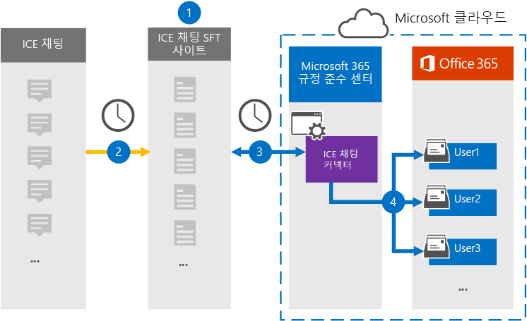
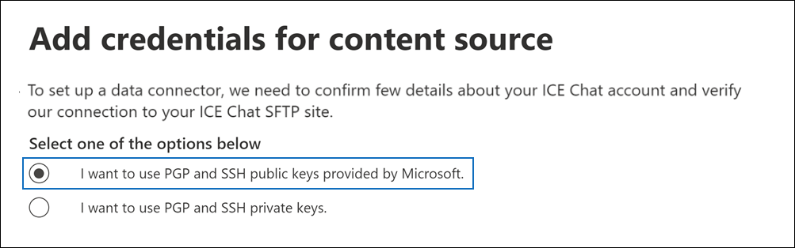
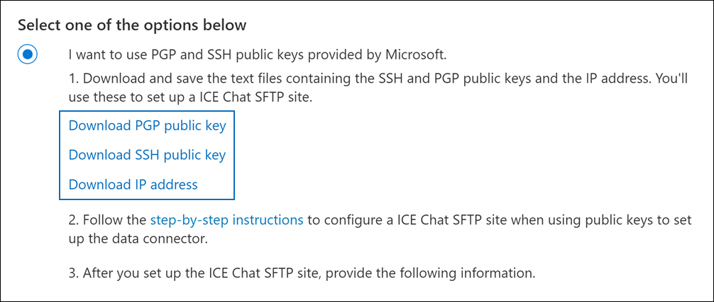

# ICE 채팅 데이터를 보관할 커넥터 설정

ICE 채팅 공동 작업 도구에서 Microsoft 365 규정 준수 센터 서비스 채팅 데이터를 가져오고 보관할 수 있는 기본 커넥터를 사용합니다. 커넥터를 설정 및 구성한 후 커넥터는 매일 한 번 조직의 ICE Chat SFTP(Secure FTP) 사이트에 연결하고 채팅 메시지의 콘텐츠를 전자 메일 메시지 형식으로 변환한 다음 해당 항목을 조직의 사서함으로 Microsoft 365.

ICE 채팅 데이터를 사용자 사서함에 저장한 후 소송 보존, eDiscovery Microsoft 365 보관, 감사, 통신 준수 및 보관 정책과 같은 Microsoft 365 준수 기능을 ICE 채팅 데이터에 적용할 수 있습니다. 예를 들어 콘텐츠 검색을 사용하여 ICE 채팅 메시지를 검색하거나 ICE 채팅 데이터가 포함된 사서함을 특정 사례의 Advanced eDiscovery 있습니다. ICE 채팅 커넥터를 사용하여 조직의 데이터를 가져오고 Microsoft 365 정책을 준수하는 데 도움이 될 수 있습니다.

## ICE 채팅 데이터 보관 개요

다음 개요에서는 커넥터를 사용하여 ICE 채팅 데이터를 커넥터에 보관하는 Microsoft 365.

1. 조직은 ICE 채팅과 함께 ICE 채팅 SFTP 사이트를 설정합니다. ICE 채팅을 통해 ICE 채팅을 구성하여 채팅 메시지를 ICE Chat SFTP 사이트로 복사할 수도 있습니다.

2. 24시간마다 ICE 채팅의 채팅 메시지가 ICE Chat SFTP 사이트에 복사됩니다.

3. MICROSOFT 365 규정 준수 센터 만든 ICE 채팅 커넥터는 매일 ICE Chat SFTP 사이트에 연결하고 지난 24시간 동안의 채팅 메시지를 Microsoft 클라우드의 보안 Azure Storage 전송합니다. 또한 커넥터는 채팅 내용을 전자 메일 메시지 형식으로 변환합니다.

4. 커넥터는 채팅 메시지 항목을 특정 사용자의 사서함으로 가져올 수 있습니다. **ICE Chat이라는** 새 폴더가 사용자 사서함에 만들어지며 채팅 메시지 항목을 해당 폴더로 가져올 수 있습니다. 이 커넥터는 *SenderEmail* 및 *RecipientEmail* 속성 값을 사용하여 실행합니다. 모든 채팅 메시지에는 보낸 사람 및 채팅 메시지의 모든 받는 사람/참가자의 전자 메일 주소로 채워지는 이러한 속성이 포함되어 있습니다.

   *SenderEmail* 및 *RecipientEmail* 속성 값을 사용하는 자동 사용자 매핑(즉, 커넥터가 채팅 메시지를 보낸 사람의 사서함 및 모든 받는 사람의 사서함으로 가져오기)뿐만 아니라 CSV 매핑 파일을 업로드하여 사용자 지정 사용자 매핑을 정의할 수도 있습니다. 이 매핑 파일에는  조직의 모든 사용자에 대한 ICE Microsoft 365 사서함 주소가 포함되어 있습니다. 자동 사용자 매핑을 사용하도록 설정하고 사용자 지정 매핑 파일을 제공하는 경우 커넥터가 모든 채팅 항목에 대해 먼저 사용자 지정 매핑 파일을 봐야 합니다. 사용자의 ICE Chat ImId에 해당하는 유효한 Microsoft 365 계정이 없는 경우 커넥터는 채팅 항목의 *SenderEmail* 및 *RecipientEmail* 속성을 사용하여 채팅 참가자의 사서함으로 항목을 가져올 수 있습니다. 커넥터가 사용자 지정 매핑 파일 또는 Microsoft 365 및 *RecipientEmail* 속성에서 유효한 사용자 지정  사용자를 찾지 못하면 항목을 가져오지 않습니다.

## 커넥터를 설정하기 전에

ICE 채팅 데이터를 보관하는 데 필요한 일부 구현 단계는 Microsoft 365 외부에 있으며 준수 센터에서 커넥터를 만들기 전에 완료해야 합니다.

- ICE 채팅은 고객에게 외부 규정 준수에 대한 요금을 부과합니다. 조직은 ICE 채팅 영업 그룹에 문의하여 논의하고 에서 얻을 수 있는 ICE 채팅 데이터 서비스 계약에 서명해야 [https://www.theice.com/publicdocs/agreements/ICE\_Data\_Services\_Agreement.pdf](https://www.theice.com/publicdocs/agreements/ICE\_Data\_Services\_Agreement.pdf) 합니다. 이 계약은 ICE 채팅과 조직 간에 있으며 Microsoft와는 관련이 없습니다. 2단계에서 ICE Chat SFTP 사이트를 설정한 후 ICE 채팅은 FTP 자격 증명을 조직에 직접 제공합니다. 그런 다음 3단계에서 커넥터를 설정할 때 해당 자격 증명을 Microsoft에 제공할 수 있습니다.

- 3단계에서 커넥터를 만들기 전에 ICE Chat SFTP 사이트를 설정해야 합니다. ICE 채팅을 사용하여 SFTP 사이트를 설정한 후 ICE 채팅의 데이터는 매일 SFTP 사이트에 업로드됩니다. 3단계에서 만든 커넥터는 이 SFTP 사이트에 연결하고 채팅 데이터를 Microsoft 365 전송합니다. 또한 SFTP는 전송 프로세스 중에 사서함으로 전송되는 ICE 채팅 데이터를 암호화합니다.

- ICE 채팅 커넥터를 설정하기 위해 PGP(Pretty Good Privacy) 및 SSH(보안 셸)에 키와 키 암호가 필요합니다. 이러한 키는 ICE Chat SFTP 사이트를 구성하는 데 사용하며, 커넥터가 ICE Chat SFTP 사이트에 연결하여 이 사이트로 데이터를 가져오는 데 Microsoft 365. PGP 키는 ICE Chat SFTP 사이트에서 사이트로 전송되는 데이터의 암호화를 구성하는 Microsoft 365. SSH 키는 커넥터가 ICE Chat SFTP 사이트에 연결할 때 보안 원격 로그인을 사용하도록 보안 셸을 구성하는 데 사용됩니다.

  커넥터를 설정할 때 Microsoft에서 제공하는 공개 키와 키 암호 또는 개인 키와 암호(passphrases)를 사용할 수 있습니다. Microsoft에서 제공하는 공개 키를 사용하는 것이 좋습니다. 그러나 조직에서 개인 키를 사용하여 이미 ICE Chat SFTP 사이트를 구성한 경우 동일한 개인 키를 사용하여 커넥터를 만들 수 있습니다.

- ICE 채팅 커넥터는 하루 총 200,000개 항목을 가져올 수 있습니다. SFTP 사이트에 200,000개가 넘는 항목이 있는 경우 해당 항목을 가져오지 Microsoft 365.

- 3단계에서 ICE 채팅 커넥터를 만들고 1단계에서 공개 키 및 IP 주소를 다운로드하는 관리자에게는 3단계에서 사서함 가져오기 내보내기 역할을 할당해야 Exchange Online. 이 역할은 서버의 데이터  커넥터 페이지에서 커넥터를 추가하는 Microsoft 365 규정 준수 센터. 기본적으로이 역할은 Exchange Online의 어떤 역할 그룹에도 할당되지 않습니다. 사서함 가져오기 내보내기 역할을 조직의 조직 관리 역할 그룹에 추가할 수 Exchange Online. 또는 역할 그룹을 만들고 사서함 가져오기 내보내기 역할을 할당한 다음 해당 사용자를 구성원으로 추가할 수 있습니다. 자세한 내용은 "역할  그룹에서  역할 그룹 관리" 문서의 역할 그룹 만들기 또는 역할 그룹 수정 섹션을 Exchange Online.

## 공개 키를 사용하여 커넥터 설정

이 섹션의 단계에서는 PGP(Pretty Good Privacy) 및 SSH(보안 셸)에 대한 공개 키를 사용하여 ICE 채팅 커넥터를 설정하는 방법을 설명합니다.

### 1단계: PGP 및 SSH 공개 키 얻기

첫 번째 단계는 PGP(Pretty Good Privacy) 및 SSH(보안 셸)에 대한 공개 키의 복사본을 얻는 것입니다. 2단계의 이러한 키를 사용하여 커넥터(3단계에서 만든 커넥터)가 SFTP 사이트에 연결하고 ICE 채팅 데이터를 모든 사서함으로 전송할 수 있도록 ICE Chat SFTP Microsoft 365 구성합니다. 이 단계에서는 ICE Chat SFTP 사이트를 구성할 때 사용하는 IP 주소도 얻게 됩니다.

1. 으로 [https://compliance.microsoft.com](https://compliance.microsoft.com) 이동하여 왼쪽 **nav에서 데이터** 커넥터를 클릭합니다.

2. ICE **채팅 아래의 데이터 커넥터** **페이지에서** 보기를 **클릭합니다.**

3. ICE 채팅 **페이지에서** 커넥터 **추가를 클릭합니다.**

4. 서비스 **약관 페이지에서** 동의를 **클릭합니다.**

5. 콘텐츠 **원본에 대한** 자격 증명 추가 페이지에서 Microsoft에서 제공하는 PGP 및 SSH 공개 키를 **사용하려는 경우를 클릭합니다.**

   

6. 1단계에서 **SSH** 키 다운로드, **PGP** 키 다운로드 및 **IP** 주소 링크 다운로드를 클릭하여 각 파일의 복사본을 로컬 컴퓨터에 저장합니다.

   

   이러한 파일에는 2단계에서 ICE Chat SFTP 사이트를 구성하는 데 사용되는 다음 항목이 포함되어 있습니다.

   - PGP 공개 키: 이 키는 ICE Chat SFTP 사이트에서 다음 사이트로 전송되는 데이터의 암호화를 구성하는 Microsoft 365.

   - SSH 공개 키: 이 키는 커넥터가 ICE Chat SFTP 사이트에 연결할 때 보안 원격 로그인을 사용하도록 보안 SSH를 구성하는 데 사용됩니다.

   - IP 주소: ICE Chat SFTP 사이트는 3단계에서 만든 ICE 채팅 커넥터에서 사용하는 이 IP 주소의 연결 요청만 수락하도록 구성됩니다.

7. 취소를 **클릭하여** 마법사를 닫습니다. 3단계에서 이 마법사로 돌아와서 커넥터를 만들 수 있습니다.

### 2단계: ICE 채팅 SFTP 사이트 구성

다음 단계는 1단계에서 획득한 PGP 및 SSH 공개 키와 IP 주소를 사용하여 ICE Chat SFTP 사이트에 대해 PGP 암호화 및 SSH 인증을 구성하는 것입니다. 이렇게 하면 3단계에서 만든 ICE 채팅 커넥터가 ICE Chat SFTP 사이트에 연결하고 ICE 채팅 데이터를 MICROSOFT 365. ICE Chat SFTP 사이트를 설정하려면 ICE 채팅 고객 지원과 함께 작업해야 합니다.

### 3단계: ICE 채팅 커넥터 만들기

마지막 단계는 2단계에서 ICE 채팅 커넥터를 Microsoft 365 규정 준수 센터. 커넥터는 제공한 정보를 사용하여 ICE Chat SFTP 사이트에 연결하고 채팅 메시지를 사용자의 해당 사용자 사서함 상자로 Microsoft 365.

1. 으로 [https://compliance.microsoft.com](https://compliance.microsoft.com) 이동하여 왼쪽 **nav에서 데이터** 커넥터를 클릭합니다.

2. ICE **채팅 아래의 데이터 커넥터** **페이지에서** 보기를 **클릭합니다.**

3. ICE 채팅 **페이지에서** 커넥터 **추가를 클릭합니다.**

4. 서비스 **약관 페이지에서** 동의를 **클릭합니다.**

5. 콘텐츠 **원본에 대한 자격** 증명 추가 페이지에서 **PGP** 및 SSH 공개 키 사용 을 클릭합니다.

6. 3단계 아래에서 다음 상자에 필요한 정보를 입력한 다음 연결 유효성 **검사를 클릭합니다.**

   - **회사 코드:** 조직의 ID로, ICE Chat SFTP 사이트의 사용자 이름으로 사용됩니다.

   - **암호:** ICE Chat SFTP 사이트의 암호입니다.

   - **SFTP URL:** ICE 채팅 SFTP 사이트의 URL(예: `sftp.theice.com` ). 이 값에 IP 주소를 사용할 수도 있습니다.

   - **SFTP 포트:** ICE Chat SFTP 사이트의 포트 번호입니다. 커넥터는 이 포트를 사용하여 SFTP 사이트에 연결합니다.

7. 연결의 유효성이 검사된 후 다음 을 **클릭합니다.**

8. 외부 사용자를 사용자 **Microsoft 365** 매핑 페이지에서 자동 사용자 매핑을 사용하도록 설정하고 필요한 경우 사용자 지정 사용자 매핑을 제공합니다. 이 페이지에서 사용자 매핑 CSV 파일의 복사본을 다운로드할 수 있습니다. 파일에 사용자 매핑을 추가한 다음 업로드할 수 있습니다.

   > [!NOTE]
   > 앞서 설명한 것 처럼 사용자 지정 매핑 파일 CSV 파일에는 ICE Chat imid 및 각 사용자에 대한 Microsoft 365 사서함 주소가 포함되어 있습니다. 자동 사용자 매핑을 사용하도록 설정하고 사용자 지정 매핑을 제공하는 경우 모든 채팅 항목에 대해 커넥터가 먼저 사용자 지정 매핑 파일을 봐야 합니다. 사용자의 ICE 채팅 imid에 해당하는 유효한 Microsoft 365 사용자를 찾지 못하면 커넥터는 채팅 항목의 *SenderEmail* 및 *RecipientEmail* 속성에 지정된 사용자의 사서함으로 항목을 가져오게 됩니다. 커넥터가 자동 또는 사용자 지정 사용자 Microsoft 365 사용하여 유효한 사용자 지정 사용자를 찾지 못하면 항목을 가져오지 않습니다.

9. **다음을** 클릭하고 설정을 검토한 다음 마친을 클릭하여 커넥터를 생성합니다. 

10. 데이터 커넥터 **페이지로 이동하여** 새 커넥터의 가져오기 프로세스 진행률을 확인하십시오.

## 개인 키를 사용하여 커넥터 설정

이 섹션의 단계에서는 PGP 및 SSH 개인 키를 사용하여 ICE 채팅 커넥터를 설정하는 방법을 설명합니다. 이 커넥터 설정 옵션은 개인 키를 사용하여 이미 ICE Chat SFTP 사이트를 구성한 조직을 위한 것입니다.

### 1단계: ICE Chat SFTP 사이트를 구성하기 위해 IP 주소 얻기

조직에서 PGP 및 SSH 개인 키를 사용하여 ICE Chat SFTP 사이트를 설정한 경우 IP 주소를 얻어 ICE Chat 고객 지원에 제공해야 합니다. ICE Chat SFTP 사이트는 이 IP 주소의 연결 요청을 수락하도록 구성해야 합니다. ICE 채팅 커넥터에서 동일한 IP 주소를 사용하여 SFTP 사이트에 연결하고 ICE 채팅 데이터를 SFTP 사이트로 Microsoft 365.

IP 주소를 구하는 방법:

1. 으로 <https://compliance.microsoft.com> 이동하여 왼쪽 **nav에서 데이터** 커넥터를 클릭합니다.

2. ICE **채팅 아래의 데이터 커넥터** **페이지에서** 보기를 **클릭합니다.**

3. ICE **채팅 제품** 설명 페이지에서 커넥터 **추가를 클릭합니다.**

4. 서비스 **약관 페이지에서** 동의를 **클릭합니다.**

5. 콘텐츠 **원본에 대한** 자격 증명 추가 페이지에서 PGP 및 SSH 개인 키를 사용하려는 **을 클릭합니다.**

   

6. 1단계에서 IP 주소 다운로드를 클릭하여 **IP** 주소 파일의 복사본을 로컬 컴퓨터에 저장합니다.

   

7. 취소를 **클릭하여** 마법사를 닫습니다. 2단계에서 이 마법사로 돌아와 커넥터를 만들면 됩니다.

이 IP 주소의 연결 요청을 수락하도록 ICE Chat SFTP 사이트를 구성하려면 ICE 채팅 고객 지원과 함께 작업해야 합니다.

### 2단계: ICE 채팅 커넥터 만들기

ICE Chat SFTP 사이트를 구성한 후 다음 단계는 2단계에서 ICE 채팅 커넥터를 Microsoft 365 규정 준수 센터. 커넥터는 제공한 정보를 사용하여 ICE Chat SFTP 사이트에 연결하고 전자 메일 메시지를 사용자의 해당 사용자 사서함 상자로 Microsoft 365. 이 단계를 완료하기 위해 ICE Chat SFTP 사이트를 설정하는 데 사용한 동일한 개인 키 및 키 암호의 복사본이 있는지 확인해야 합니다.

1. 으로 <https://compliance.microsoft.com> 이동하여 왼쪽 **nav에서 데이터** 커넥터를 클릭합니다.

2. ICE **채팅 아래의 데이터 커넥터** **페이지에서** 보기를 **클릭합니다.**

3. ICE **채팅 제품** 설명 페이지에서 커넥터 **추가를 클릭합니다.**

4. 서비스 **약관 페이지에서** 동의를 **클릭합니다.**

5. 콘텐츠 **원본에 대한** 자격 증명 추가 페이지에서 PGP 및 SSH 개인 키를 사용하려는 **을 클릭합니다.**

6. 3단계 아래에서 다음 상자에 필요한 정보를 입력한 다음 연결 유효성 **검사를 클릭합니다.**

      - **이름:** 커넥터의 이름입니다. 조직에서 고유해야 합니다.

      - **회사 코드:** ICE Chat SFTP 사이트의 사용자 이름으로 사용되는 조직의 ID입니다.

      - **암호:** 조직의 ICE Chat SFTP 사이트의 암호입니다.

      - **SFTP URL:** ICE 채팅 SFTP 사이트의 URL(예: `sftp.theice.com` ). 이 값에 IP 주소를 사용할 수도 있습니다.

      - **SFTP 포트:** ICE Chat SFTP 사이트의 포트 번호입니다. 커넥터는 이 포트를 사용하여 SFTP 사이트에 연결합니다.

      - **PGP 개인 키:** ICE Chat SFTP 사이트의 PGP 개인 키입니다. 키 블록의 시작 및 끝 줄을 포함하여 전체 개인 키 값을 포함해야 합니다.

      - **PGP 키 암호:** PGP 개인 키의 암호입니다.

      - **SSH 개인 키:** ICE Chat SFTP 사이트의 SSH 개인 키입니다. 키 블록의 시작 및 끝 줄을 포함하여 전체 개인 키 값을 포함해야 합니다.

      - **SSH 키 암호:** SSH 개인 키의 암호입니다.

7. 연결의 유효성이 검사된 후 다음 을 **클릭합니다.**

8. ICE **채팅 사용자를** 사용자 Microsoft 365 매핑 페이지에서 자동 사용자 매핑을 사용하도록 설정하고 필요한 경우 사용자 지정 사용자 매핑을 제공합니다.

   > [!NOTE]
   > 앞서 설명한 것 처럼 사용자 지정 매핑 파일 CSV 파일에는 ICE Chat imid 및 각 사용자에 대한 Microsoft 365 사서함 주소가 포함되어 있습니다. 자동 사용자 매핑을 사용하도록 설정하고 사용자 지정 매핑을 제공하는 경우 모든 채팅 항목에 대해 커넥터가 먼저 사용자 지정 매핑 파일을 봐야 합니다. 사용자의 ICE 채팅 imid에 해당하는 유효한 Microsoft 365 사용자를 찾지 못하면 커넥터는 채팅 항목의 *SenderEmail* 및 *RecipientEmail* 속성에 지정된 사용자의 사서함으로 항목을 가져오게 됩니다. 커넥터가 자동 또는 사용자 지정 사용자 Microsoft 365 사용하여 유효한 사용자 지정 사용자를 찾지 못하면 항목을 가져오지 않습니다.

9. **다음을** 클릭하고 설정을 검토한 다음 마친을 클릭하여 커넥터를 생성합니다. 

10. 데이터 커넥터 **페이지로 이동하여** 새 커넥터의 가져오기 프로세스 진행률을 확인하십시오. 커넥터에 대한 정보가 포함된 플라이아웃 페이지를 표시하려면 커넥터를 클릭합니다.
