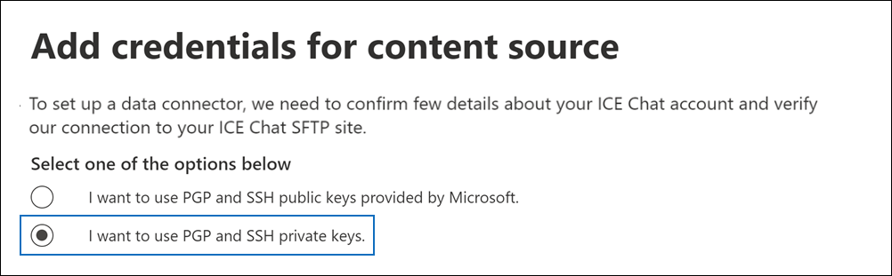

# ICE 채팅 데이터를 보관할 커넥터 설정Set up a connector to archive ICE Chat data

Microsoft 365 규정 준수 센터의 기본 커넥터를 사용하여 ICE 채팅 공동 작업 도구에서 금융 서비스 채팅 데이터를 가져오고 보관합니다.Use a native connector in the Microsoft 365 compliance center to import and archive financial services chat data from the ICE Chat collaboration tool. 커넥터를 설정하고 구성한 후 커넥터는 매일 한 번 조직의 ICE Chat SFTP(Secure FTP) 사이트에 연결하고 채팅 메시지의 콘텐츠를 전자 메일 메시지 형식으로 변환한 다음 Microsoft 365의 사서함으로 해당 항목을 가져와야 합니다.After you set up and configure a connector, it connects to your organization's ICE Chat secure FTP (SFTP) site once every day, converts the content of chat messages to an email message format, and then import those items to mailboxes in Microsoft 365.

ICE 채팅 데이터를 사용자 사서함에 저장한 후 소송 보존, eDiscovery, 보관, 감사, 통신 준수 및 Microsoft 365 보존 정책과 같은 Microsoft 365 규정 준수 기능을 ICE 채팅 데이터에 적용할 수 있습니다.After ICE chat data is stored in user mailboxes, you can apply Microsoft 365 compliance features such as litigation hold, eDiscovery, archiving, auditing, communication compliance, and Microsoft 365 retention policies to ICE Chat data. 예를 들어 콘텐츠 검색을 사용하여 ICE 채팅 메시지를 검색하거나 ICE 채팅 데이터가 포함된 사서함을 고급 eDiscovery 사례의 보호자와 연결할 수 있습니다.For example, you can search ICE Chat messages using content search or associate the mailbox that contains the ICE Chat data with a custodian in an Advanced eDiscovery case. ICE 채팅 커넥터를 사용하여 Microsoft 365에서 데이터를 가져오고 보관하면 조직이 정부 및 규제 정책을 준수하는 데 도움이 될 수 있습니다.Using an ICE Chat connector to import and archive data in Microsoft 365 can help your organization stay compliant with government and regulatory policies.

## ICE 채팅 데이터 보관 개요Overview of archiving ICE Chat data

다음 개요에서는 커넥터를 사용하여 Microsoft 365에서 ICE 채팅 데이터를 보관하는 프로세스에 대해 설명합니다.The following overview explains the process of using a connector to archive ICE chat data in Microsoft 365.

1. 조직은 ICE 채팅과 함께 ICE 채팅 SFTP 사이트를 설정합니다.Your organization works with ICE Chat to set up an ICE Chat SFTP site. ICE 채팅을 통해 ICE 채팅을 구성하여 채팅 메시지를 ICE Chat SFTP 사이트로 복사할 수도 있습니다.You'll also work with ICE Chat to configure ICE Chat to copy chat messages to your ICE Chat SFTP site.

2. 24시간마다 ICE 채팅의 채팅 메시지가 ICE Chat SFTP 사이트에 복사됩니다.Once every 24 hours, chat messages from ICE Chat are copied to your ICE Chat SFTP site.

3. Microsoft 365 규정 준수 센터에서 만든 ICE 채팅 커넥터는 매일 ICE Chat SFTP 사이트에 연결하고 지난 24시간 동안의 채팅 메시지를 Microsoft 클라우드의 보안 Azure Storage 위치로 전송합니다.The ICE Chat connector that you create in the Microsoft 365 compliance center connects to the ICE Chat SFTP site every day and transfers the chat messages from the previous 24 hours to a secure Azure Storage location in the Microsoft Cloud. 또한 커넥터는 채팅 내용을 전자 메일 메시지 형식으로 변환합니다.The connector also converts the content of a chat massage to an email message format.

4. 커넥터는 채팅 메시지 항목을 특정 사용자의 사서함으로 가져올 수 있습니다.The connector imports chat message items to the mailboxes of specific users. **ICE Chat이라는** 새 폴더가 사용자 사서함에 만들어지며 채팅 메시지 항목을 해당 폴더로 가져올 수 있습니다.A new folder named **ICE Chat** is created in the user mailboxes and the chat message items are imported to that folder. 이 커넥터는 *SenderEmail* 및 *RecipientEmail* 속성 값을 사용하여 실행합니다.The connector does by using the value of the *SenderEmail* and *RecipientEmail* properties. 모든 채팅 메시지에는 보낸 사람 및 채팅 메시지의 모든 받는 사람/참가자의 전자 메일 주소로 채워지는 이러한 속성이 포함되어 있습니다.Every chat message contains these properties, which are populated with email address of the sender and every recipient/participant of the chat message.

   *SenderEmail* 및 *RecipientEmail* 속성 값을 사용하는 자동 사용자 매핑(즉, 커넥터가 채팅 메시지를 보낸 사람의 사서함 및 모든 받는 사람의 사서함으로 가져오기)뿐만 아니라 CSV 매핑 파일을 업로드하여 사용자 지정 사용자 매핑을 정의할 수도 있습니다.In addition to automatic user mapping that uses the values of the *SenderEmail* and *RecipientEmail* property (which means that the connector imports a chat message to the sender's mailbox and the mailboxes of every recipient), you can also define custom user mapping by uploading a CSV mapping file. 이 매핑 파일에는 조직의 모든 사용자에 대한 ICE Chat *ImId* 및 해당 Microsoft 365 사서함 주소가 포함되어 있습니다.This mapping file contains the ICE Chat *ImId* and the corresponding Microsoft 365 mailbox address for every user in your organization. 자동 사용자 매핑을 사용하도록 설정하고 사용자 지정 매핑 파일을 제공하는 경우 커넥터가 모든 채팅 항목에 대해 먼저 사용자 지정 매핑 파일을 봐야 합니다.If you enable automatic user mapping and provide a custom-mapping file, for every chat item the connector will first look at the custom-mapping file. 사용자의 ICE Chat ImId에 해당하는 유효한 Microsoft 365 사용자 계정을 찾지 못하면 커넥터가 채팅 항목의 *SenderEmail* 및 *RecipientEmail* 속성을 사용하여 채팅 참가자의 사서함으로 항목을 가져올 수 있습니다.If it doesn't find a valid Microsoft 365 user account that corresponds to a user's ICE Chat ImId, the connector will use the *SenderEmail* and *RecipientEmail* properties of the chat item to import the item to the mailboxes of the chat participants. 커넥터가 사용자 지정 매핑 파일 또는 *SenderEmail* 및 *RecipientEmail* 속성에서 유효한 Microsoft 365 사용자를 찾지 못하면 항목을 가져오지 않습니다.If the connector doesn't find a valid Microsoft 365 user in either the custom-mapping file or the *SenderEmail* and *RecipientEmail* properties, the item won't be imported.

## 커넥터를 설정하기 전에Before you set up a connector

ICE 채팅 데이터를 보관하는 데 필요한 구현 단계 중 일부는 Microsoft 365 외부에 있으며 준수 센터에서 커넥터를 만들기 전에 완료해야 합니다.Some of the implementation steps required to archive ICE Chat data are external to Microsoft 365 and must be completed before you can create the connector in the compliance center.

- ICE 채팅은 고객에게 외부 규정 준수에 대한 요금을 부과합니다.ICE Chat charges their customers a fee for external compliance. 조직은 ICE 채팅 영업 그룹에 문의하여 논의하고 에서 얻을 수 있는 ICE 채팅 데이터 서비스 계약에 서명해야 [https://www.theice.com/publicdocs/agreements/ICE\_Data\_Services\_Agreement.pdf](https://www.theice.com/publicdocs/agreements/ICE\_Data\_Services\_Agreement.pdf) 합니다.Your organization should contact the ICE Chat sales group to discuss, and to sign the ICE Chat data services agreement, which you can obtain at [https://www.theice.com/publicdocs/agreements/ICE\_Data\_Services\_Agreement.pdf](https://www.theice.com/publicdocs/agreements/ICE\_Data\_Services\_Agreement.pdf). 이 계약은 ICE 채팅과 조직 간에 있으며 Microsoft와는 관련이 없습니다.This agreement is between ICE Chat and your organization and does not involve Microsoft. 2단계에서 ICE Chat SFTP 사이트를 설정한 후 ICE 채팅은 FTP 자격 증명을 조직에 직접 제공합니다.After you set up an ICE Chat SFTP site in Step 2, ICE Chat provides the FTP credentials directly to your organization. 그런 다음 3단계에서 커넥터를 설정할 때 해당 자격 증명을 Microsoft에 제공할 수 있습니다.Then you who would provide those credentials to Microsoft when setting up the connector in Step 3.

- 3단계에서 커넥터를 만들기 전에 ICE Chat SFTP 사이트를 설정해야 합니다.You must set up an ICE Chat SFTP site before creating the connector in Step 3. ICE 채팅을 사용하여 SFTP 사이트를 설정한 후 ICE 채팅의 데이터는 매일 SFTP 사이트에 업로드됩니다.After working with ICE Chat to set up the SFTP site, data from ICE Chat is uploaded to the SFTP site every day. 3단계에서 만든 커넥터는 이 SFTP 사이트에 연결하고 채팅 데이터를 Microsoft 365 사서함으로 전송합니다.The connector you create in Step 3 connects to this SFTP site and transfers the chat data to Microsoft 365 mailboxes. 또한 SFTP는 전송 프로세스 중에 사서함으로 전송되는 ICE 채팅 데이터를 암호화합니다.SFTP also encrypts the ICE Chat data that's sent to mailboxes during the transfer process.

- ICE 채팅 커넥터를 설정하기 위해 PGP(Pretty Good Privacy) 및 SSH(보안 셸)에 키와 키 암호가 필요합니다.To set up an ICE Chat connector, you have to use keys and key passphrases for Pretty Good Privacy (PGP) and Secure Shell (SSH). 이러한 키는 ICE Chat SFTP 사이트를 구성하는 데 사용하며, 커넥터가 ICE Chat SFTP 사이트에 연결하여 Microsoft 365로 데이터를 가져오는 데 사용됩니다.These keys are used to configure the ICE Chat SFTP site and used by the connector to connect to the ICE Chat SFTP site to import data to Microsoft 365. PGP 키는 ICE Chat SFTP 사이트에서 Microsoft 365로 전송되는 데이터의 암호화를 구성하는 데 사용됩니다.The PGP key is used to configure the encryption of data that's transferred from the ICE Chat SFTP site to Microsoft 365. SSH 키는 커넥터가 ICE Chat SFTP 사이트에 연결할 때 보안 원격 로그인을 사용하도록 보안 셸을 구성하는 데 사용됩니다.The SSH key is used to configure secure shell to enable a secure remote login when the connector connects to the ICE Chat SFTP site.

  커넥터를 설정할 때 Microsoft에서 제공하는 공개 키와 키 암호 또는 개인 키와 암호(passphrases)를 사용할 수 있습니다.When setting up a connector, you have the option to use public keys and key passphrases provided by Microsoft or you can use your own private keys and passphrases. Microsoft에서 제공하는 공개 키를 사용하는 것이 좋습니다.We recommend that you use the public keys provided by Microsoft. 그러나 조직에서 개인 키를 사용하여 이미 ICE Chat SFTP 사이트를 구성한 경우 동일한 개인 키를 사용하여 커넥터를 만들 수 있습니다.However, if your organization has already configured an ICE Chat SFTP site using private keys, then you can create a connector using these same private keys.

- ICE 채팅 커넥터는 하루 총 200,000개 항목을 가져올 수 있습니다.The ICE Chat connector can import a total of 200,000 items in a single day. SFTP 사이트에 200,000개가 넘는 항목이 있는 경우 해당 항목을 Microsoft 365로 가져오지 않습니다.If there are more than 200,000 items on the SFTP site, none of those items will be imported to Microsoft 365.

- 3단계에서 ICE 채팅 커넥터를 만들고 1단계에서 공개 키 및 IP 주소를 다운로드하는 관리자에게 Exchange Online의 사서함 가져오기 내보내기 역할이 할당되어야 합니다.The admin who creates the ICE Chat connector in Step 3 (and who downloads the public keys and IP address in Step 1) must be assigned the Mailbox Import Export role in Exchange Online. 이 역할은 Microsoft 365 규정 준수 센터의 데이터 커넥터 페이지에서 커넥터를 추가하는 데 필요합니다. This role is required to add connectors on the **Data connectors** page in the Microsoft 365 compliance center. 기본적으로이 역할은 Exchange Online의 어떤 역할 그룹에도 할당되지 않습니다.By default, this role isn't assigned to any role group in Exchange Online. Exchange Online의 조직 관리 역할 그룹에 사서함 가져오기 내보내기 역할을 추가할 수 있습니다.You can add the Mailbox Import Export role to the Organization Management role group in Exchange Online. 또는 역할 그룹을 만들고 사서함 가져오기 내보내기 역할을 할당한 다음 해당 사용자를 구성원으로 추가할 수 있습니다.Or you can create a role group, assign the Mailbox Import Export role, and then add the appropriate users as members. 자세한 내용은 "Exchange  Online에서  역할 그룹 관리" 문서의 역할 그룹 만들기 또는 역할 그룹 수정 섹션을 참조하세요.For more information, see the [Create role groups](/Exchange/permissions-exo/role-groups#create-role-groups) or [Modify role groups](/Exchange/permissions-exo/role-groups#modify-role-groups) sections in the article "Manage role groups in Exchange Online".

## 공개 키를 사용하여 커넥터 설정Set up a connector using public keys

이 섹션의 단계에서는 PGP(Pretty Good Privacy) 및 SSH(보안 셸)에 대한 공개 키를 사용하여 ICE 채팅 커넥터를 설정하는 방법을 설명합니다.The steps in this section show you how to set up an ICE Chat connector using the public keys for Pretty Good Privacy (PGP) and Secure Shell (SSH).

### 1단계: PGP 및 SSH 공개 키 얻기Step 1: Obtain PGP and SSH public keys

첫 번째 단계는 PGP(Pretty Good Privacy) 및 SSH(보안 셸)에 대한 공개 키의 복사본을 얻는 것입니다.The first step is to obtain a copy of the public keys for Pretty Good Privacy (PGP) and Secure Shell (SSH). 2단계의 이러한 키를 사용하여 커넥터(3단계에서 만든 커넥터)가 SFTP 사이트에 연결하고 ICE 채팅 데이터를 Microsoft 365 사서함으로 전송할 수 있도록 ICE Chat SFTP 사이트를 구성합니다.You use these keys in Step 2 to configure the ICE Chat SFTP site to allow the connector (that you create in Step 3) to connect to the SFTP site and transfer the ICE Chat data to Microsoft 365 mailboxes. 이 단계에서는 ICE Chat SFTP 사이트를 구성할 때 사용하는 IP 주소도 얻게 됩니다.You will also obtain an IP address in this step, which you use when configuring the ICE Chat SFTP site.

1. 으로 [https://compliance.microsoft.com](https://compliance.microsoft.com) 이동하여 왼쪽 **nav에서 데이터** 커넥터를 클릭합니다.Go to [https://compliance.microsoft.com](https://compliance.microsoft.com) and click **Data connectors** in the left nav.

2. ICE **채팅 아래의 데이터 커넥터** **페이지에서** 보기를 **클릭합니다.**On the **Data connectors** page under **ICE Chat**, click **View**.

3. ICE 채팅 **페이지에서** 커넥터 **추가를 클릭합니다.**On the **ICE Chat** page, click **Add connector**.

4. 서비스 **약관 페이지에서** 동의를 **클릭합니다.**On the **Terms of service** page, click **Accept**.

5. 콘텐츠 **원본에 대한** 자격 증명 추가 페이지에서 Microsoft에서 제공하는 PGP 및 SSH 공개 키를 **사용하려는 경우를 클릭합니다.**On the **Add credentials for content source** page, click **I want to use PGP and SSH public keys provided by Microsoft**.

   

6. 1단계에서 **SSH** 키 다운로드, **PGP** 키 다운로드 및 **IP** 주소 링크 다운로드를 클릭하여 각 파일의 복사본을 로컬 컴퓨터에 저장합니다.Under step 1, click the **Download SSH key**, **Download PGP key**, and **Download IP address** links to save a copy of each file to your local computer.

   

   이러한 파일에는 2단계에서 ICE Chat SFTP 사이트를 구성하는 데 사용되는 다음 항목이 포함되어 있습니다.These files contain the following items that are used to configure the ICE Chat SFTP site in Step 2:

   - PGP 공개 키: 이 키는 ICE Chat SFTP 사이트에서 Microsoft 365로 전송되는 데이터의 암호화를 구성하는 데 사용됩니다.PGP public key: This key is used to configure the encryption of data that's transferred from the ICE Chat SFTP site to Microsoft 365.

   - SSH 공개 키: 이 키는 커넥터가 ICE Chat SFTP 사이트에 연결할 때 보안 원격 로그인을 사용하도록 보안 SSH를 구성하는 데 사용됩니다.SSH public key: This key is used to configure Secure SSH to enable a secure remote login when the connector connects to the ICE Chat SFTP site.

   - IP 주소: ICE Chat SFTP 사이트는 3단계에서 만든 ICE 채팅 커넥터에서 사용하는 이 IP 주소의 연결 요청만 수락하도록 구성됩니다.IP address: The ICE Chat SFTP site is configured to accept a connection request only from this IP address, which is used by the ICE Chat connector that you create in Step 3.

7. 취소를 **클릭하여** 마법사를 닫습니다.Click **Cancel** to close the wizard. 3단계에서 이 마법사로 돌아와서 커넥터를 만들 수 있습니다.You come back to this wizard in Step 3 to create the connector.

### 2단계: ICE 채팅 SFTP 사이트 구성Step 2: Configure the ICE Chat SFTP site

다음 단계는 1단계에서 획득한 PGP 및 SSH 공개 키와 IP 주소를 사용하여 ICE Chat SFTP 사이트에 대해 PGP 암호화 및 SSH 인증을 구성하는 것입니다.The next step is to use the PGP and SSH public keys and the IP address that you obtained in Step 1 to configure PGP encryption and SSH authentication for the ICE Chat SFTP site. 이렇게 하면 3단계에서 만든 ICE 채팅 커넥터가 ICE Chat SFTP 사이트에 연결하고 ICE 채팅 데이터를 Microsoft 365로 전송할 수 있습니다.This lets the ICE Chat connector that you create in Step 3 connect to the ICE Chat SFTP site and transfer ICE Chat data to Microsoft 365. ICE Chat SFTP 사이트를 설정하려면 ICE 채팅 고객 지원과 함께 작업해야 합니다.You need to work with ICE Chat customer support to set up your ICE Chat SFTP site.

### 3단계: ICE 채팅 커넥터 만들기Step 3: Create an ICE Chat connector

마지막 단계는 Microsoft 365 규정 준수 센터에서 ICE 채팅 커넥터를 만드는 것입니다.The last step is to create an ICE Chat connector in the Microsoft 365 compliance center. 커넥터는 사용자가 제공한 정보를 사용하여 ICE Chat SFTP 사이트에 연결하고 채팅 메시지를 Microsoft 365의 해당 사용자 사서함 상자로 전송합니다.The connector uses the information you provide to connect to the ICE Chat SFTP site and transfer chat messages to the corresponding user mailbox boxes in Microsoft 365.

1. 으로 [https://compliance.microsoft.com](https://compliance.microsoft.com) 이동하여 왼쪽 **nav에서 데이터** 커넥터를 클릭합니다.Go to [https://compliance.microsoft.com](https://compliance.microsoft.com) and click **Data connectors** in the left nav.

2. ICE **채팅 아래의 데이터 커넥터** **페이지에서** 보기를 **클릭합니다.**On the **Data connectors** page under **ICE Chat**, click **View**.

3. ICE 채팅 **페이지에서** 커넥터 **추가를 클릭합니다.**On the **ICE Chat** page, click **Add connector**.

4. 서비스 **약관 페이지에서** 동의를 **클릭합니다.**On the **Terms of service** page, click **Accept**.

5. 콘텐츠 **원본에 대한 자격** 증명 추가 페이지에서 **PGP** 및 SSH 공개 키 사용 을 클릭합니다.On the **Add credentials for content source** page, click **I want to use PGP and SSH public keys**.

6. 3단계 아래에서 다음 상자에 필요한 정보를 입력한 다음 연결 유효성 **검사를 클릭합니다.**Under Step 3, enter the required information in the following boxes and then click **Validate connection**.

   - **회사 코드:** 조직의 ID로, ICE Chat SFTP 사이트의 사용자 이름으로 사용됩니다.**Firm code:** The ID for your organization, which is used as the username for the ICE Chat SFTP site.

   - **암호:** ICE Chat SFTP 사이트의 암호입니다.**Password:** The password for your ICE Chat SFTP site.

   - **SFTP URL:** ICE 채팅 SFTP 사이트의 URL(예: `sftp.theice.com` ).**SFTP URL:** The URL for the ICE Chat SFTP site (for example, `sftp.theice.com`). 이 값에 IP 주소를 사용할 수도 있습니다.You can also use an IP address for this value.

   - **SFTP 포트:** ICE Chat SFTP 사이트의 포트 번호입니다.**SFTP port:** The port number for the ICE Chat SFTP site. 커넥터는 이 포트를 사용하여 SFTP 사이트에 연결합니다.The connector uses this port to connect to the SFTP site.

7. 연결의 유효성이 검사된 후 다음 을 **클릭합니다.**After the connection is successfully validated, click **Next**.

8. 외부 사용자를 **Microsoft 365** 사용자에 매핑 페이지에서 자동 사용자 매핑을 사용하도록 설정하고 필요한 경우 사용자 지정 사용자 매핑을 제공합니다.On the **Map external users to Microsoft 365 users** page, enable automatic user mapping and provide custom user mapping as required. 이 페이지에서 사용자 매핑 CSV 파일의 복사본을 다운로드할 수 있습니다.You can download a copy of the user-mapping CSV file on this page. 파일에 사용자 매핑을 추가한 다음 업로드할 수 있습니다.You can add the user mappings to the file and then upload it.

   > [!NOTE]
   > 앞서 설명한 것 처럼 사용자 지정 매핑 파일 CSV 파일에는 각 사용자에 대한 ICE Chat imid 및 해당 Microsoft 365 사서함 주소가 포함되어 있습니다.As previously explained, custom mapping file CSV file contains the ICE Chat imid and corresponding Microsoft 365 mailbox address for each user. 자동 사용자 매핑을 사용하도록 설정하고 사용자 지정 매핑을 제공하는 경우 모든 채팅 항목에 대해 커넥터가 먼저 사용자 지정 매핑 파일을 봐야 합니다.If you enable automatic user mapping and provide a custom mapping, for every chat item, the connector will first look at custom mapping file. 사용자의 ICE Chat imid에 해당하는 유효한 Microsoft 365 사용자를 찾지 못하면 커넥터는 채팅 항목의 *SenderEmail* 및 *RecipientEmail* 속성에 지정된 사용자의 사서함으로 항목을 가져오게 됩니다.If it doesn't find a valid Microsoft 365 user that corresponds to a user's ICE Chat imid, the connector will import the item to the mailboxes for the users specified in the *SenderEmail* and *RecipientEmail* properties of the chat item. 커넥터가 자동 또는 사용자 지정 사용자 매핑을 통해 유효한 Microsoft 365 사용자를 찾지 못하면 항목을 가져오지 않습니다.If the connector doesn't find a valid Microsoft 365 user by either automatic or custom user mapping, the item won't be imported.

9. **다음을** 클릭하고 설정을 검토한 다음 마친을 클릭하여 커넥터를 생성합니다. Click **Next**, review your settings, and then click **Finish** to create the connector.

10. 데이터 커넥터 **페이지로 이동하여** 새 커넥터의 가져오기 프로세스 진행률을 확인하십시오.Go to the **Data connectors** page to see the progress of the import process for the new connector.

## 개인 키를 사용하여 커넥터 설정Set up a connector using private keys

이 섹션의 단계에서는 PGP 및 SSH 개인 키를 사용하여 ICE 채팅 커넥터를 설정하는 방법을 설명합니다.The steps in this section show you how to set up an ICE Chat connector using PGP and SSH private keys. 이 커넥터 설정 옵션은 개인 키를 사용하여 이미 ICE Chat SFTP 사이트를 구성한 조직을 위한 것입니다.This connector setup option is intended for organizations that have already configured an ICE Chat SFTP site using private keys.

### 1단계: ICE Chat SFTP 사이트를 구성하기 위해 IP 주소 얻기Step 1: Obtain an IP address to configure the ICE Chat SFTP site

조직에서 PGP 및 SSH 개인 키를 사용하여 ICE Chat SFTP 사이트를 설정한 경우 IP 주소를 얻어 ICE Chat 고객 지원에 제공해야 합니다.If your organization has used PGP and SSH private keys to set up an ICE Chat SFTP site, then you have to obtain an IP address and provide it to ICE Chat customer support. ICE Chat SFTP 사이트는 이 IP 주소의 연결 요청을 수락하도록 구성해야 합니다.The ICE Chat SFTP site must be configured to accept  connection requests from this IP address. ICE 채팅 커넥터는 동일한 IP 주소를 사용하여 SFTP 사이트에 연결하고 ICE 채팅 데이터를 Microsoft 365로 전송합니다.The same IP address is used by the ICE Chat connector to connect to the SFTP site and transfer ICE Chat data to Microsoft 365.

IP 주소를 구하는 방법:To obtain the IP address:

1. 으로 <https://compliance.microsoft.com> 이동하여 왼쪽 **nav에서 데이터** 커넥터를 클릭합니다.Go to <https://compliance.microsoft.com> and click **Data connectors** in the left nav.

2. ICE **채팅 아래의 데이터 커넥터** **페이지에서** 보기를 **클릭합니다.**On the **Data connectors** page under **ICE Chat**, click **View**.

3. ICE **채팅 제품** 설명 페이지에서 커넥터 **추가를 클릭합니다.**On the **ICE Chat** product description page, click **Add connector**

4. 서비스 **약관 페이지에서** 동의를 **클릭합니다.**On the **Terms of service** page, click **Accept**.

5. 콘텐츠 **원본에 대한** 자격 증명 추가 페이지에서 PGP 및 SSH 개인 키를 사용하려는 **을 클릭합니다.**On the **Add credentials for content source** page, click **I want to use PGP and SSH private keys**.

   

6. 1단계에서 IP 주소 다운로드를 클릭하여 **IP** 주소 파일의 복사본을 로컬 컴퓨터에 저장합니다.Under step 1, click **Download IP address** to save a copy of the IP address file to your local computer.

   

7. 취소를 **클릭하여** 마법사를 닫습니다.Click **Cancel** to close the wizard. 2단계에서 이 마법사로 돌아와 커넥터를 만들면 됩니다.You come back to this wizard in Step 2 to create the connector.

이 IP 주소의 연결 요청을 수락하도록 ICE Chat SFTP 사이트를 구성하려면 ICE 채팅 고객 지원과 함께 작업해야 합니다.You need to work with ICE Chat customer support to configure your ICE Chat SFTP site to accept connection requests from this IP address.

### 2단계: ICE 채팅 커넥터 만들기Step 2: Create an ICE Chat connector

ICE Chat SFTP 사이트를 구성한 후 다음 단계는 Microsoft 365 규정 준수 센터에서 ICE 채팅 커넥터를 만드는 것입니다.After your ICE Chat SFTP site is configured, the next step is to create an ICE Chat connector in the Microsoft 365 compliance center. 커넥터는 사용자가 제공한 정보를 사용하여 ICE Chat SFTP 사이트에 연결하고 전자 메일 메시지를 Microsoft 365의 해당 사용자 사서함 상자로 전송합니다.The connector uses the information you provide to connect to the ICE Chat SFTP site and transfer email messages to the corresponding user mailbox boxes in Microsoft 365. 이 단계를 완료하기 위해 ICE Chat SFTP 사이트를 설정하는 데 사용한 동일한 개인 키 및 키 암호의 복사본이 있는지 확인해야 합니다.To complete this step, be sure to have copies of the same private keys and key passphrases that you used to set up your ICE Chat SFTP site.

1. 으로 <https://compliance.microsoft.com> 이동하여 왼쪽 **nav에서 데이터** 커넥터를 클릭합니다.Go to <https://compliance.microsoft.com> and click **Data connectors** in the left nav.

2. ICE **채팅 아래의 데이터 커넥터** **페이지에서** 보기를 **클릭합니다.**On the **Data connectors** page under **ICE Chat**, click **View**.

3. ICE **채팅 제품** 설명 페이지에서 커넥터 **추가를 클릭합니다.**On the **ICE Chat** product description page, click **Add connector**

4. 서비스 **약관 페이지에서** 동의를 **클릭합니다.**On the **Terms of service** page, click **Accept**.

5. 콘텐츠 **원본에 대한** 자격 증명 추가 페이지에서 PGP 및 SSH 개인 키를 사용하려는 **을 클릭합니다.**On the **Add credentials for content source** page, click **I want to use PGP and SSH private keys**.

6. 3단계 아래에서 다음 상자에 필요한 정보를 입력한 다음 연결 유효성 **검사를 클릭합니다.**Under Step 3, enter the required information in the following boxes and then click **Validate connection**.

      - **이름:** 커넥터의 이름입니다.**Name:** The name for the connector. 조직에서 고유해야 합니다.It must be unique in your organization.

      - **회사 코드:** ICE Chat SFTP 사이트의 사용자 이름으로 사용되는 조직의 ID입니다.**Firm code:** The ID for your organization that is used as the username for the ICE Chat SFTP site.

      - **암호:** 조직의 ICE Chat SFTP 사이트의 암호입니다.**Password:** The password for your organization's ICE Chat SFTP site.

      - **SFTP URL:** ICE 채팅 SFTP 사이트의 URL(예: `sftp.theice.com` ).**SFTP URL:** The URL for the ICE Chat SFTP site (for example, `sftp.theice.com`). 이 값에 IP 주소를 사용할 수도 있습니다.You can also use an IP address for this value.

      - **SFTP 포트:** ICE Chat SFTP 사이트의 포트 번호입니다.**SFTP port:** The port number for the ICE Chat SFTP site. 커넥터는 이 포트를 사용하여 SFTP 사이트에 연결합니다.The connector uses this port to connect to the SFTP site.

      - **PGP 개인 키:** ICE Chat SFTP 사이트의 PGP 개인 키입니다.**PGP private key:** The PGP private key for the ICE Chat SFTP site. 키 블록의 시작 및 끝 줄을 포함하여 전체 개인 키 값을 포함해야 합니다.Be sure to include the entire private key value, including the beginning and ending lines of the key block.

      - **PGP 키 암호:** PGP 개인 키의 암호입니다.**PGP key passphrase:** The passphrase for the PGP private key.

      - **SSH 개인 키:** ICE Chat SFTP 사이트의 SSH 개인 키입니다.**SSH private key:** The SSH private key for the ICE Chat SFTP site. 키 블록의 시작 및 끝 줄을 포함하여 전체 개인 키 값을 포함해야 합니다.Be sure to include the entire private key value, including the beginning and ending lines of the key block.

      - **SSH 키 암호:** SSH 개인 키의 암호입니다.**SSH key passphrase:** The passphrase for the SSH private key.

7. 연결의 유효성이 검사된 후 다음 을 **클릭합니다.**After the connection is successfully validated, click **Next**.

8. ICE **채팅 사용자를 Microsoft 365** 사용자에 매핑 페이지에서 자동 사용자 매핑을 사용하도록 설정하고 필요한 경우 사용자 지정 사용자 매핑을 제공합니다.On the **Map ICE Chat users to Microsoft 365 users** page, enable automatic user mapping and provide custom user mapping as required.

   > [!NOTE]
   > 앞서 설명한 것 처럼 사용자 지정 매핑 파일 CSV 파일에는 각 사용자에 대한 ICE Chat imid 및 해당 Microsoft 365 사서함 주소가 포함되어 있습니다.As previously explained, custom mapping file CSV file contains the ICE Chat imid and corresponding Microsoft 365 mailbox address for each user. 자동 사용자 매핑을 사용하도록 설정하고 사용자 지정 매핑을 제공하는 경우 모든 채팅 항목에 대해 커넥터가 먼저 사용자 지정 매핑 파일을 봐야 합니다.If you enable automatic user mapping and provide a custom mapping, for every chat item, the connector will first look at custom mapping file. 사용자의 ICE Chat imid에 해당하는 유효한 Microsoft 365 사용자를 찾지 못하면 커넥터는 채팅 항목의 *SenderEmail* 및 *RecipientEmail* 속성에 지정된 사용자의 사서함으로 항목을 가져오게 됩니다.If it doesn't find a valid Microsoft 365 user that corresponds to a user's ICE Chat imid, the connector will import the item to the mailboxes for the users specified in the *SenderEmail* and *RecipientEmail* properties of the chat item. 커넥터가 자동 또는 사용자 지정 사용자 매핑을 통해 유효한 Microsoft 365 사용자를 찾지 못하면 항목을 가져오지 않습니다.If the connector doesn't find a valid Microsoft 365 user by either automatic or custom user mapping, the item won't be imported.

9. **다음을** 클릭하고 설정을 검토한 다음 마친을 클릭하여 커넥터를 생성합니다. Click **Next**, review your settings, and then click **Finish** to create the connector.

10. 데이터 커넥터 **페이지로 이동하여** 새 커넥터의 가져오기 프로세스 진행률을 확인하십시오.Go to the **Data connectors** page to see the progress of the import process for the new connector. 커넥터에 대한 정보가 포함된 플라이아웃 페이지를 표시하려면 커넥터를 클릭합니다.Click the connector to display the flyout page, which contains information about the connector.
