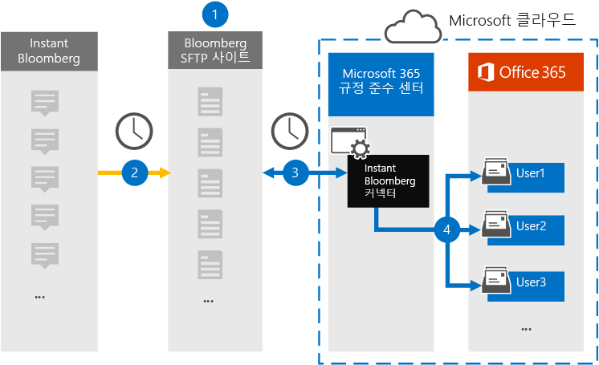

# Instant Bloomberg 데이터를 보관할 커넥터 설정Set up a connector to archive Instant Bloomberg data

Microsoft 365 준수 센터의 네이티브 커넥터를 사용 하 여 [인스턴트 Bloomberg](https://www.bloomberg.com/professional/product/collaboration/) 공동 작업 도구에서 금융 서비스 채팅 데이터를 가져오고 보관 합니다.Use a native connector in the Microsoft 365 compliance center to import and archive financial services chat data from the [Instant Bloomberg](https://www.bloomberg.com/professional/product/collaboration/) collaboration tool. 커넥터를 설정 하 고 구성한 후에는 조직에서 매월 Bloomberg 보안 FTP 사이트 (SFTP)에 연결 하 고 채팅 메시지의 콘텐츠를 전자 메일 메시지 형식으로 변환한 다음 해당 항목을 Microsoft 365의 사서함으로 가져옵니다.After you set up and configure a connector, it connects to your organization's Bloomberg secure FTP site (SFTP) once every day, converts the content of chat messages to an email message format, and then imports those items to mailboxes in Microsoft 365.

인스턴트 Bloomberg 데이터가 사용자 사서함에 저장 되 면 소송 보존, 콘텐츠 검색, 원본 위치 보관, 감사, 통신 준수 및 인스턴트 Bloomberg 데이터에 대 한 Microsoft 365 보존 정책 등의 Microsoft 365 준수 기능을 적용할 수 있습니다.After Instant Bloomberg data is stored in user mailboxes, you can apply Microsoft 365 compliance features such as Litigation Hold, Content Search, In-Place Archiving, Auditing, Communication compliance, and Microsoft 365 retention policies to Instant Bloomberg data. 예를 들어 콘텐츠 검색을 사용 하 여 인스턴트 Bloomberg 채팅 메시지를 검색 하거나, 고급 eDiscovery 사례의 custodian에 인스턴트 Bloomberg 데이터가 포함 된 사서함을 연결할 수 있습니다.For example, you can search Instant Bloomberg chat messages using Content Search or associate the mailbox that contains the Instant Bloomberg data with a custodian in an Advanced eDiscovery case. 인스턴트 Bloomberg 커넥터를 사용 하 여 Microsoft 365에서 데이터를 가져오고 보관 하면 조직이 정부 및 규정 정책을 준수 하는 데 도움이 될 수 있습니다.Using an Instant Bloomberg connector to import and archive data in Microsoft 365 can help your organization stay compliant with government and regulatory policies.

## 인스턴트 Bloomberg 데이터 보관 개요Overview of archiving Instant Bloomberg data

다음 개요에서는 커넥터를 사용 하 여 Microsoft 365에서 인스턴트 Bloomberg 채팅 데이터를 보관 하는 프로세스에 대해 설명 합니다.The following overview explains the process of using a connector to archive Instant Bloomberg chat data in Microsoft 365. 

1. 조직에서 Bloomberg를 사용 하 여 Bloomberg SFTP 사이트를 설정 합니다.Your organization works with Bloomberg to set up a Bloomberg SFTP site. 또한 Bloomberg을 사용 하 여 Bloomberg SFTP 사이트에 채팅 메시지를 복사 하도록 인스턴트 Bloomberg을 구성 합니다.You'll also work with Bloomberg to configure Instant Bloomberg to copy chat messages to your Bloomberg SFTP site.

2. 24 시간 마다 한 번씩 인스턴트 Bloomberg의 채팅 메시지가 Bloomberg SFTP 사이트로 복사 됩니다.Once every 24 hours, chat messages from Instant Bloomberg are copied to the Bloomberg SFTP site.
    
3. Microsoft 365 준수 센터에서 만든 인스턴트 Bloomberg 커넥터는 매일 Bloomberg SFTP 사이트에 연결 하 고 이전 24 시간에서 Microsoft 클라우드의 안전한 Azure Storage 영역으로 채팅 메시지를 전송 합니다.The Instant Bloomberg connector that you create in the Microsoft 365 compliance center connects to the Bloomberg SFTP site every day and transfers the chat messages from the previous 24 hours to a secure Azure Storage area in the Microsoft Cloud. 또한이 커넥터는 채팅 massage의 콘텐츠를 전자 메일 메시지 형식으로 변환 합니다.The connector also converts the content of a chat massage to an email message format.
    
4. 커넥터는 채팅 메시지 항목을 특정 사용자의 사서함으로 가져옵니다.The connector imports the chat message items to the mailbox of a specific user. InstantBloomberg 이라는 새 폴더가 특정 사용자의 사서함에 만들어지고이 폴더에 항목을 가져오게 됩니다.A new folder named InstantBloomberg will be created in the specific user's mailbox and the items will be imported to it. 커넥터는 *CorporateEmailAddress* 속성 값을 사용 하 여이를 수행 합니다.The connector does this by using the value of the *CorporateEmailAddress* property. 모든 채팅 메시지에는 채팅 메시지의 모든 참가자의 전자 메일 주소로 채워지는이 속성이 포함 되어 있습니다.Every chat message contains this property, which is populated with the email address of every participant of the chat message. *CorporateEmailAddress* 속성 값을 사용 하는 자동 사용자 매핑 외에도 CSV 매핑 파일을 업로드 하 여 사용자 지정 매핑을 정의할 수 있습니다.In addition to automatic user mapping using the value of the *CorporateEmailAddress* property, you can also define a custom mapping by uploading a CSV mapping file. 이 매핑 파일에는 각 사용자에 대 한 Bloomberg UUID 및 해당 Microsoft 365 사서함 주소가 포함 되어 있어야 합니다.This mapping file should contain a Bloomberg UUID and the corresponding Microsoft 365 mailbox address for each user. 자동 사용자 매핑을 사용 하도록 설정 하 고 사용자 지정 매핑을 제공 하는 경우, 모든 채팅 항목에 대해 커넥터는 먼저 사용자 지정 매핑 파일을 확인 합니다.If you enable automatic user mapping and provide a custom mapping, for every chat item the connector will first look at custom mapping file. 사용자의 Bloomberg UUID에 해당 하는 유효한 Microsoft 365 사용자를 찾지 못하면 커넥터는 채팅 항목의 *CorporateEmailAddress* 속성을 사용 합니다.If it doesn't find a valid Microsoft 365 user that corresponds to a user's Bloomberg UUID, the connector will use the *CorporateEmailAddress* property of the chat item. 커넥터가 사용자 지정 매핑 파일 또는 채팅 항목의 *CorporateEmailAddress* 속성에서 유효한 Microsoft 365 사용자를 찾지 못하면 항목을 가져오지 않습니다.If the connector doesn't find a valid Microsoft 365 user in either the custom mapping file or the *CorporateEmailAddress* property of the chat item, the item won't be imported.

## 시작하기 전에Before you begin

인스턴트 Bloomberg 데이터를 보관 하는 데 필요한 대부분의 구현 단계는 Microsoft 365 외부에 있으며, 준수 센터에서 커넥터를 만들기 전에 완료 되어야 합니다.Many of the implementation steps required to archive Instant Bloomberg data are external to Microsoft 365 and must be completed before you can create the connector in the compliance center.

- 조직에서는 Office 365 가져오기 서비스가 조직의 사서함 데이터에 액세스할 수 있도록 허용 해야 합니다.Your organization must consent to allow the Office 365 Import service to access mailbox data in your organization. 이 요청에 동의 하려면 [이 페이지로](https://login.microsoftonline.com/common/oauth2/authorize?client_id=570d0bec-d001-4c4e-985e-3ab17fdc3073&response_type=code&redirect_uri=https://portal.azure.com/&nonce=1234&prompt=admin_consent)이동 하 여 전역 관리자의 자격 증명으로 로그인 한 다음 요청을 수락 합니다.To consent to this request, go to [this page](https://login.microsoftonline.com/common/oauth2/authorize?client_id=570d0bec-d001-4c4e-985e-3ab17fdc3073&response_type=code&redirect_uri=https://portal.azure.com/&nonce=1234&prompt=admin_consent), sign in with the credentials of a global admin, and then accept the request. 3 단계에서 인스턴트 Bloomberg 커넥터를 성공적으로 만들기 전에이 단계를 완료 해야 합니다.You have to complete this step before you can successfully create the Instant Bloomberg connector in Step 3.

- [Bloomberg Anywhere](https://www.bloomberg.com/professional/product/remote-access/?bbgsum-page=DG-WS-PROF-PROD-BBA)를 구독 합니다.Subscribe to [Bloomberg Anywhere](https://www.bloomberg.com/professional/product/remote-access/?bbgsum-page=DG-WS-PROF-PROD-BBA). 이는 Bloomberg Anywhere에 로그인 하 여 설정 하 고 구성 해야 하는 Bloomberg SFTP 사이트에 액세스할 수 있도록 하는 데 필요 합니다.This is required so that you can log in to Bloomberg Anywhere to access the Bloomberg SFTP site that you have to set up and configure.

- Bloomberg SFTP (보안 파일 전송 프로토콜) 사이트를 설정 합니다.Set up a Bloomberg SFTP (Secure file transfer protocol) site. Bloomberg을 사용 하 여 SFTP 사이트를 설정한 후에는 인스턴트 Bloomberg의 데이터가 매일 SFTP 사이트로 업로드 됩니다.After working with Bloomberg to set up the SFTP site, data from Instant Bloomberg is uploaded to the SFTP site every day. 2 단계에서 만든 커넥터가이 SFTP 사이트에 연결 되 고 채팅 데이터를 Microsoft 365 사서함으로 전송 합니다.The connector you create in Step 2 connects to this SFTP site and transfers the chat data to Microsoft 365 mailboxes. 또한 SFTP는 전송 프로세스 중에 사서함으로 전송 되는 인스턴트 Bloomberg 채팅 데이터를 암호화 합니다.SFTP also encrypts the Instant Bloomberg chat data that is sent to mailboxes during the transfer process.

    Bloomberg SFTP에 대 한 자세한 내용은 *BB-sftp*라고도 합니다.For information about Bloomberg SFTP (also called *BB-SFTP*):

    - [Bloomberg 지원](https://www.bloomberg.com/professional/support/documentation/)에서 "SFTP 연결 표준" 문서를 참조 하세요.See the "SFTP Connectivity Standards" document at [Bloomberg Support](https://www.bloomberg.com/professional/support/documentation/).
    
    - [Bloomberg 고객 지원](https://service.bloomberg.com/portal/sessions/new?utm_source=bloomberg-menu&utm_medium=csc)에 문의 합니다.Contact [Bloomberg customer support](https://service.bloomberg.com/portal/sessions/new?utm_source=bloomberg-menu&utm_medium=csc).

    Bloomberg을 사용 하 여 SFTP 사이트를 설정한 후 Bloomberg에서는 Bloomberg 구현 전자 메일 메시지에 응답 한 후 몇 가지 정보를 제공 합니다.After you work with Bloomberg to set up an SFTP site, Bloomberg will provide some information to you after you respond to the Bloomberg implementation email message. 다음 정보의 복사본을 저장 합니다.Save a copy of the following information. 이 도구를 사용 하 여 3 단계에서 커넥터를 설정 합니다.You use it to set up a connector in Step 3.

    - 기업 코드-조직의 ID 이며 Bloomberg SFTP 사이트에 로그인 하는 데 사용 됩니다.Firm code, which is an ID for your organization and is used to log in to the Bloomberg SFTP site.

    - Bloomberg SFTP 사이트의 암호Password for your Bloomberg SFTP site

    - Bloomberg SFTP 사이트의 URL (예: sftp.bloomberg.com)URL for Bloomberg SFTP site (for example, sftp.bloomberg.com)

    - Bloomberg SFTP 사이트의 포트 번호Port number for Bloomberg SFTP site

- 3 단계에서 인스턴트 Bloomberg 커넥터를 만들고 1 단계에서 공개 키와 IP 주소를 다운로드 하는 사용자에 게 Exchange Online의 사서함 가져오기 내보내기 역할이 할당 되어야 합니다.The user who creates an Instant Bloomberg connector in Step 3 (and who downloads the public keys and IP address in Step 1) must be assigned the Mailbox Import Export role in Exchange Online. 이는 Microsoft 365 준수 센터의 **데이터 커넥터** 페이지에서 커넥터를 추가 하는 데 필요 합니다.This is required to add connectors in the **Data connectors** page in the Microsoft 365 compliance center. 기본적으로이 역할은 Exchange Online의 어떤 역할 그룹에도 할당되지 않습니다.By default, this role isn't assigned to any role group in Exchange Online. Exchange Online의 조직 관리 역할 그룹에 사서함 가져오기 내보내기 역할을 추가할 수 있습니다.You can add the Mailbox Import Export role to the Organization Management role group in Exchange Online. 또는 역할 그룹을 만들고 사서함 가져오기 내보내기 역할을 할당 한 다음 해당 사용자를 구성원으로 추가할 수 있습니다.Or you can create a role group, assign the Mailbox Import Export role, and then add the appropriate users as members. 자세한 내용은 "Exchange Online에서 역할 그룹 관리" 문서의 [역할 그룹 만들기](https://docs.microsoft.com/Exchange/permissions-exo/role-groups#create-role-groups) 또는 [역할 그룹 수정](https://docs.microsoft.com/Exchange/permissions-exo/role-groups#modify-role-groups) 섹션을 참조 하세요.For more information, see the [Create role groups](https://docs.microsoft.com/Exchange/permissions-exo/role-groups#create-role-groups) or [Modify role groups](https://docs.microsoft.com/Exchange/permissions-exo/role-groups#modify-role-groups) sections in the article "Manage role groups in Exchange Online".

## 1 단계: SSH 및 PGP 공개 키 획득Step 1: Obtain SSH and PGP public keys

첫 번째 단계는 SSH (Secure Shell) 용 공개 키와 PGP (매우 좋은 개인 정보)의 복사본을 가져오는 것입니다.The first step is to obtain a copy of the public keys for Secure Shell (SSH) and Pretty Good Privacy (PGP). 2 단계에서 이러한 키를 사용 하 여 3 단계에서 만든 커넥터에서 SFTP 사이트에 연결 하 고 인스턴트 Bloomberg 채팅 데이터를 Microsoft 365 사서함으로 전송 하도록 Bloomberg SFTP 사이트를 구성 합니다.You use these keys in Step 2 to configure the Bloomberg SFTP site to allow the connector (that you create in Step 3) to connect to the SFTP site and transfer the Instant Bloomberg chat data to Microsoft 365 mailboxes. 또한 Bloomberg SFTP 사이트를 구성할 때 사용 하는이 단계에서 IP 주소를 가져옵니다.You also obtain an IP address in this step, which you use when configuring the Bloomberg SFTP site.

1. 로 이동한 <https://compliance.microsoft.com> 후 **데이터 커넥터** > **인스턴트 Bloomberg**를 클릭 합니다.Go to <https://compliance.microsoft.com> and then click **Data connectors** > **Instant Bloomberg**.

2. **인스턴트 Bloomberg** 제품 설명 페이지에서 **커넥터 추가** 를 클릭 합니다.On the **Instant Bloomberg** product description page, click **Add connector**

3. **서비스 약관** 페이지에서 **수락**을 클릭 합니다.On the **Terms of service** page, click **Accept**.

4. 1 단계 아래에 있는 **BLOOMBERG SFTP에 대 한 자격 증명 추가 사이트** 에서 **SSH 키 다운로드**, **PGP 키**다운로드 및 **IP 주소 링크 다운로드** 를 클릭 하 여 각 파일의 복사본을 로컬 컴퓨터에 저장 합니다.On the **Add credentials for Bloomberg SFTP site** under step 1, click the **Download SSH key**, **Download PGP key**, and **Download IP address** links to save a copy of each file to your local computer. 이러한 파일에는 2 단계에서 Bloomberg SFTP 사이트를 구성 하는 데 사용 되는 다음과 같은 항목이 포함 되어 있습니다.These files contain the following items that are used to configure the Bloomberg SFTP site in Step 2:

   - SSH 공개 키:이 키는 커넥터가 Bloomberg SFTP 사이트에 연결 될 때 보안 원격 로그인을 사용 하도록 보안 셸 (SSH)을 구성 하는 데 사용 됩니다.SSH public key: This key is used to configure Secure Shell (SSH) to enable a secure remote login when the connector connects to the Bloomberg SFTP site.

   - PGP 공개 키:이 키는 Bloomberg SFTP 사이트에서 Microsoft 365로 전송 되는 데이터의 암호화를 구성 하는 데 사용 됩니다.PGP public key: This key is used to configure the encryption of data that's transferred from the Bloomberg SFTP site to Microsoft 365.

   - IP 주소: Bloomberg SFTP 사이트는 3 단계에서 만든 인스턴트 Bloomberg 커넥터에서 사용 하는이 IP 주소 로부터의 연결 요청만 수락 하도록 구성 됩니다.IP address: The Bloomberg SFTP site is configured to accept a connection request only from this IP address, which is used by the Instant Bloomberg connector that you create in Step 3. 

5. **취소** 를 클릭 하 여 마법사를 닫습니다.Click **Cancel** to close the wizard. 3 단계의이 마법사로 돌아와서 커넥터를 만듭니다.You come back to this wizard in Step 3 to create the connector.

## 2 단계: Bloomberg SFTP 사이트 구성Step 2: Configure the Bloomberg SFTP site

다음 단계에서는 1 단계에서 가져온 SSH 및 PGP 공개 키와 IP 주소를 사용 하 여 Bloomberg SFTP 사이트에 대 한 SSH 인증 및 PGP 암호화를 구성 합니다.The next step is to use the SSH and PGP public keys and the IP address that you obtained in Step 1 to configure SSH authentication and PGP encryption for the Bloomberg SFTP site. 이렇게 하면 3 단계에서 만든 인스턴트 Bloomberg 커넥터가 Bloomberg SFTP 사이트에 연결 하 고 인스턴트 Bloomberg 데이터를 Microsoft 365로 전송 합니다.This lets the Instant Bloomberg connector that you create in Step 3 connect to the Bloomberg SFTP site and transfer Instant Bloomberg data to Microsoft 365. Bloomberg SFTP 사이트를 설정 하려면 Bloomberg 고객 지원 서비스를 사용 해야 합니다.You need to work with Bloomberg customer support to set up your Bloomberg SFTP site. 지원 [Bloomberg 고객 지원](https://service.bloomberg.com/portal/sessions/new?utm_source=bloomberg-menu&utm_medium=csc) 에 문의 하세요.Contact [Bloomberg customer support](https://service.bloomberg.com/portal/sessions/new?utm_source=bloomberg-menu&utm_medium=csc) for assistance. 

> [!IMPORTANT]
> Bloomberg에서는 1 단계에서 다운로드 한 세 개의 파일을 전자 메일 메시지에 첨부 하 고이를 사용 하 여 Bloomberg SFTP 사이트를 설정 하는 경우 해당 문서를 고객 지원 팀으로 전송 하는 것이 좋습니다.Bloomberg recommends that you attach the three files that you downloaded in Step 1 to an email message and send it to their customer support team when working with them to set up your Bloomberg SFTP site.

## 3 단계: 인스턴트 Bloomberg 커넥터 만들기Step 3: Create an Instant Bloomberg connector

마지막 단계는 Microsoft 365 준수 센터에서 인스턴트 Bloomberg 커넥터를 만드는 것입니다.The last step is to create an Instant Bloomberg connector in the Microsoft 365 compliance center. 커넥터는 제공 하는 정보를 사용 하 여 Bloomberg SFTP 사이트에 연결 하 고 채팅 메시지를 Microsoft 365의 해당 사용자 사서함 상자로 전송 합니다.The connector uses the information you provide to connect to the Bloomberg SFTP site and transfer chat messages to the corresponding user mailbox boxes in Microsoft 365. 

1. 로 이동한 <https://compliance.microsoft.com> 후 **데이터 커넥터** > **인스턴트 Bloomberg**를 클릭 합니다.Go to <https://compliance.microsoft.com> and then click **Data connectors** > **Instant Bloomberg**.

2. **인스턴트 Bloomberg** 제품 설명 페이지에서 **커넥터 추가** 를 클릭 합니다.On the **Instant Bloomberg** product description page, click **Add connector**

3. **서비스 약관** 페이지에서 **수락**을 클릭 합니다.On the **Terms of service** page, click **Accept**.

4. **BLOOMBERG SFTP 사이트에 대 한 자격 증명 추가** 페이지의 3 단계에서 다음 상자에 필요한 정보를 입력 하 고 **다음**을 클릭 합니다.On the **Add credentials for Bloomberg SFTP site** page, under Step 3, enter the required information in the following boxes and then click **Next**.

    - **회사 코드:** Bloomberg SFTP 사이트의 사용자 이름으로 사용 되는 조직의 ID입니다.**Firm code:** The ID for your organization that is used as the username for the Bloomberg SFTP site.

    - **암호:** Bloomberg SFTP 사이트의 암호입니다.**Password:** Password for Bloomberg SFTP site.

    - **SFTP URL:** Bloomberg SFTP 사이트의 URL (예: sftp.bloomberg.com)입니다.**SFTP URL:** The URL for Bloomberg SFTP site (for example, sftp.bloomberg.com).

    - **SFTP 포트:** Bloomberg SFTP 사이트의 포트 번호입니다.**SFTP port:** The port number for Bloomberg SFTP site. 커넥터는이 포트를 사용 하 여 SFTP 사이트에 연결 합니다.The connector uses this port to connect to the SFTP site.

5. **사용자 매핑** 페이지에서 자동 사용자 매핑을 사용 하도록 설정 하 고 필요에 따라 사용자 지정 사용자 매핑을 제공 합니다.On the **User mapping** page, enable automatic user mapping and provide custom user mapping as required

   > [!NOTE]
   > 커넥터는 채팅 메시지 항목을 특정 사용자의 사서함으로 가져옵니다.The connector imports the chat message items to the mailbox of a specific user. **InstantBloomberg** 이라는 새 폴더가 특정 사용자의 사서함에 만들어지고이 폴더에 항목을 가져오게 됩니다.A new folder named **InstantBloomberg** will be created in the specific user's mailbox and the items will be imported to it. 커넥터에서 *CorporateEmailAddress* 속성 값을 사용 합니다.The connector does by using the value of the *CorporateEmailAddress* property. 모든 채팅 메시지에는이 속성이 포함 되며이 속성은 채팅 메시지의 모든 참가자의 전자 메일 주소로 채워집니다.Every chat message contains this property, and the property is populated with the email address of every participant of the chat message. *CorporateEmailAddress* 속성 값을 사용 하는 자동 사용자 매핑 외에도 CSV 매핑 파일을 업로드 하 여 사용자 지정 매핑을 정의할 수 있습니다.In addition to automatic user mapping using the value of the *CorporateEmailAddress* property, you can also define custom mapping by uploading a CSV mapping file. 매핑 파일에는 각 사용자에 대 한 Bloomberg UUID 및 해당 Microsoft 365 사서함 주소가 포함 되어 있어야 합니다.The mapping file should contain the Bloomberg UUID and corresponding Microsoft 365 mailbox address for each user. 자동 사용자 매핑을 사용 하도록 설정 하 고 사용자 지정 매핑 매핑을 제공 하는 경우 모든 채팅 항목에 대해 커넥터는 먼저 사용자 지정 매핑 파일을 확인 합니다.If you enable automatic user mapping and provide a custom mapping mapping, for every chat item the connector will first look at custom mapping file. 사용자의 Bloomberg UUID에 해당 하는 유효한 Microsoft 365 사용자를 찾지 못하면 커넥터는 채팅 항목의 *CorporateEmailAddress* 속성을 사용 합니다.If it doesn't find a valid Microsoft 365 user that corresponds to a user's Bloomberg UUID, the connector will use the *CorporateEmailAddress* property of the chat item. 커넥터가 사용자 지정 매핑 파일 또는 채팅 항목의 *CorporateEmailAddress* 속성에서 유효한 Microsoft 365 사용자를 찾지 못하면 항목을 가져오지 않습니다.If the connector doesn't find a valid Microsoft 365 user in either the custom mapping file or the *CorporateEmailAddress* property of the chat item, the item won't be imported.

6. **다음**을 클릭 하 고 설정을 검토 한 다음 **준비** 를 클릭 하 여 커넥터를 만듭니다.Click **Next**, review your settings, and then click **prepare** to create the connector.

7. **데이터 커넥터** 페이지로 이동 하 여 새 커넥터에 대 한 가져오기 프로세스의 진행 상황을 확인 합니다.Go to the **Data connectors** page to see the progress of the import process for the new connector.
