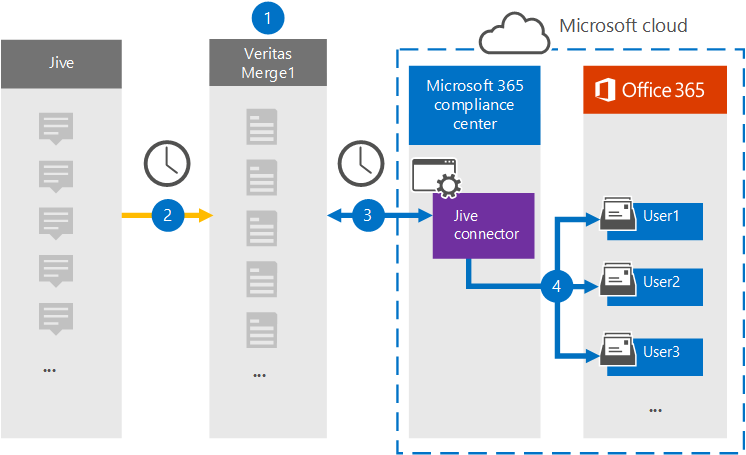

# Jive 데이터를 보관할 커넥터 설정Set up a connector to archive Jive data

Microsoft 365 규정 준수 센터의 Veritas 커넥터를 사용하여 공동 작업 플랫폼에서 조직의 사용자 사서함으로 데이터를 Microsoft 365 합니다.Use a Veritas connector in the Microsoft 365 compliance center to import and archive data from the collaboration platform to user mailboxes in your Microsoft 365 organization. Veritas는 타사 데이터 원본에서 항목을 캡처한 다음(정기적으로) 해당 항목을 가져오도록 구성된 [Jive](https://globanet.com/jive/) 커넥터를 Microsoft 365.Veritas provides a [Jive](https://globanet.com/jive/) connector that is configured to capture items from the third-party data source (on a regular basis) and then import those items to Microsoft 365. 커넥터는 전자 메일 메시지, 채팅 및 첨부 파일과 같은 콘텐츠를 사용자의 Jive 계정에서 전자 메일 메시지 형식으로 변환한 다음 해당 항목을 전자 메일 메시지의 사용자 사서함으로 Microsoft 365.The connector converts content such as email messages, chats, and attachments from a user's Jive account to an email message format and then imports those items to the user's mailbox in Microsoft 365.

Jive 데이터가 사용자 사서함에 저장되고 나면 소송 보존, Microsoft 365, 보존 정책 및 보존 레이블, 통신 준수와 같은 규정 준수 기능을 적용할 수 있습니다.After Jive data is stored in user mailboxes, you can apply Microsoft 365 compliance features such as Litigation Hold, eDiscovery, retention policies and retention labels, and communication compliance. Jive 커넥터를 사용하여 조직에서 데이터를 가져오고 Microsoft 365 정부 및 규정 정책을 준수하는 데 도움이 될 수 있습니다.Using a Jive connector to import and archive data in Microsoft 365 can help your organization stay compliant with government and regulatory policies.

## Jive 데이터 보관 개요Overview of archiving Jive data

다음 개요에서는 커넥터를 사용하여 Jive 데이터를 커넥터에 보관하는 Microsoft 365.The following overview explains the process of using a connector to archive the Jive data in Microsoft 365.

1. 조직은 Jive와 함께 Jive 사이트를 설정하고 구성합니다.Your organization works with Jive to set up and configure a Jive site.

2. 24시간마다 Jive의 항목이 Veritas Merge1 사이트에 복사됩니다.Once every 24 hours, items from Jive are copied to the Veritas Merge1 site. 또한 커넥터는 Jive 항목의 콘텐츠를 전자 메일 메시지 형식으로 변환합니다.The connector also converts the content of Jive items to an email message format.

3. Microsoft 365 준수 센터에서 만드는 Jive 커넥터는 매일 Veritas Merge1 사이트에 연결하고 콘텐츠를 Microsoft 클라우드의 안전한 Azure Storage 위치로 전송합니다.The Jive connector that you create in the Microsoft 365 compliance center connects to the Veritas Merge1 site every day and transfers the content to a secure Azure Storage location in the Microsoft cloud.

4. 커넥터는 3단계에 설명된 자동 사용자 매핑의 *Email* 속성 값을 사용하여 변환된 항목을 특정 사용자의 사서함으로 [가져올 수 있습니다.](#step-3-map-users-and-complete-the-connector-setup)The connector imports the converted items to the mailboxes of specific users by using the value of the *Email* property of the automatic user mapping as described in [Step 3](#step-3-map-users-and-complete-the-connector-setup). 받은 편지함 폴더 **Jive의** 새 하위 폴더가 사용자 사서함에 만들어지며 해당 폴더로 항목이 가져오기됩니다.A new subfolder in the Inbox folder named **Jive** is created in the user mailboxes, and the items are imported to that folder. 이 커넥터는 Email 속성 값을 사용하여 이 *기능을* 실행합니다.The connector does this by using the value of the *Email* property. 모든 Jive 항목에는 항목의 모든 참가자의 전자 메일 주소로 채워지는 이 속성이 포함되어 있습니다.Every Jive item contains this property, which is populated with the email address of every participant of the item.

## 시작하기 전에Before you begin

- Microsoft 커넥터에 대한 Veritas Merge1 계정을 생성합니다.Create a Veritas Merge1 account for Microsoft connectors. 이 계정을 만들하려면 [Veritas 고객 지원에 문의하세요.](https://www.veritas.com/content/support/)To create this account, contact [Veritas Customer Support](https://www.veritas.com/content/support/). 1단계에서 커넥터를 만들 때 이 계정에 로그인합니다.You will sign into this account when you create the connector in Step 1.

- 1단계에서 Jive 커넥터를 만들고 3단계에서 완료하는 사용자는 2단계에서 사서함 가져오기 내보내기 역할에 할당해야 Exchange Online.The user who creates the Jive connector in Step 1 (and completes it in Step 3) must be assigned to the Mailbox Import Export role in Exchange Online. 이 역할은 준수 센터의  데이터 커넥터 페이지에서 커넥터를 Microsoft 365 필요합니다.This role is required to add connectors on the **Data connectors** page in the Microsoft 365 compliance center. 기본적으로 이 역할은 역할 그룹의 역할 그룹에 할당되지 Exchange Online.By default, this role is not assigned to a role group in Exchange Online. 사서함 가져오기 내보내기 역할을 조직의 조직 관리 역할 그룹에 추가할 수 Exchange Online.You can add the Mailbox Import Export role to the Organization Management role group in Exchange Online. 또는 역할 그룹을 만들고 사서함 가져오기 내보내기 역할을 할당한 다음 해당 사용자를 구성원으로 추가할 수 있습니다.Or you can create a role group, assign the Mailbox Import Export role, and then add the appropriate users as members. 자세한 내용은 "역할  그룹에서  역할 그룹 관리" 문서의 역할 그룹 만들기 또는 역할 그룹 수정 섹션을 Exchange Online.For more information, see the [Create role groups](/Exchange/permissions-exo/role-groups#create-role-groups) or [Modify role groups](/Exchange/permissions-exo/role-groups#modify-role-groups) sections in the article "Manage role groups in Exchange Online".

## 1단계: Jive 커넥터 설정Step 1: Set up the Jive connector

첫 번째 단계는 규정  준수 센터의 데이터 커넥터 페이지에 액세스하고 Microsoft 365 대한 커넥터를 만드는 것입니다.The first step is to access to the **Data Connectors** page in the Microsoft 365 compliance center and create a connector for Jive data.

1. 으로 [https://compliance.microsoft.com](https://compliance.microsoft.com/) 이동한 다음 **데이터** 커넥터  >  **Jive를 클릭합니다.**Go to [https://compliance.microsoft.com](https://compliance.microsoft.com/) and then click **Data connectors** > **Jive**.

2. **Jive 제품 설명** 페이지에서 커넥터 **추가를 클릭합니다.**On the **Jive** product description page, click **Add connector**.

3. 서비스 **약관 페이지에서** 동의를 **클릭합니다.**On the **Terms of service** page, click **Accept**.

4. 커넥터를 식별하는 고유한 이름을 입력하고 다음 을 **클릭합니다.**Enter a unique name that identifies the connector, and then click **Next**.

5. Merge1 계정에 로그인하여 커넥터를 구성합니다.Sign in to your Merge1 account to configure the connector.

## 2단계: Jive 커넥터 구성Step 2: Configure the Jive connector

두 번째 단계는 Merge1 사이트에서 Jive 커넥터를 구성하는 것입니다.The second step is to configure the Jive connector on the Merge1 site. Jive 커넥터를 구성하는 방법에 대한 자세한 내용은 [Merge1 Third-Party Connectors User Guide를 참조하십시오.](https://docs.ms.merge1.globanetportal.com/Merge1%20Third-Party%20Connectors%20Jive%20User%20Guide.pdf)For information about how to configure the Jive connector, see [Merge1 Third-Party Connectors User Guide](https://docs.ms.merge1.globanetportal.com/Merge1%20Third-Party%20Connectors%20Jive%20User%20Guide.pdf).

저장 및 & **마친** 후  준수 센터의 커넥터 마법사에 Microsoft 365 페이지가 표시됩니다.After you click **Save & Finish**, the **User mapping** page in the connector wizard in the Microsoft 365 compliance center is displayed.

## 3단계: 사용자 매핑 및 커넥터 설정 완료Step 3: Map users and complete the connector setup

사용자를 매핑하고 Microsoft 365 준수 센터에서 커넥터 설정을 완료하려면 다음 단계를 따릅니다.To map users and complete the connector setup in the Microsoft 365 compliance center, follow the steps below:

1. Jive 사용자를 사용자 Microsoft 365 **매핑 페이지에서** 자동 사용자 매핑을 사용하도록 설정합니다.On the **Map Jive users to Microsoft 365 users** page, enable automatic user mapping. Jive 항목에는 조직의 사용자에 대한 전자 메일 주소가 포함된 *Email이라는* 속성이 포함되어 있습니다.The Jive items include a property called *Email*, which contains email addresses for users in your organization. 커넥터가 이 주소를 Microsoft 365 사용자 사서함으로 항목을 가져올 수 있습니다.If the connector can associate this address with a Microsoft 365 user, the items are imported to that user's mailbox.

2. **다음을** 클릭하고 설정을 검토하고  데이터 커넥터 페이지로 이동하여 새 커넥터의 가져오기 프로세스 진행률을 확인합니다.Click **Next**, review your settings, and go to the **Data connectors** page to see the progress of the import process for the new connector.

## 4단계: Jive 커넥터 모니터링Step 4: Monitor the Jive connector

Jive 커넥터를 만든 후 규정 준수 센터에서 커넥터 상태를 Microsoft 365 있습니다.After you create the Jive connector, you can view the connector status in the Microsoft 365 compliance center.

1. 으로 [https://compliance.microsoft.com](https://compliance.microsoft.com) 이동하여 왼쪽 **nav에서 데이터** 커넥터를 클릭합니다.Go to [https://compliance.microsoft.com](https://compliance.microsoft.com) and click **Data connectors** in the left nav.

2. 커넥터 **탭을** 클릭한 다음 **Jive** 커넥터를 선택하여 플라이아웃 페이지를 표시합니다.Click the **Connectors** tab and then select the **Jive** connector to display the flyout page. 이 페이지에는 커넥터에 대한 속성과 정보가 포함되어 있습니다.This page contains the properties and information about the connector.

3. 원본이 있는 커넥터 상태  **아래에서** 로그 다운로드 링크를 클릭하여 커넥터의 상태 로그를 열거나 저장합니다.Under **Connector status with source**, click the **Download log** link to open (or save) the status log for the connector. 이 로그에는 Microsoft 클라우드로 가져온 데이터에 대한 정보가 포함되어 있습니다.This log contains information about the data that has been imported to the Microsoft cloud.

## 알려진 문제Known issues

- 현재는 10MB보다 큰 첨부 파일 또는 항목 가져오기는 지원되지 않습니다.At this time, we don't support importing attachments or items that are larger than 10 MB. 더 큰 항목에 대한 지원은 나중에 사용할 수 있습니다.Support for larger items will be available at a later date.