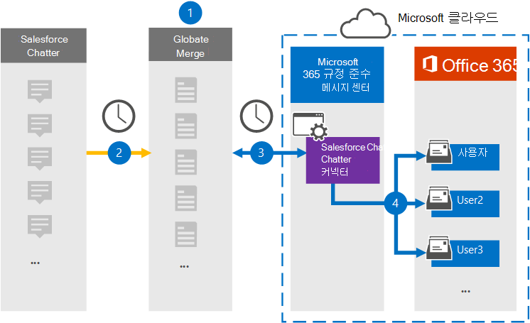

# Salesforce Chatter 데이터를 보관할 커넥터 설정Set up a connector to archive Salesforce Chatter data

Microsoft 365 규정 준수 센터의 Globanet 커넥터를 사용하여 Salesforce Chatter 플랫폼에서 Microsoft 365 조직의 사용자 사서함으로 데이터를 가져오고 보관합니다.Use a Globanet connector in the Microsoft 365 compliance center to import and archive data from the Salesforce Chatter platform to user mailboxes in your Microsoft 365 organization. Globanet은 타사 데이터 원본의 항목을 캡처하고 해당 항목을 Microsoft 365로 가져오는 [Salesforce Chatter](http://globanet.com/chatter/) 커넥터를 제공합니다.Globanet provides a [Salesforce Chatter](http://globanet.com/chatter/) connector that captures items from the third-party data source and imports those items to Microsoft 365. 커넥터는 채팅, 첨부 파일 및 게시물과 같은 콘텐츠를 Salesforce Chatter에서 전자 메일 메시지 형식으로 변환한 다음 이러한 항목을 Microsoft 365의 사용자 사서함으로 가져올 수 있습니다.The connector converts the content such as chats, attachments, and posts from Salesforce Chatter to an email message format and then imports those items to the user’s mailbox in Microsoft 365.

Salesforce Chatter 데이터가 사용자 사서함에 저장되고 나면 소송 보존, eDiscovery, 보존 정책 및 보존 레이블과 같은 Microsoft 365 규정 준수 기능을 적용할 수 있습니다.After Salesforce Chatter data is stored in user mailboxes, you can apply Microsoft 365 compliance features such as Litigation Hold, eDiscovery, retention policies and retention labels. Salesforce Chatter 커넥터를 사용하여 Microsoft 365에서 데이터를 가져오고 보관하면 조직이 정부 및 규제 정책을 준수하는 데 도움이 될 수 있습니다.Using a Salesforce Chatter connector to import and archive data in Microsoft 365 can help your organization stay compliant with government and regulatory policies.

## Salesforce Chatter 데이터 보관 개요Overview of archiving Salesforce Chatter data

다음 개요에서는 커넥터를 사용하여 Microsoft 365에서 Salesforce Chatter 데이터를 보관하는 프로세스에 대해 설명합니다.The following overview explains the process of using a connector to archive the Salesforce Chatter data in Microsoft 365.

1. 조직은 Salesforce Chatter와 함께 Salesforce Chatter 사이트를 설정하고 구성합니다.Your organization works with Salesforce Chatter to set up and configure a Salesforce Chatter site.

2. 24시간마다 Salesforce Chatter 항목이 Globanet Merge1 사이트에 복사됩니다.Once every 24 hours, Salesforce Chatter items are copied to the Globanet Merge1 site. 또한 이 커넥터는 Salesforce Chatter 항목을 전자 메일 메시지 형식으로 변환합니다.The connector also Salesforce Chatter items to an email message format.

3. Microsoft 365 규정 준수 센터에서 만든 Salesforce Chatter 커넥터는 매일 Globanet Merge1 사이트에 연결하고 Microsoft 클라우드의 보안 Azure Storage 위치로 Chatter 콘텐츠를 전송합니다.The Salesforce Chatter connector that you create in the Microsoft 365 compliance center, connects to the Globanet Merge1 site every day and transfers the Chatter content to a secure Azure Storage location in the Microsoft cloud.

4. 커넥터는 3단계에 설명된 자동 사용자 매핑의 *Email* 속성 값을 사용하여 변환된 항목을 특정 사용자의 사서함으로 [가져올 수 있습니다.](#step-3-map-users-and-complete-the-connector-setup)The connector imports the converted items to the mailboxes of specific users using the value of the *Email* property of the automatic user mapping as described in [Step 3](#step-3-map-users-and-complete-the-connector-setup). **Salesforce Chatter라는** 받은 편지함 폴더의 하위 폴더가 사용자 사서함에 만들어지며 항목을 해당 폴더로 가져올 수 있습니다.A subfolder in the Inbox folder named **Salesforce Chatter** is created in the user mailboxes, and items are imported to that folder. 커넥터는 Email 속성 값을 사용하여 항목을 가져올 사서함을 결정할 *수* 있습니다.The connector determines which mailbox to import items to by using the value of the *Email* property. 모든 Chatter 항목에는 항목의 모든 참가자의 전자 메일 주소로 채워지는 이 속성이 포함되어 있습니다.Every Chatter item contains this property, which is populated with the email address of every participant of the item.

## 시작하기 전에Before you begin

- Microsoft 커넥터에 대한 Merge1 계정을 만드시다.Create a Merge1 account for Microsoft connectors. 계정을 만들 경우 [Globanet 고객](https://globanet.com/contact-us/)지원에 문의하세요.To create an account, contact [Globanet Customer Support](https://globanet.com/contact-us/). 1단계에서 커넥터를 만들 때 이 계정에 로그인해야 합니다.You need to sign into this account when you create the connector in Step 1.

- Salesforce 응용 프로그램을 만들고 에서 토큰을 [https://salesforce.com](https://salesforce.com) 취득합니다.Create a Salesforce application and acquire a token at [https://salesforce.com](https://salesforce.com). 관리자로 Salesforce 계정에 로그인하고 데이터를 가져오기 위해 사용자 개인 토큰을 가져와야 합니다.You'll need to log into the Salesforce account as an admin and get a user personal token to import data. 또한 업데이트, 삭제 및 편집을 캡처하려면 트리거를 Chatter 사이트에 게시해야 합니다.Also, triggers need to be published on the Chatter site to capture updates, deletes, and edits. 이러한 트리거는 채널에 게시물을 만들고 Merge1은 채널의 정보를 캡처합니다.These triggers will create a post on a channel, and Merge1 will capture the information from the channel. 응용 프로그램을 만들고 토큰을 획득하는 방법에 대한 단계별 지침은 [Merge1 Third-Party Connectors 사용자 가이드를 참조하십시오.](https://docs.ms.merge1.globanetportal.com/Merge1%20Third-Party%20Connectors%20SalesForce%20Chatter%20User%20Guide%20.pdf)For step-by-step instructions about how to create the application and acquire the token, see [Merge1 Third-Party Connectors User Guide](https://docs.ms.merge1.globanetportal.com/Merge1%20Third-Party%20Connectors%20SalesForce%20Chatter%20User%20Guide%20.pdf).

- 1단계에서 Salesforce Chatter 커넥터를 만들고 3단계에서 완료하는 사용자는 Exchange Online의 사서함 가져오기 내보내기 역할에 할당되어야 합니다.The user who creates the Salesforce Chatter connector in Step 1 (and completes it in Step 3) must be assigned to the Mailbox Import Export role in Exchange Online. 이 역할은 Microsoft 365 규정 준수 센터의 데이터 커넥터 페이지에서 커넥터를 추가하는 데 필요합니다. This role is required to add connectors on the **Data connectors** page in the Microsoft 365 compliance center. 기본적으로 이 역할은 Exchange Online의 역할 그룹에 할당되지 않습니다.By default, this role isn’t assigned to any role group in Exchange Online. Exchange Online의 조직 관리 역할 그룹에 사서함 가져오기 내보내기 역할을 추가할 수 있습니다.You can add the Mailbox Import Export role to the Organization Management role group in Exchange Online. 또는 역할 그룹을 만들고 사서함 가져오기 내보내기 역할을 할당한 다음 해당 사용자를 구성원으로 추가할 수 있습니다.Or you can create a role group, assign the Mailbox Import Export role, and then add the appropriate users as members. 자세한 내용은 "Exchange  Online에서  역할 그룹 관리" 문서의 역할 그룹 만들기 또는 역할 그룹 수정 섹션을 참조하십시오.For more information, see the [Create role groups](https://docs.microsoft.com/Exchange/permissions-exo/role-groups#create-role-groups) or [Modify role groups](https://docs.microsoft.com/Exchange/permissions-exo/role-groups#modify-role-groups) sections in the article "Manage role groups in Exchange Online".

## 1단계: Salesforce Chatter 커넥터 설정Step 1: Set up the Salesforce Chatter connector

첫 번째 단계는 Microsoft  365 규정 준수 센터의 데이터 커넥터 페이지에 액세스하고 Chatter 데이터에 대한 커넥터를 만드는 것입니다.The first step is to access to the **Data Connectors** page in the Microsoft 365 compliance center and create a connector for Chatter data.

1. Go to [https://compliance.microsoft.com](https://compliance.microsoft.com/) and then click Data **connectors**  >  **Salesforce Chatter.**Go to [https://compliance.microsoft.com](https://compliance.microsoft.com/) and then click **Data connectors** > **Salesforce Chatter**.

2. **Salesforce Chatter** 제품 설명 페이지에서 커넥터 **추가를 클릭합니다.**On the **Salesforce Chatter** product description page, click **Add connector**.

3. 서비스 약관 **페이지에서** 수락을 **클릭합니다.**On the **Terms of service** page, click **Accept**.

4. 커넥터를 식별하는 고유한 이름을 입력하고 다음을 **클릭합니다.**Enter a unique name that identifies the connector, and then click **Next**.

5. Merge1 계정에 로그인하여 커넥터를 구성합니다.Sign in to your Merge1 account to configure the connector.

## 2단계: Globanet Merge1 사이트에서 Salesforce Chatter 구성Step 2: Configure the Salesforce Chatter on the Globanet Merge1 site

두 번째 단계는 Globanet Merge1 사이트에서 Salesforce Chatter 커넥터를 구성하는 것입니다.The second step is to configure the Salesforce Chatter connector on the Globanet Merge1 site. Salesforce Chatter 커넥터를 구성하는 방법에 대한 자세한 내용은 [Merge1 Third-Party Connectors 사용자 가이드를 참조하십시오.](https://docs.ms.merge1.globanetportal.com/Merge1%20Third-Party%20Connectors%20SalesForce%20Chatter%20User%20Guide%20.pdf)For information about how to configure the Salesforce Chatter connector, see [Merge1 Third-Party Connectors User Guide](https://docs.ms.merge1.globanetportal.com/Merge1%20Third-Party%20Connectors%20SalesForce%20Chatter%20User%20Guide%20.pdf).

저장 **&** 마친 후 Microsoft  365 준수 센터의 커넥터 마법사에 사용자 매핑 페이지가 표시됩니다.After you click **Save & Finish,** the **User mapping** page in the connector wizard in the Microsoft 365 compliance center is displayed.

## 3단계: 사용자 매핑 및 커넥터 설정 완료Step 3: Map users and complete the connector setup

사용자를 매핑하고 Microsoft 365 규정 준수 센터에서 커넥터 설정을 완료하려면 다음 단계를 수행합니다.To map users and complete the connector setup in the Microsoft 365 compliance center, follow these steps:

1. Microsoft **365 사용자에 대한 Salesforce Chatter** 사용자 매핑 페이지에서 자동 사용자 매핑을 사용하도록 설정합니다.On the **Map Salesforce Chatter users to Microsoft 365 users** page, enable automatic user mapping. Salesforce Chatter 항목에는 조직의 사용자에 대한 전자 메일 주소가 포함된 *Email이라는* 속성이 포함됩니다.The Salesforce Chatter items include a property called *Email*, which contains email addresses for users in your organization. 커넥터가 이 주소를 Microsoft 365 사용자와 연결하면 항목이 해당 사용자의 사서함으로 가져오기됩니다.If the connector can associate this address with a Microsoft 365 user, the items are imported to that user’s mailbox.

2. 다음을 **클릭하고** 설정을 검토한 다음  데이터 커넥터 페이지로 이동하여 새 커넥터의 가져오기 프로세스 진행률을 확인합니다.click **Next**, review your settings, and then go to the **Data connectors** page to see the progress of the import process for the new connector.

## 4단계: Salesforce Chatter 커넥터 모니터링Step 4: Monitor the Salesforce Chatter connector

Salesforce Chatter 커넥터를 만든 후 Microsoft 365 준수 센터에서 커넥터 상태를 볼 수 있습니다.After you create the Salesforce Chatter connector, you can view the connector status in the Microsoft 365 compliance center.

1. Go to [https://compliance.microsoft.com](https://compliance.microsoft.com/) and click **Data connectors** in the left nav.Go to [https://compliance.microsoft.com](https://compliance.microsoft.com/) and click **Data connectors** in the left nav.

2. 커넥터 **탭을** 클릭한 다음 **Salesforce Chatter** 커넥터를 클릭하여 커넥터에 대한 속성과 정보가 포함된 플라이아웃 페이지를 표시합니다.click the **Connectors** tab and then click the **Salesforce Chatter** connector to display the flyout page, which contains the properties and information about the connector.

3. 원본이 **있는 커넥터** 상태  아래에서 다운로드 로그 링크를 클릭하여 커넥터의 상태 로그를 열거나 저장합니다.Under **Connector status with source**, click the **Download log** link to open (or save) the status log for the connector. 이 로그에는 Microsoft 클라우드로 가져온 데이터가 포함되어 있습니다.This log contains data that's been imported to the Microsoft cloud.

## 알려진 문제Known issues

- 현재는 10MB보다 큰 첨부 파일 또는 항목 가져오기는 지원되지 않습니다.At this time, we don't support importing attachments or items that are larger than 10 MB. 더 큰 항목에 대한 지원은 나중에 사용할 수 있습니다.Support for larger items will be available at a later date.
